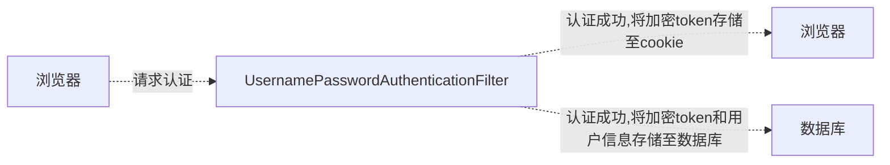

[TOC]

# 简介

Spring 是非常流行和成功的 Java 应用开发框架，Spring Security正是Spring家族中的成员。Spring Security 基于 Spring 框架，提供了一套 Web 应用安全性的完整解决方案。

正如你可能知道的关于安全方面的两个主要区域是“认证”和“授权”（或者访问控制），一般来说，Web 应用的安全性包括用户认证（Authentication）和用户授权（Authorization）两个部分，这两点也是Spring Security重要核心功能。

- 用户认证指的是：验证某个用户是否为系统中的合法主体，也就是说用户能否访问该系统。用户认证一般要求用户提供用户名和密码。系统通过校验用户名和密码来完成认证过程
- 用户授权指的是验证某个用户是否有权限执行某个操作。在一个系统中，不同用户所具有的权限是不同的。比如对一个文件来说，有的用户只能进行读取，而有的用户可以进行修改。一般来说，系统会为不同的用户分配不同的角色，而每个角色则对应一系列的权限

同类产品比较

Sa-Token

1. 简单易用：Sa-Token提供了简洁的API和灵活的配置，使用起来非常方便。开发人员可以快速集成Sa-Token到Java应用程序中，并通过简单的代码实现认证和授权的功能。
2. 多种认证方式：Sa-Token支持多种认证方式，包括基于Token的无状态认证、基于Session的有状态认证、Cookie认证等。开发人员可以根据需求选择适合的认证方式。
3. 多种授权方式：Sa-Token支持基于角色、权限的授权方式，可以灵活地定义用户的访问权限。同时，Sa-Token还提供了注解式的权限控制，可以在方法或类级别上进行权限控制。
4. 高性能：Sa-Token在设计上注重性能优化，采用了缓存和索引等技术来提高认证和授权的效率。同时，Sa-Token还支持分布式环境下的会话管理，保证了系统的可扩展性和高并发性能。
5. 安全可靠：Sa-Token提供了密码加密、防止重放攻击、防止会话固定攻击等安全机制，保障了系统的安全性。同时，Sa-Token还支持黑名单机制，可以在运行时动态地禁止某些Token的访问。
6. 开放源代码：Sa-Token是一个开源项目，代码托管在GitHub上，任何人都可以查看和参与项目的开发。这也意味着开发人员可以根据自己的需求进行定制和扩展。

Spring Security 特点

- 和Spring无缝整合
- 全面的权限控制
- 专门为Web开发而设计
    - 旧版本不能脱离Web环境使用
    - 新版本对整个框架进行了分层抽取，分成了核心模块和Web模块。单独引入核心模块就可以脱离Web环境。
- 重量级

Apache Shiro

- 轻量级。Shiro主张的理念是把复杂的事情变简单。针对对性能有更高要求的互联网应用有更好表现
- 通用
    - 好处：不局限于Web环境，可以脱离Web环境使用。
    - 缺陷：在Web环境下一些特定的需求需要手动编写代码定制。

Spring Security 是 Spring 家族中的一个安全管理框架，实际上，在 Spring Boot 出现之前，Spring Security 就已经发展了多年了，但是使用的并不多，安全管理这个领域，一直是 Shiro 的天下。 

相对于 Shiro，在 SSM 中整合 Spring Security 都是比较麻烦的操作，所以，Spring Security 虽然功能比 Shiro 强大，但是使用反而没有 Shiro 多（Shiro 虽然功能没有 Spring Security 多，但是对于大部分项目而言，Shiro 也够用了）。 

自从有了 Spring Boot 之后，Spring Boot 对于 Spring Security 提供了自动化配置方案，可以使用更少的配置来使用 Spring Security。

因此，一般来说，常见的安全管理技术栈的组合是这样的：

- SSM + Shiro
- Spring Boot/Spring Cloud + Spring Security

以上只是一个推荐的组合而已，如果单纯从技术上来说，无论怎么组合，都是可以运行的

Sa-Token
**优点：**
- 简单易用：Sa-Token提供了简洁的API和灵活的配置，使用起来非常方便。
- 高性能：Sa-Token在设计上注重性能优化，采用了缓存和索引等技术来提高认证和授权的效率。
- 多认证方式：支持多种认证方式，包括基于Token的无状态认证、基于Session的有状态认证、Cookie认证等。
- 多授权方式：支持基于角色、权限的授权方式，并提供了注解式的权限控制。
- 安全可靠：提供了密码加密、防止重放攻击、防止会话固定攻击等安全机制。
**缺点：**
- 社区相对较小：相比于Spring Security和Apache Shiro，Sa-Token的用户群体和社区相对较小，可能会影响到获取支持和解决问题的效率。

Spring Security
**优点：**
- 功能强大：Spring Security是一个功能强大的安全框架，提供了完整的身份认证和授权功能。
- 与Spring集成：可以与Spring框架无缝集成，方便在Spring应用程序中使用。
- 大型社区：Spring Security拥有庞大的用户群体和活跃的社区，可以获取丰富的文档和支持。
**缺点：**
- 学习曲线陡峭：Spring Security的配置相对复杂，学习曲线较陡，对新手来说可能需要一定时间去掌握。
- 配置繁琐：由于提供了大量的功能和配置选项，配置文件可能会变得复杂。

Apache Shiro
**优点：**
- 简单易用：Shiro是一个简单而灵活的安全框架，提供了易于使用的API和灵活的配置选项。
- 多功能：除了身份认证和授权外，还提供了会话管理、密码加密等功能。
- 安全可靠：提供了多种安全机制，保障系统的安全性。
**缺点：**
- 功能相对较少：相比于Spring Security，Shiro的功能相对较少，可能无法满足一些复杂的安全需求。
- 社区相对较小：Shiro的用户群体和社区相对较小，可能会影响到获取支持和解决问题的效率。


# Spring Security

新建一个 spring boot 项目

pom.xml

```xml
<?xml version="1.0" encoding="UTF-8"?>

<project xmlns="http://maven.apache.org/POM/4.0.0" xmlns:xsi="http://www.w3.org/2001/XMLSchema-instance"
         xsi:schemaLocation="http://maven.apache.org/POM/4.0.0 http://maven.apache.org/xsd/maven-4.0.0.xsd">
    <modelVersion>4.0.0</modelVersion>

    <parent>
        <groupId>org.springframework.boot</groupId>
        <artifactId>spring-boot-starter-parent</artifactId>
        <version>2.2.1.RELEASE</version>
    </parent>

    <groupId>org.example</groupId>
    <artifactId>spring-security-HelowWorld</artifactId>
    <version>1.0-SNAPSHOT</version>

    <name>spring-security-HelowWorld</name>

    <properties>
        <project.build.sourceEncoding>UTF-8</project.build.sourceEncoding>
        <maven.compiler.source>1.8</maven.compiler.source>
        <maven.compiler.target>1.8</maven.compiler.target>
    </properties>

    <dependencies>
        <dependency>
            <groupId>org.springframework.boot</groupId>
            <artifactId>spring-boot-starter-web</artifactId>
        </dependency>
        <dependency>
            <groupId>org.springframework.boot</groupId>
            <artifactId>spring-boot-starter-security</artifactId>
        </dependency>
    </dependencies>

    <build>
        <pluginManagement><!-- lock down plugins versions to avoid using Maven defaults (may be moved to parent pom) -->
            <plugins>
                <!-- clean lifecycle, see https://maven.apache.org/ref/current/maven-core/lifecycles.html#clean_Lifecycle -->
                <plugin>
                    <artifactId>maven-clean-plugin</artifactId>
                    <version>3.1.0</version>
                </plugin>
                <!-- default lifecycle, jar packaging: see https://maven.apache.org/ref/current/maven-core/default-bindings.html#Plugin_bindings_for_jar_packaging -->
                <plugin>
                    <artifactId>maven-resources-plugin</artifactId>
                    <version>3.0.2</version>
                </plugin>
                <plugin>
                    <artifactId>maven-compiler-plugin</artifactId>
                    <version>3.8.0</version>
                </plugin>
                <plugin>
                    <artifactId>maven-surefire-plugin</artifactId>
                    <version>2.22.1</version>
                </plugin>
                <plugin>
                    <artifactId>maven-jar-plugin</artifactId>
                    <version>3.0.2</version>
                </plugin>
                <plugin>
                    <artifactId>maven-install-plugin</artifactId>
                    <version>2.5.2</version>
                </plugin>
                <plugin>
                    <artifactId>maven-deploy-plugin</artifactId>
                    <version>2.8.2</version>
                </plugin>
                <!-- site lifecycle, see https://maven.apache.org/ref/current/maven-core/lifecycles.html#site_Lifecycle -->
                <plugin>
                    <artifactId>maven-site-plugin</artifactId>
                    <version>3.7.1</version>
                </plugin>
                <plugin>
                    <artifactId>maven-project-info-reports-plugin</artifactId>
                    <version>3.0.0</version>
                </plugin>
            </plugins>
        </pluginManagement>
    </build>
</project>
```

application.properties

```properties
server.port=8111
```

TestController

```java

import org.springframework.web.bind.annotation.GetMapping;
import org.springframework.web.bind.annotation.RequestMapping;
import org.springframework.web.bind.annotation.RestController;

@RestController
@RequestMapping("/test")
public class TestController {

    @GetMapping("hello")
    public String hello() {
        return "hello security";
    }
    
}
```

启动类 TestSecurityApplication

```java
import org.springframework.boot.SpringApplication;
import org.springframework.boot.autoconfigure.SpringBootApplication;

@SpringBootApplication
public class TestSecurityApplication {

    public static void main(String[] args) {
        SpringApplication.run(TestSecurityApplication.class, args);
    }

}
```

可选的添加配置类

```java
@Configuration
public class SecurityConfig extends WebSecurityConfigurerAdapter {

    @Override
    protected void configure(HttpSecurity http) throws Exception {
        http.formLogin() // 表单登录
                .and().authorizeRequests() // 认证配置
                .anyRequest() // 任何请求
                .authenticated(); // 都需要身份验证
    }

}
```

访问 http://localhost:8111/test/hello 发现自动跳转至 http://localhost:8111/login 登录页面，说明 Spring Security 已配置生效

默认用户 user 密码在启动时由控制台打印

```
Using generated security password: 9377fbb3-f9be-4fde-98d9-0d956be21cc7
```

登录后才可访问原始页面

# 基本原理

SpringSecurity 采用的是责任链的设计模式，它有一条很长的过滤器链。


重点看三个过滤器

FilterSecurityInterceptor：是一个方法级的权限过滤器, 基本位于过滤链的最底部，负责权限校验。
ExceptionTranslationFilter：是个异常过滤器，用来处理在认证授权过程中抛出的鉴权异常。
UsernamePasswordAuthenticationFilter ：对/login的POST请求做拦截，校验表单中用户名，密码是否合法。

# 用户名和密码


## UserDetailsService

当什么也没有配置的时候，账号和密码是由Spring Security定义生成的。而在实际项目中账号和密码都是从数据库中查询出来的。 所以我们要通过自定义逻辑控制认证逻辑。

如果需要自定义逻辑时，只需要实现 UserDetailsService 接口即可。接口定义如下

```java
public interface UserDetailsService {
	UserDetails loadUserByUsername(String username) throws UsernameNotFoundException;
}
```

`UserDetailsService` 接口定义了一个方法 `loadUserByUsername`，用于根据用户名加载用户详细信息。该方法需要返回一个实现了 `UserDetails` 接口的对象，该对象包含了用户的身份信息、密码、权限等。

- 方法参数 username : 表示用户名。此值是客户端表单传递过来的数据。默认情况下必须叫 username，否则无法接收。

通过实现 `UserDetailsService` 接口，我们可以自定义加载用户信息的逻辑，例如从数据库中查询用户信息、调用远程接口获取用户信息等。这样，Spring Security 就可以根据返回的用户详细信息进行身份验证和授权操作。

```java
public interface UserDetails extends Serializable {

	/**
	 * 表示获取登录用户所有权限
	 */
	Collection<? extends GrantedAuthority> getAuthorities();

	/**
	 * 表示获取密码
	 */
	String getPassword();

	/**
	 * 表示获取用户名
	 */
	String getUsername();

	/**
	 * 表示判断账户是否过期
	 */
	boolean isAccountNonExpired();

	/**
	 * 表示判断账户是否被锁定
	 */
	boolean isAccountNonLocked();

	/**
	 * 表示凭证{密码}是否过期
	 */
	boolean isCredentialsNonExpired();

	/**
	 * 表示当前用户是否可用
	 */
	boolean isEnabled();
}
```

## PasswordEncoder

PasswordEncoder 用于对密码进行加密和验证。接口定义如下：

```java
public interface PasswordEncoder {

	/**
	 * 表示把参数按照特定的解析规则进行解析
	 */
	String encode(CharSequence rawPassword);

	/**
	 * 表示验证从存储中获取的编码密码与编码后提交的原始密码是否匹配。如果密码匹配，则返回true；如果不匹配，则返回false。第一个参数表示需要被解析的密码。第二个参数表示存储的密码。
	 */
	boolean matches(CharSequence rawPassword, String encodedPassword);

	/**
	 * 表示如果解析的密码能够再次进行解析且达到更安全的结果则返回true，否则返回false。默认返回false。
	 */
	default boolean upgradeEncoding(String encodedPassword) {
		return false;
	}
}
```

BCryptPasswordEncoder 实现了 PasswordEncoder 是 Spring Security 官方推荐的密码解析器，平时多使用这个解析器。

BCryptPasswordEncoder是对 bcrypt 强散列方法的具体实现。是基于Hash算法实现的单向加密。可以通过strength控制加密强度，默认10.

使用示例

```java
@Test
public void test01() { // 创建密码解析器 
    BCryptPasswordEncoder bCryptPasswordEncoder = new BCryptPasswordEncoder(); // 对密码进行加密 
    String atguigu = bCryptPasswordEncoder.encode("atguigu"); // 打印加密之后的数据 
    System.out.println("加密之后数据：\t" + atguigu); //判断原字符加密后和加密之前是否匹配 
    boolean result = bCryptPasswordEncoder.matches("atguigu", atguigu); // 打印比较结果 
    System.out.println("比较结果：\t" + result);
}
```

# 权限认证

## 设置登录用户的用户名密码

### 方式一：通过配置 application.properties

```properties
spring.security.user.name=admin
spring.security.user.password=admin
```

### 方式二：编写类实现接口

声明一个密码处理器 PasswordEncoder

```java
import org.springframework.context.annotation.Bean;
import org.springframework.context.annotation.Configuration;
import org.springframework.security.crypto.bcrypt.BCryptPasswordEncoder;
import org.springframework.security.crypto.password.PasswordEncoder;

@Configuration
public class SecurityConfig {
    // 注入 PasswordEncoder 类到 spring 容器中
    @Bean
    public PasswordEncoder passwordEncoder() {
        return new BCryptPasswordEncoder();
    }
}
```

另一种配置类的写法

```java
@Configuration
public class SecurityConfig extends WebSecurityConfigurerAdapter {
    
    @Autowired
    private LoginService loginService;

    @Override
    protected void configure(HttpSecurity http) throws Exception {
        http.formLogin() // 表单登录
                .and().authorizeRequests() // 认证配置
                .anyRequest() // 任何请求
                .authenticated(); // 都需要身份验证
    }

    @Override
    protected void configure(AuthenticationManagerBuilder auth) throws Exception {
        // 手动设置 自定义的 UserDetailsService 和 PasswordEncoder
        auth.userDetailsService(loginService).passwordEncoder(passwordEncoder());
    }

    // 注入 PasswordEncoder 类到spring 容器中
    @Bean
    public PasswordEncoder passwordEncoder() {
        return new BCryptPasswordEncoder();
    }

}
```

实现自定义的 UserDetailsService 逻辑

```java
import org.springframework.security.core.authority.AuthorityUtils;
import org.springframework.security.core.userdetails.User;
import org.springframework.security.core.userdetails.UserDetails;
import org.springframework.security.core.userdetails.UserDetailsService;
import org.springframework.security.core.userdetails.UsernameNotFoundException;
import org.springframework.stereotype.Component;

import java.util.Objects;

@Component
public class LoginService implements UserDetailsService {

    static class MyUser {
        private String username;
        private String password;

        public MyUser(String username, String password) {
            this.username = username;
            this.password = password;
        }

        public String getUsername() {
            return username;
        }

        public void setUsername(String username) {
            this.username = username;
        }

        public String getPassword() {
            return password;
        }

        public void setPassword(String password) {
            this.password = password;
        }
    }

    @Override
    public UserDetails loadUserByUsername(String username) throws UsernameNotFoundException {
        // 查询用户是否存在
        MyUser myUser = selectByUsername(username);
        if (Objects.isNull(myUser)) {
            throw new UsernameNotFoundException("用户【" + username + "】不存在");
        }
        // 从数据库中获取的密码的密文
        String password = myUser.getPassword();

        return new User(username, password,
                // 设置几个简单的权限
                AuthorityUtils.commaSeparatedStringToAuthorityList("admin,root,superAdmin"));
    }

    private MyUser selectByUsername(String username) {
        if("admin".equals(username)){
            return new MyUser("admin","$2a$10$IaY9m24KW4wmGA4dlX/UUeIQT3iue39/LrvS/Tk7L7iI5x5cUs9Hi");
        }
        return null;
    }
}
```

### 方式三：编写配置类

```java
@Configuration
public class SecurityConfig extends WebSecurityConfigurerAdapter {

    @Override
    protected void configure(AuthenticationManagerBuilder auth) throws Exception {
        auth.inMemoryAuthentication().withUser("admin").password("admin").roles("admin1");
    }

}
```

## 自定义登录页面

添加依赖

```xml
<dependency>
    <groupId>org.springframework.boot</groupId>
    <artifactId>spring-boot-starter-thymeleaf</artifactId>
</dependency>
```

将准备好的页面复制到项目中

login.html

```xml
<!DOCTYPE html>
<!-- 需要添加
<html  xmlns:th="http://www.thymeleaf.org">
这样在后面的th标签就不会报错
 -->
<html  xmlns:th="http://www.thymeleaf.org">
<head lang="en">
    <meta http-equiv="Content-Type" content="text/html; charset=UTF-8"/>
    <title>xx</title>
</head>
<body>

<h1>表单提交</h1>
<!-- 表单提交用户信息,注意字段的设置,直接是*{} -->
<form action="/user/login"  method="post">
    <!--<input type="hidden" name="${_csrf.parameterName}" value="${_csrf.token}" />-->
    <input type="text" name="username" />
    <input type="text" name="password" />
    <input type="submit" />
</form>
</body>
</html>
```

success.html

```xml
<!DOCTYPE html>
<html lang="en">
<head>
    <meta charset="UTF-8">
    <title>Title</title>
</head>
<body>
    登录成功！
    <a href="/logout">退出</a>
</body>
</html>
```

unauth.html

```xml
<!DOCTYPE html>
<html lang="en">
<head>
    <meta charset="UTF-8">
    <title>Title</title>
</head>
<body>
    <h1>没有访问权限！</h1>
</body>
</html>
```

SecurityConfig

```java
import org.example.service.LoginService;
import org.springframework.beans.factory.annotation.Autowired;
import org.springframework.context.annotation.Bean;
import org.springframework.context.annotation.Configuration;
import org.springframework.security.config.annotation.authentication.builders.AuthenticationManagerBuilder;
import org.springframework.security.config.annotation.web.builders.HttpSecurity;
import org.springframework.security.config.annotation.web.configuration.WebSecurityConfigurerAdapter;
import org.springframework.security.crypto.bcrypt.BCryptPasswordEncoder;
import org.springframework.security.crypto.password.PasswordEncoder;


@Configuration
public class SecurityConfig extends WebSecurityConfigurerAdapter {

    @Autowired
    private LoginService loginService;

    @Override
    protected void configure(HttpSecurity http) throws Exception {
        http.formLogin() // 表单登录
                .loginPage("/login.html") // 配置登录页面路径
                .loginProcessingUrl("/user/login") // 登录表单提交路径
                .defaultSuccessUrl("/success.html").permitAll() // 登录成功后跳转的页面
                .failureUrl("/unauth.html") // 登录失败后跳转的页面
                .and().authorizeRequests().antMatchers("/static/**","/test/hello","/user/login").permitAll() // 配置哪些路径可以直接访问，不需要认证
        .anyRequest().authenticated()
        .and().csrf().disable() // 关闭 csrf 防护
        ;

    }

    @Override
    protected void configure(AuthenticationManagerBuilder auth) throws Exception {
        auth.userDetailsService(loginService).passwordEncoder(passwordEncoder());
    }

    // 注入PasswordEncoder 类到spring 容器中
    @Bean
    public PasswordEncoder passwordEncoder() {
        return new BCryptPasswordEncoder();
    }

}
```

LoginController

```java
import org.springframework.web.bind.annotation.PostMapping;
import org.springframework.web.bind.annotation.RequestMapping;
import org.springframework.web.bind.annotation.RestController;

@RestController
@RequestMapping("/user")
public class LoginController {

    @PostMapping("login")
    public String hello() {
        return "login....";
    }

}
```

其他不变

注意：页面提交方式必须为 post 请求，用户名，密码必须为 username ,password

若需要修改配置可以调用usernameParameter()和passwordParameter()方法。

```java
@Override
protected void configure(HttpSecurity http) throws Exception {
    http.formLogin().usernameParameter("user").passwordParameter("pass")// 表单登录
            .loginPage("/login.html") // 配置登录页面路径
            .loginProcessingUrl("/user/login") // 登录表单提交路径
            .defaultSuccessUrl("/success.html").permitAll() // 登录成功后跳转的页面
            .failureUrl("/unauth.html") // 登录失败后跳转的页面
            .and().authorizeRequests().antMatchers("/static/**","/test/hello","/user/login").permitAll() // 配置哪些路径可以直接访问，不需要认证
    .anyRequest().authenticated()
    .and().csrf().disable() // 关闭 csrf 防护
    ;
}
```

## 基于角色或权限进行访问控制

### hasAuthority,hasAnyAuthority 方法

**hasAuthority 方法**

如果当前的主体具有指定的权限，则返回 true,否则返回false

**hasAnyAuthority 方法**

如果当前的主体有任何提供的角色（给定的作为一个逗号分隔的字符串列表）的话，返回true.

```java
@Override
protected void configure(HttpSecurity http) throws Exception {
    http.formLogin()// 表单登录
            .loginPage("/login.html") // 配置登录页面路径
            .loginProcessingUrl("/user/login") // 登录表单提交路径
            .defaultSuccessUrl("/success.html").permitAll() // 登录成功后跳转的页面
            .failureUrl("/unauth.html") // 登录失败后跳转的页面
            .and().authorizeRequests().antMatchers("/static/**", "/test/hello", "/user/login").permitAll() // 配置哪些路径可以直接访问，不需要认证
            .and().authorizeRequests().antMatchers("/test/adminTest").hasAuthority("admin") // 需要用户带有 admin 权限
            .and().authorizeRequests().antMatchers("/test/adminTest").hasAnyAuthority("root") // 需要用户至少带有 root 权限
            .anyRequest().authenticated()
            .and().csrf().disable() // 关闭 csrf 防护
    ;
}
```

在登录时为用户设置权限

```java
@Override
public UserDetails loadUserByUsername(String username) throws UsernameNotFoundException {
    // 查询用户是否存在
    MyUser myUser = selectByUsername(username);
    if (Objects.isNull(myUser)) {
        throw new UsernameNotFoundException("用户【" + username + "】不存在");
    }
    // 从数据库中获取的密码的密文
    String password = myUser.getPassword();
    return new User(username, password,
            // 设置几个简单的权限
            AuthorityUtils.commaSeparatedStringToAuthorityList("admin,root,ROLE_admin"));
}
```

### hasRole,hasAnyRole 方法

**hasRole 方法**

如果用户具备给定角色就允许访问,否则出现403,如果当前主体具有指定的角色，则返回true

**hasAnyRole 方法**

表示用户具备任何一个条件都可以访问

源码

```java
private static String hasRole(String role) {
	Assert.notNull(role, "role cannot be null");
	if (role.startsWith("ROLE_")) {
		throw new IllegalArgumentException(
				"role should not start with 'ROLE_' since it is automatically inserted. Got '"
						+ role + "'");
	}
	return "hasRole('ROLE_" + role + "')";
}
```

设置用户权限

```java
return new User(username, password,
            // 设置几个简单的权限
            AuthorityUtils.commaSeparatedStringToAuthorityList("ROLE_admin"));
```

配置接口权限

```java
.and().authorizeRequests().antMatchers("/test/adminTest").hasRole("admin")
```

注意，配置文件中不需要添加`ROLE_`,因为上述的底层代码会自动添加与之进行匹配

### 自定义403页面

修改访问配置类

```java
http.exceptionHandling().accessDeniedPage("/unauth.html");
```

## 注解权限控制


使用注解先要开启注解功能

```java
import org.springframework.boot.SpringApplication;
import org.springframework.boot.autoconfigure.SpringBootApplication;
import org.springframework.security.config.annotation.method.configuration.EnableGlobalMethodSecurity;

@SpringBootApplication
@EnableGlobalMethodSecurity(securedEnabled = true)
public class TestSecurityApplication {

    public static void main(String[] args) {
        SpringApplication.run(TestSecurityApplication.class, args);
    }

}
```

### @Secured

判断是否具有角色权限，另外需要注意的是这里匹配的字符串需要添加前缀 `ROLE_`。

```java
@GetMapping("adminTest")
@Secured({"ROLE_admin"})
public String adminTest() {
    return "hello admin";
}
```

### @PreAuthorize

先开启注解

```java
@EnableGlobalMethodSecurity(prePostEnabled = true)
```

执行方法前执行权限校验，可直接调用方法

```java
@GetMapping("adminTest")
@PreAuthorize("hasAuthority('admin')")
public String adminTest() {
    return "hello admin";
}
```

### @PostAuthorize

先开启注解

```java
@EnableGlobalMethodSecurity(prePostEnabled = true)
```

使用并不多，在方法执行后再进行权限验证，适合验证带有返回值的权限.

```java
@GetMapping("adminTest")
@PostAuthorize("hasAuthority('admin')")
public String adminTest() {
    return "hello admin";
}
```

### @PostFilter

权限验证之后对数据进行过滤，例如只留下用户名为 admin1 的数据，其中 PostFilter 注解中为 spel 表达式，filterObject 代表用于表示返回结果集中的每个对象，为固定写法

```java
@GetMapping("adminTest")
@PreAuthorize("hasAuthority('admin')")
@PostFilter("filterObject.username == 'admin1'")
public List<MyUser> getAllUser() {
    ArrayList<MyUser> list = new ArrayList<>();
    list.add(new MyUser("admin1", "6666"));
    list.add(new MyUser("admin2", "888"));
    return list;
}
```

### @PreFilter

进入控制器之前对数据进行过滤

```java
@RequestMapping("getTestPreFilter")
@PreAuthorize("hasAuthority('admin')")
@PreFilter(value = "filterObject.id%2==0")
@ResponseBody
public List<MyUser> getTestPreFilter(@RequestBody List<MyUser> list) {
    list.forEach(t -> {
        System.out.println(t.getId() + "\t" + t.getUsername());
    });
    return list;
}
```

测试数据

```json
[
{
"id": "1",
"username": "admin",
"password": "666"
},
{
"id": "2",
"username": "admins",
"password": "888"
},
{
"id": "3",
"username": "admins11",
"password": "11888"
},
{
"id": "4",
"username": "admins22",
"password": "22888"
}]
```

[权限表达式](https://docs.spring.io/spring-security/site/docs/5.3.4.RELEASE/reference/html5/#el-access)

# 用户注销

添加配置

```java
http.logout().logoutUrl("/logout").logoutSuccessUrl("/login.html").permitAll();
```

退出之后，是无法访问需要登录时才能访问的控制器的！

# 自动登录

实现自动登录功能，例如在登录时选择的 10 天内免登陆功能，关闭浏览器后不需要再次登录

web 环境下可以通过 cookie 技术实现，但因其数据需保存至客户端，安全性无法保证，一般不推荐使用

## 基于数据库的记住我

实现原理



再次访问时，获取到请求携带的 cookie 信息，从数据中查询比对，查询到对应信息，认证成功。

查看源码

org.springframework.security.web.authentication.AbstractAuthenticationProcessingFilter#successfulAuthentication

```java
protected void successfulAuthentication(HttpServletRequest request,
		HttpServletResponse response, FilterChain chain, Authentication authResult)
		throws IOException, ServletException {
	if (logger.isDebugEnabled()) {
		logger.debug("Authentication success. Updating SecurityContextHolder to contain: "
				+ authResult);
	}
	SecurityContextHolder.getContext().setAuthentication(authResult);
	rememberMeServices.loginSuccess(request, response, authResult);
	// Fire event
	if (this.eventPublisher != null) {
		eventPublisher.publishEvent(new InteractiveAuthenticationSuccessEvent(
				authResult, this.getClass()));
	}
	successHandler.onAuthenticationSuccess(request, response, authResult);
}
```

可以看到在认证成功后，调用了 org.springframework.security.web.authentication.RememberMeServices 中的 loginSuccess 方法，跟进查看可知，框架内 token 的数据库操作类为 org.springframework.security.web.authentication.rememberme.JdbcTokenRepositoryImpl

当再次请求时，会经过 org.springframework.security.web.authentication.rememberme.RememberMeAuthenticationFilter 过滤器，在 doFilter 方法中会调用 org.springframework.security.web.authentication.RememberMeServices#autoLogin 方法实现了自动登录功能

## 实现示例

引入依赖

```xml
<dependency>
    <groupId>org.springframework.boot</groupId>
    <artifactId>spring-boot-starter-jdbc</artifactId>
</dependency>
<!--mysql-->
<dependency>
    <groupId>mysql</groupId>
    <artifactId>mysql-connector-java</artifactId>
    <version>8.0.33</version>
</dependency>
```

application.yml

```yml
server:
  port: 8111
spring:
  datasource:
    driver-class-name: com.mysql.cj.jdbc.Driver
    url: jdbc:mysql://192.168.60.129:3306/SpringSecurity
    username: root
    password: root
```

创建数据库表

```sql
CREATE TABLE `persistent_logins`
(
    `username`  varchar(64) NOT NULL,
    `series`    varchar(64) NOT NULL,
    `token`     varchar(64) NOT NULL,
    `last_used` timestamp   NOT NULL DEFAULT CURRENT_TIMESTAMP ON UPDATE CURRENT_TIMESTAMP,
    PRIMARY KEY (`series`)
) ENGINE = InnoDB
  DEFAULT CHARSET = utf8mb4;
```

可以不建，会在 JdbcTokenRepositoryImpl 中自动创建

修改配置文件

```java
import org.example.service.LoginService;
import org.springframework.beans.factory.annotation.Autowired;
import org.springframework.context.annotation.Bean;
import org.springframework.context.annotation.Configuration;
import org.springframework.core.annotation.Order;
import org.springframework.security.config.annotation.authentication.builders.AuthenticationManagerBuilder;
import org.springframework.security.config.annotation.web.builders.HttpSecurity;
import org.springframework.security.config.annotation.web.configuration.WebSecurityConfigurerAdapter;
import org.springframework.security.crypto.bcrypt.BCryptPasswordEncoder;
import org.springframework.security.crypto.password.PasswordEncoder;
import org.springframework.security.web.authentication.rememberme.JdbcTokenRepositoryImpl;
import org.springframework.security.web.authentication.rememberme.PersistentTokenRepository;
import javax.sql.DataSource;


@Configuration
public class SecurityConfig extends WebSecurityConfigurerAdapter {

    // 注入数据源
    @Autowired
    private DataSource dataSource;
    @Autowired
    private LoginService loginService;

    @Override
    protected void configure(HttpSecurity http) throws Exception {
        http.formLogin()// 表单登录
                .loginPage("/login.html") // 配置登录页面路径
                .loginProcessingUrl("/user/login") // 登录表单提交路径

                .defaultSuccessUrl("/success.html").permitAll() // 登录成功后跳转的页面
                .failureUrl("/unauth.html") // 登录失败后跳转的页面
                .and().authorizeRequests().antMatchers("/static/**", "/test/hello", "/user/login").permitAll() // 配置哪些路径可以直接访问，不需要认证
                .anyRequest().authenticated()
                .and().csrf().disable() // 关闭 csrf 防护
        ;
        http.exceptionHandling().accessDeniedPage("/unauth.html");
        // 设置 tokenRepository
        http.rememberMe().tokenRepository(persistentTokenRepository())
                // 配置令牌有效期
                .tokenValiditySeconds(600)
                // 配置用于获取用户详情的服务
                .userDetailsService(loginService);
    }

    @Override
    protected void configure(AuthenticationManagerBuilder auth) throws Exception {
        auth.userDetailsService(loginService).passwordEncoder(passwordEncoder());
    }

    // 注入PasswordEncoder 类到spring 容器中
    @Bean
    public PasswordEncoder passwordEncoder() {
        return new BCryptPasswordEncoder();
    }

    // 声明数据库操作实现类
    @Bean
    public PersistentTokenRepository persistentTokenRepository() {
        JdbcTokenRepositoryImpl jdbcTokenRepository = new JdbcTokenRepositoryImpl();
        // 设置数据源
        jdbcTokenRepository.setDataSource(dataSource);
        // 设置启动时自动创建表 自己创建的不需要创建
        // jdbcTokenRepository.setCreateTableOnStartup(true);
        return jdbcTokenRepository;
    }

}
```

在登录页面添加复选框，这里 name 属性必须为 `remember-me`

```xml
<input type="checkbox" name="remember-me" />自动登录
```

# CSRF 攻击防范

跨站请求伪造（英语：Cross-site request forgery），也被称为 one-click attack 或者 session riding，通常缩写为 CSRF 或者 XSRF， 是一种挟制用户在当前已登录的Web应用程序上执行非本意的操作的攻击方法。跟跨网站脚本（XSS）相比，XSS利用的是用户对指定网站的信任，CSRF 利用的是网站对用户网页浏览器的信任。 

跨站请求攻击，简单地说，是攻击者通过一些技术手段欺骗用户的浏览器去访问一个自己曾经认证过的网站并运行一些操作（如发邮件，发消息，甚至财产操作如转账和购买商品）。由于浏览器曾经认证过，所以被访问的网站会认为是真正的用户操作而去运行。这利用了web中用户身份验证的一个漏洞：**简单的身份验证只能保证请求发自某个用户的浏览器，却不能保证请求本身是用户自愿发出的**。 

从 Spring Security 4.0 开始，默认情况下会启用CSRF保护，以防止CSRF攻击应用程序，Spring Security CSRF 会针对 **PATCH，POST，PUT 和 DELETE 方法**进行防护。

[CSRF(跨站请求伪造)](https://blog.csdn.net/leiwuhen92/article/details/128724402)

## 原理

在客户端第一次请求时，生成一个 CSRF token 存储在 session 中，下次客户端请求时携带此 token 进行请求，后端对请求携带的 token 与 session 中的进行比对，验证通过才允许请求

源码实现 org.springframework.security.web.csrf.CsrfFilter#doFilterInternal

```java
protected void doFilterInternal(HttpServletRequest request,
		HttpServletResponse response, FilterChain filterChain)
				throws ServletException, IOException {
	request.setAttribute(HttpServletResponse.class.getName(), response);
	CsrfToken csrfToken = this.tokenRepository.loadToken(request);
	final boolean missingToken = csrfToken == null;
	if (missingToken) {
		csrfToken = this.tokenRepository.generateToken(request);
		this.tokenRepository.saveToken(csrfToken, request, response);
	}
	request.setAttribute(CsrfToken.class.getName(), csrfToken);
	request.setAttribute(csrfToken.getParameterName(), csrfToken);
	if (!this.requireCsrfProtectionMatcher.matches(request)) {
		filterChain.doFilter(request, response);
		return;
	}
	String actualToken = request.getHeader(csrfToken.getHeaderName());
	if (actualToken == null) {
		actualToken = request.getParameter(csrfToken.getParameterName());
	}
	if (!csrfToken.getToken().equals(actualToken)) {
		if (this.logger.isDebugEnabled()) {
			this.logger.debug("Invalid CSRF token found for "
					+ UrlUtils.buildFullRequestUrl(request));
		}
		if (missingToken) {
			this.accessDeniedHandler.handle(request, response,
					new MissingCsrfTokenException(actualToken));
		}
		else {
			this.accessDeniedHandler.handle(request, response,
					new InvalidCsrfTokenException(csrfToken, actualToken));
		}
		return;
	}
	filterChain.doFilter(request, response);
}
```

## 示例

pom

```xml
<dependency>
    <groupId>org.springframework.boot</groupId>
    <artifactId>spring-boot-starter-security</artifactId>
</dependency>
<dependency>
    <groupId>org.springframework.boot</groupId>
    <artifactId>spring-boot-starter-thymeleaf</artifactId>
</dependency>
<dependency>
    <groupId>org.springframework.boot</groupId>
    <artifactId>spring-boot-starter-web</artifactId>
</dependency>
```

登录页面

```xml
<!DOCTYPE html>
<html xmlns="http://www.w3.org/1999/xhtml" xmlns:th="http://www.thymeleaf.org">
<head>
    <meta http-equiv="Content-Type" content="text/html; charset=UTF-8">
    <title>用户登录界面</title>
</head>
<body class="text-center">
    <form class="form-signin" th:method="post" th:action="@{/userLogin}">
        <h1 class="h3 mb-3 font-weight-normal">请登录</h1>

        <input type="text" class="form-control" placeholder="用户名" required="" autofocus="" name="username">
        <input type="password" class="form-control" placeholder="密码" required="" name="password">
        <div class="checkbox mb-3">
            <label>
                <input type="checkbox" name="rememberme"> 记住我
            </label>
        </div>
        <button class="btn btn-lg btn-primary btn-block" type="submit" >登录</button>
    </form>
</body>
</html>
```

测试修改页

```xml
<!DOCTYPE html>
<html xmlns="http://www.w3.org/1999/xhtml" xmlns:th="http://www.thymeleaf.org">
<head>
    <meta charset="UTF-8">
    <title>用户修改</title>
</head>
<body>
<div align="center">
    <form  method="post" action="update_token">
<!--     -->
      <input type="hidden" th:name="${_csrf.parameterName}" th:value="${_csrf.token}"/>
        用户名: <input type="text" name="username" /><br />
        密&nbsp;&nbsp;码: <input type="password" name="password" /><br />
        <button type="submit">修改</button>
    </form>
</div>
</body>
</html>
```

测试结果页

```xml
<!DOCTYPE html>
<html xmlns="http://www.w3.org/1999/xhtml" xmlns:th="http://www.thymeleaf.org">
<head>
    <meta charset="UTF-8">
    <title>用户修改</title>
</head>
<body>
<div>
    <span th:text="${_csrf.token}"></span>
</div>
</body>
</html>

```

关闭安全配置的类中的 csrf

```java
// http.csrf().disable();
```

CSRFController

```
@Controller
public class CSRFController {

     @GetMapping("/toupdate")
     public String test(Model model){
         return "csrf/csrfTest";
     }

    @PostMapping("/update_token")
    public String getToken() {
        return "csrf/csrf_token";
    }
}
```

访问 toupdate 


# 微服务环境下的前后端分离权限认证

微服务认证与授权实现通常有两种方案：基于 Session 实现和基于 token 实现。

基于 Session 实现是一种常见的认证与授权方式。它的工作原理是，在用户登录后，服务端会为该用户创建一个唯一的会话标识（Session ID），并将该标识存储在服务端的内存或数据库中。当用户发送请求时，服务端会验证该请求是否携带有效的会话标识，并根据会话标识判断用户的身份和权限。这种方式需要服务端维护会话状态，并且对于分布式环境需要考虑会话共享的问题。

基于 token 实现是另一种常见的认证与授权方式。它的工作原理是，在用户登录后，服务端会生成一个加密的令牌（token），并将该令牌返回给客户端。客户端在后续的请求中需要携带该令牌作为身份验证凭证。服务端通过解密和验证令牌的有效性来判断用户的身份和权限。这种方式相对于基于 Session 实现更加灵活，因为令牌可以被用于跨服务和跨域的认证。

这两种方案都可以实现微服务的认证与授权，选择哪种方案取决于具体的业务需求和技术架构。

基于Session的认证与授权方式：

优点：
1. 安全性高：Session存储在服务器端，客户端只保存Session ID，避免了敏感信息暴露在客户端。
2. 可以灵活管理：服务器端可以主动销毁Session，实现主动注销和过期管理。
3. 支持多种认证方式：Session可以与各种认证方式结合使用，例如用户名密码认证、第三方登录等。

缺点：
1. 需要服务器端存储状态：Session需要在服务器端存储，增加了服务器的负担和开销。
2. 不适合分布式环境：Session需要存储在服务器端，不适合分布式部署，需要引入共享Session存储或Session复制等机制。
3. 不支持跨域访问：由于Session是基于Cookie实现的，存在跨域访问的限制。

基于Token的认证与授权方式：

优点：
1. 无状态：Token是无状态的，服务器不需要在后端存储任何信息，减轻了服务器的负担。
2. 适合分布式环境：Token可以在分布式环境中使用，因为Token本身包含了所有认证和授权的信息，无需共享Session存储或Session复制。
3. 支持跨域访问：Token可以在跨域环境下使用，因为Token可以通过请求头或URL参数传递。

缺点：
1. 安全性依赖于加密算法：Token的安全性依赖于加密算法的选择和配置，如果配置不当，可能会导致Token被篡改。
2. Token无法主动销毁：Token Token在生成后是无法主动销毁的，只能等待Token过期。如果需要主动注销，需要额外的管理机制。
3. Token体积较大：由于Token携带了认证和授权信息，Token的体积可能会较大，增加了网络传输的开销。

选择使用Session还是Token，取决于具体的应用场景和需求。如果应用在分布式环境中运行，且需要支持跨域访问，可以考虑使用Token。如果应用在传统的单体服务器环境中运行，且对安全性要求较高，可以选择使用Session。

微服务架构系统的模块众多，每个模块都需要进行授权与认证，所以一般选择基于token的形式进行授权与认证，

身份验证中的 Token 就像身份证，由服务端签发/验证，并且在有效期内都具有合法性，认“证”（Token）不认“人”（用户）

Session 方案中用户身份信息（以 Session 记录形式）存储在服务端。而 Token 方案中（以 Token 形式）存储在客户端，服务端仅验证 Token 合法性。这种区别在单点登录（SSO，Single Sign On）的场景最为明显：

- 基于 Session 的 SSO：考虑如何同步 Session 和共享 Cookie。比如登录成功后把响应 Cookie 的 domain 设置为通配兄弟应用域名的形式，并且所有应用都从身份验证服务同步 Session
- 基于 Token 的 SSO：考虑如何共享 Token。比如进入兄弟应用时通过 URL 带上 Token

Token 相当于加密过的 Session 记录，含有用户 ID 等身份信息，以及 Token 签发时间，有效期等用于 Token 合法性验证的元信息，例如

```JSON
{
  // 身份信息
  user_id: 9527,
  // Token元信息
  issued_at: '2012年3月5号12点整',
  expiration_time: '1天'
}
// 加密后
895u3485y3748%^HGdsbafjhb
```

任何带有该 Token 的请求，都会被服务端认为是来自用户 9527 的消息，直到一天之后该 Token 过期失效，服务端不再认可其代表的用户身份

Token 形式多种多样，其中，JSON Web Token 是一种比较受欢迎的 Token 规范

## JSON Web Token 


JSON Web Token（JWT）是一种开放标准（RFC 7519），用于在网络上以JSON对象的形式安全地传输信息。JWT由三部分组成，分别是头部（Header）、载荷（Payload）和签名（Signature）。具体如下：

1. **头部（Header）：** 头部通常包含两部分信息：令牌类型（即JWT）和所使用的签名算法（如HMAC SHA256或RSA）。
2. **载荷（Payload）：** 载荷包含了JWT的主要内容，通常包括一些声明（Claims），分为三种类型：
   - 注册声明（Registered Claims）：包含了一些预定义的声明，如iss（签发者）、sub（主题）、exp（过期时间）等。
   - 私有声明（Public Claims）：用于自定义的声明信息，不建议使用预定义的字段名。
   - 公共声明（Private Claims）：包含了一些公共的声明信息，可以自由定义。
3. **签名（Signature）：** 签名用于验证消息的完整性和真实性，确保消息在传输过程中没有被篡改。签名的生成通常使用头部和载荷的信息，结合一个密钥（secret）和指定的签名算法进行计算。
JWT的优点包括：
- **无状态性：** JWT是无状态的，即服务器不需要在会话存储用户的信息，减轻了服务器的负担。
- **跨域：** JWT可以跨域传输，适用于前后端分离的应用程序。
- **安全性：** JWT使用签名来验证数据的完整性，确保数据不被篡改。
然而，JWT也有一些潜在的安全风险，如：
- **信息泄露：** JWT中的信息是以Base64编码的形式存储，可能会被解码后泄露。
- **过期问题：** 如果不合理地设置过期时间，可能导致安全问题。
- **无法撤销：** 一旦签发了JWT，无法撤销或废止，除非等到JWT过期。
在使用JWT时，需要注意保护密钥的安全性，合理设置过期时间和刷新机制，以及避免在JWT中存储敏感信息。

典型的，一个JWT看起来如下图


该对象为一个很长的字符串，字符之间通过"."分隔符分为三个子串。
每一个子串表示了一个功能块，总共有以下三个部分：JWT头、有效载荷和签名。

### JWT头

JWT头部分是一个描述JWT元数据的JSON对象，通常如下所示。
{
"alg": "HS256",
"typ": "JWT"
}
在上面的代码中，alg属性表示签名使用的算法，默认为HMAC SHA256（写为HS256）；typ属性表示令牌的类型，JWT令牌统一写为JWT。最后，使用Base64 URL算法将上述JSON对象转换为字符串保存。

### 有效载荷


有效载荷部分，是JWT的主体内容部分，也是一个JSON对象，包含需要传递的数据。 JWT指定七个默认字段供选择。
iss：发行人
exp：到期时间
sub：主题
aud：用户
nbf：在此之前不可用
iat：发布时间
jti：JWT ID用于标识该JWT
除以上默认字段外，我们还可以自定义私有字段，如下例：
```JSON
{
"sub": "1234567890",
"name": "Helen",
"admin": true
}
```
请注意，默认情况下JWT是未加密的，任何人都可以解读其内容，因此不要构建隐私信息字段，存放保密信息，以防止信息泄露。
JSON对象也使用Base64 URL算法转换为字符串保存。

### 签名哈希

签名哈希部分是对上面两部分数据签名，通过指定的算法生成哈希，以确保数据不会被篡改。
首先，需要指定一个密码（secret）。该密码仅仅为保存在服务器中，并且不能向用户公开。然后，使用标头中指定的签名算法（默认情况下为HMAC SHA256）根据以下公式生成签名。
HMACSHA256(base64UrlEncode(header) + "." + base64UrlEncode(claims), secret)
在计算出签名哈希后，JWT头，有效载荷和签名哈希的三个部分组合成一个字符串，每个部分用"."分隔，就构成整个JWT对象。

### Base64URL算法
如前所述，JWT头和有效载荷序列化的算法都用到了Base64URL。该算法和常见Base64算法类似，稍有差别。
作为令牌的JWT可以放在URL中（例如api.example/?token=xxx）。 Base64中用的三个字符是"+"，"/"和"="，由于在URL中有特殊含义，因此Base64URL中对他们做了替换："="去掉，"+"用"-"替换，"/"用"_"替换，这就是Base64URL算法。

## token 销毁

JWT 把用户信息保存到客户端，而不像Session那样在服务器端保存状态，因此更加适合分布式系统及前后端分离项目，但任何技术都不是完美的。缺点是一旦 JWT 被发放给客户端，在有效期内这个令牌就一直有效，令牌是无法被提前撤回的。

场景一：token的注销问题（黑名单）
注销登录等场景下 token 还有效的场景：

1. 退出登录；
2. 修改密码；
3. 用户的角色或者权限发生了改变；
4. 用户被禁用；
5. 用户被删除；
6. 用户被锁定；
7. 管理员注销用户；

这个问题不存在于 Session 认证方式中，因为在 Session 认证方式中，我们只需要删除服务端session中的记录即可。

解决方法：

1. 将 token 存入内存数据库：将 token 存入 DB 或redis中。如果需要让某个 token 失效就直接从 redis 中删除这个 token 即可。但是，这样会导致每次使用 token 发送请求都要先从redis中查询 token 是否存在的步骤，而且违背了 JWT 的无状态原则，不可取。
2. 黑名单机制：使用内存数据库比如 redis 维护一个黑名单，如果想让某个 token 失效的话就直接将这个 token 加入到 黑名单 即可。然后，每次使用 token 进行请求的话都会先判断这个 token 是否存在于黑名单中。

场景二：token的续签问题

token 有效期一般都建议设置的不太长，那么 token 过期后如何认证，如何实现动态刷新 token，避免用户经常需要重新登录？

1. 类似于 Session 认证中的做法： 假设服务端给的 token 有效期设置为30分钟，服务端每次进行校验时，如果发现 token 的有效期马上快过期了，服务端就重新生成 token 给客户端。客户端每次请求都检查新旧 token，如果不一致，则更新本地的 token。这种做法的问题是仅仅在快过期的时候请求才会更新 token ,对客户端不是很友好。每次请求都返回新 token :这种方案的的思路很简单，但是，很明显，开销会比较大。
2. 用户登录返回两个 token ：第一个是 acessToken ，它的过期时间比较短，如1天；另外一个是 refreshToken 它的过期时间更长一点比如为10天。客户端登录后，将 accessToken和refreshToken 保存在客户端本地，每次访问将 accessToken 传给服务端。服务端校验 accessToken 的有效性，如果过期的话，就将 refreshToken 传给服务端。如果 refreshToken 有效，服务端就生成新的 accessToken 给客户端。否则，客户端就重新登录即可。

该方案的不足是：
1. 需要客户端来配合；
2. 用户注销的时候需要同时保证两个 token 都无效；
3. 重新请求获取 token 的过程中会有短暂 token 不可用的情况（可以通过在客户端设置定时器，当accessToken 快过期的时候，提前去通过 refreshToken 获取新的accessToken）。

https://blog.csdn.net/qq_42764468/article/details/107731844

## 示例

上文大致说明了 Spring Security 的原理，在实现前后端分离项目时，需要更多的自定义信息

### 基本配置

```xml
<dependency>
    <groupId>com.auth0</groupId>
    <artifactId>java-jwt</artifactId>
    <version>3.18.2</version>
</dependency>
```

```java
import org.example.user.domain.SysUserInfo;
import org.example.user.mapper.SysUserInfoMapper;
import org.springframework.beans.factory.annotation.Autowired;
import org.springframework.security.core.userdetails.User;
import org.springframework.security.core.userdetails.UserDetails;
import org.springframework.security.core.userdetails.UserDetailsService;
import org.springframework.security.core.userdetails.UsernameNotFoundException;
import org.springframework.stereotype.Component;

@Component
public class UserDetailsServiceImpl implements UserDetailsService {

    @Autowired
    private SysUserInfoMapper sysUserInfoMapper;

    /**
     * 实现加载用户方法
     */
    @Override
    public UserDetails loadUserByUsername(String username) throws UsernameNotFoundException {
        SysUserInfo info = sysUserInfoMapper.selectByUid(username);
        return User.builder()
                .username(info.getName())
                .password(info.getPassword())
                .authorities("SUPER_ADMIN")
                .build();
    }
}
```

```java
import org.example.filter.JwtAuthenticationTokenFilter;
import org.example.security.service.impl.UserDetailsServiceImpl;
import org.springframework.beans.factory.annotation.Autowired;
import org.springframework.context.annotation.Bean;
import org.springframework.context.annotation.Configuration;
import org.springframework.security.authentication.AuthenticationManager;
import org.springframework.security.config.annotation.authentication.builders.AuthenticationManagerBuilder;
import org.springframework.security.config.annotation.web.builders.HttpSecurity;
import org.springframework.security.config.annotation.web.configuration.WebSecurityConfigurerAdapter;
import org.springframework.security.config.http.SessionCreationPolicy;
import org.springframework.security.crypto.bcrypt.BCryptPasswordEncoder;
import org.springframework.security.crypto.password.PasswordEncoder;
import org.springframework.security.web.authentication.UsernamePasswordAuthenticationFilter;

@Configuration
public class SecurityConfig extends WebSecurityConfigurerAdapter {

    @Autowired
    private UserDetailsServiceImpl userDetailsService;
    @Autowired
    private JwtAuthenticationTokenFilter jwtAuthenticationTokenFilter;

    @Override
    public void configure(AuthenticationManagerBuilder auth) throws Exception {
        auth.userDetailsService(userDetailsService).passwordEncoder(passwordEncoder());
    }

    @Override
    public void configure(HttpSecurity http) throws Exception {
        http.csrf().disable()
                .sessionManagement()
                // 配置后台为无状态应用 不需要创建 session
                .sessionCreationPolicy(SessionCreationPolicy.STATELESS)
        ;
        http.authorizeRequests()
                // 配置登录注册接口放行
                .antMatchers("/register","/login").anonymous() // anonymous 代表未登录状态可以访问，已登录状态不可访问
                .anyRequest().authenticated()
        ;
        // 将自定义的过滤器 jwtAuthenticationTokenFilter 放在 UsernamePasswordAuthenticationFilter 之前生效
        http.addFilterBefore(jwtAuthenticationTokenFilter, UsernamePasswordAuthenticationFilter.class);
    }

    /**
     * 配置密码加密及验证的类
     */
    @Bean
    public PasswordEncoder passwordEncoder() {
        return new BCryptPasswordEncoder();
    }

    /**
     * 暴露 AuthenticationManager 类用于自定义登录等接口的认证
     */
    @Bean
    public AuthenticationManager authenticationManagerBean() throws Exception {
        return super.authenticationManagerBean();
    }

}
```

### 自定义登录接口

需要自定义登录接口，放弃原有表单登录逻辑

```java
import com.auth0.jwt.JWT;
import com.auth0.jwt.algorithms.Algorithm;
import org.example.core.response.RestResult;
import org.example.user.domain.SysUserInfo;
import org.springframework.beans.factory.annotation.Autowired;
import org.springframework.security.authentication.AuthenticationManager;
import org.springframework.security.authentication.UsernamePasswordAuthenticationToken;
import org.springframework.security.core.Authentication;
import org.springframework.web.bind.annotation.PostMapping;
import org.springframework.web.bind.annotation.RequestBody;
import org.springframework.web.bind.annotation.RequestMapping;
import org.springframework.web.bind.annotation.RestController;

import java.util.Date;
import java.util.HashMap;
import java.util.Map;
import java.util.Objects;

/**
 * 登录 Controller
 */
@RestController
@RequestMapping
public class LoginController {

    @Autowired
    private AuthenticationManager authenticationManager;

    /**
     * 自定义登录接口，绕过 security 默认登录流程
     */
    @PostMapping("login")
    public RestResult<?> login(@RequestBody SysUserInfo sysUserInfo){
        // 设置 token 签名的密钥
        String secret = "your_secret_key";
        // 创建 认证包装对象 未认证状态存储 用户名和密码
        UsernamePasswordAuthenticationToken usernamePasswordAuthenticationToken
                = new UsernamePasswordAuthenticationToken(sysUserInfo.getUid(),sysUserInfo.getPassword());
        // 执行认证
        Authentication authenticate =
                authenticationManager.authenticate(usernamePasswordAuthenticationToken);

        boolean isAuthenticated = !Objects.isNull(authenticate) && authenticate.isAuthenticated();
        // 认证成功
        if (isAuthenticated) {
            String token = JWT.create()
                    .withIssuer("demo-jichu") // 设置发行者
                    .withExpiresAt(new Date(System.currentTimeMillis() + 3600000)) // 设置过期时间
                    .withClaim("uid", sysUserInfo.getName()) // 添加声明
                    .sign(Algorithm.HMAC256(secret));// 使用HMAC256算法进行签名

            Map<String,String> data =  new HashMap<>();
            data.put("token",token);
            return RestResult.success(data);
        }
        return RestResult.error("用户名或密码错误");
    }


}
```

### 自定义注册接口

```java
import org.example.core.response.RestResult;
import org.example.user.domain.SysUserInfo;
import org.example.user.service.SysUserInfoService;
import org.springframework.beans.factory.annotation.Autowired;
import org.springframework.security.crypto.password.PasswordEncoder;
import org.springframework.web.bind.annotation.*;


/**
 * 注册 Controller
 */
@RestController
@RequestMapping
public class RegisterController {

    @Autowired
    private SysUserInfoService sysUserInfoService;
    @Autowired
    private PasswordEncoder passwordEncoder;

    /**
     * 注册
     */
    @PostMapping("register")
    public RestResult<SysUserInfo> register(@RequestBody SysUserInfo sysUserInfo){
        sysUserInfo.setPassword(passwordEncoder.encode(sysUserInfo.getPassword()));
        sysUserInfoService.save(sysUserInfo);
        return RestResult.success(sysUserInfo);
    }
}
```

### 用于校验请求是否合法的过滤器

```java
import com.auth0.jwt.JWT;
import com.auth0.jwt.algorithms.Algorithm;
import com.auth0.jwt.interfaces.DecodedJWT;
import org.apache.commons.lang3.StringUtils;
import org.example.user.domain.SysUserInfo;
import org.example.user.mapper.SysUserInfoMapper;
import org.springframework.beans.factory.annotation.Autowired;
import org.springframework.security.authentication.UsernamePasswordAuthenticationToken;
import org.springframework.security.core.context.SecurityContextHolder;
import org.springframework.stereotype.Component;
import org.springframework.web.filter.OncePerRequestFilter;

import javax.servlet.FilterChain;
import javax.servlet.ServletException;
import javax.servlet.http.HttpServletRequest;
import javax.servlet.http.HttpServletResponse;
import java.io.IOException;

/**
 * 用于校验请求是否合法的过滤器
 */
@Component
public class JwtAuthenticationTokenFilter extends OncePerRequestFilter {

    @Autowired
    private SysUserInfoMapper sysUserInfoMapper;

    @Override
    protected void doFilterInternal(HttpServletRequest request, HttpServletResponse response, FilterChain filterChain) throws ServletException, IOException {
        // 从请求中获取 token
        String authorization = request.getHeader("Authorization");
        if (StringUtils.isNotBlank(authorization) && authorization.startsWith("Bearer ")) {
            String token = authorization.substring(7);
            String secret = "your_secret_key";
            String uid = null;
            try {
                // 验证JWT
                DecodedJWT jwt = JWT.require(Algorithm.HMAC256(secret))
                        .withIssuer("demo-jichu") // 设置预期的发行者
                        .build() // 创建JWTVerifier实例
                        .verify(token); // 验证并解析JWT
                // 获取 JWT 中的声明
                uid = jwt.getClaim("uid").asString();
            } catch (Exception exception) {
                // 处理验证失败的情况
                throw new RuntimeException("非法的 token");
            }
            SysUserInfo sysUserInfo = sysUserInfoMapper.selectByUid(uid);
            // 将已经认证过的消息传递给后续过滤器，通知后续过滤器放行
            // 创建 认证包装对象 未认证状态存储 用户名和密码 已认证状态存放用户信息
            // 这里必须使用三个参数的构造方法，因为三个参数的构造方法会自动设置认证状态为 true
			// 第三个参数用于设置权限集合
            UsernamePasswordAuthenticationToken usernamePasswordAuthenticationToken
                    = new UsernamePasswordAuthenticationToken(sysUserInfo, null, null);
            // 将已认证的信息放入当前的认证上下文中传递给后续过滤器
            SecurityContextHolder.getContext().setAuthentication(usernamePasswordAuthenticationToken);
        }
        // 没有 token 信息的情况，也直接放行
        // 由于自定义的过滤器配置在过滤器链的最前方
        // 放行后后续过滤器检测到没有认证的请求时会自动拦截
        filterChain.doFilter(request, response);
    }
}
```

对于单体的无状态前后端分离服务已经实现

### 退出登录实现

可以在登录时将用户信息存入 Redis，鉴权时也校验 Redis 状态，自定义退出登录接口将 Redis 的信息删除即可

### token 续期

需要前后端协助完成，后端提供一个接口，利用原有的 token 生成一个新的 token ，前端获取到 token 后监测 token 过期时间，快要过期时向后台自动发起请求，替换旧 token


1. 用户根据用户名密码认证成功
2. 根据用户名相关信息生成 token 返回给客户端，下面示例中客户端使用 cookie 存储，所以不要将涉密信息放在 token 中
3. 查询用户权限信息，并以用户名为 key，权限列表为 value 的形式缓存至 Redis 中，以提高后续查询效率
4. 后续调用后台需要认证的接口需携带 token ，示例将信息携带到 header 请求头中
5. 后台解析获取到的 token 信息，此一步由 Spring-security 完成
6. 根据 token 获取到的用户信息获取用户权限，并加以限制，此一步由 Spring-security 完成

可以看到在该种模式下，服务端会存储任何有关用户状态的信息，即真正的无状态鉴权，唯一缓存了的用户权限仅仅是为了后续查询效率。


### 1 安装 Redis、Nacos 

### 2 公共模块

service_base & spring_security

#### 2.1 实现密码处理器

自定义一个用户密码加密器，代替默认的密码加密器，使用 MD5 加密

Spring Security 所需依赖

```xml
<!-- Spring Security依赖 -->
<dependency>
    <groupId>org.springframework.boot</groupId>
    <artifactId>spring-boot-starter-security</artifactId>
</dependency>
```

```java
@Component
public class DefaultPasswordEncoder implements PasswordEncoder {

    public DefaultPasswordEncoder() {
        this(-1);
    }
    public DefaultPasswordEncoder(int strength) {
    }
    //进行MD5加密
    @Override
    public String encode(CharSequence charSequence) {
        return MD5.encrypt(charSequence.toString());
    }
    //进行密码比对
    @Override
    public boolean matches(CharSequence charSequence, String encodedPassword) {
        return encodedPassword.equals(MD5.encrypt(charSequence.toString()));
    }
}
```

`org.springframework.security.crypto.password.PasswordEncoder`是Spring Security框架中用于密码编码和密码验证的接口。它定义了密码编码和验证的标准接口，使开发者可以方便地对用户密码进行安全处理。
下面是`org.springframework.security.crypto.password.PasswordEncoder`接口中常用的方法和参数：
1. `encode(CharSequence rawPassword)`：该方法用于对原始密码进行编码（加密）。开发者可以将用户输入的原始密码作为参数传入，该方法将返回经过编码后的密码字符串。通常用于注册新用户时对密码进行加密存储。
2. `matches(CharSequence rawPassword, String encodedPassword)`：该方法用于验证原始密码和已编码密码是否匹配。开发者可以将用户输入的原始密码和数据库中已存储的编码密码作为参数传入，该方法将返回一个布尔值，表示密码是否匹配。通常用于用户登录时对密码进行验证。
3. `upgradeEncoding(String encodedPassword)`：该方法用于检查编码密码是否需要升级。如果密码编码器的实现支持密码升级，可以使用该方法来检查编码密码是否需要重新编码以提高安全性。
`org.springframework.security.crypto.password.PasswordEncoder`接口的实现类通常包括`DelegatingPasswordEncoder`、`BCryptPasswordEncoder`等，开发者可以根据实际需求选择合适的密码编码器来对用户密码进行安全处理。

#### 2.2 定义 token 处理类

JWT 所需依赖

```xml
<dependency>
    <groupId>io.jsonwebtoken</groupId>
    <artifactId>jjwt</artifactId>
</dependency>
```

定义 token 处理类，用于

- 据用户名生成 token
- 根据 token 字符串得到用户信息

```java
@Component
public class TokenManager {
    //token有效时长
    private final long tokenExpiration = 24 * 60 * 60 * 1000;
    //编码秘钥
    private final String tokenSignKey = "123456";

    //1 使用jwt根据用户名生成token
    public String createToken(String username) {
        return Jwts.builder().setSubject(username)
                .setExpiration(new Date(System.currentTimeMillis() + tokenExpiration))
                .signWith(SignatureAlgorithm.HS512, tokenSignKey)
                .compressWith(CompressionCodecs.GZIP).compact();
    }

    //2 根据token字符串得到用户信息
    public String getUserInfoFromToken(String token) {
        return Jwts.parser()
                .setSigningKey(tokenSignKey)
                .parseClaimsJws(token)
                .getBody()
                .getSubject();
    }

    //3 销毁token
    public void removeToken(String token) {
    }
}
```

在`Jwts.builder()`中，可以使用一系列方法来设置JWT的各种属性。下面是`Jwts.builder()`中常用的方法及其说明：

1. `setIssuer(String issuer)`
   - 设置JWT的签发者。
2. `setSubject(String subject)`
   - 设置JWT的主题。
3. `setAudience(String audience)`
   - 设置JWT的受众。
4. `setId(String id)`
   - 设置JWT的唯一标识符。
5. `setIssuedAt(Date issuedAt)`
   - 设置JWT的签发时间。
6. `setExpiration(Date expiration)`
   - 设置JWT的过期时间。
7. `setNotBefore(Date notBefore)`
   - 设置JWT的生效时间。
8. `claim(String name, Object value)`
   - 添加自定义的声明（Claim）到JWT中，可以是任意类型的值。
9. `signWith(SignatureAlgorithm signatureAlgorithm, String secret)`
   - 使用指定的签名算法和密钥对JWT进行签名。
10. `compressWith(CompressionCodec compressionCodec)`
    - 使用指定的压缩算法对JWT进行压缩。
11. `serializeToJsonWith(JsonSerializer jsonSerializer)`
    - 使用指定的JSON序列化器将JWT序列化为JSON格式。
12. `serializeToJsonWith(Map<String, ?> claims)`
    - 使用指定的声明（Claims）将JWT序列化为JSON格式。
13. `setHeaderParam(String name, Object value)`
    - 设置JWT头部的参数。
14. `setPayload(String payload)`
    - 设置JWT的负载部分。
15. `setHeader(Map<String, Object> header)`
    - 设置JWT的头部。
16. `setPayload(Map<String, Object> payload)`
    - 设置JWT的负载部分。
17. `compact()`
    - 生成JWT字符串。

#### 2.3 实现登出接口

```java
//退出处理器
@SuppressWarnings("all")
public class TokenLogoutHandler implements LogoutHandler {
    private final TokenManager tokenManager;
    private final RedisTemplate redisTemplate;

    public TokenLogoutHandler(TokenManager tokenManager,RedisTemplate redisTemplate) {
        this.tokenManager = tokenManager;
        this.redisTemplate = redisTemplate;
    }
    @Override
    public void logout(HttpServletRequest request, HttpServletResponse response, Authentication authentication) {
        //1 从header里面获取token
        //2 token不为空，移除token，从redis删除token
        String token = request.getHeader("token");
        if(token != null) {
            //移除
            tokenManager.removeToken(token);
            //从token获取用户名
            String username = tokenManager.getUserInfoFromToken(token);
            redisTemplate.delete(username);
        }
        ResponseUtil.out(response, R.ok());
    }
}
```

`org.springframework.security.web.authentication.logout.LogoutHandler#logout(HttpServletRequest request, HttpServletResponse response, Authentication authentication)`是`org.springframework.security.web.authentication.logout.LogoutHandler`接口中定义的方法，用于处理用户注销（登出）操作时的逻辑。下面是该方法的参数说明：
1. `HttpServletRequest request`：表示用户发起注销请求的`HttpServletRequest`对象，可以用于获取用户的请求信息，如请求参数、请求头等。
2. `HttpServletResponse response`：表示用于响应用户注销操作的`HttpServletResponse`对象，可以用于向用户发送响应信息，如重定向、返回数据等。
3. `Authentication authentication`：表示当前已认证的`Authentication`对象，包含了用户的认证信息，如用户名、权限等。在用户注销时，Spring Security会将当前的`Authentication`对象传入该方法，开发者可以根据该对象执行相应的注销逻辑。
通过实现`logout`方法，开发者可以自定义用户注销时的操作，例如清除用户的认证信息、清除用户的会话信息、记录用户的注销日志等。在实际应用中，可以根据业务需求实现不同的`LogoutHandler`来处理用户的注销逻辑，以提高系统的安全性和用户体验。

#### 2.4 实现授权失败处理接口

```java
public class UnauthEntryPoint implements AuthenticationEntryPoint {
    @Override
    public void commence(HttpServletRequest httpServletRequest, HttpServletResponse httpServletResponse, AuthenticationException e) throws IOException, ServletException {
        ResponseUtil.out(httpServletResponse, R.error());
    }
}
```

`org.example.security.security.UnauthEntryPoint`中的`commence(HttpServletRequest request, HttpServletResponse response, AuthenticationException authException)`方法是一个用于处理用户未经授权（未登录或登录失败）情况的入口点方法。当用户尝试访问需要身份验证的资源但未经过身份验证时，Spring Security将会调用这个方法来处理未经授权的情况。
下面是该方法的参数详细说明：
1. `HttpServletRequest request`：表示HTTP请求对象，包含了客户端发送的请求信息，如请求参数、头部信息等。在`commence`方法中，可以通过该参数获取请求信息。
2. `HttpServletResponse response`：表示HTTP响应对象，用于向客户端发送响应信息。在`commence`方法中，可以通过该参数向客户端发送未授权的响应信息。
3. `AuthenticationException authException`：表示身份验证过程中出现的异常，通常是由于用户未经授权（未登录或登录失败）引起的异常。在`commence`方法中，可以通过该参数获取有关身份验证异常的信息，以便进行相应的处理。
在`commence`方法中，通常会实现一些逻辑来处理未经授权的情况，例如向客户端发送特定的错误信息、重定向到登录页面或执行其他操作。开发者可以根据具体需求自定义处理逻辑，以确保用户在未经授权的情况下能够得到适当的响应。
通过重写`commence`方法，开发者可以实现自定义的未经授权处理逻辑，以提供更好的用户体验和安全性。

#### 2.5 实现权限认证过滤器过滤器

用于处理基于用户名和密码的身份验证请求

```java
public class TokenLoginFilter extends UsernamePasswordAuthenticationFilter {

    private TokenManager tokenManager;
    private RedisTemplate redisTemplate;
    private AuthenticationManager authenticationManager;

    public TokenLoginFilter(AuthenticationManager authenticationManager, TokenManager tokenManager, RedisTemplate redisTemplate) {
        this.authenticationManager = authenticationManager;
        this.tokenManager = tokenManager;
        this.redisTemplate = redisTemplate;
        this.setPostOnly(false);
        this.setRequiresAuthenticationRequestMatcher(new AntPathRequestMatcher("/admin/acl/login","POST"));
    }

    //1 获取表单提交用户名和密码
    @Override
    public Authentication attemptAuthentication(HttpServletRequest request, HttpServletResponse response)
            throws AuthenticationException {
        //获取表单提交数据
        try {
            User user = new ObjectMapper().readValue(request.getInputStream(), User.class);
            return authenticationManager.authenticate(new UsernamePasswordAuthenticationToken(user.getUsername(),user.getPassword(),
                    new ArrayList<>()));
        } catch (IOException e) {
            e.printStackTrace();
            throw new RuntimeException();
        }
    }

    //2 认证成功调用的方法
    @Override
    protected void successfulAuthentication(HttpServletRequest request,
                                            HttpServletResponse response, FilterChain chain, Authentication authResult)
            throws IOException, ServletException {
        //认证成功，得到认证成功之后用户信息
        SecurityUser user = (SecurityUser)authResult.getPrincipal();
        //根据用户名生成token
        String token = tokenManager.createToken(user.getCurrentUserInfo().getUsername());
        //把用户名称和用户权限列表放到redis
        redisTemplate.opsForValue().set(user.getCurrentUserInfo().getUsername(),user.getPermissionValueList());
        //返回token
        ResponseUtil.out(response, R.ok().data("token",token));
    }

    //3 认证失败调用的方法
    @Override
    protected void unsuccessfulAuthentication(HttpServletRequest request, HttpServletResponse response, AuthenticationException failed)
            throws IOException, ServletException {
        ResponseUtil.out(response, R.error());
    }
}
```

1 获取表单提交用户名和密码

`org.springframework.security.web.authentication.UsernamePasswordAuthenticationFilter`是Spring Security框架中用于处理基于用户名和密码的身份验证的过滤器。其中的`attemptAuthentication(HttpServletRequest request, HttpServletResponse response)`方法用于尝试进行用户身份验证。
下面是该方法的参数详细说明：
1. `HttpServletRequest request`：表示HTTP请求对象，包含了客户端发送的请求信息，如请求参数、头部信息等。在`attemptAuthentication`方法中，通过该参数可以获取客户端提交的用户名和密码等身份验证信息。
2. `HttpServletResponse response`：表示HTTP响应对象，用于向客户端发送响应信息。在`attemptAuthentication`方法中，通常不会直接使用该参数。
在`attemptAuthentication`方法中，开发者可以编写身份验证逻辑，例如从请求中获取用户名和密码，然后创建一个`UsernamePasswordAuthenticationToken`对象，将用户名和密码封装进去，并调用`AuthenticationManager`进行身份验证。
通常，`attemptAuthentication`方法会在用户提交用户名和密码后被调用，用于尝试进行用户身份验证。如果验证成功，将会生成一个认证成功的`Authentication`对象；如果验证失败，将会抛出`AuthenticationException`异常。
通过重写`attemptAuthentication`方法，开发者可以实现自定义的用户身份验证逻辑，以适应特定的业务需求或安全策略。
其中
`org.springframework.security.authentication.UsernamePasswordAuthenticationToken`是Spring Security框架中用于表示基于用户名和密码进行身份验证的身份验证令牌。该类的构造方法`UsernamePasswordAuthenticationToken(Object principal, Object credentials, Collection<? extends GrantedAuthority> authorities)`用于创建一个基于用户名和密码的身份验证令牌，并指定用户的权限信息。
下面是该构造方法的参数详细说明：
1. `Object principal`：表示身份验证主体，通常是用户的用户名或用户对象。在身份验证过程中，该参数通常用于表示用户的身份信息。
2. `Object credentials`：表示身份验证凭证，通常是用户的密码或其他凭证信息。在身份验证过程中，该参数通常用于表示用户的凭证信息。
3. `Collection<? extends GrantedAuthority> authorities`：表示用户拥有的权限信息集合，通常是用户所具有的角色或权限。该参数是一个`GrantedAuthority`接口的集合，`GrantedAuthority`表示用户的权限信息，通常用于控制用户的访问权限。
在构造`UsernamePasswordAuthenticationToken`对象时，需要传入上述三个参数，以便在身份验证过程中使用这些信息进行身份验证和权限控制。通常情况下，`principal`参数表示用户的身份信息，`credentials`参数表示用户的凭证信息（如密码），`authorities`参数表示用户拥有的权限信息。
这个构造方法的作用是创建一个基于用户名和密码的身份验证令牌对象，并将用户的权限信息传递给该对象。通过这个身份验证令牌对象，Spring Security可以进行用户身份验证和权限控制。

#### 2.6 实现 token 认证

```java 
public class TokenAuthFilter extends BasicAuthenticationFilter {

    private TokenManager tokenManager;
    private RedisTemplate redisTemplate;
    public TokenAuthFilter(AuthenticationManager authenticationManager,TokenManager tokenManager,RedisTemplate redisTemplate) {
        super(authenticationManager);
        this.tokenManager = tokenManager;
        this.redisTemplate = redisTemplate;
    }

    @Override
    protected void doFilterInternal(HttpServletRequest request, HttpServletResponse response, FilterChain chain) throws IOException, ServletException {
        //获取当前认证成功用户权限信息
        UsernamePasswordAuthenticationToken authRequest = getAuthentication(request);
        //判断如果有权限信息，放到权限上下文中
        if(authRequest != null) {
            SecurityContextHolder.getContext().setAuthentication(authRequest);
        }
        chain.doFilter(request,response);
    }

    private UsernamePasswordAuthenticationToken getAuthentication(HttpServletRequest request) {
        //从header获取token
        String token = request.getHeader("token");
        if(token != null) {
            //从token获取用户名
            String username = tokenManager.getUserInfoFromToken(token);
            //从redis获取对应权限列表
            List<String> permissionValueList = (List<String>)redisTemplate.opsForValue().get(username);
            Collection<GrantedAuthority> authority = new ArrayList<>();
            for(String permissionValue : permissionValueList) {
                SimpleGrantedAuthority auth = new SimpleGrantedAuthority(permissionValue);
                authority.add(auth);
            }
            return new UsernamePasswordAuthenticationToken(username,token,authority);
        }
        return null;
    }
}
```

#### 2.7 配置文件

```java
@Configuration
@EnableWebSecurity
@EnableGlobalMethodSecurity(prePostEnabled = true)
public class TokenWebSecurityConfig extends WebSecurityConfigurerAdapter {

    private TokenManager tokenManager;
    private RedisTemplate redisTemplate;
    private DefaultPasswordEncoder defaultPasswordEncoder;
    private UserDetailsService userDetailsService;

    @Autowired
    public TokenWebSecurityConfig(UserDetailsService userDetailsService, DefaultPasswordEncoder defaultPasswordEncoder,
                                  TokenManager tokenManager, RedisTemplate redisTemplate) {
        this.userDetailsService = userDetailsService;
        this.defaultPasswordEncoder = defaultPasswordEncoder;
        this.tokenManager = tokenManager;
        this.redisTemplate = redisTemplate;
    }

    /**
     * 配置设置
     * @param http
     * @throws Exception
     */
    //设置退出的地址和token，redis操作地址
    @Override
    protected void configure(HttpSecurity http) throws Exception {
        http.exceptionHandling()
                .authenticationEntryPoint(new UnauthEntryPoint())//没有权限访问
                .and().csrf().disable()
                .authorizeRequests()
                .anyRequest().authenticated()
                .and().logout().logoutUrl("/admin/acl/index/logout")//退出路径
                .addLogoutHandler(new TokenLogoutHandler(tokenManager,redisTemplate)).and()
                .addFilter(new TokenLoginFilter(authenticationManager(), tokenManager, redisTemplate))
                .addFilter(new TokenAuthFilter(authenticationManager(), tokenManager, redisTemplate)).httpBasic();
    }

    //调用userDetailsService和密码处理
    @Override
    public void configure(AuthenticationManagerBuilder auth) throws Exception {
        auth.userDetailsService(userDetailsService).passwordEncoder(defaultPasswordEncoder);
    }
    //不进行认证的路径，可以直接访问
    @Override
    public void configure(WebSecurity web) throws Exception {
        web.ignoring().antMatchers("/api/**");
    }
}
```


### 3 service 模块

service_acl

#### 3.1 实现查询用户信息

不同服务的用户权限来源可能不同，所以放在具体的 service 模块

```java
@Service("userDetailsService")
public class UserDetailsServiceImpl implements UserDetailsService {

    @Autowired
    private UserService userService;

    @Autowired
    private PermissionService permissionService;

    @Override
    public UserDetails loadUserByUsername(String username) throws UsernameNotFoundException {
        //根据用户名查询数据
        User user = userService.selectByUsername(username);
        //判断
        if (user == null) {
            throw new UsernameNotFoundException("用户不存在");
        }
        org.example.security.entity.User curUser = new org.example.security.entity.User();
        BeanUtils.copyProperties(user, curUser);

        //根据用户查询用户权限列表
        List<String> permissionValueList = permissionService.selectPermissionValueByUserId(user.getId());
        SecurityUser securityUser = new SecurityUser();
        securityUser.setCurrentUserInfo(curUser);
        securityUser.setPermissionValueList(permissionValueList);
        return securityUser;
    }
}
```

#### 3.2 获取用户信息

由于没有使用 session 存储用户信息，所以在应用中也无法通过 session 获取用户信息，在 token 环境下，用户信息的提取和鉴权通常是由过滤器来完成的，这里整合了 Spring Security 框架后，框架会自动处理，可以通过以下方式获得用户信息

```java
//获取当前登录用户用户名
String username = SecurityContextHolder.getContext().getAuthentication().getName();
UserInfo userInfo = userService.selectUserInfoByUsername(username);
```

### 4 网关模块

api_gateway

```java
@Configuration
public class CorsConfig {

    //解决跨域
    @Bean
    public CorsWebFilter corsWebFilter() {
        CorsConfiguration config = new CorsConfiguration();
        config.addAllowedMethod("*");
        config.addAllowedOrigin("*");
        config.addAllowedHeader("*");

        UrlBasedCorsConfigurationSource source = new UrlBasedCorsConfigurationSource(new PathPatternParser());
        source.registerCorsConfiguration("/**",config);

        return new CorsWebFilter(source);
    }
}
```

配置文件

```properties
# 端口号
server.port=8222
# 服务名
spring.application.name=service-gateway
# nacos服务地址
spring.cloud.nacos.discovery.server-addr=127.0.0.1:8848
# 使用服务发现路由
spring.cloud.gateway.discovery.locator.enabled=true

# 配置路由规则
spring.cloud.gateway.routes[0].id=service-acl
# 设置路由uri  lb://注册服务名称
spring.cloud.gateway.routes[0].uri=lb://service-acl
# 具体路径规则
spring.cloud.gateway.routes[0].predicates= Path=/*/acl/**
```

# SpringSecurity 原理总结

Spring Security 本质是一个过滤器链，正常情况下由过滤器代理 DelegatingFilterProxy 作为入口，配置在 web.xml 中

DelegatingFilterProxy 就是一个对于servlet filter的代理，用这个类的好处主要是通过Spring容器来管理servlet filter的生命周期，还有就是如果filter中需要一些Spring容器的实例，可以通过spring直接注入，另外读取一些配置文件这些便利的操作都可以通过Spring来配置实现。

首先在web.xml中配置

```xml
<filter>
 <filter-name>myFilter</filter-name>
 <filter-class>org.springframework.web.filter.DelegatingFilterProxy</filter-class>
</filter>

<filter-mapping>
 <filter-name>myFilter</filter-name>
 <url-pattern>/*</url-pattern>
</filter-mapping>
```

然后在Spring的配置文件中，配置具体的Filter类的实例。

```xml
<bean name="myFilter"class="com.*.MyFilter"></bean>
```

## 过滤器

在Spring中配置的bean的name要和web.xml中的`<filter-name>`一样，或者在DelegatingFilterProxy的filter配置中配置初始参数：targetBeanName，对应到Spring配置中的beanname，如果要保留Filter原有的init，destroy方法的调用，还需要配置初始化参数targetFilterLifecycle为true，该参数默认为false

配置好 DelegatingFilterProxy 后，在容器启动时就会加载 Spring Security 包含的内置过滤器，这些过滤器按照一定的顺序来处理请求，并实现不同的安全功能。以下是 Spring Security 中常见的过滤器及其作用和加载顺序：

1. `ChannelProcessingFilter`：用于检查请求的协议是否与配置的要求匹配，例如要求使用 HTTPS。
2. `SecurityContextPersistenceFilter`：用于在请求之间存储和恢复 `SecurityContext`，以确保在整个请求处理过程中安全上下文的一致性。在每次请求处理之前将该请求相关的安全上下文信息加载到 SecurityContextHolder 中，然后在该次请求处理完成之后，将 SecurityContextHolder 中关于这次请求的信息存储到一个“仓储”中，然后将 SecurityContextHolder 中的信息清除，例如在Session中维护一个用户的安全信息就是这个过滤器处理的。
3. `ConcurrentSessionFilter`：用于处理并发会话控制，限制用户同时登录的会话数量。
4. `LogoutFilter`：用于处理用户注销操作，清除相关的认证信息。
5. `UsernamePasswordAuthenticationFilter`：用于处理基于用户名和密码的身份验证请求。从表单中获取用户名和密码。默认情况下处理来自 /login 的请求。从表单中获取用户名和密码时，默认使用的表单 name 值为 username 和 password，这两个值可以通过设置这个过滤器的usernameParameter 和 passwordParameter 两个参数的值进行修改。
6. `DefaultLoginPageGeneratingFilter`：用于生成默认的登录页面。如果没有配置登录页面，那系统初始化时就会配置这个过滤器，并且用于在需要进行登录时生成一个登录表单页面。
7. `DefaultLogoutPageGeneratingFilter`：用于生成默认的注销页面。
8. `BasicAuthenticationFilter`：用于处理基本身份验证请求。
9. `RequestCacheAwareFilter`：用于处理请求缓存，实现请求重定向后的恢复。
10. `SecurityContextHolderAwareRequestFilter`：用于包装 HttpServletRequest，以确保在处理请求时能够正确地使用 SecurityContext。
11. `AnonymousAuthenticationFilter`：用于处理匿名用户的身份验证。检测 SecurityContextHolder 中是否存在 Authentication 对象，如果不存在为其提供一个匿名 Authentication。
12. `SessionManagementFilter`：用于处理会话管理，例如限制会话数量、处理会话过期等。
13. `ExceptionTranslationFilter`：用于处理异常情况，例如访问被拒绝时的处理。
14. `FilterSecurityInterceptor`：用于对请求进行访问控制，根据配置的权限规则决定是否允许访问。可以看做过滤器链的出口。
15. `SwitchUserFilter`：用于实现用户切换功能，允许一个用户切换到另一个用户的身份。
16. `RememberMeAuthenticationFilter`：用于处理记住我功能，自动登录用户。当用户没有登录而直接访问资源时, 从 cookie 里找出用户的信息, 如果 Spring Security 能够识别出用户提供的remember me cookie, 用户将不必填写用户名和密码, 而是直接登录进入系统，该过滤器默认不开启。
18. `SessionFixationProtectionFilter`：用于保护会话免受会话固定攻击。
19. `CsrfFilter`：用于处理 CSRF（跨站请求伪造）攻击。
20. `LogoutFilter`：用于处理用户注销操作。
21. `WebAsyncManagerIntegrationFilter`：将 Security 上下文与 Spring Web 中用于处理异步请求映射的 WebAsyncManager 进行集成。
22. `HeaderWriterFilter`：用于将头信息加入响应中。

## 基本流程

Spring Security 采取过滤链实现认证与授权，只有当前过滤器通过，才能进入下一个过滤器：


绿色部分是认证过滤器，需要我们自己配置，可以配置多个认证过滤器。认证过滤器可以使用Spring Security提供的认证过滤器，也可以自定义过滤器（例如：短信验证）。认证过滤器要在configure(HttpSecurity http)方法中配置，没有配置不生效。下面会重点介绍以下三个过滤器：

- UsernamePasswordAuthenticationFilter过滤器：该过滤器会拦截前端提交的 POST 方式的登录表单请求，并进行身份认证。
- ExceptionTranslationFilter过滤器：该过滤器不需要我们配置，对于前端提交的请求会直接放行，捕获后续抛出的异常并进行处理（例如：权限访问限制）。
- FilterSecurityInterceptor过滤器：该过滤器是过滤器链的最后一个过滤器，根据资源权限配置来判断当前请求是否有权限访问对应的资源。如果访问受限会抛出相关异常，并由ExceptionTranslationFilter过滤器进行捕获和处理。

## 认证流程

认证流程是在`UsernamePasswordAuthenticationFilter`过滤器中处理的，具体流程如下所示：


## 权限访问流程

主要是对 ExceptionTranslationFilter 过滤器和 FilterSecurityInterceptor 过滤器进行介绍

## 请求间共享认证信息

一般认证成功后的用户信息是通过 Session 在多个请求之间共享，那么Spring Security中是如何实现将已认证的用户信息对象 Authentication 与 Session 绑定的进行具体分析。


# 权限模型

常见的权限模型，包括以下几种：

1. **DAC（Discretionary Access Control）：** 自主访问控制模型，是一种基于主体（用户或进程）拥有者对对象（文件、资源）的访问控制权限的模型。在DAC中，主体可以授予或撤销对对象的访问权限，主体对自己拥有的对象有完全控制权。

2. **MAC（Mandatory Access Control）：** 强制访问控制模型，是一种基于系统管理员设定的政策规则对主体和对象的访问进行控制的模型。在MAC中，访问控制是由系统管理员设定的，主体无法更改或绕过这些规则。

3. **ABAC（Attribute-Based Access Control）：** 基于属性的访问控制模型，是一种根据主体、对象和环境的属性来决定访问控制策略的模型。ABAC允许灵活地定义访问规则，可以根据多个属性进行访问控制。

4. **PBAC（Policy-Based Access Control）：** 基于策略的访问控制模型，是一种通过预先定义的策略来管理访问控制的模型。PBAC将访问控制策略抽象为独立的策略，可以根据需要动态地应用这些策略。

5. **RBAC（Role-Based Access Control）：** RBAC（Role-Based Access Control）是一种常见的权限控制模型，通过将权限授予角色，再将角色授予用户来管理系统的权限。

每种权限模型都有其特点和适用场景，选择合适的权限模型取决于系统的安全需求和复杂度。在实际应用中，可以根据具体情况选择或结合多种权限模型来实现灵活、安全的访问控制策略。

## DAC 权限模型

Discretionary Access Control（DAC）是一种基于主体（用户或进程）拥有者对对象（文件、资源）的访问控制权限的模型。在DAC模型中，主体拥有对自己创建或拥有的对象的完全控制权，主体可以自由授予或撤销对对象的访问权限。

核心概念：

1. **主体（Subject）：** 主体是系统中的用户或进程，可以是文件的拥有者或创建者。主体具有对自己拥有的对象进行访问控制的权利。
2. **对象（Object）：** 对象是系统中的资源，如文件、目录或其他类型的数据。对象可以被主体访问，并且主体可以对对象设置访问权限。
3. **访问权限（Access Permissions）：** 访问权限定义了主体对对象的访问方式，包括读取、写入、执行等操作。

工作原理：

- **授权：** 对象的拥有者可以为其他主体分配访问权限，允许其他主体对该对象进行特定的操作。
- **访问控制列表（Access Control List，ACL）：** ACL是用于描述对象访问权限的数据结构，存储了对象的拥有者以及其他主体被授予的权限信息。
- **访问请求处理：** 当主体尝试访问对象时，系统会检查ACL中的权限信息，确定主体是否有权执行所请求的操作。

优点：

- **灵活性：** DAC模型灵活，允许主体根据需要自由控制对自己拥有的对象的访问权限。
- **简单性：** DAC模型相对简单直观，易于理解和实现。

局限性：

- **权限管理困难：** 随着系统规模增大，主体和对象数量增多，权限管理可能变得困难，容易出现权限混乱或过度授权的问题。
- **安全性风险：** DAC模型下，主体对自己拥有的对象拥有完全控制权，可能导致权限泄露或滥用的风险。

在实际应用中，DAC模型通常适用于需要灵活控制访问权限的场景，例如个人电脑、小型团队等环境。

### 数据库设计：
1. **用户表（users）：**
   - user_id (Primary Key)
   - username
2. **资源表（resources）：**
   - resource_id (Primary Key)
   - resource_name
   - owner_id (Foreign Key referencing users)
   - access_control_list
3. **权限表（permissions）：**
   - permission_id (Primary Key)
   - permission_name
   - description
### 示例数据：
#### 用户表（users）：
| user_id | username |
|---------|----------|
| 1       | alice    |
| 2       | bob      |
#### 资源表（resources）：
| resource_id | resource_name | owner_id | access_control_list |
|-------------|---------------|----------|---------------------|
| 1           | data          | 1        | 1,2                 |
| 2           | document      | 2        | 2                   |
#### 权限表（permissions）：
| permission_id | permission_name | description      |
|---------------|-----------------|------------------|
| 1             | read            | Read permission  |
| 2             | write           | Write permission |
### 示例说明：
- 用户Alice拥有资源data，并且在访问控制列表（ACL）中列出了用户1和2，表示Alice可以控制谁可以访问资源data。
- 用户Bob拥有资源document，并且在访问控制列表（ACL）中只列出了用户2，表示Bob只允许自己访问资源document。
- 权限表中定义了读取（read）和写入（write）权限，资源的所有者可以根据需要授予不同的权限给不同的用户。

## MAC 权限模型

Mandatory Access Control（MAC）是一种基于系统管理员设定的政策规则对主体（用户或进程）和对象（文件、资源）的访问进行控制的权限模型。在MAC模型中，访问控制是由系统管理员设定的，主体无法更改或绕过这些规则。

核心概念：

1. **主体（Subject）：** 主体是系统中的用户或进程，需要访问对象或资源。主体在MAC模型中无法修改自己的权限，权限由系统管理员控制。
2. **对象（Object）：** 对象是系统中的资源，如文件、目录或其他类型的数据。对象的访问权限由系统管理员设定，主体需要符合规则才能访问对象。
3. **政策规则（Policy Rules）：** 政策规则是系统管理员设定的访问控制规则，用于控制主体对对象的访问权限。规则通常基于主体和对象的安全级别或标签来定义。

工作原理：

- **强制性控制：** MAC模型下，主体无法更改或绕过系统管理员设定的政策规则，系统强制执行规则，确保主体只能访问其被授权访问的对象。
- **安全级别：** 每个主体和对象都会被赋予一个安全级别或标签，系统根据这些标签来判断主体是否有权访问对象。
- **安全策略：** 系统管理员根据安全需求设定访问控制策略，包括哪些主体可以访问哪些对象，以及访问权限的具体规则。

优点：

- **强安全性：** MAC模型提供了强大的安全性，防止主体绕过访问控制规则进行非法访问或操作。
- **可靠性：** 由于访问控制规则由系统管理员设定，MAC模型具有较高的可靠性和一致性。

局限性：

- **灵活性差：** MAC模型的灵活性较差，主体无法自由控制自己的访问权限，可能会限制用户的操作自由度。
- **管理复杂：** 系统管理员需要精心设计和管理访问控制策略，对系统管理员的要求较高。

MAC模型通常适用于对安全性要求非常高的环境，如军事、政府或金融领域等。在这些领域，保护敏感信息和资源的安全至关重要。

### 数据库设计：
1. **用户表（users）：**
   - user_id (Primary Key)
   - username
   - security_level
2. **资源表（resources）：**
   - resource_id (Primary Key)
   - resource_name
   - resource_type
   - resource_security_level
3. **安全策略表（security_policies）：**
   - policy_id (Primary Key)
   - policy_name
   - description
   - ...
### 示例数据：
#### 用户表（users）：
| user_id | username | security_level |
|---------|----------|----------------|
| 1       | alice    | confidential   |
| 2       | bob      | top_secret     |
#### 资源表（resources）：
| resource_id | resource_name | resource_type | resource_security_level |
|-------------|---------------|---------------|-------------------------|
| 1           | data          | database      | confidential            |
| 2           | document      | file          | top_secret              |
#### 安全策略表（security_policies）：
| policy_id | policy_name | description      |
|-----------|-------------|------------------|
| 1         | read_policy | Read policy      |
| 2         | write_policy| Write policy     |
### 示例说明：
- 用户Alice的安全级别为confidential，资源data的安全级别也为confidential，因此Alice可以访问该资源。
- 用户Bob的安全级别为top_secret，资源document的安全级别为top_secret，因此Bob可以访问该资源。
- 安全策略表中的策略可以定义不同级别的访问权限，根据安全级别来限制用户对资源的访问。

## ABAC 权限模型

Attribute-Based Access Control（ABAC）是一种基于属性的访问控制权限模型，通过根据主体（用户或进程）、对象（资源）和环境的属性来决定访问控制策略。ABAC模型允许灵活地定义访问规则，可以根据多个属性进行访问控制。以下是ABAC权限模型的详细说明：

核心概念：

1. **主体（Subject）：** 主体是系统中的用户或进程，需要访问对象或资源。主体的属性包括用户角色、组织关系、地理位置等。
2. **对象（Object）：** 对象是系统中的资源，如文件、数据库、服务等。对象的属性可能包括数据分类、安全级别、敏感程度等。
3. **环境（Environment）：** 环境属性描述了访问请求发生的上下文信息，如时间、位置、设备等。环境属性可以影响访问控制决策。
4. **策略规则（Policy Rules）：** ABAC模型使用策略规则来描述访问控制策略，规则基于主体、对象和环境的属性来定义访问权限。

工作原理：

- **属性评估：** ABAC模型根据主体、对象和环境的属性进行动态访问控制决策，系统根据属性评估确定是否允许访问。
- **动态访问控制：** ABAC模型允许根据不同的属性组合动态调整访问控制策略，提高灵活性和精细度。
- **策略引擎：** ABAC模型通常使用策略引擎来管理和执行访问控制策略，根据属性评估结果做出访问控制决策。

优点：

- **灵活性：** ABAC模型提供了灵活的访问控制机制，可以根据多个属性定义复杂的访问规则，适应不同的访问场景。
- **精细化控制：** ABAC模型允许精细化的访问控制，可以根据具体的属性组合对访问权限进行精确控制。

局限性：

- **复杂性：** ABAC模型的复杂性较高，需要定义和管理大量的属性和策略规则，可能增加系统设计和管理的复杂度。
- **性能开销：** 属性评估过程可能引入一定的性能开销，特别是在需要考虑大量属性和规则时。

ABAC模型通常适用于需要动态、灵活访问控制的场景，如云计算环境、大型企业系统等。

### 数据库设计：
1. **用户表（users）：**
   - user_id (Primary Key)
   - username
   - department
   - role
   - ...
2. **资源表（resources）：**
   - resource_id (Primary Key)
   - resource_name
   - resource_type
   - ...
3. **策略表（policies）：**
   - policy_id (Primary Key)
   - policy_name
   - description
   - ...
4. **策略属性表（policy_attributes）：**
   - policy_id (Foreign Key referencing policies.policy_id)
   - attribute_key
   - attribute_value
### 示例数据：
#### 用户表（users）：
| user_id | username | department | role      |
|---------|----------|------------|-----------|
| 1       | alice    | HR         | manager   |
| 2       | bob      | IT         | engineer  |
#### 资源表（resources）：
| resource_id | resource_name | resource_type |
|-------------|---------------|---------------|
| 1           | data          | database      |
| 2           | document      | file          |
#### 策略表（policies）：
| policy_id | policy_name | description      |
|-----------|-------------|------------------|
| 1         | read_policy | Read policy      |
| 2         | write_policy| Write policy     |
#### 策略属性表（policy_attributes）：
| policy_id | attribute_key | attribute_value |
|-----------|---------------|-----------------|
| 1         | department    | HR              |
| 2         | role          | manager         |
### 示例说明：
- 某个策略可能要求用户所属部门为HR才能访问，这样可以通过策略属性表来定义这个属性要求。
- Alice担任HR部门经理，符合read_policy的属性要求，因此Alice有权限读取资源。
- Bob担任IT工程师，不符合write_policy的属性要求（要求角色为manager），因此Bob没有权限写入资源。

## PBAC 权限模型

PBAC（Policy-Based Access Control）是一种基于策略的访问控制权限模型，它将访问控制策略从应用程序中分离出来，以独立的策略规则来管理和控制访问权限。PBAC模型通过定义和管理访问控制策略集合，使得访问控制更加灵活和可管理。以下是PBAC权限模型的详细说明：

核心概念：

1. **策略（Policy）：** 策略是PBAC模型的核心概念，用于描述访问控制规则和权限控制逻辑。策略定义了谁（主体）、在什么条件下（环境）、可以访问什么（对象）。
2. **主体（Subject）：** 主体是指访问系统资源的实体，通常是用户或应用程序。主体需要符合策略规则才能访问对象。
3. **对象（Object）：** 对象是系统中的资源，如文件、数据库、服务等。对象受到策略规则的保护，只有符合规则的主体才能访问。
4. **环境（Environment）：** 环境属性描述了访问请求发生的上下文信息，如时间、地点、设备等。环境属性可以影响访问控制策略的执行。

工作原理：

- **策略管理：** PBAC模型将访问控制策略从应用程序中抽离出来，集中管理和维护策略集合，提高策略的可管理性和可维护性。
- **策略引擎：** PBAC模型通常使用策略引擎来管理和执行策略规则，根据主体、对象和环境属性进行访问控制决策。
- **动态访问控制：** PBAC模型允许动态调整访问控制策略，根据实时的环境属性和策略规则进行访问权限控制。

优点：

- **策略集中管理：** PBAC模型将策略集中管理，提高了策略的可管理性和可维护性，简化了访问控制的管理流程。
- **灵活性：** PBAC模型提供了灵活的访问控制机制，可以根据不同的策略规则动态调整访问权限，适应不同的访问场景。

局限性：

- **复杂性：** PBAC模型的管理和配置可能较为复杂，需要合理定义和维护大量的策略规则。
- **性能开销：** 策略引擎的执行可能引入一定的性能开销，特别是在需要考虑大量策略规则时。

PBAC模型通常适用于需要灵活、可管理的访问控制场景，如企业系统、云计算环境等。

### 数据库设计：
1. **用户表（users）：**
   - user_id (Primary Key)
   - username
   - password
   - email
   - ...
2. **资源表（resources）：**
   - resource_id (Primary Key)
   - resource_name
   - description
   - ...
3. **策略表（policies）：**
   - policy_id (Primary Key)
   - policy_name
   - description
   - ...
4. **策略-资源关联表（policy_resources）：**
   - policy_id (Foreign Key referencing policies.policy_id)
   - resource_id (Foreign Key referencing resources.resource_id)
5. **用户-策略关联表（user_policies）：**
   - user_id (Foreign Key referencing users.user_id)
   - policy_id (Foreign Key referencing policies.policy_id)
### 示例数据：
#### 用户表（users）：
| user_id | username | password | email           |
|---------|----------|----------|-----------------|
| 1       | alice    | 123456   | alice@example.com |
| 2       | bob      | 654321   | bob@example.com   |
#### 资源表（resources）：
| resource_id | resource_name | description       |
|-------------|---------------|-------------------|
| 1           | data          | Data resource     |
| 2           | document      | Document resource |
#### 策略表（policies）：
| policy_id | policy_name | description          |
|-----------|-------------|----------------------|
| 1         | read_policy | Read policy          |
| 2         | write_policy| Write policy         |
#### 策略-资源关联表（policy_resources）：
| policy_id | resource_id |
|-----------|-------------|
| 1         | 1           |
| 2         | 2           |
#### 用户-策略关联表（user_policies）：
| user_id | policy_id |
|---------|-----------|
| 1       | 1         |
| 2       | 2         |
### 示例说明：
- Alice关联了read_policy策略，read_policy策略关联了data资源，表示Alice有权限读取data资源。
- Bob关联了write_policy策略，write_policy策略关联了document资源，表示Bob有权限写入document资源。
- 通过用户-策略关联表和策略-资源关联表，可以实现用户、策略和资源之间的关联，实现PBAC模型的访问控制。

## RBAC 权限模型

RBAC（Role-Based Access Control）是一种常见的权限控制模型，通过将权限授予角色，再将角色授予用户来管理系统的权限。RBAC模型包括以下几个核心概念：

1. **角色（Role）：** 角色是权限的集合，代表了用户在系统中扮演的身份或角色。角色可以根据用户的职责或权限需求进行划分，如管理员、普通用户、编辑等。
2. **权限（Permission）：** 权限是系统中的操作或资源访问权限，如读取、写入、删除等。权限定义了用户可以执行的操作范围。
3. **用户（User）：** 用户是系统中的实体，可以被授予一个或多个角色，从而获得相应的权限。
4. **会话（Session）：** 会话代表了用户与系统的交互过程，系统会根据用户的角色和权限来控制用户的操作。

RBAC模型的工作流程通常如下：

- **角色分配：** 管理员根据用户的职责或权限需求，将相应的角色分配给用户。
- **权限授予：** 管理员为每个角色分配相应的权限，定义角色可以执行的操作范围。
- **用户认证：** 用户登录系统后，系统根据用户所属的角色获取相应的权限。
- **权限验证：** 当用户进行操作时，系统会根据用户的角色和权限进行验证，确定用户是否有权限执行该操作。

RBAC模型的优点包括：

- **简化权限管理：** 通过角色进行权限管理，简化了权限控制的复杂性。
- **减少重复性工作：** 角色可以被多个用户共享，减少了重复性的权限配置工作。
- **提高安全性：** RBAC模型可以降低系统的安全风险，确保用户只能访问其具有权限的资源。

然而，RBAC模型也有一些局限性，如灵活性较低，难以应对复杂的权限控制需求。在实际应用中，可以结合其他权限控制模型或进行RBAC的扩展，以满足更复杂的权限管理需求。

### 数据库设计：

1. **用户表（users）：**
   - user_id (Primary Key)
   - username
   - password
   - email
   - ...
2. **角色表（roles）：**
   - role_id (Primary Key)
   - role_name
   - description
   - ...
3. **权限表（permissions）：**
   - permission_id (Primary Key)
   - permission_name
   - description
   - ...
4. **角色-权限关联表（role_permissions）：**
   - role_id (Foreign Key referencing roles.role_id)
   - permission_id (Foreign Key referencing permissions.permission_id)
5. **用户-角色关联表（user_roles）：**
   - user_id (Foreign Key referencing users.user_id)
   - role_id (Foreign Key referencing roles.role_id)

### 示例数据：

#### 用户表（users）：
| user_id | username | password | email           |
|---------|----------|----------|-----------------|
| 1       | alice    | 123456   | alice@example.com |
| 2       | bob      | 654321   | bob@example.com   |
#### 角色表（roles）：
| role_id | role_name | description       |
|---------|-----------|-------------------|
| 1       | admin     | Administrator role|
| 2       | user      | User role         |
#### 权限表（permissions）：
| permission_id | permission_name | description           |
|---------------|-----------------|-----------------------|
| 1             | read_data       | Read data permission  |
| 2             | write_data      | Write data permission |
#### 角色-权限关联表（role_permissions）：
| role_id | permission_id |
|---------|---------------|
| 1       | 1             |
| 1       | 2             |
#### 用户-角色关联表（user_roles）：
| user_id | role_id |
|---------|---------|
| 1       | 1       |
| 2       | 2       |

### 示例说明：
- Alice拥有admin角色，admin角色拥有read_data和write_data权限。
- Bob拥有user角色，user角色没有特定的权限。
- 通过用户-角色关联表和角色-权限关联表，可以实现用户和权限之间的关联，实现RBAC模型的访问控制。

## 模型融合

在实际企业使用中，将多种不同的权限模型融合使用是很常见的。通常，企业会根据不同的需求和场景选择合适的权限模型来确保数据安全和访问控制。以下是一个示例，展示了如何将多种不同的权限模型融合使用：
### 场景描述：
假设一个企业有以下不同的权限需求：
1. **DAC（Discretionary Access Control）**：资源的所有者可以自主控制谁可以访问其资源。
2. **RBAC（Role-Based Access Control）**：根据用户的角色分配权限，不同角色具有不同的访问权限。
3. **ABAC（Attribute-Based Access Control）**：根据用户的属性（如部门、职位等）分配访问权限。
### 示例融合使用：
1. **DAC（Discretionary Access Control）**：
   - 用户Alice拥有资源data，并可以自主控制谁可以访问该资源。
   - 用户Bob拥有资源document，并可以自主控制谁可以访问该资源。
2. **RBAC（Role-Based Access Control）**：
   - 定义了角色：管理员、编辑员、查看员。
   - 管理员具有最高权限，可以访问所有资源。
   - 编辑员可以编辑资源，但不能访问所有资源。
   - 查看员只能查看资源，不能编辑。
3. **ABAC（Attribute-Based Access Control）**：
   - 根据用户的属性（部门、职位等）分配访问权限。
   - 例如，财务部门的员工可以访问财务相关的资源，销售部门的员工可以访问销售相关的资源。
### 示例说明：
在这个示例中，企业综合使用DAC、RBAC和ABAC三种权限模型来满足不同的权限需求：
- DAC用于资源的所有者自主控制访问权限。
- RBAC用于根据用户的角色分配权限。
- ABAC用于根据用户的属性动态分配访问权限。
通过综合使用多种权限模型，企业可以更灵活地管理和控制访问权限，确保数据安全和合规性。当然，实际应用中需要根据具体情况和需求来设计和实现权限控制机制。
