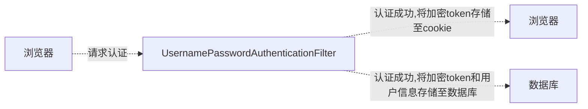

[TOC]

Spring 是非常流行和成功的 Java 应用开发框架，Spring Security正是Spring家族中的成员。Spring Security 基于 Spring 框架，提供了一套 Web 应用安全性的完整解决方案。

正如你可能知道的关于安全方面的两个主要区域是“认证”和“授权”（或者访问控制），一般来说，Web 应用的安全性包括用户认证（Authentication）和用户授权（Authorization）两个部分，这两点也是Spring Security重要核心功能。

- 用户认证指的是：验证某个用户是否为系统中的合法主体，也就是说用户能否访问该系统。用户认证一般要求用户提供用户名和密码。系统通过校验用户名和密码来完成认证过程
- 用户授权指的是验证某个用户是否有权限执行某个操作。在一个系统中，不同用户所具有的权限是不同的。比如对一个文件来说，有的用户只能进行读取，而有的用户可以进行修改。一般来说，系统会为不同的用户分配不同的角色，而每个角色则对应一系列的权限

同类产品比较

Spring Security 特点

- 和Spring无缝整合
- 全面的权限控制
- 专门为Web开发而设计
    - 旧版本不能脱离Web环境使用
    - 新版本对整个框架进行了分层抽取，分成了核心模块和Web模块。单独引入核心模块就可以脱离Web环境。
- 重量级

Apache Shiro

- 轻量级。Shiro主张的理念是把复杂的事情变简单。针对对性能有更高要求的互联网应用有更好表现
- 通用
    - 好处：不局限于Web环境，可以脱离Web环境使用。
    - 缺陷：在Web环境下一些特定的需求需要手动编写代码定制。

Spring Security 是 Spring 家族中的一个安全管理框架，实际上，在 Spring Boot 出现之前，Spring Security 就已经发展了多年了，但是使用的并不多，安全管理这个领域，一直是 Shiro 的天下。 

相对于 Shiro，在 SSM 中整合 Spring Security 都是比较麻烦的操作，所以，Spring Security 虽然功能比 Shiro 强大，但是使用反而没有 Shiro 多（Shiro 虽然功能没有 Spring Security 多，但是对于大部分项目而言，Shiro 也够用了）。 

自从有了 Spring Boot 之后，Spring Boot 对于 Spring Security 提供了自动化配置方案，可以使用更少的配置来使用 Spring Security。

因此，一般来说，常见的安全管理技术栈的组合是这样的：

- SSM + Shiro
- Spring Boot/Spring Cloud + Spring Security

以上只是一个推荐的组合而已，如果单纯从技术上来说，无论怎么组合，都是可以运行的


# hello world

新建一个 spring boot 项目

pom.xml

```xml
<?xml version="1.0" encoding="UTF-8"?>

<project xmlns="http://maven.apache.org/POM/4.0.0" xmlns:xsi="http://www.w3.org/2001/XMLSchema-instance"
         xsi:schemaLocation="http://maven.apache.org/POM/4.0.0 http://maven.apache.org/xsd/maven-4.0.0.xsd">
    <modelVersion>4.0.0</modelVersion>

    <parent>
        <groupId>org.springframework.boot</groupId>
        <artifactId>spring-boot-starter-parent</artifactId>
        <version>2.2.1.RELEASE</version>
    </parent>

    <groupId>org.example</groupId>
    <artifactId>spring-security-HelowWorld</artifactId>
    <version>1.0-SNAPSHOT</version>

    <name>spring-security-HelowWorld</name>

    <properties>
        <project.build.sourceEncoding>UTF-8</project.build.sourceEncoding>
        <maven.compiler.source>1.8</maven.compiler.source>
        <maven.compiler.target>1.8</maven.compiler.target>
    </properties>

    <dependencies>
        <dependency>
            <groupId>org.springframework.boot</groupId>
            <artifactId>spring-boot-starter-web</artifactId>
        </dependency>
        <dependency>
            <groupId>org.springframework.boot</groupId>
            <artifactId>spring-boot-starter-security</artifactId>
        </dependency>
    </dependencies>

    <build>
        <pluginManagement><!-- lock down plugins versions to avoid using Maven defaults (may be moved to parent pom) -->
            <plugins>
                <!-- clean lifecycle, see https://maven.apache.org/ref/current/maven-core/lifecycles.html#clean_Lifecycle -->
                <plugin>
                    <artifactId>maven-clean-plugin</artifactId>
                    <version>3.1.0</version>
                </plugin>
                <!-- default lifecycle, jar packaging: see https://maven.apache.org/ref/current/maven-core/default-bindings.html#Plugin_bindings_for_jar_packaging -->
                <plugin>
                    <artifactId>maven-resources-plugin</artifactId>
                    <version>3.0.2</version>
                </plugin>
                <plugin>
                    <artifactId>maven-compiler-plugin</artifactId>
                    <version>3.8.0</version>
                </plugin>
                <plugin>
                    <artifactId>maven-surefire-plugin</artifactId>
                    <version>2.22.1</version>
                </plugin>
                <plugin>
                    <artifactId>maven-jar-plugin</artifactId>
                    <version>3.0.2</version>
                </plugin>
                <plugin>
                    <artifactId>maven-install-plugin</artifactId>
                    <version>2.5.2</version>
                </plugin>
                <plugin>
                    <artifactId>maven-deploy-plugin</artifactId>
                    <version>2.8.2</version>
                </plugin>
                <!-- site lifecycle, see https://maven.apache.org/ref/current/maven-core/lifecycles.html#site_Lifecycle -->
                <plugin>
                    <artifactId>maven-site-plugin</artifactId>
                    <version>3.7.1</version>
                </plugin>
                <plugin>
                    <artifactId>maven-project-info-reports-plugin</artifactId>
                    <version>3.0.0</version>
                </plugin>
            </plugins>
        </pluginManagement>
    </build>
</project>
```

application.properties

```properties
server.port=8111
```

TestController

```java

import org.springframework.web.bind.annotation.GetMapping;
import org.springframework.web.bind.annotation.RequestMapping;
import org.springframework.web.bind.annotation.RestController;

@RestController
@RequestMapping("/test")
public class TestController {

    @GetMapping("hello")
    public String hello() {
        return "hello security";
    }
    
}
```

启动类 TestSecurityApplication

```java
import org.springframework.boot.SpringApplication;
import org.springframework.boot.autoconfigure.SpringBootApplication;

@SpringBootApplication
public class TestSecurityApplication {

    public static void main(String[] args) {
        SpringApplication.run(TestSecurityApplication.class, args);
    }

}
```

可选的添加配置类

```java
@Configuration
public class SecurityConfig extends WebSecurityConfigurerAdapter {

    @Override
    protected void configure(HttpSecurity http) throws Exception {
        http.formLogin() // 表单登录
                .and().authorizeRequests() // 认证配置
                .anyRequest() // 任何请求
                .authenticated(); // 都需要身份验证
    }

}
```

访问 http://localhost:8111/test/hello 发现自动跳转至 http://localhost:8111/login 登录页面，说明 Spring Security 已配置生效

默认用户 user 密码在启动时由控制台打印

```
Using generated security password: 9377fbb3-f9be-4fde-98d9-0d956be21cc7
```

登录后才可访问原始页面

# 基本原理

Spring Security 本质是一个过滤器链，正常情况下由过滤器代理 DelegatingFilterProxy 作为入口，配置在 web.xml 中

DelegatingFilterProxy 就是一个对于servlet filter的代理，用这个类的好处主要是通过Spring容器来管理servlet filter的生命周期，还有就是如果filter中需要一些Spring容器的实例，可以通过spring直接注入，另外读取一些配置文件这些便利的操作都可以通过Spring来配置实现。

首先在web.xml中配置

```xml
<filter>
 <filter-name>myFilter</filter-name>
 <filter-class>org.springframework.web.filter.DelegatingFilterProxy</filter-class>
</filter>

<filter-mapping>
 <filter-name>myFilter</filter-name>
 <url-pattern>/*</url-pattern>
</filter-mapping>
```

然后在Spring的配置文件中，配置具体的Filter类的实例。

```xml
<bean name="myFilter"class="com.*.MyFilter"></bean>
```

在Spring中配置的bean的name要和web.xml中的`<filter-name>`一样，或者在DelegatingFilterProxy的filter配置中配置初始参数：targetBeanName，对应到Spring配置中的beanname，如果要保留Filter原有的init，destroy方法的调用，还需要配置初始化参数targetFilterLifecycle为true，该参数默认为false

配置好 DelegatingFilterProxy 后，在容器启动时就会加载 Spring Security 包含的内置过滤器，这些过滤器按照一定的顺序来处理请求，并实现不同的安全功能。以下是 Spring Security 中常见的过滤器及其作用和加载顺序：

1. `ChannelProcessingFilter`：用于检查请求的协议是否与配置的要求匹配，例如要求使用 HTTPS。
2. `SecurityContextPersistenceFilter`：用于在请求之间存储和恢复 `SecurityContext`，以确保在整个请求处理过程中安全上下文的一致性。
3. `ConcurrentSessionFilter`：用于处理并发会话控制，限制用户同时登录的会话数量。
4. `LogoutFilter`：用于处理用户注销操作，清除相关的认证信息。
5. `UsernamePasswordAuthenticationFilter`：用于处理基于用户名和密码的身份验证请求。
6. `DefaultLoginPageGeneratingFilter`：用于生成默认的登录页面。
7. `DefaultLogoutPageGeneratingFilter`：用于生成默认的注销页面。
8. `BasicAuthenticationFilter`：用于处理基本身份验证请求。
9. `RequestCacheAwareFilter`：用于处理请求缓存，实现请求重定向后的恢复。
10. `SecurityContextHolderAwareRequestFilter`：用于包装 HttpServletRequest，以确保在处理请求时能够正确地使用 SecurityContext。
11. `AnonymousAuthenticationFilter`：用于处理匿名用户的身份验证。
12. `SessionManagementFilter`：用于处理会话管理，例如限制会话数量、处理会话过期等。
13. `ExceptionTranslationFilter`：用于处理异常情况，例如访问被拒绝时的处理。
14. `FilterSecurityInterceptor`：用于对请求进行访问控制，根据配置的权限规则决定是否允许访问。
15. `SwitchUserFilter`：用于实现用户切换功能，允许一个用户切换到另一个用户的身份。
16. `RememberMeAuthenticationFilter`：用于处理记住我功能，自动登录用户。
17. `AnonymousAuthenticationFilter`：用于处理匿名用户的身份验证。
18. `SessionFixationProtectionFilter`：用于保护会话免受会话固定攻击。
19. `CsrfFilter`：用于处理 CSRF（跨站请求伪造）攻击。
20. `LogoutFilter`：用于处理用户注销操作。

重点看三个过滤器

FilterSecurityInterceptor：是一个方法级的权限过滤器, 基本位于过滤链的最底部。
ExceptionTranslationFilter：是个异常过滤器，用来处理在认证授权过程中抛出的异常。
UsernamePasswordAuthenticationFilter ：对/login的POST请求做拦截，校验表单中用户名，密码。

# 用户名密码处理

## UserDetailsService

当什么也没有配置的时候，账号和密码是由Spring Security定义生成的。而在实际项目中账号和密码都是从数据库中查询出来的。 所以我们要通过自定义逻辑控制认证逻辑。

如果需要自定义逻辑时，只需要实现 UserDetailsService 接口即可。接口定义如下

```java
public interface UserDetailsService {
	UserDetails loadUserByUsername(String username) throws UsernameNotFoundException;
}
```

`UserDetailsService` 接口定义了一个方法 `loadUserByUsername`，用于根据用户名加载用户详细信息。该方法需要返回一个实现了 `UserDetails` 接口的对象，该对象包含了用户的身份信息、密码、权限等。

- 方法参数 username : 表示用户名。此值是客户端表单传递过来的数据。默认情况下必须叫 username，否则无法接收。

通过实现 `UserDetailsService` 接口，我们可以自定义加载用户信息的逻辑，例如从数据库中查询用户信息、调用远程接口获取用户信息等。这样，Spring Security 就可以根据返回的用户详细信息进行身份验证和授权操作。

```java
public interface UserDetails extends Serializable {

	/**
	 * 表示获取登录用户所有权限
	 */
	Collection<? extends GrantedAuthority> getAuthorities();

	/**
	 * 表示获取密码
	 */
	String getPassword();

	/**
	 * 表示获取用户名
	 */
	String getUsername();

	/**
	 * 表示判断账户是否过期
	 */
	boolean isAccountNonExpired();

	/**
	 * 表示判断账户是否被锁定
	 */
	boolean isAccountNonLocked();

	/**
	 * 表示凭证{密码}是否过期
	 */
	boolean isCredentialsNonExpired();

	/**
	 * 表示当前用户是否可用
	 */
	boolean isEnabled();
}
```

## PasswordEncoder

PasswordEncoder 用于对密码进行加密和验证。接口定义如下：

```java
public interface PasswordEncoder {

	/**
	 * 表示把参数按照特定的解析规则进行解析
	 */
	String encode(CharSequence rawPassword);

	/**
	 * 表示验证从存储中获取的编码密码与编码后提交的原始密码是否匹配。如果密码匹配，则返回true；如果不匹配，则返回false。第一个参数表示需要被解析的密码。第二个参数表示存储的密码。
	 */
	boolean matches(CharSequence rawPassword, String encodedPassword);

	/**
	 * 表示如果解析的密码能够再次进行解析且达到更安全的结果则返回true，否则返回false。默认返回false。
	 */
	default boolean upgradeEncoding(String encodedPassword) {
		return false;
	}
}
```

BCryptPasswordEncoder 实现了 PasswordEncoder 是 Spring Security 官方推荐的密码解析器，平时多使用这个解析器。

BCryptPasswordEncoder是对 bcrypt 强散列方法的具体实现。是基于Hash算法实现的单向加密。可以通过strength控制加密强度，默认10.

使用示例

```java
@Test
public void test01() { // 创建密码解析器 
    BCryptPasswordEncoder bCryptPasswordEncoder = new BCryptPasswordEncoder(); // 对密码进行加密 
    String atguigu = bCryptPasswordEncoder.encode("atguigu"); // 打印加密之后的数据 
    System.out.println("加密之后数据：\t" + atguigu); //判断原字符加密后和加密之前是否匹配 
    boolean result = bCryptPasswordEncoder.matches("atguigu", atguigu); // 打印比较结果 
    System.out.println("比较结果：\t" + result);
}
```

# Spring Security Web 环境权限认证

## 设置登录用户的用户名密码

### 方式一：通过配置 application.properties

```properties
spring.security.user.name=admin
spring.security.user.password=admin
```

### 方式二：编写类实现接口

声明一个密码处理器 PasswordEncoder

```java
import org.springframework.context.annotation.Bean;
import org.springframework.context.annotation.Configuration;
import org.springframework.security.crypto.bcrypt.BCryptPasswordEncoder;
import org.springframework.security.crypto.password.PasswordEncoder;

@Configuration
public class SecurityConfig {
    // 注入 PasswordEncoder 类到 spring 容器中
    @Bean
    public PasswordEncoder passwordEncoder() {
        return new BCryptPasswordEncoder();
    }
}
```

另一种配置类的写法

```java
@Configuration
public class SecurityConfig extends WebSecurityConfigurerAdapter {
    
    @Autowired
    private LoginService loginService;

    @Override
    protected void configure(HttpSecurity http) throws Exception {
        http.formLogin() // 表单登录
                .and().authorizeRequests() // 认证配置
                .anyRequest() // 任何请求
                .authenticated(); // 都需要身份验证
    }

    @Override
    protected void configure(AuthenticationManagerBuilder auth) throws Exception {
        // 手动设置 自定义的 UserDetailsService 和 PasswordEncoder
        auth.userDetailsService(loginService).passwordEncoder(passwordEncoder());
    }

    // 注入 PasswordEncoder 类到spring 容器中
    @Bean
    public PasswordEncoder passwordEncoder() {
        return new BCryptPasswordEncoder();
    }

}
```

实现自定义的 UserDetailsService 逻辑

```java
import org.springframework.security.core.authority.AuthorityUtils;
import org.springframework.security.core.userdetails.User;
import org.springframework.security.core.userdetails.UserDetails;
import org.springframework.security.core.userdetails.UserDetailsService;
import org.springframework.security.core.userdetails.UsernameNotFoundException;
import org.springframework.stereotype.Component;

import java.util.Objects;

@Component
public class LoginService implements UserDetailsService {

    static class MyUser {
        private String username;
        private String password;

        public MyUser(String username, String password) {
            this.username = username;
            this.password = password;
        }

        public String getUsername() {
            return username;
        }

        public void setUsername(String username) {
            this.username = username;
        }

        public String getPassword() {
            return password;
        }

        public void setPassword(String password) {
            this.password = password;
        }
    }

    @Override
    public UserDetails loadUserByUsername(String username) throws UsernameNotFoundException {
        // 查询用户是否存在
        MyUser myUser = selectByUsername(username);
        if (Objects.isNull(myUser)) {
            throw new UsernameNotFoundException("用户【" + username + "】不存在");
        }
        // 从数据库中获取的密码的密文
        String password = myUser.getPassword();

        return new User(username, password,
                // 设置几个简单的权限
                AuthorityUtils.commaSeparatedStringToAuthorityList("admin,root,superAdmin"));
    }

    private MyUser selectByUsername(String username) {
        if("admin".equals(username)){
            return new MyUser("admin","$2a$10$IaY9m24KW4wmGA4dlX/UUeIQT3iue39/LrvS/Tk7L7iI5x5cUs9Hi");
        }
        return null;
    }
}
```

### 方式三：编写配置类

```java
@Configuration
public class SecurityConfig extends WebSecurityConfigurerAdapter {

    @Override
    protected void configure(AuthenticationManagerBuilder auth) throws Exception {
        auth.inMemoryAuthentication().withUser("admin").password("admin").roles("admin1");
    }

}
```

## 自定义登录页面

添加依赖

```xml
<dependency>
    <groupId>org.springframework.boot</groupId>
    <artifactId>spring-boot-starter-thymeleaf</artifactId>
</dependency>
```

将准备好的页面复制到项目中

login.html

```xml
<!DOCTYPE html>
<!-- 需要添加
<html  xmlns:th="http://www.thymeleaf.org">
这样在后面的th标签就不会报错
 -->
<html  xmlns:th="http://www.thymeleaf.org">
<head lang="en">
    <meta http-equiv="Content-Type" content="text/html; charset=UTF-8"/>
    <title>xx</title>
</head>
<body>

<h1>表单提交</h1>
<!-- 表单提交用户信息,注意字段的设置,直接是*{} -->
<form action="/user/login"  method="post">
    <!--<input type="hidden" name="${_csrf.parameterName}" value="${_csrf.token}" />-->
    <input type="text" name="username" />
    <input type="text" name="password" />
    <input type="submit" />
</form>
</body>
</html>
```

success.html

```xml
<!DOCTYPE html>
<html lang="en">
<head>
    <meta charset="UTF-8">
    <title>Title</title>
</head>
<body>
    登录成功！
    <a href="/logout">退出</a>
</body>
</html>
```

unauth.html

```xml
<!DOCTYPE html>
<html lang="en">
<head>
    <meta charset="UTF-8">
    <title>Title</title>
</head>
<body>
    <h1>没有访问权限！</h1>
</body>
</html>
```

SecurityConfig

```java
import org.example.service.LoginService;
import org.springframework.beans.factory.annotation.Autowired;
import org.springframework.context.annotation.Bean;
import org.springframework.context.annotation.Configuration;
import org.springframework.security.config.annotation.authentication.builders.AuthenticationManagerBuilder;
import org.springframework.security.config.annotation.web.builders.HttpSecurity;
import org.springframework.security.config.annotation.web.configuration.WebSecurityConfigurerAdapter;
import org.springframework.security.crypto.bcrypt.BCryptPasswordEncoder;
import org.springframework.security.crypto.password.PasswordEncoder;


@Configuration
public class SecurityConfig extends WebSecurityConfigurerAdapter {

    @Autowired
    private LoginService loginService;

    @Override
    protected void configure(HttpSecurity http) throws Exception {
        http.formLogin() // 表单登录
                .loginPage("/login.html") // 配置登录页面路径
                .loginProcessingUrl("/user/login") // 登录表单提交路径
                .defaultSuccessUrl("/success.html").permitAll() // 登录成功后跳转的页面
                .failureUrl("/unauth.html") // 登录失败后跳转的页面
                .and().authorizeRequests().antMatchers("/static/**","/test/hello","/user/login").permitAll() // 配置哪些路径可以直接访问，不需要认证
        .anyRequest().authenticated()
        .and().csrf().disable() // 关闭 csrf 防护
        ;

    }

    @Override
    protected void configure(AuthenticationManagerBuilder auth) throws Exception {
        auth.userDetailsService(loginService).passwordEncoder(passwordEncoder());
    }

    // 注入PasswordEncoder 类到spring 容器中
    @Bean
    public PasswordEncoder passwordEncoder() {
        return new BCryptPasswordEncoder();
    }

}
```

LoginController

```java
import org.springframework.web.bind.annotation.PostMapping;
import org.springframework.web.bind.annotation.RequestMapping;
import org.springframework.web.bind.annotation.RestController;

@RestController
@RequestMapping("/user")
public class LoginController {

    @PostMapping("login")
    public String hello() {
        return "login....";
    }

}
```

其他不变

注意：页面提交方式必须为 post 请求，用户名，密码必须为 username ,password

若需要修改配置可以调用usernameParameter()和passwordParameter()方法。

```java
@Override
protected void configure(HttpSecurity http) throws Exception {
    http.formLogin().usernameParameter("user").passwordParameter("pass")// 表单登录
            .loginPage("/login.html") // 配置登录页面路径
            .loginProcessingUrl("/user/login") // 登录表单提交路径
            .defaultSuccessUrl("/success.html").permitAll() // 登录成功后跳转的页面
            .failureUrl("/unauth.html") // 登录失败后跳转的页面
            .and().authorizeRequests().antMatchers("/static/**","/test/hello","/user/login").permitAll() // 配置哪些路径可以直接访问，不需要认证
    .anyRequest().authenticated()
    .and().csrf().disable() // 关闭 csrf 防护
    ;
}
```

## 基于角色或权限进行访问控制

### hasAuthority,hasAnyAuthority 方法

**hasAuthority 方法**

如果当前的主体具有指定的权限，则返回 true,否则返回false

**hasAnyAuthority 方法**

如果当前的主体有任何提供的角色（给定的作为一个逗号分隔的字符串列表）的话，返回true.

```java
@Override
protected void configure(HttpSecurity http) throws Exception {
    http.formLogin()// 表单登录
            .loginPage("/login.html") // 配置登录页面路径
            .loginProcessingUrl("/user/login") // 登录表单提交路径
            .defaultSuccessUrl("/success.html").permitAll() // 登录成功后跳转的页面
            .failureUrl("/unauth.html") // 登录失败后跳转的页面
            .and().authorizeRequests().antMatchers("/static/**", "/test/hello", "/user/login").permitAll() // 配置哪些路径可以直接访问，不需要认证
            .and().authorizeRequests().antMatchers("/test/adminTest").hasAuthority("admin") // 需要用户带有 admin 权限
            .and().authorizeRequests().antMatchers("/test/adminTest").hasAnyAuthority("root") // 需要用户至少带有 root 权限
            .anyRequest().authenticated()
            .and().csrf().disable() // 关闭 csrf 防护
    ;
}
```

在登录时为用户设置权限

```java
@Override
public UserDetails loadUserByUsername(String username) throws UsernameNotFoundException {
    // 查询用户是否存在
    MyUser myUser = selectByUsername(username);
    if (Objects.isNull(myUser)) {
        throw new UsernameNotFoundException("用户【" + username + "】不存在");
    }
    // 从数据库中获取的密码的密文
    String password = myUser.getPassword();
    return new User(username, password,
            // 设置几个简单的权限
            AuthorityUtils.commaSeparatedStringToAuthorityList("admin,root,ROLE_admin"));
}
```

### hasRole,hasAnyRole 方法

**hasRole 方法**

如果用户具备给定角色就允许访问,否则出现403,如果当前主体具有指定的角色，则返回true

**hasAnyRole 方法**

表示用户具备任何一个条件都可以访问

源码

```java
private static String hasRole(String role) {
	Assert.notNull(role, "role cannot be null");
	if (role.startsWith("ROLE_")) {
		throw new IllegalArgumentException(
				"role should not start with 'ROLE_' since it is automatically inserted. Got '"
						+ role + "'");
	}
	return "hasRole('ROLE_" + role + "')";
}
```

设置用户权限

```java
return new User(username, password,
            // 设置几个简单的权限
            AuthorityUtils.commaSeparatedStringToAuthorityList("ROLE_admin"));
```

配置接口权限

```java
.and().authorizeRequests().antMatchers("/test/adminTest").hasRole("admin")
```

注意，配置文件中不需要添加`ROLE_`,因为上述的底层代码会自动添加与之进行匹配

### 自定义403页面

修改访问配置类

```java
http.exceptionHandling().accessDeniedPage("/unauth.html");
```

## 注解权限控制


使用注解先要开启注解功能

```java
import org.springframework.boot.SpringApplication;
import org.springframework.boot.autoconfigure.SpringBootApplication;
import org.springframework.security.config.annotation.method.configuration.EnableGlobalMethodSecurity;

@SpringBootApplication
@EnableGlobalMethodSecurity(securedEnabled = true)
public class TestSecurityApplication {

    public static void main(String[] args) {
        SpringApplication.run(TestSecurityApplication.class, args);
    }

}
```

### @Secured

判断是否具有角色权限，另外需要注意的是这里匹配的字符串需要添加前缀 `ROLE_`。

```java
@GetMapping("adminTest")
@Secured({"ROLE_admin"})
public String adminTest() {
    return "hello admin";
}
```

### @PreAuthorize

先开启注解

```java
@EnableGlobalMethodSecurity(prePostEnabled = true)
```

执行方法前执行权限校验，可直接调用方法

```java
@GetMapping("adminTest")
@PreAuthorize("hasAuthority('admin')")
public String adminTest() {
    return "hello admin";
}
```

### @PostAuthorize

先开启注解

```java
@EnableGlobalMethodSecurity(prePostEnabled = true)
```

使用并不多，在方法执行后再进行权限验证，适合验证带有返回值的权限.

```java
@GetMapping("adminTest")
@PostAuthorize("hasAuthority('admin')")
public String adminTest() {
    return "hello admin";
}
```

### @PostFilter

权限验证之后对数据进行过滤，例如只留下用户名为 admin1 的数据，其中 PostFilter 注解中为 spel 表达式，filterObject 代表用于表示返回结果集中的每个对象，为固定写法

```java
@GetMapping("adminTest")
@PreAuthorize("hasAuthority('admin')")
@PostFilter("filterObject.username == 'admin1'")
public List<MyUser> getAllUser() {
    ArrayList<MyUser> list = new ArrayList<>();
    list.add(new MyUser("admin1", "6666"));
    list.add(new MyUser("admin2", "888"));
    return list;
}
```

### @PreFilter

进入控制器之前对数据进行过滤

```java
@RequestMapping("getTestPreFilter")
@PreAuthorize("hasAuthority('admin')")
@PreFilter(value = "filterObject.id%2==0")
@ResponseBody
public List<MyUser> getTestPreFilter(@RequestBody List<MyUser> list) {
    list.forEach(t -> {
        System.out.println(t.getId() + "\t" + t.getUsername());
    });
    return list;
}
```

测试数据

```json
[
{
"id": "1",
"username": "admin",
"password": "666"
},
{
"id": "2",
"username": "admins",
"password": "888"
},
{
"id": "3",
"username": "admins11",
"password": "11888"
},
{
"id": "4",
"username": "admins22",
"password": "22888"
}]
```

[权限表达式](https://docs.spring.io/spring-security/site/docs/5.3.4.RELEASE/reference/html5/#el-access)

# 用户注销

添加配置

```java
http.logout().logoutUrl("/logout").logoutSuccessUrl("/login.html").permitAll();
```

退出之后，是无法访问需要登录时才能访问的控制器的！

# 自动登录

实现自动登录功能，例如在登录时选择的 10 天内免登陆功能，关闭浏览器后不需要再次登录

web 环境下可以通过 cookie 技术实现，但因其数据需保存至客户端，安全性无法保证，一般不推荐使用

## 基于数据库的记住我

实现原理



再次访问时，获取到请求携带的 cookie 信息，从数据中查询比对，查询到对应信息，认证成功。

查看源码

org.springframework.security.web.authentication.AbstractAuthenticationProcessingFilter#successfulAuthentication

```java
protected void successfulAuthentication(HttpServletRequest request,
		HttpServletResponse response, FilterChain chain, Authentication authResult)
		throws IOException, ServletException {
	if (logger.isDebugEnabled()) {
		logger.debug("Authentication success. Updating SecurityContextHolder to contain: "
				+ authResult);
	}
	SecurityContextHolder.getContext().setAuthentication(authResult);
	rememberMeServices.loginSuccess(request, response, authResult);
	// Fire event
	if (this.eventPublisher != null) {
		eventPublisher.publishEvent(new InteractiveAuthenticationSuccessEvent(
				authResult, this.getClass()));
	}
	successHandler.onAuthenticationSuccess(request, response, authResult);
}
```

可以看到在认证成功后，调用了 org.springframework.security.web.authentication.RememberMeServices 中的 loginSuccess 方法，跟进查看可知，框架内 token 的数据库操作类为 org.springframework.security.web.authentication.rememberme.JdbcTokenRepositoryImpl

当再次请求时，会经过 org.springframework.security.web.authentication.rememberme.RememberMeAuthenticationFilter 过滤器，在 doFilter 方法中会调用 org.springframework.security.web.authentication.RememberMeServices#autoLogin 方法实现了自动登录功能

### 实现示例

引入依赖

```xml
<dependency>
    <groupId>org.springframework.boot</groupId>
    <artifactId>spring-boot-starter-jdbc</artifactId>
</dependency>
<!--mysql-->
<dependency>
    <groupId>mysql</groupId>
    <artifactId>mysql-connector-java</artifactId>
    <version>8.0.33</version>
</dependency>
```

application.yml

```yml
server:
  port: 8111
spring:
  datasource:
    driver-class-name: com.mysql.cj.jdbc.Driver
    url: jdbc:mysql://192.168.60.129:3306/SpringSecurity
    username: root
    password: root
```

创建数据库表

```sql
CREATE TABLE `persistent_logins`
(
    `username`  varchar(64) NOT NULL,
    `series`    varchar(64) NOT NULL,
    `token`     varchar(64) NOT NULL,
    `last_used` timestamp   NOT NULL DEFAULT CURRENT_TIMESTAMP ON UPDATE CURRENT_TIMESTAMP,
    PRIMARY KEY (`series`)
) ENGINE = InnoDB
  DEFAULT CHARSET = utf8mb4;
```

可以不建，会在 JdbcTokenRepositoryImpl 中自动创建

修改配置文件

```java
import org.example.service.LoginService;
import org.springframework.beans.factory.annotation.Autowired;
import org.springframework.context.annotation.Bean;
import org.springframework.context.annotation.Configuration;
import org.springframework.core.annotation.Order;
import org.springframework.security.config.annotation.authentication.builders.AuthenticationManagerBuilder;
import org.springframework.security.config.annotation.web.builders.HttpSecurity;
import org.springframework.security.config.annotation.web.configuration.WebSecurityConfigurerAdapter;
import org.springframework.security.crypto.bcrypt.BCryptPasswordEncoder;
import org.springframework.security.crypto.password.PasswordEncoder;
import org.springframework.security.web.authentication.rememberme.JdbcTokenRepositoryImpl;
import org.springframework.security.web.authentication.rememberme.PersistentTokenRepository;
import javax.sql.DataSource;


@Configuration
public class SecurityConfig extends WebSecurityConfigurerAdapter {

    // 注入数据源
    @Autowired
    private DataSource dataSource;
    @Autowired
    private LoginService loginService;

    @Override
    protected void configure(HttpSecurity http) throws Exception {
        http.formLogin()// 表单登录
                .loginPage("/login.html") // 配置登录页面路径
                .loginProcessingUrl("/user/login") // 登录表单提交路径

                .defaultSuccessUrl("/success.html").permitAll() // 登录成功后跳转的页面
                .failureUrl("/unauth.html") // 登录失败后跳转的页面
                .and().authorizeRequests().antMatchers("/static/**", "/test/hello", "/user/login").permitAll() // 配置哪些路径可以直接访问，不需要认证
                .anyRequest().authenticated()
                .and().csrf().disable() // 关闭 csrf 防护
        ;
        http.exceptionHandling().accessDeniedPage("/unauth.html");
        // 设置 tokenRepository
        http.rememberMe().tokenRepository(persistentTokenRepository())
                // 配置令牌有效期
                .tokenValiditySeconds(600)
                // 配置用于获取用户详情的服务
                .userDetailsService(loginService);
    }

    @Override
    protected void configure(AuthenticationManagerBuilder auth) throws Exception {
        auth.userDetailsService(loginService).passwordEncoder(passwordEncoder());
    }

    // 注入PasswordEncoder 类到spring 容器中
    @Bean
    public PasswordEncoder passwordEncoder() {
        return new BCryptPasswordEncoder();
    }

    // 声明数据库操作实现类
    @Bean
    public PersistentTokenRepository persistentTokenRepository() {
        JdbcTokenRepositoryImpl jdbcTokenRepository = new JdbcTokenRepositoryImpl();
        // 设置数据源
        jdbcTokenRepository.setDataSource(dataSource);
        // 设置启动时自动创建表 自己创建的不需要创建
        // jdbcTokenRepository.setCreateTableOnStartup(true);
        return jdbcTokenRepository;
    }

}
```

在登录页面添加复选框，这里 name 属性必须为 `remember-me`

```xml
<input type="checkbox" name="remember-me" />自动登录
```

# CSRF

跨站请求伪造（英语：Cross-site request forgery），也被称为 one-click attack 或者 session riding，通常缩写为 CSRF 或者 XSRF， 是一种挟制用户在当前已登录的Web应用程序上执行非本意的操作的攻击方法。跟跨网站脚本（XSS）相比，XSS利用的是用户对指定网站的信任，CSRF 利用的是网站对用户网页浏览器的信任。 

跨站请求攻击，简单地说，是攻击者通过一些技术手段欺骗用户的浏览器去访问一个自己曾经认证过的网站并运行一些操作（如发邮件，发消息，甚至财产操作如转账和购买商品）。由于浏览器曾经认证过，所以被访问的网站会认为是真正的用户操作而去运行。这利用了web中用户身份验证的一个漏洞：**简单的身份验证只能保证请求发自某个用户的浏览器，却不能保证请求本身是用户自愿发出的**。 

从 Spring Security 4.0 开始，默认情况下会启用CSRF保护，以防止CSRF攻击应用程序，Spring Security CSRF 会针对 **PATCH，POST，PUT 和 DELETE 方法**进行防护。

[CSRF(跨站请求伪造)](https://blog.csdn.net/leiwuhen92/article/details/128724402)

## 原理

在客户端第一次请求时，生成一个 CSRF token 存储在 session 中，下次客户端请求时携带此 token 进行请求，后端对请求携带的 token 与 session 中的进行比对，验证通过才允许请求

源码实现 org.springframework.security.web.csrf.CsrfFilter#doFilterInternal

```java
protected void doFilterInternal(HttpServletRequest request,
		HttpServletResponse response, FilterChain filterChain)
				throws ServletException, IOException {
	request.setAttribute(HttpServletResponse.class.getName(), response);
	CsrfToken csrfToken = this.tokenRepository.loadToken(request);
	final boolean missingToken = csrfToken == null;
	if (missingToken) {
		csrfToken = this.tokenRepository.generateToken(request);
		this.tokenRepository.saveToken(csrfToken, request, response);
	}
	request.setAttribute(CsrfToken.class.getName(), csrfToken);
	request.setAttribute(csrfToken.getParameterName(), csrfToken);
	if (!this.requireCsrfProtectionMatcher.matches(request)) {
		filterChain.doFilter(request, response);
		return;
	}
	String actualToken = request.getHeader(csrfToken.getHeaderName());
	if (actualToken == null) {
		actualToken = request.getParameter(csrfToken.getParameterName());
	}
	if (!csrfToken.getToken().equals(actualToken)) {
		if (this.logger.isDebugEnabled()) {
			this.logger.debug("Invalid CSRF token found for "
					+ UrlUtils.buildFullRequestUrl(request));
		}
		if (missingToken) {
			this.accessDeniedHandler.handle(request, response,
					new MissingCsrfTokenException(actualToken));
		}
		else {
			this.accessDeniedHandler.handle(request, response,
					new InvalidCsrfTokenException(csrfToken, actualToken));
		}
		return;
	}
	filterChain.doFilter(request, response);
}
```

## 示例

pom

```xml
<dependency>
    <groupId>org.springframework.boot</groupId>
    <artifactId>spring-boot-starter-security</artifactId>
</dependency>
<dependency>
    <groupId>org.springframework.boot</groupId>
    <artifactId>spring-boot-starter-thymeleaf</artifactId>
</dependency>
<dependency>
    <groupId>org.springframework.boot</groupId>
    <artifactId>spring-boot-starter-web</artifactId>
</dependency>
```

登录页面

```xml
<!DOCTYPE html>
<html xmlns="http://www.w3.org/1999/xhtml" xmlns:th="http://www.thymeleaf.org">
<head>
    <meta http-equiv="Content-Type" content="text/html; charset=UTF-8">
    <title>用户登录界面</title>
</head>
<body class="text-center">
    <form class="form-signin" th:method="post" th:action="@{/userLogin}">
        <h1 class="h3 mb-3 font-weight-normal">请登录</h1>

        <input type="text" class="form-control" placeholder="用户名" required="" autofocus="" name="username">
        <input type="password" class="form-control" placeholder="密码" required="" name="password">
        <div class="checkbox mb-3">
            <label>
                <input type="checkbox" name="rememberme"> 记住我
            </label>
        </div>
        <button class="btn btn-lg btn-primary btn-block" type="submit" >登录</button>
    </form>
</body>
</html>
```

测试修改页

```xml
<!DOCTYPE html>
<html xmlns="http://www.w3.org/1999/xhtml" xmlns:th="http://www.thymeleaf.org">
<head>
    <meta charset="UTF-8">
    <title>用户修改</title>
</head>
<body>
<div align="center">
    <form  method="post" action="update_token">
<!--     -->
      <input type="hidden" th:name="${_csrf.parameterName}" th:value="${_csrf.token}"/>
        用户名: <input type="text" name="username" /><br />
        密&nbsp;&nbsp;码: <input type="password" name="password" /><br />
        <button type="submit">修改</button>
    </form>
</div>
</body>
</html>
```

测试结果页

```xml
<!DOCTYPE html>
<html xmlns="http://www.w3.org/1999/xhtml" xmlns:th="http://www.thymeleaf.org">
<head>
    <meta charset="UTF-8">
    <title>用户修改</title>
</head>
<body>
<div>
    <span th:text="${_csrf.token}"></span>
</div>
</body>
</html>

```

关闭安全配置的类中的 csrf

```java
// http.csrf().disable();
```

CSRFController

```
@Controller
public class CSRFController {

     @GetMapping("/toupdate")
     public String test(Model model){
         return "csrf/csrfTest";
     }

    @PostMapping("/update_token")
    public String getToken() {
        return "csrf/csrf_token";
    }
}
```

访问 toupdate 

# SpringSecurity微服务权限方案

微服务认证与授权实现思路

认证授权过程分析

1. 如果是基于Session，那么Spring-security会对cookie里的sessionid进行解析，找到服务器存储的session信息，然后判断当前用户是否符合请求的要求。
2. 如果是基于 token，则是解析出 token，然后将当前请求加入到Spring-security管理的权限信息中去

