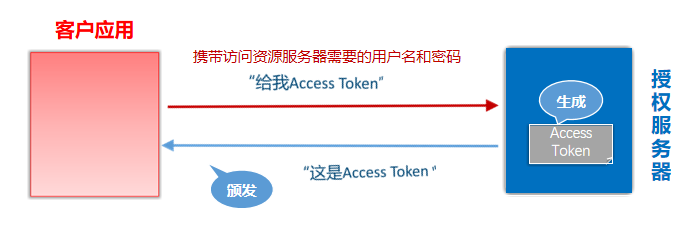
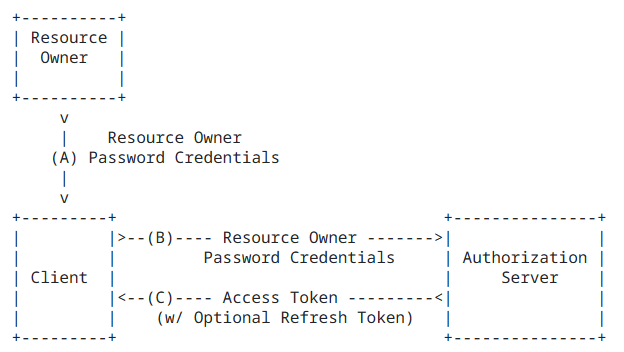

[TOC]

# 简介

Spring 是非常流行和成功的 Java 应用开发框架，Spring Security正是Spring家族中的成员。Spring Security 基于 Spring 框架，提供了一套 Web 应用安全性的完整解决方案。

正如你可能知道的关于安全方面的两个主要区域是“认证”和“授权”（或者访问控制），一般来说，Web 应用的安全性包括用户认证（Authentication）和用户授权（Authorization）两个部分，这两点也是Spring Security重要核心功能。

- 用户认证指的是：验证某个用户是否为系统中的合法主体，也就是说用户能否访问该系统。用户认证一般要求用户提供用户名和密码。系统通过校验用户名和密码来完成认证过程
- 用户授权指的是验证某个用户是否有权限执行某个操作。在一个系统中，不同用户所具有的权限是不同的。比如对一个文件来说，有的用户只能进行读取，而有的用户可以进行修改。一般来说，系统会为不同的用户分配不同的角色，而每个角色则对应一系列的权限

同类产品比较

Sa-Token

1. 简单易用：Sa-Token提供了简洁的API和灵活的配置，使用起来非常方便。开发人员可以快速集成Sa-Token到Java应用程序中，并通过简单的代码实现认证和授权的功能。
2. 多种认证方式：Sa-Token支持多种认证方式，包括基于Token的无状态认证、基于Session的有状态认证、Cookie认证等。开发人员可以根据需求选择适合的认证方式。
3. 多种授权方式：Sa-Token支持基于角色、权限的授权方式，可以灵活地定义用户的访问权限。同时，Sa-Token还提供了注解式的权限控制，可以在方法或类级别上进行权限控制。
4. 高性能：Sa-Token在设计上注重性能优化，采用了缓存和索引等技术来提高认证和授权的效率。同时，Sa-Token还支持分布式环境下的会话管理，保证了系统的可扩展性和高并发性能。
5. 安全可靠：Sa-Token提供了密码加密、防止重放攻击、防止会话固定攻击等安全机制，保障了系统的安全性。同时，Sa-Token还支持黑名单机制，可以在运行时动态地禁止某些Token的访问。
6. 开放源代码：Sa-Token是一个开源项目，代码托管在GitHub上，任何人都可以查看和参与项目的开发。这也意味着开发人员可以根据自己的需求进行定制和扩展。

Spring Security 特点

- 和Spring无缝整合
- 全面的权限控制
- 专门为Web开发而设计
    - 旧版本不能脱离Web环境使用
    - 新版本对整个框架进行了分层抽取，分成了核心模块和Web模块。单独引入核心模块就可以脱离Web环境。
- 重量级

Apache Shiro

- 轻量级。Shiro主张的理念是把复杂的事情变简单。针对对性能有更高要求的互联网应用有更好表现
- 通用
    - 好处：不局限于Web环境，可以脱离Web环境使用。
    - 缺陷：在Web环境下一些特定的需求需要手动编写代码定制。

Spring Security 是 Spring 家族中的一个安全管理框架，实际上，在 Spring Boot 出现之前，Spring Security 就已经发展了多年了，但是使用的并不多，安全管理这个领域，一直是 Shiro 的天下。 

相对于 Shiro，在 SSM 中整合 Spring Security 都是比较麻烦的操作，所以，Spring Security 虽然功能比 Shiro 强大，但是使用反而没有 Shiro 多（Shiro 虽然功能没有 Spring Security 多，但是对于大部分项目而言，Shiro 也够用了）。 

自从有了 Spring Boot 之后，Spring Boot 对于 Spring Security 提供了自动化配置方案，可以使用更少的配置来使用 Spring Security。

因此，一般来说，常见的安全管理技术栈的组合是这样的：

- SSM + Shiro
- Spring Boot/Spring Cloud + Spring Security

以上只是一个推荐的组合而已，如果单纯从技术上来说，无论怎么组合，都是可以运行的

Sa-Token
**优点：**
- 简单易用：Sa-Token提供了简洁的API和灵活的配置，使用起来非常方便。
- 高性能：Sa-Token在设计上注重性能优化，采用了缓存和索引等技术来提高认证和授权的效率。
- 多认证方式：支持多种认证方式，包括基于Token的无状态认证、基于Session的有状态认证、Cookie认证等。
- 多授权方式：支持基于角色、权限的授权方式，并提供了注解式的权限控制。
- 安全可靠：提供了密码加密、防止重放攻击、防止会话固定攻击等安全机制。
**缺点：**
- 社区相对较小：相比于Spring Security和Apache Shiro，Sa-Token的用户群体和社区相对较小，可能会影响到获取支持和解决问题的效率。

Spring Security
**优点：**
- 功能强大：Spring Security是一个功能强大的安全框架，提供了完整的身份认证和授权功能。
- 与Spring集成：可以与Spring框架无缝集成，方便在Spring应用程序中使用。
- 大型社区：Spring Security拥有庞大的用户群体和活跃的社区，可以获取丰富的文档和支持。
**缺点：**
- 学习曲线陡峭：Spring Security的配置相对复杂，学习曲线较陡，对新手来说可能需要一定时间去掌握。
- 配置繁琐：由于提供了大量的功能和配置选项，配置文件可能会变得复杂。

Apache Shiro
**优点：**
- 简单易用：Shiro是一个简单而灵活的安全框架，提供了易于使用的API和灵活的配置选项。
- 多功能：除了身份认证和授权外，还提供了会话管理、密码加密等功能。
- 安全可靠：提供了多种安全机制，保障系统的安全性。
**缺点：**
- 功能相对较少：相比于Spring Security，Shiro的功能相对较少，可能无法满足一些复杂的安全需求。
- 社区相对较小：Shiro的用户群体和社区相对较小，可能会影响到获取支持和解决问题的效率。


# Spring Security

新建一个 spring boot 项目

pom.xml

```xml
<?xml version="1.0" encoding="UTF-8"?>

<project xmlns="http://maven.apache.org/POM/4.0.0" xmlns:xsi="http://www.w3.org/2001/XMLSchema-instance"
         xsi:schemaLocation="http://maven.apache.org/POM/4.0.0 http://maven.apache.org/xsd/maven-4.0.0.xsd">
    <modelVersion>4.0.0</modelVersion>

    <parent>
        <groupId>org.springframework.boot</groupId>
        <artifactId>spring-boot-starter-parent</artifactId>
        <version>2.2.1.RELEASE</version>
    </parent>

    <groupId>org.example</groupId>
    <artifactId>spring-security-HelowWorld</artifactId>
    <version>1.0-SNAPSHOT</version>

    <name>spring-security-HelowWorld</name>

    <properties>
        <project.build.sourceEncoding>UTF-8</project.build.sourceEncoding>
        <maven.compiler.source>1.8</maven.compiler.source>
        <maven.compiler.target>1.8</maven.compiler.target>
    </properties>

    <dependencies>
        <dependency>
            <groupId>org.springframework.boot</groupId>
            <artifactId>spring-boot-starter-web</artifactId>
        </dependency>
        <dependency>
            <groupId>org.springframework.boot</groupId>
            <artifactId>spring-boot-starter-security</artifactId>
        </dependency>
    </dependencies>

    <build>
        <pluginManagement><!-- lock down plugins versions to avoid using Maven defaults (may be moved to parent pom) -->
            <plugins>
                <!-- clean lifecycle, see https://maven.apache.org/ref/current/maven-core/lifecycles.html#clean_Lifecycle -->
                <plugin>
                    <artifactId>maven-clean-plugin</artifactId>
                    <version>3.1.0</version>
                </plugin>
                <!-- default lifecycle, jar packaging: see https://maven.apache.org/ref/current/maven-core/default-bindings.html#Plugin_bindings_for_jar_packaging -->
                <plugin>
                    <artifactId>maven-resources-plugin</artifactId>
                    <version>3.0.2</version>
                </plugin>
                <plugin>
                    <artifactId>maven-compiler-plugin</artifactId>
                    <version>3.8.0</version>
                </plugin>
                <plugin>
                    <artifactId>maven-surefire-plugin</artifactId>
                    <version>2.22.1</version>
                </plugin>
                <plugin>
                    <artifactId>maven-jar-plugin</artifactId>
                    <version>3.0.2</version>
                </plugin>
                <plugin>
                    <artifactId>maven-install-plugin</artifactId>
                    <version>2.5.2</version>
                </plugin>
                <plugin>
                    <artifactId>maven-deploy-plugin</artifactId>
                    <version>2.8.2</version>
                </plugin>
                <!-- site lifecycle, see https://maven.apache.org/ref/current/maven-core/lifecycles.html#site_Lifecycle -->
                <plugin>
                    <artifactId>maven-site-plugin</artifactId>
                    <version>3.7.1</version>
                </plugin>
                <plugin>
                    <artifactId>maven-project-info-reports-plugin</artifactId>
                    <version>3.0.0</version>
                </plugin>
            </plugins>
        </pluginManagement>
    </build>
</project>
```

application.properties

```properties
server.port=8111
```

TestController

```java

import org.springframework.web.bind.annotation.GetMapping;
import org.springframework.web.bind.annotation.RequestMapping;
import org.springframework.web.bind.annotation.RestController;

@RestController
@RequestMapping("/test")
public class TestController {

    @GetMapping("hello")
    public String hello() {
        return "hello security";
    }
    
}
```

启动类 TestSecurityApplication

```java
import org.springframework.boot.SpringApplication;
import org.springframework.boot.autoconfigure.SpringBootApplication;

@SpringBootApplication
public class TestSecurityApplication {

    public static void main(String[] args) {
        SpringApplication.run(TestSecurityApplication.class, args);
    }

}
```

可选的添加配置类

```java
@Configuration
public class SecurityConfig extends WebSecurityConfigurerAdapter {

    @Override
    protected void configure(HttpSecurity http) throws Exception {
        http.formLogin() // 表单登录
                .and().authorizeRequests() // 认证配置
                .anyRequest() // 任何请求
                .authenticated(); // 都需要身份验证
    }

}
```

访问 http://localhost:8111/test/hello 发现自动跳转至 http://localhost:8111/login 登录页面，说明 Spring Security 已配置生效

默认用户 user 密码在启动时由控制台打印

```
Using generated security password: 9377fbb3-f9be-4fde-98d9-0d956be21cc7
```

登录后才可访问原始页面

# 基本原理

SpringSecurity 采用的是责任链的设计模式，它有一条很长的过滤器链。


重点看三个过滤器

FilterSecurityInterceptor：是一个方法级的权限过滤器, 基本位于过滤链的最底部，负责权限校验。
ExceptionTranslationFilter：是个异常过滤器，用来处理在认证授权过程中抛出的鉴权异常。
UsernamePasswordAuthenticationFilter ：对/login的POST请求做拦截，校验表单中用户名，密码是否合法。

# 用户名和密码


## UserDetailsService

当什么也没有配置的时候，账号和密码是由Spring Security定义生成的。而在实际项目中账号和密码都是从数据库中查询出来的。 所以我们要通过自定义逻辑控制认证逻辑。

如果需要自定义逻辑时，只需要实现 UserDetailsService 接口即可。接口定义如下

```java
public interface UserDetailsService {
	UserDetails loadUserByUsername(String username) throws UsernameNotFoundException;
}
```

`UserDetailsService` 接口定义了一个方法 `loadUserByUsername`，用于根据用户名加载用户详细信息。该方法需要返回一个实现了 `UserDetails` 接口的对象，该对象包含了用户的身份信息、密码、权限等。

- 方法参数 username : 表示用户名。此值是客户端表单传递过来的数据。默认情况下必须叫 username，否则无法接收。

通过实现 `UserDetailsService` 接口，我们可以自定义加载用户信息的逻辑，例如从数据库中查询用户信息、调用远程接口获取用户信息等。这样，Spring Security 就可以根据返回的用户详细信息进行身份验证和授权操作。

```java
public interface UserDetails extends Serializable {

	/**
	 * 表示获取登录用户所有权限
	 */
	Collection<? extends GrantedAuthority> getAuthorities();

	/**
	 * 表示获取密码
	 */
	String getPassword();

	/**
	 * 表示获取用户名
	 */
	String getUsername();

	/**
	 * 表示判断账户是否过期
	 */
	boolean isAccountNonExpired();

	/**
	 * 表示判断账户是否被锁定
	 */
	boolean isAccountNonLocked();

	/**
	 * 表示凭证{密码}是否过期
	 */
	boolean isCredentialsNonExpired();

	/**
	 * 表示当前用户是否可用
	 */
	boolean isEnabled();
}
```

## PasswordEncoder

PasswordEncoder 用于对密码进行加密和验证。接口定义如下：

```java
public interface PasswordEncoder {

	/**
	 * 表示把参数按照特定的解析规则进行解析
	 */
	String encode(CharSequence rawPassword);

	/**
	 * 表示验证从存储中获取的编码密码与编码后提交的原始密码是否匹配。如果密码匹配，则返回true；如果不匹配，则返回false。第一个参数表示需要被解析的密码。第二个参数表示存储的密码。
	 */
	boolean matches(CharSequence rawPassword, String encodedPassword);

	/**
	 * 表示如果解析的密码能够再次进行解析且达到更安全的结果则返回true，否则返回false。默认返回false。
	 */
	default boolean upgradeEncoding(String encodedPassword) {
		return false;
	}
}
```

BCryptPasswordEncoder 实现了 PasswordEncoder 是 Spring Security 官方推荐的密码解析器，平时多使用这个解析器。

BCryptPasswordEncoder是对 bcrypt 强散列方法的具体实现。是基于Hash算法实现的单向加密。可以通过strength控制加密强度，默认10.

使用示例

```java
@Test
public void test01() { // 创建密码解析器 
    BCryptPasswordEncoder bCryptPasswordEncoder = new BCryptPasswordEncoder(); // 对密码进行加密 
    String atguigu = bCryptPasswordEncoder.encode("atguigu"); // 打印加密之后的数据 
    System.out.println("加密之后数据：\t" + atguigu); //判断原字符加密后和加密之前是否匹配 
    boolean result = bCryptPasswordEncoder.matches("atguigu", atguigu); // 打印比较结果 
    System.out.println("比较结果：\t" + result);
}
```

# 权限认证

## 设置登录用户的用户名密码

### 方式一：通过配置 application.properties

```properties
spring.security.user.name=admin
spring.security.user.password=admin
```

### 方式二：编写类实现接口

声明一个密码处理器 PasswordEncoder

```java
import org.springframework.context.annotation.Bean;
import org.springframework.context.annotation.Configuration;
import org.springframework.security.crypto.bcrypt.BCryptPasswordEncoder;
import org.springframework.security.crypto.password.PasswordEncoder;

@Configuration
public class SecurityConfig {
    // 注入 PasswordEncoder 类到 spring 容器中
    @Bean
    public PasswordEncoder passwordEncoder() {
        return new BCryptPasswordEncoder();
    }
}
```

另一种配置类的写法

```java
@Configuration
public class SecurityConfig extends WebSecurityConfigurerAdapter {
    
    @Autowired
    private LoginService loginService;

    @Override
    protected void configure(HttpSecurity http) throws Exception {
        http.formLogin() // 表单登录
                .and().authorizeRequests() // 认证配置
                .anyRequest() // 任何请求
                .authenticated(); // 都需要身份验证
    }

    @Override
    protected void configure(AuthenticationManagerBuilder auth) throws Exception {
        // 手动设置 自定义的 UserDetailsService 和 PasswordEncoder
        auth.userDetailsService(loginService).passwordEncoder(passwordEncoder());
    }

    // 注入 PasswordEncoder 类到spring 容器中
    @Bean
    public PasswordEncoder passwordEncoder() {
        return new BCryptPasswordEncoder();
    }

}
```

实现自定义的 UserDetailsService 逻辑

```java
import org.springframework.security.core.authority.AuthorityUtils;
import org.springframework.security.core.userdetails.User;
import org.springframework.security.core.userdetails.UserDetails;
import org.springframework.security.core.userdetails.UserDetailsService;
import org.springframework.security.core.userdetails.UsernameNotFoundException;
import org.springframework.stereotype.Component;

import java.util.Objects;

@Component
public class LoginService implements UserDetailsService {

    static class MyUser {
        private String username;
        private String password;

        public MyUser(String username, String password) {
            this.username = username;
            this.password = password;
        }

        public String getUsername() {
            return username;
        }

        public void setUsername(String username) {
            this.username = username;
        }

        public String getPassword() {
            return password;
        }

        public void setPassword(String password) {
            this.password = password;
        }
    }

    @Override
    public UserDetails loadUserByUsername(String username) throws UsernameNotFoundException {
        // 查询用户是否存在
        MyUser myUser = selectByUsername(username);
        if (Objects.isNull(myUser)) {
            throw new UsernameNotFoundException("用户【" + username + "】不存在");
        }
        // 从数据库中获取的密码的密文
        String password = myUser.getPassword();

        return new User(username, password,
                // 设置几个简单的权限
                AuthorityUtils.commaSeparatedStringToAuthorityList("admin,root,superAdmin"));
    }

    private MyUser selectByUsername(String username) {
        if("admin".equals(username)){
            return new MyUser("admin","$2a$10$IaY9m24KW4wmGA4dlX/UUeIQT3iue39/LrvS/Tk7L7iI5x5cUs9Hi");
        }
        return null;
    }
}
```

### 方式三：编写配置类

```java
@Configuration
public class SecurityConfig extends WebSecurityConfigurerAdapter {

    @Override
    protected void configure(AuthenticationManagerBuilder auth) throws Exception {
        auth.inMemoryAuthentication().withUser("admin").password("admin").roles("admin1");
    }

}
```

## 自定义登录页面

添加依赖

```xml
<dependency>
    <groupId>org.springframework.boot</groupId>
    <artifactId>spring-boot-starter-thymeleaf</artifactId>
</dependency>
```

将准备好的页面复制到项目中

login.html

```xml
<!DOCTYPE html>
<!-- 需要添加
<html  xmlns:th="http://www.thymeleaf.org">
这样在后面的th标签就不会报错
 -->
<html  xmlns:th="http://www.thymeleaf.org">
<head lang="en">
    <meta http-equiv="Content-Type" content="text/html; charset=UTF-8"/>
    <title>xx</title>
</head>
<body>

<h1>表单提交</h1>
<!-- 表单提交用户信息,注意字段的设置,直接是*{} -->
<form action="/user/login"  method="post">
    <!--<input type="hidden" name="${_csrf.parameterName}" value="${_csrf.token}" />-->
    <input type="text" name="username" />
    <input type="text" name="password" />
    <input type="submit" />
</form>
</body>
</html>
```

success.html

```xml
<!DOCTYPE html>
<html lang="en">
<head>
    <meta charset="UTF-8">
    <title>Title</title>
</head>
<body>
    登录成功！
    <a href="/logout">退出</a>
</body>
</html>
```

unauth.html

```xml
<!DOCTYPE html>
<html lang="en">
<head>
    <meta charset="UTF-8">
    <title>Title</title>
</head>
<body>
    <h1>没有访问权限！</h1>
</body>
</html>
```

SecurityConfig

```java
import org.example.service.LoginService;
import org.springframework.beans.factory.annotation.Autowired;
import org.springframework.context.annotation.Bean;
import org.springframework.context.annotation.Configuration;
import org.springframework.security.config.annotation.authentication.builders.AuthenticationManagerBuilder;
import org.springframework.security.config.annotation.web.builders.HttpSecurity;
import org.springframework.security.config.annotation.web.configuration.WebSecurityConfigurerAdapter;
import org.springframework.security.crypto.bcrypt.BCryptPasswordEncoder;
import org.springframework.security.crypto.password.PasswordEncoder;


@Configuration
public class SecurityConfig extends WebSecurityConfigurerAdapter {

    @Autowired
    private LoginService loginService;

    @Override
    protected void configure(HttpSecurity http) throws Exception {
        http.formLogin() // 表单登录
                .loginPage("/login.html") // 配置登录页面路径
                .loginProcessingUrl("/user/login") // 登录表单提交路径
                .defaultSuccessUrl("/success.html").permitAll() // 登录成功后跳转的页面
                .failureUrl("/unauth.html") // 登录失败后跳转的页面
                .and().authorizeRequests().antMatchers("/static/**","/test/hello","/user/login").permitAll() // 配置哪些路径可以直接访问，不需要认证
        .anyRequest().authenticated()
        .and().csrf().disable() // 关闭 csrf 防护
        ;

    }

    @Override
    protected void configure(AuthenticationManagerBuilder auth) throws Exception {
        auth.userDetailsService(loginService).passwordEncoder(passwordEncoder());
    }

    // 注入PasswordEncoder 类到spring 容器中
    @Bean
    public PasswordEncoder passwordEncoder() {
        return new BCryptPasswordEncoder();
    }

}
```

LoginController

```java
import org.springframework.web.bind.annotation.PostMapping;
import org.springframework.web.bind.annotation.RequestMapping;
import org.springframework.web.bind.annotation.RestController;

@RestController
@RequestMapping("/user")
public class LoginController {

    @PostMapping("login")
    public String hello() {
        return "login....";
    }

}
```

其他不变

注意：页面提交方式必须为 post 请求，用户名，密码必须为 username ,password

若需要修改配置可以调用usernameParameter()和passwordParameter()方法。

```java
@Override
protected void configure(HttpSecurity http) throws Exception {
    http.formLogin().usernameParameter("user").passwordParameter("pass")// 表单登录
            .loginPage("/login.html") // 配置登录页面路径
            .loginProcessingUrl("/user/login") // 登录表单提交路径
            .defaultSuccessUrl("/success.html").permitAll() // 登录成功后跳转的页面
            .failureUrl("/unauth.html") // 登录失败后跳转的页面
            .and().authorizeRequests().antMatchers("/static/**","/test/hello","/user/login").permitAll() // 配置哪些路径可以直接访问，不需要认证
    .anyRequest().authenticated()
    .and().csrf().disable() // 关闭 csrf 防护
    ;
}
```

## 基于角色或权限进行访问控制

### hasAuthority,hasAnyAuthority 方法

**hasAuthority 方法**

如果当前的主体具有指定的权限，则返回 true,否则返回false

**hasAnyAuthority 方法**

如果当前的主体有任何提供的角色（给定的作为一个逗号分隔的字符串列表）的话，返回true.

```java
@Override
protected void configure(HttpSecurity http) throws Exception {
    http.formLogin()// 表单登录
            .loginPage("/login.html") // 配置登录页面路径
            .loginProcessingUrl("/user/login") // 登录表单提交路径
            .defaultSuccessUrl("/success.html").permitAll() // 登录成功后跳转的页面
            .failureUrl("/unauth.html") // 登录失败后跳转的页面
            .and().authorizeRequests().antMatchers("/static/**", "/test/hello", "/user/login").permitAll() // 配置哪些路径可以直接访问，不需要认证
            .and().authorizeRequests().antMatchers("/test/adminTest").hasAuthority("admin") // 需要用户带有 admin 权限
            .and().authorizeRequests().antMatchers("/test/adminTest").hasAnyAuthority("root") // 需要用户至少带有 root 权限
            .anyRequest().authenticated()
            .and().csrf().disable() // 关闭 csrf 防护
    ;
}
```

在登录时为用户设置权限

```java
@Override
public UserDetails loadUserByUsername(String username) throws UsernameNotFoundException {
    // 查询用户是否存在
    MyUser myUser = selectByUsername(username);
    if (Objects.isNull(myUser)) {
        throw new UsernameNotFoundException("用户【" + username + "】不存在");
    }
    // 从数据库中获取的密码的密文
    String password = myUser.getPassword();
    return new User(username, password,
            // 设置几个简单的权限
            AuthorityUtils.commaSeparatedStringToAuthorityList("admin,root,ROLE_admin"));
}
```

### hasRole,hasAnyRole 方法

**hasRole 方法**

如果用户具备给定角色就允许访问,否则出现403,如果当前主体具有指定的角色，则返回true

**hasAnyRole 方法**

表示用户具备任何一个条件都可以访问

源码

```java
private static String hasRole(String role) {
	Assert.notNull(role, "role cannot be null");
	if (role.startsWith("ROLE_")) {
		throw new IllegalArgumentException(
				"role should not start with 'ROLE_' since it is automatically inserted. Got '"
						+ role + "'");
	}
	return "hasRole('ROLE_" + role + "')";
}
```

设置用户权限

```java
return new User(username, password,
            // 设置几个简单的权限
            AuthorityUtils.commaSeparatedStringToAuthorityList("ROLE_admin"));
```

配置接口权限

```java
.and().authorizeRequests().antMatchers("/test/adminTest").hasRole("admin")
```

注意，配置文件中不需要添加`ROLE_`,因为上述的底层代码会自动添加与之进行匹配

### 自定义403页面

修改访问配置类

```java
http.exceptionHandling().accessDeniedPage("/unauth.html");
```

## 注解权限控制


使用注解先要开启注解功能

```java
import org.springframework.boot.SpringApplication;
import org.springframework.boot.autoconfigure.SpringBootApplication;
import org.springframework.security.config.annotation.method.configuration.EnableGlobalMethodSecurity;

@SpringBootApplication
@EnableGlobalMethodSecurity(securedEnabled = true)
public class TestSecurityApplication {

    public static void main(String[] args) {
        SpringApplication.run(TestSecurityApplication.class, args);
    }

}
```

### @Secured

判断是否具有角色权限，另外需要注意的是这里匹配的字符串需要添加前缀 `ROLE_`。

```java
@GetMapping("adminTest")
@Secured({"ROLE_admin"})
public String adminTest() {
    return "hello admin";
}
```

### @PreAuthorize

先开启注解

```java
@EnableGlobalMethodSecurity(prePostEnabled = true)
```

执行方法前执行权限校验，可直接调用方法

```java
@GetMapping("adminTest")
@PreAuthorize("hasAuthority('admin')")
public String adminTest() {
    return "hello admin";
}
```

### @PostAuthorize

先开启注解

```java
@EnableGlobalMethodSecurity(prePostEnabled = true)
```

使用并不多，在方法执行后再进行权限验证，适合验证带有返回值的权限.

```java
@GetMapping("adminTest")
@PostAuthorize("hasAuthority('admin')")
public String adminTest() {
    return "hello admin";
}
```

### @PostFilter

权限验证之后对数据进行过滤，例如只留下用户名为 admin1 的数据，其中 PostFilter 注解中为 spel 表达式，filterObject 代表用于表示返回结果集中的每个对象，为固定写法

```java
@GetMapping("adminTest")
@PreAuthorize("hasAuthority('admin')")
@PostFilter("filterObject.username == 'admin1'")
public List<MyUser> getAllUser() {
    ArrayList<MyUser> list = new ArrayList<>();
    list.add(new MyUser("admin1", "6666"));
    list.add(new MyUser("admin2", "888"));
    return list;
}
```

### @PreFilter

进入控制器之前对数据进行过滤

```java
@RequestMapping("getTestPreFilter")
@PreAuthorize("hasAuthority('admin')")
@PreFilter(value = "filterObject.id%2==0")
@ResponseBody
public List<MyUser> getTestPreFilter(@RequestBody List<MyUser> list) {
    list.forEach(t -> {
        System.out.println(t.getId() + "\t" + t.getUsername());
    });
    return list;
}
```

测试数据

```json
[
{
"id": "1",
"username": "admin",
"password": "666"
},
{
"id": "2",
"username": "admins",
"password": "888"
},
{
"id": "3",
"username": "admins11",
"password": "11888"
},
{
"id": "4",
"username": "admins22",
"password": "22888"
}]
```

[权限表达式](https://docs.spring.io/spring-security/site/docs/5.3.4.RELEASE/reference/html5/#el-access)

## 自定义权限校验方法

在 has* 方法中利用 spel 表达式调用自己的类的方法，例如 `@PreAuthorize("beanName.fun('admin')")`

## 会话并发处理

后登录的账号会使先登录的账号失效

### 实现处理器接口

实现接口SessionInformationExpiredStrategy

```java
package com.atguigu.securitydemo.config;

public class MySessionInformationExpiredStrategy implements SessionInformationExpiredStrategy {
    @Override
    public void onExpiredSessionDetected(SessionInformationExpiredEvent event) throws IOException, ServletException {

        //创建结果对象
        HashMap result = new HashMap();
        result.put("code", -1);
        result.put("message", "该账号已从其他设备登录");

        //转换成json字符串
        String json = JSON.toJSONString(result);

        HttpServletResponse response = event.getResponse();
        //返回响应
        response.setContentType("application/json;charset=UTF-8");
        response.getWriter().println(json);
    }
}
```

### SecurityFilterChain配置

```java
//会话管理
http.sessionManagement(session -> {
    session
        .maximumSessions(1)
        .expiredSessionStrategy(new MySessionInformationExpiredStrategy());
});
```

## 授权流程

1. 用户首先通过认证，比如登录成功后，拥有了一定的身份标识。
2. 用户尝试访问某个受保护的资源，比如一个网页或API接口。
3. Spring Security拦截这个请求，并尝试获取访问该资源所需要的权限信息。
4. 这些权限信息通常以`Collection<ConfigAttribute>`的形式返回，其中包含了定义在安全配置中的权限规则。
5. 授权决策管理器（`AccessDecisionManager`）接收到权限信息后，会调用`Decide()`方法来做出授权决策。
6. `AccessDecisionManager`可能会使用多个投票器（`AccessDecisionVoter`）来对当前的访问请求进行投票决策。
7. 如果决策结果是允许访问，那么用户的请求会被放行，用户就可以正常访问到受保护的资源。


## 授权投票

在Spring Security中，投票机制是授权决策过程的核心部分，它允许系统根据多个投票器（`AccessDecisionVoter`）的投票结果来决定是否允许用户访问某个资源。下面详细解释这个过程：

### 投票机制的工作原理：

1. **投票器（Voters）**：`AccessDecisionManager`可以配置多个`AccessDecisionVoter`实例，每个实例负责根据不同的标准进行投票。例如，一个投票器可能基于用户的角色来投票，而另一个可能基于用户是否拥有某个特定权限来投票。

2. **投票过程**：当`AccessDecisionManager`的`decide`方法被调用时，它会依次询问每个配置的`AccessDecisionVoter`是否支持当前的认证对象和请求资源。如果投票器支持，它会根据自己的逻辑进行投票，通常有三种投票结果：
   - **GRANTED**：表示投票器认为当前用户有权限访问资源。
   - **ABSTAIN**：表示投票器不参与此次投票，没有意见。
   - **DENIED**：表示投票器认为当前用户没有权限访问资源。

3. **决策结果**：`AccessDecisionManager`会根据所有投票器的投票结果来做出最终决策。如果所有投票器都投了`GRANTED`票，那么用户被授权访问资源。如果任何一个投票器投了`DENIED`票，那么用户将被拒绝访问。如果存在`DENIED`和`GRANTED`票，但没有`ABSTAIN`票，`AccessDecisionManager`的配置将决定如何处理这种冲突（例如，可以设置为多数决或一票否决等）。

### 自定义投票器：

如果你需要根据特定的业务逻辑来控制访问权限，你可以实现自己的`AccessDecisionVoter`。自定义投票器需要实现`AccessDecisionVoter`接口，并重写`vote`方法。在这个方法中，你可以访问认证对象、请求资源以及`ConfigAttribute`集合，然后根据你的业务逻辑返回投票结果。

示例：

假设你有一个投票器，它基于用户是否属于某个特定部门来授权访问某个资源：

```java
public class DepartmentAccessVoter implements AccessDecisionVoter<Object> {
    @Override
    public boolean supports(ConfigAttribute attribute) {
        // 检查投票器是否支持当前的权限属性
        return true;
    }

    @Override
    public boolean supports(Class<?> clazz) {
        // 检查投票器是否支持当前的投票对象类型
        return true;
    }

    @Override
    public int vote(Authentication authentication, Object object, Collection<ConfigAttribute> attributes) {
        // 实现具体的投票逻辑
        // 比如检查用户所属部门是否与资源要求的部门匹配
        // 如果匹配返回GRANTED，否则返回DENIED
    }
}
```

通过这种方式，你可以灵活地根据应用的具体需求来控制访问权限。记得在配置Spring Security时注册你的自定义投票器，以便它能被`AccessDecisionManager`使用。

# 权限模型系统设计

常见的权限模型，包括以下几种：

1. **DAC（Discretionary Access Control）：** 自主访问控制模型，是一种基于主体（用户或进程）拥有者对对象（文件、资源）的访问控制权限的模型。在DAC中，主体可以授予或撤销对对象的访问权限，主体对自己拥有的对象有完全控制权。

2. **MAC（Mandatory Access Control）：** 强制访问控制模型，是一种基于系统管理员设定的政策规则对主体和对象的访问进行控制的模型。在MAC中，访问控制是由系统管理员设定的，主体无法更改或绕过这些规则。

3. **ABAC（Attribute-Based Access Control）：** 基于属性的访问控制模型，是一种根据主体、对象和环境的属性来决定访问控制策略的模型。ABAC允许灵活地定义访问规则，可以根据多个属性进行访问控制。

4. **PBAC（Policy-Based Access Control）：** 基于策略的访问控制模型，是一种通过预先定义的策略来管理访问控制的模型。PBAC将访问控制策略抽象为独立的策略，可以根据需要动态地应用这些策略。

5. **RBAC（Role-Based Access Control）：** RBAC（Role-Based Access Control）是一种常见的权限控制模型，通过将权限授予角色，再将角色授予用户来管理系统的权限。

每种权限模型都有其特点和适用场景，选择合适的权限模型取决于系统的安全需求和复杂度。在实际应用中，可以根据具体情况选择或结合多种权限模型来实现灵活、安全的访问控制策略。

## DAC 权限模型

Discretionary Access Control（DAC）是一种基于主体（用户或进程）拥有者对对象（文件、资源）的访问控制权限的模型。在DAC模型中，主体拥有对自己创建或拥有的对象的完全控制权，主体可以自由授予或撤销对对象的访问权限。

核心概念：

1. **主体（Subject）：** 主体是系统中的用户或进程，可以是文件的拥有者或创建者。主体具有对自己拥有的对象进行访问控制的权利。
2. **对象（Object）：** 对象是系统中的资源，如文件、目录或其他类型的数据。对象可以被主体访问，并且主体可以对对象设置访问权限。
3. **访问权限（Access Permissions）：** 访问权限定义了主体对对象的访问方式，包括读取、写入、执行等操作。

工作原理：

- **授权：** 对象的拥有者可以为其他主体分配访问权限，允许其他主体对该对象进行特定的操作。
- **访问控制列表（Access Control List，ACL）：** ACL是用于描述对象访问权限的数据结构，存储了对象的拥有者以及其他主体被授予的权限信息。
- **访问请求处理：** 当主体尝试访问对象时，系统会检查ACL中的权限信息，确定主体是否有权执行所请求的操作。

优点：

- **灵活性：** DAC模型灵活，允许主体根据需要自由控制对自己拥有的对象的访问权限。
- **简单性：** DAC模型相对简单直观，易于理解和实现。

局限性：

- **权限管理困难：** 随着系统规模增大，主体和对象数量增多，权限管理可能变得困难，容易出现权限混乱或过度授权的问题。
- **安全性风险：** DAC模型下，主体对自己拥有的对象拥有完全控制权，可能导致权限泄露或滥用的风险。

在实际应用中，DAC模型通常适用于需要灵活控制访问权限的场景，例如个人电脑、小型团队等环境。

### 数据库设计：
1. **用户表（users）：**
   - user_id (Primary Key)
   - username
2. **资源表（resources）：**
   - resource_id (Primary Key)
   - resource_name
   - owner_id (Foreign Key referencing users)
   - access_control_list
3. **权限表（permissions）：**
   - permission_id (Primary Key)
   - permission_name
   - description
### 示例数据：
#### 用户表（users）：
| user_id | username |
|---------|----------|
| 1       | alice    |
| 2       | bob      |
#### 资源表（resources）：
| resource_id | resource_name | owner_id | access_control_list |
|-------------|---------------|----------|---------------------|
| 1           | data          | 1        | 1,2                 |
| 2           | document      | 2        | 2                   |
#### 权限表（permissions）：
| permission_id | permission_name | description      |
|---------------|-----------------|------------------|
| 1             | read            | Read permission  |
| 2             | write           | Write permission |
### 示例说明：
- 用户Alice拥有资源data，并且在访问控制列表（ACL）中列出了用户1和2，表示Alice可以控制谁可以访问资源data。
- 用户Bob拥有资源document，并且在访问控制列表（ACL）中只列出了用户2，表示Bob只允许自己访问资源document。
- 权限表中定义了读取（read）和写入（write）权限，资源的所有者可以根据需要授予不同的权限给不同的用户。

## MAC 权限模型

Mandatory Access Control（MAC）是一种基于系统管理员设定的政策规则对主体（用户或进程）和对象（文件、资源）的访问进行控制的权限模型。在MAC模型中，访问控制是由系统管理员设定的，主体无法更改或绕过这些规则。

核心概念：

1. **主体（Subject）：** 主体是系统中的用户或进程，需要访问对象或资源。主体在MAC模型中无法修改自己的权限，权限由系统管理员控制。
2. **对象（Object）：** 对象是系统中的资源，如文件、目录或其他类型的数据。对象的访问权限由系统管理员设定，主体需要符合规则才能访问对象。
3. **政策规则（Policy Rules）：** 政策规则是系统管理员设定的访问控制规则，用于控制主体对对象的访问权限。规则通常基于主体和对象的安全级别或标签来定义。

工作原理：

- **强制性控制：** MAC模型下，主体无法更改或绕过系统管理员设定的政策规则，系统强制执行规则，确保主体只能访问其被授权访问的对象。
- **安全级别：** 每个主体和对象都会被赋予一个安全级别或标签，系统根据这些标签来判断主体是否有权访问对象。
- **安全策略：** 系统管理员根据安全需求设定访问控制策略，包括哪些主体可以访问哪些对象，以及访问权限的具体规则。

优点：

- **强安全性：** MAC模型提供了强大的安全性，防止主体绕过访问控制规则进行非法访问或操作。
- **可靠性：** 由于访问控制规则由系统管理员设定，MAC模型具有较高的可靠性和一致性。

局限性：

- **灵活性差：** MAC模型的灵活性较差，主体无法自由控制自己的访问权限，可能会限制用户的操作自由度。
- **管理复杂：** 系统管理员需要精心设计和管理访问控制策略，对系统管理员的要求较高。

MAC模型通常适用于对安全性要求非常高的环境，如军事、政府或金融领域等。在这些领域，保护敏感信息和资源的安全至关重要。

### 数据库设计：
1. **用户表（users）：**
   - user_id (Primary Key)
   - username
   - security_level
2. **资源表（resources）：**
   - resource_id (Primary Key)
   - resource_name
   - resource_type
   - resource_security_level
3. **安全策略表（security_policies）：**
   - policy_id (Primary Key)
   - policy_name
   - description
   - ...
### 示例数据：
#### 用户表（users）：
| user_id | username | security_level |
|---------|----------|----------------|
| 1       | alice    | confidential   |
| 2       | bob      | top_secret     |
#### 资源表（resources）：
| resource_id | resource_name | resource_type | resource_security_level |
|-------------|---------------|---------------|-------------------------|
| 1           | data          | database      | confidential            |
| 2           | document      | file          | top_secret              |
#### 安全策略表（security_policies）：
| policy_id | policy_name | description      |
|-----------|-------------|------------------|
| 1         | read_policy | Read policy      |
| 2         | write_policy| Write policy     |
### 示例说明：
- 用户Alice的安全级别为confidential，资源data的安全级别也为confidential，因此Alice可以访问该资源。
- 用户Bob的安全级别为top_secret，资源document的安全级别为top_secret，因此Bob可以访问该资源。
- 安全策略表中的策略可以定义不同级别的访问权限，根据安全级别来限制用户对资源的访问。

## ABAC 权限模型

Attribute-Based Access Control（ABAC）是一种基于属性的访问控制权限模型，通过根据主体（用户或进程）、对象（资源）和环境的属性来决定访问控制策略。ABAC模型允许灵活地定义访问规则，可以根据多个属性进行访问控制。以下是ABAC权限模型的详细说明：

核心概念：

1. **主体（Subject）：** 主体是系统中的用户或进程，需要访问对象或资源。主体的属性包括用户角色、组织关系、地理位置等。
2. **对象（Object）：** 对象是系统中的资源，如文件、数据库、服务等。对象的属性可能包括数据分类、安全级别、敏感程度等。
3. **环境（Environment）：** 环境属性描述了访问请求发生的上下文信息，如时间、位置、设备等。环境属性可以影响访问控制决策。
4. **策略规则（Policy Rules）：** ABAC模型使用策略规则来描述访问控制策略，规则基于主体、对象和环境的属性来定义访问权限。

工作原理：

- **属性评估：** ABAC模型根据主体、对象和环境的属性进行动态访问控制决策，系统根据属性评估确定是否允许访问。
- **动态访问控制：** ABAC模型允许根据不同的属性组合动态调整访问控制策略，提高灵活性和精细度。
- **策略引擎：** ABAC模型通常使用策略引擎来管理和执行访问控制策略，根据属性评估结果做出访问控制决策。

优点：

- **灵活性：** ABAC模型提供了灵活的访问控制机制，可以根据多个属性定义复杂的访问规则，适应不同的访问场景。
- **精细化控制：** ABAC模型允许精细化的访问控制，可以根据具体的属性组合对访问权限进行精确控制。

局限性：

- **复杂性：** ABAC模型的复杂性较高，需要定义和管理大量的属性和策略规则，可能增加系统设计和管理的复杂度。
- **性能开销：** 属性评估过程可能引入一定的性能开销，特别是在需要考虑大量属性和规则时。

ABAC模型通常适用于需要动态、灵活访问控制的场景，如云计算环境、大型企业系统等。

### 数据库设计：
1. **用户表（users）：**
   - user_id (Primary Key)
   - username
   - department
   - role
   - ...
2. **资源表（resources）：**
   - resource_id (Primary Key)
   - resource_name
   - resource_type
   - ...
3. **策略表（policies）：**
   - policy_id (Primary Key)
   - policy_name
   - description
   - ...
4. **策略属性表（policy_attributes）：**
   - policy_id (Foreign Key referencing policies.policy_id)
   - attribute_key
   - attribute_value
### 示例数据：
#### 用户表（users）：
| user_id | username | department | role      |
|---------|----------|------------|-----------|
| 1       | alice    | HR         | manager   |
| 2       | bob      | IT         | engineer  |
#### 资源表（resources）：
| resource_id | resource_name | resource_type |
|-------------|---------------|---------------|
| 1           | data          | database      |
| 2           | document      | file          |
#### 策略表（policies）：
| policy_id | policy_name | description      |
|-----------|-------------|------------------|
| 1         | read_policy | Read policy      |
| 2         | write_policy| Write policy     |
#### 策略属性表（policy_attributes）：
| policy_id | attribute_key | attribute_value |
|-----------|---------------|-----------------|
| 1         | department    | HR              |
| 2         | role          | manager         |
### 示例说明：
- 某个策略可能要求用户所属部门为HR才能访问，这样可以通过策略属性表来定义这个属性要求。
- Alice担任HR部门经理，符合read_policy的属性要求，因此Alice有权限读取资源。
- Bob担任IT工程师，不符合write_policy的属性要求（要求角色为manager），因此Bob没有权限写入资源。

## PBAC 权限模型

PBAC（Policy-Based Access Control）是一种基于策略的访问控制权限模型，它将访问控制策略从应用程序中分离出来，以独立的策略规则来管理和控制访问权限。PBAC模型通过定义和管理访问控制策略集合，使得访问控制更加灵活和可管理。以下是PBAC权限模型的详细说明：

核心概念：

1. **策略（Policy）：** 策略是PBAC模型的核心概念，用于描述访问控制规则和权限控制逻辑。策略定义了谁（主体）、在什么条件下（环境）、可以访问什么（对象）。
2. **主体（Subject）：** 主体是指访问系统资源的实体，通常是用户或应用程序。主体需要符合策略规则才能访问对象。
3. **对象（Object）：** 对象是系统中的资源，如文件、数据库、服务等。对象受到策略规则的保护，只有符合规则的主体才能访问。
4. **环境（Environment）：** 环境属性描述了访问请求发生的上下文信息，如时间、地点、设备等。环境属性可以影响访问控制策略的执行。

工作原理：

- **策略管理：** PBAC模型将访问控制策略从应用程序中抽离出来，集中管理和维护策略集合，提高策略的可管理性和可维护性。
- **策略引擎：** PBAC模型通常使用策略引擎来管理和执行策略规则，根据主体、对象和环境属性进行访问控制决策。
- **动态访问控制：** PBAC模型允许动态调整访问控制策略，根据实时的环境属性和策略规则进行访问权限控制。

优点：

- **策略集中管理：** PBAC模型将策略集中管理，提高了策略的可管理性和可维护性，简化了访问控制的管理流程。
- **灵活性：** PBAC模型提供了灵活的访问控制机制，可以根据不同的策略规则动态调整访问权限，适应不同的访问场景。

局限性：

- **复杂性：** PBAC模型的管理和配置可能较为复杂，需要合理定义和维护大量的策略规则。
- **性能开销：** 策略引擎的执行可能引入一定的性能开销，特别是在需要考虑大量策略规则时。

PBAC模型通常适用于需要灵活、可管理的访问控制场景，如企业系统、云计算环境等。

### 数据库设计：
1. **用户表（users）：**
   - user_id (Primary Key)
   - username
   - password
   - email
   - ...
2. **资源表（resources）：**
   - resource_id (Primary Key)
   - resource_name
   - description
   - ...
3. **策略表（policies）：**
   - policy_id (Primary Key)
   - policy_name
   - description
   - ...
4. **策略-资源关联表（policy_resources）：**
   - policy_id (Foreign Key referencing policies.policy_id)
   - resource_id (Foreign Key referencing resources.resource_id)
5. **用户-策略关联表（user_policies）：**
   - user_id (Foreign Key referencing users.user_id)
   - policy_id (Foreign Key referencing policies.policy_id)
### 示例数据：
#### 用户表（users）：
| user_id | username | password | email           |
|---------|----------|----------|-----------------|
| 1       | alice    | 123456   | alice@example.com |
| 2       | bob      | 654321   | bob@example.com   |
#### 资源表（resources）：
| resource_id | resource_name | description       |
|-------------|---------------|-------------------|
| 1           | data          | Data resource     |
| 2           | document      | Document resource |
#### 策略表（policies）：
| policy_id | policy_name | description          |
|-----------|-------------|----------------------|
| 1         | read_policy | Read policy          |
| 2         | write_policy| Write policy         |
#### 策略-资源关联表（policy_resources）：
| policy_id | resource_id |
|-----------|-------------|
| 1         | 1           |
| 2         | 2           |
#### 用户-策略关联表（user_policies）：
| user_id | policy_id |
|---------|-----------|
| 1       | 1         |
| 2       | 2         |
### 示例说明：
- Alice关联了read_policy策略，read_policy策略关联了data资源，表示Alice有权限读取data资源。
- Bob关联了write_policy策略，write_policy策略关联了document资源，表示Bob有权限写入document资源。
- 通过用户-策略关联表和策略-资源关联表，可以实现用户、策略和资源之间的关联，实现PBAC模型的访问控制。

## RBAC 权限模型

RBAC（Role-Based Access Control）是一种常见的权限控制模型，通过将权限授予角色，再将角色授予用户来管理系统的权限。RBAC模型包括以下几个核心概念：

1. **角色（Role）：** 角色是权限的集合，代表了用户在系统中扮演的身份或角色。角色可以根据用户的职责或权限需求进行划分，如管理员、普通用户、编辑等。
2. **权限（Permission）：** 权限是系统中的操作或资源访问权限，如读取、写入、删除等。权限定义了用户可以执行的操作范围。
3. **用户（User）：** 用户是系统中的实体，可以被授予一个或多个角色，从而获得相应的权限。
4. **会话（Session）：** 会话代表了用户与系统的交互过程，系统会根据用户的角色和权限来控制用户的操作。

RBAC模型的工作流程通常如下：

- **角色分配：** 管理员根据用户的职责或权限需求，将相应的角色分配给用户。
- **权限授予：** 管理员为每个角色分配相应的权限，定义角色可以执行的操作范围。
- **用户认证：** 用户登录系统后，系统根据用户所属的角色获取相应的权限。
- **权限验证：** 当用户进行操作时，系统会根据用户的角色和权限进行验证，确定用户是否有权限执行该操作。

RBAC模型的优点包括：

- **简化权限管理：** 通过角色进行权限管理，简化了权限控制的复杂性。
- **减少重复性工作：** 角色可以被多个用户共享，减少了重复性的权限配置工作。
- **提高安全性：** RBAC模型可以降低系统的安全风险，确保用户只能访问其具有权限的资源。

然而，RBAC模型也有一些局限性，如灵活性较低，难以应对复杂的权限控制需求。在实际应用中，可以结合其他权限控制模型或进行RBAC的扩展，以满足更复杂的权限管理需求。

### 数据库设计：

1. **用户表（users）：**
   - user_id (Primary Key)
   - username
   - password
   - email
   - ...
2. **角色表（roles）：**
   - role_id (Primary Key)
   - role_name
   - description
   - ...
3. **权限表（permissions）：**
   - permission_id (Primary Key)
   - permission_name
   - description
   - ...
4. **角色-权限关联表（role_permissions）：**
   - role_id (Foreign Key referencing roles.role_id)
   - permission_id (Foreign Key referencing permissions.permission_id)
5. **用户-角色关联表（user_roles）：**
   - user_id (Foreign Key referencing users.user_id)
   - role_id (Foreign Key referencing roles.role_id)

### 示例数据：

#### 用户表（users）：
| user_id | username | password | email           |
|---------|----------|----------|-----------------|
| 1       | alice    | 123456   | alice@example.com |
| 2       | bob      | 654321   | bob@example.com   |
#### 角色表（roles）：
| role_id | role_name | description       |
|---------|-----------|-------------------|
| 1       | admin     | Administrator role|
| 2       | user      | User role         |
#### 权限表（permissions）：
| permission_id | permission_name | description           |
|---------------|-----------------|-----------------------|
| 1             | read_data       | Read data permission  |
| 2             | write_data      | Write data permission |
#### 角色-权限关联表（role_permissions）：
| role_id | permission_id |
|---------|---------------|
| 1       | 1             |
| 1       | 2             |
#### 用户-角色关联表（user_roles）：
| user_id | role_id |
|---------|---------|
| 1       | 1       |
| 2       | 2       |

### 示例说明：
- Alice拥有admin角色，admin角色拥有read_data和write_data权限。
- Bob拥有user角色，user角色没有特定的权限。
- 通过用户-角色关联表和角色-权限关联表，可以实现用户和权限之间的关联，实现RBAC模型的访问控制。

## 模型融合

在实际企业使用中，将多种不同的权限模型融合使用是很常见的。通常，企业会根据不同的需求和场景选择合适的权限模型来确保数据安全和访问控制。以下是一个示例，展示了如何将多种不同的权限模型融合使用：
### 场景描述：
假设一个企业有以下不同的权限需求：
1. **DAC（Discretionary Access Control）**：资源的所有者可以自主控制谁可以访问其资源。
2. **RBAC（Role-Based Access Control）**：根据用户的角色分配权限，不同角色具有不同的访问权限。
3. **ABAC（Attribute-Based Access Control）**：根据用户的属性（如部门、职位等）分配访问权限。
### 示例融合使用：
1. **DAC（Discretionary Access Control）**：
   - 用户Alice拥有资源data，并可以自主控制谁可以访问该资源。
   - 用户Bob拥有资源document，并可以自主控制谁可以访问该资源。
2. **RBAC（Role-Based Access Control）**：
   - 定义了角色：管理员、编辑员、查看员。
   - 管理员具有最高权限，可以访问所有资源。
   - 编辑员可以编辑资源，但不能访问所有资源。
   - 查看员只能查看资源，不能编辑。
3. **ABAC（Attribute-Based Access Control）**：
   - 根据用户的属性（部门、职位等）分配访问权限。
   - 例如，财务部门的员工可以访问财务相关的资源，销售部门的员工可以访问销售相关的资源。
### 示例说明：
在这个示例中，企业综合使用DAC、RBAC和ABAC三种权限模型来满足不同的权限需求：
- DAC用于资源的所有者自主控制访问权限。
- RBAC用于根据用户的角色分配权限。
- ABAC用于根据用户的属性动态分配访问权限。
通过综合使用多种权限模型，企业可以更灵活地管理和控制访问权限，确保数据安全和合规性。当然，实际应用中需要根据具体情况和需求来设计和实现权限控制机制。

# 自定义认证、鉴权失败处理

Spring Security 是一个强大的、可高度定制的身份验证和访问控制框架。在自定义认证和鉴权失败的处理时，你可以通过实现特定的接口或继承特定的类来达到目的。下面是一些基本的步骤和代码示例，帮助你理解如何自定义认证和鉴权失败后的处理逻辑。

## 自定义认证失败处理

1. **实现 `AuthenticationFailureHandler` 接口**

   创建一个类实现 `AuthenticationFailureHandler` 接口，重写 `onAuthenticationFailure` 方法，该方法会在认证失败时被调用。

   ```java
   import org.springframework.security.core.AuthenticationException;
   import org.springframework.security.web.authentication.AuthenticationFailureHandler;

   import javax.servlet.ServletException;
   import javax.servlet.http.HttpServletRequest;
   import javax.servlet.http.HttpServletResponse;
   import java.io.IOException;

   public class CustomAuthenticationFailureHandler implements AuthenticationFailureHandler {
       @Override
       public void onAuthenticationFailure(HttpServletRequest request, HttpServletResponse response, AuthenticationException exception) throws IOException, ServletException {
           // 自定义失败处理逻辑，比如记录日志、返回特定的错误信息等
           response.setStatus(HttpServletResponse.SC_UNAUTHORIZED);
           response.getWriter().write("认证失败: " + exception.getMessage());
       }
   }
   ```

2. **配置 `AuthenticationFailureHandler`**

   在 Spring Security 配置中，将你的自定义失败处理器应用到相应的认证入口点。

   ```java
   import org.springframework.security.config.annotation.web.builders.HttpSecurity;
   import org.springframework.security.config.annotation.web.configuration.EnableWebSecurity;
   import org.springframework.security.config.annotation.web.configuration.WebSecurityConfigurerAdapter;
   
   @EnableWebSecurity
   public class SecurityConfig extends WebSecurityConfigurerAdapter {
       @Override
       protected void configure(HttpSecurity http) throws Exception {
           http
               // ... 其他配置 ...
               .formLogin()
               .loginPage("/login")
               .failureHandler(new CustomAuthenticationFailureHandler());
       }
   }
   ```

## 自定义鉴权失败处理

1. **实现 `AccessDeniedHandler` 接口**

   创建一个类实现 `AccessDeniedHandler` 接口，重写 `handle` 方法，该方法会在鉴权失败时被调用。

   ```java
   import org.springframework.security.access.AccessDeniedException;
   import org.springframework.security.web.access.AccessDeniedHandler;

   import javax.servlet.ServletException;
   import javax.servlet.http.HttpServletRequest;
   import javax.servlet.http.HttpServletResponse;
   import java.io.IOException;

   public class CustomAccessDeniedHandler implements AccessDeniedHandler {
       @Override
       public void handle(HttpServletRequest request, HttpServletResponse response, AccessDeniedException accessDeniedException) throws IOException, ServletException {
           // 自定义鉴权失败处理逻辑
           response.setStatus(HttpServletResponse.SC_FORBIDDEN);
           response.setContentType("application/json;charset=UTF-8");
           response.getWriter().write("{\"error\": \"访问被拒绝\"}");
       }
   }
   ```

2. **配置 `AccessDeniedHandler`**

   在 Spring Security 配置中，将你的自定义鉴权失败处理器应用到相应的配置中。

   ```java
   import org.springframework.security.config.annotation.web.builders.HttpSecurity;
   import org.springframework.security.config.annotation.web.configuration.EnableWebSecurity;
   import org.springframework.security.config.annotation.web.configuration.WebSecurityConfigurerAdapter;
   
   @EnableWebSecurity
   public class SecurityConfig extends WebSecurityConfigurerAdapter {
       @Override
       protected void configure(HttpSecurity http) throws Exception {
           http
               // ... 其他配置 ...
               .authorizeRequests()
               .anyRequest().authenticated()
               .and()
               .exceptionHandling()
               .accessDeniedHandler(new CustomAccessDeniedHandler());
       }
   }
   ```

通过上述步骤，你可以根据自己的需求定制认证和鉴权失败后的处理逻辑。记得在实际部署时，要考虑到安全性和用户体验的平衡。

# 用户注销

添加配置

```java
http.logout().logoutUrl("/logout").logoutSuccessUrl("/login.html").permitAll();
```

退出之后，是无法访问需要登录时才能访问的控制器的！

# 自动登录

实现自动登录功能，例如在登录时选择的 10 天内免登陆功能，关闭浏览器后不需要再次登录

web 环境下可以通过 cookie 技术实现，但因其数据需保存至客户端，安全性无法保证，一般不推荐使用

## 基于数据库的记住我

实现原理


再次访问时，获取到请求携带的 cookie 信息，从数据中查询比对，查询到对应信息，认证成功。

查看源码

org.springframework.security.web.authentication.AbstractAuthenticationProcessingFilter#successfulAuthentication

```java
protected void successfulAuthentication(HttpServletRequest request,
		HttpServletResponse response, FilterChain chain, Authentication authResult)
		throws IOException, ServletException {
	if (logger.isDebugEnabled()) {
		logger.debug("Authentication success. Updating SecurityContextHolder to contain: "
				+ authResult);
	}
	SecurityContextHolder.getContext().setAuthentication(authResult);
	rememberMeServices.loginSuccess(request, response, authResult);
	// Fire event
	if (this.eventPublisher != null) {
		eventPublisher.publishEvent(new InteractiveAuthenticationSuccessEvent(
				authResult, this.getClass()));
	}
	successHandler.onAuthenticationSuccess(request, response, authResult);
}
```

可以看到在认证成功后，调用了 org.springframework.security.web.authentication.RememberMeServices 中的 loginSuccess 方法，跟进查看可知，框架内 token 的数据库操作类为 org.springframework.security.web.authentication.rememberme.JdbcTokenRepositoryImpl

当再次请求时，会经过 org.springframework.security.web.authentication.rememberme.RememberMeAuthenticationFilter 过滤器，在 doFilter 方法中会调用 org.springframework.security.web.authentication.RememberMeServices#autoLogin 方法实现了自动登录功能

## 实现示例

引入依赖

```xml
<dependency>
    <groupId>org.springframework.boot</groupId>
    <artifactId>spring-boot-starter-jdbc</artifactId>
</dependency>
<!--mysql-->
<dependency>
    <groupId>mysql</groupId>
    <artifactId>mysql-connector-java</artifactId>
    <version>8.0.33</version>
</dependency>
```

application.yml

```yml
server:
  port: 8111
spring:
  datasource:
    driver-class-name: com.mysql.cj.jdbc.Driver
    url: jdbc:mysql://192.168.60.129:3306/SpringSecurity
    username: root
    password: root
```

创建数据库表

```sql
CREATE TABLE `persistent_logins`
(
    `username`  varchar(64) NOT NULL,
    `series`    varchar(64) NOT NULL,
    `token`     varchar(64) NOT NULL,
    `last_used` timestamp   NOT NULL DEFAULT CURRENT_TIMESTAMP ON UPDATE CURRENT_TIMESTAMP,
    PRIMARY KEY (`series`)
) ENGINE = InnoDB
  DEFAULT CHARSET = utf8mb4;
```

可以不建，会在 JdbcTokenRepositoryImpl 中自动创建

修改配置文件

```java
import org.example.service.LoginService;
import org.springframework.beans.factory.annotation.Autowired;
import org.springframework.context.annotation.Bean;
import org.springframework.context.annotation.Configuration;
import org.springframework.core.annotation.Order;
import org.springframework.security.config.annotation.authentication.builders.AuthenticationManagerBuilder;
import org.springframework.security.config.annotation.web.builders.HttpSecurity;
import org.springframework.security.config.annotation.web.configuration.WebSecurityConfigurerAdapter;
import org.springframework.security.crypto.bcrypt.BCryptPasswordEncoder;
import org.springframework.security.crypto.password.PasswordEncoder;
import org.springframework.security.web.authentication.rememberme.JdbcTokenRepositoryImpl;
import org.springframework.security.web.authentication.rememberme.PersistentTokenRepository;
import javax.sql.DataSource;


@Configuration
public class SecurityConfig extends WebSecurityConfigurerAdapter {

    // 注入数据源
    @Autowired
    private DataSource dataSource;
    @Autowired
    private LoginService loginService;

    @Override
    protected void configure(HttpSecurity http) throws Exception {
        http.formLogin()// 表单登录
                .loginPage("/login.html") // 配置登录页面路径
                .loginProcessingUrl("/user/login") // 登录表单提交路径

                .defaultSuccessUrl("/success.html").permitAll() // 登录成功后跳转的页面
                .failureUrl("/unauth.html") // 登录失败后跳转的页面
                .and().authorizeRequests().antMatchers("/static/**", "/test/hello", "/user/login").permitAll() // 配置哪些路径可以直接访问，不需要认证
                .anyRequest().authenticated()
                .and().csrf().disable() // 关闭 csrf 防护
        ;
        http.exceptionHandling().accessDeniedPage("/unauth.html");
        // 设置 tokenRepository
        http.rememberMe().tokenRepository(persistentTokenRepository())
                // 配置令牌有效期
                .tokenValiditySeconds(600)
                // 配置用于获取用户详情的服务
                .userDetailsService(loginService);
    }

    @Override
    protected void configure(AuthenticationManagerBuilder auth) throws Exception {
        auth.userDetailsService(loginService).passwordEncoder(passwordEncoder());
    }

    // 注入PasswordEncoder 类到spring 容器中
    @Bean
    public PasswordEncoder passwordEncoder() {
        return new BCryptPasswordEncoder();
    }

    // 声明数据库操作实现类
    @Bean
    public PersistentTokenRepository persistentTokenRepository() {
        JdbcTokenRepositoryImpl jdbcTokenRepository = new JdbcTokenRepositoryImpl();
        // 设置数据源
        jdbcTokenRepository.setDataSource(dataSource);
        // 设置启动时自动创建表 自己创建的不需要创建
        // jdbcTokenRepository.setCreateTableOnStartup(true);
        return jdbcTokenRepository;
    }

}
```

在登录页面添加复选框，这里 name 属性必须为 `remember-me`

```xml
<input type="checkbox" name="remember-me" />自动登录
```

# CSRF 攻击防范

跨站请求伪造（英语：Cross-site request forgery），也被称为 one-click attack 或者 session riding，通常缩写为 CSRF 或者 XSRF， 是一种挟制用户在当前已登录的Web应用程序上执行非本意的操作的攻击方法。跟跨网站脚本（XSS）相比，XSS利用的是用户对指定网站的信任，CSRF 利用的是网站对用户网页浏览器的信任。 

跨站请求攻击，简单地说，是攻击者通过一些技术手段欺骗用户的浏览器去访问一个自己曾经认证过的网站并运行一些操作（如发邮件，发消息，甚至财产操作如转账和购买商品）。由于浏览器曾经认证过，所以被访问的网站会认为是真正的用户操作而去运行。这利用了web中用户身份验证的一个漏洞：**简单的身份验证只能保证请求发自某个用户的浏览器，却不能保证请求本身是用户自愿发出的**。 

从 Spring Security 4.0 开始，默认情况下会启用CSRF保护，以防止CSRF攻击应用程序，Spring Security CSRF 会针对 **PATCH，POST，PUT 和 DELETE 方法**进行防护。

[CSRF(跨站请求伪造)](https://blog.csdn.net/leiwuhen92/article/details/128724402)

## 原理

在客户端第一次请求时，生成一个 CSRF token 存储在 session 中，下次客户端请求时携带此 token 进行请求，后端对请求携带的 token 与 session 中的进行比对，验证通过才允许请求

源码实现 org.springframework.security.web.csrf.CsrfFilter#doFilterInternal

```java
protected void doFilterInternal(HttpServletRequest request,
		HttpServletResponse response, FilterChain filterChain)
				throws ServletException, IOException {
	request.setAttribute(HttpServletResponse.class.getName(), response);
	CsrfToken csrfToken = this.tokenRepository.loadToken(request);
	final boolean missingToken = csrfToken == null;
	if (missingToken) {
		csrfToken = this.tokenRepository.generateToken(request);
		this.tokenRepository.saveToken(csrfToken, request, response);
	}
	request.setAttribute(CsrfToken.class.getName(), csrfToken);
	request.setAttribute(csrfToken.getParameterName(), csrfToken);
	if (!this.requireCsrfProtectionMatcher.matches(request)) {
		filterChain.doFilter(request, response);
		return;
	}
	String actualToken = request.getHeader(csrfToken.getHeaderName());
	if (actualToken == null) {
		actualToken = request.getParameter(csrfToken.getParameterName());
	}
	if (!csrfToken.getToken().equals(actualToken)) {
		if (this.logger.isDebugEnabled()) {
			this.logger.debug("Invalid CSRF token found for "
					+ UrlUtils.buildFullRequestUrl(request));
		}
		if (missingToken) {
			this.accessDeniedHandler.handle(request, response,
					new MissingCsrfTokenException(actualToken));
		}
		else {
			this.accessDeniedHandler.handle(request, response,
					new InvalidCsrfTokenException(csrfToken, actualToken));
		}
		return;
	}
	filterChain.doFilter(request, response);
}
```

## 示例

pom

```xml
<dependency>
    <groupId>org.springframework.boot</groupId>
    <artifactId>spring-boot-starter-security</artifactId>
</dependency>
<dependency>
    <groupId>org.springframework.boot</groupId>
    <artifactId>spring-boot-starter-thymeleaf</artifactId>
</dependency>
<dependency>
    <groupId>org.springframework.boot</groupId>
    <artifactId>spring-boot-starter-web</artifactId>
</dependency>
```

登录页面

```xml
<!DOCTYPE html>
<html xmlns="http://www.w3.org/1999/xhtml" xmlns:th="http://www.thymeleaf.org">
<head>
    <meta http-equiv="Content-Type" content="text/html; charset=UTF-8">
    <title>用户登录界面</title>
</head>
<body class="text-center">
    <form class="form-signin" th:method="post" th:action="@{/userLogin}">
        <h1 class="h3 mb-3 font-weight-normal">请登录</h1>

        <input type="text" class="form-control" placeholder="用户名" required="" autofocus="" name="username">
        <input type="password" class="form-control" placeholder="密码" required="" name="password">
        <div class="checkbox mb-3">
            <label>
                <input type="checkbox" name="rememberme"> 记住我
            </label>
        </div>
        <button class="btn btn-lg btn-primary btn-block" type="submit" >登录</button>
    </form>
</body>
</html>
```

测试修改页

```xml
<!DOCTYPE html>
<html xmlns="http://www.w3.org/1999/xhtml" xmlns:th="http://www.thymeleaf.org">
<head>
    <meta charset="UTF-8">
    <title>用户修改</title>
</head>
<body>
<div align="center">
    <form  method="post" action="update_token">
<!--     -->
      <input type="hidden" th:name="${_csrf.parameterName}" th:value="${_csrf.token}"/>
        用户名: <input type="text" name="username" /><br />
        密&nbsp;&nbsp;码: <input type="password" name="password" /><br />
        <button type="submit">修改</button>
    </form>
</div>
</body>
</html>
```

测试结果页

```xml
<!DOCTYPE html>
<html xmlns="http://www.w3.org/1999/xhtml" xmlns:th="http://www.thymeleaf.org">
<head>
    <meta charset="UTF-8">
    <title>用户修改</title>
</head>
<body>
<div>
    <span th:text="${_csrf.token}"></span>
</div>
</body>
</html>

```

关闭安全配置的类中的 csrf

```java
// http.csrf().disable();
```

CSRFController

```java
@Controller
public class CSRFController {

     @GetMapping("/toupdate")
     public String test(Model model){
         return "csrf/csrfTest";
     }

    @PostMapping("/update_token")
    public String getToken() {
        return "csrf/csrf_token";
    }
}
```

访问 toupdate 

# SpringSecurity 原理总结

Spring Security 本质是一个过滤器链，正常情况下由过滤器代理 DelegatingFilterProxy 作为入口，配置在 web.xml 中

DelegatingFilterProxy 就是一个对于servlet filter的代理，用这个类的好处主要是通过Spring容器来管理servlet filter的生命周期，还有就是如果filter中需要一些Spring容器的实例，可以通过spring直接注入，另外读取一些配置文件这些便利的操作都可以通过Spring来配置实现。

首先在web.xml中配置

```xml
<filter>
 <filter-name>myFilter</filter-name>
 <filter-class>org.springframework.web.filter.DelegatingFilterProxy</filter-class>
</filter>

<filter-mapping>
 <filter-name>myFilter</filter-name>
 <url-pattern>/*</url-pattern>
</filter-mapping>
```

然后在Spring的配置文件中，配置具体的Filter类的实例。

```xml
<bean name="myFilter"class="com.*.MyFilter"></bean>
```

## 过滤器

在Spring中配置的bean的name要和web.xml中的`<filter-name>`一样，或者在DelegatingFilterProxy的filter配置中配置初始参数：targetBeanName，对应到Spring配置中的beanname，如果要保留Filter原有的init，destroy方法的调用，还需要配置初始化参数targetFilterLifecycle为true，该参数默认为false

配置好 DelegatingFilterProxy 后，在容器启动时就会加载 Spring Security 包含的内置过滤器，这些过滤器按照一定的顺序来处理请求，并实现不同的安全功能。以下是 Spring Security 中常见的过滤器及其作用和加载顺序：

1. `ChannelProcessingFilter`：用于检查请求的协议是否与配置的要求匹配，例如要求使用 HTTPS。
2. `SecurityContextPersistenceFilter`：用于在请求之间存储和恢复 `SecurityContext`，以确保在整个请求处理过程中安全上下文的一致性。在每次请求处理之前将该请求相关的安全上下文信息加载到 SecurityContextHolder 中，然后在该次请求处理完成之后，将 SecurityContextHolder 中关于这次请求的信息存储到一个“仓储”中，然后将 SecurityContextHolder 中的信息清除，例如在Session中维护一个用户的安全信息就是这个过滤器处理的。
3. `ConcurrentSessionFilter`：用于处理并发会话控制，限制用户同时登录的会话数量。
4. `LogoutFilter`：用于处理用户注销操作，清除相关的认证信息。
5. `UsernamePasswordAuthenticationFilter`：用于处理基于用户名和密码的身份验证请求。从表单中获取用户名和密码。默认情况下处理来自 /login 的请求。从表单中获取用户名和密码时，默认使用的表单 name 值为 username 和 password，这两个值可以通过设置这个过滤器的usernameParameter 和 passwordParameter 两个参数的值进行修改。
6. `DefaultLoginPageGeneratingFilter`：用于生成默认的登录页面。如果没有配置登录页面，那系统初始化时就会配置这个过滤器，并且用于在需要进行登录时生成一个登录表单页面。
7. `DefaultLogoutPageGeneratingFilter`：用于生成默认的注销页面。
8. `BasicAuthenticationFilter`：用于处理基本身份验证请求。
9. `RequestCacheAwareFilter`：用于处理请求缓存，实现请求重定向后的恢复。
10. `SecurityContextHolderAwareRequestFilter`：用于包装 HttpServletRequest，以确保在处理请求时能够正确地使用 SecurityContext。
11. `AnonymousAuthenticationFilter`：用于处理匿名用户的身份验证。检测 SecurityContextHolder 中是否存在 Authentication 对象，如果不存在为其提供一个匿名 Authentication。
12. `SessionManagementFilter`：用于处理会话管理，例如限制会话数量、处理会话过期等。
13. `ExceptionTranslationFilter`：用于处理异常情况，例如访问被拒绝时的处理。
14. `FilterSecurityInterceptor`：用于对请求进行访问控制，根据配置的权限规则决定是否允许访问。可以看做过滤器链的出口。
15. `SwitchUserFilter`：用于实现用户切换功能，允许一个用户切换到另一个用户的身份。
16. `RememberMeAuthenticationFilter`：用于处理记住我功能，自动登录用户。当用户没有登录而直接访问资源时, 从 cookie 里找出用户的信息, 如果 Spring Security 能够识别出用户提供的remember me cookie, 用户将不必填写用户名和密码, 而是直接登录进入系统，该过滤器默认不开启。
18. `SessionFixationProtectionFilter`：用于保护会话免受会话固定攻击。
19. `CsrfFilter`：用于处理 CSRF（跨站请求伪造）攻击。
20. `LogoutFilter`：用于处理用户注销操作。
21. `WebAsyncManagerIntegrationFilter`：将 Security 上下文与 Spring Web 中用于处理异步请求映射的 WebAsyncManager 进行集成。
22. `HeaderWriterFilter`：用于将头信息加入响应中。

## 基本流程

Spring Security 采取过滤链实现认证与授权，只有当前过滤器通过，才能进入下一个过滤器：


绿色部分是认证过滤器，需要我们自己配置，可以配置多个认证过滤器。认证过滤器可以使用Spring Security提供的认证过滤器，也可以自定义过滤器（例如：短信验证）。认证过滤器要在configure(HttpSecurity http)方法中配置，没有配置不生效。下面会重点介绍以下三个过滤器：

- UsernamePasswordAuthenticationFilter过滤器：该过滤器会拦截前端提交的 POST 方式的登录表单请求，并进行身份认证。
- ExceptionTranslationFilter过滤器：该过滤器不需要我们配置，对于前端提交的请求会直接放行，捕获后续抛出的异常并进行处理（例如：权限访问限制）。
- FilterSecurityInterceptor过滤器：该过滤器是过滤器链的最后一个过滤器，根据资源权限配置来判断当前请求是否有权限访问对应的资源。如果访问受限会抛出相关异常，并由ExceptionTranslationFilter过滤器进行捕获和处理。

## 认证流程

认证流程是在`UsernamePasswordAuthenticationFilter`过滤器中处理的，具体流程如下所示：


## 权限访问流程

主要是对 ExceptionTranslationFilter 过滤器和 FilterSecurityInterceptor 过滤器进行介绍

## 请求间共享认证信息

一般认证成功后的用户信息是通过 Session 在多个请求之间共享，那么Spring Security中是如何实现将已认证的用户信息对象 Authentication 与 Session 绑定的进行具体分析。


# 项目的主流认证方式

微服务认证与授权实现通常有两种方案：基于 Session 实现和基于 token 实现。

基于 Session 实现是一种常见的认证与授权方式。它的工作原理是，在用户登录后，服务端会为该用户创建一个唯一的会话标识（Session ID），并将该标识存储在服务端的内存或数据库中。当用户发送请求时，服务端会验证该请求是否携带有效的会话标识，并根据会话标识判断用户的身份和权限。这种方式需要服务端维护会话状态，并且对于分布式环境需要考虑会话共享的问题。

基于 token 实现是另一种常见的认证与授权方式。它的工作原理是，在用户登录后，服务端会生成一个加密的令牌（token），并将该令牌返回给客户端。客户端在后续的请求中需要携带该令牌作为身份验证凭证。服务端通过解密和验证令牌的有效性来判断用户的身份和权限。这种方式相对于基于 Session 实现更加灵活，因为令牌可以被用于跨服务和跨域的认证。

这两种方案都可以实现微服务的认证与授权，选择哪种方案取决于具体的业务需求和技术架构。

基于Session的认证与授权方式：

优点：
1. 安全性高：Session存储在服务器端，客户端只保存Session ID，避免了敏感信息暴露在客户端。
2. 可以灵活管理：服务器端可以主动销毁Session，实现主动注销和过期管理。
3. 支持多种认证方式：Session可以与各种认证方式结合使用，例如用户名密码认证、第三方登录等。

缺点：
1. 需要服务器端存储状态：Session需要在服务器端存储，增加了服务器的负担和开销。
2. 不适合分布式环境：Session需要存储在服务器端，不适合分布式部署，需要引入共享Session存储或Session复制等机制。
3. 不支持跨域访问：由于Session是基于Cookie实现的，存在跨域访问的限制。

基于Token的认证与授权方式：

优点：
1. 无状态：Token是无状态的，服务器不需要在后端存储任何信息，减轻了服务器的负担。
2. 适合分布式环境：Token可以在分布式环境中使用，因为Token本身包含了所有认证和授权的信息，无需共享Session存储或Session复制。
3. 支持跨域访问：Token可以在跨域环境下使用，因为Token可以通过请求头或URL参数传递。

缺点：
1. 安全性依赖于加密算法：Token的安全性依赖于加密算法的选择和配置，如果配置不当，可能会导致Token被篡改。
2. Token无法主动销毁：Token Token在生成后是无法主动销毁的，只能等待Token过期。如果需要主动注销，需要额外的管理机制。
3. Token体积较大：由于Token携带了认证和授权信息，Token的体积可能会较大，增加了网络传输的开销。

选择使用Session还是Token，取决于具体的应用场景和需求。如果应用在分布式环境中运行，且需要支持跨域访问，可以考虑使用Token。如果应用在传统的单体服务器环境中运行，且对安全性要求较高，可以选择使用Session。

微服务架构系统的模块众多，每个模块都需要进行授权与认证，所以一般选择基于token的形式进行授权与认证，

身份验证中的 Token 就像身份证，由服务端签发/验证，并且在有效期内都具有合法性，认“证”（Token）不认“人”（用户）

Session 方案中用户身份信息（以 Session 记录形式）存储在服务端。而 Token 方案中（以 Token 形式）存储在客户端，服务端仅验证 Token 合法性。这种区别在单点登录（SSO，Single Sign On）的场景最为明显：

- 基于 Session 的 SSO：考虑如何同步 Session 和共享 Cookie。比如登录成功后把响应 Cookie 的 domain 设置为通配兄弟应用域名的形式，并且所有应用都从身份验证服务同步 Session
- 基于 Token 的 SSO：考虑如何共享 Token。比如进入兄弟应用时通过 URL 带上 Token

Token 相当于加密过的 Session 记录，含有用户 ID 等身份信息，以及 Token 签发时间，有效期等用于 Token 合法性验证的元信息，例如

```JSON
{
  // 身份信息
  user_id: 9527,
  // Token元信息
  issued_at: '2012年3月5号12点整',
  expiration_time: '1天'
}
// 加密后
895u3485y3748%^HGdsbafjhb
```

任何带有该 Token 的请求，都会被服务端认为是来自用户 9527 的消息，直到一天之后该 Token 过期失效，服务端不再认可其代表的用户身份

Token 形式多种多样，其中，JSON Web Token 是一种比较受欢迎的 Token 规范

# JSON Web Token 

[jwt](https://jwt.io/)


JSON Web Token（JWT）是一种开放标准（RFC 7519），用于在网络上以JSON对象的形式安全地传输信息。JWT由三部分组成，分别是头部（Header）、载荷（Payload）和签名（Signature）。具体如下：

1. **头部（Header）：** 头部通常包含两部分信息：令牌类型（即JWT）和所使用的签名算法（如HMAC SHA256或RSA）。
2. **载荷（Payload）：** 载荷包含了JWT的主要内容，通常包括一些声明（Claims），分为三种类型：
   - 注册声明（Registered Claims）：包含了一些预定义的声明，如iss（签发者）、sub（主题）、exp（过期时间）等。
   - 私有声明（Public Claims）：用于自定义的声明信息，不建议使用预定义的字段名。
   - 公共声明（Private Claims）：包含了一些公共的声明信息，可以自由定义。
3. **签名（Signature）：** 签名用于验证消息的完整性和真实性，确保消息在传输过程中没有被篡改。签名的生成通常使用头部和载荷的信息，结合一个密钥（secret）和指定的签名算法进行计算。
JWT的优点包括：
- **无状态性：** JWT是无状态的，即服务器不需要在会话存储用户的信息，减轻了服务器的负担。
- **跨域：** JWT可以跨域传输，适用于前后端分离的应用程序。
- **安全性：** JWT使用签名来验证数据的完整性，确保数据不被篡改。
然而，JWT也有一些潜在的安全风险，如：
- **信息泄露：** JWT中的信息是以Base64编码的形式存储，可能会被解码后泄露。
- **过期问题：** 如果不合理地设置过期时间，可能导致安全问题。
- **无法撤销：** 一旦签发了JWT，无法撤销或废止，除非等到JWT过期。
在使用JWT时，需要注意保护密钥的安全性，合理设置过期时间和刷新机制，以及避免在JWT中存储敏感信息。

典型的，一个JWT看起来如下图


该对象为一个很长的字符串，字符之间通过"."分隔符分为三个子串。
每一个子串表示了一个功能块，总共有以下三个部分：JWT头、有效载荷和签名。

## JWT头

JWT头部分是一个描述JWT元数据的JSON对象，通常如下所示。
{
"alg": "HS256",
"typ": "JWT"
}
在上面的代码中，alg属性表示签名使用的算法，默认为HMAC SHA256（写为HS256）；typ属性表示令牌的类型，JWT令牌统一写为JWT。最后，使用Base64 URL算法将上述JSON对象转换为字符串保存。

## 有效载荷


有效载荷部分，是JWT的主体内容部分，也是一个JSON对象，包含需要传递的数据。 JWT指定七个默认字段供选择。
iss：发行人
exp：到期时间
sub：主题
aud：用户
nbf：在此之前不可用
iat：发布时间
jti：JWT ID用于标识该JWT
除以上默认字段外，我们还可以自定义私有字段，如下例：
```JSON
{
"sub": "1234567890",
"name": "Helen",
"admin": true
}
```
请注意，默认情况下JWT是未加密的，任何人都可以解读其内容，因此不要构建隐私信息字段，存放保密信息，以防止信息泄露。
JSON对象也使用Base64 URL算法转换为字符串保存。

## 签名哈希

签名哈希部分是对上面两部分数据签名，通过指定的算法生成哈希，以确保数据不会被篡改。
首先，需要指定一个密码（secret）。该密码仅仅为保存在服务器中，并且不能向用户公开。然后，使用标头中指定的签名算法（默认情况下为HMAC SHA256）根据以下公式生成签名。
HMACSHA256(base64UrlEncode(header) + "." + base64UrlEncode(claims), secret)
在计算出签名哈希后，JWT头，有效载荷和签名哈希的三个部分组合成一个字符串，每个部分用"."分隔，就构成整个JWT对象。

## Base64URL算法
如前所述，JWT头和有效载荷序列化的算法都用到了Base64URL。该算法和常见Base64算法类似，稍有差别。
作为令牌的JWT可以放在URL中（例如api.example/?token=xxx）。 Base64中用的三个字符是"+"，"/"和"="，由于在URL中有特殊含义，因此Base64URL中对他们做了替换："="去掉，"+"用"-"替换，"/"用"_"替换，这就是Base64URL算法。

## token 销毁

JWT 把用户信息保存到客户端，而不像Session那样在服务器端保存状态，因此更加适合分布式系统及前后端分离项目，但任何技术都不是完美的。缺点是一旦 JWT 被发放给客户端，在有效期内这个令牌就一直有效，令牌是无法被提前撤回的。

场景一：token的注销问题（黑名单）
注销登录等场景下 token 还有效的场景：

1. 退出登录；
2. 修改密码；
3. 用户的角色或者权限发生了改变；
4. 用户被禁用；
5. 用户被删除；
6. 用户被锁定；
7. 管理员注销用户；

这个问题不存在于 Session 认证方式中，因为在 Session 认证方式中，我们只需要删除服务端session中的记录即可。

解决方法：

1. 将 token 存入内存数据库：将 token 存入 DB 或redis中。如果需要让某个 token 失效就直接从 redis 中删除这个 token 即可。但是，这样会导致每次使用 token 发送请求都要先从redis中查询 token 是否存在的步骤，而且违背了 JWT 的无状态原则，不可取。
2. 黑名单机制：使用内存数据库比如 redis 维护一个黑名单，如果想让某个 token 失效的话就直接将这个 token 加入到 黑名单 即可。然后，每次使用 token 进行请求的话都会先判断这个 token 是否存在于黑名单中。

场景二：token的续签问题

token 有效期一般都建议设置的不太长，那么 token 过期后如何认证，如何实现动态刷新 token，避免用户经常需要重新登录？

1. 类似于 Session 认证中的做法： 假设服务端给的 token 有效期设置为30分钟，服务端每次进行校验时，如果发现 token 的有效期马上快过期了，服务端就重新生成 token 给客户端。客户端每次请求都检查新旧 token，如果不一致，则更新本地的 token。这种做法的问题是仅仅在快过期的时候请求才会更新 token ,对客户端不是很友好。每次请求都返回新 token :这种方案的的思路很简单，但是，很明显，开销会比较大。
2. 用户登录返回两个 token ：第一个是 acessToken ，它的过期时间比较短，如1天；另外一个是 refreshToken 它的过期时间更长一点比如为10天。客户端登录后，将 accessToken和refreshToken 保存在客户端本地，每次访问将 accessToken 传给服务端。服务端校验 accessToken 的有效性，如果过期的话，就将 refreshToken 传给服务端。如果 refreshToken 有效，服务端就生成新的 accessToken 给客户端。否则，客户端就重新登录即可。

该方案的不足是：
1. 需要客户端来配合；
2. 用户注销的时候需要同时保证两个 token 都无效；
3. 重新请求获取 token 的过程中会有短暂 token 不可用的情况（可以通过在客户端设置定时器，当accessToken 快过期的时候，提前去通过 refreshToken 获取新的accessToken）。

https://blog.csdn.net/qq_42764468/article/details/107731844

# 基于 jwt 的认证实现示例

上文大致说明了 Spring Security 的原理，在实现前后端分离项目时，需要更多的自定义信息

## 基本配置

```xml
<dependency>
    <groupId>com.auth0</groupId>
    <artifactId>java-jwt</artifactId>
    <version>3.18.2</version>
</dependency>
```

```java
import org.example.user.domain.SysUserInfo;
import org.example.user.mapper.SysUserInfoMapper;
import org.springframework.beans.factory.annotation.Autowired;
import org.springframework.security.core.userdetails.User;
import org.springframework.security.core.userdetails.UserDetails;
import org.springframework.security.core.userdetails.UserDetailsService;
import org.springframework.security.core.userdetails.UsernameNotFoundException;
import org.springframework.stereotype.Component;

@Component
public class UserDetailsServiceImpl implements UserDetailsService {

    @Autowired
    private SysUserInfoMapper sysUserInfoMapper;

    /**
     * 实现加载用户方法
     */
    @Override
    public UserDetails loadUserByUsername(String username) throws UsernameNotFoundException {
        SysUserInfo info = sysUserInfoMapper.selectByUid(username);
        return User.builder()
                .username(info.getName())
                .password(info.getPassword())
                .authorities("SUPER_ADMIN")
                .build();
    }
}
```

```java
import org.example.filter.JwtAuthenticationTokenFilter;
import org.example.security.service.impl.UserDetailsServiceImpl;
import org.springframework.beans.factory.annotation.Autowired;
import org.springframework.context.annotation.Bean;
import org.springframework.context.annotation.Configuration;
import org.springframework.security.authentication.AuthenticationManager;
import org.springframework.security.config.annotation.authentication.builders.AuthenticationManagerBuilder;
import org.springframework.security.config.annotation.web.builders.HttpSecurity;
import org.springframework.security.config.annotation.web.configuration.WebSecurityConfigurerAdapter;
import org.springframework.security.config.http.SessionCreationPolicy;
import org.springframework.security.crypto.bcrypt.BCryptPasswordEncoder;
import org.springframework.security.crypto.password.PasswordEncoder;
import org.springframework.security.web.authentication.UsernamePasswordAuthenticationFilter;

@Configuration
public class SecurityConfig extends WebSecurityConfigurerAdapter {

    @Autowired
    private UserDetailsServiceImpl userDetailsService;
    @Autowired
    private JwtAuthenticationTokenFilter jwtAuthenticationTokenFilter;

    @Override
    public void configure(AuthenticationManagerBuilder auth) throws Exception {
        auth.userDetailsService(userDetailsService).passwordEncoder(passwordEncoder());
    }

    @Override
    public void configure(HttpSecurity http) throws Exception {
        http.csrf().disable()
                .sessionManagement()
                // 配置后台为无状态应用 不需要创建 session
                .sessionCreationPolicy(SessionCreationPolicy.STATELESS)
        ;
        http.authorizeRequests()
                // 配置登录注册接口放行
                .antMatchers("/register","/login").anonymous() // anonymous 代表未登录状态可以访问，已登录状态不可访问
                .anyRequest().authenticated()
        ;
        // 将自定义的过滤器 jwtAuthenticationTokenFilter 放在 UsernamePasswordAuthenticationFilter 之前生效
        http.addFilterBefore(jwtAuthenticationTokenFilter, UsernamePasswordAuthenticationFilter.class);
    }

    /**
     * 配置密码加密及验证的类
     */
    @Bean
    public PasswordEncoder passwordEncoder() {
        return new BCryptPasswordEncoder();
    }

    /**
     * 暴露 AuthenticationManager 类用于自定义登录等接口的认证
     */
    @Bean
    public AuthenticationManager authenticationManagerBean() throws Exception {
        return super.authenticationManagerBean();
    }

}
```

## 自定义登录接口

需要自定义登录接口，放弃原有表单登录逻辑

```java
import com.auth0.jwt.JWT;
import com.auth0.jwt.algorithms.Algorithm;
import org.example.core.response.RestResult;
import org.example.user.domain.SysUserInfo;
import org.springframework.beans.factory.annotation.Autowired;
import org.springframework.security.authentication.AuthenticationManager;
import org.springframework.security.authentication.UsernamePasswordAuthenticationToken;
import org.springframework.security.core.Authentication;
import org.springframework.web.bind.annotation.PostMapping;
import org.springframework.web.bind.annotation.RequestBody;
import org.springframework.web.bind.annotation.RequestMapping;
import org.springframework.web.bind.annotation.RestController;

import java.util.Date;
import java.util.HashMap;
import java.util.Map;
import java.util.Objects;

/**
 * 登录 Controller
 */
@RestController
@RequestMapping
public class LoginController {

    @Autowired
    private AuthenticationManager authenticationManager;

    /**
     * 自定义登录接口，绕过 security 默认登录流程
     */
    @PostMapping("login")
    public RestResult<?> login(@RequestBody SysUserInfo sysUserInfo){
        // 设置 token 签名的密钥
        String secret = "your_secret_key";
        // 创建 认证包装对象 未认证状态存储 用户名和密码
        UsernamePasswordAuthenticationToken usernamePasswordAuthenticationToken
                = new UsernamePasswordAuthenticationToken(sysUserInfo.getUid(),sysUserInfo.getPassword());
        // 执行认证
        Authentication authenticate =
                authenticationManager.authenticate(usernamePasswordAuthenticationToken);

        boolean isAuthenticated = !Objects.isNull(authenticate) && authenticate.isAuthenticated();
        // 认证成功
        if (isAuthenticated) {
            String token = JWT.create()
                    .withIssuer("demo-jichu") // 设置发行者
                    .withExpiresAt(new Date(System.currentTimeMillis() + 3600000)) // 设置过期时间
                    .withClaim("uid", sysUserInfo.getName()) // 添加声明
                    .sign(Algorithm.HMAC256(secret));// 使用HMAC256算法进行签名

            Map<String,String> data =  new HashMap<>();
            data.put("token",token);
            return RestResult.success(data);
        }
        return RestResult.error("用户名或密码错误");
    }


}
```

## 自定义注册接口

```java
import org.example.core.response.RestResult;
import org.example.user.domain.SysUserInfo;
import org.example.user.service.SysUserInfoService;
import org.springframework.beans.factory.annotation.Autowired;
import org.springframework.security.crypto.password.PasswordEncoder;
import org.springframework.web.bind.annotation.*;


/**
 * 注册 Controller
 */
@RestController
@RequestMapping
public class RegisterController {

    @Autowired
    private SysUserInfoService sysUserInfoService;
    @Autowired
    private PasswordEncoder passwordEncoder;

    /**
     * 注册
     */
    @PostMapping("register")
    public RestResult<SysUserInfo> register(@RequestBody SysUserInfo sysUserInfo){
        sysUserInfo.setPassword(passwordEncoder.encode(sysUserInfo.getPassword()));
        sysUserInfoService.save(sysUserInfo);
        return RestResult.success(sysUserInfo);
    }
}
```

## 用于校验请求是否合法的过滤器

```java
import com.auth0.jwt.JWT;
import com.auth0.jwt.algorithms.Algorithm;
import com.auth0.jwt.interfaces.DecodedJWT;
import org.apache.commons.lang3.StringUtils;
import org.example.user.domain.SysUserInfo;
import org.example.user.mapper.SysUserInfoMapper;
import org.springframework.beans.factory.annotation.Autowired;
import org.springframework.security.authentication.UsernamePasswordAuthenticationToken;
import org.springframework.security.core.context.SecurityContextHolder;
import org.springframework.stereotype.Component;
import org.springframework.web.filter.OncePerRequestFilter;

import javax.servlet.FilterChain;
import javax.servlet.ServletException;
import javax.servlet.http.HttpServletRequest;
import javax.servlet.http.HttpServletResponse;
import java.io.IOException;

/**
 * 用于校验请求是否合法的过滤器
 */
@Component
public class JwtAuthenticationTokenFilter extends OncePerRequestFilter {

    @Autowired
    private SysUserInfoMapper sysUserInfoMapper;

    @Override
    protected void doFilterInternal(HttpServletRequest request, HttpServletResponse response, FilterChain filterChain) throws ServletException, IOException {
        // 从请求中获取 token
        String authorization = request.getHeader("Authorization");
        if (StringUtils.isNotBlank(authorization) && authorization.startsWith("Bearer ")) {
            String token = authorization.substring(7);
            String secret = "your_secret_key";
            String uid = null;
            try {
                // 验证JWT
                DecodedJWT jwt = JWT.require(Algorithm.HMAC256(secret))
                        .withIssuer("demo-jichu") // 设置预期的发行者
                        .build() // 创建JWTVerifier实例
                        .verify(token); // 验证并解析JWT
                // 获取 JWT 中的声明
                uid = jwt.getClaim("uid").asString();
            } catch (Exception exception) {
                // 处理验证失败的情况
                throw new RuntimeException("非法的 token");
            }
            SysUserInfo sysUserInfo = sysUserInfoMapper.selectByUid(uid);
            // 将已经认证过的消息传递给后续过滤器，通知后续过滤器放行
            // 创建 认证包装对象 未认证状态存储 用户名和密码 已认证状态存放用户信息
            // 这里必须使用三个参数的构造方法，因为三个参数的构造方法会自动设置认证状态为 true
			// 第三个参数用于设置权限集合
            UsernamePasswordAuthenticationToken usernamePasswordAuthenticationToken
                    = new UsernamePasswordAuthenticationToken(sysUserInfo, null, null);
            // 将已认证的信息放入当前的认证上下文中传递给后续过滤器
            SecurityContextHolder.getContext().setAuthentication(usernamePasswordAuthenticationToken);
        }
        // 没有 token 信息的情况，也直接放行
        // 由于自定义的过滤器配置在过滤器链的最前方
        // 放行后后续过滤器检测到没有认证的请求时会自动拦截
        filterChain.doFilter(request, response);
    }
}
```

对于单体的无状态前后端分离服务已经实现

## 自定义认证、鉴权失败处理

我们还希望在认证失败或者是授权失败的情况下也能和我们的接口一样返回相同结构的json，这样可以让前端能对响应进行统一的处理。要实现这个功能我们需要知道 Springsecurity 的异常处理机制。

在 SpringSecurity 中，如果我们在认证或者授权的过程中出现了异常会被 ExceptionTranslationfilter 捕获到。在 ExceptionTransiationFilter 中会去判断是认证失败还是授权失败出现的异常。

如果是认证过程中出现的异常会被封装成 AuthenticationException 然后调用 AuthenticationEntryPoint 对象的方法去进行异常处理。

如果是授权过程中出现的异常会被封装成 AccessDeniedException 然后调用 AccessDeniedHandler 对象的方法去进行异常处理。

所以如果我们需要自定义异常处理，我们只需要自定义 AuthenticationEntryPoint 和 AccessDeniedHandler 然后配置给 springsecurity 即可。

在Spring Security中，可以通过自定义`AuthenticationEntryPoint`和`AccessDeniedHandler`来实现对认证失败和授权失败的统一JSON响应处理。下面是一个简单的示例来说明如何实现这个需求：

1. 自定义实现类

首先，我们需要创建两个自定义的类，分别实现`AuthenticationEntryPoint`和`AccessDeniedHandler`接口。

自定义AuthenticationEntryPoint

```java
import org.springframework.security.core.AuthenticationException;
import org.springframework.security.web.AuthenticationEntryPoint;
import org.springframework.stereotype.Component;

import javax.servlet.http.HttpServletRequest;
import javax.servlet.http.HttpServletResponse;
import java.io.IOException;

@Component
public class CustomAuthenticationEntryPoint implements AuthenticationEntryPoint {

    @Override
    public void commence(HttpServletRequest request, HttpServletResponse response,
                         AuthenticationException authException) throws IOException {
        // 设置响应状态码为401
        response.setStatus(HttpServletResponse.SC_UNAUTHORIZED);
        // 设置响应内容类型
        response.setContentType("application/json;charset=UTF-8");
        // 构建响应的JSON数据
        String json = "{\"error\":\"Unauthorized\", \"message\":\"Authentication failed\"}";
        response.getWriter().write(json);
    }
}
```

自定义AccessDeniedHandler

```java
import org.springframework.security.access.AccessDeniedException;
import org.springframework.security.web.access.AccessDeniedHandler;
import org.springframework.stereotype.Component;

import javax.servlet.http.HttpServletRequest;
import javax.servlet.http.HttpServletResponse;
import java.io.IOException;

@Component
public class CustomAccessDeniedHandler implements AccessDeniedHandler {

    @Override
    public void handle(HttpServletRequest request, HttpServletResponse response,
                       AccessDeniedException accessDeniedException) throws IOException {
        // 设置响应状态码为403
        response.setStatus(HttpServletResponse.SC_FORBIDDEN);
        // 设置响应内容类型
        response.setContentType("application/json;charset=UTF-8");
        // 构建响应的JSON数据
        String json = "{\"error\":\"Forbidden\", \"message\":\"Access is denied\"}";
        response.getWriter().write(json);
    }
}
```

2. 配置给 Spring Security

接下来，我们需要在Spring Security的配置中使用`HttpSecurity`对象来注册我们的自定义处理类。

```java
import org.springframework.context.annotation.Configuration;
import org.springframework.security.config.annotation.web.builders.HttpSecurity;
import org.springframework.security.config.annotation.web.configuration.EnableWebSecurity;
import org.springframework.security.config.annotation.web.configuration.WebSecurityConfigurerAdapter;

@Configuration
@EnableWebSecurity
public class SecurityConfig extends WebSecurityConfigurerAdapter {

    private final CustomAuthenticationEntryPoint customAuthenticationEntryPoint;
    private final CustomAccessDeniedHandler customAccessDeniedHandler;

    public SecurityConfig(CustomAuthenticationEntryPoint customAuthenticationEntryPoint,
                          CustomAccessDeniedHandler customAccessDeniedHandler) {
        this.customAuthenticationEntryPoint = customAuthenticationEntryPoint;
        this.customAccessDeniedHandler = customAccessDeniedHandler;
    }

    @Override
    protected void configure(HttpSecurity http) throws Exception {
        http
            // ... 其他配置 ...
            .exceptionHandling()
                .authenticationEntryPoint(customAuthenticationEntryPoint)
                .accessDeniedHandler(customAccessDeniedHandler);
    }
}
```

在上述配置中，我们通过`configure(HttpSecurity http)`方法配置了Spring Security的行为。`exceptionHandling()`方法允许我们设置异常处理策略，其中`authenticationEntryPoint()`和`accessDeniedHandler()`方法分别用于设置认证失败和授权失败的处理逻辑。

通过这种方式，当认证失败或授权失败时，Spring Security将使用我们自定义的处理逻辑来返回统一格式的JSON响应，从而允许前端进行统一的错误处理。

## 退出登录实现

可以在登录时将用户信息存入 Redis，鉴权时也校验 Redis 状态，自定义退出登录接口将 Redis 的信息删除即可

## token 续期

### 刷新令牌

需要前后端协助完成，后端提供一个接口，利用原有的 token 生成一个新的 token ，前端获取到 token 后监测 token 过期时间，快要过期时向后台自动发起请求，替换旧 token

### 自动续期

## csrf 实现

在前后端分离的项目中不需要 csrf ，前后端分离的项目没有 cookie 所以不会有 csrf 风险

# OAuth2 协议

[OAuth2最简向导](https://darutk.medium.com/the-simplest-guide-to-oauth-2-0-8c71bd9a15bb)

[OAuth 2.0 的一个简单解释 - 阮一峰的网络日志 (ruanyifeng.com)](https://www.ruanyifeng.com/blog/2019/04/oauth_design.html)

[OAuth 2.0 的四种方式 - 阮一峰的网络日志 (ruanyifeng.com)](https://www.ruanyifeng.com/blog/2019/04/oauth-grant-types.html)


## OAuth2的四种授权模式

RFC6749：

[RFC 6749 - The OAuth 2.0 Authorization Framework (ietf.org)](https://datatracker.ietf.org/doc/html/rfc6749)

阮一峰：

[OAuth 2.0 的四种方式 - 阮一峰的网络日志 (ruanyifeng.com)](https://www.ruanyifeng.com/blog/2019/04/oauth-grant-types.html)

四种模式：

- 授权码（authorization-code）
- 隐藏式（implicit）
- 密码式（password）
- 客户端凭证（client credentials）

### 授权码

**授权码（authorization code），指的是第三方应用先申请一个授权码，然后再用该码获取令牌。**

这种方式是最常用，最复杂，也是最安全的，它适用于那些有后端的 Web 应用。授权码通过前端传送，令牌则是储存在后端，而且所有与资源服务器的通信都在后端完成。这样的前后端分离，可以避免令牌泄漏。


- 注册客户应用：客户应用如果想要访问资源服务器需要有凭证，需要在授权服务器上注册客户应用。注册后会**获取到一个ClientID和ClientSecrets**


### 隐藏式

**隐藏式（implicit），也叫简化模式，有些 Web 应用是纯前端应用，没有后端。这时就不能用上面的方式了，必须将令牌储存在前端。**

RFC 6749 规定了这种方式，允许直接向前端颁发令牌。这种方式没有授权码这个中间步骤，所以称为隐藏式。这种方式把令牌直接传给前端，是很不安全的。因此，只能用于一些安全要求不高的场景，并且令牌的有效期必须非常短，通常就是会话期间（session）有效，浏览器关掉，令牌就失效了。


```
https://a.com/callback#token=ACCESS_TOKEN
将访问令牌包含在URL锚点中的好处：锚点在HTTP请求中不会发送到服务器，减少了泄漏令牌的风险。
```

### 密码式

**密码式（Resource Owner Password Credentials）：如果你高度信任某个应用，RFC 6749 也允许用户把用户名和密码，直接告诉该应用。该应用就使用你的密码，申请令牌。**

这种方式需要用户给出自己的用户名/密码，显然风险很大，因此只适用于其他授权方式都无法采用的情况，而且必须是用户高度信任的应用。





### 凭证式

**凭证式（client credentials）：也叫客户端模式，适用于没有前端的命令行应用，即在命令行下请求令牌。**

这种方式给出的令牌，是针对第三方应用的，而不是针对用户的，即有可能多个用户共享同一个令牌。


### 授权类型的选择


OAuth2 仅仅是一种授权（登录）方式，与微服务间的状态传输没有任何关系，至于后续登录以后的网站判断你登录是否超时等都是由登录以后的网站自行判断的

在OAuth 2.0授权流程中，授权码（Authorization Code）是客户端应用从授权服务器获取的，用于之后交换访问令牌（Access Token）的临时凭证。如果在申请到授权码之后，但在使用它换取访问令牌之前，授权码被泄露，这可能会导致安全风险。

OAuth 2.0协议设计时考虑到了授权码的安全性问题，因此它包含了一些机制来防止授权码被滥用：

1. **授权码的时效性**：授权码通常具有较短的有效期。这意味着即使授权码被泄露，攻击者也只有很短的时间窗口来使用它来获取访问令牌。

2. **一次性使用**：授权码通常设计为一次性使用。一旦授权码被用来换取访问令牌，它就会失效，无法再次使用。

3. **客户端验证**：在使用授权码换取访问令牌时，客户端**需要提供自己的客户端ID和客户端密钥**（如果有的话）。这确保了只有合法的客户端应用才能使用授权码。

4. **重定向URI验证**：在OAuth 2.0流程中，客户端应用在请求授权码时，需要提供一个重定向URI。授权服务器在发放授权码时会验证这个URI。在使用授权码换取访问令牌时，授权服务器也会验证这个URI，确保授权码的使用与最初请求时的客户端应用一致。

如果授权码被泄露，攻击者可能会尝试使用它来获取访问令牌。但是，由于上述的安全措施，攻击者成功的机会通常很低。一旦授权码被使用，它就会失效，而且攻击者需要知道客户端的其他认证信息（如客户端密钥）才能成功。

为了进一步减少风险，开发者应该：

- 确保授权码在传输过程中使用安全的通信渠道（如HTTPS）。
- 在服务器端处理授权码，避免在客户端暴露敏感信息。
- 设置合理的授权码有效期，减少泄露授权码后被利用的时间窗口。
- 监控和审计授权码的使用，以便在发现异常时及时响应。

总之，虽然OAuth 2.0授权码的泄露是一个潜在的安全问题，但通过实施协议内的安全措施和最佳实践，可以有效地降低这种风险。

客户端ID和客户端密钥通常如何生成

在OAuth 2.0中，客户端ID和客户端密钥是用于标识和认证客户端应用的凭证。它们通常由授权服务器生成，并在客户端注册过程中提供给客户端应用。下面是生成这些凭证的一般步骤和方法：

客户端ID的生成：

1. **注册过程**：客户端应用首先需要在授权服务器上注册。这通常通过一个注册表单或API完成，客户端应用提供必要的信息，如应用名称、应用网站、重定向URI等。

2. **生成唯一标识符**：授权服务器在接收到注册信息后，会为客户端应用生成一个唯一的标识符，这个标识符就是客户端ID。客户端ID通常是一个随机生成的字符串，可以使用UUID（Universally Unique Identifier）或其他机制来生成。

客户端密钥的生成：

1. **密钥生成**：在客户端注册过程中，授权服务器还可以为客户端应用生成一个客户端密钥。这个密钥是一个保密的字符串，用于在后续的授权流程中验证客户端的身份。

2. **安全存储**：客户端密钥需要被安全地存储和管理。它不应该被暴露给客户端应用的用户，也不应该在客户端应用的代码中硬编码。理想情况下，客户端密钥应该存储在服务器端，并通过安全的通信渠道与客户端应用交互。

安全考虑：

- **随机性**：客户端ID和客户端密钥都应该具有高随机性，以防止被猜测或预测。
- **保密性**：客户端密钥必须保密，只有授权服务器和客户端应用知道。
- **定期更新**：为了安全起见，可以定期更新客户端密钥，以减少密钥泄露的风险。

技术实现：

在技术实现上，客户端ID和客户端密钥的生成可以使用各种编程语言和库。例如，在Python中，可以使用`uuid`库来生成UUID作为客户端ID，而客户端密钥可以使用随机数生成器或加密库来生成。

```python
import uuid
import os

# 生成客户端ID（UUID）
client_id = str(uuid.uuid4())

# 生成客户端密钥（随机字符串）
client_secret = os.urandom(24).hex()  # 生成24字节的随机数并转换为十六进制字符串
```

在实际应用中，授权服务器的实现细节可能会有所不同，但基本原理是相似的。授权服务器负责生成和管理这些凭证，并确保它们的安全性。

OAuth 2.0的授权码流程（Authorization Code Flow）是为服务器端应用设计的，它允许应用安全地获取访问令牌，以便访问用户资源。以下是授权码流程的详细步骤：

## 1. 客户端应用请求授权码

客户端应用引导用户到授权服务器的授权端点。这个请求通常包含以下参数：

- `response_type`：设置为`code`，表示请求的是授权码。
- `client_id`：客户端应用的唯一标识符。
- `redirect_uri`：授权服务器在授权后将用户代理重定向回的地址。
- `scope`：请求的权限范围，定义了客户端应用希望访问的用户资源。
- `state`：可选参数，用于防止跨站请求伪造（CSRF）攻击，同时可以在客户端应用中维持状态。

例如，客户端应用可能会构造如下URL来请求授权码：

```
https://authorization-server.com/auth?response_type=code&client_id=CLIENT_ID&redirect_uri=REDIRECT_URI&scope=SCOPE&state=STATE
```

## 2. 用户授权

用户在授权服务器上进行登录，并根据请求的权限范围授权客户端应用访问其资源。

## 3. 授权服务器重定向回客户端应用

授权服务器在用户授权后，将用户代理重定向回客户端应用提供的`redirect_uri`，并附上授权码作为查询参数。例如：

```
https://client-app.com/callback?code=AUTHORIZATION_CODE&state=STATE
```

## 4. 客户端应用请求访问令牌

客户端应用使用授权码向授权服务器的令牌端点请求访问令牌。这个请求通常包含以下参数：

- `grant_type`：设置为`authorization_code`，表示使用授权码来请求访问令牌。
- `code`：从授权服务器获得的授权码。
- `redirect_uri`：与之前请求授权码时提供的重定向URI相同。
- `client_id`：客户端应用的唯一标识符。
- `client_secret`：客户端应用的密钥，用于验证客户端身份。

例如，客户端应用可能会构造如下HTTP请求来请求访问令牌：

```
POST /token HTTP/1.1
Host: authorization-server.com
Content-Type: application/x-www-form-urlencoded

grant_type=authorization_code&code=AUTHORIZATION_CODE&redirect_uri=REDIRECT_URI&client_id=CLIENT_ID&client_secret=CLIENT_SECRET
```

## 5. 授权服务器响应访问令牌

授权服务器验证请求的有效性，如果一切正常，它将返回一个包含访问令牌和可选刷新令牌的响应。例如：

```
{
  "access_token": "ACCESS_TOKEN",
  "token_type": "Bearer",
  "expires_in": 3600,
  "refresh_token": "REFRESH_TOKEN",
  "scope": "SCOPE"
}
```

## 6. 客户端应用使用访问令牌访问资源

客户端应用使用返回的访问令牌来访问用户资源。访问令牌通常需要在HTTP请求的`Authorization`头部中以`Bearer`模式发送。

```
GET /resource HTTP/1.1
Host: resource-server.com
Authorization: Bearer ACCESS_TOKEN
```

授权码流程是OAuth 2.0中最安全的流程之一，因为它不直接在用户代理中暴露访问令牌，而是使用授权码在服务器端进行交换。此外，授权码通常具有较短的有效期，并且只能使用一次，从而进一步增强了安全性。

## OAuth2的使用场景

### 开放系统间授权

#### 社交登录

在传统的身份验证中，用户需要提供用户名和密码，还有很多网站登录时，允许使用第三方网站的身份，这称为"第三方登录"。所谓第三方登录，实质就是 OAuth 授权。用户想要登录 A 网站，A 网站让用户提供第三方网站的数据，证明自己的身份。获取第三方网站的身份数据，就需要 OAuth 授权。


#### 开放API

例如云冲印服务的实现


### 现代微服务安全

#### 单块应用安全


#### 微服务安全


### 企业内部应用认证授权

#### SSO：Single Sign On 单点登录

#### IAM：Identity and Access Management 身份识别与访问管理

# Spring中的OAuth2

## 相关角色

**回顾：**OAuth 2中的角色

1. 资源所有者（Resource Owner）
2. 客户应用（Client）
3. 资源服务器（Resource Server）
4. 授权服务器（Authorization Server）

## Spring 中的实现

[OAuth2 :: Spring Security](https://docs.spring.io/spring-security/reference/servlet/oauth2/index.html)

spring 在实现 OAuth2 的时候，将服务拆分为了三个角色，分别是：

- 客户应用（OAuth2 client）
- 资源服务器 (OAuth2 Resource Server)

这两部分都可以由 Spring Security 应用实现

- 授权服务器(Spring Authorization Server): 它是在 Spring Security 之上的一个单独的项目。用于授予客户应用权限和给客户应用颁发令牌。

[Spring Authorization Server](https://docs.spring.io/spring-authorization-server/docs/0.4.4/reference/html/getting-started.html#system-requirements)

Spring Authorization Server 项目取代了业已结束生命周期的 Spring Security OAuth 项目，并且基于 Spring Security 6.0，依赖于 Spring Framework 6.0，至少需要 Java 17 和 Tomcat 10/Jetty 11。不过，Spring Authorization Server 0.4.0 版本将会基于 Spring Security 5.x 和 Java 8 发布。这意味着 Spring Authorization Server 0.4.0 版本将与 Spring Security 5.x 兼容，为那些尚未升级到更高版本的 Spring Security 的用户提供支持。

所以基于Spring Boot 2的项目通常会使用 Spring Security OAuth 项目来实现 OAuth2 认证和授权机制。Spring Security OAuth 项目为 Spring Boot 应用提供了一套完整的 OAuth2 解决方案，包括客户端、资源服务器和授权服务器的配置和实现。

然而，随着Spring Boot 3的推出，Spring Security OAuth 项目已被废弃，推荐使用 Spring Authorization Server 项目来实现 OAuth2 认证和授权。Spring Authorization Server 是 Spring Security OAuth的进化版本，旨在提供对 OAuth 2.1 和 OpenID Connect 1.0 规范的支持，并且在功能和改进方面进行了扩展。Spring Authorization Server 项目不仅支持更现代的认证和授权协议，还提供了更好的安全性和灵活性。

因此，对于基于 Spring Boot 3 的项目，建议使用 Spring Authorization Server 来构建认证服务器，以满足现代应用的安全需求和开放性特点。对于已经使用 Spring Boot 2 和 Spring Security OAuth 的项目，如果需要迁移到 Spring Boot 3，可能需要考虑迁移到 Spring Authorization Server，以利用其提供的新特性和改进。

### 相关依赖

```xml
<!-- 资源服务器 -->
<dependency>
	<groupId>org.springframework.boot</groupId>
	<artifactId>spring-boot-starter-oauth2-resource-server</artifactId>
</dependency>

<!-- 客户应用 -->
<dependency>
	<groupId>org.springframework.boot</groupId>
	<artifactId>spring-boot-starter-oauth2-client</artifactId>
</dependency>

<!-- 授权服务器 -->
<dependency>
    <groupId>org.springframework.boot</groupId>
    <artifactId>spring-boot-starter-oauth2-authorization-server</artifactId>
</dependency>
```

# GiuHub社交登录案例

## 创建应用

**注册客户应用：**

登录GitHub，在开发者设置中找到OAuth Apps，创建一个application，为客户应用创建访问GitHub的凭据：


填写应用信息：`默认的重定向URI模板为{baseUrl}/login/oauth2/code/{registrationId}`。registrationId是ClientRegistration的唯一标识符。


获取应用程序id，生成应用程序密钥：


## 创建测试项目

创建一个springboot项目oauth2-login-demo，创建时引入如下依赖


示例代码参考：[spring-security-samples/servlet/spring-boot/java/oauth2/login at 6.2.x · spring-projects/spring-security-samples (github.com)](https://github.com/spring-projects/spring-security-samples/tree/6.2.x/servlet/spring-boot/java/oauth2/login)

## 配置OAuth客户端属性

application.yml：

```properties
spring:
  security:
    oauth2:
      client:
        registration:
          github:
            client-id: 7807cc3bb1534abce9f2
            client-secret: 008dc141879134433f4db7f62b693c4a5361771b
#            redirectUri: http://localhost:8200/login/oauth2/code/github
```

## 创建Controller

```java
package com.atguigu.oauthdemo.controller;

@Controller
public class IndexController {

    @GetMapping("/")
    public String index(
            Model model,
            @RegisteredOAuth2AuthorizedClient OAuth2AuthorizedClient authorizedClient,
            @AuthenticationPrincipal OAuth2User oauth2User) {
        model.addAttribute("userName", oauth2User.getName());
        model.addAttribute("clientName", authorizedClient.getClientRegistration().getClientName());
        model.addAttribute("userAttributes", oauth2User.getAttributes());
        return "index";
    }
}
```

## 创建html页面

resources/templates/index.html

```html
<!DOCTYPE html>
<html xmlns="http://www.w3.org/1999/xhtml" xmlns:th="https://www.thymeleaf.org" xmlns:sec="https://www.thymeleaf.org/thymeleaf-extras-springsecurity5">
<head>
    <title>Spring Security - OAuth 2.0 Login</title>
    <meta charset="utf-8" />
</head>
<body>
<div style="float: right" th:fragment="logout" sec:authorize="isAuthenticated()">
    <div style="float:left">
        <span style="font-weight:bold">User: </span><span sec:authentication="name"></span>
    </div>
    <div style="float:none">&nbsp;</div>
    <div style="float:right">
        <form action="#" th:action="@{/logout}" method="post">
            <input type="submit" value="Logout" />
        </form>
    </div>
</div>
<h1>OAuth 2.0 Login with Spring Security</h1>
<div>
    You are successfully logged in <span style="font-weight:bold" th:text="${userName}"></span>
    via the OAuth 2.0 Client <span style="font-weight:bold" th:text="${clientName}"></span>
</div>
<div>&nbsp;</div>
<div>
    <span style="font-weight:bold">User Attributes:</span>
    <ul>
        <li th:each="userAttribute : ${userAttributes}">
            <span style="font-weight:bold" th:text="${userAttribute.key}"></span>: <span th:text="${userAttribute.value}"></span>
        </li>
    </ul>
</div>
</body>
</html>
```

## 启动应用程序

- 启动程序并访问localhost:8080。浏览器将被重定向到默认的自动生成的登录页面，该页面显示了一个用于GitHub登录的链接。
- 点击GitHub链接，浏览器将被重定向到GitHub进行身份验证。
- 使用GitHub账户凭据进行身份验证后，用户会看到授权页面，询问用户是否允许或拒绝客户应用访问GitHub上的用户数据。点击允许以授权OAuth客户端访问用户的基本个人资料信息。
- 此时，OAuth客户端访问GitHub的获取用户信息的接口获取基本个人资料信息，并建立一个已认证的会话。

## 案例分析

### 登录流程

1. **A 网站让用户跳转到 GitHub，并携带参数ClientID 以及 Redirection URI。**
2. GitHub 要求用户登录，然后询问用户"A 网站要求获取用户信息的权限，你是否同意？"
3. 用户同意，GitHub 就会重定向回 A 网站，同时发回一个授权码。
4. **A 网站使用授权码，向 GitHub 请求令牌。**
5. GitHub 返回令牌.
6. **A 网站使用令牌，向 GitHub 请求用户数据。**
7. GitHub返回用户数据
8. **A 网站使用 GitHub用户数据登录**


### CommonOAuth2Provider

CommonOAuth2Provider是一个预定义的通用OAuth2Provider，为一些知名资源服务API提供商（如Google、GitHub、Facebook）预定义了一组默认的属性。

例如，**授权URI、令牌URI和用户信息URI**通常不经常变化。因此，提供默认值以减少所需的配置。

因此，当我们配置GitHub客户端时，只需要提供client-id和client-secret属性。

```java
GITHUB {
    public ClientRegistration.Builder getBuilder(String registrationId) {
        ClientRegistration.Builder builder = this.getBuilder(
        registrationId, 
        ClientAuthenticationMethod.CLIENT_SECRET_BASIC, 
        
        //授权回调地址(GitHub向客户应用发送回调请求，并携带授权码)   
		"{baseUrl}/{action}/oauth2/code/{registrationId}");
        builder.scope(new String[]{"read:user"});
        //授权页面
        builder.authorizationUri("https://github.com/login/oauth/authorize");
        //客户应用使用授权码，向 GitHub 请求令牌
        builder.tokenUri("https://github.com/login/oauth/access_token");
        //客户应用使用令牌向GitHub请求用户数据
        builder.userInfoUri("https://api.github.com/user");
        //username属性显示GitHub中获取的哪个属性的信息
        builder.userNameAttributeName("id");
        //登录页面超链接的文本
        builder.clientName("GitHub");
        return builder;
    }
},
```

# 微服务环境下的资源认证服务体系系统设计

在微服务系统中独立出一个认证系统（UAA) 用于统一认证，认证服务也是微服务，在用户请求系统集群时由网关服务器来校验客户端是否是在本系统已经注册过的用户(是否是已接入的系统)，即校验 ClientID ，在请求到达目标微服务时，由微服务自身验证客户访问权限。

完整流程：

1. 客户在授权服务器（Authorization Server）申请接入系统，授权服务器为客户下发客户唯一标识（ClientID）和秘钥（Client_secret）
2. 客户携带提前下发的 ClientID 和秘钥（Client_secret）向授权服务器申请授权码（一次性）
3. 客户携带授权码申请请求令牌
4. 客户携带请求令牌向资源服务器（Resource Server）申请用户数据

# 基于 spring-boot 2 + Spring boot OAuth2 的认证服务器系统的搭建

## 授权服务器（Authorization Server）

授权服务器是权限与用户中心，包含了全部用户和用户的权限信息，可以使用表单登录和 JWT 登录两种方式来登录授权服务器，其中使用 JWT 登录需要编写前端页面配合才能实现，这种适合于前后端分离的项目。由于下文演示的重点是分布式环境下的授权服务中心的搭建，就暂时使用表单登录实现。

首先搭建一个 Spring-Security 基本微服务项目，具体可参考上文的最基本的 Spring-Security 项目搭建。如果想改造成为基于 JWT 实现的认证，则可参考 "基于 jwt 的认证实现示例" 一节的内容，完全照搬即可。

下面演示搭建微服务鉴权中心的配置

添加依赖

```xml
<dependency>
    <groupId>org.springframework.security.oauth.boot</groupId>
    <artifactId>spring-security-oauth2-autoconfigure</artifactId>
</dependency>

<dependency>
    <groupId>org.springframework.cloud</groupId>
    <artifactId>spring-cloud-starter-oauth2</artifactId>
</dependency>
```

添加配置类

AuthorizationServer

```java
import org.springframework.beans.factory.annotation.Autowired;
import org.springframework.context.annotation.Bean;
import org.springframework.context.annotation.Configuration;
import org.springframework.http.HttpMethod;
import org.springframework.security.authentication.AuthenticationManager;
import org.springframework.security.crypto.password.PasswordEncoder;
import org.springframework.security.oauth2.config.annotation.configurers.ClientDetailsServiceConfigurer;
import org.springframework.security.oauth2.config.annotation.web.configuration.AuthorizationServerConfigurerAdapter;
import org.springframework.security.oauth2.config.annotation.web.configuration.EnableAuthorizationServer;
import org.springframework.security.oauth2.config.annotation.web.configurers.AuthorizationServerEndpointsConfigurer;
import org.springframework.security.oauth2.config.annotation.web.configurers.AuthorizationServerSecurityConfigurer;
import org.springframework.security.oauth2.provider.ClientDetailsService;
import org.springframework.security.oauth2.provider.code.AuthorizationCodeServices;
import org.springframework.security.oauth2.provider.code.InMemoryAuthorizationCodeServices;
import org.springframework.security.oauth2.provider.token.AuthorizationServerTokenServices;
import org.springframework.security.oauth2.provider.token.DefaultTokenServices;
import org.springframework.security.oauth2.provider.token.TokenEnhancerChain;
import org.springframework.security.oauth2.provider.token.TokenStore;
import org.springframework.security.oauth2.provider.token.store.JwtAccessTokenConverter;

import java.util.Arrays;
import java.util.Collections;

@Configuration
@EnableAuthorizationServer
public class AuthorizationServer extends AuthorizationServerConfigurerAdapter {

    @Autowired
    private TokenStore tokenStore;
    @Autowired
    private PasswordEncoder passwordEncoder;

    /**
     * 配置客户端信息
     */
    @Override
    public void configure(ClientDetailsServiceConfigurer clients) throws Exception {
        clients.inMemory() // 使用内存存储
                .withClient("client1") // 客户唯一标识 Client_ID
                .secret(passwordEncoder.encode("secret")) // 秘钥 Client_secret
                .resourceIds("resourceId1") // 定义了客户端可以访问的资源ID。在实际应用中，资源ID通常与资源服务器相关联。
                .authorizedGrantTypes("authorization_code", "password", "client_credentials", "implicit", "refresh_token") // 指定了客户端可以使用的授权类型。
                .scopes("read", "write") // 定义了客户端请求的权限范围。这决定了客户端可以执行的操作类型。
                .autoApprove(false) // 表示客户端请求的权限将被自动批准，不需用户手动确认。 false 则跳转到授权页面，要求用户授权
                .redirectUris("http://www.baidu.com");// 定义了授权码模式下，用户授权后浏览器重定向的地址。
    }

    @Autowired
    private ClientDetailsService clientDetailsService;
    @Autowired
    private JwtAccessTokenConverter accessTokenConverter;

    /**
     * 配置令牌管理服务
     */
    @Bean
    public AuthorizationServerTokenServices tokenService() {
        DefaultTokenServices tokenServices = new DefaultTokenServices();
        tokenServices.setClientDetailsService(clientDetailsService); // 客户端信息服务
        tokenServices.setSupportRefreshToken(true); // 设置是否支持刷新令牌
        tokenServices.setTokenStore(tokenStore); // 令牌存储策略

        // 设置 JWT 令牌服务
        TokenEnhancerChain tokenEnhancerChain = new TokenEnhancerChain();
        tokenEnhancerChain.setTokenEnhancers(Collections.singletonList(accessTokenConverter));
        tokenServices.setTokenEnhancer(tokenEnhancerChain);

        tokenServices.setAccessTokenValiditySeconds(600); // 令牌有效期
        tokenServices.setRefreshTokenValiditySeconds(600); // 刷新令牌有效期
        return tokenServices;
    }

    /**
     * 配置授权码存储方式
     */
    @Bean
    public AuthorizationCodeServices authorizationCodeServices() {
        return new InMemoryAuthorizationCodeServices();
    }

    @Autowired
    private AuthenticationManager authenticationManager;
    @Autowired
    private AuthorizationCodeServices authorizationCodeServices;
    /**
     * 配置令牌访问端点
     */
    @Override
    public void configure(AuthorizationServerEndpointsConfigurer endpoints) throws Exception {
        endpoints.tokenServices(tokenService()) // 令牌管理服务
                .authenticationManager(authenticationManager) // 密码模式需要，认证管理器
                .authorizationCodeServices(authorizationCodeServices) // 授权码模式需要，配置授权码存储方式
                .allowedTokenEndpointRequestMethods(HttpMethod.POST);// 允许post提交
    }


    /**
     * 配置授权服务器的安全规则
     */
    @Override
    public void configure(AuthorizationServerSecurityConfigurer security) throws Exception {
        security.tokenKeyAccess("permitAll()") // 允许所有人访问令牌密钥端点
                .checkTokenAccess("permitAll()"); // 允许所有人检查令牌
                .allowFormAuthenticationForClients(); // 允许客户端使用表单认证
    }
}
```

TokenConfig

```java
import org.springframework.context.annotation.Bean;
import org.springframework.context.annotation.Configuration;
import org.springframework.security.oauth2.provider.token.TokenStore;
import org.springframework.security.oauth2.provider.token.store.InMemoryTokenStore;
import org.springframework.security.oauth2.provider.token.store.JwtAccessTokenConverter;
import org.springframework.security.oauth2.provider.token.store.JwtTokenStore;

@Configuration
public class TokenConfig {
    /**
     * 定义令牌存储方式和生成方式
     */
    @Bean
    public TokenStore tokenStore() {
        // 配置为 JWT 令牌
        return new JwtTokenStore(accessTokenConverter());
    }
    @Bean
    public JwtAccessTokenConverter accessTokenConverter() {
        JwtAccessTokenConverter converter = new JwtAccessTokenConverter();
        converter.setSigningKey("demo-uaa"); // 令牌秘钥
        return converter;
    }
}
```

通过继承 AuthorizationServerConfigurerAdapter 类并使用 @EnableAuthorizationServer 注解，定义了一个配置类，该类将启用 Spring Security OAuth2 授权服务器的功能。

AuthorizationServerConfigurerAdapter 类源码

```java
public class AuthorizationServerConfigurerAdapter implements AuthorizationServerConfigurer {

	@Override
	public void configure(AuthorizationServerSecurityConfigurer security) throws Exception {
	}

	@Override
	public void configure(ClientDetailsServiceConfigurer clients) throws Exception {
	}

	@Override
	public void configure(AuthorizationServerEndpointsConfigurer endpoints) throws Exception {
	}

}
```

可以看出在 AuthorizationServerConfigurerAdapter 中要求配置三类资源，以不同的参数来区分

其中

- `configure(ClientDetailsServiceConfigurer clients)` 用于配置想要接入本系统的客户端系统信息
- `configure(AuthorizationServerSecurityConfigurer security)` 用于配置授权服务器的安全规则
- `configure(AuthorizationServerEndpointsConfigurer endpoints)` 用于配置令牌信息

下面分别说明三类资源

### 客户端信息配置

用于存储申请接入系统的客户端信息

ClientDetailsServiceConfigurer 能够使用 **内存** 或者 **JDBC** 来存储和加载客户端详情信息

```java
// 使用内存
public InMemoryClientDetailsServiceBuilder inMemory() throws Exception {
	InMemoryClientDetailsServiceBuilder next = getBuilder().inMemory();
	setBuilder(next);
	return next;
}
// 使用 JDBC
public JdbcClientDetailsServiceBuilder jdbc(DataSource dataSource) throws Exception {
	JdbcClientDetailsServiceBuilder next = getBuilder().jdbc().dataSource(dataSource);
	setBuilder(next);
	return next;
}
```

配置示例

```java
@Override
public void configure(ClientDetailsServiceConfigurer clients) throws Exception {
    clients.inMemory();
}
```

这个存储和加载过程是由 ClientDetailsService 和 ClientRegistrationService 类来完成的

一个客户端至少需要下面几个属性

- clientld:(必须的)用来标识客户的 Id。
- secret:客户端安全秘钥
- scope:用来限制客户端的访问范围，如果为空(默认)的话，那么客户端拥有全部的访问范围。
- authorizedGrantTypes:此客户端可以使用的授权类型，默认为空。
- authorities:此客户端可以使用的权限(基于Spring Security authorities)。

客户端详情(Client Details)能够在应用程序运行的时候进行更新,可以通过访问底层的存储服务(例如将客户端详情存储在一个关系数据库的表中，就可以使用 JdbcClientDetailsService)或者通过自己实现ClientRegistrationService接囗(同时你也可以实现 ClientDetailsService 接口)来进行管理。

我们暂时使用内存方式存储客户端详情信息，配置如下:

```java
@Autowired
private PasswordEncoder passwordEncoder;
/**
 * 配置客户端信息
 */
@Override
public void configure(ClientDetailsServiceConfigurer clients) throws Exception {
    clients.inMemory() // 使用内存存储
            .withClient("client1") // 客户唯一标识 Client_ID
            .secret(passwordEncoder.encode("secret")) // 秘钥 Client_secret
            .resourceIds("resourceId1") // 定义了客户端可以访问的资源ID。在实际应用中，资源ID通常与资源服务器相关联。
            .authorizedGrantTypes("authorization_code", "password", "client_credentials", "implicit", "refresh_token") // 指定了客户端可以使用的授权类型。
            .scopes("read", "write") // 定义了客户端请求的权限范围。这决定了客户端可以执行的操作类型。
            .autoApprove(false) // 表示客户端请求的权限将被自动批准，不需用户手动确认。 false 则跳转到授权页面，要求用户授权
            .redirectUris("http://www.baidu.com");// 定义了授权码模式下，用户授权后浏览器重定向的地址。
}
```

authorizedGrantTypes：

指定了客户端可以使用的授权方式。下面是对这些授权方式的简要说明：

Authorization Code（授权码）

- **用途**：授权码模式是Web应用中最常用的授权类型，特别是当客户端是服务器端应用时。它提供了一种方式，让第三方应用通过用户的代理（通常是浏览器）获得授权。
- **流程**：用户被重定向到授权服务器进行认证，认证成功后，用户被重定向回客户端应用，并带上一个授权码。客户端应用随后使用这个授权码向授权服务器请求访问令牌。

Password（密码）

- **用途**：密码模式适用于用户信任客户端的情况，例如用户设备上的原生应用。在这种模式下，用户直接向客户端提供用户名和密码。
- **流程**：客户端收集用户的用户名和密码，然后直接向授权服务器请求访问令牌，通常需要客户端凭证（Client ID和Client Secret）。

Client Credentials（客户端凭证）

- **用途**：客户端凭证模式适用于客户端需要访问自己的资源，而不是代表用户访问资源的情况。这通常用于后台服务或守护进程之间的交互。
- **流程**：客户端使用其凭证（Client ID和Client Secret）直接向授权服务器请求访问令牌，无需用户交互。

Implicit（隐式）

- **用途**：隐式模式主要用于没有服务器端组件的客户端，如单页应用（SPA）。它简化了授权流程，但安全性较低，因为它不包括客户端凭证的交换。
- **流程**：用户被重定向到授权服务器进行认证，认证成功后，授权服务器直接将访问令牌返回给客户端，没有授权码的中间步骤。

Refresh Token（刷新令牌）

- **用途**：刷新令牌用于在访问令牌过期后获取新的访问令牌，而不必让用户重新进行认证。
- **流程**：当客户端获得访问令牌时，通常也会获得一个刷新令牌。当访问令牌过期后，客户端可以使用刷新令牌请求新的访问令牌。

每种授权类型都有其适用场景和安全考虑。在实现OAuth 2.0授权服务器时，应根据客户端类型、用户代理和安全需求选择合适的授权类型。例如，授权码模式通常被认为是最安全的，因为它不直接暴露用户的凭证给客户端，而密码模式则需要客户端获得用户的高度信任。

### 令牌管理配置

AuthorizationServerTokenServices 接口定义了一些操作使得你可以对令牌进行一些必要的管理,令牌可以被用来加载身份信息，里面包含了这个令牌的相关权限。

自己可以创建 AuthorizationServerTokenServices 这个接口的实现,则需要继承 DefaultTokenServices 这个类，里面包含了一些有用实现，你可以使用它来修改令牌的格式和令牌的存储。

默认的，当它尝试创建一个令牌的时候，是使用随机值来进行填充的，除了持久化令牌是委托一个 Tokenstore 接口来实现以外，这个类几乎帮你做了所有的事情。并且 Tokenstore 这个接口有一个默认的实现，它就是InMemoryTokenstore，如其命名，所有的令牌是被保存在了内存中。除了使用这个类以外，你还可以使用一些其他的预定义实现，下面有几个版本，它们都实现了Tokenstore接口:

- InMemoryTokenstore:这个版本的实现是被默认采用的,它可以完美的工作在单服务器上(即访问并发量压力不大的情况下，并且它在失败的时候不会进行备份)，大多数的项目都可以使用这个版本的实现来进行尝试，你可以在开发的时候使用它来进行管理，因为不会被保存到磁盘中，所以更易于调试。
- JdbcTokenstore:这是一个基于JDBC的实现版本，令牌会被保存进关系型数据库。使用这个版本的实现时，你可以在不同的服务器之间共享令牌信息，使用这个版本的时候请注意把"spring-jdbc"这个依赖加入到你的classpath当中。
- JwtTokenstore:这个版本的全称是JSON Web Token(JWT)，它可以把令牌相关的数据进行编码(因此对于后端服务来说，它不需要进行存储，这将是一个重大优势),但是它有一个缺点,那就是撤销一个已经授权令牌将会非常困难，所以它通常用来处理一个生命周期较短的令牌以及撤销刷新令牌(refresh token)。另外一个缺点就是这个令牌占用的空间会比较大,如果你加入了比较多用户凭证信息。JwtTokenstore不会保存任何数据，但是它在转换令牌值以及授权信息方面与 DefaultTokenServices所扮演的角色是一样的。

令牌存储管理，建议单独放在一个配置文件中

```java
import org.springframework.context.annotation.Bean;
import org.springframework.context.annotation.Configuration;
import org.springframework.security.oauth2.provider.token.TokenStore;
import org.springframework.security.oauth2.provider.token.store.InMemoryTokenStore;
import org.springframework.security.oauth2.provider.token.store.JwtAccessTokenConverter;
import org.springframework.security.oauth2.provider.token.store.JwtTokenStore;

@Configuration
public class TokenConfig {

    /**
     * 定义令牌存储方式和生成方式
     */
    @Bean
    public TokenStore tokenStore() {
        // 配置为 JWT 令牌
        return new JwtTokenStore(accessTokenConverter());
    }

    @Bean
    public JwtAccessTokenConverter accessTokenConverter() {
        JwtAccessTokenConverter converter = new JwtAccessTokenConverter();
        converter.setSigningKey("demo-uaa"); // 令牌秘钥
        return converter;
    }

}
```

配置令牌管理服务

```java
@Autowired
private TokenStore tokenStore;
@Autowired
private ClientDetailsService clientDetailsService;
@Autowired
private JwtAccessTokenConverter accessTokenConverter;
/**
 * 配置令牌管理服务
 */
@Bean
public AuthorizationServerTokenServices tokenService() {
    DefaultTokenServices tokenServices = new DefaultTokenServices();
    tokenServices.setClientDetailsService(clientDetailsService); // 客户端信息服务
    tokenServices.setSupportRefreshToken(true); // 设置是否支持刷新令牌
    tokenServices.setTokenStore(tokenStore); // 令牌存储策略
    // 设置 JWT 令牌服务
    TokenEnhancerChain tokenEnhancerChain = new TokenEnhancerChain();
    tokenEnhancerChain.setTokenEnhancers(Collections.singletonList(accessTokenConverter));
    tokenServices.setTokenEnhancer(tokenEnhancerChain);
	
    tokenServices.setAccessTokenValiditySeconds(600); // 令牌有效期
    tokenServices.setRefreshTokenValiditySeconds(600); // 刷新令牌有效期
    return tokenServices;
}
```

- **`DefaultTokenServices`**：这是Spring Security OAuth2提供的默认实现，用于管理令牌的生命周期。
- **`setClientDetailsService`**：设置客户端信息服务，用于在令牌服务中查找客户端详情。
- **`setSupportRefreshToken`**：设置是否支持刷新令牌。如果设置为`true`，则客户端可以使用刷新令牌来获取新的访问令牌。
- **`setTokenStore`**：设置令牌存储策略，这里使用了之前定义的`tokenStore` Bean，它决定了令牌将如何被存储。
- **`setAccessTokenValiditySeconds`** 和 **`setRefreshTokenValiditySeconds`**：分别设置访问令牌和刷新令牌的有效期（以秒为单位）。在您的例子中，两者都被设置为60秒，这通常只适用于测试环境。

注意事项

- **有效期设置**：在生产环境中，通常会设置较长的有效期，例如访问令牌有效期为几小时或几天，刷新令牌有效期为几周或几个月。这取决于应用的安全需求和用户体验要求。
- **刷新令牌**：支持刷新令牌是重要的，因为它允许用户在令牌过期后无需重新登录即可获取新的访问令牌，从而提供更好的用户体验。
- **令牌存储**：令牌存储策略（`tokenStore`）的选择取决于应用的具体需求。`InMemoryTokenStore`适用于开发和测试环境，但在生产环境中，可能需要使用数据库存储或其他持久化方案以保证令牌的安全性和可靠性。


### 令牌访问端点配置

AuthorizationserverEndpointsConfigurer 这个对象的实例可以完成令牌服务以及令牌endpoint配置。

配置授权类型(Grant Types )

AuthorizationServerEndpointsConfigurer 通过设定以下属性决定支持的授权类型(Grant Types):

- authenticationManager:认证管理器,当你选择了资源所有者密码(password)授权类型的时候，请设置这个属性注入一个 AuthenticationManager 对象。
- userDetailsService:如果你设置了这个属性的话,那说明你有一个自己的 UserDetailsService 接口的实现，或者你可以把这个东西设置到全局域上面去(例如 GlobalAuthenticationManagerConfigurer 这个配置对象)，当你设置了这个之后，那么"refresh token" 即刷新令牌授权类型模式的流程中就会包含一个检查，用来确保这个账号是否仍然有效，假如说你禁用了这个账户的话。
- authorizationCodeServices:这个属性是用来设置授权码服务的(即 AuthorizationCodeservices 的实例对象)，主要用于"authorization code"授权码类型模式
- implicitGrantService:这个属性用于设置隐式授权模式,用来管理隐式授权模式的状态
- tokenGranter:当你设置了这个东西(即 TokenGranter 接口实现),那么授权将会交由你来完全掌控并且会忽略掉上面的这几个属性，这个属性一般是用作拓展用途的,即标准的四种授权模式已经满足不了你的需求的时候，才会考虑使用这个。

配置授权端点的URL(Endpoint URLs)

AuthorizationServerEndpointsConfigurer 这个配置对象有一个叫做 pathMapping() 的方法用来配置端点URL链接，它有两个参数:

- 第一个参数:String 类型的，这个端点URL的默认链接。
- 第二个参数:String类型的，你要进行替代的URL链接

以上的参数都将以"/" 字符为开始的字符串,框架的默认URL链接如下列表,可以作为这个 pathMapping()方法的第一个参数:

- /oauth/authorize:授权端点。
- /oauth/token:令牌端点。
- /oauth/confirm_access:用户确认授权提交端点。
- /oauth/error:授权服务错误信息端点。
- /oauth/check_token:用于资源服务访问的令牌解析端点。
- /oauth/token_key:提供公有密匙的端点，如果你使用JWT令牌的话。

需要注意的是授权端点这个 URL 应该被 Spring Security 保护起来只供授权用户访问

在 AuthorizationServer 配置令牌访问端点

```java
import org.springframework.beans.factory.annotation.Autowired;
import org.springframework.context.annotation.Bean;
import org.springframework.context.annotation.Configuration;
import org.springframework.http.HttpMethod;
import org.springframework.security.authentication.AuthenticationManager;
import org.springframework.security.oauth2.config.annotation.configurers.ClientDetailsServiceConfigurer;
import org.springframework.security.oauth2.config.annotation.web.configuration.AuthorizationServerConfigurerAdapter;
import org.springframework.security.oauth2.config.annotation.web.configuration.EnableAuthorizationServer;
import org.springframework.security.oauth2.config.annotation.web.configurers.AuthorizationServerEndpointsConfigurer;
import org.springframework.security.oauth2.provider.ClientDetailsService;
import org.springframework.security.oauth2.provider.code.AuthorizationCodeServices;
import org.springframework.security.oauth2.provider.code.InMemoryAuthorizationCodeServices;
import org.springframework.security.oauth2.provider.token.AuthorizationServerTokenServices;
import org.springframework.security.oauth2.provider.token.DefaultTokenServices;
import org.springframework.security.oauth2.provider.token.TokenStore;

@Configuration
@EnableAuthorizationServer
public class AuthorizationServer extends AuthorizationServerConfigurerAdapter {

    @Autowired
    private TokenStore tokenStore;

    /**
     * 配置客户端信息
     */
    @Override
    public void configure(ClientDetailsServiceConfigurer clients) throws Exception {
        clients.inMemory() // 使用内存存储
                .withClient("client1") // 客户唯一标识 Client_ID
                .secret(passwordEncoder.encode("secret")) // 秘钥 Client_secret
                .resourceIds("resourceId1") // 定义了客户端可以访问的资源ID。在实际应用中，资源ID通常与资源服务器相关联。
                .authorizedGrantTypes("authorization_code", "password", "client_credentials", "implicit", "refresh_token") // 指定了客户端可以使用的授权类型。
                .scopes("read", "write") // 定义了客户端请求的权限范围。这决定了客户端可以执行的操作类型。
                .autoApprove(false) // 表示客户端请求的权限将被自动批准，不需用户手动确认。 false 则跳转到授权页面，要求用户授权
                .redirectUris("http://www.baidu.com");// 定义了授权码模式下，用户授权后浏览器重定向的地址。
    }

    @Autowired
    private ClientDetailsService clientDetailsService;
    /**
     * 配置令牌管理服务
     */
    @Bean
    public AuthorizationServerTokenServices tokenService() {
        DefaultTokenServices tokenServices = new DefaultTokenServices();
        tokenServices.setClientDetailsService(clientDetailsService); // 客户端信息服务
        tokenServices.setSupportRefreshToken(true); // 设置是否支持刷新令牌
        tokenServices.setTokenStore(tokenStore); // 令牌存储策略
        tokenServices.setAccessTokenValiditySeconds(60); // 令牌有效期
        tokenServices.setRefreshTokenValiditySeconds(60); // 刷新令牌有效期
        return tokenServices;
    }


    /**
     * 配置授权码存储方式
     */
    @Bean
    public AuthorizationCodeServices authorizationCodeServices() {
        return new InMemoryAuthorizationCodeServices();
    }

    @Autowired
    private AuthenticationManager authenticationManager;
    @Autowired
    private AuthorizationCodeServices authorizationCodeServices;
    /**
     * 配置令牌访问端点
     */
    @Override
    public void configure(AuthorizationServerEndpointsConfigurer endpoints) throws Exception {
        endpoints.tokenServices(tokenService()) // 令牌管理服务
                .authenticationManager(authenticationManager) // 密码模式需要，认证管理器
                .authorizationCodeServices(authorizationCodeServices) // 授权码模式需要，配置授权码存储方式
                .allowedTokenEndpointRequestMethods(HttpMethod.POST);// 允许post提交
    }

}
```

### 配置令牌端点的安全约束

AuthorizationserversecurityConfigurer:用来配置令牌端点(Token Endpoint)的安全约束,在AuthorizationServer中配置如下.

```java
import org.springframework.beans.factory.annotation.Autowired;
import org.springframework.context.annotation.Bean;
import org.springframework.context.annotation.Configuration;
import org.springframework.http.HttpMethod;
import org.springframework.security.authentication.AuthenticationManager;
import org.springframework.security.crypto.password.PasswordEncoder;
import org.springframework.security.oauth2.config.annotation.configurers.ClientDetailsServiceConfigurer;
import org.springframework.security.oauth2.config.annotation.web.configuration.AuthorizationServerConfigurerAdapter;
import org.springframework.security.oauth2.config.annotation.web.configuration.EnableAuthorizationServer;
import org.springframework.security.oauth2.config.annotation.web.configurers.AuthorizationServerEndpointsConfigurer;
import org.springframework.security.oauth2.config.annotation.web.configurers.AuthorizationServerSecurityConfigurer;
import org.springframework.security.oauth2.provider.ClientDetailsService;
import org.springframework.security.oauth2.provider.code.AuthorizationCodeServices;
import org.springframework.security.oauth2.provider.code.InMemoryAuthorizationCodeServices;
import org.springframework.security.oauth2.provider.token.AuthorizationServerTokenServices;
import org.springframework.security.oauth2.provider.token.DefaultTokenServices;
import org.springframework.security.oauth2.provider.token.TokenStore;

@Configuration
@EnableAuthorizationServer
public class AuthorizationServer extends AuthorizationServerConfigurerAdapter {

    @Autowired
    private TokenStore tokenStore;
    @Autowired
    private PasswordEncoder passwordEncoder;

    /**
     * 配置客户端信息
     */
    @Override
    public void configure(ClientDetailsServiceConfigurer clients) throws Exception {
        clients.inMemory() // 使用内存存储
                .withClient("client1") // 客户唯一标识 Client_ID
                .secret(passwordEncoder.encode("secret")) // 秘钥 Client_secret
                .resourceIds("resourceId1") // 定义了客户端可以访问的资源ID。在实际应用中，资源ID通常与资源服务器相关联。
                .authorizedGrantTypes("authorization_code", "password", "client_credentials", "implicit", "refresh_token") // 指定了客户端可以使用的授权类型。
                .scopes("read", "write") // 定义了客户端请求的权限范围。这决定了客户端可以执行的操作类型。
                .autoApprove(false) // 表示客户端请求的权限将被自动批准，不需用户手动确认。 false 则跳转到授权页面，要求用户授权
                .redirectUris("http://www.baidu.com");// 定义了授权码模式下，用户授权后浏览器重定向的地址。
    }

    @Autowired
    private ClientDetailsService clientDetailsService;

    /**
     * 配置令牌管理服务
     */
    @Bean
    public AuthorizationServerTokenServices tokenService() {
        DefaultTokenServices tokenServices = new DefaultTokenServices();
        tokenServices.setClientDetailsService(clientDetailsService); // 客户端信息服务
        tokenServices.setSupportRefreshToken(true); // 设置是否支持刷新令牌
        tokenServices.setTokenStore(tokenStore); // 令牌存储策略
        tokenServices.setAccessTokenValiditySeconds(60); // 令牌有效期
        tokenServices.setRefreshTokenValiditySeconds(60); // 刷新令牌有效期
        return tokenServices;
    }

    /**
     * 配置授权码存储方式
     */
    @Bean
    public AuthorizationCodeServices authorizationCodeServices() {
        return new InMemoryAuthorizationCodeServices();
    }

    @Autowired
    private AuthenticationManager authenticationManager;
    @Autowired
    private AuthorizationCodeServices authorizationCodeServices;
    /**
     * 配置令牌访问端点
     */
    @Override
    public void configure(AuthorizationServerEndpointsConfigurer endpoints) throws Exception {
        endpoints.tokenServices(tokenService()) // 令牌管理服务
                .authenticationManager(authenticationManager) // 密码模式需要，认证管理器
                .authorizationCodeServices(authorizationCodeServices) // 授权码模式需要，配置授权码存储方式
                .allowedTokenEndpointRequestMethods(HttpMethod.POST);// 允许post提交
    }


    /**
     * 配置授权服务器的安全规则
     */
    @Override
    public void configure(AuthorizationServerSecurityConfigurer security) throws Exception {
        security.tokenKeyAccess("permitAll()") // 允许所有人访问令牌密钥端点
                .checkTokenAccess("permitAll()") // 允许所有人检查令牌
                .allowFormAuthenticationForClients(); // 允许客户端使用表单认证
    }
}

```


- **`tokenKeyAccess("permitAll()")`**：这行代码配置了对令牌密钥端点（通常是`/oauth/token_key`）的访问控制。`permitAll()`表示允许所有用户（包括匿名用户）访问此端点。这个端点通常用于获取公钥，如果使用了JWT令牌，客户端可能需要这个公钥来验证令牌的签名。

- **`checkTokenAccess("permitAll()")`**：这行代码指定了访问令牌检查端点（通常是`/oauth/check_token`）的安全规则。`permitAll()`表示允许所有用户访问此端点。这个端点通常用于验证令牌的有效性，因此需要确保只有可信的客户端或服务可以访问。

- **`allowFormAuthenticationForClients()`**：这行代码允许客户端使用表单认证（通常是通过`client_id`和`client_secret`）来请求令牌。这是OAuth2协议中客户端认证的一种方式，适用于那些不支持HTTP基本认证的客户端。

注意事项

- **令牌密钥端点安全**：允许所有人访问令牌密钥端点可能会带来安全风险，特别是如果令牌使用了对称签名算法。在生产环境中，可能需要更严格的访问控制，例如仅允许特定的客户端或服务访问。

- **令牌检查端点安全**：检查令牌端点通常需要严格的安全控制，因为它可以提供有关令牌的敏感信息。确保只有可信的服务或客户端可以访问此端点。

- **客户端认证方式**：表单认证是一种简单的方式，但可能不是最安全的。在生产环境中，可能需要考虑使用更安全的认证方式，如HTTP基本认证或OAuth2客户端认证。


授权服务 (Authorization server) 首先应提供申请授权码的接口，这个接口在框架实现中已经内置了，默认访问地址为：

```
/oauth/authorize
```

应包含对接入端以及登入用户的合法性进行验证并颁发token等功能对令牌的请求端点由 Spring MVC 控制器进行实现，下面是配置一个认证服务必须要实现的endpoints:

- AuthorizationEndpoint 服务于认证请求，校验接入系统的客户端身份。默认 URL: `/oauth/authorize`。
- TokenEndpoint 服务用于颁发访问令牌的请求。默认 URL: `/oauth/token` 。

AuthorizationServerConfigurerAdapter要求配置以下几个类,这几个类是由spring 创建的独立配置对象，它们会被 Spring 传入 AuthorizationServerConfigurer 中进行配置。

- **ClientDetailsServiceConfigurer**:用来配置客户端详情服务(ClientDetailsService),客户端详情信息在这里进行初始化，你能够把客户端详情信息写死在这里或者是通过数据库来存储调取详情信息。能够支持哪些客户端。
- **AuthorizationserverEndpointsconfigurer**:用来配置令牌(token)的访问端点和令牌服务(tokenservices)。申请令牌的地址和如何生成令牌
- **Authorizationserversecurityconfigurer**:用来配置令牌端点的安全约束，哪些人可以访问令牌


## 授权流程测试

### 授权码模式

1.申请授权码

资源拥有者打开客户端，客户端要求资源拥有者给予授权，它将浏览器被重定向到授权服务器，重定向时会附加客户端的身份信息。如:

浏览器访问

```
/oauth/authorize?client_id=client1&response_type=code&scope=read&redirect_uri=http://www.baidu.com
```

参数列表如下:

- `client_id`:客户端准入标识
- `response_type`:授权码模式固定为 `code`。
- `scope`:客户端权限，在配置授权服务器时配置的客户端信息
- `redirect_uri`:跳转uri，当授权码申请成功后会跳转到此地址，必须和配置一致，并在后边带上code参数(授权码)。

浏览器出现向授权服务器授权页面，之后将用户同意授权。

授权服务器将授权码(AuthorizationCode)转经浏览器发送给client(通过redirect_uri)。

2.申请令牌

客户端拿着授权码向授权服务器索要访问 access_token ,请求如下:

post 访问

```
/oauth/token?client_id=client1&client_secret=secret&grant_type=authorization_code&code=5PgfcD&redirect_uri=http://www.baidu.com
```

参数列表如下

- `client_id`:客户端准入标识。
- `client_secret`:客户端秘钥。
- `grant_type`:授权类型，填写`authorization_code`,表示授权码模式，授权服务器配置的 `authorizedGrantTypes` 属性
- `code`:授权码，就是刚刚获取的授权码，注意:授权码只使用一次就无效了,需要重新申请。
- `redirectt_uri`:申请授权码时的跳转url,一定和申请授权码时用的`redirectt_uri`一致。

授权服务器返回令牌(access token)

这种模式是四种模式中最安全的一种模式。一般用于client是Web服务器端应用或第三方的原生App调用资源服务的时候。因为在这种模式中access token不会经过浏览器或移动端的App,而是直接从服务端去交换，这样就最大限度的减小了令牌泄漏的风险。

可以获取到令牌

```json
{
    "access_token": "61b74f79-e77a-4110-89e3-7c5a3b1fe9a9",
    "token_type": "bearer",
    "refresh_token": "a2a6fe9a-ef59-4173-8b62-2853ab8bcb77",
    "expires_in": 59,
    "scope": "read"
}
```

其中 refresh_token 为刷新令牌，在原有令牌失效后可以使用刷新令牌再次获取一个令牌

### 简化模式

简化模式相比授权码模式减少了申请授权码的步骤

资源拥有者打开客户端，客户端要求资源拥有者给予授权，它将浏览器被重定向到授权服务器，重定向时会附加客户端的身份信息。如:

浏览器访问

```
/oauth/authorize?client_id=client1&response_type=token&scope=read&redirect_uri=http://www.baidu.com
```

参数描述同授权码模式，注意response_type=token，说明是简化模式

1. 浏览器出现向授权服务器授权页面，之后将用户同意授权。
2. 授权服务器将授权码将令牌(access_token)以Hash的形式存放在重定向uri的fargment中发送给浏览器

注:fragment 主要是用来标识 URI所标识资源里的某个资源,在 URI的末尾通过(#)作为 fragment 的开头，其中#不属于 fragment的值。如https://domain/index#L18这个 URI中 L18 就是 fragment 的值。大家只需要知道js通过响应浏览器地址栏变化的方式能获取到fragment 就行了。

授权后的 url 中已经包含了 access_token 

```
https://www.baidu.com/#access_token=964ecd64-116f-4421-8baf-6da4c0dfe308&token_type=bearer&expires_in=59
```

一般来说，简化模式用于没有服务器端的第三方单页面应用，即纯前端应用，因为没有服务器端就无法接收授权码。

### 密码模式

1. 资源拥有者将用户名、密码发送给客户端
2. 客户端拿着资源拥有者的用户名、密码向授权服务器请求令牌(access token)，请求如下

post 访问

```
/oauth/token?client_id=client1&client_secret=secret&grant_type=password&username=w41817&password=$2a$10$emyuuwpvkcwmrkytimkvmeRSAkCPIRqIX/9hTVQum90T3XeYw9DP2
```

参数列表如下:

- client_id:客户端准入标识
- client_secret:客户端秘钥
- grant_type:授权类型，填写password表示密码模式
- username:资源拥有者用户名
- password:资源拥有者密码

授权服务器将令牌(access token)发送给client

这种模式十分简单，但是却意味着直接将用户敏感信息泄漏给了client,因此这就说明这种模式只能用于client是我们自己开发的情况下。因此密码模式一般用于我们自己开发的,第一方原生App或第一方单页面应用。

### 客户端模式

客户端模式只需要提供自己的 client_id 和 client_secret 即可获取令牌

客户端向授权服务器发送自己的身份信息，并请求令牌(access_token)
确认客户端身份无误后，将令牌(access_token)发送给client,请求如下:

```
/oauth/token?client_id=client1&client_secret=secret&grant_type=client_credentials
```

参数列表如下

- client_id:客户端准入标识
- client_secret:客户端秘钥
- grant_type:授权类型，填写client_credentials表示客户端模式

这种模式是最方便但最不安全的模式。因此这就要求我们对 client 完全的信任，而 client 本身也是安全的。因此这种模式一般用来提供给我们完全信任的服务器端服务。比如，合作方系统对接，拉取一组用户信息。

## 资源服务器（Resource Server）

`@EnableResourceserver` 注解到一个 `@Configuration` 配置类上,并且必须使用 `ResourceServerConfigurer` 这个配置对象来进行配置(可以选择继承自 `ResourceServerConfigurerAdapter` 然后覆写其中的方法，参数就是这个对象的实例)，下面是一些可以配置的属性:

ResourceServerSecurityConfigurer 中主要包括

- tokenServices:ResourceServerTokenServices类的实例，用来实现令牌服务
- tokenStore:TokenStore类的实例，指定令牌如何访问，与tokenServices配置可选
- resourceld:这个资源服务的ID，这个属性是可选的,但是推荐设置并在授权服务中进行验证
- 其他的拓展属性例如 tokenExtractor 令牌提取器用来提取请求中的令牌。

HttpSecurity配置这个与Spring Security类似:

- 请求匹配器，用来设置需要进行保护的资源路径，默认的情况下是保护资源服务的全部路径。
- 通过http.authorizeReguests()来设置受保护资源的访问规则
- 其他的自定义权限保护规则通过 HttpSecurity 来进行配置。

`@EnableResourceServer` 注解自动增加了一个类型为 `OAuth2AuthenticationProcessingfilter` 的过滤器链

### 验证token

ResourceServerTokenServices 是组成授权服务的另一半,如果你的授权服务和资源服务在同一个应用程序上的话，你可以使用 DefaultTokenservices，这样的话，你就不用考虑关于实现所有必要的接口的一致性问题。如果你的资源服务器是分离开的，那么你就必须要确保能够有匹配授权服务提供的 ResourceServerTokenServices，它知道如何对令牌进行解码

令牌解析方法:

- 当资源服务与授权服务在一个项目中时，使用 DefaultTokenServices 在资源服务器本地配置令牌存储、解码、解析方式
- 当资源服务与授权服务在不一个项目中时，使用 RemoteTokenServices 资源服务器通过 HTTP 请求来解码令牌,每次都请求授权服务器端点 /oauth/check_token

使用授权服务的 /oauth/check_token 端点你需要在授权服务将这个端点暴露出去,以便资源服务可以进行访问，这在咱们授权服务配置中已经提到了，下面是一个例子,在这个例子中，我们在授权服务中配置了/oauth/check_token 和/oauth/token_key 这两个端点 :

在资源服务配置 RemoteTokenServices，在 ResouceServerConfig 中配置

### 配置文件

ResouceServerConfig

```java
import org.springframework.context.annotation.Bean;
import org.springframework.context.annotation.Configuration;
import org.springframework.security.config.annotation.web.builders.HttpSecurity;
import org.springframework.security.config.http.SessionCreationPolicy;
import org.springframework.security.oauth2.config.annotation.web.configuration.EnableResourceServer;
import org.springframework.security.oauth2.config.annotation.web.configuration.ResourceServerConfigurerAdapter;
import org.springframework.security.oauth2.config.annotation.web.configurers.ResourceServerSecurityConfigurer;
import org.springframework.security.oauth2.provider.token.RemoteTokenServices;
import org.springframework.security.oauth2.provider.token.ResourceServerTokenServices;

@Configuration
@EnableResourceServer
public class ResouceServerConfig extends ResourceServerConfigurerAdapter {

    /**
     * 配置资源 ID
     */
    public static final String RESOURCE_ID = "resourceId1";


    @Override
    public void configure(ResourceServerSecurityConfigurer resources) throws Exception {
        resources.resourceId(RESOURCE_ID) // 资源 ID
                .tokenServices(tokenServices()) // 验证令牌的服务
                .stateless(true); // 是否为无状态服务
    }

    /**
     * 配置安全策略
     */
    @Override
    public void configure(HttpSecurity http) throws Exception {
        http.authorizeRequests()
                .antMatchers("/**").access("#oauth2.hasScope('read')") // 校验授权范围
                .and().csrf().disable()
                .sessionManagement().sessionCreationPolicy(SessionCreationPolicy.STATELESS);
    }


    /**
     * 配置资源服务器令牌解析服务
     */
    @Bean
    public ResourceServerTokenServices tokenServices() throws Exception {
        RemoteTokenServices remoteTokenServices = new RemoteTokenServices();
        // 授权服务器的检测 token 的地址
        remoteTokenServices.setCheckTokenEndpointUrl("http://localhost:9010/oauth/check_token");
        remoteTokenServices.setClientId("client1");
        remoteTokenServices.setClientSecret("secret");
        return remoteTokenServices;
    }

}
```

SecurityConfig

```java
import org.springframework.context.annotation.Configuration;
import org.springframework.security.config.annotation.web.builders.HttpSecurity;
import org.springframework.security.config.annotation.web.configuration.WebSecurityConfigurerAdapter;

@Configuration
public class SecurityConfig extends WebSecurityConfigurerAdapter {

    @Override
    public void configure(HttpSecurity http) throws Exception {
        http.csrf().disable();
        http.authorizeRequests()
                // 配置登录注册接口放行
                .anyRequest().authenticated()
        ;
        http.cors();
        http.formLogin();
    }
}
```

# 基于 spring-boot 3 + Spring Authorization Server OAuth2 的认证服务器的搭建

## OAuth2 client

OAuth2 客户端应用需要添加依赖

```xml
<dependency>
    <groupId>org.springframework.boot</groupId>
    <artifactId>spring-boot-starter-oauth2-client</artifactId>
</dependency>
```

