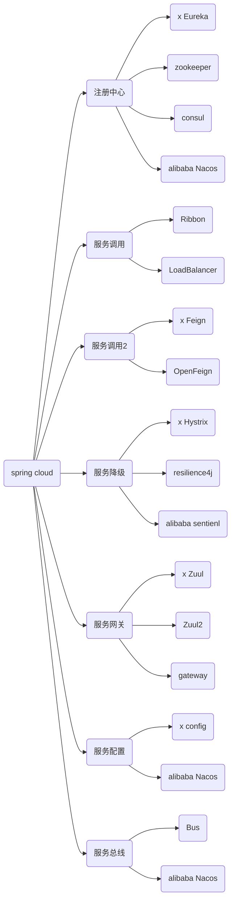

[TOC]
# 版本选择

[参考官网](https://spring.io/projects/spring-cloud#overview)

如果您需要升级您的项目到 Spring cloud ，Spring cloud 使用的版本需要与您现在使用的 Spring boot 版本相对应，下面列出官网对应的版本号。


更详细版本信息 ： https://start.spring.io/actuator/info

```json
{
    "git":{
        "branch":"6dcd14a3247ad8905ca0b321597e813dd6744bf5",
        "commit":{
            "id":"6dcd14a",
            "time":"2022-04-28T18:46:26Z"
        }
    },
    "build":{
        "version":"0.0.1-SNAPSHOT",
        "artifact":"start-site",
        "versions":{
            "spring-boot":"2.6.6",
            "initializr":"0.13.0-SNAPSHOT"
        },
        "name":"start.spring.io website",
        "time":"2022-04-28T18:47:38.065Z",
        "group":"io.spring.start"
    },
    "bom-ranges":{
        "codecentric-spring-boot-admin":{
            "2.4.3":"Spring Boot >=2.3.0.M1 and <2.5.0-M1",
            "2.5.6":"Spring Boot >=2.5.0.M1 and <2.6.0-M1",
            "2.6.5":"Spring Boot >=2.6.0.M1 and <2.7.0-M1"
        },
        "solace-spring-boot":{
            "1.1.0":"Spring Boot >=2.3.0.M1 and <2.6.0-M1",
            "1.2.1":"Spring Boot >=2.6.0.M1 and <2.7.0-M1"
        },
        "solace-spring-cloud":{
            "1.1.1":"Spring Boot >=2.3.0.M1 and <2.4.0-M1",
            "2.1.0":"Spring Boot >=2.4.0.M1 and <2.6.0-M1",
            "2.3.0":"Spring Boot >=2.6.0.M1 and <2.7.0-M1"
        },
        "spring-cloud":{
            "Hoxton.SR12":"Spring Boot >=2.2.0.RELEASE and <2.4.0.M1",
            "2020.0.5":"Spring Boot >=2.4.0.M1 and <2.6.0-M1",
            "2021.0.0-M1":"Spring Boot >=2.6.0-M1 and <2.6.0-M3",
            "2021.0.0-M3":"Spring Boot >=2.6.0-M3 and <2.6.0-RC1",
            "2021.0.0-RC1":"Spring Boot >=2.6.0-RC1 and <2.6.1",
            "2021.0.2":"Spring Boot >=2.6.1 and <2.6.8-SNAPSHOT",
            "2021.0.3-SNAPSHOT":"Spring Boot >=2.6.8-SNAPSHOT and <3.0.0-M1",
            "2022.0.0-M1":"Spring Boot >=3.0.0-M1 and <3.0.0-M2",
            "2022.0.0-M2":"Spring Boot >=3.0.0-M2 and <3.1.0-M1"
        },
        "spring-cloud-azure":{
            "4.0.0":"Spring Boot >=2.5.0.M1 and <2.7.0-M1"
        },
        "spring-cloud-gcp":{
            "2.0.10":"Spring Boot >=2.4.0-M1 and <2.6.0-M1",
            "3.2.1":"Spring Boot >=2.6.0-M1 and <2.7.0-M1"
        },
        "spring-cloud-services":{
            "2.3.0.RELEASE":"Spring Boot >=2.3.0.RELEASE and <2.4.0-M1",
            "2.4.1":"Spring Boot >=2.4.0-M1 and <2.5.0-M1",
            "3.3.0":"Spring Boot >=2.5.0-M1 and <2.6.0-M1",
            "3.4.0":"Spring Boot >=2.6.0-M1 and <2.7.0-M1"
        },
        "spring-geode":{
            "1.3.12.RELEASE":"Spring Boot >=2.3.0.M1 and <2.4.0-M1",
            "1.4.13":"Spring Boot >=2.4.0-M1 and <2.5.0-M1",
            "1.5.13":"Spring Boot >=2.5.0-M1 and <2.6.0-M1",
            "1.6.7":"Spring Boot >=2.6.0-M1 and <2.7.0-M1",
            "1.7.0-RC1":"Spring Boot >=2.7.0-M1 and <3.0.0-M1",
            "2.0.0-M2":"Spring Boot >=3.0.0-M1 and <3.1.0-M1"
        },
        "vaadin":{
            "14.8.9":"Spring Boot >=2.1.0.RELEASE and <2.6.0-M1",
            "23.0.7":"Spring Boot >=2.6.0-M1 and <2.8.0-M1"
        },
        "wavefront":{
            "2.0.2":"Spring Boot >=2.1.0.RELEASE and <2.4.0-M1",
            "2.1.1":"Spring Boot >=2.4.0-M1 and <2.5.0-M1",
            "2.2.2":"Spring Boot >=2.5.0-M1 and <2.7.0-M1"
        }
    },
    "dependency-ranges":{
        "native":{
            "0.9.0":"Spring Boot >=2.4.3 and <2.4.4",
            "0.9.1":"Spring Boot >=2.4.4 and <2.4.5",
            "0.9.2":"Spring Boot >=2.4.5 and <2.5.0-M1",
            "0.10.0":"Spring Boot >=2.5.0-M1 and <2.5.2",
            "0.10.1":"Spring Boot >=2.5.2 and <2.5.3",
            "0.10.2":"Spring Boot >=2.5.3 and <2.5.4",
            "0.10.3":"Spring Boot >=2.5.4 and <2.5.5",
            "0.10.4":"Spring Boot >=2.5.5 and <2.5.6",
            "0.10.5":"Spring Boot >=2.5.6 and <2.5.9",
            "0.10.6":"Spring Boot >=2.5.9 and <2.6.0-M1",
            "0.11.0-M1":"Spring Boot >=2.6.0-M1 and <2.6.0-RC1",
            "0.11.0-M2":"Spring Boot >=2.6.0-RC1 and <2.6.0",
            "0.11.0-RC1":"Spring Boot >=2.6.0 and <2.6.1",
            "0.11.0":"Spring Boot >=2.6.1 and <2.6.2",
            "0.11.1":"Spring Boot >=2.6.2 and <2.6.3",
            "0.11.2":"Spring Boot >=2.6.3 and <2.6.4",
            "0.11.3":"Spring Boot >=2.6.4 and <2.6.6",
            "0.11.4":"Spring Boot >=2.6.6 and <2.7.0-M1"
        },
        "okta":{
            "1.4.0":"Spring Boot >=2.2.0.RELEASE and <2.4.0-M1",
            "1.5.1":"Spring Boot >=2.4.0-M1 and <2.4.1",
            "2.0.1":"Spring Boot >=2.4.1 and <2.5.0-M1",
            "2.1.5":"Spring Boot >=2.5.0-M1 and <2.7.0-M1"
        },
        "mybatis":{
            "2.1.4":"Spring Boot >=2.1.0.RELEASE and <2.5.0-M1",
            "2.2.2":"Spring Boot >=2.5.0-M1"
        },
        "camel":{
            "3.5.0":"Spring Boot >=2.3.0.M1 and <2.4.0-M1",
            "3.10.0":"Spring Boot >=2.4.0.M1 and <2.5.0-M1",
            "3.13.0":"Spring Boot >=2.5.0.M1 and <2.6.0-M1",
            "3.16.0":"Spring Boot >=2.6.0.M1 and <2.7.0-M1"
        },
        "picocli":{
            "4.6.3":"Spring Boot >=2.4.0.RELEASE and <3.0.0-M1"
        },
        "open-service-broker":{
            "3.2.0":"Spring Boot >=2.3.0.M1 and <2.4.0-M1",
            "3.3.1":"Spring Boot >=2.4.0-M1 and <2.5.0-M1",
            "3.4.0-M2":"Spring Boot >=2.5.0-M1 and <2.6.0-M1"
        }
    }
}
```

这里使用版本：

```
Spring cloud ：Hoxton.SR1
boot 2.2.2.RELEASE
clould alibaba 2.1.0.RELEASE
Jdk 1.8
maven 3.5+
mysql 5.7+
```




# 环境搭建

Maven可以使用`dependencyManagement`元素来提供一种管理依赖版本号的方式，通常会在一个组织或者项目的最顶层的父POM中看到`dependencyManagement`元素，使用pom.xml中的`dependencyManagement`元素能让所有在子项目中引用个依赖而不用显式的列出版本量，Maven会沿着父子层次向上走，直到找到一个拥有`dependencyManagement`元素的项目，然后它就会使用这个
`dependencyManagement`元素中指定的版本号。

这样做的好处就是：如果有多个子项目都引用同一样依赖，则可以避免在每个使用的子项目里都声明一个版本号，这样当想升级或切换到另一个版本时，只需要在顶层父容器里更新，而不需要一个一个子项目的修改；另外如果某个子项目需要另外的一个版本，只需要声明version就可。

- `dependencyManagement`里只是声明依赖，**并不实现引入**，因此**子项目需要显示的声明需要用的依赖**。
- 如果不在子项目中声明依赖，是不会从父项目中继承下来的；只有在子项目中写了该依赖项,并且没有指定具体版本，才会从父项目中继承该项，并且version和scope都读取自父pom。
- 如果子项目中指定了版本号，那么会使用子项目中指定的jar版本。

# http 远程调用

## RestTemplate

作为一名java服务端开发者，我们一般是提供接口给前端调用，但要是遇到我们也需求请求第三方接口，类似前端那样调用第三方接口，该怎么办？

RestTemplate 是Spring 用于同步 client 端的核心类，简化了与 http 服务的通信，并满足 RestFul 原则，程序代码可以给它提供 URL，并提取结果。默认情况下，RestTemplate 默认依赖 jdk 的 HTTP 连接工具。当然你也可以 通过setRequestFactory 属性切换到不同的 HTTP 源，比如 Apache HttpComponents、Netty 和 OkHttp。

RestTemplate 中定义了 36 个与 REST 资源交互的方法，其中的大多数都对应于 HTTP 的方法。其实，这里面只有 11 个独立的方法，其中有十个有三种重载形式，而第十一个则重载了六次，这样一共形成了36个方法。

- delete() 在特定的URL上对资源执行HTTP DELETE操作

- exchange() 在URL上执行特定的 HTTP 方法，返回包含对象的 ResponseEntity，这个对象是从响应体中
  映射得到的

- execute() 在URL上执行特定的 HTTP 方法，返回一个从响应体映射得到的对象

- getForEntity() 发送一个HTTP GET请求，返回的 ResponseEntity 包含了响应体所映射成的对象

- getForObject() 发送一个 HTTP GET 请求，返回的请求体将映射为一个对象

- postForEntity() POST 数据到一个URL，返回包含一个对象的ResponseEntity，这个对象是从响应体中映射得
  到的

- postForObject() POST 数据到一个URL，返回根据响应体匹配形成的对象

- headForHeaders() 发送HTTP HEAD请求，返回包含特定资源URL的HTTP头

- optionsForAllow() 发送HTTP OPTIONS请求，返回对特定URL的Allow头信息

- postForLocation() POST 数据到一个URL，返回新创建资源的URL

- put() PUT 资源到特定的URL

实际上,由于Post 操作的**非幂等性**,它几乎可以代替其他的CRUD操作。

RestTemplate 的 get 方法有以上几个,可以分为两类: getForEntity() 和 getForObject()，首先看 getForEntity() 的返回值类型 ResponseEntity

```java
<T> ResponseEntity<T> getForEntity()
```

ResponseEntity 继承了 HttpEntity，封装了返回的响应信息包括响应状态、响应头和响应体。

### get请求

#### getForEntity

一个简单的使用示例：

```java
@RestController
public class UserController {

    @Autowired
    private UserService userService;

    @RequestMapping(value = "getAll")
    public List<UserEntity> getUser() {
        List<UserEntity> list = userService.getAll();
        return list;
    }

    @RequestMapping("get/{id}")
    public UserEntity getById(@PathVariable(name = "id") String id) {

        return userService.getById(id);
    }


    @RequestMapping(value = "save")
    public String save(UserEntity userEntity) {

        return "保存成功";
    }


    @RequestMapping(value = "saveByType/{type}")
    public String saveByType(UserEntity userEntity,@PathVariable("type")String type) {

        return "保存成功,type="+type;
    }
}
```

无参数的 getForEntity 方法

```java
 @RequestMapping("getForEntity")
    public List<UserEntity> getAll2() {
        ResponseEntity<List> responseEntity = restTemplate.getForEntity("http://localhost/getAll", List.class);
        HttpHeaders headers = responseEntity.getHeaders();
        HttpStatus statusCode = responseEntity.getStatusCode();
        int code = statusCode.value();

        List<UserEntity> list = responseEntity.getBody();

        System.out.println(list.toString());
        return list;
    }
```

有参数的 getForEntity 请求,参数列表,可以使用 {} 进行 url 路径占位符

```java
 //有参数的 getForEntity 请求,参数列表
    @RequestMapping("getForEntity/{id}")
    public UserEntity getById2(@PathVariable(name = "id") String id) {

        ResponseEntity<UserEntity> responseEntity = restTemplate.getForEntity("http://localhost/get/{id}", UserEntity.class, id);
        UserEntity userEntity = responseEntity.getBody();
        return userEntity;
    }
```

有参数的 get 请求,使用map封装参数

```java
    //有参数的 get 请求,使用map封装参数
    @RequestMapping("getForEntity/{id}")
    public UserEntity getById4(@PathVariable(name = "id") String id) {
        HashMap<String, String> map = new HashMap<>();
        map.put("id",id);

        ResponseEntity<UserEntity> responseEntity = restTemplate.getForEntity("http://localhost/get/{id}", UserEntity.class, map);
        UserEntity userEntity = responseEntity.getBody();

        return userEntity;
    }
```

返回的 responseEntity 的信息如图:


因此可以获取Http请求的全部信息。

但是，通常情况下我们并不想要Http请求的全部信息，只需要相应体即可。对于这种情况，RestTemplate提供了 getForObject() 方法用来只获取响应体信息。

getForObject 和 getForEntity 用法几乎相同，只是返回值返回的是响应体，省去了我们再去 getBody() 。

#### getForObject

无参数的 getForObject 请求

```java
    //无参数的 getForObject 请求
    @RequestMapping("getAll2")
    public List<UserEntity> getAll() {
        List<UserEntity> list = restTemplate.getForObject("http://localhost/getAll", List.class);


        System.out.println(list.toString());
        return list;

    }
```

有参数的 getForObject 请求,使用参数列表

```java
   //有参数的 getForObject 请求
    @RequestMapping("get2/{id}")
    public UserEntity getById(@PathVariable(name = "id") String id) {

        UserEntity userEntity = restTemplate.getForObject("http://localhost/get/{id}", UserEntity.class, id);

        return userEntity;
    }
```

有参数的 get 请求,使用map封装请求参数

```java

    //有参数的 get 请求,使用map封装请求参数
    @RequestMapping("get3/{id}")
    public UserEntity getById3(@PathVariable(name = "id") String id) {
        HashMap<String, String> map = new HashMap<>();
        map.put("id",id);

        UserEntity userEntity = restTemplate.getForObject("http://localhost/get/{id}", UserEntity.class, map);

        return userEntity;
    }
```

### Post请求


#### postForEntity

post 请求,保存 UserEntity 对像

```java
//post 请求,提交 UserEntity 对像

@RequestMapping("saveUser")
public String save(UserEntity userEntity) {

    ResponseEntity<String> responseEntity = restTemplate.postForEntity("http://localhost/save", userEntity, String.class);
    String body = responseEntity.getBody();

    return body;

}
```


有参数的 postForEntity 请求

```java

   // 有参数的 postForEntity 请求
    @RequestMapping("saveUserByType/{type}")
    public String save2(UserEntity userEntity,@PathVariable("type")String type) {

        ResponseEntity<String> responseEntity = restTemplate.postForEntity("http://localhost/saveByType/{type}", userEntity, String.class, type);
        String body = responseEntity.getBody();

        return body;

    }

    // 有参数的 postForEntity 请求,使用map封装
    @RequestMapping("saveUserByType2/{type}")
    public String save3(UserEntity userEntity,@PathVariable("type")String type) {
        HashMap<String, String> map = new HashMap<>();
         map.put("type", type);


        ResponseEntity<String> responseEntity = restTemplate.postForEntity("http://localhost/saveByType/{type}", userEntity, String.class,map);
        String body = responseEntity.getBody();

        return body;

    }


```

## Feign

Feign是一个声明式WebService客户端。使用Feign能让编写Web Service客户端更加简单。它的使用方法是定义一个服务接口然后在上面添加注解。Feign也支持可拔插式的编码器和解码器。Spring Cloud对Feign进行了封装，使其支持了Spring MVC标准注解和 HttpMessageConverters。Feign可以与 Eureka 和 Ribbon 组合使用以支持负载均衡。

**Feign旨在使用接口调用的方式来实现HTTP远程调用**。

前面在使用Ribbon+RestTemplate时，利用RestTemplate对http请求的封装处理，形成了一套模版化的调用方法。但是在实际开发中，由于对服务依赖的调用可能不止一处，往往一个接口会被多处调用，所以通常都会针对每个微服务自行封装一些客户端类来包装这些依赖服务的调用。所以，Feign在此基础上做了进一步封装，由他来帮助我们定义和实现依赖服务接口的定义。

在Feign的实现下，我们只需创建一个**接口**并**使用注解的方式来配置**它(以前是Dao接口上面标注Mapper注解,现在是一个微服务接口上面标注一个Feign注解即可)，即可完成对服务提供方的接口绑定，简化了使用Spring cloud Ribbon 时，**自动封装服务调用客户端**的开发量。

**Feign集成了Ribbon**

利用Ribbon维护服务提供者的服务列表信息，并且通过轮询实现了客户端的负载均衡。而与Ribbon不同的是，**通过feign只需要定义服务并绑定到接口且以声明式的方法**，优雅而简单的实现了服务调用。

```xml
<dependency>
    <groupId>org.springframework.cloud</groupId>
    <artifactId>spring-cloud-starter-feign</artifactId>
</dependency>
```

## OpenFeign

**Feign和OpenFeign两者区别**

**Feign**是Spring Cloud组件中的一个轻量级RESTful的HTTP服务客户端Feign内置了Ribbon，用来做客户端负载均衡，去调用服务注册中心的服务。Feign的使用方式是:使用Feign的注解定义接口，调用这个接口，就可以调用服务注册中心的服务。

OpenFeign是Spring Cloud在Feign的基础上支持了SpringMVC的注解，如@RequesMapping等等。OpenFeign的@Feignclient可以解析SpringMVc的@RequestMapping注解下的接口，并通过动态代理的方式产生实现类，实现类中做负载均衡并调用其他服务。

```xml
<dependency>
    <groupId>org.springframework.cloud</groupId>
    <artifactId>spring-cloud-starter-openfeign</artifactId>
</dependency>
```

### 示例

```
cloud-consumer-eureka-openFeign-order80
cloud-eureka-server7001
cloud-eureka-server7002
cloud-provider-eureka-payment8001
cloud-provider-eureka-payment8002
```


### 超时控制

OpenFeign 默认等待 1 秒钟，超时即报错

```yml
#设置feign客户端超时时间(OpenFeign默认支持ribbon)(单位：毫秒)
ribbon:
  #指的是建立连接后从服务器读取到可用资源所用的时间
  ReadTimeout: 5000
  #指的是建立连接所用的时间，适用于网络状况正常的情况下,两端连接所用的时间
  ConnectTimeout: 5000
```

### 日志打印

日志打印功能

Feign提供了日志打印功能，我们可以通过配置来调整日恙级别，从而了解Feign 中 Http请求的细节。

说白了就是对Feign接口的调用情况进行监控和输出

日志级别

- NONE：默认的，不显示任何日志;
- BASIC：仅记录请求方法、URL、响应状态码及执行时间;
- HEADERS：除了BASIC中定义的信息之外，还有请求和响应的头信息;
- FULL：除了HEADERS中定义的信息之外，还有请求和响应的正文及元数据。

配置日志bean

```java
import feign.Logger;
import org.springframework.context.annotation.Bean;
import org.springframework.context.annotation.Configuration;

@Configuration
public class FeignConfig
{
    @Bean
    Logger.Level feignLoggerLevel()
    {
        return Logger.Level.FULL;
    }
}
```

**YML文件里配置需要开启日志的Feign客户端**

```yml
logging:
  level:
    # feign日志以什么级别监控哪个接口
    com.order80.service.PaymentFeignService: debug
```

# 服务注册中心

## Eureka

Eureka采用了CS的设计架构，Eureka Sever作为服务注册功能的服务器，它是服务注册中心。而系统中的其他微服务，使用Eureka的客户端连接到 Eureka Server并维持心跳连接。这样系统的维护人员就可以通过Eureka Server来监控系统中各个微服务是否正常运行。

在服务注册与发现中，有一个注册中心。当服务器启动的时候，会把当前自己服务器的信息比如服务地址通讯地址等以别名方式注册到注册中心上。另一方(消费者服务提供者)，以该别名的方式去注册中心上获取到实际的服务通讯地址，然后再实现本地RPC调用RPC远程调用框架核心设计思想:在于注册中心，因为使用注册中心管理每个服务与服务之间的一个依赖关系(服务治理概念)。在任何RPC远程框架中，都会有一个注册中心存放服务地址相关信息(接口地址)

**Eureka包含两个组件: Eureka Server 和 Eureka Client **

- Eureka Server 提供服务注册服务

 各个微服务节点通过配置启动后，会在 EurekaServer 中进行注册，这样 EurekaServer 中的服务注册表中将会存储所有可用服务节点的信息，服务节点的信息可以在界面中直观看到。

- Eureka Client 通过注册中心进行访问

**它是一个 Java 客户端**，用于简化 Eureka Server 的交互，客户端同时也具备一个内置的、使用轮询(round-robin)负载算法的负载均衡器。在应用启动后，将会向 Eureka Server 发送心跳(默认周期为30秒)。如果 Eureka Server 在多个心跳周期内没有接收到某个节点的心跳，EurekaServer 将会从服务注册表中把这个服务节点移除（**默认90秒**)


### maven 版本说明

```xml
<!-- eureka 新旧版本 -->
<!-- 以前的老版本（2018）不区分 server 和 client -->
<dependency>
    <groupid>org.springframework.cloud</groupId>
    <artifactId>spring-cloud-starter-eureka</artifactId>
</dependency>

<!-- 现在新版本（2020.2）区分 server 和 client  -->
<dependency>
    <groupId>org.springframework.cloud</groupId>
    <artifactId>spring-cloud-starter-netflix-eureka-server</artifactId>
</dependency>
```

### Eureka Server服务端安装


#### 单机搭建

Eureka 也是一个普通的 spring boot 的项目，直接创建并部署到服务器即可。

#### Eureka server 集群搭建


服务注册：将服务信息注册进注册中心

服务发现：从注册中心上获取服务信息

实质：存key服务命取value闭用地址

1. 先启动eureka注册中心

2. 启动服务提供者payment支付服务

3. 支付服务启动后会把自身信息(比服务地址L以别名方式注朋进eureka

4. 消费者order服务在需要调用接口时，使用服务别名去注册中心获取实际的RPC远程调用地址

5. 消去者导调用地址后，底屋实际是利用HttpClient技术实现远程调用

6. 消费者实癸导服务地址后会缓存在本地jvm内存中，默认每间隔30秒更新—次服务调用地址

集群搭建要求各个 server 互相监督，在每个 eureka-server 端配置其他的 eureka-server 地址

这里以两台示例：

7001 为一个 eureka-server

```yml
server:
  port: 7001

eureka:
  instance:
    hostname: eureka-register # 应用名称，将会显示在Eureka界面的应用名称列
  client:
    register-with-eureka: false #false表示不向注册中心注册自己。
    fetch-registry: false #false表示自己端就是注册中心，我的职责就是维护服务实例，并不需要去检索服务
    service-url:
      defaultZone: http://127.0.0.1:7002/eureka/ # 集群配置时指向其它eureka 多个以逗号隔开
      # 单机就指向自己  http://127.0.0.1:7001/eureka/
```

7002 也为一个 eureka-server

```yml
server:
  port: 7002

eureka:
  instance:
    hostname: eureka-register # 应用名称，将会显示在Eureka界面的应用名称列
  client:
    register-with-eureka: false #false表示不向注册中心注册自己。
    fetch-registry: false #false表示自己端就是注册中心，我的职责就是维护服务实例，并不需要去检索服务
    service-url:
      defaultZone: http://127.0.0.1:7001/eureka/ # 集群配置时指向其它eureka 多个以逗号隔开
      # 单机就指向自己  http://127.0.0.1:7002/eureka/

```

### Eureka client 客户端安装

```xml
<!-- 现在新版本（2020.2）区分 server 和 client  -->
<dependency>
    <groupId>org.springframework.cloud</groupId>
    <artifactId>spring-cloud-starter-netflix-eureka-client</artifactId>
</dependency>
```

服务消费者和服务提供者都是 eureka-client

#### 单机搭建


#### Eureka client 集群搭建

这里以两台服务提供者集群示例：

8001

```yml
server:
  port: 8001

spring:
  application:
    name: cloud-provider-payment # 服务提供者功能相同则取同样的名称
  datasource:
    type: com.alibaba.druid.pool.DruidDataSource  # 当前数据源操作类型
    driver-class-name: com.mysql.cj.jdbc.Driver  # mysql 驱动
    url: jdbc:mysql://101.43.208.215:3306/springCloudDemoDb?useUnicode=true&serverTimezone=GMT%2B8&characterEncoding=UTF-8&useSSL=true
    username: root
    password: root

mybatis:
  mapper-locations: classpath:mapper/*.xml

eureka:
  client:
    register-with-eureka: true #表示是否将自己注册进Eurekaserver默认为true。
    fetch-registry: true #是否从EurekaServer抓取已有的注册信息，默认为true。单节点无所谓，集群必须设置为true才能配合ribbon使用负载均衡
    service-url:
      defaultZone: http://127.0.0.1:7001/eureka/,http://127.0.0.1:7002/eureka/

```

8002

```yml
server:
  port: 8002

spring:
  application:
    name: cloud-provider-payment # 服务提供者功能相同则取同样的名称
  datasource:
    type: com.alibaba.druid.pool.DruidDataSource  # 当前数据源操作类型
    driver-class-name: com.mysql.cj.jdbc.Driver  # mysql 驱动
    url: jdbc:mysql://101.43.208.215:3306/springCloudDemoDb?useUnicode=true&serverTimezone=GMT%2B8&characterEncoding=UTF-8&useSSL=true
    username: root
    password: root

mybatis:
  mapper-locations: classpath:mapper/*.xml

eureka:
  client:
    register-with-eureka: true #表示是否将自己注册进Eurekaserver默认为true。
    fetch-registry: true #是否从EurekaServer抓取已有的注册信息，默认为true。单节点无所谓，集群必须设置为true才能配合ribbon使用负载均衡
    service-url:
      defaultZone: http://127.0.0.1:7001/eureka/,http://127.0.0.1:7002/eureka/

```


### 使用 Eureka 查找服务

在调用服务时以服务注册名称查找并**开启负载均衡**

服务消费者示例

```java
@Slf4j
@RestController
public class OrderController {

    //在调用服务时以服务注册名称查找
    private static final String PAYMENT_URL = "http://CLOUD-PROVIDER-PAYMENT"; 
    @Resource
    private RestTemplate restTemplate;


    /**
     * 调用成功但是插入数据失败，原因是 http://localhost:8001/payment/create
     * 并未获取到此处传递过去的 payment 对象，解决方案：
     * 在服务提供方 http://localhost:8001/payment/create 对应的 Controller 方法参数
     * 中标注 @RequestBody，告诉在服务提供方从 RequestBody 中获取参数
     * public CommonResult create(@RequestBody //添加到这里 Payment payment){
     *      ...
     */
    @PostMapping("/consumer/payment/create")
    public CommonResult<Payment> create(Payment payment){
        return restTemplate.postForObject(PAYMENT_URL+"/payment/create",payment, CommonResult.class);
    }

    @GetMapping("/consumer/payment/get/{id}")
    public CommonResult<Payment> getPayment(@PathVariable("id") Long id){
        return restTemplate.getForObject(PAYMENT_URL+"/payment/get/"+id,CommonResult.class);
    }

}
```

```java
@Configuration
public class ApplicationContextConfig {

    @Bean
    @LoadBalanced // 开启负载均衡，默认为轮训
    public RestTemplate getRestTemplate(){
        return new RestTemplate();
    }

}
```

### 配置 Eureka 界面显示信息

```yml
eureka:
  instance:
    instance-id: cloud-provider-payment-8001  # eureka 界面显示用
    prefer-ip-address: true # eureka 界面显示实例的 IP 地址
```


### 获取注册中心详细信息

可以通过 DiscoveryClient 来获取注册中心的服务详细信息

1. 在启动类添加注解 @EnableDiscoveryClient

```
@SpringBootApplication
@EnableEurekaClient
@EnableDiscoveryClient // 用于获取关于注册中心的详细信息
public class PaymentMain8001 {
    public static void main(String[] args) {
        SpringApplication.run(PaymentMain8001.class,args);
    }
}
```

2. 在 Controller 注入 org.springframework.cloud.client.discovery.DiscoveryClient 并获取

```java
@RestController
@Slf4j
public class PaymentController{
    @Resource
    private PaymentService paymentService;
    
    @Resource
    // 用于获取关于注册中心的详细信息
    private DiscoveryClient discoveryClient;

    @Value("${server.port}")
    private String serverPort;

    @PostMapping(value = "/payment/create")
    public CommonResult<Payment> create(@RequestBody Payment payment)
    {
        Long result = paymentService.create(payment);
        log.info("*****插入结果："+result);

        if(result > 0)
        {
            return new CommonResult<>(200, "插入数据库成功,serverPort: " + serverPort, payment);
        }else{
            return new CommonResult<>(444, "插入数据库失败", null);
        }
    }

    @GetMapping(value = "/payment/get/{id}")
    public CommonResult<Payment> getPaymentById(@PathVariable("id") Long id)
    {
        Payment payment = paymentService.getPaymentById(id);

        if(payment != null)
        {
            return new CommonResult<>(200, "查询成功,serverPort:  " + serverPort, payment);
        }else{
            return new CommonResult<>(444, "没有对应记录,查询ID: " + id, null);
        }
    }

    @GetMapping(value = "/payment/discovery")
    public Object getDiscovery(){
        //获取所有的服务名称
        for (String service : discoveryClient.getServices()) {
            System.out.println("service:"+service);
            //根据名称获取具体的服务信息
            for (ServiceInstance instance : discoveryClient.getInstances(service)) {
                System.out.println("InstanceId:"+instance.getInstanceId());
                System.out.println("Host:"+instance.getHost());
                System.out.println("Scheme:"+instance.getScheme());
                System.out.println("ServiceId:"+instance.getServiceId());
                System.out.println("Port:"+instance.getPort());
            }

        }
        return discoveryClient;
    }
}
```

### Eureka 自我保护机制


保护模式主要用于一组客户端和 Eureka Server 之间存在网络分区场景下的保护。一旦进入保护模式，Eureka Server 将会尝试保护其服务注册表中的信息，**不再删除服务注册表中的数据，也就是不会注销任何微服务**。

如果在 Eureka Server 的首页看到上述提示，则说明Eureka进入了保护模式

**导致原因**

某时刻某一个微服务不可用了，Eureka 不会立刻清理，依旧会对该微服务的信息进行保存，属于 CAP 里面的 AP 实现。

**为什么会产生Eureka自我保护机制?**

为了 EurekaClient 可以正常运行，防止与 EurekaServer 网络不通情况下，EurekaServer 不会立刻将 EurekaClient 服务剔除

**什么是自我保护模式?**

默认情况下，如果 EurekaServer 在一定时间内没有接收到某个微服务实例的心跳，EurekaServer 将会注销该实例(默认90秒)。但是当网络分区故障发生(延时、卡顿、拥挤)时，微服务与 EurekaServer 之间无法正常通信，以上行为可能变得非常危险——因为微服务本身其实是健康的，此时本不应该注销这个微服务。Eureka 通过“自我保护模式”来解决这个问题——当EurekaServer 节点在短时间内丢失过多客户端时(可能发生了网络分区故障)，那么这个节点就会进入自我保护模式。

自我保护机制∶默认情况下 Eureka Client 定时向 Eureka Server 端发送心跳包,如果 Eureka 在 server 端在一定时间内(默认90秒)没有收到 Eureka Client 发送心跳包，便会直接从服务注册列表中剔除该服务，但是在短时间( 90秒中)内丢失了大量的服务实例心跳，这时候 Eureka server 会开启自我保护机制，不会剔除该服务（该现象可能出现在如果网络不通但是 Eureka Client 未出现宕机，此时如果换做别的注册中心如果一定时间内没有收到心跳会将剔除该服务，这样就出现了严重失误，因为客户端还能正常发送心跳，只是网络延迟问题，而保护机制是为了解决此问题而产生的)。

**在自我保护模式中，Eureka Server会保护服务注册表中的信息，不再注销任何服务实例**

#### 关闭自我保护

自我保护机制默认是开启的，在 eureka server 端添加配置关闭自我保护

Eureka Server

```yml
eureka:
  ...
  server:
    enable-self-preservation: false # 关闭自我保护机制 默认开启
    eviction-interval-timer-in-ms: 2000 # 表示服务器在收到最后一次心跳之后等待的持续时间 单位 ms
```

关闭效果


Eureka client 

```yml
eureka:
  instance:
    instance-id: cloud-consumer-order # eureka 界面显示用
    prefer-ip-address: true # eureka 界面显示实例的 IP 地址
    lease-renewal-interval-in-seconds: 1 # 心跳间隔 1s 默认 30s
    lease-expiration-duration-in-seconds: 2 # 服务端在收到最后一次心跳后等待时间上限 默认90s
```

## zookeeper

更改 maven 依赖

```xml
 <!-- zookeeper begin  -->
        <dependency>
            <groupId>org.springframework.cloud</groupId>
            <artifactId>spring-cloud-starter-zookeeper-discovery</artifactId>
            <!--先排除自带的zookeeper3.5.3 防止与3.7.0起冲突-->
            <exclusions>
                <exclusion>
                    <groupId>org.apache.zookeeper</groupId>
                    <artifactId>zookeeper</artifactId>
                </exclusion>
            </exclusions>
        </dependency>
        <!--添加zookeeper3.7.0版本-->
        <dependency>
            <groupId>org.apache.zookeeper</groupId>
            <artifactId>zookeeper</artifactId>
            <version>3.7.0</version>
        </dependency>
        <!-- zookeeper end  -->
```

更改启动类

```java
@SpringBootApplication
@EnableDiscoveryClient //该注解用于向使用consul或者zookeeper作为注册中心时注册服务
public class ProviderZookeeperPaymentMain8004 {
    public static void main(String[] args) {
        SpringApplication.run(ProviderZookeeperPaymentMain8004.class,args);
    }
}
```

yml 文件

```yml
server:
  port: 8004

spring:
  application:
    name: cloud-provider-zookeeper-payment # 服务提供者功能相同则取同样的名称
  datasource:
    type: com.alibaba.druid.pool.DruidDataSource  # 当前数据源操作类型
    driver-class-name: com.mysql.cj.jdbc.Driver  # mysql 驱动
    url: jdbc:mysql://101.43.208.215:3306/springCloudDemoDb?useUnicode=true&serverTimezone=GMT%2B8&characterEncoding=UTF-8&useSSL=true
    username: root
    password: root
  cloud:
    zookeeper:
      connect-string: 192.168.1.110:2181,192.168.1.111:2181,192.168.1.112:2181

mybatis:
  mapper-locations: classpath:mapper/*.xml

```

**其他方面与 Eureka 相同，值得注意的是，这里消费端根据名称查找服务时，大小写敏感**

## consul

Consul是一套开源的分布式服务发现和配置管理系统，由HashiCorp 公司用Go语言开发。

提供了微服务系统中的**服务治理**、**配置中心**、**控制总线**等功能。这些功能中的每一个都可以根据需要单独使用，也可以一起使用以构建全方位的服务网格，总之 Consul 提供了一种完整的服务网格解决方案。

它具有很多优点。包括：基于 raft 协议，比较简洁；支持健康检查，同时支持 HTTP 和 DNS 协议支持跨数据中心的 WAN 集群提供图形界面跨平台，支持 Linux、Mac、Windows。可支持：

- 服务发现 - 提供HTTP和DNS两种发现方式。
- 健康监测 - 支持多种方式，HTTP、TCP、Docker、Shell脚本定制化
- KV存储 - Key、Value的存储方式
- 多数据中心 - Consul支持多数据中心
- 可视化Web界面

[Install Consul | Consul - HashiCorp Learn](https://learn.hashicorp.com/tutorials/consul/get-started-install)

[Downloads | Consul by HashiCorp](https://www.consul.io/downloads)

使用版本 1.6.1

windows版解压缩后，得consul.exe，打开cmd

查看版本 `consul -version`

开发模式启动 `consul agent -dev`

浏览器输入 - http://localhost:8500/ - 打开Consul控制页。

**引入依赖**

```xml
<!--添加 consul -->
        <dependency>
            <groupId>org.springframework.cloud</groupId>
            <artifactId>spring-cloud-starter-consul-discovery</artifactId>
        </dependency>
```

yml

```yml
server:
  port: 8001

spring:
  application:
    name: cloud-provider-consul-payment # 服务提供者功能相同则取同样的名称
  datasource:
    type: com.alibaba.druid.pool.DruidDataSource  # 当前数据源操作类型
    driver-class-name: com.mysql.cj.jdbc.Driver  # mysql 驱动
    url: jdbc:mysql://101.43.208.215:3306/springCloudDemoDb?useUnicode=true&serverTimezone=GMT%2B8&characterEncoding=UTF-8&useSSL=true
    username: root
    password: root
  cloud:
    consul:
      host: 127.0.0.1
      port: 8500
      discovery:
        service-name: ${spring.application.name}

mybatis:
  mapper-locations: classpath:mapper/*.xml
```

# 负载均衡

## 客户端负载均衡

### Ribbon

Spring Cloud Ribbon是基于Netflix Ribbon实现的一套**客户端负载均衡的工具**。

简单的说，Ribbon是Netflix发布的开源项目，主要功能是提供**客户端的软件负载均衡算法和服务调用**。Ribbon客户端组件提供一系列完善的配置项如连接超时，重试等。

就是在配置文件中列出 Load Balancer (简称LB)后面所有的机器，Ribbon会自动的帮助你基于某种规则(如简单轮询，随机连接等）去连接这些机器。我们很容易使用Ribbon实现自定义的负载均衡算法。

Ribbon目前也进入维护模式，未来可能被Spring Cloud LoadBalacer 替代

Ribbon 负载均衡实现方式：

将逻辑集成到消费方，消费方从服务注册中心获知有哪些地址可用，然后自己再从这些地址中选择出一个合适的服务器，**Ribbon = 负载均衡算法 + RestTemplate 调用**。

Ribbon其实就是一个软负载均衡的客户端组件，它可以和其他所需请求的客户端结合使用，和 Eureka 结合只是其中的一个实例。


Ribbon在工作时分成两步：

- 第一步先选择 EurekaServer ,它优先选择在同一个区域内负载较少的 server。
- 第二步再根据用户指定的策略，在从 server 取到的服务注册列表中选择一个地址。

其中Ribbon提供了多种策略：比如轮询、随机和根据响应时间加权。

#### maven 依赖

先前工程项目没有引入 spring-cloud-starter-ribbon 也可以使用 ribbon。是因为 spring-cloud-starter-netflix-eureka-client 自带了spring-cloud-starter-ribbon 引用

```xml
<dependency>
    <groupld>org.springframework.cloud</groupld>
    <artifactld>spring-cloud-starter-netflix-ribbon</artifactid>
</dependency>
```

#### Ribbon默认自带的负载规则

lRule 接口：根据特定算法中从服务列表中选取一个要访问的服务


- RoundRobinRule 轮询
- RandomRule 随机
- RetryRule 先按照RoundRobinRule的策略获取服务，如果获取服务失败则在指定时间内会进行重
- WeightedResponseTimeRule 对RoundRobinRule的扩展，响应速度越快的实例选择权重越大，越容易被选择
- BestAvailableRule 会先过滤掉由于多次访问故障而处于断路器跳闸状态的服务，然后选择一个并发量最小的服务
- AvailabilityFilteringRule 先过滤掉故障实例，再选择并发较小的实例
- ZoneAvoidanceRule 默认规则,复合判断server所在区域的性能和server的可用性选择服务器

#### Ribbon负载规则替换

官方文档明确给出了警告：Ribbon 自定义配置类不能放在 @ComponentScan 所扫描的当前包下以及子包下，也就是不能被 @ComponentScan 扫描到，否则自定义的这个 Ribbon  配置类就会被所有的 Ribbon 客户端所共享，达不到特殊化定制的目的了

改造 cloud-consumer-eureka-order80 

新建一个包，独立于 @ComponentScan ，ribbonRule


```java
import com.netflix.loadbalancer.IRule;
import com.netflix.loadbalancer.RandomRule;
import org.springframework.context.annotation.Bean;
import org.springframework.context.annotation.Configuration;

@Configuration
public class RibbonRule {

    @Bean
    public IRule myRule(){
        return new RandomRule();
    }

}
```

启动类：

```java
import com.ribbonRule.RibbonRule;
import org.springframework.boot.SpringApplication;
import org.springframework.boot.autoconfigure.SpringBootApplication;
import org.springframework.cloud.netflix.eureka.EnableEurekaClient;
import org.springframework.cloud.netflix.ribbon.RibbonClient;

@SpringBootApplication
@EnableEurekaClient
// 添加Ribbon配置，对于叫 cloud-provider-eureka-payment 的服务，采用 RibbonRule 规定的规则
@RibbonClient(name = "cloud-provider-eureka-payment",configuration = RibbonRule.class)
public class ConsumerEurekaOrderMain80 {
    public static void main(String[] args) {
        SpringApplication.run(ConsumerEurekaOrderMain80.class,args);
    }
}
```

#### Ribbon默认负载轮询算法原理

**默认负载轮训算法: 接口第几次请求数 % 服务器集群总数量 = 实际调用服务器位置下标，每次服务重启动后 rest 接口计数从1开始**

```java
List<Servicelnstance> instances = discoveryClient.getInstances("CLOUD-PAYMENT-SERVICE");
```

如:

List [0] instances = 127.0.0.1:8002

List [1] instances = 127.0.0.1:8001

8001+ 8002组合成为集群，它们共计2台机器，集群总数为2，按照轮询算法原理：

- 当第1次请求时: 1%2=1对应下标位置为1，则获得服务地址为127.0.0.1:8001
- 当第2次请求时: 2%2=О对应下标位置为0，则获得服务地址为127.0.0.1:8002
- 当第3次请求时: 3%2=1对应下标位置为1，则获得服务地址为127.0.0.1:8001
- 当第4次请求时: 4%2=О对应下标位置为0，则获得服务地址为127.0.0.1:8002
- 如此类推…

#### 示例

```
cloud-consumer-eureka-order80
cloud-eureka-server7001
cloud-eureka-server7002
cloud-provider-eureka-payment8001
cloud-provider-eureka-payment8002
```

# 断路器 

复杂分布式体系结构中的应用程序有数十个依赖关系，每个依赖关系在某些时候将不可避免地失败。

多个微服务之间调用的时候，假设微服务A调用微服务B和微服务C，微服务B和微服务C又调用其它的微服务，这就是所谓的“**扇出**”。如果扇出的链路上某个微服务的调用响应时间过长或者不可用，对微服务A的调用就会占用越来越多的系统资源，进而引起系统崩溃，所谓的“雪崩效应”。

对于高流量的应用来说，单一的后避依赖可能会导致所有服务器上的所有资源都在几秒钟内饱和。比失败更糟糕的是，这些应用程序还可能导致服务之间的延迟增加，备份队列，线程和其他系统资源紧张，导致整个系统发生更多的级联故障。这些都表示需要对故障和延迟进行隔离和管理，以便单个依赖关系的失败，不能取消整个应用程序或系统。

所以，通常当你发现一个模块下的某个实例失败后，这时候这个模块依然还会接收流量，然后这个有问题的模块还调用了其他的模块，这样就会发生级联故障，或者叫雪崩。

"断路器” 本身是一种开关装置，当某个服务单元发生故障之后，通过断路器的故障监控（类似熔断保险丝)，**向调用方返回一个符合预期的、可处理的备选响应**（FallBack)，而不是长时间的等待或者抛出调用方无法处理的异常，这样就保证了服务调用方的线程不会被长时间、不必要地占用，从而避免了故障在分布式系统中的蔓延，乃至雪崩。

**服务降级（fallback）、服务熔断（break）、服务限流（flowlimit）是不同的概念。**

## Hystrix

**Hystrix** 是一个用于处理分布式系统的延迟和容错的开源库，在分布式系统里，许多依赖不可避免的会调用失败，比如超时、异常等，Hystrix 能够保证在一个依赖出问题的情况下，不会导致整体服务失败，避免级联故障，以提高分布式系统的弹性。

官网 ：[How To Use · Netflix/Hystrix Wiki (github.com)](https://github.com/Netflix/Hystrix/wiki/How-To-Use)

### 服务降级（fallback）

服务器忙或异常，请稍后再试，不让客户端等待并立刻返回一个友好提示，fallback
既可以**由服务提供者处理**也**可由调用者自行处理**
一般由调用者自行处理

#### 由服务提供者处理

服务提供者 cloud-provider-eureka-hystrix-payment8001

ProviderEurekaHystrixPaymentMain8001.java

```java
@SpringBootApplication
@EnableEurekaClient
@EnableCircuitBreaker // 新增启用 Hystrix
public class ProviderEurekaHystrixPaymentMain8001 {
    public static void main(String[] args) {
        SpringApplication.run(ProviderEurekaHystrixPaymentMain8001.class,args);
    }
}
```

更改服务提供者 Service PaymentServiceImpl.java

```java
@Service
public class PaymentServiceImpl implements PaymentService {

    @Override
    public String paymentInfo_OK(Integer id) {
        return "线程池:  " + Thread.currentThread().getName() + "  paymentInfo_OK,id:  " + id + "\t" + "O(∩_∩)O哈哈~";
    }

    @HystrixCommand(fallbackMethod = "paymentInfo_TimeOutHandler"/*指定善后方法名*/,commandProperties = {
            @HystrixProperty(name="execution.isolation.thread.timeoutInMilliseconds"/*超时时间*/,value="3000")
    })
    @Override
    public String paymentInfo_TimeOut(Integer id) {
        try {
            TimeUnit.MILLISECONDS.sleep(5000);
        } catch (InterruptedException e) {
            e.printStackTrace();
        }
        return "线程池:  " + Thread.currentThread().getName() + " id:  " + id + "\t" + "O(∩_∩)O哈哈~" + "  耗时(秒): 3";
    }

    //用来善后的方法
    public String paymentInfo_TimeOutHandler(Integer id)
    {
        return "线程池:  "+Thread.currentThread().getName()+"  8001系统繁忙或者运行报错，请稍后再试,id:  "+id+"\t"+"o(╥﹏╥)o";
    }


}
```

#### 由调用者自行处理

服务调用者 cloud-consumer-feign-hystrix-order80

更改调用者 ConsumerFeignHystrixOrder80.java

```java
@SpringBootApplication
@EnableFeignClients
@EnableCircuitBreaker
public class ConsumerFeignHystrixOrder80
{
    public static void main(String[] args)
    {
        SpringApplication.run(ConsumerFeignHystrixOrder80.class,args);
    }
}
```

更改调用者 Controller OrderHystirxController.java

```java
@RestController
@Slf4j
public class OrderHystirxController {
    @Resource
    private ConsumerFeignHystrixService consumerFeignHystrixService;

    @GetMapping("/consumer/payment/hystrix/ok/{id}")
    public String paymentInfo_OK(@PathVariable("id") Integer id)
    {
        return consumerFeignHystrixService.paymentInfo_OK(id);
    }

	// 走独立配置
    @HystrixCommand(fallbackMethod = "paymentInfo_TimeOutHandler"/*指定善后方法名*/,commandProperties = {
            @HystrixProperty(name="execution.isolation.thread.timeoutInMilliseconds",value="2000")
    })
    @GetMapping("/consumer/payment/hystrix/timeout/{id}")
    public String paymentInfo_TimeOut(@PathVariable("id") Integer id) {
        return consumerFeignHystrixService.paymentInfo_TimeOut(id);
    }

    //用来善后的方法
    public String paymentInfo_TimeOutHandler(Integer id)
    {
        return "线程池:  "+Thread.currentThread().getName()+"  8001系统繁忙或者运行报错，OrderHystirxController 请稍后再试,id:  "+id+"\t"+"o(╥﹏╥)o";
    }
}
```

#### 配置全局通用的服务降级方法 fallback DefaultProperties

目前问题1 每个业务方法对应一个兜底的方法，代码膨胀

解决方法

除了个别重要核心业务有专属，其它普通的可以通过@DefaultProperties(defaultFallback = “”)统一跳转到统一处理结果页面

以调用者为例，可简单改造其 Controller 即可

```java
@RestController
@Slf4j
// 全局默认的处理
@DefaultProperties(defaultFallback = "payment_Global_FallbackMethod")
public class OrderHystirxController {
    @Resource
    private ConsumerFeignHystrixService consumerFeignHystrixService;

    @GetMapping("/consumer/payment/hystrix/ok/{id}")
    public String paymentInfo_OK(@PathVariable("id") Integer id)
    {
        return consumerFeignHystrixService.paymentInfo_OK(id);
    }

	//走全局
    @HystrixCommand
    @GetMapping("/consumer/payment/hystrix/timeout/{id}")
    public String paymentInfo_TimeOut(@PathVariable("id") Integer id) {
        return consumerFeignHystrixService.paymentInfo_TimeOut(id);
    }

    //用来善后的方法
    public String paymentInfo_TimeOutHandler(Integer id)
    {
        return "线程池:  "+Thread.currentThread().getName()+"  8001系统繁忙或者运行报错，OrderHystirxController 请稍后再试,id:  "+id+"\t"+"o(╥﹏╥)o";
    }

    // 下面是全局fallback方法
    public String payment_Global_FallbackMethod()
    {
        return "Global异常处理信息，请稍后再试，/(ㄒoㄒ)/~~";
    }
}
```

本次案例服务降级处理是在客户端80实现完成的，与服务端8001没有关系。

另外可以通过为 Feign 客户端定义的接口添加一个服务降级处理的实现类即可实现代码解耦。

如下 ：

新增一个 ConsumerFeignHystrixService 接口的实现类

```java
@Component
public class ConsumerFeignHystrixServiceImpl implements ConsumerFeignHystrixService {
    @Override
    public String paymentInfo_OK(Integer id) {
        return "ConsumerFeignHystrixServiceImpl";
    }

    @Override
    public String paymentInfo_TimeOut(Integer id) {
        return "ConsumerFeignHystrixServiceImpl";
    }
}
```

并在接口配置超时处理类 @FeignClient 的 fallback

```java
@Component
@FeignClient(value = "CLOUD-PROVIDER-EUREKA-HYSTRIX-PAYMENT",
            /*配置超时处理类*/
            fallback = ConsumerFeignHystrixServiceImpl.class)
public interface ConsumerFeignHystrixService {

    @GetMapping("/payment/hystrix/ok/{id}")
    String paymentInfo_OK(@PathVariable("id") Integer id);

    @GetMapping("/payment/hystrix/timeout/{id}")
    String paymentInfo_TimeOut(@PathVariable("id") Integer id);

}
```

新增配置命令 feign 开启 hystrix

```yml
server:
  port: 80

spring:
  application:
    name: cloud-consumer-eureka-order80

eureka:
  instance:
    instance-id: cloud-consumer-order # eureka 界面显示用
    prefer-ip-address: true # eureka 界面显示实例的 IP 地址
    #lease-renewal-interval-in-seconds: 1 # 心跳间隔 1s 默认 30s
    #lease-expiration-duration-in-seconds: 2 # 服务端在收到最后一次心跳后等待时间上限 默认90s
  client:
    register-with-eureka: true #表示是否将自己注册进Eurekaserver默认为true。
    fetch-registry: true #是否从EurekaServer抓取已有的注册信息，默认为true。单节点无所谓，集群必须设置为true才能配合ribbon使用负载均衡
    service-url:
      defaultZone: http://127.0.0.1:7001/eureka/,http://127.0.0.1:7002/eureka/

# 新增命令 feign 开启 hystrix
feign:
  hystrix:
    enabled: true

```

故意关闭微服务8001

客户端自己调用提示 - 此时服务端provider已经down了，但是我们做了服务降级处理，让客户端在服务端不可用时也会获得提示信息。

### 服务熔断（break）

熔断机制是应对雪崩效应的一种微服务链路保护机制。当扇出链路的某个微服务出错不可用或者响应时间太长时，会进行服务的降级，进而熔断该节点微服务的调用，快速返回错误的响应信息。**当检测到该节点微服务调用响应正常后，恢复调用链路。**

在Spring Cloud框架里，熔断机制通过 Hystrix 实现。Hystrix 会监控微服务间调用的状况，当失败的调用到一定阈值，**缺省是 5 秒内 20 次调用失败**，就会启动熔断机制。熔断机制的注解是 @HystrixCommand。

[Martin Fowler的相关论文](https://martinfowler.com/bliki/CircuitBreaker.html)

#### 由服务提供者处理

改造服务提供者 Service

```java
@Service
public class PaymentServiceBreakImpl implements PaymentServiceBreak {

    @Override
    public String paymentInfo_OK(Integer id) {
        return "线程池:  " + Thread.currentThread().getName() + "  paymentInfo_OK,id:  " + id + "\t" + "O(∩_∩)O哈哈~";
    }

    //=====服务熔断
    @HystrixCommand(fallbackMethod = "paymentCircuitBreaker_fallback",commandProperties = {
            @HystrixProperty(name = "circuitBreaker.enabled",value = "true"),// 是否开启断路器
            @HystrixProperty(name = "circuitBreaker.requestVolumeThreshold",value = "10"),// 请求次数
            @HystrixProperty(name = "circuitBreaker.sleepWindowInMilliseconds",value = "10000"), // 时间窗口期
            @HystrixProperty(name = "circuitBreaker.errorThresholdPercentage",value = "60"),// 失败率达到多少后跳闸
    })
    @Override
    public String paymentInfo_TimeOut(Integer id) {
        if(id < 0) {
            throw new RuntimeException("******id 不能负数");
        }
        return "线程池:  " + Thread.currentThread().getName() + " id:  " + id + "\t" + "O(∩_∩)O哈哈~" + "  耗时(秒): 3";
    }

    //用来善后的方法
    public String paymentCircuitBreaker_fallback(Integer id)
    {
        return "线程池:  "+Thread.currentThread().getName()+"  8001系统繁忙或者运行报错，请稍后再试,id:  "+id+"\t"+"o(╥﹏╥)o";
    }
}
```

测试

自测cloud-provider-hystrix-payment8001

正确 - http://localhost:8001/payment/circuit/1

错误 - http://localhost:8001/payment/circuit/-1

多次错误，再来次正确，但错误得显示

重点测试 - 多次错误，然后慢慢正确，发现刚开始不满足条件，就算是正确的访问地址也不能进行

一些 Hystrix 的配置信息以及参数名称：

`com.netflix.hystrix.HystrixCommandProperties.java`

```java
@HystrixCommand(fallbackMethod = "fallbackMethod", 
                groupKey = "strGroupCommand", 
                commandKey = "strCommand", 
                threadPoolKey = "strThreadPool",
                
                commandProperties = {
                    // 设置隔离策略，THREAD 表示线程池 SEMAPHORE：信号池隔离
                    @HystrixProperty(name = "execution.isolation.strategy", value = "THREAD"),
                    // 当隔离策略选择信号池隔离的时候，用来设置信号池的大小（最大并发数）
                    @HystrixProperty(name = "execution.isolation.semaphore.maxConcurrentRequests", value = "10"),
                    // 配置命令执行的超时时间
                    @HystrixProperty(name = "execution.isolation.thread.timeoutinMilliseconds", value = "10"),
                    // 是否启用超时时间
                    @HystrixProperty(name = "execution.timeout.enabled", value = "true"),
                    // 执行超时的时候是否中断
                    @HystrixProperty(name = "execution.isolation.thread.interruptOnTimeout", value = "true"),
                    
                    // 执行被取消的时候是否中断
                    @HystrixProperty(name = "execution.isolation.thread.interruptOnCancel", value = "true"),
                    // 允许回调方法执行的最大并发数
                    @HystrixProperty(name = "fallback.isolation.semaphore.maxConcurrentRequests", value = "10"),
                    // 服务降级是否启用，是否执行回调函数
                    @HystrixProperty(name = "fallback.enabled", value = "true"),
                    // 是否启用断路器
                    @HystrixProperty(name = "circuitBreaker.enabled", value = "true"),
                    // 该属性用来设置在滚动时间窗中，断路器熔断的最小请求数。例如，默认该值为 20 的时候，如果滚动时间窗（默认10秒）内仅收到了19个请求， 即使这19个请求都失败了，断路器也不会打开。
                    @HystrixProperty(name = "circuitBreaker.requestVolumeThreshold", value = "20"),
                    
                    // 该属性用来设置在滚动时间窗中，表示在滚动时间窗中，在请求数量超过 circuitBreaker.requestVolumeThreshold 的情况下，如果错误请求数的百分比超过50, 就把断路器设置为 "打开" 状态，否则就设置为 "关闭" 状态。
                    @HystrixProperty(name = "circuitBreaker.errorThresholdPercentage", value = "50"),
                    // 该属性用来设置当断路器打开之后的休眠时间窗。 休眠时间窗结束之后，会将断路器置为 "半开" 状态，尝试熔断的请求命令，如果依然失败就将断路器继续设置为 "打开" 状态，如果成功就设置为 "关闭" 状态。
                    @HystrixProperty(name = "circuitBreaker.sleepWindowinMilliseconds", value = "5000"),
                    // 断路器强制打开
                    @HystrixProperty(name = "circuitBreaker.forceOpen", value = "false"),
                    // 断路器强制关闭
                    @HystrixProperty(name = "circuitBreaker.forceClosed", value = "false"),
                    // 滚动时间窗设置，该时间用于断路器判断健康度时需要收集信息的持续时间
                    @HystrixProperty(name = "metrics.rollingStats.timeinMilliseconds", value = "10000"),
                    
                    // 该属性用来设置滚动时间窗统计指标信息时划分"桶"的数量，断路器在收集指标信息的时候会根据设置的时间窗长度拆分成多个 "桶" 来累计各度量值，每个"桶"记录了一段时间内的采集指标。
                    // 比如 10 秒内拆分成 10 个"桶"收集这样，所以 timeinMilliseconds 必须能被 numBuckets 整除。否则会抛异常
                    @HystrixProperty(name = "metrics.rollingStats.numBuckets", value = "10"),
                    // 该属性用来设置对命令执行的延迟是否使用百分位数来跟踪和计算。如果设置为 false, 那么所有的概要统计都将返回 -1。
                    @HystrixProperty(name = "metrics.rollingPercentile.enabled", value = "false"),
                    // 该属性用来设置百分位统计的滚动窗口的持续时间，单位为毫秒。
                    @HystrixProperty(name = "metrics.rollingPercentile.timeInMilliseconds", value = "60000"),
                    // 该属性用来设置百分位统计滚动窗口中使用 “ 桶 ”的数量。
                    @HystrixProperty(name = "metrics.rollingPercentile.numBuckets", value = "60000"),
                    // 该属性用来设置在执行过程中每个 “桶” 中保留的最大执行次数。如果在滚动时间窗内发生超过该设定值的执行次数，
                    // 就从最初的位置开始重写。例如，将该值设置为100, 滚动窗口为10秒，若在10秒内一个 “桶 ”中发生了500次执行，
                    // 那么该 “桶” 中只保留 最后的100次执行的统计。另外，增加该值的大小将会增加内存量的消耗，并增加排序百分位数所需的计算时间。
                    @HystrixProperty(name = "metrics.rollingPercentile.bucketSize", value = "100"),
                    
                    // 该属性用来设置采集影响断路器状态的健康快照（请求的成功、 错误百分比）的间隔等待时间。
                    @HystrixProperty(name = "metrics.healthSnapshot.intervalinMilliseconds", value = "500"),
                    // 是否开启请求缓存
                    @HystrixProperty(name = "requestCache.enabled", value = "true"),
                    // HystrixCommand的执行和事件是否打印日志到 HystrixRequestLog 中
                    @HystrixProperty(name = "requestLog.enabled", value = "true"),

                },
                threadPoolProperties = {
                    // 该参数用来设置执行命令线程池的核心线程数，该值也就是命令执行的最大并发量
                    @HystrixProperty(name = "coreSize", value = "10"),
                    // 该参数用来设置线程池的最大队列大小。当设置为 -1 时，线程池将使用 SynchronousQueue 实现的队列，否则将使用 LinkedBlockingQueue 实现的队列。
                    @HystrixProperty(name = "maxQueueSize", value = "-1"),
                    // 该参数用来为队列设置拒绝阈值。 通过该参数， 即使队列没有达到最大值也能拒绝请求。
                    // 该参数主要是对 LinkedBlockingQueue 队列的补充,因为 LinkedBlockingQueue 队列不能动态修改它的对象大小，而通过该属性就可以调整拒绝请求的队列大小了。
                    @HystrixProperty(name = "queueSizeRejectionThreshold", value = "5"),
                }
               )
public String doSomething() {
	...
}

```

[Hystrix 官网](https://github.com/Netflix/Hystrix/issues/674)

#### 熔断状态

- 熔断打开：请求不再进行调用当前服务，内部设置时钟一般为MTTR(平均故障处理时间)，当打开时长达到所设时钟则进入半熔断状态。
- 熔断关闭：熔断关闭不会对服务进行熔断。
- 熔断半开：部分请求根据规则调用当前服务，如果请求成功且符合规则则认为当前服务恢复正常，关闭熔断。

#### 断路器在什么情况下开始起作用

涉及到断路器的三个重要参数：

1. 快照时间窗：断路器确定是否打开需要统计一些请求和错误数据，而统计的时间范围就是快照时间窗，默认为最近的10秒。
2. 请求总数阀值：在快照时间窗内，必须满足请求总数阀值才有资格熔断。默认为20，意味着在10秒内，**如果该 hystrix 命令的调用次数不足 20 次,即使所有的请求都超时或其他原因失败，断路器都不会打开**。
3. 错误百分比阀值：**当请求总数在快照时间窗内超过了阀值**，比如发生了30次调用，如果在这30次调用中，有15次发生了超时异常，也就是超过50%的错误百分比，在默认设定50%阀值情况下，这时候就会将断路器打开。

#### 断路器开启或者关闭的条件

- 到达以下阀值，断路器将会开启：
	- 当满足一定的阀值的时候（默认10秒内超过20个请求次数)
	- 当失败率达到一定的时候（默认10秒内超过50%的请求失败)
- 当开启的时候，所有请求都不会进行转发
- 一段时间之后（默认是5秒)，这个时候断路器是半开状态，会让其中一个请求进行转发。如果成功，断路器会关闭，若失败，继续开启。

断路器打开之后

- 再有请求调用的时候，将不会调用主逻辑，而是直接调用降级 fallback。通过断路器，实现了自动地发现错误并将降级逻辑切换为主逻辑，减少响应延迟的效果。

- 原来的主逻辑要如何恢复呢？

对于这一问题，hystrix也为我们实现了自动恢复功能。

当断路器打开，对主逻辑进行熔断之后，hystrix会启动一个休眠时间窗，在这个时间窗内，降级逻辑是临时的成为主逻辑，当休眠时间窗到期，断路器将进入半开状态，释放一次请求到原来的主逻辑上，如果此次请求正常返回，那么断路器将继续闭合，主逻辑恢复，如果这次请求依然有问题，断路器继续进入打开状态，休眠时间窗重新计时。

#### 工作流程

[工作流程](https://github.com/Netflix/Hystrix/wiki/How-it-Works)

1. 创建HystrixCommand （用在依赖的服务返回单个操作结果的时候）或HystrixObserableCommand（用在依赖的服务返回多个操作结果的时候）对象。
2. 命令执行。
3. 其中 HystrixCommand实现了下面前两种执行方式
	- execute()：同步执行，从依赖的服务返回一个单一的结果对象或是在发生错误的时候抛出异常。
	- queue()：异步执行，直接返回一个Future对象，其中包含了服务执行结束时要返回的单一结果对象。
4. 而 HystrixObservableCommand实现了后两种执行方式：
	- obseve()：返回Observable对象，它代表了操作的多个结果，它是一个 Hot Observable （不论“事件源”是否有“订阅者”，都会在创建后对事件进行发布，所以对于Hot Observable的每一个“订阅者”都有可能是从“事件源”的中途开始的，并可能只是看到了整个操作的局部过程）。
	- toObservable()：同样会返回Observable对象，也代表了操作的多个结果，但它返回的是一个Cold Observable（没有“订阅者”的时候并不会发布事件，而是进行等待，直到有“订阅者"之后才发布事件，所以对于Cold Observable 的订阅者，它可以保证从一开始看到整个操作的全部过程）。
5. 若当前命令的请求缓存功能是被启用的，并且该命令缓存命中，那么缓存的结果会立即以Observable对象的形式返回。
6. 检查断路器是否为打开状态。如果断路器是打开的，那么Hystrix不会执行命令，而是转接到fallback处理逻辑(第8步)；如果断路器是关闭的，检查是否有可用资源来执行命令(第5步)。
7. 线程池/请求队列信号量是否占满。如果命令依赖服务的专有线程地和请求队列，或者信号量（不使用线程的时候）已经被占满，那么Hystrix也不会执行命令，而是转接到fallback处理理辑(第8步) 。
8. Hystrix会根据我们编写的方法来决定采取什么样的方式去请求依赖服务。
	- HystrixCommand.run()：返回一个单一的结果，或者抛出异常。
	- HystrixObservableCommand.construct()：返回一个Observable对象来发射多个结果，或通过onError发送错误通知。
9. Hystix会将“成功”、“失败”、“拒绝”、“超时” 等信息报告给断路器，而断路器会维护一组计数器来统计这些数据。断路器会使用这些统计数据来决定是否要将断路器打开，来对某个依赖服务的请求进行"熔断/短路"。
10. 当命令执行失败的时候，Hystix会进入fallback尝试回退处理，我们通常也称波操作为“服务降级”。而能够引起服务降级处理的情况有下面几种：
	- 第4步∶当前命令处于“熔断/短路”状态，断洛器是打开的时候。
	- 第5步∶当前命令的钱程池、请求队列或者信号量被占满的时候。
	- 第6步∶HystrixObsevableCommand.construct()或HytrixCommand.run()抛出异常的时候。
11. 当Hystrix命令执行成功之后，它会将处理结果直接返回或是以Observable的形式返回。
tips：如果我们没有为命令实现降级逻辑或者在降级处理逻辑中抛出了异常，Hystrix依然会运回一个Obsevable对象，但是它不会发布任结果数惯，而是通过onError方法通知命令立即中断请求，并通过onError方法将引起命令失败的异常发送给调用者。

### 服务限流（flowlimit）

秒杀高并发等操作，严禁一窝蜂的过来拥挤，大家排队，一秒钟N个，有序进行。

见 alibaba 的 Sentinel

示例代码

```
cloud-eureka-server7001
cloud-eureka-server7002
cloud-provider-eureka-hystrix-payment8001
cloud-consumer-feign-hystrix-order80
```

### Hystrix图形化Dashboard搭建

除了隔离依赖服务的调用以外，Hystrix还提供了准实时的调用监控(Hystrix Dashboard)，Hystrix会持续地记录所有通过Hystrix发起的请求的执行信息，并以统计报表和图形的形式展示给用户，包括每秒执行多少请求多少成功，多少失败等。

Netflix通过hystrix-metrics-event-stream项目实现了对以上指标的监控。Spring Cloud也提供了Hystrix Dashboard的整合，对监控内容转化成可视化界面。

略

[(78条消息) Spring Cloud 学习笔记（2 / 3）_spring cloud笔记 巨轮_巨輪的博客-CSDN博客](https://blog.csdn.net/u011863024/article/details/114298282)

# 网关

在 Spring Cloud 生态中有个很重要的组件就是网关，在 1.x 版本中都是采用的Zuul网关;
但在 2.x 版本中，zuul 的升级一直跳票，SpringCloud 最后自己研发了一个网关替代 Zuul，那就是 SpringCloud Gateway —句话：gateway是原zuul1.x版的替代

## Zuul

基于 Servlet 2.5 阻塞式 IO 请求实现，在高压环境下表现一般，且已淘汰

Springcloud中所集成的Zuul版本，采用的是Tomcat容器，使用的是传统的Serviet IO处理模型。

servlet由 servlet容器进行生命周期管理。

- servlet容器启动时构造servlet对象并调用servlet init()进行初始化；
- servlet容器运行时接受请求，并为每个请求分配一个线程（一般从线程池中获取空闲线程）然后调用service)；
- container关闭时调用servlet destory()销毁servlet。

上述模式的缺点：

Servlet是一个简单的网络IO模型，当请求进入Servlet 容器时，Servlet 容器就会为其绑定一个线程，在并发不高的场景下这种模型是适用的。但是一旦高并发(如抽风用Jmeter压)，线程数量就会上涨，而线程资源代价是昂贵的（上线文切换，内存消耗大）严重影响请求的处理时间。在一些简单业务场景下，不希望为每个request分配一个线程，只需要1个或几个线程就能应对极大并发的请求，这种业务场景下 servlet 模型没有优势。

所以Zuul 1.X是基于servlet之上的一个阻塞式处理模型，即Spring实现了处理所有request请求的一个servlet (DispatcherServlet)并由该servlet阻塞式处理处理。所以SpringCloud Zuul无法摆脱servlet模型的弊端。


## Zuul 2

基于非阻塞式 IO 请求实现，跳票或技术未成熟

## SpringCloud GateWay

由 Spring Cloud 官方组织自身研发，与 Spring Cloud 生态兼容性更强。

netflix不太靠谱，zuul2.0一直跳票，迟迟不发布。

- 一方面因为Zuul1.0已经进入了维护阶段，而且Gateway是SpringCloud团队研发的，是亲儿子产品，值得信赖。而且很多功能Zuul都没有用起来也非常的简单便捷。
- Gateway是基于异步非阻塞模型上进行开发的，性能方面不需要担心。虽然Netflix早就发布了最新的Zuul 2.x，但Spring Cloud貌似没有整合计划。而且Netflix相关组件都宣布进入维护期；不知前景如何?
- 多方面综合考虑Gateway是很理想的网关选择。

SpringCloud Gateway 具有如下特性

- 基于Spring Framework 5，Project Reactor和Spring Boot 2.0进行构建；
- 动态路由：能够匹配任何请求属性；
- 可以对路由指定Predicate (断言)和Filter(过滤器)；
- 集成Hystrix的断路器功能；
- 集成Spring Cloud 服务发现功能；
- 易于编写的Predicate (断言)和Filter (过滤器)；
- 请求限流功能；
- 支持路径重写。

SpringCloud Gateway 与 Zuul 的区别

- 在SpringCloud Finchley正式版之前，Spring Cloud推荐的网关是Netflix提供的Zuul。
- Zuul 1.x，是一个基于阻塞I/O的API Gateway。
- Zuul 1.x基于Servlet 2.5使用阻塞架构它不支持任何长连接(如WebSocket)Zuul的设计模式和Nginx较像，每次I/О操作都是从工作线程中选择一个执行，请求线程被阻塞到工作线程完成，但是差别是Nginx用C++实现，Zuul用Java实现，而JVM本身会有第-次加载较慢的情况，使得Zuul的性能相对较差。
- Zuul 2.x理念更先进，想基于Netty非阻塞和支持长连接，但SpringCloud目前还没有整合。Zuul2.x的性能较Zuul 1.x有较大提升。在性能方面，根据官方提供的基准测试,Spring Cloud Gateway的RPS(每秒请求数)是Zuul的1.6倍。
- Spring Cloud Gateway建立在Spring Framework 5、Project Reactor和Spring Boot2之上，使用非阻塞API。
- Spring Cloud Gateway还支持WebSocket，并且与Spring紧密集成拥有更好的开发体验


SpringCloud GateWay 旨在提供一种简单而有效的方式来对 API 进行路由，以及提供一些强大的过滤器功能，例如 : 熔断、限流、重试等。

SpringCloud Gateway 作为Spring Cloud 生态系统中的网关，目标是替代 Zuul，在 Spring Cloud 2.0 以上版本中，没有对新版本的 Zuul 2.0 以上最新高性能版本进行集成，仍然还是使用的 Zuul 1.x 非 Reactor 模式的老版本。而为了提升网关的性能，SpringCloud Gateway 是基于 WebFlux 框架实现的，而 WebFlux 框架底层则使用了高性能的 Reactor 模式通信框架 Netty。

SpringCloud Gateway 的目标提供统一的路由方式且基于 Filter 链的方式提供了网关基本的功能，例如:安全，监控/指标，和限流。


**WebFlux**

[WebFlux 官网](https://docs.spring.io/spring-framework/reference/)

传统的Web框架，比如说: Struts2，SpringMVC等都是基于Servlet APl与Servlet容器基础之上运行的。

但是在Servlet3.1之后有了异步非阻塞的支持。而WebFlux是一个典型非阻塞异步的框架，它的核心是基于Reactor的相关API实现的。相对于传统的web框架来说，它可以运行在诸如Netty，Undertow及支持Servlet3.1的容器上。非阻塞式+函数式编程(Spring 5必须让你使用Java 8)。

Spring WebFlux是Spring 5.0 引入的新的响应式框架，区别于Spring MVC，它不需要依赖Servlet APl，它是完全异步非阻塞的，并且基于Reactor来实现响应式流规范。

### SpringCloud GateWay 三大核心概念

- Route(路由) - 路由是构建网关的基本模块,它由ID,目标URI,一系列的断言和过滤器组成,如断言为true则匹配该路由；
- Predicate(断言) - 参考的是Java8的java.util.function.Predicate，开发人员可以匹配HTTP请求中的所有内容(例如请求头或请求参数),如果请求与断言相匹配则进行路由；
- Filter(过滤) - 指的是Spring框架中GatewayFilter的实例,使用过滤器,允许在请求被路由前或者之后对请求进行修改。

web请求，通过一些匹配条件，定位到真正的服务节点。并在这个转发过程的前后，进行一些精细化控制。

predicate就是我们的匹配条件，类似于 SQL 中的 where 条件；而 fliter，就可以理解为一个无所不能的拦截器。有了这两个元素，再加上目标uri，就可以实现一个具体的路由了

[SpringCloud GateWay](https://cloud.spring.io/spring-cloud-static/spring-cloud-gateway/2.2.1.RELEASE/reference/html/#gateway-how-it-works)

客户端向Spring Cloud Gateway发出请求。然后在Gateway Handler Mapping 中找到与请求相匹配的路由，将其发送到GatewayWeb Handler。

Handler再通过指定的过滤器链来将请求发送到我们实际的服务执行业务逻辑，然后返回。

过滤器之间用虚线分开是因为过滤器可能会在发送代理请求之前(“pre”)或之后(“post"）执行业务逻辑。

Filter在“pre”类型的过滤器可以做参数校验、权限校验、流量监控、日志输出、协议转换等，在“post”类型的过滤器中可以做响应内容、响应头的修改，日志的输出，流量监控等有着非常重要的作用。

**核心逻辑**：路由转发 + 执行过滤器链。

Route(路由) 的核心逻辑为：

**根据条件（由 predicate实现，可以是已注册的服务名称或真实url地址）匹配对应的转发地址 uri 进行请求转发和自定义处理（由 Filter 实现）**

predicate 类似于从数据库(注册中心)中

`select url from 注册中心 where url like '%123%'`

### 示例

#### yml 网关路由配置

```yml
server:
  port: 9527

spring:
  application:
    name: cloud-gateway
  #############################新增网关配置###########################
  cloud:
    gateway:
      routes: # 路由 由 id + uri + predicates 组成
        - id: payment_routh #payment_route    #路由的ID，没有固定规则但要求唯一，建议配合服务名
          #uri: http://localhost:8001          #匹配后提供服务的路由地址：静态匹配，填写具体的网址
          uri: lb://CLOUD-PROVIDER-EUREKA-PAYMENT #匹配后提供服务的路由地址：动态匹配，填写服务中心注册的微服务名，lb://serviceName lb 是spring cloud gateway 在微服务中自动为我们创建的负载均衡uri。
          predicates: # 断言，相当于 sql 后的 where 条件 多个条件间为 AND 关系
            - Path=/payment/serverPort/**         # 匹配具体的路由路径，就是 http://localhost:9527/payment/serverPort 9527 后面的
            - After=2023-01-20T17:42:47.789-07:00[America/Denver] # 匹配在此时间之后生效 还有很多 例如匹配在某个时间之间、请求头、请求参数等等关系，参考官网

        - id: payment_routh2 #payment_route    #路由的ID，没有固定规则但要求唯一，建议配合服务名
          #uri: http://localhost:8002          #匹配后提供服务的路由地址：动态匹配，填写服务中心注册的微服务名
          uri: http://news.baidu.com/guonei #匹配后提供服务的路由地址
          predicates: # 断言，相当于 sql 后的 where 条件
            - Path=/guonei         # 匹配具体的路由路径
  ####################################################################

eureka:
  instance:
    hostname: cloud-gateway-service
  client: #服务提供者provider注册进eureka服务列表内
    service-url:
      register-with-eureka: true
      fetch-registry: true
      defaultZone: http://127.0.0.1:7001/eureka/,http://127.0.0.1:7002/eureka/

```

[predicates 匹配类型参考官网](https://cloud.spring.io/spring-cloud-static/spring-cloud-gateway/2.2.1.RELEASE/reference/html/#gateway-request-predicates-factories)

其中时间类型的字符串来源于

```java
import java.time.ZonedDateTime;


public class T2
{
    public static void main(String[] args)
    {
        ZonedDateTime zbj = ZonedDateTime.now(); // 默认时区
        System.out.println(zbj);

       //2021-02-22T15:51:37.485+08:00[Asia/Shanghai]
    }
}
```

Predicate就是为了实现一组匹配规则，让请求过来找到对应的Route进行处理。

#### 网关 Filter

路由过滤器可用于**修改**进入的HTTP请求和返回的HTTP响应，路由过滤器只能指定路由进行使用。Spring Cloud Gateway内置了多种路由过滤器，他们都由GatewayFilter的工厂类来产生。

示例如下

```java
package org.example;

import lombok.extern.slf4j.Slf4j;
import org.springframework.cloud.gateway.filter.GatewayFilterChain;
import org.springframework.cloud.gateway.filter.GlobalFilter;
import org.springframework.core.Ordered;
import org.springframework.http.HttpStatus;
import org.springframework.stereotype.Component;
import org.springframework.web.server.ServerWebExchange;
import reactor.core.publisher.Mono;

import java.util.Date;

@Component
@Slf4j
public class MyLogGateWayFilter implements GlobalFilter,Ordered
{

    @Override
    public Mono<Void> filter(ServerWebExchange exchange, GatewayFilterChain chain)
    {
        log.info("***********come in MyLogGateWayFilter:  "+new Date());

        String uname = exchange.getRequest().getQueryParams().getFirst("uname");

        if(uname == null)
        {
            log.info("*******用户名为null，非法用户，o(╥﹏╥)o");
            exchange.getResponse().setStatusCode(HttpStatus.NOT_ACCEPTABLE);
            return exchange.getResponse().setComplete();
        }

        return chain.filter(exchange);
    }

    @Override
    public int getOrder()
    {
        return 0;
    }
}
```

其中 Filter 分为 GatewayFilter 和 GlobalFilter 常用的 GatewayFilter：AddRequestParameter GatewayFilter，上述示例为全局 Filter GlobalFilter

