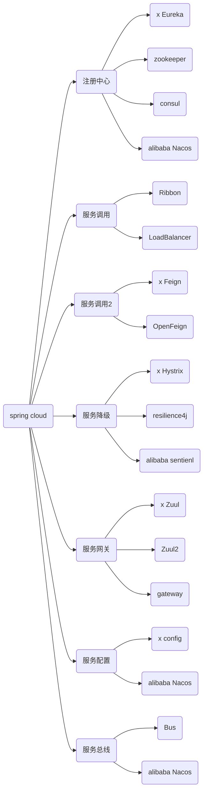

[TOC]
# 版本选择

[参考官网](https://spring.io/projects/spring-cloud#overview)

如果您需要升级您的项目到 Spring cloud ，Spring cloud 使用的版本需要与您现在使用的 Spring boot 版本相对应，下面列出官网对应的版本号。


更详细版本信息 ： https://start.spring.io/actuator/info

```json
{
    "git":{
        "branch":"6dcd14a3247ad8905ca0b321597e813dd6744bf5",
        "commit":{
            "id":"6dcd14a",
            "time":"2022-04-28T18:46:26Z"
        }
    },
    "build":{
        "version":"0.0.1-SNAPSHOT",
        "artifact":"start-site",
        "versions":{
            "spring-boot":"2.6.6",
            "initializr":"0.13.0-SNAPSHOT"
        },
        "name":"start.spring.io website",
        "time":"2022-04-28T18:47:38.065Z",
        "group":"io.spring.start"
    },
    "bom-ranges":{
        "codecentric-spring-boot-admin":{
            "2.4.3":"Spring Boot >=2.3.0.M1 and <2.5.0-M1",
            "2.5.6":"Spring Boot >=2.5.0.M1 and <2.6.0-M1",
            "2.6.5":"Spring Boot >=2.6.0.M1 and <2.7.0-M1"
        },
        "solace-spring-boot":{
            "1.1.0":"Spring Boot >=2.3.0.M1 and <2.6.0-M1",
            "1.2.1":"Spring Boot >=2.6.0.M1 and <2.7.0-M1"
        },
        "solace-spring-cloud":{
            "1.1.1":"Spring Boot >=2.3.0.M1 and <2.4.0-M1",
            "2.1.0":"Spring Boot >=2.4.0.M1 and <2.6.0-M1",
            "2.3.0":"Spring Boot >=2.6.0.M1 and <2.7.0-M1"
        },
        "spring-cloud":{
            "Hoxton.SR12":"Spring Boot >=2.2.0.RELEASE and <2.4.0.M1",
            "2020.0.5":"Spring Boot >=2.4.0.M1 and <2.6.0-M1",
            "2021.0.0-M1":"Spring Boot >=2.6.0-M1 and <2.6.0-M3",
            "2021.0.0-M3":"Spring Boot >=2.6.0-M3 and <2.6.0-RC1",
            "2021.0.0-RC1":"Spring Boot >=2.6.0-RC1 and <2.6.1",
            "2021.0.2":"Spring Boot >=2.6.1 and <2.6.8-SNAPSHOT",
            "2021.0.3-SNAPSHOT":"Spring Boot >=2.6.8-SNAPSHOT and <3.0.0-M1",
            "2022.0.0-M1":"Spring Boot >=3.0.0-M1 and <3.0.0-M2",
            "2022.0.0-M2":"Spring Boot >=3.0.0-M2 and <3.1.0-M1"
        },
        "spring-cloud-azure":{
            "4.0.0":"Spring Boot >=2.5.0.M1 and <2.7.0-M1"
        },
        "spring-cloud-gcp":{
            "2.0.10":"Spring Boot >=2.4.0-M1 and <2.6.0-M1",
            "3.2.1":"Spring Boot >=2.6.0-M1 and <2.7.0-M1"
        },
        "spring-cloud-services":{
            "2.3.0.RELEASE":"Spring Boot >=2.3.0.RELEASE and <2.4.0-M1",
            "2.4.1":"Spring Boot >=2.4.0-M1 and <2.5.0-M1",
            "3.3.0":"Spring Boot >=2.5.0-M1 and <2.6.0-M1",
            "3.4.0":"Spring Boot >=2.6.0-M1 and <2.7.0-M1"
        },
        "spring-geode":{
            "1.3.12.RELEASE":"Spring Boot >=2.3.0.M1 and <2.4.0-M1",
            "1.4.13":"Spring Boot >=2.4.0-M1 and <2.5.0-M1",
            "1.5.13":"Spring Boot >=2.5.0-M1 and <2.6.0-M1",
            "1.6.7":"Spring Boot >=2.6.0-M1 and <2.7.0-M1",
            "1.7.0-RC1":"Spring Boot >=2.7.0-M1 and <3.0.0-M1",
            "2.0.0-M2":"Spring Boot >=3.0.0-M1 and <3.1.0-M1"
        },
        "vaadin":{
            "14.8.9":"Spring Boot >=2.1.0.RELEASE and <2.6.0-M1",
            "23.0.7":"Spring Boot >=2.6.0-M1 and <2.8.0-M1"
        },
        "wavefront":{
            "2.0.2":"Spring Boot >=2.1.0.RELEASE and <2.4.0-M1",
            "2.1.1":"Spring Boot >=2.4.0-M1 and <2.5.0-M1",
            "2.2.2":"Spring Boot >=2.5.0-M1 and <2.7.0-M1"
        }
    },
    "dependency-ranges":{
        "native":{
            "0.9.0":"Spring Boot >=2.4.3 and <2.4.4",
            "0.9.1":"Spring Boot >=2.4.4 and <2.4.5",
            "0.9.2":"Spring Boot >=2.4.5 and <2.5.0-M1",
            "0.10.0":"Spring Boot >=2.5.0-M1 and <2.5.2",
            "0.10.1":"Spring Boot >=2.5.2 and <2.5.3",
            "0.10.2":"Spring Boot >=2.5.3 and <2.5.4",
            "0.10.3":"Spring Boot >=2.5.4 and <2.5.5",
            "0.10.4":"Spring Boot >=2.5.5 and <2.5.6",
            "0.10.5":"Spring Boot >=2.5.6 and <2.5.9",
            "0.10.6":"Spring Boot >=2.5.9 and <2.6.0-M1",
            "0.11.0-M1":"Spring Boot >=2.6.0-M1 and <2.6.0-RC1",
            "0.11.0-M2":"Spring Boot >=2.6.0-RC1 and <2.6.0",
            "0.11.0-RC1":"Spring Boot >=2.6.0 and <2.6.1",
            "0.11.0":"Spring Boot >=2.6.1 and <2.6.2",
            "0.11.1":"Spring Boot >=2.6.2 and <2.6.3",
            "0.11.2":"Spring Boot >=2.6.3 and <2.6.4",
            "0.11.3":"Spring Boot >=2.6.4 and <2.6.6",
            "0.11.4":"Spring Boot >=2.6.6 and <2.7.0-M1"
        },
        "okta":{
            "1.4.0":"Spring Boot >=2.2.0.RELEASE and <2.4.0-M1",
            "1.5.1":"Spring Boot >=2.4.0-M1 and <2.4.1",
            "2.0.1":"Spring Boot >=2.4.1 and <2.5.0-M1",
            "2.1.5":"Spring Boot >=2.5.0-M1 and <2.7.0-M1"
        },
        "mybatis":{
            "2.1.4":"Spring Boot >=2.1.0.RELEASE and <2.5.0-M1",
            "2.2.2":"Spring Boot >=2.5.0-M1"
        },
        "camel":{
            "3.5.0":"Spring Boot >=2.3.0.M1 and <2.4.0-M1",
            "3.10.0":"Spring Boot >=2.4.0.M1 and <2.5.0-M1",
            "3.13.0":"Spring Boot >=2.5.0.M1 and <2.6.0-M1",
            "3.16.0":"Spring Boot >=2.6.0.M1 and <2.7.0-M1"
        },
        "picocli":{
            "4.6.3":"Spring Boot >=2.4.0.RELEASE and <3.0.0-M1"
        },
        "open-service-broker":{
            "3.2.0":"Spring Boot >=2.3.0.M1 and <2.4.0-M1",
            "3.3.1":"Spring Boot >=2.4.0-M1 and <2.5.0-M1",
            "3.4.0-M2":"Spring Boot >=2.5.0-M1 and <2.6.0-M1"
        }
    }
}
```

这里使用版本：

```
Spring cloud ：Hoxton.SR1
boot 2.2.2.RELEASE
clould alibaba 2.1.0.RELEASE
Jdk 1.8
maven 3.5+
mysql 5.7+
```




# 环境搭建

Maven可以使用`dependencyManagement`元素来提供一种管理依赖版本号的方式，通常会在一个组织或者项目的最顶层的父POM中看到`dependencyManagement`元素，使用pom.xml中的`dependencyManagement`元素能让所有在子项目中引用个依赖而不用显式的列出版本量，Maven会沿着父子层次向上走，直到找到一个拥有`dependencyManagement`元素的项目，然后它就会使用这个
`dependencyManagement`元素中指定的版本号。

这样做的好处就是：如果有多个子项目都引用同一样依赖，则可以避免在每个使用的子项目里都声明一个版本号，这样当想升级或切换到另一个版本时，只需要在顶层父容器里更新，而不需要一个一个子项目的修改；另外如果某个子项目需要另外的一个版本，只需要声明version就可。

- `dependencyManagement`里只是声明依赖，**并不实现引入**，因此**子项目需要显示的声明需要用的依赖**。
- 如果不在子项目中声明依赖，是不会从父项目中继承下来的；只有在子项目中写了该依赖项,并且没有指定具体版本，才会从父项目中继承该项，并且version和scope都读取自父pom。
- 如果子项目中指定了版本号，那么会使用子项目中指定的jar版本。

# http 远程调用

## RestTemplate

作为一名java服务端开发者，我们一般是提供接口给前端调用，但要是遇到我们也需求请求第三方接口，类似前端那样调用第三方接口，该怎么办？

RestTemplate 是Spring 用于同步 client 端的核心类，简化了与 http 服务的通信，并满足 RestFul 原则，程序代码可以给它提供 URL，并提取结果。默认情况下，RestTemplate 默认依赖 jdk 的 HTTP 连接工具。当然你也可以 通过setRequestFactory 属性切换到不同的 HTTP 源，比如 Apache HttpComponents、Netty 和 OkHttp。

RestTemplate 中定义了 36 个与 REST 资源交互的方法，其中的大多数都对应于 HTTP 的方法。其实，这里面只有 11 个独立的方法，其中有十个有三种重载形式，而第十一个则重载了六次，这样一共形成了36个方法。

- delete() 在特定的URL上对资源执行HTTP DELETE操作

- exchange() 在URL上执行特定的 HTTP 方法，返回包含对象的 ResponseEntity，这个对象是从响应体中
  映射得到的

- execute() 在URL上执行特定的 HTTP 方法，返回一个从响应体映射得到的对象

- getForEntity() 发送一个HTTP GET请求，返回的 ResponseEntity 包含了响应体所映射成的对象

- getForObject() 发送一个 HTTP GET 请求，返回的请求体将映射为一个对象

- postForEntity() POST 数据到一个URL，返回包含一个对象的ResponseEntity，这个对象是从响应体中映射得
  到的

- postForObject() POST 数据到一个URL，返回根据响应体匹配形成的对象

- headForHeaders() 发送HTTP HEAD请求，返回包含特定资源URL的HTTP头

- optionsForAllow() 发送HTTP OPTIONS请求，返回对特定URL的Allow头信息

- postForLocation() POST 数据到一个URL，返回新创建资源的URL

- put() PUT 资源到特定的URL

实际上,由于Post 操作的非幂等性,它几乎可以代替其他的CRUD操作。

RestTemplate 的 get 方法有以上几个,可以分为两类: getForEntity() 和 getForObject()，首先看 getForEntity() 的返回值类型 ResponseEntity

```java
<T> ResponseEntity<T> getForEntity()
```

ResponseEntity 继承了 HttpEntity，封装了返回的响应信息包括响应状态、响应头和响应体。

### get请求

#### getForEntity

一个简单的使用示例：

```java
@RestController
public class UserController {

    @Autowired
    private UserService userService;

    @RequestMapping(value = "getAll")
    public List<UserEntity> getUser() {
        List<UserEntity> list = userService.getAll();
        return list;
    }

    @RequestMapping("get/{id}")
    public UserEntity getById(@PathVariable(name = "id") String id) {

        return userService.getById(id);
    }


    @RequestMapping(value = "save")
    public String save(UserEntity userEntity) {

        return "保存成功";
    }


    @RequestMapping(value = "saveByType/{type}")
    public String saveByType(UserEntity userEntity,@PathVariable("type")String type) {

        return "保存成功,type="+type;
    }
}
```

无参数的 getForEntity 方法

```java
 @RequestMapping("getForEntity")
    public List<UserEntity> getAll2() {
        ResponseEntity<List> responseEntity = restTemplate.getForEntity("http://localhost/getAll", List.class);
        HttpHeaders headers = responseEntity.getHeaders();
        HttpStatus statusCode = responseEntity.getStatusCode();
        int code = statusCode.value();

        List<UserEntity> list = responseEntity.getBody();

        System.out.println(list.toString());
        return list;
    }
```

有参数的 getForEntity 请求,参数列表,可以使用 {} 进行 url 路径占位符

```java
 //有参数的 getForEntity 请求,参数列表
    @RequestMapping("getForEntity/{id}")
    public UserEntity getById2(@PathVariable(name = "id") String id) {

        ResponseEntity<UserEntity> responseEntity = restTemplate.getForEntity("http://localhost/get/{id}", UserEntity.class, id);
        UserEntity userEntity = responseEntity.getBody();
        return userEntity;
    }
```

有参数的 get 请求,使用map封装参数

```java
    //有参数的 get 请求,使用map封装参数
    @RequestMapping("getForEntity/{id}")
    public UserEntity getById4(@PathVariable(name = "id") String id) {
        HashMap<String, String> map = new HashMap<>();
        map.put("id",id);

        ResponseEntity<UserEntity> responseEntity = restTemplate.getForEntity("http://localhost/get/{id}", UserEntity.class, map);
        UserEntity userEntity = responseEntity.getBody();

        return userEntity;
    }
```

返回的 responseEntity 的信息如图:


因此可以获取Http请求的全部信息。

但是，通常情况下我们并不想要Http请求的全部信息，只需要相应体即可。对于这种情况，RestTemplate提供了 getForObject() 方法用来只获取响应体信息。

getForObject 和 getForEntity 用法几乎相同，只是返回值返回的是响应体，省去了我们再去 getBody() 。

#### getForObject

无参数的 getForObject 请求

```java
    //无参数的 getForObject 请求
    @RequestMapping("getAll2")
    public List<UserEntity> getAll() {
        List<UserEntity> list = restTemplate.getForObject("http://localhost/getAll", List.class);


        System.out.println(list.toString());
        return list;

    }
```

有参数的 getForObject 请求,使用参数列表

```java
   //有参数的 getForObject 请求
    @RequestMapping("get2/{id}")
    public UserEntity getById(@PathVariable(name = "id") String id) {

        UserEntity userEntity = restTemplate.getForObject("http://localhost/get/{id}", UserEntity.class, id);

        return userEntity;
    }
```

有参数的 get 请求,使用map封装请求参数

```java

    //有参数的 get 请求,使用map封装请求参数
    @RequestMapping("get3/{id}")
    public UserEntity getById3(@PathVariable(name = "id") String id) {
        HashMap<String, String> map = new HashMap<>();
        map.put("id",id);

        UserEntity userEntity = restTemplate.getForObject("http://localhost/get/{id}", UserEntity.class, map);

        return userEntity;
    }
```

### Post请求


#### postForEntity

post 请求,保存 UserEntity 对像

```java
//post 请求,提交 UserEntity 对像

@RequestMapping("saveUser")
public String save(UserEntity userEntity) {

    ResponseEntity<String> responseEntity = restTemplate.postForEntity("http://localhost/save", userEntity, String.class);
    String body = responseEntity.getBody();

    return body;

}
```


有参数的 postForEntity 请求

```java

   // 有参数的 postForEntity 请求
    @RequestMapping("saveUserByType/{type}")
    public String save2(UserEntity userEntity,@PathVariable("type")String type) {

        ResponseEntity<String> responseEntity = restTemplate.postForEntity("http://localhost/saveByType/{type}", userEntity, String.class, type);
        String body = responseEntity.getBody();

        return body;

    }

    // 有参数的 postForEntity 请求,使用map封装
    @RequestMapping("saveUserByType2/{type}")
    public String save3(UserEntity userEntity,@PathVariable("type")String type) {
        HashMap<String, String> map = new HashMap<>();
         map.put("type", type);


        ResponseEntity<String> responseEntity = restTemplate.postForEntity("http://localhost/saveByType/{type}", userEntity, String.class,map);
        String body = responseEntity.getBody();

        return body;

    }


```

# 服务注册中心

## Eureka

Eureka采用了CS的设计架构，Eureka Sever作为服务注册功能的服务器，它是服务注册中心。而系统中的其他微服务，使用Eureka的客户端连接到 Eureka Server并维持心跳连接。这样系统的维护人员就可以通过Eureka Server来监控系统中各个微服务是否正常运行。

在服务注册与发现中，有一个注册中心。当服务器启动的时候，会把当前自己服务器的信息比如服务地址通讯地址等以别名方式注册到注册中心上。另一方(消费者服务提供者)，以该别名的方式去注册中心上获取到实际的服务通讯地址，然后再实现本地RPC调用RPC远程调用框架核心设计思想:在于注册中心，因为使用注册中心管理每个服务与服务之间的一个依赖关系(服务治理概念)。在任何RPC远程框架中，都会有一个注册中心存放服务地址相关信息(接口地址)

**Eureka包含两个组件: Eureka Server 和 Eureka Client **

- Eureka Server 提供服务注册服务

 各个微服务节点通过配置启动后，会在 EurekaServer 中进行注册，这样 EurekaServer 中的服务注册表中将会存储所有可用服务节点的信息，服务节点的信息可以在界面中直观看到。

- Eureka Client 通过注册中心进行访问

**它是一个 Java 客户端**，用于简化 Eureka Server 的交互，客户端同时也具备一个内置的、使用轮询(round-robin)负载算法的负载均衡器。在应用启动后，将会向 Eureka Server 发送心跳(默认周期为30秒)。如果 Eureka Server 在多个心跳周期内没有接收到某个节点的心跳，EurekaServer 将会从服务注册表中把这个服务节点移除（**默认90秒**)


### maven 版本说明

```xml
<!-- eureka 新旧版本 -->
<!-- 以前的老版本（2018）不区分 server 和 client -->
<dependency>
    <groupid>org.springframework.cloud</groupId>
    <artifactId>spring-cloud-starter-eureka</artifactId>
</dependency>

<!-- 现在新版本（2020.2）区分 server 和 client  -->
<dependency>
    <groupId>org.springframework.cloud</groupId>
    <artifactId>spring-cloud-starter-netflix-eureka-server</artifactId>
</dependency>
```

### Eureka Server服务端安装


#### 单机搭建

Eureka 也是一个普通的 spring boot 的项目，直接创建并部署到服务器即可。

#### Eureka server 集群搭建


服务注册：将服务信息注册进注册中心

服务发现：从注册中心上获取服务信息

实质：存key服务命取value闭用地址

1. 先启动eureka注册中心

2. 启动服务提供者payment支付服务

3. 支付服务启动后会把自身信息(比服务地址L以别名方式注朋进eureka

4. 消费者order服务在需要调用接口时，使用服务别名去注册中心获取实际的RPC远程调用地址

5. 消去者导调用地址后，底屋实际是利用HttpClient技术实现远程调用

6. 消费者实癸导服务地址后会缓存在本地jvm内存中，默认每间隔30秒更新—次服务调用地址

集群搭建要求各个 server 互相监督，在每个 eureka-server 端配置其他的 eureka-server 地址

这里以两台示例：

7001 为一个 eureka-server

```yml
server:
  port: 7001

eureka:
  instance:
    hostname: eureka-register # 应用名称，将会显示在Eureka界面的应用名称列
  client:
    register-with-eureka: false #false表示不向注册中心注册自己。
    fetch-registry: false #false表示自己端就是注册中心，我的职责就是维护服务实例，并不需要去检索服务
    service-url:
      defaultZone: http://127.0.0.1:7002/eureka/ # 集群配置时指向其它eureka 多个以逗号隔开
      # 单机就指向自己  http://127.0.0.1:7001/eureka/
```

7002 也为一个 eureka-server

```yml
server:
  port: 7002

eureka:
  instance:
    hostname: eureka-register # 应用名称，将会显示在Eureka界面的应用名称列
  client:
    register-with-eureka: false #false表示不向注册中心注册自己。
    fetch-registry: false #false表示自己端就是注册中心，我的职责就是维护服务实例，并不需要去检索服务
    service-url:
      defaultZone: http://127.0.0.1:7001/eureka/ # 集群配置时指向其它eureka 多个以逗号隔开
      # 单机就指向自己  http://127.0.0.1:7002/eureka/

```

### Eureka client 客户端安装

```xml
<!-- 现在新版本（2020.2）区分 server 和 client  -->
<dependency>
    <groupId>org.springframework.cloud</groupId>
    <artifactId>spring-cloud-starter-netflix-eureka-client</artifactId>
</dependency>
```

服务消费者和服务提供者都是 eureka-client

#### 单机搭建


#### Eureka client 集群搭建

这里以两台服务提供者集群示例：

8001

```yml
server:
  port: 8001

spring:
  application:
    name: cloud-provider-payment # 服务提供者功能相同则取同样的名称
  datasource:
    type: com.alibaba.druid.pool.DruidDataSource  # 当前数据源操作类型
    driver-class-name: com.mysql.cj.jdbc.Driver  # mysql 驱动
    url: jdbc:mysql://101.43.208.215:3306/springCloudDemoDb?useUnicode=true&serverTimezone=GMT%2B8&characterEncoding=UTF-8&useSSL=true
    username: root
    password: root

mybatis:
  mapper-locations: classpath:mapper/*.xml

eureka:
  client:
    register-with-eureka: true #表示是否将自己注册进Eurekaserver默认为true。
    fetch-registry: true #是否从EurekaServer抓取已有的注册信息，默认为true。单节点无所谓，集群必须设置为true才能配合ribbon使用负载均衡
    service-url:
      defaultZone: http://127.0.0.1:7001/eureka/,http://127.0.0.1:7002/eureka/

```

8002

```yml
server:
  port: 8002

spring:
  application:
    name: cloud-provider-payment # 服务提供者功能相同则取同样的名称
  datasource:
    type: com.alibaba.druid.pool.DruidDataSource  # 当前数据源操作类型
    driver-class-name: com.mysql.cj.jdbc.Driver  # mysql 驱动
    url: jdbc:mysql://101.43.208.215:3306/springCloudDemoDb?useUnicode=true&serverTimezone=GMT%2B8&characterEncoding=UTF-8&useSSL=true
    username: root
    password: root

mybatis:
  mapper-locations: classpath:mapper/*.xml

eureka:
  client:
    register-with-eureka: true #表示是否将自己注册进Eurekaserver默认为true。
    fetch-registry: true #是否从EurekaServer抓取已有的注册信息，默认为true。单节点无所谓，集群必须设置为true才能配合ribbon使用负载均衡
    service-url:
      defaultZone: http://127.0.0.1:7001/eureka/,http://127.0.0.1:7002/eureka/

```


### 使用 Eureka 查找服务

在调用服务时以服务注册名称查找并**开启负载均衡**

服务消费者示例

```java
@Slf4j
@RestController
public class OrderController {

    //在调用服务时以服务注册名称查找
    private static final String PAYMENT_URL = "http://CLOUD-PROVIDER-PAYMENT"; 
    @Resource
    private RestTemplate restTemplate;


    /**
     * 调用成功但是插入数据失败，原因是 http://localhost:8001/payment/create
     * 并未获取到此处传递过去的 payment 对象，解决方案：
     * 在服务提供方 http://localhost:8001/payment/create 对应的 Controller 方法参数
     * 中标注 @RequestBody，告诉在服务提供方从 RequestBody 中获取参数
     * public CommonResult create(@RequestBody //添加到这里 Payment payment){
     *      ...
     */
    @PostMapping("/consumer/payment/create")
    public CommonResult<Payment> create(Payment payment){
        return restTemplate.postForObject(PAYMENT_URL+"/payment/create",payment, CommonResult.class);
    }

    @GetMapping("/consumer/payment/get/{id}")
    public CommonResult<Payment> getPayment(@PathVariable("id") Long id){
        return restTemplate.getForObject(PAYMENT_URL+"/payment/get/"+id,CommonResult.class);
    }

}
```

```java
@Configuration
public class ApplicationContextConfig {

    @Bean
    @LoadBalanced // 开启负载均衡，默认为轮训
    public RestTemplate getRestTemplate(){
        return new RestTemplate();
    }

}
```

### 配置 Eureka 界面显示信息

```yml
eureka:
  instance:
    instance-id: cloud-provider-payment-8001  # eureka 界面显示用
    prefer-ip-address: true # eureka 界面显示实例的 IP 地址
```


### 获取注册中心详细信息

可以通过 DiscoveryClient 来获取注册中心的服务详细信息

1. 在启动类添加注解 @EnableDiscoveryClient

```
@SpringBootApplication
@EnableEurekaClient
@EnableDiscoveryClient // 用于获取关于注册中心的详细信息
public class PaymentMain8001 {
    public static void main(String[] args) {
        SpringApplication.run(PaymentMain8001.class,args);
    }
}
```

2. 在 Controller 注入 org.springframework.cloud.client.discovery.DiscoveryClient 并获取

```java
@RestController
@Slf4j
public class PaymentController{
    @Resource
    private PaymentService paymentService;
    
    @Resource
    // 用于获取关于注册中心的详细信息
    private DiscoveryClient discoveryClient;

    @Value("${server.port}")
    private String serverPort;

    @PostMapping(value = "/payment/create")
    public CommonResult<Payment> create(@RequestBody Payment payment)
    {
        Long result = paymentService.create(payment);
        log.info("*****插入结果："+result);

        if(result > 0)
        {
            return new CommonResult<>(200, "插入数据库成功,serverPort: " + serverPort, payment);
        }else{
            return new CommonResult<>(444, "插入数据库失败", null);
        }
    }

    @GetMapping(value = "/payment/get/{id}")
    public CommonResult<Payment> getPaymentById(@PathVariable("id") Long id)
    {
        Payment payment = paymentService.getPaymentById(id);

        if(payment != null)
        {
            return new CommonResult<>(200, "查询成功,serverPort:  " + serverPort, payment);
        }else{
            return new CommonResult<>(444, "没有对应记录,查询ID: " + id, null);
        }
    }

    @GetMapping(value = "/payment/discovery")
    public Object getDiscovery(){
        //获取所有的服务名称
        for (String service : discoveryClient.getServices()) {
            System.out.println("service:"+service);
            //根据名称获取具体的服务信息
            for (ServiceInstance instance : discoveryClient.getInstances(service)) {
                System.out.println("InstanceId:"+instance.getInstanceId());
                System.out.println("Host:"+instance.getHost());
                System.out.println("Scheme:"+instance.getScheme());
                System.out.println("ServiceId:"+instance.getServiceId());
                System.out.println("Port:"+instance.getPort());
            }

        }
        return discoveryClient;
    }
}
```

### Eureka 自我保护机制


保护模式主要用于一组客户端和 Eureka Server 之间存在网络分区场景下的保护。一旦进入保护模式，Eureka Server 将会尝试保护其服务注册表中的信息，**不再删除服务注册表中的数据，也就是不会注销任何微服务**。

如果在 Eureka Server 的首页看到上述提示，则说明Eureka进入了保护模式

**导致原因**

某时刻某一个微服务不可用了，Eureka 不会立刻清理，依旧会对该微服务的信息进行保存，属于 CAP 里面的 AP 实现。

**为什么会产生Eureka自我保护机制?**

为了 EurekaClient 可以正常运行，防止与 EurekaServer 网络不通情况下，EurekaServer 不会立刻将 EurekaClient 服务剔除

**什么是自我保护模式?**

默认情况下，如果 EurekaServer 在一定时间内没有接收到某个微服务实例的心跳，EurekaServer 将会注销该实例(默认90秒)。但是当网络分区故障发生(延时、卡顿、拥挤)时，微服务与 EurekaServer 之间无法正常通信，以上行为可能变得非常危险——因为微服务本身其实是健康的，此时本不应该注销这个微服务。Eureka 通过“自我保护模式”来解决这个问题——当EurekaServer 节点在短时间内丢失过多客户端时(可能发生了网络分区故障)，那么这个节点就会进入自我保护模式。

自我保护机制∶默认情况下 Eureka Client 定时向 Eureka Server 端发送心跳包,如果 Eureka 在 server 端在一定时间内(默认90秒)没有收到 Eureka Client 发送心跳包，便会直接从服务注册列表中剔除该服务，但是在短时间( 90秒中)内丢失了大量的服务实例心跳，这时候 Eureka server 会开启自我保护机制，不会剔除该服务（该现象可能出现在如果网络不通但是 Eureka Client 未出现宕机，此时如果换做别的注册中心如果一定时间内没有收到心跳会将剔除该服务，这样就出现了严重失误，因为客户端还能正常发送心跳，只是网络延迟问题，而保护机制是为了解决此问题而产生的)。

**在自我保护模式中，Eureka Server会保护服务注册表中的信息，不再注销任何服务实例**

#### 关闭自我保护

自我保护机制默认是开启的，在 eureka server 端添加配置关闭自我保护

Eureka Server

```yml
eureka:
  ...
  server:
    enable-self-preservation: false # 关闭自我保护机制 默认开启
    eviction-interval-timer-in-ms: 2000 # 表示服务器在收到最后一次心跳之后等待的持续时间 单位 ms
```

关闭效果


Eureka client 

```yml
eureka:
  instance:
    instance-id: cloud-consumer-order # eureka 界面显示用
    prefer-ip-address: true # eureka 界面显示实例的 IP 地址
    lease-renewal-interval-in-seconds: 1 # 心跳间隔 1s 默认 30s
    lease-expiration-duration-in-seconds: 2 # 服务端在收到最后一次心跳后等待时间上限 默认90s
```

## zookeeper

更改 maven 依赖

```xml
 <!-- zookeeper begin  -->
        <dependency>
            <groupId>org.springframework.cloud</groupId>
            <artifactId>spring-cloud-starter-zookeeper-discovery</artifactId>
            <!--先排除自带的zookeeper3.5.3 防止与3.7.0起冲突-->
            <exclusions>
                <exclusion>
                    <groupId>org.apache.zookeeper</groupId>
                    <artifactId>zookeeper</artifactId>
                </exclusion>
            </exclusions>
        </dependency>
        <!--添加zookeeper3.7.0版本-->
        <dependency>
            <groupId>org.apache.zookeeper</groupId>
            <artifactId>zookeeper</artifactId>
            <version>3.7.0</version>
        </dependency>
        <!-- zookeeper end  -->
```

更改启动类

```java
@SpringBootApplication
@EnableDiscoveryClient //该注解用于向使用consul或者zookeeper作为注册中心时注册服务
public class ProviderZookeeperPaymentMain8004 {
    public static void main(String[] args) {
        SpringApplication.run(ProviderZookeeperPaymentMain8004.class,args);
    }
}
```

yml 文件

```yml
server:
  port: 8004

spring:
  application:
    name: cloud-provider-zookeeper-payment # 服务提供者功能相同则取同样的名称
  datasource:
    type: com.alibaba.druid.pool.DruidDataSource  # 当前数据源操作类型
    driver-class-name: com.mysql.cj.jdbc.Driver  # mysql 驱动
    url: jdbc:mysql://101.43.208.215:3306/springCloudDemoDb?useUnicode=true&serverTimezone=GMT%2B8&characterEncoding=UTF-8&useSSL=true
    username: root
    password: root
  cloud:
    zookeeper:
      connect-string: 192.168.1.110:2181,192.168.1.111:2181,192.168.1.112:2181

mybatis:
  mapper-locations: classpath:mapper/*.xml

```

**其他方面与 Eureka 相同，值得注意的是，这里消费端根据名称查找服务时，大小写敏感**

## consul

Consul是一套开源的分布式服务发现和配置管理系统，由HashiCorp 公司用Go语言开发。

提供了微服务系统中的**服务治理**、**配置中心**、**控制总线**等功能。这些功能中的每一个都可以根据需要单独使用，也可以一起使用以构建全方位的服务网格，总之 Consul 提供了一种完整的服务网格解决方案。

它具有很多优点。包括：基于 raft 协议，比较简洁；支持健康检查，同时支持 HTTP 和 DNS 协议支持跨数据中心的 WAN 集群提供图形界面跨平台，支持 Linux、Mac、Windows。可支持：

- 服务发现 - 提供HTTP和DNS两种发现方式。
- 健康监测 - 支持多种方式，HTTP、TCP、Docker、Shell脚本定制化
- KV存储 - Key、Value的存储方式
- 多数据中心 - Consul支持多数据中心
- 可视化Web界面

[Install Consul | Consul - HashiCorp Learn](https://learn.hashicorp.com/tutorials/consul/get-started-install)

[Downloads | Consul by HashiCorp](https://www.consul.io/downloads)

使用版本 1.6.1

windows版解压缩后，得consul.exe，打开cmd

查看版本 `consul -version`

开发模式启动 `consul agent -dev`

浏览器输入 - http://localhost:8500/ - 打开Consul控制页。

**引入依赖**

```xml
<!--添加 consul -->
        <dependency>
            <groupId>org.springframework.cloud</groupId>
            <artifactId>spring-cloud-starter-consul-discovery</artifactId>
        </dependency>
```

yml

```yml
server:
  port: 8001

spring:
  application:
    name: cloud-provider-consul-payment # 服务提供者功能相同则取同样的名称
  datasource:
    type: com.alibaba.druid.pool.DruidDataSource  # 当前数据源操作类型
    driver-class-name: com.mysql.cj.jdbc.Driver  # mysql 驱动
    url: jdbc:mysql://101.43.208.215:3306/springCloudDemoDb?useUnicode=true&serverTimezone=GMT%2B8&characterEncoding=UTF-8&useSSL=true
    username: root
    password: root
  cloud:
    consul:
      host: 127.0.0.1
      port: 8500
      discovery:
        service-name: ${spring.application.name}

mybatis:
  mapper-locations: classpath:mapper/*.xml
```

# 负载均衡

## 客户端负载均衡

### Ribbon

Ribbon目前也进入维护模式，未来可能被Spring Cloud LoadBalacer 替代

Ribbon 负载均衡实现方式：

将逻辑集成到消费方，消费方从服务注册中心获知有哪些地址可用，然后自己再从这些地址中选择出一个合适的服务器，Ribbon = 负载均衡 + RestTemplate 调用。

Ribbon其实就是一个软负载均衡的客户端组件，它可以和其他所需请求的客户端结合使用，和 Eureka 结合只是其中的一个实例。


Ribbon在工作时分成两步：

- 第一步先选择 EurekaServer ,它优先选择在同一个区域内负载较少的 server。
- 第二步再根据用户指定的策略，在从 server 取到的服务注册列表中选择一个地址。

其中Ribbon提供了多种策略：比如轮询、随机和根据响应时间加权。

#### maven 依赖

先前工程项目没有引入 spring-cloud-starter-ribbon 也可以使用 ribbon。是因为 spring-cloud-starter-netflix-eureka-client 自带了spring-cloud-starter-ribbon 引用

```xml
<dependency>
    <groupld>org.springframework.cloud</groupld>
    <artifactld>spring-cloud-starter-netflix-ribbon</artifactid>
</dependency>
```

#### Ribbon默认自带的负载规则

lRule：根据特定算法中从服务列表中选取一个要访问的服务


- RoundRobinRule 轮询
- RandomRule 随机
- RetryRule 先按照RoundRobinRule的策略获取服务，如果获取服务失败则在指定时间内会进行重
- WeightedResponseTimeRule 对RoundRobinRule的扩展，响应速度越快的实例选择权重越大，越容易被选择
- BestAvailableRule 会先过滤掉由于多次访问故障而处于断路器跳闸状态的服务，然后选择一个并发量最小的服务
- AvailabilityFilteringRule 先过滤掉故障实例，再选择并发较小的实例
- ZoneAvoidanceRule 默认规则,复合判断server所在区域的性能和server的可用性选择服务器

