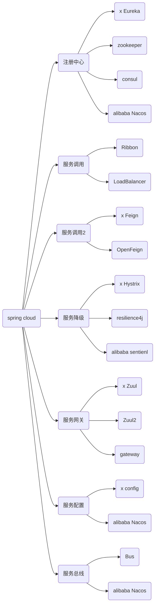

[TOC]
# 版本选择

[参考官网](https://spring.io/projects/spring-cloud#overview)

如果您需要升级您的项目到 Spring cloud ，Spring cloud 使用的版本需要与您现在使用的 Spring boot 版本相对应，下面列出官网对应的版本号。


更详细版本信息 ： https://start.spring.io/actuator/info

```json
{
    "git":{
        "branch":"6dcd14a3247ad8905ca0b321597e813dd6744bf5",
        "commit":{
            "id":"6dcd14a",
            "time":"2022-04-28T18:46:26Z"
        }
    },
    "build":{
        "version":"0.0.1-SNAPSHOT",
        "artifact":"start-site",
        "versions":{
            "spring-boot":"2.6.6",
            "initializr":"0.13.0-SNAPSHOT"
        },
        "name":"start.spring.io website",
        "time":"2022-04-28T18:47:38.065Z",
        "group":"io.spring.start"
    },
    "bom-ranges":{
        "codecentric-spring-boot-admin":{
            "2.4.3":"Spring Boot >=2.3.0.M1 and <2.5.0-M1",
            "2.5.6":"Spring Boot >=2.5.0.M1 and <2.6.0-M1",
            "2.6.5":"Spring Boot >=2.6.0.M1 and <2.7.0-M1"
        },
        "solace-spring-boot":{
            "1.1.0":"Spring Boot >=2.3.0.M1 and <2.6.0-M1",
            "1.2.1":"Spring Boot >=2.6.0.M1 and <2.7.0-M1"
        },
        "solace-spring-cloud":{
            "1.1.1":"Spring Boot >=2.3.0.M1 and <2.4.0-M1",
            "2.1.0":"Spring Boot >=2.4.0.M1 and <2.6.0-M1",
            "2.3.0":"Spring Boot >=2.6.0.M1 and <2.7.0-M1"
        },
        "spring-cloud":{
            "Hoxton.SR12":"Spring Boot >=2.2.0.RELEASE and <2.4.0.M1",
            "2020.0.5":"Spring Boot >=2.4.0.M1 and <2.6.0-M1",
            "2021.0.0-M1":"Spring Boot >=2.6.0-M1 and <2.6.0-M3",
            "2021.0.0-M3":"Spring Boot >=2.6.0-M3 and <2.6.0-RC1",
            "2021.0.0-RC1":"Spring Boot >=2.6.0-RC1 and <2.6.1",
            "2021.0.2":"Spring Boot >=2.6.1 and <2.6.8-SNAPSHOT",
            "2021.0.3-SNAPSHOT":"Spring Boot >=2.6.8-SNAPSHOT and <3.0.0-M1",
            "2022.0.0-M1":"Spring Boot >=3.0.0-M1 and <3.0.0-M2",
            "2022.0.0-M2":"Spring Boot >=3.0.0-M2 and <3.1.0-M1"
        },
        "spring-cloud-azure":{
            "4.0.0":"Spring Boot >=2.5.0.M1 and <2.7.0-M1"
        },
        "spring-cloud-gcp":{
            "2.0.10":"Spring Boot >=2.4.0-M1 and <2.6.0-M1",
            "3.2.1":"Spring Boot >=2.6.0-M1 and <2.7.0-M1"
        },
        "spring-cloud-services":{
            "2.3.0.RELEASE":"Spring Boot >=2.3.0.RELEASE and <2.4.0-M1",
            "2.4.1":"Spring Boot >=2.4.0-M1 and <2.5.0-M1",
            "3.3.0":"Spring Boot >=2.5.0-M1 and <2.6.0-M1",
            "3.4.0":"Spring Boot >=2.6.0-M1 and <2.7.0-M1"
        },
        "spring-geode":{
            "1.3.12.RELEASE":"Spring Boot >=2.3.0.M1 and <2.4.0-M1",
            "1.4.13":"Spring Boot >=2.4.0-M1 and <2.5.0-M1",
            "1.5.13":"Spring Boot >=2.5.0-M1 and <2.6.0-M1",
            "1.6.7":"Spring Boot >=2.6.0-M1 and <2.7.0-M1",
            "1.7.0-RC1":"Spring Boot >=2.7.0-M1 and <3.0.0-M1",
            "2.0.0-M2":"Spring Boot >=3.0.0-M1 and <3.1.0-M1"
        },
        "vaadin":{
            "14.8.9":"Spring Boot >=2.1.0.RELEASE and <2.6.0-M1",
            "23.0.7":"Spring Boot >=2.6.0-M1 and <2.8.0-M1"
        },
        "wavefront":{
            "2.0.2":"Spring Boot >=2.1.0.RELEASE and <2.4.0-M1",
            "2.1.1":"Spring Boot >=2.4.0-M1 and <2.5.0-M1",
            "2.2.2":"Spring Boot >=2.5.0-M1 and <2.7.0-M1"
        }
    },
    "dependency-ranges":{
        "native":{
            "0.9.0":"Spring Boot >=2.4.3 and <2.4.4",
            "0.9.1":"Spring Boot >=2.4.4 and <2.4.5",
            "0.9.2":"Spring Boot >=2.4.5 and <2.5.0-M1",
            "0.10.0":"Spring Boot >=2.5.0-M1 and <2.5.2",
            "0.10.1":"Spring Boot >=2.5.2 and <2.5.3",
            "0.10.2":"Spring Boot >=2.5.3 and <2.5.4",
            "0.10.3":"Spring Boot >=2.5.4 and <2.5.5",
            "0.10.4":"Spring Boot >=2.5.5 and <2.5.6",
            "0.10.5":"Spring Boot >=2.5.6 and <2.5.9",
            "0.10.6":"Spring Boot >=2.5.9 and <2.6.0-M1",
            "0.11.0-M1":"Spring Boot >=2.6.0-M1 and <2.6.0-RC1",
            "0.11.0-M2":"Spring Boot >=2.6.0-RC1 and <2.6.0",
            "0.11.0-RC1":"Spring Boot >=2.6.0 and <2.6.1",
            "0.11.0":"Spring Boot >=2.6.1 and <2.6.2",
            "0.11.1":"Spring Boot >=2.6.2 and <2.6.3",
            "0.11.2":"Spring Boot >=2.6.3 and <2.6.4",
            "0.11.3":"Spring Boot >=2.6.4 and <2.6.6",
            "0.11.4":"Spring Boot >=2.6.6 and <2.7.0-M1"
        },
        "okta":{
            "1.4.0":"Spring Boot >=2.2.0.RELEASE and <2.4.0-M1",
            "1.5.1":"Spring Boot >=2.4.0-M1 and <2.4.1",
            "2.0.1":"Spring Boot >=2.4.1 and <2.5.0-M1",
            "2.1.5":"Spring Boot >=2.5.0-M1 and <2.7.0-M1"
        },
        "mybatis":{
            "2.1.4":"Spring Boot >=2.1.0.RELEASE and <2.5.0-M1",
            "2.2.2":"Spring Boot >=2.5.0-M1"
        },
        "camel":{
            "3.5.0":"Spring Boot >=2.3.0.M1 and <2.4.0-M1",
            "3.10.0":"Spring Boot >=2.4.0.M1 and <2.5.0-M1",
            "3.13.0":"Spring Boot >=2.5.0.M1 and <2.6.0-M1",
            "3.16.0":"Spring Boot >=2.6.0.M1 and <2.7.0-M1"
        },
        "picocli":{
            "4.6.3":"Spring Boot >=2.4.0.RELEASE and <3.0.0-M1"
        },
        "open-service-broker":{
            "3.2.0":"Spring Boot >=2.3.0.M1 and <2.4.0-M1",
            "3.3.1":"Spring Boot >=2.4.0-M1 and <2.5.0-M1",
            "3.4.0-M2":"Spring Boot >=2.5.0-M1 and <2.6.0-M1"
        }
    }
}
```

这里使用版本：

```
Spring cloud ：Hoxton.SR1
boot 2.2.2.RELEASE
clould alibaba 2.1.0.RELEASE
Jdk 1.8
maven 3.5+
mysql 5.7+
```




# 环境搭建

Maven可以使用`dependencyManagement`元素来提供一种管理依赖版本号的方式，通常会在一个组织或者项目的最顶层的父POM中看到`dependencyManagement`元素，使用pom.xml中的`dependencyManagement`元素能让所有在子项目中引用个依赖而不用显式的列出版本量，Maven会沿着父子层次向上走，直到找到一个拥有`dependencyManagement`元素的项目，然后它就会使用这个
`dependencyManagement`元素中指定的版本号。

这样做的好处就是：如果有多个子项目都引用同一样依赖，则可以避免在每个使用的子项目里都声明一个版本号，这样当想升级或切换到另一个版本时，只需要在顶层父容器里更新，而不需要一个一个子项目的修改；另外如果某个子项目需要另外的一个版本，只需要声明version就可。

- `dependencyManagement`里只是声明依赖，**并不实现引入**，因此**子项目需要显示的声明需要用的依赖**。
- 如果不在子项目中声明依赖，是不会从父项目中继承下来的；只有在子项目中写了该依赖项,并且没有指定具体版本，才会从父项目中继承该项，并且version和scope都读取自父pom。
- 如果子项目中指定了版本号，那么会使用子项目中指定的jar版本。

# http 远程调用

## RestTemplate

作为一名java服务端开发者，我们一般是提供接口给前端调用，但要是遇到我们也需求请求第三方接口，类似前端那样调用第三方接口，该怎么办？

RestTemplate 是Spring 用于同步 client 端的核心类，简化了与 http 服务的通信，并满足 RestFul 原则，程序代码可以给它提供 URL，并提取结果。默认情况下，RestTemplate 默认依赖 jdk 的 HTTP 连接工具。当然你也可以 通过setRequestFactory 属性切换到不同的 HTTP 源，比如 Apache HttpComponents、Netty 和 OkHttp。

RestTemplate 中定义了 36 个与 REST 资源交互的方法，其中的大多数都对应于 HTTP 的方法。其实，这里面只有 11 个独立的方法，其中有十个有三种重载形式，而第十一个则重载了六次，这样一共形成了36个方法。

- delete() 在特定的URL上对资源执行HTTP DELETE操作

- exchange() 在URL上执行特定的 HTTP 方法，返回包含对象的 ResponseEntity，这个对象是从响应体中
  映射得到的

- execute() 在URL上执行特定的 HTTP 方法，返回一个从响应体映射得到的对象

- getForEntity() 发送一个HTTP GET请求，返回的 ResponseEntity 包含了响应体所映射成的对象

- getForObject() 发送一个 HTTP GET 请求，返回的请求体将映射为一个对象

- postForEntity() POST 数据到一个URL，返回包含一个对象的ResponseEntity，这个对象是从响应体中映射得
  到的

- postForObject() POST 数据到一个URL，返回根据响应体匹配形成的对象

- headForHeaders() 发送HTTP HEAD请求，返回包含特定资源URL的HTTP头

- optionsForAllow() 发送HTTP OPTIONS请求，返回对特定URL的Allow头信息

- postForLocation() POST 数据到一个URL，返回新创建资源的URL

- put() PUT 资源到特定的URL

实际上,由于Post 操作的**非幂等性**,它几乎可以代替其他的CRUD操作。

RestTemplate 的 get 方法有以上几个,可以分为两类: getForEntity() 和 getForObject()，首先看 getForEntity() 的返回值类型 ResponseEntity

```java
<T> ResponseEntity<T> getForEntity()
```

ResponseEntity 继承了 HttpEntity，封装了返回的响应信息包括响应状态、响应头和响应体。

### get请求

#### getForEntity

一个简单的使用示例：

```java
@RestController
public class UserController {

    @Autowired
    private UserService userService;

    @RequestMapping(value = "getAll")
    public List<UserEntity> getUser() {
        List<UserEntity> list = userService.getAll();
        return list;
    }

    @RequestMapping("get/{id}")
    public UserEntity getById(@PathVariable(name = "id") String id) {

        return userService.getById(id);
    }


    @RequestMapping(value = "save")
    public String save(UserEntity userEntity) {

        return "保存成功";
    }


    @RequestMapping(value = "saveByType/{type}")
    public String saveByType(UserEntity userEntity,@PathVariable("type")String type) {

        return "保存成功,type="+type;
    }
}
```

无参数的 getForEntity 方法

```java
 @RequestMapping("getForEntity")
    public List<UserEntity> getAll2() {
        ResponseEntity<List> responseEntity = restTemplate.getForEntity("http://localhost/getAll", List.class);
        HttpHeaders headers = responseEntity.getHeaders();
        HttpStatus statusCode = responseEntity.getStatusCode();
        int code = statusCode.value();

        List<UserEntity> list = responseEntity.getBody();

        System.out.println(list.toString());
        return list;
    }
```

有参数的 getForEntity 请求,参数列表,可以使用 {} 进行 url 路径占位符

```java
 //有参数的 getForEntity 请求,参数列表
    @RequestMapping("getForEntity/{id}")
    public UserEntity getById2(@PathVariable(name = "id") String id) {

        ResponseEntity<UserEntity> responseEntity = restTemplate.getForEntity("http://localhost/get/{id}", UserEntity.class, id);
        UserEntity userEntity = responseEntity.getBody();
        return userEntity;
    }
```

有参数的 get 请求,使用map封装参数

```java
    //有参数的 get 请求,使用map封装参数
    @RequestMapping("getForEntity/{id}")
    public UserEntity getById4(@PathVariable(name = "id") String id) {
        HashMap<String, String> map = new HashMap<>();
        map.put("id",id);

        ResponseEntity<UserEntity> responseEntity = restTemplate.getForEntity("http://localhost/get/{id}", UserEntity.class, map);
        UserEntity userEntity = responseEntity.getBody();

        return userEntity;
    }
```

返回的 responseEntity 的信息如图:


因此可以获取Http请求的全部信息。

但是，通常情况下我们并不想要Http请求的全部信息，只需要相应体即可。对于这种情况，RestTemplate提供了 getForObject() 方法用来只获取响应体信息。

getForObject 和 getForEntity 用法几乎相同，只是返回值返回的是响应体，省去了我们再去 getBody() 。

#### getForObject

无参数的 getForObject 请求

```java
    //无参数的 getForObject 请求
    @RequestMapping("getAll2")
    public List<UserEntity> getAll() {
        List<UserEntity> list = restTemplate.getForObject("http://localhost/getAll", List.class);


        System.out.println(list.toString());
        return list;

    }
```

有参数的 getForObject 请求,使用参数列表

```java
   //有参数的 getForObject 请求
    @RequestMapping("get2/{id}")
    public UserEntity getById(@PathVariable(name = "id") String id) {

        UserEntity userEntity = restTemplate.getForObject("http://localhost/get/{id}", UserEntity.class, id);

        return userEntity;
    }
```

有参数的 get 请求,使用map封装请求参数

```java

    //有参数的 get 请求,使用map封装请求参数
    @RequestMapping("get3/{id}")
    public UserEntity getById3(@PathVariable(name = "id") String id) {
        HashMap<String, String> map = new HashMap<>();
        map.put("id",id);

        UserEntity userEntity = restTemplate.getForObject("http://localhost/get/{id}", UserEntity.class, map);

        return userEntity;
    }
```

### Post请求


#### postForEntity

post 请求,保存 UserEntity 对像

```java
//post 请求,提交 UserEntity 对像

@RequestMapping("saveUser")
public String save(UserEntity userEntity) {

    ResponseEntity<String> responseEntity = restTemplate.postForEntity("http://localhost/save", userEntity, String.class);
    String body = responseEntity.getBody();

    return body;

}
```


有参数的 postForEntity 请求

```java

   // 有参数的 postForEntity 请求
    @RequestMapping("saveUserByType/{type}")
    public String save2(UserEntity userEntity,@PathVariable("type")String type) {

        ResponseEntity<String> responseEntity = restTemplate.postForEntity("http://localhost/saveByType/{type}", userEntity, String.class, type);
        String body = responseEntity.getBody();

        return body;

    }

    // 有参数的 postForEntity 请求,使用map封装
    @RequestMapping("saveUserByType2/{type}")
    public String save3(UserEntity userEntity,@PathVariable("type")String type) {
        HashMap<String, String> map = new HashMap<>();
         map.put("type", type);


        ResponseEntity<String> responseEntity = restTemplate.postForEntity("http://localhost/saveByType/{type}", userEntity, String.class,map);
        String body = responseEntity.getBody();

        return body;

    }


```

## Feign

Feign是一个声明式WebService客户端。使用Feign能让编写Web Service客户端更加简单。它的使用方法是定义一个服务接口然后在上面添加注解。Feign也支持可拔插式的编码器和解码器。Spring Cloud对Feign进行了封装，使其支持了Spring MVC标准注解和 HttpMessageConverters。Feign可以与 Eureka 和 Ribbon 组合使用以支持负载均衡。

**Feign旨在使用接口调用的方式来实现HTTP远程调用**。

前面在使用Ribbon+RestTemplate时，利用RestTemplate对http请求的封装处理，形成了一套模版化的调用方法。但是在实际开发中，由于对服务依赖的调用可能不止一处，往往一个接口会被多处调用，所以通常都会针对每个微服务自行封装一些客户端类来包装这些依赖服务的调用。所以，Feign在此基础上做了进一步封装，由他来帮助我们定义和实现依赖服务接口的定义。

在Feign的实现下，我们只需创建一个**接口**并**使用注解的方式来配置**它(以前是Dao接口上面标注Mapper注解,现在是一个微服务接口上面标注一个Feign注解即可)，即可完成对服务提供方的接口绑定，简化了使用Spring cloud Ribbon 时，**自动封装服务调用客户端**的开发量。

**Feign集成了Ribbon**

利用Ribbon维护服务提供者的服务列表信息，并且通过轮询实现了客户端的负载均衡。而与Ribbon不同的是，**通过feign只需要定义服务并绑定到接口且以声明式的方法**，优雅而简单的实现了服务调用。

```xml
<dependency>
    <groupId>org.springframework.cloud</groupId>
    <artifactId>spring-cloud-starter-feign</artifactId>
</dependency>
```

## OpenFeign

**Feign和OpenFeign两者区别**

**Feign**是Spring Cloud组件中的一个轻量级RESTful的HTTP服务客户端Feign内置了Ribbon，用来做客户端负载均衡，去调用服务注册中心的服务。Feign的使用方式是:使用Feign的注解定义接口，调用这个接口，就可以调用服务注册中心的服务。

OpenFeign是Spring Cloud在Feign的基础上支持了SpringMVC的注解，如@RequesMapping等等。OpenFeign的@Feignclient可以解析SpringMVc的@RequestMapping注解下的接口，并通过动态代理的方式产生实现类，实现类中做负载均衡并调用其他服务。

```xml
<dependency>
    <groupId>org.springframework.cloud</groupId>
    <artifactId>spring-cloud-starter-openfeign</artifactId>
</dependency>
```

### 示例

```
cloud-consumer-eureka-openFeign-order80
cloud-eureka-server7001
cloud-eureka-server7002
cloud-provider-eureka-payment8001
cloud-provider-eureka-payment8002
```


### 超时控制

OpenFeign 默认等待 1 秒钟，超时即报错

```yml
#设置feign客户端超时时间(OpenFeign默认支持ribbon)(单位：毫秒)
ribbon:
  #指的是建立连接后从服务器读取到可用资源所用的时间
  ReadTimeout: 5000
  #指的是建立连接所用的时间，适用于网络状况正常的情况下,两端连接所用的时间
  ConnectTimeout: 5000
```

### 日志打印

日志打印功能

Feign提供了日志打印功能，我们可以通过配置来调整日恙级别，从而了解Feign 中 Http请求的细节。

说白了就是对Feign接口的调用情况进行监控和输出

日志级别

- NONE：默认的，不显示任何日志;
- BASIC：仅记录请求方法、URL、响应状态码及执行时间;
- HEADERS：除了BASIC中定义的信息之外，还有请求和响应的头信息;
- FULL：除了HEADERS中定义的信息之外，还有请求和响应的正文及元数据。

配置日志bean

```java
import feign.Logger;
import org.springframework.context.annotation.Bean;
import org.springframework.context.annotation.Configuration;

@Configuration
public class FeignConfig
{
    @Bean
    Logger.Level feignLoggerLevel()
    {
        return Logger.Level.FULL;
    }
}
```

**YML文件里配置需要开启日志的Feign客户端**

```yml
logging:
  level:
    # feign日志以什么级别监控哪个接口
    com.order80.service.PaymentFeignService: debug
```

# 服务注册中心

## CAP 理论

CAP 理论是计算机科学中分布式系统设计的一个基本定理，由加州大学伯克利分校的计算机科学家Eric Brewer在2000年提出。CAP是Consistency（一致性）、Availability（可用性）和Partition tolerance（分区容错性）三个单词的首字母缩写。CAP理论指出，在一个分布式系统中，这三个属性不可能同时完全满足，最多只能同时满足其中的两项。

**一致性（Consistency）**

一致性指的是所有节点在同一时间具有相同的数据。也就是说，如果一个数据项被更新，那么所有的用户都应该看到这个更新后的值。在分布式系统中，一致性通常通过各种一致性协议来实现，如两阶段提交（2PC）或三阶段提交（3PC）。

**可用性（Availability）**

可用性指的是系统提供的服务必须一直处于可用状态，即每个请求都能在有限的时间内得到响应，无论成功或失败。在分布式系统中，可用性通常通过冗余和负载均衡来实现，确保系统即使在部分组件失效的情况下也能继续提供服务。

**分区容错性（Partition tolerance）**

分区容错性指的是系统在遇到任何网络分区的情况下，仍然能够继续运作。网络分区是指系统中的某些节点之间无法通信，但系统仍需继续运行。分区容错性是分布式系统设计中必须考虑的，因为网络故障是不可避免的。

**CAP定理的含义**

CAP定理表明，在分布式系统中，一致性、可用性和分区容错性三者不可兼得。在设计分布式系统时，需要根据实际业务需求和环境来权衡这三个属性：

- **CA（一致性+可用性）**：在没有网络分区的情况下，系统可以同时保证一致性和可用性。
- **CP（一致性+分区容错性）**：在网络分区发生时，系统保证数据的一致性，但可能牺牲部分可用性。
- **AP（可用性+分区容错性）**：在网络分区发生时，系统保证可用性，但可能牺牲数据的一致性。在实际中，完全满足CA的情况非常罕见，因为网络分区是分布式系统中不可避免的现实问题。

在实际应用中，大多数分布式系统会选择CP或AP，因为网络分区是分布式系统中不可避免的现实问题。例如，HBase和Zookeeper等系统更倾向于CP，而Cassandra和Amazon DynamoDB等系统则更倾向于AP。选择哪种策略取决于业务场景对一致性和可用性的具体要求。

## Eureka

Eureka是Netflix开发的一个服务发现组件，它是Spring Cloud生态系统中用于微服务架构的关键组件之一。Eureka的设计目标是提供一个简单、轻量级的服务注册与发现机制，它**特别强调了高可用性和容错性**。以下是Eureka如何保证可用性以及其自我保护机制的详细解释：

**Eureka的高可用性**

- **节点平等**：Eureka的各个节点是平等的，没有主从之分。这意味着任何一个Eureka节点都可以处理注册和发现服务的请求，不存在单点故障的问题。
- **自动故障转移**：Eureka客户端在注册或发现服务时，如果遇到连接失败，会自动重试其他Eureka节点。只要有一个Eureka节点可用，服务的注册和发现就能继续进行。
- **信息同步**：Eureka节点之间会定期同步注册信息，即使某个节点暂时无法同步，也不会影响其他节点的正常工作。

**Eureka的自我保护机制**

- **触发条件**：如果Eureka在15分钟内超过85%的节点没有正常的心跳，它会认为客户端与注册中心之间可能发生了网络分区问题。
- **保护措施**：
  ① **停止移除服务**：在自我保护模式下，Eureka不会从注册列表中移除那些因为长时间没有收到心跳而应该过期的服务实例。
  ② **接受新服务注册**：Eureka仍然接受新服务的注册和查询请求，但是不会将这些信息同步到其他节点，以保证当前节点的可用性。
  ③ **信息同步**：一旦网络恢复稳定，当前实例的新注册信息会被同步到其他节点。

Eureka采用了CS的设计架构，Eureka Sever作为服务注册功能的服务器，它是服务注册中心。而系统中的其他微服务，使用Eureka的客户端连接到 Eureka Server并维持心跳连接。这样系统的维护人员就可以通过Eureka Server来监控系统中各个微服务是否正常运行。

在服务注册与发现中，有一个注册中心。当服务器启动的时候，会把当前自己服务器的信息比如服务地址通讯地址等以别名方式注册到注册中心上。另一方(消费者服务提供者)，以该别名的方式去注册中心上获取到实际的服务通讯地址，然后再实现本地RPC调用RPC远程调用框架核心设计思想:在于注册中心，因为使用注册中心管理每个服务与服务之间的一个依赖关系(服务治理概念)。在任何RPC远程框架中，都会有一个注册中心存放服务地址相关信息(接口地址)

**Eureka包含两个组件: Eureka Server 和 Eureka Client**

Eureka是一个服务注册和发现的框架，它可以让微服务之间互相发现和调用。Eureka有两个组件：Eureka Server和Eureka Client。Eureka Server是服务注册中心，负责维护服务实例的信息。Eureka Client是服务提供者和消费者，负责向Eureka Server注册自己的信息，以及从Eureka Server获取其他服务的信息。Eureka的作用和配置如下：

- **作用**：
  - 服务注册：服务提供者启动时，会通过Eureka Client向Eureka Server注册自己的元数据，如IP地址，端口，运行状态等。
  - 服务发现：服务消费者可以从Eureka Server获取注册的服务列表，并根据负载均衡策略选择一个服务实例进行远程调用。
  - 服务续约：服务提供者会每隔一定时间（默认30秒）向Eureka Server发送心跳，表明自己还存活。如果Eureka Server在一定时间（默认90秒）内没有收到心跳，就会认为该服务实例已经下线，并从注册列表中移除。
  - 服务剔除：服务提供者在关闭时，会向Eureka Server发送取消请求，告知自己要下线。Eureka Server会将该服务实例从注册列表中删除。
  - 自我保护：当Eureka Server在一段时间内收到的心跳失败比例超过了一个阈值（默认85%），就会认为可能是网络故障导致的，并进入自我保护模式。在这种模式下，Eureka Server不会剔除任何服务实例，以防止误删正常的服务。当网络恢复后，自我保护模式会自动退出。
  - 集群同步：Eureka Server可以集群部署，多个节点之间会进行异步方式的数据同步，保证数据最终一致性。每个Eureka Server既是服务注册中心，也是服务消费者，可以相互注册和发现。

- **配置**：
  - Eureka Server的配置主要包括以下几方面：
    - 设置应用名称（spring.application.name）
    - 设置端口号（server.port）
    - 设置是否将自己注册到其他节点（eureka.client.register-with-eureka）
    - 设置是否从其他节点获取注册信息（eureka.client.fetch-registry）
    - 设置其他节点的地址（eureka.client.service-url.defaultZone）
    - 设置是否开启自我保护模式（eureka.server.enable-self-preservation）
    - 设置实例过期时间（eureka.instance.lease-expiration-duration-in-seconds）
  - Eureka Client的配置主要包括以下几方面：
    - 设置应用名称（spring.application.name）
    - 设置端口号（server.port）
    - 设置实例ID（eureka.instance.instance-id）
    - 设置健康检查地址（eureka.instance.health-check-url-path）
    - 设置是否将自己注册到Eureka Server（eureka.client.register-with-eureka）
    - 设置是否从Eureka Server获取注册信息（eureka.client.fetch-registry）
    - 设置Eureka Server的地址（eureka.client.service-url.defaultZone）
    - 设置续约间隔时间（eureka.instance.lease-renewal-interval-in-seconds）

如果你想了解更多关于Eureka的原理和实现细节，你可以参考以下链接：

[深入了解 Eureka 架构原理及实现](https://zhuanlan.zhihu.com/p/138542807)

[我们来研究一下Eureka的工作流程机制及相关原理](https://zhuanlan.zhihu.com/p/182408464)

[学习下Eureka组件的结构和作用以及实现步骤](https://www.cnblogs.com/wu-sheng/p/15580181.html)

[Eureka -- 浅谈Eureka](https://www.cnblogs.com/yanfeiLiu/p/9574552.html)

[Eureka基本了解与使用](https://blog.csdn.net/m0_51065043/article/details/109498650)


- Eureka Server 提供服务注册服务

 各个微服务节点通过配置启动后，会在 EurekaServer 中进行注册，这样 EurekaServer 中的服务注册表中将会存储所有可用服务节点的信息，服务节点的信息可以在界面中直观看到。

- Eureka Client 通过注册中心进行访问

**它是一个 Java 客户端**，用于简化 Eureka Server 的交互，客户端同时也具备一个内置的、使用轮询(round-robin)负载算法的负载均衡器。在应用启动后，将会向 Eureka Server 发送心跳(默认周期为30秒)。如果 Eureka Server 在多个心跳周期内没有接收到某个节点的心跳，EurekaServer 将会从服务注册表中把这个服务节点移除（**默认90秒**)


### maven 版本说明

```xml
<!-- eureka 新旧版本 -->
<!-- 以前的老版本（2018）不区分 server 和 client -->
<dependency>
    <groupid>org.springframework.cloud</groupId>
    <artifactId>spring-cloud-starter-eureka</artifactId>
</dependency>

<!-- 现在新版本（2020.2）区分 server 和 client  -->
<dependency>
    <groupId>org.springframework.cloud</groupId>
    <artifactId>spring-cloud-starter-netflix-eureka-server</artifactId>
</dependency>
```

### Eureka Server服务端安装

#### 单机搭建

Eureka 也是一个普通的 spring boot 的项目，直接创建并部署到服务器即可。

#### Eureka server 集群搭建


服务注册：将服务信息注册进注册中心

服务发现：从注册中心上获取服务信息

实质：存key服务命取value闭用地址

1. 先启动eureka注册中心

2. 启动服务提供者payment支付服务

3. 支付服务启动后会把自身信息(比服务地址L以别名方式注朋进eureka

4. 消费者order服务在需要调用接口时，使用服务别名去注册中心获取实际的RPC远程调用地址

5. 消去者导调用地址后，底屋实际是利用HttpClient技术实现远程调用

6. 消费者实癸导服务地址后会缓存在本地jvm内存中，默认每间隔30秒更新—次服务调用地址

集群搭建要求各个 server 互相监督，在每个 eureka-server 端配置其他的 eureka-server 地址

这里以两台示例：

7001 为一个 eureka-server

```yml
server:
  port: 7001

eureka:
  instance:
    hostname: eureka-register # 应用名称，将会显示在Eureka界面的应用名称列
  client:
    register-with-eureka: false #false表示不向注册中心注册自己。
    fetch-registry: false #false表示自己端就是注册中心，我的职责就是维护服务实例，并不需要去检索服务
    service-url:
      defaultZone: http://127.0.0.1:7002/eureka/ # 集群配置时指向其它eureka 多个以逗号隔开
      # 单机就指向自己  http://127.0.0.1:7001/eureka/
```

7002 也为一个 eureka-server

```yml
server:
  port: 7002

eureka:
  instance:
    hostname: eureka-register # 应用名称，将会显示在Eureka界面的应用名称列
  client:
    register-with-eureka: false #false表示不向注册中心注册自己。
    fetch-registry: false #false表示自己端就是注册中心，我的职责就是维护服务实例，并不需要去检索服务
    service-url:
      defaultZone: http://127.0.0.1:7001/eureka/ # 集群配置时指向其它eureka 多个以逗号隔开
      # 单机就指向自己  http://127.0.0.1:7002/eureka/

```

### Eureka client 客户端安装

```xml
<!-- 现在新版本（2020.2）区分 server 和 client  -->
<dependency>
    <groupId>org.springframework.cloud</groupId>
    <artifactId>spring-cloud-starter-netflix-eureka-client</artifactId>
</dependency>
```

服务消费者和服务提供者都是 eureka-client

#### 单机搭建

#### Eureka client 集群搭建

这里以两台服务提供者集群示例：

8001

```yml
server:
  port: 8001

spring:
  application:
    name: cloud-provider-payment # 服务提供者功能相同则取同样的名称
  datasource:
    type: com.alibaba.druid.pool.DruidDataSource  # 当前数据源操作类型
    driver-class-name: com.mysql.cj.jdbc.Driver  # mysql 驱动
    url: jdbc:mysql://101.43.208.215:3306/springCloudDemoDb?useUnicode=true&serverTimezone=GMT%2B8&characterEncoding=UTF-8&useSSL=true
    username: root
    password: root

mybatis:
  mapper-locations: classpath:mapper/*.xml

eureka:
  client:
    register-with-eureka: true #表示是否将自己注册进Eurekaserver默认为true。
    fetch-registry: true #是否从EurekaServer抓取已有的注册信息，默认为true。单节点无所谓，集群必须设置为true才能配合ribbon使用负载均衡
    service-url:
      defaultZone: http://127.0.0.1:7001/eureka/,http://127.0.0.1:7002/eureka/

```

8002

```yml
server:
  port: 8002

spring:
  application:
    name: cloud-provider-payment # 服务提供者功能相同则取同样的名称
  datasource:
    type: com.alibaba.druid.pool.DruidDataSource  # 当前数据源操作类型
    driver-class-name: com.mysql.cj.jdbc.Driver  # mysql 驱动
    url: jdbc:mysql://101.43.208.215:3306/springCloudDemoDb?useUnicode=true&serverTimezone=GMT%2B8&characterEncoding=UTF-8&useSSL=true
    username: root
    password: root

mybatis:
  mapper-locations: classpath:mapper/*.xml

eureka:
  client:
    register-with-eureka: true #表示是否将自己注册进Eurekaserver默认为true。
    fetch-registry: true #是否从EurekaServer抓取已有的注册信息，默认为true。单节点无所谓，集群必须设置为true才能配合ribbon使用负载均衡
    service-url:
      defaultZone: http://127.0.0.1:7001/eureka/,http://127.0.0.1:7002/eureka/

```


### 使用 Eureka 查找服务

在调用服务时以服务注册名称查找并**开启负载均衡**

服务消费者示例

```java
@Slf4j
@RestController
public class OrderController {

    //在调用服务时以服务注册名称查找
    private static final String PAYMENT_URL = "http://CLOUD-PROVIDER-PAYMENT"; 
    @Resource
    private RestTemplate restTemplate;


    /**
     * 调用成功但是插入数据失败，原因是 http://localhost:8001/payment/create
     * 并未获取到此处传递过去的 payment 对象，解决方案：
     * 在服务提供方 http://localhost:8001/payment/create 对应的 Controller 方法参数
     * 中标注 @RequestBody，告诉在服务提供方从 RequestBody 中获取参数
     * public CommonResult create(@RequestBody //添加到这里 Payment payment){
     *      ...
     */
    @PostMapping("/consumer/payment/create")
    public CommonResult<Payment> create(Payment payment){
        return restTemplate.postForObject(PAYMENT_URL+"/payment/create",payment, CommonResult.class);
    }

    @GetMapping("/consumer/payment/get/{id}")
    public CommonResult<Payment> getPayment(@PathVariable("id") Long id){
        return restTemplate.getForObject(PAYMENT_URL+"/payment/get/"+id,CommonResult.class);
    }

}
```

```java
@Configuration
public class ApplicationContextConfig {

    @Bean
    @LoadBalanced // 开启负载均衡，默认为轮训
    public RestTemplate getRestTemplate(){
        return new RestTemplate();
    }

}
```

### 配置 Eureka 界面显示信息

```yml
eureka:
  instance:
    instance-id: cloud-provider-payment-8001  # eureka 界面显示用
    prefer-ip-address: true # eureka 界面显示实例的 IP 地址
```


### 获取注册中心详细信息

可以通过 DiscoveryClient 来获取注册中心的服务详细信息

1. 在启动类添加注解 @EnableDiscoveryClient

```
@SpringBootApplication
@EnableEurekaClient
@EnableDiscoveryClient // 用于获取关于注册中心的详细信息
public class PaymentMain8001 {
    public static void main(String[] args) {
        SpringApplication.run(PaymentMain8001.class,args);
    }
}
```

2. 在 Controller 注入 org.springframework.cloud.client.discovery.DiscoveryClient 并获取

```java
@RestController
@Slf4j
public class PaymentController{
    @Resource
    private PaymentService paymentService;
    
    @Resource
    // 用于获取关于注册中心的详细信息
    private DiscoveryClient discoveryClient;

    @Value("${server.port}")
    private String serverPort;

    @PostMapping(value = "/payment/create")
    public CommonResult<Payment> create(@RequestBody Payment payment)
    {
        Long result = paymentService.create(payment);
        log.info("*****插入结果："+result);

        if(result > 0)
        {
            return new CommonResult<>(200, "插入数据库成功,serverPort: " + serverPort, payment);
        }else{
            return new CommonResult<>(444, "插入数据库失败", null);
        }
    }

    @GetMapping(value = "/payment/get/{id}")
    public CommonResult<Payment> getPaymentById(@PathVariable("id") Long id)
    {
        Payment payment = paymentService.getPaymentById(id);

        if(payment != null)
        {
            return new CommonResult<>(200, "查询成功,serverPort:  " + serverPort, payment);
        }else{
            return new CommonResult<>(444, "没有对应记录,查询ID: " + id, null);
        }
    }

    @GetMapping(value = "/payment/discovery")
    public Object getDiscovery(){
        //获取所有的服务名称
        for (String service : discoveryClient.getServices()) {
            System.out.println("service:"+service);
            //根据名称获取具体的服务信息
            for (ServiceInstance instance : discoveryClient.getInstances(service)) {
                System.out.println("InstanceId:"+instance.getInstanceId());
                System.out.println("Host:"+instance.getHost());
                System.out.println("Scheme:"+instance.getScheme());
                System.out.println("ServiceId:"+instance.getServiceId());
                System.out.println("Port:"+instance.getPort());
            }

        }
        return discoveryClient;
    }
}
```

### Eureka 自我保护机制


保护模式主要用于一组客户端和 Eureka Server 之间存在网络分区场景下的保护。一旦进入保护模式，Eureka Server 将会尝试保护其服务注册表中的信息，**不再删除服务注册表中的数据，也就是不会注销任何微服务**。

如果在 Eureka Server 的首页看到上述提示，则说明Eureka进入了保护模式

**导致原因**

某时刻某一个微服务不可用了，Eureka 不会立刻清理，依旧会对该微服务的信息进行保存，属于 CAP 里面的 AP 实现。

**为什么会产生Eureka自我保护机制?**

为了 EurekaClient 可以正常运行，防止与 EurekaServer 网络不通情况下，EurekaServer 不会立刻将 EurekaClient 服务剔除

**什么是自我保护模式?**

默认情况下，如果 EurekaServer 在一定时间内没有接收到某个微服务实例的心跳，EurekaServer 将会注销该实例(默认90秒)。但是当网络分区故障发生(延时、卡顿、拥挤)时，微服务与 EurekaServer 之间无法正常通信，以上行为可能变得非常危险——因为微服务本身其实是健康的，此时本不应该注销这个微服务。Eureka 通过“自我保护模式”来解决这个问题——当EurekaServer 节点在短时间内丢失过多客户端时(可能发生了网络分区故障)，那么这个节点就会进入自我保护模式。

自我保护机制∶默认情况下 Eureka Client 定时向 Eureka Server 端发送心跳包,如果 Eureka 在 server 端在一定时间内(默认90秒)没有收到 Eureka Client 发送心跳包，便会直接从服务注册列表中剔除该服务，但是在短时间( 90秒中)内丢失了大量的服务实例心跳，这时候 Eureka server 会开启自我保护机制，不会剔除该服务（该现象可能出现在如果网络不通但是 Eureka Client 未出现宕机，此时如果换做别的注册中心如果一定时间内没有收到心跳会将剔除该服务，这样就出现了严重失误，因为客户端还能正常发送心跳，只是网络延迟问题，而保护机制是为了解决此问题而产生的)。

**在自我保护模式中，Eureka Server会保护服务注册表中的信息，不再注销任何服务实例**

#### 关闭自我保护

自我保护机制默认是开启的，在 eureka server 端添加配置关闭自我保护

Eureka Server

```yml
eureka:
  ...
  server:
    enable-self-preservation: false # 关闭自我保护机制 默认开启
    eviction-interval-timer-in-ms: 2000 # 表示服务器在收到最后一次心跳之后等待的持续时间 单位 ms
```

关闭效果


Eureka client 

```yml
eureka:
  instance:
    instance-id: cloud-consumer-order # eureka 界面显示用
    prefer-ip-address: true # eureka 界面显示实例的 IP 地址
    lease-renewal-interval-in-seconds: 1 # 心跳间隔 1s 默认 30s
    lease-expiration-duration-in-seconds: 2 # 服务端在收到最后一次心跳后等待时间上限 默认90s
```

## zookeeper

Zookeeper是一个强一致性（Consistency）的分布式协调服务，它保证了在任何时候，所有客户端看到的数据都是一致的。Zookeeper使用了ZAB（Zookeeper Atomic Broadcast）协议来处理节点之间的数据同步和领导选举。

- **领导选举**：在Zookeeper集群中，如果主节点（Leader）因为网络分区或其他原因与集群失去联系，剩余的节点会启动一个领导选举过程来选出新的Leader。这个过程是Zookeeper设计中非常关键的一部分，但确实会导致集群在选举期间不可用。
- **选举时间**：领导选举过程可能需要30到120秒，这取决于集群的大小和网络状况。在这段时间内，Zookeeper集群无法处理客户端的写请求，因此在某些场景下，这种短暂的不可用是可接受的。

一般来说，当向注册中心查询服务列表时，我们可以容忍注册中心返回的是几分钟以前的信息，但不能容忍直接down掉不可用。也就是说，服务注册功能对高可用性要求比较高，但zk会出现这样一种情况，当master节点因为网络故障与其他节点失去联系时，剩余节点会重新选leader。问题在于，选取leader时间过长，30 ~ 120s，且选取期间zk集群都不可用，这样就会导致选取期间注册服务瘫痪。在云部署的环境下，因网络问题使得zk集群失去master节点是较大概率会发生的事，虽然服务能够恢复，但是漫长的选取时间导致的注册长期不可用是不能容忍的。

选择Zookeeper还是Eureka取决于具体的应用场景和业务需求：

- **一致性要求高的场景**：如果应用需要强一致性保证，比如配置管理、分布式锁等，Zookeeper 可能是更好的选择。
- **可用性要求高的场景**：如果应用需要高可用性，比如微服务架构中的服务注册与发现，Eureka 可能是更合适的选择。


更改 maven 依赖

```xml
 <!-- zookeeper begin  -->
        <dependency>
            <groupId>org.springframework.cloud</groupId>
            <artifactId>spring-cloud-starter-zookeeper-discovery</artifactId>
            <!--先排除自带的zookeeper3.5.3 防止与3.7.0起冲突-->
            <exclusions>
                <exclusion>
                    <groupId>org.apache.zookeeper</groupId>
                    <artifactId>zookeeper</artifactId>
                </exclusion>
            </exclusions>
        </dependency>
        <!--添加zookeeper3.7.0版本-->
        <dependency>
            <groupId>org.apache.zookeeper</groupId>
            <artifactId>zookeeper</artifactId>
            <version>3.7.0</version>
        </dependency>
        <!-- zookeeper end  -->
```

更改启动类

```java
@SpringBootApplication
@EnableDiscoveryClient //该注解用于向使用consul或者zookeeper作为注册中心时注册服务
public class ProviderZookeeperPaymentMain8004 {
    public static void main(String[] args) {
        SpringApplication.run(ProviderZookeeperPaymentMain8004.class,args);
    }
}
```

yml 文件

```yml
server:
  port: 8004

spring:
  application:
    name: cloud-provider-zookeeper-payment # 服务提供者功能相同则取同样的名称
  datasource:
    type: com.alibaba.druid.pool.DruidDataSource  # 当前数据源操作类型
    driver-class-name: com.mysql.cj.jdbc.Driver  # mysql 驱动
    url: jdbc:mysql://101.43.208.215:3306/springCloudDemoDb?useUnicode=true&serverTimezone=GMT%2B8&characterEncoding=UTF-8&useSSL=true
    username: root
    password: root
  cloud:
    zookeeper:
      connect-string: 192.168.1.110:2181,192.168.1.111:2181,192.168.1.112:2181

mybatis:
  mapper-locations: classpath:mapper/*.xml

```

**其他方面与 Eureka 相同，值得注意的是，这里消费端根据名称查找服务时，大小写敏感**

## consul

Consul是一套开源的分布式服务发现和配置管理系统，由HashiCorp 公司用Go语言开发。

提供了微服务系统中的**服务治理**、**配置中心**、**控制总线**等功能。这些功能中的每一个都可以根据需要单独使用，也可以一起使用以构建全方位的服务网格，总之 Consul 提供了一种完整的服务网格解决方案。

它具有很多优点。包括：基于 raft 协议，比较简洁；支持健康检查，同时支持 HTTP 和 DNS 协议支持跨数据中心的 WAN 集群提供图形界面跨平台，支持 Linux、Mac、Windows。可支持：

- 服务发现 - 提供HTTP和DNS两种发现方式。
- 健康监测 - 支持多种方式，HTTP、TCP、Docker、Shell脚本定制化
- KV存储 - Key、Value的存储方式
- 多数据中心 - Consul支持多数据中心
- 可视化Web界面

[Install Consul | Consul - HashiCorp Learn](https://learn.hashicorp.com/tutorials/consul/get-started-install)

[Downloads | Consul by HashiCorp](https://www.consul.io/downloads)

使用版本 1.6.1

windows版解压缩后，得consul.exe，打开cmd

查看版本 `consul -version`

开发模式启动 `consul agent -dev`

浏览器输入 - http://localhost:8500/ - 打开Consul控制页。

**引入依赖**

```xml
<!--添加 consul -->
        <dependency>
            <groupId>org.springframework.cloud</groupId>
            <artifactId>spring-cloud-starter-consul-discovery</artifactId>
        </dependency>
```

yml

```yml
server:
  port: 8001

spring:
  application:
    name: cloud-provider-consul-payment # 服务提供者功能相同则取同样的名称
  datasource:
    type: com.alibaba.druid.pool.DruidDataSource  # 当前数据源操作类型
    driver-class-name: com.mysql.cj.jdbc.Driver  # mysql 驱动
    url: jdbc:mysql://101.43.208.215:3306/springCloudDemoDb?useUnicode=true&serverTimezone=GMT%2B8&characterEncoding=UTF-8&useSSL=true
    username: root
    password: root
  cloud:
    consul:
      host: 127.0.0.1
      port: 8500
      discovery:
        service-name: ${spring.application.name}

mybatis:
  mapper-locations: classpath:mapper/*.xml
```

# 负载均衡

## 客户端负载均衡

### Ribbon

Spring Cloud Ribbon是基于Netflix Ribbon实现的一套**客户端负载均衡的工具**。

简单的说，Ribbon是Netflix发布的开源项目，主要功能是提供**客户端的软件负载均衡算法和服务调用**。Ribbon客户端组件提供一系列完善的配置项如连接超时，重试等。

就是在配置文件中列出 Load Balancer (简称LB)后面所有的机器，Ribbon会自动的帮助你基于某种规则(如简单轮询，随机连接等）去连接这些机器。我们很容易使用Ribbon实现自定义的负载均衡算法。

Ribbon目前也进入维护模式，未来可能被Spring Cloud LoadBalacer 替代

Ribbon 负载均衡实现方式：

将逻辑集成到消费方，消费方从服务注册中心获知有哪些地址可用，然后自己再从这些地址中选择出一个合适的服务器，**Ribbon = 负载均衡算法 + RestTemplate 调用**。

Ribbon其实就是一个软负载均衡的客户端组件，它可以和其他所需请求的客户端结合使用，和 Eureka 结合只是其中的一个实例。


Ribbon在工作时分成两步：

- 第一步先选择 EurekaServer ,它优先选择在同一个区域内负载较少的 server。
- 第二步再根据用户指定的策略，在从 server 取到的服务注册列表中选择一个地址。

其中Ribbon提供了多种策略：比如轮询、随机和根据响应时间加权。

#### maven 依赖

先前工程项目没有引入 spring-cloud-starter-ribbon 也可以使用 ribbon。是因为 spring-cloud-starter-netflix-eureka-client 自带了spring-cloud-starter-ribbon 引用

```xml
<dependency>
    <groupld>org.springframework.cloud</groupld>
    <artifactld>spring-cloud-starter-netflix-ribbon</artifactid>
</dependency>
```

#### Ribbon默认自带的负载规则

lRule 接口：根据特定算法中从服务列表中选取一个要访问的服务


- RoundRobinRule 轮询
- RandomRule 随机
- RetryRule 先按照RoundRobinRule的策略获取服务，如果获取服务失败则在指定时间内会进行重
- WeightedResponseTimeRule 对RoundRobinRule的扩展，响应速度越快的实例选择权重越大，越容易被选择
- BestAvailableRule 会先过滤掉由于多次访问故障而处于断路器跳闸状态的服务，然后选择一个并发量最小的服务
- AvailabilityFilteringRule 先过滤掉故障实例，再选择并发较小的实例
- ZoneAvoidanceRule 默认规则,复合判断server所在区域的性能和server的可用性选择服务器

#### Ribbon负载规则替换

官方文档明确给出了警告：Ribbon 自定义配置类不能放在 @ComponentScan 所扫描的当前包下以及子包下，也就是不能被 @ComponentScan 扫描到，否则自定义的这个 Ribbon  配置类就会被所有的 Ribbon 客户端所共享，达不到特殊化定制的目的了

改造 cloud-consumer-eureka-order80 

新建一个包，独立于 @ComponentScan ，ribbonRule


```java
import com.netflix.loadbalancer.IRule;
import com.netflix.loadbalancer.RandomRule;
import org.springframework.context.annotation.Bean;
import org.springframework.context.annotation.Configuration;

@Configuration
public class RibbonRule {

    @Bean
    public IRule myRule(){
        return new RandomRule();
    }

}
```

启动类：

```java
import com.ribbonRule.RibbonRule;
import org.springframework.boot.SpringApplication;
import org.springframework.boot.autoconfigure.SpringBootApplication;
import org.springframework.cloud.netflix.eureka.EnableEurekaClient;
import org.springframework.cloud.netflix.ribbon.RibbonClient;

@SpringBootApplication
@EnableEurekaClient
// 添加Ribbon配置，对于叫 cloud-provider-eureka-payment 的服务，采用 RibbonRule 规定的规则
@RibbonClient(name = "cloud-provider-eureka-payment",configuration = RibbonRule.class)
public class ConsumerEurekaOrderMain80 {
    public static void main(String[] args) {
        SpringApplication.run(ConsumerEurekaOrderMain80.class,args);
    }
}
```

#### Ribbon默认负载轮询算法原理

**默认负载轮训算法: 接口第几次请求数 % 服务器集群总数量 = 实际调用服务器位置下标，每次服务重启动后 rest 接口计数从1开始**

```java
List<Servicelnstance> instances = discoveryClient.getInstances("CLOUD-PAYMENT-SERVICE");
```

如:

List [0] instances = 127.0.0.1:8002

List [1] instances = 127.0.0.1:8001

8001+ 8002组合成为集群，它们共计2台机器，集群总数为2，按照轮询算法原理：

- 当第1次请求时: 1%2=1对应下标位置为1，则获得服务地址为127.0.0.1:8001
- 当第2次请求时: 2%2=О对应下标位置为0，则获得服务地址为127.0.0.1:8002
- 当第3次请求时: 3%2=1对应下标位置为1，则获得服务地址为127.0.0.1:8001
- 当第4次请求时: 4%2=О对应下标位置为0，则获得服务地址为127.0.0.1:8002
- 如此类推…

#### 示例

```
cloud-consumer-eureka-order80
cloud-eureka-server7001
cloud-eureka-server7002
cloud-provider-eureka-payment8001
cloud-provider-eureka-payment8002
```

# 断路器 

复杂分布式体系结构中的应用程序有数十个依赖关系，每个依赖关系在某些时候将不可避免地失败。

多个微服务之间调用的时候，假设微服务A调用微服务B和微服务C，微服务B和微服务C又调用其它的微服务，这就是所谓的“**扇出**”。如果扇出的链路上某个微服务的调用响应时间过长或者不可用，对微服务A的调用就会占用越来越多的系统资源，进而引起系统崩溃，所谓的“雪崩效应”。

对于高流量的应用来说，单一的后避依赖可能会导致所有服务器上的所有资源都在几秒钟内饱和。比失败更糟糕的是，这些应用程序还可能导致服务之间的延迟增加，备份队列，线程和其他系统资源紧张，导致整个系统发生更多的级联故障。这些都表示需要对故障和延迟进行隔离和管理，以便单个依赖关系的失败，不能取消整个应用程序或系统。

所以，通常当你发现一个模块下的某个实例失败后，这时候这个模块依然还会接收流量，然后这个有问题的模块还调用了其他的模块，这样就会发生级联故障，或者叫雪崩。

"断路器” 本身是一种开关装置，当某个服务单元发生故障之后，通过断路器的故障监控（类似熔断保险丝)，**向调用方返回一个符合预期的、可处理的备选响应**（FallBack)，而不是长时间的等待或者抛出调用方无法处理的异常，这样就保证了服务调用方的线程不会被长时间、不必要地占用，从而避免了故障在分布式系统中的蔓延，乃至雪崩。

**服务降级（fallback）、服务熔断（break）、服务限流（flowlimit）是不同的概念。**

**服务熔断（Circuit Breaker）**

服务熔断类似于电路中的断路器，当系统检测到一定数量的失败请求时，它会暂时中断服务调用，防止故障扩散到整个系统。熔断器会保持一段时间的“打开”状态，在这段时间内，所有对该服务的调用都会立即失败，而不是真正地去调用服务。经过一段时间后，熔断器会进入“半开”状态，允许部分请求通过以测试服务是否已经恢复。如果测试成功，熔断器会关闭，服务调用恢复正常；如果测试失败，熔断器会再次打开。

**服务降级（Service Degradation）**

服务降级是指当系统资源紧张或服务出现问题时，主动降低服务的非核心功能，以保证核心功能的正常运行。服务降级通常通过返回一个预设的备选响应（如默认数据、缓存数据或错误提示）来实现，而不是执行完整的业务逻辑。服务降级可以是临时的，也可以是长期的，取决于资源状况和业务需求。

**区别**：

1. **目的**：服务熔断的目的是防止故障扩散，保护整个系统；服务降级的目的是在资源紧张或服务出现问题时，保证核心功能的正常运行。
2. **实现方式**：服务熔断通过暂时中断服务调用来防止故障扩散；服务降级通过返回备选响应来降低服务的非核心功能。
3. **触发条件**：服务熔断通常由一定数量的失败请求触发；服务降级可以由资源紧张、服务故障或特定的业务策略触发。

**联系**：

1. **共同目标**：两者都是为了提高系统的稳定性和容错能力，确保系统在面对故障时能够继续提供服务。
2. **互补关系**：服务熔断和服务降级可以一起使用，熔断器可以防止故障扩散，而降级策略可以在熔断发生后提供备选方案，保证用户体验。
3. **动态调整**：在实际应用中，服务熔断和服务降级可以根据系统的实时状况动态调整，以适应不同的运行环境和业务需求。

## Hystrix

**Hystrix** 是一个用于处理分布式系统的延迟和容错的开源库，在分布式系统里，许多依赖不可避免的会调用失败，比如超时、异常等，Hystrix 能够保证在一个依赖出问题的情况下，不会导致整体服务失败，避免级联故障，以提高分布式系统的弹性。

官网 ：[How To Use · Netflix/Hystrix Wiki (github.com)](https://github.com/Netflix/Hystrix/wiki/How-To-Use)

### 服务降级（fallback）

服务器忙或异常，请稍后再试，不让客户端等待并立刻返回一个友好提示，fallback
既可以**由服务提供者处理**也**可由调用者自行处理**
一般由调用者自行处理

#### 由服务提供者处理

服务提供者 cloud-provider-eureka-hystrix-payment8001

ProviderEurekaHystrixPaymentMain8001.java

```java
@SpringBootApplication
@EnableEurekaClient
@EnableCircuitBreaker // 新增启用 Hystrix
public class ProviderEurekaHystrixPaymentMain8001 {
    public static void main(String[] args) {
        SpringApplication.run(ProviderEurekaHystrixPaymentMain8001.class,args);
    }
}
```

更改服务提供者 Service PaymentServiceImpl.java

```java
@Service
public class PaymentServiceImpl implements PaymentService {

    @Override
    public String paymentInfo_OK(Integer id) {
        return "线程池:  " + Thread.currentThread().getName() + "  paymentInfo_OK,id:  " + id + "\t" + "O(∩_∩)O哈哈~";
    }

    @HystrixCommand(fallbackMethod = "paymentInfo_TimeOutHandler"/*指定善后方法名*/,commandProperties = {
            @HystrixProperty(name="execution.isolation.thread.timeoutInMilliseconds"/*超时时间*/,value="3000")
    })
    @Override
    public String paymentInfo_TimeOut(Integer id) {
        try {
            TimeUnit.MILLISECONDS.sleep(5000);
        } catch (InterruptedException e) {
            e.printStackTrace();
        }
        return "线程池:  " + Thread.currentThread().getName() + " id:  " + id + "\t" + "O(∩_∩)O哈哈~" + "  耗时(秒): 3";
    }

    //用来善后的方法
    public String paymentInfo_TimeOutHandler(Integer id)
    {
        return "线程池:  "+Thread.currentThread().getName()+"  8001系统繁忙或者运行报错，请稍后再试,id:  "+id+"\t"+"o(╥﹏╥)o";
    }


}
```

#### 由调用者自行处理

服务调用者 cloud-consumer-feign-hystrix-order80

更改调用者 ConsumerFeignHystrixOrder80.java

```java
@SpringBootApplication
@EnableFeignClients
@EnableCircuitBreaker
public class ConsumerFeignHystrixOrder80
{
    public static void main(String[] args)
    {
        SpringApplication.run(ConsumerFeignHystrixOrder80.class,args);
    }
}
```

更改调用者 Controller OrderHystirxController.java

```java
@RestController
@Slf4j
public class OrderHystirxController {
    @Resource
    private ConsumerFeignHystrixService consumerFeignHystrixService;

    @GetMapping("/consumer/payment/hystrix/ok/{id}")
    public String paymentInfo_OK(@PathVariable("id") Integer id)
    {
        return consumerFeignHystrixService.paymentInfo_OK(id);
    }

	// 走独立配置
    @HystrixCommand(fallbackMethod = "paymentInfo_TimeOutHandler"/*指定善后方法名*/,commandProperties = {
            @HystrixProperty(name="execution.isolation.thread.timeoutInMilliseconds",value="2000")
    })
    @GetMapping("/consumer/payment/hystrix/timeout/{id}")
    public String paymentInfo_TimeOut(@PathVariable("id") Integer id) {
        return consumerFeignHystrixService.paymentInfo_TimeOut(id);
    }

    //用来善后的方法
    public String paymentInfo_TimeOutHandler(Integer id)
    {
        return "线程池:  "+Thread.currentThread().getName()+"  8001系统繁忙或者运行报错，OrderHystirxController 请稍后再试,id:  "+id+"\t"+"o(╥﹏╥)o";
    }
}
```

#### 配置全局通用的服务降级方法 fallback DefaultProperties

目前问题1 每个业务方法对应一个兜底的方法，代码膨胀

解决方法

除了个别重要核心业务有专属，其它普通的可以通过@DefaultProperties(defaultFallback = “”)统一跳转到统一处理结果页面

以调用者为例，可简单改造其 Controller 即可

```java
@RestController
@Slf4j
// 全局默认的处理
@DefaultProperties(defaultFallback = "payment_Global_FallbackMethod")
public class OrderHystirxController {
    @Resource
    private ConsumerFeignHystrixService consumerFeignHystrixService;

    @GetMapping("/consumer/payment/hystrix/ok/{id}")
    public String paymentInfo_OK(@PathVariable("id") Integer id)
    {
        return consumerFeignHystrixService.paymentInfo_OK(id);
    }

	//走全局
    @HystrixCommand
    @GetMapping("/consumer/payment/hystrix/timeout/{id}")
    public String paymentInfo_TimeOut(@PathVariable("id") Integer id) {
        return consumerFeignHystrixService.paymentInfo_TimeOut(id);
    }

    //用来善后的方法
    public String paymentInfo_TimeOutHandler(Integer id)
    {
        return "线程池:  "+Thread.currentThread().getName()+"  8001系统繁忙或者运行报错，OrderHystirxController 请稍后再试,id:  "+id+"\t"+"o(╥﹏╥)o";
    }

    // 下面是全局fallback方法
    public String payment_Global_FallbackMethod()
    {
        return "Global异常处理信息，请稍后再试，/(ㄒoㄒ)/~~";
    }
}
```

本次案例服务降级处理是在客户端80实现完成的，与服务端8001没有关系。

另外可以通过为 Feign 客户端定义的接口添加一个服务降级处理的实现类即可实现代码解耦。

如下 ：

新增一个 ConsumerFeignHystrixService 接口的实现类

```java
@Component
public class ConsumerFeignHystrixServiceImpl implements ConsumerFeignHystrixService {
    @Override
    public String paymentInfo_OK(Integer id) {
        return "ConsumerFeignHystrixServiceImpl";
    }

    @Override
    public String paymentInfo_TimeOut(Integer id) {
        return "ConsumerFeignHystrixServiceImpl";
    }
}
```

并在接口配置超时处理类 @FeignClient 的 fallback

```java
@Component
@FeignClient(value = "CLOUD-PROVIDER-EUREKA-HYSTRIX-PAYMENT",
            /*配置超时处理类*/
            fallback = ConsumerFeignHystrixServiceImpl.class)
public interface ConsumerFeignHystrixService {

    @GetMapping("/payment/hystrix/ok/{id}")
    String paymentInfo_OK(@PathVariable("id") Integer id);

    @GetMapping("/payment/hystrix/timeout/{id}")
    String paymentInfo_TimeOut(@PathVariable("id") Integer id);

}
```

新增配置命令 feign 开启 hystrix

```yml
server:
  port: 80

spring:
  application:
    name: cloud-consumer-eureka-order80

eureka:
  instance:
    instance-id: cloud-consumer-order # eureka 界面显示用
    prefer-ip-address: true # eureka 界面显示实例的 IP 地址
    #lease-renewal-interval-in-seconds: 1 # 心跳间隔 1s 默认 30s
    #lease-expiration-duration-in-seconds: 2 # 服务端在收到最后一次心跳后等待时间上限 默认90s
  client:
    register-with-eureka: true #表示是否将自己注册进Eurekaserver默认为true。
    fetch-registry: true #是否从EurekaServer抓取已有的注册信息，默认为true。单节点无所谓，集群必须设置为true才能配合ribbon使用负载均衡
    service-url:
      defaultZone: http://127.0.0.1:7001/eureka/,http://127.0.0.1:7002/eureka/

# 新增命令 feign 开启 hystrix
feign:
  hystrix:
    enabled: true

```

故意关闭微服务8001

客户端自己调用提示 - 此时服务端provider已经down了，但是我们做了服务降级处理，让客户端在服务端不可用时也会获得提示信息。

### 服务熔断（break）

熔断机制是应对雪崩效应的一种微服务链路保护机制。当扇出链路的某个微服务出错不可用或者响应时间太长时，会进行服务的降级，进而熔断该节点微服务的调用，快速返回错误的响应信息。**当检测到该节点微服务调用响应正常后，恢复调用链路。**

在Spring Cloud框架里，熔断机制通过 Hystrix 实现。Hystrix 会监控微服务间调用的状况，当失败的调用到一定阈值，**缺省是 5 秒内 20 次调用失败**，就会启动熔断机制。熔断机制的注解是 @HystrixCommand。

[Martin Fowler的相关论文](https://martinfowler.com/bliki/CircuitBreaker.html)

#### 由服务提供者处理

改造服务提供者 Service

```java
@Service
public class PaymentServiceBreakImpl implements PaymentServiceBreak {

    @Override
    public String paymentInfo_OK(Integer id) {
        return "线程池:  " + Thread.currentThread().getName() + "  paymentInfo_OK,id:  " + id + "\t" + "O(∩_∩)O哈哈~";
    }

    //=====服务熔断
    @HystrixCommand(fallbackMethod = "paymentCircuitBreaker_fallback",commandProperties = {
            @HystrixProperty(name = "circuitBreaker.enabled",value = "true"),// 是否开启断路器
            @HystrixProperty(name = "circuitBreaker.requestVolumeThreshold",value = "10"),// 请求次数
            @HystrixProperty(name = "circuitBreaker.sleepWindowInMilliseconds",value = "10000"), // 时间窗口期
            @HystrixProperty(name = "circuitBreaker.errorThresholdPercentage",value = "60"),// 失败率达到多少后跳闸
    })
    @Override
    public String paymentInfo_TimeOut(Integer id) {
        if(id < 0) {
            throw new RuntimeException("******id 不能负数");
        }
        return "线程池:  " + Thread.currentThread().getName() + " id:  " + id + "\t" + "O(∩_∩)O哈哈~" + "  耗时(秒): 3";
    }

    //用来善后的方法
    public String paymentCircuitBreaker_fallback(Integer id)
    {
        return "线程池:  "+Thread.currentThread().getName()+"  8001系统繁忙或者运行报错，请稍后再试,id:  "+id+"\t"+"o(╥﹏╥)o";
    }
}
```

测试

自测cloud-provider-hystrix-payment8001

正确 - http://localhost:8001/payment/circuit/1

错误 - http://localhost:8001/payment/circuit/-1

多次错误，再来次正确，但错误得显示

重点测试 - 多次错误，然后慢慢正确，发现刚开始不满足条件，就算是正确的访问地址也不能进行

一些 Hystrix 的配置信息以及参数名称：

`com.netflix.hystrix.HystrixCommandProperties.java`

```java
@HystrixCommand(fallbackMethod = "fallbackMethod", 
                groupKey = "strGroupCommand", 
                commandKey = "strCommand", 
                threadPoolKey = "strThreadPool",
                
                commandProperties = {
                    // 设置隔离策略，THREAD 表示线程池 SEMAPHORE：信号池隔离
                    @HystrixProperty(name = "execution.isolation.strategy", value = "THREAD"),
                    // 当隔离策略选择信号池隔离的时候，用来设置信号池的大小（最大并发数）
                    @HystrixProperty(name = "execution.isolation.semaphore.maxConcurrentRequests", value = "10"),
                    // 配置命令执行的超时时间
                    @HystrixProperty(name = "execution.isolation.thread.timeoutinMilliseconds", value = "10"),
                    // 是否启用超时时间
                    @HystrixProperty(name = "execution.timeout.enabled", value = "true"),
                    // 执行超时的时候是否中断
                    @HystrixProperty(name = "execution.isolation.thread.interruptOnTimeout", value = "true"),
                    
                    // 执行被取消的时候是否中断
                    @HystrixProperty(name = "execution.isolation.thread.interruptOnCancel", value = "true"),
                    // 允许回调方法执行的最大并发数
                    @HystrixProperty(name = "fallback.isolation.semaphore.maxConcurrentRequests", value = "10"),
                    // 服务降级是否启用，是否执行回调函数
                    @HystrixProperty(name = "fallback.enabled", value = "true"),
                    // 是否启用断路器
                    @HystrixProperty(name = "circuitBreaker.enabled", value = "true"),
                    // 该属性用来设置在滚动时间窗中，断路器熔断的最小请求数。例如，默认该值为 20 的时候，如果滚动时间窗（默认10秒）内仅收到了19个请求， 即使这19个请求都失败了，断路器也不会打开。
                    @HystrixProperty(name = "circuitBreaker.requestVolumeThreshold", value = "20"),
                    
                    // 该属性用来设置在滚动时间窗中，表示在滚动时间窗中，在请求数量超过 circuitBreaker.requestVolumeThreshold 的情况下，如果错误请求数的百分比超过50, 就把断路器设置为 "打开" 状态，否则就设置为 "关闭" 状态。
                    @HystrixProperty(name = "circuitBreaker.errorThresholdPercentage", value = "50"),
                    // 该属性用来设置当断路器打开之后的休眠时间窗。 休眠时间窗结束之后，会将断路器置为 "半开" 状态，尝试熔断的请求命令，如果依然失败就将断路器继续设置为 "打开" 状态，如果成功就设置为 "关闭" 状态。
                    @HystrixProperty(name = "circuitBreaker.sleepWindowinMilliseconds", value = "5000"),
                    // 断路器强制打开
                    @HystrixProperty(name = "circuitBreaker.forceOpen", value = "false"),
                    // 断路器强制关闭
                    @HystrixProperty(name = "circuitBreaker.forceClosed", value = "false"),
                    // 滚动时间窗设置，该时间用于断路器判断健康度时需要收集信息的持续时间
                    @HystrixProperty(name = "metrics.rollingStats.timeinMilliseconds", value = "10000"),
                    
                    // 该属性用来设置滚动时间窗统计指标信息时划分"桶"的数量，断路器在收集指标信息的时候会根据设置的时间窗长度拆分成多个 "桶" 来累计各度量值，每个"桶"记录了一段时间内的采集指标。
                    // 比如 10 秒内拆分成 10 个"桶"收集这样，所以 timeinMilliseconds 必须能被 numBuckets 整除。否则会抛异常
                    @HystrixProperty(name = "metrics.rollingStats.numBuckets", value = "10"),
                    // 该属性用来设置对命令执行的延迟是否使用百分位数来跟踪和计算。如果设置为 false, 那么所有的概要统计都将返回 -1。
                    @HystrixProperty(name = "metrics.rollingPercentile.enabled", value = "false"),
                    // 该属性用来设置百分位统计的滚动窗口的持续时间，单位为毫秒。
                    @HystrixProperty(name = "metrics.rollingPercentile.timeInMilliseconds", value = "60000"),
                    // 该属性用来设置百分位统计滚动窗口中使用 “ 桶 ”的数量。
                    @HystrixProperty(name = "metrics.rollingPercentile.numBuckets", value = "60000"),
                    // 该属性用来设置在执行过程中每个 “桶” 中保留的最大执行次数。如果在滚动时间窗内发生超过该设定值的执行次数，
                    // 就从最初的位置开始重写。例如，将该值设置为100, 滚动窗口为10秒，若在10秒内一个 “桶 ”中发生了500次执行，
                    // 那么该 “桶” 中只保留 最后的100次执行的统计。另外，增加该值的大小将会增加内存量的消耗，并增加排序百分位数所需的计算时间。
                    @HystrixProperty(name = "metrics.rollingPercentile.bucketSize", value = "100"),
                    
                    // 该属性用来设置采集影响断路器状态的健康快照（请求的成功、 错误百分比）的间隔等待时间。
                    @HystrixProperty(name = "metrics.healthSnapshot.intervalinMilliseconds", value = "500"),
                    // 是否开启请求缓存
                    @HystrixProperty(name = "requestCache.enabled", value = "true"),
                    // HystrixCommand的执行和事件是否打印日志到 HystrixRequestLog 中
                    @HystrixProperty(name = "requestLog.enabled", value = "true"),

                },
                threadPoolProperties = {
                    // 该参数用来设置执行命令线程池的核心线程数，该值也就是命令执行的最大并发量
                    @HystrixProperty(name = "coreSize", value = "10"),
                    // 该参数用来设置线程池的最大队列大小。当设置为 -1 时，线程池将使用 SynchronousQueue 实现的队列，否则将使用 LinkedBlockingQueue 实现的队列。
                    @HystrixProperty(name = "maxQueueSize", value = "-1"),
                    // 该参数用来为队列设置拒绝阈值。 通过该参数， 即使队列没有达到最大值也能拒绝请求。
                    // 该参数主要是对 LinkedBlockingQueue 队列的补充,因为 LinkedBlockingQueue 队列不能动态修改它的对象大小，而通过该属性就可以调整拒绝请求的队列大小了。
                    @HystrixProperty(name = "queueSizeRejectionThreshold", value = "5"),
                }
               )
public String doSomething() {
	...
}

```

[Hystrix 官网](https://github.com/Netflix/Hystrix/issues/674)

#### 熔断状态

- 熔断打开：请求不再进行调用当前服务，内部设置时钟一般为MTTR(平均故障处理时间)，当打开时长达到所设时钟则进入半熔断状态。
- 熔断关闭：熔断关闭不会对服务进行熔断。
- 熔断半开：部分请求根据规则调用当前服务，如果请求成功且符合规则则认为当前服务恢复正常，关闭熔断。

#### 断路器在什么情况下开始起作用

涉及到断路器的三个重要参数：

1. 快照时间窗：断路器确定是否打开需要统计一些请求和错误数据，而统计的时间范围就是快照时间窗，默认为最近的10秒。
2. 请求总数阀值：在快照时间窗内，必须满足请求总数阀值才有资格熔断。默认为20，意味着在10秒内，**如果该 hystrix 命令的调用次数不足 20 次,即使所有的请求都超时或其他原因失败，断路器都不会打开**。
3. 错误百分比阀值：**当请求总数在快照时间窗内超过了阀值**，比如发生了30次调用，如果在这30次调用中，有15次发生了超时异常，也就是超过50%的错误百分比，在默认设定50%阀值情况下，这时候就会将断路器打开。

#### 断路器开启或者关闭的条件

- 到达以下阀值，断路器将会开启：
	- 当满足一定的阀值的时候（默认10秒内超过20个请求次数)
	- 当失败率达到一定的时候（默认10秒内超过50%的请求失败)
- 当开启的时候，所有请求都不会进行转发
- 一段时间之后（默认是5秒)，这个时候断路器是半开状态，会让其中一个请求进行转发。如果成功，断路器会关闭，若失败，继续开启。

断路器打开之后

- 再有请求调用的时候，将不会调用主逻辑，而是直接调用降级 fallback。通过断路器，实现了自动地发现错误并将降级逻辑切换为主逻辑，减少响应延迟的效果。

- 原来的主逻辑要如何恢复呢？

对于这一问题，hystrix也为我们实现了自动恢复功能。

当断路器打开，对主逻辑进行熔断之后，hystrix会启动一个休眠时间窗，在这个时间窗内，降级逻辑是临时的成为主逻辑，当休眠时间窗到期，断路器将进入半开状态，释放一次请求到原来的主逻辑上，如果此次请求正常返回，那么断路器将继续闭合，主逻辑恢复，如果这次请求依然有问题，断路器继续进入打开状态，休眠时间窗重新计时。

#### 工作流程

[工作流程](https://github.com/Netflix/Hystrix/wiki/How-it-Works)

1. 创建HystrixCommand （用在依赖的服务返回单个操作结果的时候）或HystrixObserableCommand（用在依赖的服务返回多个操作结果的时候）对象。
2. 命令执行。
3. 其中 HystrixCommand实现了下面前两种执行方式
	- execute()：同步执行，从依赖的服务返回一个单一的结果对象或是在发生错误的时候抛出异常。
	- queue()：异步执行，直接返回一个Future对象，其中包含了服务执行结束时要返回的单一结果对象。
4. 而 HystrixObservableCommand实现了后两种执行方式：
	- obseve()：返回Observable对象，它代表了操作的多个结果，它是一个 Hot Observable （不论“事件源”是否有“订阅者”，都会在创建后对事件进行发布，所以对于Hot Observable的每一个“订阅者”都有可能是从“事件源”的中途开始的，并可能只是看到了整个操作的局部过程）。
	- toObservable()：同样会返回Observable对象，也代表了操作的多个结果，但它返回的是一个Cold Observable（没有“订阅者”的时候并不会发布事件，而是进行等待，直到有“订阅者"之后才发布事件，所以对于Cold Observable 的订阅者，它可以保证从一开始看到整个操作的全部过程）。
5. 若当前命令的请求缓存功能是被启用的，并且该命令缓存命中，那么缓存的结果会立即以Observable对象的形式返回。
6. 检查断路器是否为打开状态。如果断路器是打开的，那么Hystrix不会执行命令，而是转接到fallback处理逻辑(第8步)；如果断路器是关闭的，检查是否有可用资源来执行命令(第5步)。
7. 线程池/请求队列信号量是否占满。如果命令依赖服务的专有线程地和请求队列，或者信号量（不使用线程的时候）已经被占满，那么Hystrix也不会执行命令，而是转接到fallback处理理辑(第8步) 。
8. Hystrix会根据我们编写的方法来决定采取什么样的方式去请求依赖服务。
	- HystrixCommand.run()：返回一个单一的结果，或者抛出异常。
	- HystrixObservableCommand.construct()：返回一个Observable对象来发射多个结果，或通过onError发送错误通知。
9. Hystix会将“成功”、“失败”、“拒绝”、“超时” 等信息报告给断路器，而断路器会维护一组计数器来统计这些数据。断路器会使用这些统计数据来决定是否要将断路器打开，来对某个依赖服务的请求进行"熔断/短路"。
10. 当命令执行失败的时候，Hystix会进入fallback尝试回退处理，我们通常也称波操作为“服务降级”。而能够引起服务降级处理的情况有下面几种：
	- 第4步∶当前命令处于“熔断/短路”状态，断洛器是打开的时候。
	- 第5步∶当前命令的钱程池、请求队列或者信号量被占满的时候。
	- 第6步∶HystrixObsevableCommand.construct()或HytrixCommand.run()抛出异常的时候。
11. 当Hystrix命令执行成功之后，它会将处理结果直接返回或是以Observable的形式返回。
tips：如果我们没有为命令实现降级逻辑或者在降级处理逻辑中抛出了异常，Hystrix依然会运回一个Obsevable对象，但是它不会发布任结果数惯，而是通过onError方法通知命令立即中断请求，并通过onError方法将引起命令失败的异常发送给调用者。

### 服务限流（flowlimit）

秒杀高并发等操作，严禁一窝蜂的过来拥挤，大家排队，一秒钟N个，有序进行。

见 alibaba 的 Sentinel

示例代码

```
cloud-eureka-server7001
cloud-eureka-server7002
cloud-provider-eureka-hystrix-payment8001
cloud-consumer-feign-hystrix-order80
```

### Hystrix图形化Dashboard搭建

除了隔离依赖服务的调用以外，Hystrix还提供了准实时的调用监控(Hystrix Dashboard)，Hystrix会持续地记录所有通过Hystrix发起的请求的执行信息，并以统计报表和图形的形式展示给用户，包括每秒执行多少请求多少成功，多少失败等。

Netflix通过hystrix-metrics-event-stream项目实现了对以上指标的监控。Spring Cloud也提供了Hystrix Dashboard的整合，对监控内容转化成可视化界面。

略

[(78条消息) Spring Cloud 学习笔记（2 / 3）_spring cloud笔记 巨轮_巨輪的博客-CSDN博客](https://blog.csdn.net/u011863024/article/details/114298282)

# 网关

在 Spring Cloud 生态中有个很重要的组件就是网关，在 1.x 版本中都是采用的Zuul网关;
但在 2.x 版本中，zuul 的升级一直跳票，SpringCloud 最后自己研发了一个网关替代 Zuul，那就是 SpringCloud Gateway —句话：gateway是原zuul1.x版的替代

## Zuul

基于 Servlet 2.5 阻塞式 IO 请求实现，在高压环境下表现一般，且已淘汰

Springcloud中所集成的Zuul版本，采用的是Tomcat容器，使用的是传统的Serviet IO处理模型。

servlet由 servlet容器进行生命周期管理。

- servlet容器启动时构造servlet对象并调用servlet init()进行初始化；
- servlet容器运行时接受请求，并为每个请求分配一个线程（一般从线程池中获取空闲线程）然后调用service)；
- container关闭时调用servlet destory()销毁servlet。

上述模式的缺点：

Servlet是一个简单的网络IO模型，当请求进入Servlet 容器时，Servlet 容器就会为其绑定一个线程，在并发不高的场景下这种模型是适用的。但是一旦高并发(如抽风用Jmeter压)，线程数量就会上涨，而线程资源代价是昂贵的（上线文切换，内存消耗大）严重影响请求的处理时间。在一些简单业务场景下，不希望为每个request分配一个线程，只需要1个或几个线程就能应对极大并发的请求，这种业务场景下 servlet 模型没有优势。

所以Zuul 1.X是基于servlet之上的一个阻塞式处理模型，即Spring实现了处理所有request请求的一个servlet (DispatcherServlet)并由该servlet阻塞式处理处理。所以SpringCloud Zuul无法摆脱servlet模型的弊端。


## Zuul 2

基于非阻塞式 IO 请求实现，跳票或技术未成熟

## SpringCloud GateWay

由 Spring Cloud 官方组织自身研发，与 Spring Cloud 生态兼容性更强。

netflix不太靠谱，zuul2.0一直跳票，迟迟不发布。

- 一方面因为Zuul1.0已经进入了维护阶段，而且Gateway是SpringCloud团队研发的，是亲儿子产品，值得信赖。而且很多功能Zuul都没有用起来也非常的简单便捷。
- Gateway是基于异步非阻塞模型上进行开发的，性能方面不需要担心。虽然Netflix早就发布了最新的Zuul 2.x，但Spring Cloud貌似没有整合计划。而且Netflix相关组件都宣布进入维护期；不知前景如何?
- 多方面综合考虑Gateway是很理想的网关选择。

SpringCloud Gateway 具有如下特性

- 基于Spring Framework 5，Project Reactor和Spring Boot 2.0进行构建；
- 动态路由：能够匹配任何请求属性；
- 可以对路由指定Predicate (断言)和Filter(过滤器)；
- 集成Hystrix的断路器功能；
- 集成Spring Cloud 服务发现功能；
- 易于编写的Predicate (断言)和Filter (过滤器)；
- 请求限流功能；
- 支持路径重写。

SpringCloud Gateway 与 Zuul 的区别

- 在SpringCloud Finchley正式版之前，Spring Cloud推荐的网关是Netflix提供的Zuul。
- Zuul 1.x，是一个基于阻塞I/O的API Gateway。
- Zuul 1.x基于Servlet 2.5使用阻塞架构它不支持任何长连接(如WebSocket)Zuul的设计模式和Nginx较像，每次I/О操作都是从工作线程中选择一个执行，请求线程被阻塞到工作线程完成，但是差别是Nginx用C++实现，Zuul用Java实现，而JVM本身会有第-次加载较慢的情况，使得Zuul的性能相对较差。
- Zuul 2.x理念更先进，想基于Netty非阻塞和支持长连接，但SpringCloud目前还没有整合。Zuul2.x的性能较Zuul 1.x有较大提升。在性能方面，根据官方提供的基准测试,Spring Cloud Gateway的RPS(每秒请求数)是Zuul的1.6倍。
- Spring Cloud Gateway建立在Spring Framework 5、Project Reactor和Spring Boot2之上，使用非阻塞API。
- Spring Cloud Gateway还支持WebSocket，并且与Spring紧密集成拥有更好的开发体验


SpringCloud GateWay 旨在提供一种简单而有效的方式来对 API 进行路由，以及提供一些强大的过滤器功能，例如 : 熔断、限流、重试等。

SpringCloud Gateway 作为Spring Cloud 生态系统中的网关，目标是替代 Zuul，在 Spring Cloud 2.0 以上版本中，没有对新版本的 Zuul 2.0 以上最新高性能版本进行集成，仍然还是使用的 Zuul 1.x 非 Reactor 模式的老版本。而为了提升网关的性能，SpringCloud Gateway 是基于 WebFlux 框架实现的，而 WebFlux 框架底层则使用了高性能的 Reactor 模式通信框架 Netty。

SpringCloud Gateway 的目标提供统一的路由方式且基于 Filter 链的方式提供了网关基本的功能，例如:安全，监控/指标，和限流。


**WebFlux**

[WebFlux 官网](https://docs.spring.io/spring-framework/reference/)

传统的Web框架，比如说: Struts2，SpringMVC等都是基于Servlet APl与Servlet容器基础之上运行的。

但是在Servlet3.1之后有了异步非阻塞的支持。而WebFlux是一个典型非阻塞异步的框架，它的核心是基于Reactor的相关API实现的。相对于传统的web框架来说，它可以运行在诸如Netty，Undertow及支持Servlet3.1的容器上。非阻塞式+函数式编程(Spring 5必须让你使用Java 8)。

Spring WebFlux是Spring 5.0 引入的新的响应式框架，区别于Spring MVC，它不需要依赖Servlet APl，它是完全异步非阻塞的，并且基于Reactor来实现响应式流规范。

### SpringCloud GateWay 三大核心概念

- Route(路由) - 路由是构建网关的基本模块,它由ID,目标URI,一系列的断言和过滤器组成,如断言为true则匹配该路由；
- Predicate(断言) - 参考的是Java8的java.util.function.Predicate，开发人员可以匹配HTTP请求中的所有内容(例如请求头或请求参数),如果请求与断言相匹配则进行路由；
- Filter(过滤) - 指的是Spring框架中GatewayFilter的实例,使用过滤器,允许在请求被路由前或者之后对请求进行修改。

web请求，通过一些匹配条件，定位到真正的服务节点。并在这个转发过程的前后，进行一些精细化控制。

predicate就是我们的匹配条件，类似于 SQL 中的 where 条件；而 fliter，就可以理解为一个无所不能的拦截器。有了这两个元素，再加上目标uri，就可以实现一个具体的路由了

[SpringCloud GateWay](https://cloud.spring.io/spring-cloud-static/spring-cloud-gateway/2.2.1.RELEASE/reference/html/#gateway-how-it-works)

客户端向Spring Cloud Gateway发出请求。然后在Gateway Handler Mapping 中找到与请求相匹配的路由，将其发送到GatewayWeb Handler。

Handler再通过指定的过滤器链来将请求发送到我们实际的服务执行业务逻辑，然后返回。

过滤器之间用虚线分开是因为过滤器可能会在发送代理请求之前(“pre”)或之后(“post"）执行业务逻辑。

Filter在“pre”类型的过滤器可以做参数校验、权限校验、流量监控、日志输出、协议转换等，在“post”类型的过滤器中可以做响应内容、响应头的修改，日志的输出，流量监控等有着非常重要的作用。

**核心逻辑**：路由转发 + 执行过滤器链。

Route(路由) 的核心逻辑为：

**根据条件（由 predicate实现，可以是已注册的服务名称或真实url地址）匹配对应的转发地址 uri 进行请求转发和自定义处理（由 Filter 实现）**

predicate 类似于从数据库(注册中心)中

`select url from 注册中心 where url like '%123%'`

### 示例

#### yml 网关路由配置

```yml
server:
  port: 9527

spring:
  application:
    name: cloud-gateway
  #############################新增网关配置###########################
  cloud:
    gateway:
      routes: # 路由 由 id + uri + predicates 组成
        - id: payment_routh #payment_route    #路由的ID，没有固定规则但要求唯一，建议配合服务名
          #uri: http://localhost:8001          #匹配后提供服务的路由地址：静态匹配，填写具体的网址
          uri: lb://CLOUD-PROVIDER-EUREKA-PAYMENT #匹配后提供服务的路由地址：动态匹配，填写服务中心注册的微服务名，lb://serviceName lb 是spring cloud gateway 在微服务中自动为我们创建的负载均衡uri。
          predicates: # 断言，相当于 sql 后的 where 条件 多个条件间为 AND 关系
            - Path=/payment/serverPort/**         # 匹配具体的路由路径，就是 http://localhost:9527/payment/serverPort 9527 后面的
            - After=2023-01-20T17:42:47.789-07:00[America/Denver] # 匹配在此时间之后生效 还有很多 例如匹配在某个时间之间、请求头、请求参数等等关系，参考官网

        - id: payment_routh2 #payment_route    #路由的ID，没有固定规则但要求唯一，建议配合服务名
          #uri: http://localhost:8002          #匹配后提供服务的路由地址：动态匹配，填写服务中心注册的微服务名
          uri: http://news.baidu.com/guonei #匹配后提供服务的路由地址
          predicates: # 断言，相当于 sql 后的 where 条件
            - Path=/guonei         # 匹配具体的路由路径
  ####################################################################

eureka:
  instance:
    hostname: cloud-gateway-service
  client: #服务提供者provider注册进eureka服务列表内
    service-url:
      register-with-eureka: true
      fetch-registry: true
      defaultZone: http://127.0.0.1:7001/eureka/,http://127.0.0.1:7002/eureka/

```

[predicates 匹配类型参考官网](https://cloud.spring.io/spring-cloud-static/spring-cloud-gateway/2.2.1.RELEASE/reference/html/#gateway-request-predicates-factories)

其中时间类型的字符串来源于

```java
import java.time.ZonedDateTime;


public class T2
{
    public static void main(String[] args)
    {
        ZonedDateTime zbj = ZonedDateTime.now(); // 默认时区
        System.out.println(zbj);

       //2021-02-22T15:51:37.485+08:00[Asia/Shanghai]
    }
}
```

Predicate就是为了实现一组匹配规则，让请求过来找到对应的Route进行处理。

注意：**多个 routes 匹配时按从上到下的优先级进行匹配，所以要将精确匹配放在上面**

#### 网关 Filter

路由过滤器可用于**修改**进入的HTTP请求和返回的HTTP响应，路由过滤器只能指定路由进行使用。Spring Cloud Gateway内置了多种路由过滤器，他们都由GatewayFilter的工厂类来产生。

示例如下

```java
package org.example;

import lombok.extern.slf4j.Slf4j;
import org.springframework.cloud.gateway.filter.GatewayFilterChain;
import org.springframework.cloud.gateway.filter.GlobalFilter;
import org.springframework.core.Ordered;
import org.springframework.http.HttpStatus;
import org.springframework.stereotype.Component;
import org.springframework.web.server.ServerWebExchange;
import reactor.core.publisher.Mono;

import java.util.Date;

@Component
@Slf4j
public class MyLogGateWayFilter implements GlobalFilter,Ordered
{

    @Override
    public Mono<Void> filter(ServerWebExchange exchange, GatewayFilterChain chain)
    {
        log.info("***********come in MyLogGateWayFilter:  "+new Date());

        String uname = exchange.getRequest().getQueryParams().getFirst("uname");

        if(uname == null)
        {
            log.info("*******用户名为null，非法用户，o(╥﹏╥)o");
            exchange.getResponse().setStatusCode(HttpStatus.NOT_ACCEPTABLE);
            return exchange.getResponse().setComplete();
        }

        return chain.filter(exchange);
    }

    @Override
    public int getOrder()
    {
        return 0;
    }
}
```

其中 Filter 分为 GatewayFilter 和 GlobalFilter 常用的 GatewayFilter：AddRequestParameter GatewayFilter，上述示例为全局 Filter GlobalFilter

[Filter 参考官网](https://cloud.spring.io/spring-cloud-static/spring-cloud-gateway/2.2.1.RELEASE/reference/html/#gatewayfilter-factories)

##### 路由重写 RewritePath filter 

路由重写

```yml
spring:
  cloud:
    gateway:
      routes:

        - id: renren-fast
          uri: lb://renren-fast
          predicates:
            - Path=/api/**
          filters:
            - RewritePath=/api/(?<segment>.*),/renren-fast/$\{segment}
```

作用:重写访问路径

上述配置表示 将 `http://localhost:8080/api/xxx` 替换为 `http://localhost:8080/renren-fast/xxx`

# 配置中心

##  SpringCloud Config 配置中心

微服务意味着要将单体应用中的业务拆分成一个个子服务，每个服务的粒度相对较小，因此系统中会出现大量的服务。由于每个服务都需要必要的配置信息才能运行，所以一套集中式的、动态的配置管理设施必不可少。

SpringCloud 提供了 ConfigServer（配置中心服务器） 来解决这个问题

ConfigServer（配置中心服务器）仅为配置的读取和管理工具，真正的配置需要存放在外部，例如 SVN、Git 等都可以，除了 ConfigServer 之外，还要接收配置的客户端才是完整的系统，也就是实际的每个微服务，所以 SpringCloud Config 分为服务端和客户端两部分


- 服务端也称为分布式配置中心，它是一个独立的微服务应用，用来连接配置服务器并为客户端提供获取配置信息，加密/解密信息等访问接口。
- 客户端则是通过指定的配置中心来管理应用资源，以及与业务相关的配置内容，并在启动的时候从**配置中心**获取和加载配置信息

其提供了

- 集中管理配置文件
- 不同环境不同配置，动态化的配置更新，分环境部署比如dev/test/prod/beta/release
- 运行期间动态调整配置，不再需要在每个服务部署的机器上编写配置文件，服务会向配置中心统一拉取配置自己的信息
- 当配置发生变动时，服务端不需要重启即可感知到配置的变化并应用新的配置
- 客户端将配置信息以 REST 接口的形式暴露,并通过 post 请求访问刷新

[参考官网](https://cloud.spring.io/spring-cloud-static/spring-cloud-config/2.2.1.RELEASE/reference/html/)

### github ConfigServer

下面以 github 仓库为配置仓库为例

先在 github 中创建一个配置仓库 `https://github.com/MrSunflowers/SpringCloud-Config.git` 并在其中添加配置文件，分别代表不同的开发环境

config-dev.yml

```yml
config:
  info: "main branch,springcloud-config/config-dev.yml version=1"
```

config-prod.yml

```yml
config:
  info: "main branch,springcloud-config/config-prod.yml version=1"
```

config-test.yml

```yml
config:
  info: "main branch,springcloud-config/config-test.yml version=1"
```

新建Module模块cloud-config-server-center-3344，它即为 Cloud 的配置中心 server 端

```xml
<?xml version="1.0" encoding="UTF-8"?>

<project xmlns="http://maven.apache.org/POM/4.0.0" xmlns:xsi="http://www.w3.org/2001/XMLSchema-instance"
  xsi:schemaLocation="http://maven.apache.org/POM/4.0.0 http://maven.apache.org/xsd/maven-4.0.0.xsd">
  <modelVersion>4.0.0</modelVersion>

  <parent>
    <artifactId>SpringCloudDemo</artifactId>
    <groupId>org.example</groupId>
    <version>1.0-SNAPSHOT</version>
  </parent>
  <artifactId>cloud-config-server-center-3344</artifactId>
  <version>1.0-SNAPSHOT</version>

  <name>cloud-config-server-center-3344</name>


  <dependencies>
    <!--添加 spring-cloud-config-server 支持-->
    <dependency>
      <groupId>org.springframework.cloud</groupId>
      <artifactId>spring-cloud-config-server</artifactId>
    </dependency>
    <dependency>
      <groupId>org.springframework.cloud</groupId>
      <artifactId>spring-cloud-starter-netflix-eureka-client</artifactId>
    </dependency>
    <dependency>
      <groupId>org.springframework.boot</groupId>
      <artifactId>spring-boot-starter-web</artifactId>
    </dependency>

    <dependency>
      <groupId>org.springframework.boot</groupId>
      <artifactId>spring-boot-starter-actuator</artifactId>
    </dependency>
    <dependency>
      <groupId>org.springframework.boot</groupId>
      <artifactId>spring-boot-devtools</artifactId>
      <scope>runtime</scope>
      <optional>true</optional>
    </dependency>
    <dependency>
      <groupId>org.projectlombok</groupId>
      <artifactId>lombok</artifactId>
      <optional>true</optional>
    </dependency>
    <dependency>
      <groupId>org.springframework.boot</groupId>
      <artifactId>spring-boot-starter-test</artifactId>
      <scope>test</scope>
    </dependency>
  </dependencies>

</project>

```

yml

```yml
server:
  port: 3344

spring:
  application:
    name:  cloud-config-center #注册进Eureka服务器的微服务名
  cloud:
    config:
      server:
        git:
          uri: https://github.com/MrSunflowers/SpringCloud-Config.git #GitHub上面的git仓库名字
          skip-ssl-validation: true
          #### 配置文件所在目录
          search-paths:
            - SpringCloud-Config
      #### 读取分支
      label: main


#服务注册到eureka地址
eureka:
  client:
    service-url:
      defaultZone: http://127.0.0.1:7001/eureka/,http://127.0.0.1:7002/eureka/


```

主启动类

```java
package org.example;

import org.springframework.boot.SpringApplication;
import org.springframework.boot.autoconfigure.SpringBootApplication;
import org.springframework.cloud.config.server.EnableConfigServer;

@SpringBootApplication
@EnableConfigServer
public class ConfigCenterMain3344 {
    public static void main(String[] args) {
        SpringApplication.run(ConfigCenterMain3344.class, args);
    }
}


```

访问 http://localhost:3344/main/config-dev.yml

main ：分支
config-dev.yml ：配置文件

[配置文件部分可以参考](https://cloud.spring.io/spring-cloud-static/spring-cloud-config/2.2.1.RELEASE/reference/html/#_quick_start)

/{application}/{profile}[/{label}]
/{application}-{profile}.yml
/{label}/{application}-{profile}.yml
/{application}-{profile}.properties
/{label}/{application}-{profile}.properties

/{name}-{profiles}.yml
/{label}-{name}-{profiles}.yml
label：分支(branch)
name：服务名
profiles：环境(dev/test/prod)

```yml
config:
  info: main branch,springcloud-config/config-dev.yml version=1
```

读取成功

### 使用本地配置测试开发

在 Spring Cloud Config 中，可以使用本地文件作为 Git 的替代来实现配置中心的功能。这样可以避免依赖外部的 Git 仓库，而是直接使用本地文件系统来存储和管理配置。

要使用本地文件作为 Git 的替代，可以通过配置 spring.cloud.config.server.native.searchLocations 属性来指定本地文件的路径。该属性可以接受一个或多个逗号分隔的路径，用于指定配置文件的存储位置。

以下是一个示例配置文件的内容，演示了如何配置使用本地文件作为 Git 的替代：

```properties
spring.profiles.active=native
spring.cloud.config.server.native.searchLocations=file:/path/to/config/files/
```

在上述示例中，spring.profiles.active 属性被设置为 native，表示要使用本地文件作为配置源。spring.cloud.config.server.native.searchLocations 属性指定了本地文件的路径，使用 file:/path/to/config/files/ 表示配置文件存储在 /path/to/config/files/ 目录中。

配置中心在启动时会扫描指定路径下的配置文件，并将其作为可用的配置源。然后可以通过访问配置中心的端点获取配置信息，就像使用 Git 仓库一样。

需要注意的是，使用本地文件作为配置中心的替代并不具备 Git 的版本控制和分支管理等特性。因此，适用于一些简单的应用场景，或者在开发和测试环境中进行快速的本地配置管理。

如果需要更强大的配置管理功能，包括版本控制、分支管理和协作特性，建议使用真正的 Git 仓库作为配置中心。

具体实现可参考项目


### github client 客户端配置与测试

新建cloud-config-client-3355

pom

```xml
<?xml version="1.0" encoding="UTF-8"?>

<project xmlns="http://maven.apache.org/POM/4.0.0" xmlns:xsi="http://www.w3.org/2001/XMLSchema-instance"
  xsi:schemaLocation="http://maven.apache.org/POM/4.0.0 http://maven.apache.org/xsd/maven-4.0.0.xsd">
  <modelVersion>4.0.0</modelVersion>
  <parent>
    <artifactId>SpringCloudDemo</artifactId>
    <groupId>org.example</groupId>
    <version>1.0-SNAPSHOT</version>
  </parent>
  <artifactId>cloud-config-client-3355</artifactId>
  <version>1.0-SNAPSHOT</version>

  <name>cloud-config-client-3355</name>


  <dependencies>
    <!--添加 spring-cloud config 客户端支持-->
    <dependency>
      <groupId>org.springframework.cloud</groupId>
      <artifactId>spring-cloud-starter-config</artifactId>
    </dependency>
    <dependency>
      <groupId>org.springframework.cloud</groupId>
      <artifactId>spring-cloud-starter-netflix-eureka-client</artifactId>
    </dependency>
    <dependency>
      <groupId>org.springframework.boot</groupId>
      <artifactId>spring-boot-starter-web</artifactId>
    </dependency>
    <dependency>
      <groupId>org.springframework.boot</groupId>
      <artifactId>spring-boot-starter-actuator</artifactId>
    </dependency>

    <dependency>
      <groupId>org.springframework.boot</groupId>
      <artifactId>spring-boot-devtools</artifactId>
      <scope>runtime</scope>
      <optional>true</optional>
    </dependency>
    <dependency>
      <groupId>org.projectlombok</groupId>
      <artifactId>lombok</artifactId>
      <optional>true</optional>
    </dependency>
    <dependency>
      <groupId>org.springframework.boot</groupId>
      <artifactId>spring-boot-starter-test</artifactId>
      <scope>test</scope>
    </dependency>
  </dependencies>

</project>

```

#### 客户端 bootstrap.yml 文件

applicaiton.yml是用户级的资源配置项

bootstrap.yml是系统级的，优先级更加高

pring Cloud会创建一个Bootstrap Context，作为Spring应用的Application Context的父上下文。

初始化的时候，BootstrapContext负责从外部源加载配置属性并解析配置。这两个上下文共享一个从外部获取的Environment。

Bootstrap属性有高优先级，默认情况下，它们不会被本地配置覆盖。Bootstrap context和Application Context有着不同的约定，所以新增了一个bootstrap.yml文件，保证Bootstrap Context和Application Context配置的分离。

要将Client模块下的application.yml文件改为bootstrap.yml,这是很关键的，因为bootstrap.yml是比application.yml先加载的。bootstrap.yml优先级高于application.yml。

bootstrap.yml

```yml
server:
  port: 3355

spring:
  application:
    name: config-client
  cloud:
    #Config客户端配置
    config:
      label: main #分支名称
      name: config #配置文件名称
      profile: dev #读取后缀名称   上述3个综合：main 分支上 config-dev.yml 的配置文件被读取http://localhost:3344/main/config-dev.yml
      uri: http://localhost:3344 #配置中心地址k

#服务注册到eureka地址
eureka:
  client:
    service-url:
      defaultZone: http://127.0.0.1:7001/eureka/,http://127.0.0.1:7002/eureka/
```

```java
package org.example;

import org.springframework.boot.SpringApplication;
import org.springframework.boot.autoconfigure.SpringBootApplication;
import org.springframework.cloud.netflix.eureka.EnableEurekaClient;


@EnableEurekaClient
@SpringBootApplication
public class ConfigClientMain3355 {
    public static void main(String[] args) {
        SpringApplication.run(ConfigClientMain3355.class, args);
    }
}

```

```java
package org.example.controller;

import org.springframework.beans.factory.annotation.Value;
import org.springframework.cloud.context.config.annotation.RefreshScope;
import org.springframework.web.bind.annotation.GetMapping;
import org.springframework.web.bind.annotation.RestController;


@RestController
@RefreshScope
public class ConfigClientController
{
    @Value("${config.info}")
    private String configInfo;

    @GetMapping("/configInfo")
    public String getConfigInfo()
    {
        return configInfo;
    }
}


```

启动并访问

http://localhost:3355/configInfo

```yml
main branch,springcloud-config/config-dev.yml version=1
```

运维修改GitHub上的配置文件内容做调整，刷新服务端 3344，发现 ConfigServer 配置中心立刻响应，刷新客户端 3355，发现 ConfigClient 客户端没有任何刷新，3355 没有变化除非自己重启，此时需要手动刷新客户端配置

#### 手动刷新客户端配置

POM引入actuator监控

```xml
<dependency>
    <groupId>org.springframework.boot</groupId>
    <artifactId>spring-boot-starter-actuator</artifactId>
</dependency>
```

修改YML，添加暴露监控端口配置：

```yml
# 暴露监控端点
management:
  endpoints:
    web:
      exposure:
        include: "*"
```

@RefreshScope业务类Controller修改

```java
import org.springframework.cloud.context.config.annotation.RefreshScope;
...

@RestController
@RefreshScope//<-----
public class ConfigClientController
{
...
}
```

需要运维人员发送 Post 手动请求刷新客户端 3355

```
curl -X POST "http://localhost:3355/actuator/refresh"
```

再次访问

http://localhost:3355/configInfo

发现此时客户端配置已更新，由此可知 ConfigServer 配置中心的配置是实时更新的，但客户端并不能实时监控配置信息的更新，除非进行手动刷新

此时可以通过编写 shell 脚本以批量执行的方式来更新客户端配置

# 消息总线

为实现 Config client 配置中心客户端能够实时监控 Config Server 配置中心的配置信息的更新，并自动更新为最新配置，引入消息总线，使用消息中间件进行更新消息推送。

在微服务架构的系统中，通常会使用轻量级的消息代理来构建一个共用的消息主题，并让系统中所有微服务实例都连接上来。由于该主题中产生的消息会被所有实例监听和消费，所以称它为消息总线。在总线上的各个实例，都可以方便地广播一些需要让其他连接在该主题上的实例都知道的消息。

ConfigClient 实例都监听 MQ 中同一个 topic (默认是 Spring Cloud Bus )。当一个服务刷新数据的时候，它会把这个信息放入到 Topic 中，这样其它监听同一 Topic 的服务就能得到通知，然后去更新自身的配置。

现在我们知道当更新 GitHub 中的配置文件时，ConfigServer 配置服务器每次刷新都可以获取到最新的配置的，而 client 端需要运维人员依次手动刷新，在引入消息总线后可以实现自动更新 client 节点的配置信息，更新配置的传递机制有一下两种

1. 由运维人员发送更新命令至任意 client 节点，由此节点传播至其他节点。
2. 由运维人员发送更新命令至 ConfigServer 配置服务器节点，由服务器节点通知所有节点进行更新。

方式一


方式二


## SpringCloud Bus 消息总线

Spring Cloud Bus 配合 Spring Cloud Config 使用可以实现配置的动态刷新。

Spring Cloud Bus 是用来将分布式系统的节点与轻量级消息系统链接起来的框架，它整合了 Java 的事件处理机制和消息中间件的功能。Spring Clud Bus 目前支持 **RabbitMQ** 和 **Kafka** 。

Spring Cloud Bus 能管理和传播分布式系统间的消息，就像一个分布式执行器，可用于广播状态更改、事件推送等，也可以当作微服务间的通信通道。

下面以 RabbitMQ 为例来看

1. 安装Erlang
2. 安装RabbitMQ
3. 管理员模式打开cmd进入RabbitMQ安装目录下的sbin目录
4. 输入以下命令启用图形化界面插件

```shell
.\rabbitmq-plugins enable rabbitmq _management
```

5. 重启服务
6. 访问地址查看是否安装成功：http://localhost:15672/
7. 输入默认账号密码并登录：guest guest

在 ConfigServer 添加配置

```xml
<!--添加消息总线RabbitMQ支持-->
    <dependency>
      <groupId>org.springframework.cloud</groupId>
      <artifactId>spring-cloud-starter-bus-amqp</artifactId>
    </dependency>
```

```yml
server:
  port: 3344

spring:
  application:
    name:  cloud-config-center #注册进Eureka服务器的微服务名
  cloud:
    config:
      server:
        git:
          uri: https://github.com/MrSunflowers/SpringCloud-Config.git #GitHub上面的git仓库名字
          #uri: git@github.com:MrSunflowers/SpringCloud-Config.git #GitHub上面的git仓库名字
          skip-ssl-validation: true
          #### 配置文件所在目录
          search-paths:
            - SpringCloud-Config
          timeout: 60
      #### 读取分支
      label: main
  #rabbitmq相关配置 15672是Web管理界面的端口；5672是MQ访问的端口
  rabbitmq:
    host: localhost
    port: 5672
    username: guest
    password: guest

#服务注册到eureka地址
eureka:
  client:
    service-url:
      defaultZone: http://127.0.0.1:7001/eureka/,http://127.0.0.1:7002/eureka/

##rabbitmq相关配置,暴露bus刷新配置的端点<--------------------------
management:
  endpoints: #暴露bus刷新配置的端点
    web:
      exposure:
        include: 'bus-refresh'

```

拷贝一份配置客户端 cloud-config-client-3356 将端口改为 3356 ，并在 3355、3356 中添加依赖

```xml
<!--添加消息总线RabbitMQ支持-->
    <dependency>
      <groupId>org.springframework.cloud</groupId>
      <artifactId>spring-cloud-starter-bus-amqp</artifactId>
    </dependency>
```

并在 yml 中添加 rabbitmq 相关配置

```yml
server:
  port: 3355

spring:
  application:
    name: config-client
  cloud:
    #Config客户端配置
    config:
      label: main #分支名称
      name: config #配置文件名称
      profile: dev #读取后缀名称   上述3个综合：main 分支上 config-dev.yml 的配置文件被读取http://localhost:3344/main/config-dev.yml
      uri: http://localhost:3344 #配置中心地址k
  #rabbitmq相关配置 15672是Web管理界面的端口；5672是MQ访问的端口
  rabbitmq:
    host: localhost
    port: 5672
    username: guest
    password: guest

#服务注册到eureka地址
eureka:
  client:
    service-url:
      defaultZone: http://127.0.0.1:7001/eureka/,http://127.0.0.1:7002/eureka/

management:
  endpoints:
    web:
      exposure:
        include: "*"

```

启动项目
cloud-eureka-server7001
cloud-eureka-server7002
cloud-config-server-center-3344
cloud-config-client-3355
cloud-config-client-3356

分别访问
http://localhost:3344/main/config-dev.yml
http://localhost:3355/configInfo
http://localhost:3356/configInfo
查看配置信息

### 广播通知

首先测试第一种更新方式，利用消息总线触发一个客户端/bus/refresh，从而刷新所有客户端的配置

```
curl -X POST "http://localhost:3355/actuator/bus-refresh"
```

第二种更新方式，利用消息总线触发一个服务端/bus/refresh，从而刷新所有客户端的配置

```
curl -X POST "http://localhost:3344/actuator/bus-refresh"
```

获取配置信息，发现都已经刷新了

### 定点通知

不想全部通知，只想定点通知，只通知 3355 指定具体某一个实例生效而不是全部

```
http://localhost:3344/actuator/bus-refresh/{destination}
```

/bus/refresh请求不再发送到具体的服务实例上，而是发给config server通过destination参数类指定需要更新配置的服务或实例

示例

```
curl -X POST "http://localhost:3344/actuator/bus-refresh/config-client:3355
```

# 消息驱动

- ActiveMQ
- RabbitMQ
- RocketMQ
- Kafka（多用于大数据）

市面上存在多种 MQ 消息中间件，学习成本较高，消息驱动作为一种新的技术将其封装，使开发人员不再关注具体的底层消息中间件的差异，降低切换成本，实现统一消息的编程模型。类比于持久化框架 Hibernate ，在实际使用过程中可以不需要关注底层数据库是否是由 oracle 或 mysql 等其他数据库实现，以达到统一管理统一编程模型的目的。

## Spring Cloud Stream

[文档](https://spring.io/projects/spring-cloud-stream#overview)

[文档](https://m.wang1314.com/doc/webapp/topic/20971999.html)

Spring Cloud Stream 是一个构建消息驱动微服务的框架，由于消息中间件的架构上的不同，像 RabbitMQ 有 exchange，kafka 有 Topic 和 Partitions 分区。这些中间件的差异性导致我们实际项目开发给我们造成了一定的困扰，我们如果用了两个消息队列的其中一种，后面的业务需求，我想往另外一种消息队列进行迁移，这时候无疑就是一个灾难性的，一大堆东西都要重新推倒重新做，因为它跟我们的系统耦合了，这时候 Spring Cloud Stream 给我们提供了—种解耦合的方式。

Spring Cloud Stream 目前仅支持 RabbitMQ、 Kafka。

### 常见概念介绍

#### Spring Integration

Spring Integration 是一个基于 Spring 框架的企业集成解决方案，用于构建消息驱动的应用程序和企业应用集成。它提供了一组强大的抽象和工具，使得在分布式系统中进行消息传递和系统集成变得更加容易。

Spring Integration 的核心理念是通过消息在应用程序的不同部分之间进行通信和协调。它提供了一种轻量级、灵活且可扩展的方式来处理消息的发送、接收、转换和路由。Spring Integration 基于管道和过滤器模式，其中消息在不同的处理器之间流动，每个处理器负责特定的任务。

Spring Integration 提供了多种组件来支持不同的集成模式和通信协议，例如消息队列、JMS（Java Message Service）、AMQP（高级消息队列协议）、RabbitMQ、Apache Kafka、Web Services、FTP（文件传输协议）等。它还支持消息转换器，可以在不同的数据格式之间进行转换，以便实现不同系统之间的互操作性。

Spring Integration 的核心组件包括：

- 通道（Channel）：用于在不同的消息处理器之间传递消息的管道。Spring Integration 提供了多种类型的通道，如直接通道、发布-订阅通道和队列通道。

- 适配器（Adapter）：用于连接不同的系统和协议。适配器可以将外部系统的消息转换为 Spring Integration 内部的消息格式，并将内部消息转换为外部系统所需的格式。

- 消息处理器（Message Handler）：用于处理消息的组件，可以执行各种操作，如消息转换、路由、过滤、转发等。Spring Integration 提供了多种内置的消息处理器，并且还可以自定义消息处理器来满足特定需求。

- 网关（Gateway）：提供了应用程序与消息通道之间的双向通信接口，用于将外部请求转换为消息发送到通道，并将通道的响应转换为外部响应。

通过使用 Spring Integration，开发人员可以将不同的应用程序和系统无缝地集成到一个统一的整体中，实现高度可扩展的、松耦合的架构。它提供了丰富的功能和灵活的配置选项，使得构建复杂的企业应用集成变得更加简单和可靠。


- 生产者/消费者之间靠消息媒介传递信息内容
- 消息必须走特定的通道 - 消息通道 Message Channel
- 消息通道里的消息如何被消费呢，谁负责收发处理 - 消息通道 MessageChannel 的子接口 SubscribableChannel，由 MessageHandler 消息处理器所订阅

#### Message Channel

Message Channel（消息通道）是 Spring Cloud Stream 框架中的一个核心概念，用于实现消息在应用程序内部的传递和交换。

在Spring Cloud Stream中，消息通道是消息的来源和目的地。它代表了消息的流动路径，消息可以从一个通道发送到另一个通道，以实现不同组件之间的消息传递。

消息通道可以被认为是一种抽象概念，可以与具体的消息代理（如Kafka、RabbitMQ等）进行绑定。通过这种方式，Spring Cloud Stream将能够与底层的消息代理进行交互，并在通道上进行消息的发布和订阅。

在应用程序中，可以定义多个输入通道和输出通道。输入通道用于接收外部消息，并将其传递给应用程序的消息处理器进行处理。输出通道用于将应用程序处理的结果发送到其他组件或外部系统。

通过使用注解（如@Input和@Output），可以在应用程序中标识出输入和输出通道，并进行配置。这样，Spring Cloud Stream 将根据配置与消息代理进行通信，并将消息在通道之间进行转发。

通过将消息交互抽象成消息通道，Spring Cloud Stream 提供了一种统一的编程模型，使得开发者可以专注于业务逻辑的实现，而无需关注底层消息传递的细节。这样可以简化应用程序的开发和维护，同时提供了灵活性和可扩展性。

在没有绑定器这个概念的情况下， SpringBoot 应用要直接与消息中间件进行信息交互的时候，由于各消息中间件构建的初衷不同，它们的实现细节上会有较大的差异性，通过定义绑定器作为中间层，完美地实现了应用程序与消息中间件细节之间的隔离。通过向应用程序暴露统一的 Channel 通道，使得应用程序不需要再考虑各种不同的消息中间件实现。

应用程序通过定义绑定器 Binder 作为中间层，实现了应用程序与消息中间件细节之间的隔离。 **inputs(消息生产者)** 或者 **outputs(消息消费者)** 来与 Spring Cloud Stream 中 **binder对象(消息绑定器)** 交互，通过配置来 binding(绑定)，而 Spring Cloud Stream 的 **binder对象** 负责与消息中间件交互。所以，只需要搞清楚如何与 Spring Cloud Stream 交互就可以很方便的使用消息驱动。


### 编码模型

Stream 中的消息通信方式遵循了发布-订阅模式

Topic主题进行广播

- 在 RabbitMQ 中就是 Exchange
- 在 Kakfa 中就是 Topic


参考上图的模型
- Binder - 很方便的连接中间件，屏蔽差异。
- Channel - 通道，是队列 Queue 的一种抽象，在消息通讯系统中就是实现存储和转发的媒介，通过 Channel 对队列进行配置。
- Source（消息源） 和 Sink（消费） - 简单的可理解为参照对象是 Spring Cloud Stream 自身，从 Stream 发布消息就是输出，接受消息就是输入。

### 编码API和常用注解


|组成|说明|
|:-:	|:-:	|
|Middleware|中间件，目前只支持RabbitMQ和Kafka|
|Binder|Binder是应用与消息中间件之间的封装，目前实行了Kafka和RabbitMQ的Binder，通过Binder可以很方便的连接中间件，可以动态的改变消息类型(对应于Kafka的topic,RabbitMQ的exchange)，这些都可以通过配置文件来实现|
|@Input|标识输入通道，通过该输乎通道接收到的消息进入应用程序|
|@Output|标识输出通道，发布的消息将通过该通道离开应用程序|
|@StreamListener|监听队列，用于消费者的队列的消息接收|
|@EnableBinding|指信道channel和exchange绑定在一起|

工程中新建三个子模块

cloud-stream-rabbitmq-provider8801，作为生产者进行发消息模块

cloud-stream-rabbitmq-consumer8802，作为消息接收模块

cloud-stream-rabbitmq-consumer8803，作为消息接收模块


#### cloud-stream-rabbitmq-provider8801

```xml
<?xml version="1.0" encoding="UTF-8"?>

<project xmlns="http://maven.apache.org/POM/4.0.0" xmlns:xsi="http://www.w3.org/2001/XMLSchema-instance"
  xsi:schemaLocation="http://maven.apache.org/POM/4.0.0 http://maven.apache.org/xsd/maven-4.0.0.xsd">
  <modelVersion>4.0.0</modelVersion>
  <parent>
    <artifactId>SpringCloudDemo</artifactId>
    <groupId>org.example</groupId>
    <version>1.0-SNAPSHOT</version>
  </parent>
  <artifactId>cloud-stream-rabbitmq-provider8801</artifactId>
  <version>1.0-SNAPSHOT</version>

  <name>cloud-stream-rabbitmq-provider8801</name>

  <dependencies>
    <!--添加 spring cloud stream 支持-->
    <dependency>
      <groupId>org.springframework.cloud</groupId>
      <artifactId>spring-cloud-starter-stream-rabbit</artifactId>
    </dependency>
    <!--添加 spring cloud stream 支持-->

    <dependency>
      <groupId>org.springframework.boot</groupId>
      <artifactId>spring-boot-starter-web</artifactId>
    </dependency>
    <dependency>
      <groupId>org.springframework.boot</groupId>
      <artifactId>spring-boot-starter-actuator</artifactId>
    </dependency>
    <dependency>
      <groupId>org.springframework.cloud</groupId>
      <artifactId>spring-cloud-starter-netflix-eureka-client</artifactId>
    </dependency>
    <!--基础配置-->
    <dependency>
      <groupId>org.springframework.boot</groupId>
      <artifactId>spring-boot-devtools</artifactId>
      <scope>runtime</scope>
      <optional>true</optional>
    </dependency>
    <dependency>
      <groupId>org.projectlombok</groupId>
      <artifactId>lombok</artifactId>
      <optional>true</optional>
    </dependency>
    <dependency>
      <groupId>org.springframework.boot</groupId>
      <artifactId>spring-boot-starter-test</artifactId>
      <scope>test</scope>
    </dependency>
  </dependencies>

</project>
```

```yml
server:
  port: 8801

spring:
  application:
    name: cloud-stream-provider
  cloud:
    stream:
      binders: # 在此处配置要绑定的rabbitmq的服务信息；
        defaultRabbit: # 表示定义的名称，用于于binding整合
          type: rabbit # 消息组件类型
          environment: # 设置rabbitmq的相关的环境配置
            spring:
              rabbitmq:
                host: localhost
                port: 5672
                username: guest
                password: guest
      bindings: # 服务的整合处理
        output: # 这个名字是一个通道的名称
          destination: studyExchange # 表示要使用的Exchange名称定义
          content-type: application/json # 设置消息类型，本次为json，文本则设置“text/plain”
          binder: defaultRabbit # 设置要绑定的消息服务的具体设置

eureka:
  client: # 客户端进行Eureka注册的配置
    service-url:
      defaultZone: http://127.0.0.1:7001/eureka/,http://127.0.0.1:7002/eureka/
  instance:
    lease-renewal-interval-in-seconds: 2 # 设置心跳的时间间隔（默认是30秒）
    lease-expiration-duration-in-seconds: 5 # 如果现在超过了5秒的间隔（默认是90秒）
    instance-id: send-8801.com  # 在信息列表时显示主机名称
    prefer-ip-address: true     # 访问的路径变为IP地址
```

主启动类

```java
package org.example;

import org.springframework.boot.SpringApplication;
import org.springframework.boot.autoconfigure.SpringBootApplication;

@SpringBootApplication
public class StreamMQMain8801 {
    public static void main(String[] args) {
        SpringApplication.run(StreamMQMain8801.class,args);
    }
}
```

发送消息接口

```java
package org.example.message;

public interface IMessageProvider {
    String send();
}
```

发送消息接口实现类

```java
package org.example.message.impl;

import org.example.message.IMessageProvider;
import org.springframework.cloud.stream.annotation.EnableBinding;
import org.springframework.cloud.stream.messaging.Source;
import org.springframework.integration.support.MessageBuilder;
import org.springframework.messaging.MessageChannel;

import javax.annotation.Resource;
import java.util.UUID;
@SuppressWarnings("all")
/**
 * @EnableBinding 是 Spring Cloud Stream 提供的一个注解，
 * 用于将应用程序与消息中间件之间的绑定关系建立起来。
 * 它的作用是告诉 Spring Cloud Stream 将当前应用程序与指定的消息代理
 * （如 Apache Kafka、RabbitMQ 等）进行绑定，以便在应用程序中使用消息驱动的方式进行开发。
 *
 * 通过使用 @EnableBinding 注解，开发人员可以将消息代理作为一个抽象层，
 * 将业务逻辑与具体的消息中间件解耦。
 * 在应用程序中，可以定义输入通道（Input Channel）和输出通道（Output Channel），
 * 用于接收和发送消息。输入通道用于监听消息，并将消息传递给应用程序进行处理，
 * 而输出通道用于将应用程序处理的结果发送到消息中间件。
 *
 * @EnableBinding 注解需要指定一个或多个接口作为参数，
 * 这些接口定义了应用程序与消息中间件之间的通道（Channels）。
 * 通常，这些接口会使用 Spring Cloud Stream 提供的 @Input 和 @Output 注解进行标记，
 * 以定义输入通道和输出通道的名称和属性。
 *
 * 在下面的示例中，@EnableBinding(Source.class) 将应用程序与 Source 接口中定义的通道进行绑定。
 * 通过 @Output 注解标记的 output() 方法定义了一个输出通道，名称为 "output"，用于发送消息。
 *
 * 通过 @EnableBinding 注解，应用程序就可以通过使用 output() 方法接收消息，
 * 使用 output() 方法发送消息，而无需关心底层的消息中间件的具体实现细节。
 * 这种方式使得应用程序更加灵活、可移植，并且方便进行单元测试和模块化开发。
 *
 */
@EnableBinding(Source.class) //定义消息的推送管道
public class MessageProviderImpl implements IMessageProvider
{
    @Resource
    private MessageChannel output; // 消息发送管道

    @Override
    public String send()
    {
        String message = UUID.randomUUID().toString();
        output.send(MessageBuilder.withPayload(message).build());
        System.out.println("*****message: "+message);
        return null;
    }
}
```

Controller

```java
package org.example.controller;

import org.example.message.IMessageProvider;
import org.springframework.web.bind.annotation.GetMapping;
import org.springframework.web.bind.annotation.RestController;

import javax.annotation.Resource;

@RestController
public class SendMessageController
{
    @Resource
    private IMessageProvider messageProvider;

    @GetMapping(value = "/sendMessage")
    public String sendMessage() {
        return messageProvider.send();
    }

}
```

- 启动 eureka
- 启动 RabpitMQ
- 启动 8801
- 访问 - http://localhost:8801/sendMessage
- 后台将打印 message: UUID字符串

#### cloud-stream-rabbitmq-consumer8802

```xml
<?xml version="1.0" encoding="UTF-8"?>

<project xmlns="http://maven.apache.org/POM/4.0.0" xmlns:xsi="http://www.w3.org/2001/XMLSchema-instance"
  xsi:schemaLocation="http://maven.apache.org/POM/4.0.0 http://maven.apache.org/xsd/maven-4.0.0.xsd">
  <modelVersion>4.0.0</modelVersion>

  <parent>
    <artifactId>SpringCloudDemo</artifactId>
    <groupId>org.example</groupId>
    <version>1.0-SNAPSHOT</version>
  </parent>
  <artifactId>cloud-stream-rabbitmq-consumer8802</artifactId>
  <version>1.0-SNAPSHOT</version>

  <name>cloud-stream-rabbitmq-consumer8802</name>

  <dependencies>
    <!--添加 spring cloud stream 支持-->
    <dependency>
      <groupId>org.springframework.cloud</groupId>
      <artifactId>spring-cloud-starter-stream-rabbit</artifactId>
    </dependency>
    <!--添加 spring cloud stream 支持-->

    <dependency>
      <groupId>org.springframework.boot</groupId>
      <artifactId>spring-boot-starter-web</artifactId>
    </dependency>
    <dependency>
      <groupId>org.springframework.boot</groupId>
      <artifactId>spring-boot-starter-actuator</artifactId>
    </dependency>
    <dependency>
      <groupId>org.springframework.cloud</groupId>
      <artifactId>spring-cloud-starter-netflix-eureka-client</artifactId>
    </dependency>
    <!--基础配置-->
    <dependency>
      <groupId>org.springframework.boot</groupId>
      <artifactId>spring-boot-devtools</artifactId>
      <scope>runtime</scope>
      <optional>true</optional>
    </dependency>
    <dependency>
      <groupId>org.projectlombok</groupId>
      <artifactId>lombok</artifactId>
      <optional>true</optional>
    </dependency>
    <dependency>
      <groupId>org.springframework.boot</groupId>
      <artifactId>spring-boot-starter-test</artifactId>
      <scope>test</scope>
    </dependency>
  </dependencies>
</project>
```

```yml
server:
  port: 8802

spring:
  application:
    name: cloud-stream-consumer
  cloud:
    stream:
      binders: # 在此处配置要绑定的rabbitmq的服务信息；
        defaultRabbit: # 表示定义的名称，用于于binding整合
          type: rabbit # 消息组件类型
          environment: # 设置rabbitmq的相关的环境配置
            spring:
              rabbitmq:
                host: localhost
                port: 5672
                username: guest
                password: guest
      bindings: # 服务的整合处理
        ### 注意此配置 接收和发送不一样
        input: # 这个名字是一个通道的名称
          destination: studyExchange # 表示要使用的Exchange名称定义
          content-type: application/json # 设置消息类型，本次为对象json，如果是文本则设置“text/plain”
          binder: defaultRabbit # 设置要绑定的消息服务的具体设置

eureka:
  client: # 客户端进行Eureka注册的配置
    service-url:
      defaultZone: http://127.0.0.1:7001/eureka/,http://127.0.0.1:7002/eureka/
  instance:
    lease-renewal-interval-in-seconds: 2 # 设置心跳的时间间隔（默认是30秒）
    lease-expiration-duration-in-seconds: 5 # 如果现在超过了5秒的间隔（默认是90秒）
    instance-id: receive-8802.com  # 在信息列表时显示主机名称
    prefer-ip-address: true     # 访问的路径变为IP地址
```

```java
package org.example;

import org.springframework.boot.SpringApplication;
import org.springframework.boot.autoconfigure.SpringBootApplication;

@SpringBootApplication
public class StreamMQMain8802 {
    public static void main(String[] args) {
        SpringApplication.run(StreamMQMain8802.class,args);
    }
}
```

```java
package org.example.controller;

import org.springframework.beans.factory.annotation.Value;
import org.springframework.cloud.stream.annotation.EnableBinding;
import org.springframework.cloud.stream.annotation.StreamListener;
import org.springframework.cloud.stream.messaging.Sink;
import org.springframework.messaging.Message;
import org.springframework.stereotype.Component;


@Component
@EnableBinding(Sink.class)
public class ReceiveMessageListenerController
{
    @Value("${server.port}")
    private String serverPort;

    @SuppressWarnings("all")
    /**
     * @StreamListener 是 Spring Cloud Stream 提供的注解，
     * 用于将方法标记为消息监听器，以便从绑定的消息通道接收消息并进行处理。
     * 它的作用是简化消息驱动的应用程序的开发，使得消息的消费变得更加方便和直观。
     *
     * 通过使用 @StreamListener 注解，开发人员可以定义一个或多个方法，
     * 这些方法将会自动注册为消息监听器，用于接收消息并进行相应的处理。
     * 被 @StreamListener 注解标记的方法需要具有特定的参数和返回类型，以与消息进行匹配和交互。
     *
     * 下面是一个使用 @StreamListener 注解的示例
     *
     * 在下面的示例中，@StreamListener("input") 将 input()
     * 方法注册为对 "input" 输入通道的消息监听器。
     * 当消息到达该通道时，input() 方法将被调用，
     * 并且消息将作为方法的参数传递进来。在这个例子中，消息的类型是 Message。
     *
     * 除了接收消息作为方法参数之外，@StreamListener 还支持其他的参数类型和注解，
     * 例如 Message 类型、Header 注解和 Payload 注解，以便在方法中获取消息的更多信息。
     *
     * 通过使用 @StreamListener 注解，开发人员可以方便地定义消息的消费逻辑，
     * 并且与消息通道的绑定是自动进行的，无需显式编写消息的接收代码。
     * 这样的方式简化了消息驱动应用程序的开发过程，使得应用程序更加专注于业务逻辑的实现。
     *
     */
    @StreamListener(Sink.INPUT)
    public void input(Message<String> message)
    {
        System.out.println("消费者1号,----->接受到的消息: "+message.getPayload()+"\t  port: "+serverPort);
    }
}

```

启动Eureka

启动StreamMQMain8801

启动StreamMQMain8802

8801发送8802接收消息

### Stream 之消息重复消费

在 Spring Cloud Stream 中，消息重复消费指的是消费者在某种情况下可能会多次接收并处理同一条消息。

消息重复消费是由于分布式系统中的一些不确定因素或故障引起的，例如网络问题、消息中间件的重试机制、消费者应用程序的错误处理等。以下是一些常见的情况导致消息重复消费的示例：

1. 消息中间件重试机制：当消费者在处理消息时发生异常或超时，消息中间件可能会将消息重新投递给消费者，以确保消息的可靠传递。然而，由于某些原因（例如网络问题），消息中间件的重试机制可能会导致同一条消息被重复消费。
2. 消费者应用程序的错误处理：如果消费者应用程序在处理消息时发生错误，并且没有正确地处理异常或回滚操作，可能会导致消息被重复消费。

为了解决消息重复消费的问题，可以在消费者应用程序中引入一些机制来处理重复消息，例如：

1. 幂等性：消费者应用程序可以设计为具有幂等性，即无论接收到相同的消息多少次，其处理结果都是相同的。通过确保幂等性，即使同一条消息被重复消费，也不会对系统的状态产生额外的影响。
2. 消息去重：消费者应用程序可以维护一个记录已处理消息的状态（如数据库或缓存），在接收到消息时先检查是否已经处理过该消息，如果是，则忽略该消息。这样可以避免重复消费已处理的消息。
3. 消息确认机制：某些消息中间件（如 Apache Kafka）提供了消息确认机制，消费者可以在成功处理消息后手动提交消息的确认，以确保消息被正确处理。通过消息确认机制，可以避免在处理消息期间发生故障时导致消息的重复消费。

以上是一些常见的应对消息重复消费的方法，具体的实施方式取决于应用程序的需求和所使用的消息中间件的特性。

Spring Cloud Stream 中提供的分组属性可以帮助解决消息重复消费的问题。

通过使用分组属性，可以将具有相同分组名称的多个消费者实例组织在一起，以协调消息的消费。每个消费者实例在同一个分组中只能消费消息的一个副本，这样可以确保同一条消息只会被分组中的一个消费者实例处理。

当消息中间件传递消息给分组中的消费者时，它会尝试将消息均匀地分配给可用的消费者实例。如果其中一个消费者实例发生故障或不可用，消息会被重新分配给其他可用的消费者实例。这种机制确保了消息在分组中的消费者实例之间的负载均衡和故障容错。

通过配置相同的分组名称，多个消费者实例可以共同消费消息，并且同一条消息不会被重复消费。即使某个消费者实例发生故障或重启，消息中间件会将未确认的消息重新分配给其他消费者实例进行处理。

因此，通过使用 Spring Cloud Stream 提供的分组属性，可以有效地解决消息重复消费的问题，并提供负载均衡和故障容错的能力。

依照8802，克隆出来一份 cloud-stream-rabbitmq-consumer8803

#### cloud-stream-rabbitmq-consumer8803

```xml
<?xml version="1.0" encoding="UTF-8"?>

<project xmlns="http://maven.apache.org/POM/4.0.0" xmlns:xsi="http://www.w3.org/2001/XMLSchema-instance"
  xsi:schemaLocation="http://maven.apache.org/POM/4.0.0 http://maven.apache.org/xsd/maven-4.0.0.xsd">
  <modelVersion>4.0.0</modelVersion>

  <parent>
    <artifactId>SpringCloudDemo</artifactId>
    <groupId>org.example</groupId>
    <version>1.0-SNAPSHOT</version>
  </parent>
  <artifactId>cloud-stream-rabbitmq-consumer8803</artifactId>
  <version>1.0-SNAPSHOT</version>

  <name>cloud-stream-rabbitmq-consumer8803</name>


  <dependencies>
    <!--添加 spring cloud stream 支持-->
    <dependency>
      <groupId>org.springframework.cloud</groupId>
      <artifactId>spring-cloud-starter-stream-rabbit</artifactId>
    </dependency>
    <!--添加 spring cloud stream 支持-->

    <dependency>
      <groupId>org.springframework.boot</groupId>
      <artifactId>spring-boot-starter-web</artifactId>
    </dependency>
    <dependency>
      <groupId>org.springframework.boot</groupId>
      <artifactId>spring-boot-starter-actuator</artifactId>
    </dependency>
    <dependency>
      <groupId>org.springframework.cloud</groupId>
      <artifactId>spring-cloud-starter-netflix-eureka-client</artifactId>
    </dependency>
    <!--基础配置-->
    <dependency>
      <groupId>org.springframework.boot</groupId>
      <artifactId>spring-boot-devtools</artifactId>
      <scope>runtime</scope>
      <optional>true</optional>
    </dependency>
    <dependency>
      <groupId>org.projectlombok</groupId>
      <artifactId>lombok</artifactId>
      <optional>true</optional>
    </dependency>
    <dependency>
      <groupId>org.springframework.boot</groupId>
      <artifactId>spring-boot-starter-test</artifactId>
      <scope>test</scope>
    </dependency>
  </dependencies>

</project>

```

```yml
server:
  port: 8803

spring:
  application:
    name: cloud-stream-consumer
  cloud:
    stream:
      binders: # 在此处配置要绑定的rabbitmq的服务信息；
        defaultRabbit: # 表示定义的名称，用于于binding整合
          type: rabbit # 消息组件类型
          environment: # 设置rabbitmq的相关的环境配置
            spring:
              rabbitmq:
                host: localhost
                port: 5672
                username: guest
                password: guest
      bindings: # 服务的整合处理
        ### 注意此配置 接收和发送不一样
        input: # 这个名字是一个通道的名称
          destination: studyExchange # 表示要使用的Exchange名称定义
          content-type: application/json # 设置消息类型，本次为对象json，如果是文本则设置“text/plain”
          binder: defaultRabbit # 设置要绑定的消息服务的具体设置

eureka:
  client: # 客户端进行Eureka注册的配置
    service-url:
      defaultZone: http://127.0.0.1:7001/eureka/,http://127.0.0.1:7002/eureka/
  instance:
    lease-renewal-interval-in-seconds: 2 # 设置心跳的时间间隔（默认是30秒）
    lease-expiration-duration-in-seconds: 5 # 如果现在超过了5秒的间隔（默认是90秒）
    instance-id: receive-8803.com  # 在信息列表时显示主机名称
    prefer-ip-address: true     # 访问的路径变为IP地址


```

```java
package org.example;

import org.springframework.boot.SpringApplication;
import org.springframework.boot.autoconfigure.SpringBootApplication;

@SpringBootApplication
public class StreamMQMain8803 {
    public static void main(String[] args) {
        SpringApplication.run(StreamMQMain8803.class,args);
    }
}

```

```java
package org.example.controller;

import org.springframework.beans.factory.annotation.Value;
import org.springframework.cloud.stream.annotation.EnableBinding;
import org.springframework.cloud.stream.annotation.StreamListener;
import org.springframework.cloud.stream.messaging.Sink;
import org.springframework.messaging.Message;
import org.springframework.stereotype.Component;


@Component
@EnableBinding(Sink.class)
public class ReceiveMessageListenerController
{
    @Value("${server.port}")
    private String serverPort;

    /*
     * @StreamListener 是 Spring Cloud Stream 提供的注解，
     * 用于将方法标记为消息监听器，以便从绑定的消息通道接收消息并进行处理。
     * 它的作用是简化消息驱动的应用程序的开发，使得消息的消费变得更加方便和直观。
     *
     * 通过使用 @StreamListener 注解，开发人员可以定义一个或多个方法，
     * 这些方法将会自动注册为消息监听器，用于接收消息并进行相应的处理。
     * 被 @StreamListener 注解标记的方法需要具有特定的参数和返回类型，以与消息进行匹配和交互。
     *
     * 下面是一个使用 @StreamListener 注解的示例
     *
     * 在下面的示例中，@StreamListener("input") 将 input()
     * 方法注册为对 "input" 输入通道的消息监听器。
     * 当消息到达该通道时，input() 方法将被调用，
     * 并且消息将作为方法的参数传递进来。在这个例子中，消息的类型是 Message。
     *
     * 除了接收消息作为方法参数之外，@StreamListener 还支持其他的参数类型和注解，
     * 例如 Message 类型、Header 注解和 Payload 注解，以便在方法中获取消息的更多信息。
     *
     * 通过使用 @StreamListener 注解，开发人员可以方便地定义消息的消费逻辑，
     * 并且与消息通道的绑定是自动进行的，无需显式编写消息的接收代码。
     * 这样的方式简化了消息驱动应用程序的开发过程，使得应用程序更加专注于业务逻辑的实现。
     *
     */
    @StreamListener(Sink.INPUT)
    public void input(Message<String> message)
    {
        System.out.println("消费者2号,----->接受到的消息: "+message.getPayload()+"\t  port: "+serverPort);
    }
}

```

启动并使用 cloud-stream-rabbitmq-provider8801 发送消息，发现 8802/8803 同时都收到了，存在重复消费问题。

比如在如下场景中，订单系统我们做集群部署，都会从RabbitMQ中获取订单信息，那如果一个订单同时被两个服务获取到，那么就会造成数据错误，我们得避免这种情况。这时我们就可以使用 Stream 中的消息分组来解决。


使用分组和持久化属性 group 来解决该问题，在 Stream 中处于同一个 group 中的多个消费者是竞争关系，就能够保证消息只会被其中一个应用消费一次。不同组是可以全面消费的(重复消费)。将微服务应用放置于同一个 group中，就能够保证消息只会被其中一个应用消费一次，不同的组是可以重复消费的，同一个组内会发生竞争关系，只有其中一个可以消费。**默认情况下的 8002 和 8003 会生成一个随机字符串作为组号，所以它们默认不是一个组，即可以重复消费**

修改 yml 将 8802/8803 都变成不同组，group 两个不同

8802

```yml
server:
  port: 8802

spring:
  application:
    name: cloud-stream-consumer
  cloud:
    stream:
      binders: # 在此处配置要绑定的rabbitmq的服务信息；
        defaultRabbit: # 表示定义的名称，用于于binding整合
          type: rabbit # 消息组件类型
          environment: # 设置rabbitmq的相关的环境配置
            spring:
              rabbitmq:
                host: localhost
                port: 5672
                username: guest
                password: guest
      bindings: # 服务的整合处理
        ### 注意此配置 接收和发送不一样
        input: # 这个名字是一个通道的名称
          destination: studyExchange # 表示要使用的Exchange名称定义
          content-type: application/json # 设置消息类型，本次为对象json，如果是文本则设置“text/plain”
          binder: defaultRabbit # 设置要绑定的消息服务的具体设置
          group: A_Group #<----------------------------------------关键

eureka:
  client: # 客户端进行Eureka注册的配置
    service-url:
      defaultZone: http://127.0.0.1:7001/eureka/,http://127.0.0.1:7002/eureka/
  instance:
    lease-renewal-interval-in-seconds: 2 # 设置心跳的时间间隔（默认是30秒）
    lease-expiration-duration-in-seconds: 5 # 如果现在超过了5秒的间隔（默认是90秒）
    instance-id: receive-8802.com  # 在信息列表时显示主机名称
    prefer-ip-address: true     # 访问的路径变为IP地址

```

8803

```yml
server:
  port: 8803

spring:
  application:
    name: cloud-stream-consumer
  cloud:
    stream:
      binders: # 在此处配置要绑定的rabbitmq的服务信息；
        defaultRabbit: # 表示定义的名称，用于于binding整合
          type: rabbit # 消息组件类型
          environment: # 设置rabbitmq的相关的环境配置
            spring:
              rabbitmq:
                host: localhost
                port: 5672
                username: guest
                password: guest
      bindings: # 服务的整合处理
        ### 注意此配置 接收和发送不一样
        input: # 这个名字是一个通道的名称
          destination: studyExchange # 表示要使用的Exchange名称定义
          content-type: application/json # 设置消息类型，本次为对象json，如果是文本则设置“text/plain”
          binder: defaultRabbit # 设置要绑定的消息服务的具体设置
          group: A_Group #<----------------------------------------关键

eureka:
  client: # 客户端进行Eureka注册的配置
    service-url:
      defaultZone: http://127.0.0.1:7001/eureka/,http://127.0.0.1:7002/eureka/
  instance:
    lease-renewal-interval-in-seconds: 2 # 设置心跳的时间间隔（默认是30秒）
    lease-expiration-duration-in-seconds: 5 # 如果现在超过了5秒的间隔（默认是90秒）
    instance-id: receive-8803.com  # 在信息列表时显示主机名称
    prefer-ip-address: true     # 访问的路径变为IP地址


```

重启 8001/8002/8003

发送消息，发现消息只被一个消费，问题解决，结论：同一个组的多个微服务实例，每次只会有一个拿到

### Stream 之消息持久化

在 Spring Cloud Stream 中，消息持久化是指将发送的消息保存在持久化存储中，以确保消息在发送过程中不会丢失，并且可以在之后被消费。

通常情况下，消息传递是异步的，生产者发送消息到消息中间件后，消息中间件负责将消息传递给消费者。在这个过程中，如果发生异常或者消费者无法立即处理消息，消息可能会丢失。为了解决这个问题，可以使用消息持久化来确保消息的可靠传递。

消息持久化的实现依赖于所使用的消息中间件。常见的消息中间件如 Apache Kafka、RabbitMQ 等都支持消息持久化机制。通过配置 Spring Cloud Stream，可以将消息发送到消息中间件的持久化存储中，并确保消息在存储中的可靠性和持久性。

当消息持久化被启用时，消息会被写入持久化存储，直到被消费者确认接收或超过一定的存储时间。这样即使在消息传递过程中出现故障或者重启，消息仍然可以被正确地传递和消费。

需要注意的是，开启消息持久化会增加系统的复杂性和延迟，因为消息需要写入和读取持久化存储。因此，在选择是否启用消息持久化时，需要根据应用场景的需求权衡可靠性和性能。


停止 8802/8803 并去除掉8802的分组 group: A_Group，8803 的分组 group: A_Group 没有去掉。

8801 先发送 4 条消息到RabbitMq。

先启动 8802，无分组属性配置，后台没有打出来消息。

再启动 8803，有分组属性配置，后台打出来了MQ上的消息。(消息持久化体现)

通过测试可以发现设置了分组的微服务自动具备持久化的能力

# 链路监控

请求链路跟踪（Request Tracing）是一种技术，用于跟踪和监控分布式系统中请求的传递过程。在微服务架构中，一个请求往往需要经过多个不同的微服务进行处理，每个微服务都可能会产生日志和跟踪信息。请求链路跟踪的目标是通过在请求中添加唯一标识和上下文信息，并通过在不同的微服务之间传递这些信息，实现对请求的端到端跟踪和监控。

请求链路跟踪通常包含以下概念和组件：

1. Trace ID（跟踪 ID）：每个请求都会生成一个唯一的跟踪 ID，用于标识请求的唯一性。该 ID 在整个请求链路中传递，并在各个微服务中进行关联。
2. Span（跨度）：Span 表示一段请求的处理过程，例如一个微服务的处理。它包含了跟踪 ID、开始时间、结束时间、耗时等信息。多个 Span 可以组成一个请求的完整链路。
3. 上下文传递：为了将跟踪信息在不同的微服务之间传递，需要将跟踪 ID 和上下文信息添加到请求的头部或其他适当的位置，并在微服务之间进行传递。这样可以将请求在整个系统中的流程进行可视化的跟踪和关联。
4. 跟踪数据收集和存储：跟踪数据通常会被收集和存储，以便后续的监控和分析。可以使用跟踪数据存储系统，如 Zipkin、Jaeger 等，将跟踪数据进行持久化和查询。

通过请求链路跟踪，可以了解请求在分布式系统中的流转情况，包括请求的起点和终点，以及中间经过的微服务。这有助于发现潜在的性能问题、故障点和延迟，并进行故障排查和优化。同时，它还可以提供请求的耗时统计、异常追踪和日志关联等功能，帮助开发人员更好地理解和监控分布式系统的行为。

实现请求链路跟踪的方式有多种，下面列举了一些常见的落地实现：

1. Zipkin：Zipkin 是一个开源的分布式追踪系统，支持请求链路跟踪和监控。它提供了收集、存储和查询跟踪数据的能力，可以通过集成各种语言和框架的客户端来实现请求的追踪。
2. Jaeger：Jaeger 是另一个开源的分布式追踪系统，由 Uber 开发并开源。它也提供了跟踪数据的收集、存储和查询功能，并支持各种编程语言和框架的客户端集成。
3. OpenTelemetry：OpenTelemetry 是一个云原生的观测性框架，它包括跟踪（Trace）和度量（Metric）两个方面的功能。OpenTelemetry 提供了分布式追踪的能力，并支持多种语言和框架的集成。
4. Spring Cloud Sleuth：Spring Cloud Sleuth 是 Spring Cloud 提供的分布式追踪解决方案，可以与 Zipkin、Jaeger 等分布式追踪系统集成。它通过在请求中添加唯一标识和上下文信息，实现请求的跟踪和关联。
5. AWS X-Ray：AWS X-Ray 是亚马逊云提供的分布式追踪服务，适用于在 AWS 云环境中进行跟踪和监控。它可以跟踪请求在分布式系统中的流转，并提供可视化的跟踪图表和分析功能。


## Spring Cloud Sleuth

Sleuth 是一个由 Spring Cloud 提供的分布式追踪（Distributed Tracing）解决方案。它为微服务架构中的请求跟踪和分析提供了支持。

在分布式系统中，一个请求往往会经过多个微服务进行处理，每个微服务都可能会产生日志和跟踪信息。Sleuth 的目标是通过在请求中添加唯一标识（Trace ID）和上下文信息（Span ID），以及通过在不同微服务之间传递这些信息，来实现对请求的端到端跟踪和监控。

Sleuth 主要提供以下功能：

1. 跟踪 ID 生成：Sleuth 为每个请求生成一个唯一的跟踪 ID，并将其注入到请求中。这样可以在整个请求链路中进行追踪和关联。
2. 请求链路追踪：通过在不同的微服务之间传递跟踪 ID 和上下文信息，Sleuth 可以将请求在整个系统中的流程进行可视化的跟踪，包括请求的起点和终点以及中间经过的微服务。
3. 请求耗时统计：Sleuth 追踪请求在每个微服务中的处理时间，并可以生成请求的耗时统计报告，帮助发现和解决潜在的性能问题。
4. 日志关联：Sleuth 可以在日志中自动关联和打印跟踪 ID 和上下文信息，方便在日志中查看请求的完整链路信息。

Sleuth 基于 OpenZipkin 的分布式追踪技术，通过集成 Spring Cloud 的其他组件，如 Spring Cloud Stream、Spring Cloud Gateway 等，可以实现更全面的分布式追踪和监控。

通过使用 Sleuth，开发人员可以更方便地追踪和监控分布式系统中的请求流程，识别性能瓶颈和故障点，并进行故障排查和优化。

[Spring Cloud Sleuth](https://github.com/spring-cloud/spring-cloud-sleuth)

### zipkin 搭建安装

Zipkin 是一个分布式跟踪系统，用于协助监测和调试分布式应用程序的性能问题。它可以帮助开发人员在分布式系统中追踪请求的流动路径，并提供有关请求的跟踪信息，包括请求的起始点、各个服务之间的调用关系、请求处理时间等。

使用 Zipkin，您可以了解到在一个复杂的分布式系统中请求的整个生命周期。每个请求都会被赋予一个唯一的跟踪标识，并通过不同服务和组件进行传播。这使得您可以对请求进行端到端的追踪，并识别可能存在的性能瓶颈或故障。

Zipkin 提供了一个易于使用的用户界面，可以用来查看和分析跟踪数据。它还支持各种语言和框架，可以与不同的应用程序和微服务架构集成。

总结起来，Zipkin 是一个用于分布式系统的跟踪和分析工具，可帮助开发人员诊断和解决分布式应用程序中的性能问题。

通过使用 Spring Cloud Sleuth 与 Zipkin 的整合，可以将 Spring Cloud Sleuth 生成的跟踪数据发送到 Zipkin 服务器进行存储和展示。在 Zipkin 的用户界面中，您可以查看和分析请求的跟踪数据，包括请求的起始点、调用关系、处理时间等信息。这使得您可以更好地理解和调试分布式系统中的性能问题。

[zipkin](https://zipkin.io/)

[github](https://github.com/openzipkin/zipkin)

SpringCloud 从 F 版起不需要自己构建 Zipkin Server 了，只需调用 jar 包即可。

运行jar

```
java -jar zipkin-server-2.24.2-exec.jar
```

运行控制台

http://localhost:9411/zipkin/


一条链路通过Trace ld唯一标识，Span标识发起的请求信息，各span通过parent id关联起来


- Trace：类似于树结构的Span集合，表示一条调用链路，存在唯一标识
- span：表示调用链路来源，通俗的理解span就是一次请求信息

### Sleuth 链路监控

服务提供者

cloud-provider-eureka-payment8001

```xml
<!--包含了sleuth+zipkin-->
<dependency>
    <groupId>org.springframework.cloud</groupId>
    <artifactId>spring-cloud-starter-zipkin</artifactId>
</dependency>
```

```yml
spring:
  application:
    name: cloud-provider-eureka-payment # 服务提供者功能相同则取同样的名称
  datasource:
    type: com.alibaba.druid.pool.DruidDataSource  # 当前数据源操作类型
    driver-class-name: com.mysql.cj.jdbc.Driver  # mysql 驱动
    url: jdbc:mysql://192.168.1.120:3306/spring_test?useUnicode=true&serverTimezone=GMT%2B8&characterEncoding=UTF-8&useSSL=true
    username: root
    password: root
  zipkin: #<-------------------------------------关键
    base-url: http://localhost:9411
  sleuth:  #<-------------------------------------关键
    sampler:
      #采样率值介于 0 到 1 之间，1 则表示全部采集
      probability: 1
```

服务消费者

cloud-consumer-eureka-openFeign-order80


```xml
<dependency>
    <groupId>org.springframework.cloud</groupId>
    <artifactId>spring-cloud-starter-zipkin</artifactId>
</dependency>

```

```yml
spring:
  application:
    name: cloud-consumer-eureka-openFeign-order80
  zipkin:
    base-url: http://localhost:9411
  sleuth:
    sampler:
      probability: 1
```

80调用8001几次测试下

打开浏览器访问: http://localhost:9411

# Spring cloud alibaba 

[Spring cloud alibaba](https://spring-cloud-alibaba-group.github.io/github-pages/greenwich/spring-cloud-alibaba.html#_spring_cloud_alibaba_nacos_discovery)

由于 Spring Cloud Netflix 项目进入维护模式，这意味着 Spring Cloud 团队将不会再向模块添加新功能，致使使用 Spring Cloud Netflix 的开发者带来一些担忧和不确定性，因为 Netflix 的一些核心组件，如 Eureka、Hystrix、Ribbon 等，是许多 Spring Cloud 应用程序中常用的组件。然而 Spring Cloud 团队已经提出了几种替代方案来填补 Netflix 模块的空白，并保持 Spring Cloud 的持续发展。其中就包括：

- Spring Cloud Gateway：Spring Cloud Gateway 是 Spring Cloud 提供的新一代网关解决方案，它基于 Spring 5 和 Project Reactor 构建，具有更高的性能和更灵活的路由功能。开发者可以使用 Spring Cloud Gateway 替代 Netflix 的 **Zuul** 网关组件。
- Spring Cloud Load Balancer：Spring Cloud Load Balancer 是Spring Cloud 提供的负载均衡解决方案，它是一个基于 Spring Cloud 的轻量级负载均衡器，可以替代 Netflix 的 **Ribbon** 组件。它支持多种负载均衡算法，并与服务注册中心集成。
- Spring Cloud Alibaba：Spring Cloud Alibaba 是 Spring Cloud 的一个子项目，它提供了一套与 Spring Cloud 兼容的组件，用于构建基于阿里巴巴开源技术栈的微服务应用。Spring Cloud Alibaba 包含了替代 Netflix 组件的解决方案，如使用 Nacos 替代 **Eureka** 作为服务注册与发现组件，使用 Sentinel 替代 **Hystrix** 作为熔断降级组件等。

Spring Cloud Alibaba 提供了丰富的功能和组件，帮助开发者构建和管理分布式系统和微服务应用。以下是一些 Spring Cloud Alibaba 提供的主要功能：

- 服务注册与发现：Spring Cloud Alibaba使用Nacos作为服务注册与发现的组件，提供了强大的服务注册、发现和服务元数据管理功能。Nacos支持多种注册方式和服务发现模式，可以灵活地适应各种微服务架构。
- 配置管理：Spring Cloud Alibaba提供了基于Nacos的分布式配置管理功能。通过Nacos Config，开发者可以集中管理应用程序的配置信息，并实现动态配置刷新和版本控制，使得配置管理更加方便和可靠。
- 服务调用与负载均衡：Spring Cloud Alibaba集成了Ribbon和LoadBalancer组件，提供了服务调用和负载均衡的支持。开发者可以使用Ribbon实现服务间的远程调用，并通过负载均衡策略实现请求的均衡分发。
- 熔断降级：Spring Cloud Alibaba集成了Sentinel作为熔断降级的组件，可以实现对服务调用的流量控制、熔断降级和系统保护。Sentinel提供了实时的流量控制和监控，保护微服务应用免受故障和异常的影响。
- 消息队列：Spring Cloud Alibaba集成了RocketMQ作为消息队列的组件，提供了可靠的消息传递和异步通信能力。开发者可以使用RocketMQ实现分布式消息的发送和接收，并支持消息的顺序性和事务性处理。
- 消息驱动能力：基于 Spring Cloud Stream 为微服务应用构建消息驱动能力。
- 分布式事务：使用 @GlobalTransactional 注解， 高效并且对业务零侵入地解决分布式事务问题。
- 阿里云对象存储：阿里云提供的海量、安全、低成本、高可靠的云存储服务。支持在任何应用、任何时间、任何地点存储和访问任意类型的数据。
- 分布式任务调度：提供秒级、精准、高可靠、高可用的定时（基于 Cron 表达式）任务调度服务。同时提供分布式的任务执行模型，如网格任务。网格任务支持海量子任务均匀分配到所有 Worker（schedulerx-client）上执行。
- 阿里云短信服务：覆盖全球的短信服务，友好、高效、智能的互联化通讯能力，帮助企业迅速搭建客户触达通道。

如果需要使用已发布的版本，在 dependencyManagement 中添加如下配置。

```xml
<dependencyManagement>
    <dependencies>
        <dependency>
            <groupId>com.alibaba.cloud</groupId>
            <artifactId>spring-cloud-alibaba-dependencies</artifactId>
            <version>2.1.0.RELEASE</version>
            <type>pom</type>
            <scope>import</scope>
        </dependency>
    </dependencies>
</dependencyManagement>
```


[Sentinel](https://github.com/alibaba/Sentinel)：把流量作为切入点，从流量控制、熔断降级、系统负载保护等多个维度保护服务的稳定性。

[Nacos](https://github.com/alibaba/Nacos)：一个更易于构建云原生应用的动态服务发现、配置管理和服务管理平台。

[RocketMQ](https://rocketmq.apache.org/)：一款开源的分布式消息系统，基于高可用分布式集群技术，提供低延时的、高可靠的消息发布与订阅服务。

[Dubbo](https://github.com/apache/dubbo)：Apache Dubbo™ 是一款高性能 Java RPC 框架。

[Seata](https://github.com/seata/seata)：阿里巴巴开源产品，一个易于使用的高性能微服务分布式事务解决方案。

[Alibaba Cloud OSS](https://www.aliyun.com/product/oss): 阿里云对象存储服务（Object Storage Service，简称 OSS），是阿里云提供的海量、安全、低成本、高可靠的云存储服务。您可以在任何应用、任何时间、任何地点存储和访问任意类型的数据。

[Alibaba Cloud SchedulerX](https://help.aliyun.com/document_detail/43136.html): 阿里中间件团队开发的一款分布式任务调度产品，提供秒级、精准、高可靠、高可用的定时（基于 Cron 表达式）任务调度服务。

[Alibaba Cloud SMS](https://www.aliyun.com/product/sms): 覆盖全球的短信服务，友好、高效、智能的互联化通讯能力，帮助企业迅速搭建客户触达通道。

## Nacos

前四个字母分别为 Naming 和 Configuration 的前两个字母，最后的 s 为 Service，

一个更易于构建云原生应用的动态服务发现、配置管理和服务管理平台。

Nacos: Dynamic Naming and Configuration Service

Nacos就是注册中心＋配置中心的组合 -> Nacos = Eureka+Config+Bus

替代 Eureka 做服务注册中心

替代 Config 做服务配置中心

[Nacos](https://nacos.io/zh-cn/index.html)

| 服务注册与发现框架 | CAP模型 | 控制台管理 | 社区活跃度      |
| ------------------ | ------- | ---------- | --------------- |
| Eureka             | AP      | 支持       | 低(2.x版本闭源) |
| Zookeeper          | CP      | 不支持     | 中              |
| consul             | CP      | 支持       | 高              |
| Nacos              | AP      | 支持       | 高              |

据说 Nacos 在阿里巴巴内部有超过 10 万的实例运行，已经过了类似双十一等各种大型流量的考验。

### Nacos 安装

- 本地 Java8+Maven 环境
- 从官网下载 Nacos （测试使用的是 nacos-server-1.1.4 ）
- 解压安装包，直接运行 bin 目录下的 startup.cmd
- 命令运行成功后直接访问 http://localhost:8848/nacos，默认账号密码都是 nacos

### Nacos 服务注册中心

新建服务提供者 
cloudalibaba-provider-nacos-payment9001 
cloudalibaba-provider-nacos-payment9002
新建服务消费者 
cloudalibaba-consumer-nacos-order83

#### 新建服务提供者 

cloudalibaba-provider-nacos-payment9001 

```xml
<?xml version="1.0" encoding="UTF-8"?>

<project xmlns="http://maven.apache.org/POM/4.0.0" xmlns:xsi="http://www.w3.org/2001/XMLSchema-instance"
         xsi:schemaLocation="http://maven.apache.org/POM/4.0.0 http://maven.apache.org/xsd/maven-4.0.0.xsd">
    <modelVersion>4.0.0</modelVersion>

    <parent>
        <artifactId>SpringCloudDemo</artifactId>
        <groupId>org.example</groupId>
        <version>1.0-SNAPSHOT</version>
    </parent>
    <artifactId>cloudalibaba-provider-nacos-payment9001</artifactId>
    <version>1.0-SNAPSHOT</version>

    <name>cloudalibaba-provider-nacos-payment9001</name>


    <dependencies>
        <!--SpringCloud ailibaba nacos -->
        <dependency>
            <groupId>com.alibaba.cloud</groupId>
            <artifactId>spring-cloud-starter-alibaba-nacos-discovery</artifactId>
        </dependency>
        <!-- SpringBoot整合Web组件 -->
        <dependency>
            <groupId>org.springframework.boot</groupId>
            <artifactId>spring-boot-starter-web</artifactId>
        </dependency>
        <dependency>
            <groupId>org.springframework.boot</groupId>
            <artifactId>spring-boot-starter-actuator</artifactId>
        </dependency>
        <!--日常通用jar包配置-->
        <dependency>
            <groupId>org.springframework.boot</groupId>
            <artifactId>spring-boot-devtools</artifactId>
            <scope>runtime</scope>
            <optional>true</optional>
        </dependency>
        <dependency>
            <groupId>org.projectlombok</groupId>
            <artifactId>lombok</artifactId>
            <optional>true</optional>
        </dependency>
        <dependency>
            <groupId>org.springframework.boot</groupId>
            <artifactId>spring-boot-starter-test</artifactId>
            <scope>test</scope>
        </dependency>
    </dependencies>

</project>
```

```yml
server:
  port: 9001

spring:
  application:
    name: cloudalibaba-provider-nacos-payment # 服务提供者功能相同则取同样的名称
  cloud:
    nacos:
      discovery:
        server-addr: 127.0.0.1:8848 #配置Nacos地址

management:
  endpoints:
    web:
      exposure:
        include: '*'
```

```java
package org.example;

import org.springframework.boot.SpringApplication;
import org.springframework.boot.autoconfigure.SpringBootApplication;
import org.springframework.cloud.client.discovery.EnableDiscoveryClient;

@EnableDiscoveryClient
@SpringBootApplication
public class PaymentMain9001 {
    public static void main(String[] args) {
        SpringApplication.run(PaymentMain9001.class, args);
    }
}
```

```java
package org.example.controller;

import org.springframework.beans.factory.annotation.Value;
import org.springframework.web.bind.annotation.GetMapping;
import org.springframework.web.bind.annotation.PathVariable;
import org.springframework.web.bind.annotation.RestController;

@RestController
public class PaymentController {
    @Value("${server.port}")
    private String serverPort;

    @GetMapping(value = "/payment/nacos/{id}")
    public String getPayment(@PathVariable("id") Integer id) {
        return "nacos registry, serverPort: "+ serverPort+"\t id"+id;
    }
}
```

cloudalibaba-provider-nacos-payment9002 同上

#### 新建服务消费者  

cloudalibaba-consumer-nacos-order83

```xml
<?xml version="1.0" encoding="UTF-8"?>

<project xmlns="http://maven.apache.org/POM/4.0.0" xmlns:xsi="http://www.w3.org/2001/XMLSchema-instance"
         xsi:schemaLocation="http://maven.apache.org/POM/4.0.0 http://maven.apache.org/xsd/maven-4.0.0.xsd">
    <modelVersion>4.0.0</modelVersion>

    <parent>
        <artifactId>SpringCloudDemo</artifactId>
        <groupId>org.example</groupId>
        <version>1.0-SNAPSHOT</version>
    </parent>
    <artifactId>cloudalibaba-consumer-nacos-order83</artifactId>
    <version>1.0-SNAPSHOT</version>

    <name>cloudalibaba-consumer-nacos-order83</name>


    <dependencies>
        <!--SpringCloud ailibaba nacos -->
        <dependency>
            <groupId>com.alibaba.cloud</groupId>
            <artifactId>spring-cloud-starter-alibaba-nacos-discovery</artifactId>
        </dependency>
        <!-- SpringBoot整合Web组件 -->
        <dependency>
            <groupId>org.springframework.boot</groupId>
            <artifactId>spring-boot-starter-web</artifactId>
        </dependency>
        <dependency>
            <groupId>org.springframework.boot</groupId>
            <artifactId>spring-boot-starter-actuator</artifactId>
        </dependency>
        <!--日常通用jar包配置-->
        <dependency>
            <groupId>org.springframework.boot</groupId>
            <artifactId>spring-boot-devtools</artifactId>
            <scope>runtime</scope>
            <optional>true</optional>
        </dependency>
        <dependency>
            <groupId>org.projectlombok</groupId>
            <artifactId>lombok</artifactId>
            <optional>true</optional>
        </dependency>
        <dependency>
            <groupId>org.springframework.boot</groupId>
            <artifactId>spring-boot-starter-test</artifactId>
            <scope>test</scope>
        </dependency>
    </dependencies>

</project>

```

```yml
server:
  port: 83

spring:
  application:
    name: cloudalibaba-consumer-nacos-order
  cloud:
    nacos:
      discovery:
        server-addr: localhost:8848


#消费者将要去访问的微服务名称(注册成功进nacos的微服务提供者)
service-url:
  nacos-user-service: http://cloudalibaba-provider-nacos-payment
```

```java
package org.example;

import org.springframework.boot.SpringApplication;
import org.springframework.boot.autoconfigure.SpringBootApplication;
import org.springframework.cloud.client.discovery.EnableDiscoveryClient;


@EnableDiscoveryClient
@SpringBootApplication
public class OrderNacosMain83
{
    public static void main(String[] args)
    {
        SpringApplication.run(OrderNacosMain83.class,args);
    }
}
```

```java
package org.example.controller;

import lombok.extern.slf4j.Slf4j;
import org.springframework.beans.factory.annotation.Value;
import org.springframework.web.bind.annotation.GetMapping;
import org.springframework.web.bind.annotation.PathVariable;
import org.springframework.web.bind.annotation.RestController;
import org.springframework.web.client.RestTemplate;

import javax.annotation.Resource;

@RestController
@Slf4j
public class OrderNacosController {

    @Resource
    private RestTemplate restTemplate;

    @Value("${service-url.nacos-user-service}")
    private String serverURL;

    @GetMapping(value = "/consumer/payment/nacos/{id}")
    public String paymentInfo(@PathVariable("id") Long id)
    {
        return restTemplate.getForObject(serverURL+"/payment/nacos/"+id,String.class);
    }

}

```

```java
package org.example.config;

import org.springframework.cloud.client.loadbalancer.LoadBalanced;
import org.springframework.context.annotation.Bean;
import org.springframework.context.annotation.Configuration;
import org.springframework.web.client.RestTemplate;

@Configuration
public class ApplicationContextConfig
{
    @Bean
    @LoadBalanced
    public RestTemplate getRestTemplate()
    {
        return new RestTemplate();
    }
}
```

启动nacos控制台

访问 http://localhost:83/consumer/payment/nacos/2

83访问9001/9002，轮询负载OK

为什么nacos支持负载均衡？因为spring-cloud-starter-alibaba-nacos-discovery 内含 netflix-ribbon 包。

#### Nacos 和 CP/AP 切换

Nacos与其他注册中心特性对比


Nacos 支持 AP 和 CP 模式的切换

何时选择使用何种模式?

—般来说，如果不需要存储服务级别的信息且服务实例是通过 nacos-client 注册，并能够保持心跳上报，那么就可以选择 AP 模式。当前主流的服务如 Spring cloud 和 Dubbo 服务，都适用于 AP 模式，AP 模式为了服务的可能性而减弱了一致性，因此 AP 模式下只支持注册临时实例。

如果需要在服务级别编辑或者存储配置信息，那么 CP 是必须，K8S 服务和 DNS 服务则适用于 CP 模式。CP 模式下则支持注册持久化实例，此时则是以 Raft 协议为集群运行模式，该模式下注册实例之前必须先注册服务，如果服务不存在，则会返回错误。

切换命令：

```
curl -X PUT '$NACOS_SERVER:8848/nacos/v1/ns/operator/switches?entry=serverMode&value=CP
```

### Nacos 服务配置中心

当 Nacos 作为服务配置中心使用时，其本身作为 config Sever 启动，之前的配置文件存储在仓库或本地，使用 Nacos 可以将配置文件存储在 Nacos 服务器本身

新建配置客户端 cloudalibaba-config-nacos-client3377

Nacos 同 springcloud-config 一样，在项目初始化时，要保证先从配置中心进行配置拉取，拉取配置之后，才能保证项目的正常启动。

springboot 中配置文件的加载是存在优先级顺序的，bootstrap 优先级高于 application

所以同样存在两个配置文件其中 bootstrap.yml 为基础配置，在项目启动时在项目本地加载，application.yml 从配置服务器中读取，加载个性化配置。

[文档](https://nacos.io/zh-cn/docs/quick-start-spring-cloud.html)

#### cloudalibaba-config-nacos-client3377

```xml
<?xml version="1.0" encoding="UTF-8"?>

<project xmlns="http://maven.apache.org/POM/4.0.0" xmlns:xsi="http://www.w3.org/2001/XMLSchema-instance"
         xsi:schemaLocation="http://maven.apache.org/POM/4.0.0 http://maven.apache.org/xsd/maven-4.0.0.xsd">
    <modelVersion>4.0.0</modelVersion>

    <parent>
        <artifactId>SpringCloudDemo</artifactId>
        <groupId>org.example</groupId>
        <version>1.0-SNAPSHOT</version>
    </parent>
    <artifactId>cloudalibaba-config-nacos-client3377</artifactId>
    <version>1.0-SNAPSHOT</version>

    <name>cloudalibaba-config-nacos-client3377</name>

    <dependencies>
        <!--nacos-config-->
        <dependency>
            <groupId>com.alibaba.cloud</groupId>
            <artifactId>spring-cloud-starter-alibaba-nacos-config</artifactId>
        </dependency>
        <!--nacos-discovery-->
        <dependency>
            <groupId>com.alibaba.cloud</groupId>
            <artifactId>spring-cloud-starter-alibaba-nacos-discovery</artifactId>
        </dependency>
        <!--web + actuator-->
        <dependency>
            <groupId>org.springframework.boot</groupId>
            <artifactId>spring-boot-starter-web</artifactId>
        </dependency>
        <dependency>
            <groupId>org.springframework.boot</groupId>
            <artifactId>spring-boot-starter-actuator</artifactId>
        </dependency>
        <!--一般基础配置-->
        <dependency>
            <groupId>org.springframework.boot</groupId>
            <artifactId>spring-boot-devtools</artifactId>
            <scope>runtime</scope>
            <optional>true</optional>
        </dependency>
        <dependency>
            <groupId>org.projectlombok</groupId>
            <artifactId>lombok</artifactId>
            <optional>true</optional>
        </dependency>
        <dependency>
            <groupId>org.springframework.boot</groupId>
            <artifactId>spring-boot-starter-test</artifactId>
            <scope>test</scope>
        </dependency>
    </dependencies>

</project>
```

bootstrap

```yml
# nacos配置
server:
  port: 3377

spring:
  application:
    name: cloudalibaba-config-nacos-client
  cloud:
    nacos:
      discovery:
        server-addr: localhost:8848 #Nacos服务注册中心地址
      config:
        server-addr: localhost:8848 #Nacos作为配置中心地址
        file-extension: yaml #指定yaml格式的配置
        #group: DEFAULT_GROUP
        #namespace: 7d8f0f5a-6a53-4785-9686-dd460158e5d4


# ${spring.application.name}-${spring.profile.active}.${spring.cloud.nacos.config.file-extension}
# nacos-config-client-dev.yaml

# nacos-config-client-test.yaml   ----> config.info

```

```yml
spring:
        profiles:
                active: dev # 表示开发环境
                #active: test # 表示测试环境
                #active: info

```

```java
package org.example;

import org.springframework.boot.SpringApplication;
import org.springframework.boot.autoconfigure.SpringBootApplication;
import org.springframework.cloud.client.discovery.EnableDiscoveryClient;


@EnableDiscoveryClient
@SpringBootApplication
public class NacosConfigClientMain3377
{
    public static void main(String[] args) {
        SpringApplication.run(NacosConfigClientMain3377.class, args);
    }
}
```

```java
package org.example.controller;

import org.springframework.beans.factory.annotation.Value;
import org.springframework.cloud.context.config.annotation.RefreshScope;
import org.springframework.web.bind.annotation.GetMapping;
import org.springframework.web.bind.annotation.RestController;

@RestController
@RefreshScope //支持Nacos的动态刷新功能。
public class ConfigClientController
{
    @Value("${config.info}")
    private String configInfo;

    @GetMapping("/config/info")
    public String getConfigInfo() {
        return configInfo;
    }
}
```

启动 nacos 进入主界面，点击 【配置管理-配置列表】

新建配置发现需要填写 Data ID 查阅官网可知

在 Nacos Spring Cloud 中，dataId 的完整格式如下：

```
${prefix}-${spring.profiles.active}.${file-extension}
```

其中

- prefix 默认为 spring.application.name 的值，也可以通过配置项 spring.cloud.nacos.config.prefix来配置。
- spring.profiles.active 即为当前环境对应的 profile，详情可以参考 Spring Boot文档。 注意：当 spring.profiles.active 为空时，对应的连接符 - 也将不存在，dataId 的拼接格式变成 ${prefix}.${file-extension}
- file-exetension 为配置内容的数据格式，可以通过配置项 spring.cloud.nacos.config.file-extension 来配置。目前只支持 **properties** 和 **yaml** 类型。


启动 3377 并访问

http://localhost:3377/config/info

得到配置

修改 nacos 中的配置文件，重新访问 http://localhost:3377/config/info

发现配置已经修改

### 多环境多项目配置管理

一个大型分布式微服务系统会有很多微服务子项目，每个微服务项目又都会有相应的开发环境、测试环境、预发环境、正式环境…那怎么对这些微服务配置进行管理呢

nacos 将配置文件分为 命名空间（Namespace）+ 分组（Group）+ Data lD 三部分

#### Namespace

打开 nacos 主页，点击 【命名空间】 新建 myNamespace 命名空间，回到配置管理，在新命名空间中新建配置，并在 bootstrap 配置命名空间 ID

```yml
# nacos配置
server:
  port: 3377

spring:
  application:
    name: cloudalibaba-config-nacos-client
  cloud:
    nacos:
      discovery:
        server-addr: localhost:8848 #Nacos服务注册中心地址
      config:
        server-addr: localhost:8848 #Nacos作为配置中心地址
        file-extension: yaml #指定yaml格式的配置
        #group: MY_GROUP
        namespace: 906e94ac-64fe-4ab1-be84-766195cc4066 #配置命名空间 ID


# ${spring.application.name}-${spring.profile.active}.${spring.cloud.nacos.config.file-extension}
# nacos-config-client-dev.yaml

# nacos-config-client-test.yaml   ----> config.info
```

重启 3377 并刷新，发现读取的就是 myNamespace 中的配置文件

#### Group

在新命名空间中新建配置 group 填写 MY_GROUP

并修改

```yml
# nacos配置
server:
  port: 3377

spring:
  application:
    name: cloudalibaba-config-nacos-client
  cloud:
    nacos:
      discovery:
        server-addr: localhost:8848 #Nacos服务注册中心地址
      config:
        server-addr: localhost:8848 #Nacos作为配置中心地址
        file-extension: yaml #指定yaml格式的配置
        group: MY_GROUP
        namespace: 906e94ac-64fe-4ab1-be84-766195cc4066 #配置命名空间 ID


# ${spring.application.name}-${spring.profile.active}.${spring.cloud.nacos.config.file-extension}
# nacos-config-client-dev.yaml

# nacos-config-client-test.yaml   ----> config.info
```

重启 3377 并刷新，发现读取的就是 myNamespace 中 MY_GROUP 的配置文件

在默认情况下：Namespace=public，Group=DEFAULT_GROUP，默认Cluster是DEFAULT

- Nacos 默认的 Namespace 是 public，Namespace 主要用来实现隔离。比方说我们现在有三个环境：开发、测试、生产环境，我们就可以创建三个 Namespace，不同的 Namespace 之间是隔离的。
- Group默认是 DEFAULT_GROUP，Group 可以把不同的微服务划分到同一个分组里面去
- Service 就是微服务:一个 Service 可以包含多个 Cluster (集群)，Nacos 默认 Cluster 是 DEFAULT，Cluster 是对指定微服务的一个虚拟划分。比方说为了容灾，将 Service 微服务分别部署在了杭州机房和广州机房，这时就可以给杭州机房的 Service 微服务起一个集群名称(HZ) ，给广州机房的 Service 微服务起一个集群名称(GZ)，还可以尽量让同一个机房的微服务互相调用，以提升性能。

### 加载多个配置文件

#### bootstrap 文件

bootstrap.properties 文件：在默认情况下，名称为 bootstrap 的配置文件会优先于其他的配置文件进行加载，这保证了其可以优先加载配置中心的配置信息

同时在默认情况下，会自动加载应用名称+配置的文件后缀的配置文件

例如：bootstrap.properties 中这样配置

```properties
spring.application.name=coupon
# 配置中心地址
spring.cloud.nacos.config.server-addr=127.0.0.1:8848
# 指定配置中心配置文件格式，在默认情况下，会自动加载应用名称+文件后缀的配置文件
spring.cloud.nacos.config.file-extension=yaml
```

即使没有配置具体加载的配置文件名称，默认行为也会直接去加载【coupon.yaml】的配置文件,其中若应用名称在 application 文件中有配置，这里不配也可以读取到，所以猜想其配置应该是全部读取到内存，然后按名称分类进行逻辑上实现先后加载。若为配置应用名称，则去配置中心拉取【null.yaml】文件

#### 加载多个配置文件

当需要从配置中心加载多个配置文件时，需如下配置

application.yml

```
无
```

bootstrap.properties

```
# 应用名称
spring.application.name=gulimall-coupon
# 注册中心地址
spring.cloud.nacos.discovery.server-addr=127.0.0.1:8848
# 配置中心地址
spring.cloud.nacos.config.server-addr=127.0.0.1:8848
# 以下配置即为自定义默认加载的配置文件的配置信息
# 指定配置中心配置文件格式，在默认情况下，会自动加载应用名称+文件后缀的配置文件
spring.cloud.nacos.config.file-extension=yaml
# 加载命名空间内的配置文件
spring.cloud.nacos.config.namespace=6c57e3fe-9cd7-4fa6-8e4e-fad9946a56ac
# 指定加载 dev 分组下的配置文件
spring.cloud.nacos.config.group=dev

# 以下为加载其他配置文件的配置
# 加载 Data Id 为 datasource.yaml 的配置文件
# 指定文件名称
spring.cloud.nacos.config.ext-config[0].data-id=datasource.yaml
# 指定分组
spring.cloud.nacos.config.ext-config[0].group=dev
# 指定是否动态刷新，默认 false
spring.cloud.nacos.config.ext-config[0].refresh=true

# 加载 Data Id 为 mybatis.yaml 的配置文件
# 指定文件名称
spring.cloud.nacos.config.ext-config[1].data-id=mybatis.yaml
# 指定分组
spring.cloud.nacos.config.ext-config[1].group=dev
# 指定是否动态刷新，默认 false
spring.cloud.nacos.config.ext-config[1].refresh=true
```

nacos


启动时会详细显示加载的配置文件信息


### nacos 集群

对于生产环境来说，单台 nacos 不足以保证高可用性，所以考虑搭建 nacos 集群，在默认情况下，nacos 将配置信息存储在其自带的嵌入式数据库 Apache Derby 中。

#### Apache Derby

Apache Derby（也称为Java DB）是一个开源的关系型数据库管理系统（RDBMS），以Java语言编写。它是一个完全嵌入式的数据库，可以作为Java应用程序的一部分进行部署和使用。Apache Derby符合Java数据库连接（JDBC）标准，因此可以通过标准的JDBC API与应用程序集成。

Apache Derby 最初是由IBM开发的，名为IBM Cloudscape。后来，IBM将其捐赠给Apache软件基金会，并成为Apache Derby项目的一部分。作为开源项目，Apache Derby得到了广泛的社区支持和贡献。

Apache Derby具有以下特点：

- 轻量级：Apache Derby的二进制文件非常小，占用的内存和磁盘空间较少，适合嵌入式和移动设备应用。
- 嵌入式数据库：Apache Derby可以作为应用程序的一部分嵌入到Java应用程序中，不需要单独的数据库服务器。
- 支持标准SQL：Apache Derby支持SQL语言和关系型数据库的基本功能，可以进行数据的增删改查操作。
- 事务支持：Apache Derby支持ACID（原子性、一致性、隔离性、持久性）事务，确保数据的完整性和一致性。
- 跨平台：由于Apache Derby是用Java编写的，因此可以在各种操作系统上运行，包括Windows、Linux和Mac等。

Apache Derby在许多应用场景中被广泛使用，特别是在需要一个轻量级、嵌入式数据库的环境中，例如桌面应用程序、移动应用程序、测试和开发环境等。

然而，对于生产环境或需要更高性能和可扩展性的场景，建议将 Nacos 配置为使用外部数据库，例如 MySQL 或其他支持的数据库。这样可以获得更好的性能、数据持久性和可扩展性。在使用外部数据库时，需要进行相应的配置更改和连接设置。

当使用默认的嵌入式数据库（如Apache Derby）作为Nacos的数据存储时，在启动多个Nacos节点的情况下，可能会遇到一致性问题。这是因为嵌入式数据库通常只能在单个进程中运行，并且不支持分布式事务或数据复制。

举一个例子来说明这个问题：假设我们有两个Nacos节点（节点A和节点B），它们都使用默认配置下的嵌入式数据库。现在考虑以下情况：

1. 注册服务：在节点A上注册了一个新的服务，该服务的信息被保存在嵌入式数据库中。
2. 数据复制延迟：由于嵌入式数据库不支持数据复制或跨节点同步，节点B上的数据库副本可能不会立即更新。这可能是由于复制延迟或网络延迟等原因造成的。
3. 查询服务：此时，一个客户端向节点B发出请求，试图获取刚刚注册的服务的信息。然而，由于节点B的数据库副本尚未更新，它可能无法找到该服务的信息，因为该服务仅保存在节点A的数据库中。

这样的情况下，数据在多个Nacos节点之间的不一致性可能导致以下问题：

- 服务的注册和发现：当服务在一个节点上注册后，其他节点可能无法立即感知到该服务的存在，因为数据尚未在节点之间同步。
- 读取操作的不确定性：在分布式环境中，如果多个节点上的数据不一致，读取操作的结果可能会因节点之间的数据差异而产生不确定性。

为了解决这个一致性问题，Nacos采用了集中式存储的方式来支持集群化部署，<span style="color: red;">**目前只支持 MySQL 的存储**</span>。


#### 切换 nacos 数据库配置

1. 打开 nacos 安装目录，进入 \conf 目录，找到 nacos-mysql.sql 文件，这就是 nacos 在 mysql 需要的表结构和数据，进入 mysql 执行工具执行脚本
2. 打开 application.properties 文件，在里面添加配置数据库地址和用户(可参考官网或 application.properties.example 文件)

```propertise
spring.datasource.platform=mysql

db.num=1
db.url.0=jdbc:mysql://192.168.1.120:3306/nacos_config?characterEncoding=utf8&connectTimeout=1000&socketTimeout=3000&autoReconnect=true
db.user=root
db.password=root
```

##### 解决 nacos 1.1.4 版本不支持 mysql 8 的问题

待补充

## Sentinel

[Sentinel](https://spring-cloud-alibaba-group.github.io/github-pages/greenwich/spring-cloud-alibaba.html#_spring_cloud_alibaba_sentinel)

Sentinel 作为 Hystrix 的替代可实现服务降级，服务熔断，服务限流等功能。

与 Hystrix 的比较

Hystrix

- 需要自己手工搭建监控平台
- 没有一套web界面可以给我们进行更加细粒度化得配置流控、速率控制、服务熔断、服务降级

Sentinel

- 单独一个组件，可以独立出来。
- 直接界面化的细粒度统一配置。


Sentinel 分为两部分组成：
1. 控制台（Dashboard）基于 Spring Boot 开发，打包后可以直接运行，不需要额外的 Tomcat 等应用容器。
2. 核心库（Java 客户端）不依赖任何框架/库，能够运行于所有 Java 运行时环境，同时对 Dubbo / Spring Cloud 等框架也有较好的支持。

下载

https://github.com/alibaba/Sentinel/releases

下载到本地 sentinel-dashboard-1.7.0.jar

运行命令

```
java -jar sentinel-dashboard-1.7.0.jar
```

当使用 1.8+ 版本的 JDK 时运行下面命令，这个参数的作用是让 Java 模块系统允许 Sentinel 访问 java.lang 包中的一些受保护的类。

```
java -jar --add-opens java.base/java.lang=ALL-UNNAMED sentinel-dashboard-1.7.0.jar
```

访问 http://localhost:8080/#/login 进入管理界面

Sentinel 默认使用 Java 8 + 8080 端口，所以 8080 端口不能被占用

登录账号密码均为 sentinel

### Sentinel 初始化监控

#### cloudalibaba-sentinel-service8401

```xml
<?xml version="1.0" encoding="UTF-8"?>

<project xmlns="http://maven.apache.org/POM/4.0.0" xmlns:xsi="http://www.w3.org/2001/XMLSchema-instance"
  xsi:schemaLocation="http://maven.apache.org/POM/4.0.0 http://maven.apache.org/xsd/maven-4.0.0.xsd">
  <modelVersion>4.0.0</modelVersion>

  <parent>
    <artifactId>SpringCloudDemo</artifactId>
    <groupId>org.example</groupId>
    <version>1.0-SNAPSHOT</version>
  </parent>
  <artifactId>cloudalibaba-sentinel-service8401</artifactId>
  <version>1.0-SNAPSHOT</version>

  <name>cloudalibaba-sentinel-service8401</name>

  <properties>
    <project.build.sourceEncoding>UTF-8</project.build.sourceEncoding>
    <maven.compiler.source>1.7</maven.compiler.source>
    <maven.compiler.target>1.7</maven.compiler.target>
  </properties>

  <dependencies>
    <!--SpringCloud ailibaba nacos -->
    <dependency>
      <groupId>com.alibaba.cloud</groupId>
      <artifactId>spring-cloud-starter-alibaba-nacos-discovery</artifactId>
    </dependency>
    <!--SpringCloud ailibaba sentinel-datasource-nacos 后续做持久化用到-->
    <dependency>
      <groupId>com.alibaba.csp</groupId>
      <artifactId>sentinel-datasource-nacos</artifactId>
    </dependency>
    <!--SpringCloud ailibaba sentinel -->
    <dependency>
      <groupId>com.alibaba.cloud</groupId>
      <artifactId>spring-cloud-starter-alibaba-sentinel</artifactId>
    </dependency>
    <!--openfeign-->
    <dependency>
      <groupId>org.springframework.cloud</groupId>
      <artifactId>spring-cloud-starter-openfeign</artifactId>
    </dependency>
    <!-- SpringBoot整合Web组件+actuator -->
    <dependency>
      <groupId>org.springframework.boot</groupId>
      <artifactId>spring-boot-starter-web</artifactId>
    </dependency>
    <dependency>
      <groupId>org.springframework.boot</groupId>
      <artifactId>spring-boot-starter-actuator</artifactId>
    </dependency>
    <!--日常通用jar包配置-->
    <dependency>
      <groupId>org.springframework.boot</groupId>
      <artifactId>spring-boot-devtools</artifactId>
      <scope>runtime</scope>
      <optional>true</optional>
    </dependency>
    <dependency>
      <groupId>cn.hutool</groupId>
      <artifactId>hutool-all</artifactId>
      <version>4.6.3</version>
    </dependency>
    <dependency>
      <groupId>org.projectlombok</groupId>
      <artifactId>lombok</artifactId>
      <optional>true</optional>
    </dependency>
    <dependency>
      <groupId>org.springframework.boot</groupId>
      <artifactId>spring-boot-starter-test</artifactId>
      <scope>test</scope>
    </dependency>

  </dependencies>

</project>

```

```yml
server:
  port: 8401

spring:
  application:
    name: cloudalibaba-sentinel-service
  cloud:
    nacos:
      discovery:
        server-addr: localhost:8848 #Nacos服务注册中心地址
    sentinel:
      transport:
        dashboard: localhost:8080 #配置Sentinel dashboard地址
        port: 8719

management:
  endpoints:
    web:
      exposure:
        include: '*'

feign:
  sentinel:
    enabled: true # 激活Sentinel对Feign的支持


```

```java
package org.example;

import org.springframework.boot.SpringApplication;
import org.springframework.boot.autoconfigure.SpringBootApplication;
import org.springframework.cloud.client.discovery.EnableDiscoveryClient;

@EnableDiscoveryClient
@SpringBootApplication
public class MainApp8401 {
    public static void main(String[] args) {
        SpringApplication.run(MainApp8401.class, args);
    }
}
```

```java
package org.example.controller;

import com.alibaba.csp.sentinel.annotation.SentinelResource;
import com.alibaba.csp.sentinel.slots.block.BlockException;
import lombok.extern.slf4j.Slf4j;
import org.springframework.web.bind.annotation.GetMapping;
import org.springframework.web.bind.annotation.RequestParam;
import org.springframework.web.bind.annotation.RestController;

import java.util.concurrent.TimeUnit;

@RestController
@Slf4j
public class FlowLimitController {
    @GetMapping("/testA")
    public String testA()
    {
        return "------testA";
    }

    @GetMapping("/testB")
    public String testB()
    {
        log.info(Thread.currentThread().getName()+"\t"+"...testB");
        return "------testB";
    }
}
```

启动 Sentinel 8080

启动微服务 8401

启动 8401 微服务后查看 sentienl 控制台，刚启动，空空如也，啥都没有

Sentinel 默认采用的懒加载，访问 http://localhost:8401/testA 即可看到效果 效果 sentinel8080 正在监控微服务 8401

### Sentinel 流控规则


- 资源名：唯一名称，默认请求路径。
- 针对来源：Sentinel可以针对调用者进行限流，填写微服务名，默认default（不区分来源）。
- 阈值类型/单机阈值：
	- QPS(每秒钟的请求数量)︰当调用该API的QPS达到阈值的时候，进行限流。
	- 线程数：当调用该API的线程数达到阈值的时候，进行限流。
- 是否集群：不需要集群。
- 流控模式：
	- 直接：API达到限流条件时，直接限流。
	- 关联：当关联的资源达到阈值时，就限流自己。
	- 链路：只记录指定链路上的流量（指定资源从入口资源进来的流量，如果达到阈值，就进行限流)【API级别的针对来源】。
- 流控效果：
	- 快速失败：直接失败，抛异常。
	- Warm up：根据Code Factor（冷加载因子，默认3）的值，从阈值/codeFactor，经过预热时长，才达到设置的QPS阈值。
	- 排队等待：匀速排队，让请求以匀速的速度通过，阈值类型必须设置为QPS，否则无效。

#### Sentinel 流控-QPS直接失败配置

表示1秒钟内查询1次就是OK，若超过次数1，就直接->快速失败，报默认错误


源码

com.alibaba.csp.sentinel.slots.block.flow.controller.DefaultController

#### Sentinel 流控-线程数直接失败配置

线程数：当调用该API的线程数达到阈值的时候，进行限流。


#### Sentinel 流控-关联配置

当自己关联的资源达到阈值时，就限流自己，当与A关联的资源B达到阀值后，就限流A自己。

当关联资源/testB的QPS阀值超过1时，就限流/testA的Rest访问地址，当关联资源到阈值后限制配置好的资源名


#### Sentinel 流控-预热配置

Warm Up

Warm Up（RuleConstant.CONTROL_BEHAVIOR_WARM_UP）方式，即预热/冷启动方式。当系统长期处于低水位的情况下，当流量突然增加时，直接把系统拉升到高水位可能瞬间把系统压垮。通过"冷启动"，让通过的流量缓慢增加，在一定时间内逐渐增加到阈值上限，给冷系统一个预热的时间，避免冷系统被压垮。详细文档可以参考[限流 冷启动](https://github.com/alibaba/Sentinel/wiki/%E9%99%90%E6%B5%81---%E5%86%B7%E5%90%AF%E5%8A%A8)具体的例子可以参见[WarmUpFlowDemo](https://github.com/alibaba/Sentinel/blob/master/sentinel-demo/sentinel-demo-basic/src/main/java/com/alibaba/csp/sentinel/demo/flow/WarmUpFlowDemo.java)通常冷启动的过程系统允许通过的 QPS 曲线如下图所示：


[流量控制 · alibaba/Sentinel Wiki · GitHub](https://github.com/alibaba/Sentinel/wiki/流量控制#warm-up)

默认coldFactor(冷加载因子)为3，即请求QPS 从 threshold / 3开始，经预热时长逐渐升至设定的QPS阈值。

源码 - com.alibaba.csp.sentinel.slots.block.flow.controller.WarmUpController

WarmUp配置

案例，阀值为10+预热时长设置5秒。

系统初始化的阀值为10/ 3约等于3,即阀值刚开始为3;然后过了5秒后阀值才慢慢升高恢复到10


表现：多次快速点击http://localhost:8401/testB - 刚开始不行，后续慢慢OK

应用场景

如：秒杀系统在开启的瞬间，会有很多流量上来，很有可能把系统打死，预热方式就是把为了保护系统，可慢慢的把流量放进来,慢慢的把阀值增长到设置的阀值。

#### Sentinel 流控-排队等待

匀速排队，让请求以均匀的速度通过，阀值类型必须设成QPS，否则无效。

设置：/testA每秒处理1次请求，超过的话就排队等待，等待的超时时间为20000毫秒。

匀速排队

匀速排队（RuleConstant.CONTROL_BEHAVIOR_RATE_LIMITER）方式会严格控制请求通过的间隔时间，也即是让请求以均匀的速度通过，对应的是漏桶算法。详细文档可以参考 [流量控制 匀速排队模式 · alibaba/Sentinel Wiki · GitHub](https://github.com/alibaba/Sentinel/wiki/流量控制-匀速排队模式)，具体的例子可以参见 [Sentinel/sentinel-demo/sentinel-demo-basic/src/main/java/com/alibaba/csp/sentinel/demo/flow/PaceFlowDemo.java at master · alibaba/Sentinel · GitHub](https://github.com/alibaba/Sentinel/blob/master/sentinel-demo/sentinel-demo-basic/src/main/java/com/alibaba/csp/sentinel/demo/flow/PaceFlowDemo.java)。

该方式的作用如下图所示：


这种方式主要用于处理间隔性突发的流量，例如消息队列。想象一下这样的场景，在某一秒有大量的请求到来，而接下来的几秒则处于空闲状态，我们希望系统能够在接下来的空闲期间逐渐处理这些请求，而不是在第一秒直接拒绝多余的请求。

**注意：匀速排队模式暂时不支持 QPS > 1000 的场景。**

源码 - com.alibaba.csp.sentinel.slots.block.flow.controller.RateLimiterController

### Sentinel 降级规则

[熔断降级 · alibaba/Sentinel Wiki · GitHub](https://github.com/alibaba/Sentinel/wiki/熔断降级)

**熔断降级概述**

除了流量控制以外，对调用链路中不稳定的资源进行熔断降级也是保障高可用的重要措施之一。一个服务常常会调用别的模块，可能是另外的一个远程服务、数据库，或者第三方 API 等。例如，支付的时候，可能需要远程调用银联提供的 API；查询某个商品的价格，可能需要进行数据库查询。然而，这个被依赖服务的稳定性是不能保证的。如果依赖的服务出现了不稳定的情况，请求的响应时间变长，那么调用服务的方法的响应时间也会变长，线程会产生堆积，最终可能耗尽业务自身的线程池，服务本身也变得不可用。

现代微服务架构都是分布式的，由非常多的服务组成。不同服务之间相互调用，组成复杂的调用链路。以上的问题在链路调用中会产生放大的效果。复杂链路上的某一环不稳定，就可能会层层级联，最终导致整个链路都不可用。因此我们需要对不稳定的弱依赖服务调用进行熔断降级，暂时切断不稳定调用，避免局部不稳定因素导致整体的雪崩。熔断降级作为保护自身的手段，通常在客户端（调用端）进行配置。


- RT（平均响应时间，秒级）
	- 平均响应时间 超出阈值 且 在时间窗口内通过的请求>=5，两个条件同时满足后触发降级。
	- 窗口期过后关闭断路器。
	- RT最大4900（更大的需要通过-Dcsp.sentinel.statistic.max.rt=XXXX才能生效）。
- 异常比列（秒级）
	- QPS >= 5且异常比例（秒级统计）超过阈值时，触发降级;时间窗口结束后，关闭降级 。
- 异常数(分钟级)
	- 异常数(分钟统计）超过阈值时，触发降级;时间窗口结束后，关闭降级

Sentinel熔断降级会在调用链路中某个资源出现不稳定状态时（例如调用超时或异常比例升高)，对这个资源的调用进行限制，让请求快速失败，避免影响到其它的资源而导致级联错误。

当资源被降级后，在接下来的降级时间窗口之内，对该资源的调用都自动熔断（默认行为是抛出 DegradeException）。

Sentinei的断路器是没有类似Hystrix半开状态的。(Sentinei 1.8.0 已有半开状态)

半开的状态系统自动去检测是否请求有异常，没有异常就关闭断路器恢复使用，有异常则继续打开断路器不可用。

#### Sentinel 降级-RT

平均响应时间(DEGRADE_GRADE_RT)：当1s内持续进入5个请求，对应时刻的平均响应时间（秒级）均超过阈值（ count，以ms为单位），那么在接下的时间窗口（DegradeRule中的timeWindow，以s为单位）之内，对这个方法的调用都会自动地熔断(抛出DegradeException )。注意Sentinel 默认统计的RT上限是4900 ms，超出此阈值的都会算作4900ms，若需要变更此上限可以通过启动配置项-Dcsp.sentinel.statistic.max.rt=xxx来配置。

注意：Sentinel 1.7.0才有平均响应时间（DEGRADE_GRADE_RT），Sentinel 1.8.0的没有这项，取而代之的是慢调用比例 (SLOW_REQUEST_RATIO)。

慢调用比例 (SLOW_REQUEST_RATIO)：选择以慢调用比例作为阈值，需要设置允许的慢调用 RT（即最大的响应时间），请求的响应时间大于该值则统计为慢调用。当单位统计时长（statIntervalMs）内请求数目大于设置的最小请求数目，并且慢调用的比例大于阈值，则接下来的熔断时长内请求会自动被熔断。经过熔断时长后熔断器会进入探测恢复状态（HALF-OPEN 状态），若接下来的一个请求响应时间小于设置的慢调用 RT 则结束熔断，若大于设置的慢调用 RT 则会再次被熔断。[熔断降级 · alibaba/Sentinel Wiki · GitHub](https://github.com/alibaba/Sentinel/wiki/熔断降级#熔断策略)

接下来讲解Sentinel 1.7.0的


配置


按照上述配置，永远一秒钟打进来10个线程（大于5个了）调用testD，我们希望200毫秒处理完本次任务，如果超过200毫秒还没处理完，在未来1秒钟的时间窗口内，断路器打开（保险丝跳闸）微服务不可用，保险丝跳闸断电了后续我停止jmeter，没有这么大的访问量了，断路器关闭（保险丝恢复），微服务恢复OK。

#### Sentinel 降级-异常比例

异常比例(DEGRADE_GRADE_EXCEPTION_RATIO)：当资源的每秒请求量 >= 5，并且每秒异常总数占通过量的比值超过阈值（ DegradeRule中的 count）之后，资源进入降级状态，即在接下的时间窗口( DegradeRule中的timeWindow，以s为单位）之内，对这个方法的调用都会自动地返回。异常比率的阈值范围是[0.0, 1.0]，代表0% -100%

注意，与Sentinel 1.8.0相比，有些不同（Sentinel 1.8.0才有的半开状态），Sentinel 1.8.0的如下：

异常比例 (ERROR_RATIO)：当单位统计时长（statIntervalMs）内请求数目大于设置的最小请求数目，并且异常的比例大于阈值，则接下来的熔断时长内请求会自动被熔断。经过熔断时长后熔断器会进入探测恢复状态（HALF-OPEN 状态），若接下来的一个请求成功完成（没有错误）则结束熔断，否则会再次被熔断。异常比率的阈值范围是 [0.0, 1.0]，代表 0% - 100%。

接下来讲解Sentinel 1.7.0的


配置


```
@RestController
@Slf4j
public class FlowLimitController {

    ...

    @GetMapping("/testD")
    public String testD() {
        log.info("testD 异常比例");
        int age = 10/0;
        return "------testD";
    }
}
```

按照上述配置，单独访问一次，必然来一次报错一次(int age = 10/0)，调一次错一次。

直接使用高并发测试发送请求，多次调用达到我们的配置条件了。断路器开启(保险丝跳闸)，微服务不可用了，不再报错error而是服务降级了。

#### Sentinel 降级-异常数

异常数( DEGRADE_GRADF_EXCEPTION_COUNT )：当资源近1分钟的异常数目超过阈值之后会进行熔断。注意由于统计时间窗口是分钟级别的，若timeWindow小于60s，则结束熔断状态后码可能再进入熔断状态。

注意，与Sentinel 1.8.0相比，有些不同（Sentinel 1.8.0才有的半开状态），Sentinel 1.8.0的如下：

异常数 (ERROR_COUNT)：当单位统计时长内的异常数目超过阈值之后会自动进行熔断。经过熔断时长后熔断器会进入探测恢复状态（HALF-OPEN 状态），若接下来的一个请求成功完成（没有错误）则结束熔断，否则会再次被熔断。

接下来讲解Sentinel 1.7.0的

**异常数是按照分钟统计的，时间窗口一定要大于等于<span style="color: red;">60</span>秒。**


配置

```
@RestController
@Slf4j
public class FlowLimitController{
	...

    @GetMapping("/testE")
    public String testE()
    {
        log.info("testE 测试异常数");
        int age = 10/0;
        return "------testE 测试异常数";
    }
}
```


访问http://localhost:8401/testE，第一次访问报错，因为除数不能为零，我们看到error窗口，但是达到5次报错后，进入熔断后降级。

### Sentinel 热点key

[热点参数限流 · alibaba/Sentinel Wiki · GitHub](https://github.com/alibaba/Sentinel/wiki/热点参数限流)

热点即经常访问的数据。很多时候我们希望统计某个热点数据中访问频次最高的 Top K 数据，并对其访问进行限制。比如：

- 商品 ID 为参数，统计一段时间内最常购买的商品 ID 并进行限制
- 用户 ID 为参数，针对一段时间内频繁访问的用户 ID 进行限制

热点参数限流会统计传入参数中的热点参数，并根据配置的限流阈值与模式，对包含热点参数的资源调用进行限流。热点参数限流可以看做是一种特殊的流量控制，仅对包含热点参数的资源调用生效。


Sentinel 利用 LRU 策略统计最近最常访问的热点参数，结合令牌桶算法来进行参数级别的流控。热点参数限流支持集群模式。

Sentinel 热点key功能需要配合 SentinelResource 注解进行配置，SentinelResource 主要用于配置限流或异常后的处理，即兜底方法，之前的case，限流出问题后，都是用sentinel系统默认的提示: Blocked by Sentinel (flow limiting)

```
@RestController
@Slf4j
public class FlowLimitController
{

    ...

    @GetMapping("/testHotKey")
    @SentinelResource(value = "testHotKey",blockHandler/*兜底方法*/ = "deal_testHotKey")
    public String testHotKey(@RequestParam(value = "p1",required = false) String p1,
                             @RequestParam(value = "p2",required = false) String p2) {
        //int age = 10/0;
        return "------testHotKey";
    }
    
    /*兜底方法*/
    public String deal_testHotKey (String p1, String p2, BlockException exception) {
        return "------deal_testHotKey,o(╥﹏╥)o";  //sentinel系统默认的提示：Blocked by Sentinel (flow limiting)
    }

}
```

配置


在使用了 SentinelResource 注解之后，兜底方法必须接收一个 BlockException 参数，同时配置界面的资源名称必须和 SentinelResource 中的名称一致，热点参数必须是基本类型或者 String，**若在 SentinelResource 注解中未指定异常处理方法，将会直接抛出异常**

```
@RestController
@Slf4j
public class FlowLimitController
{

    ...

    @GetMapping("/testHotKey")
    @SentinelResource(value = "testHotKey",blockHandler/*兜底方法*/ = "deal_testHotKey")
    public String testHotKey(@RequestParam(value = "p1",required = false) String p1,
                             @RequestParam(value = "p2",required = false) String p2) {
        int age = 10/0;//<----------------------------会抛异常的地方
        return "------testHotKey";
    }
    
    /*兜底方法*/
    public String deal_testHotKey (String p1, String p2, BlockException exception) {
        return "------deal_testHotKey,o(╥﹏╥)o";  //sentinel系统默认的提示：Blocked by Sentinel (flow limiting)
    }

}
```

当方法出现除了 BlockException 的异常时，RuntimeException int age = 10/0 ，将会抛出Spring Boot 2的默认异常页面，而不是兜底方法，因为 @SentinelResource 处理的是sentinel控制台配置的违规情况，而这个是java运行时报出的运行时异常RunTimeException，@SentinelResource不管

### Sentinel 系统自适应限流

[系统自适应限流 · alibaba/Sentinel Wiki · GitHub](https://github.com/alibaba/Sentinel/wiki/系统自适应限流)

Sentinel 系统自适应限流从整体维度对应用入口流量进行控制，结合应用的 Load、CPU 使用率、总体平均 RT、入口 QPS 和并发线程数等几个维度的监控指标，通过自适应的流控策略，让系统的入口流量和系统的负载达到一个平衡，让系统尽可能跑在最大吞吐量的同时保证系统整体的稳定性。

系统规则

系统保护规则是从应用级别的入口流量进行控制，从单台机器的 load、CPU 使用率、平均 RT、入口 QPS 和并发线程数等几个维度监控应用指标，让系统尽可能跑在最大吞吐量的同时保证系统整体的稳定性。

系统保护规则是应用整体维度的，而不是资源维度的，并且仅对入口流量生效。入口流量指的是进入应用的流量（EntryType.IN），比如 Web 服务或 Dubbo 服务端接收的请求，都属于入口流量。

系统规则支持以下的模式：

- Load 自适应（仅对 Linux/Unix-like 机器生效）：系统的 load1 作为启发指标，进行自适应系统保护。当系统 load1 超过设定的启发值，且系统当前的并发线程数超过估算的系统容量时才会触发系统保护（BBR 阶段）。系统容量由系统的 maxQps * minRt 估算得出。设定参考值一般是 CPU cores * 2.5。
- CPU usage（1.5.0+ 版本）：当系统 CPU 使用率超过阈值即触发系统保护（取值范围 0.0-1.0），比较灵敏。
- 平均 RT：当单台机器上所有入口流量的平均 RT 达到阈值即触发系统保护，单位是毫秒。
- 并发线程数：当单台机器上所有入口流量的并发线程数达到阈值即触发系统保护。
- 入口 QPS：当单台机器上所有入口流量的 QPS 达到阈值即触发系统保护。


### Sentinel SentinelResource 注解


