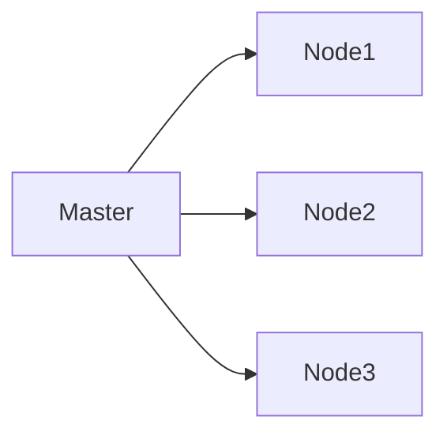
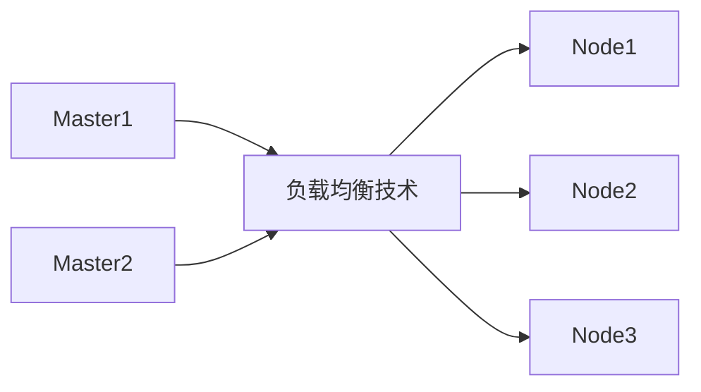

[TOC]
# 基本概念

**Kubernetes 容器集群管理系统**（常简称为K8s）是一个开源的容器编排平台，最初由 Google 开发，现已成为 Cloud Native Computing Foundation（CNCF）的一部分。Kubernetes旨在简化容器化应用程序的部署、扩展和管理，提供了丰富的功能和工具来帮助用户构建可靠、高效的容器化环境。

以下是Kubernetes的一些关键特点和核心概念：

1. **容器编排**：Kubernetes提供了强大的容器编排功能，可以自动化地部署、扩展和管理容器化应用程序。用户可以定义应用程序的期望状态，Kubernetes会根据这些定义自动调整系统状态以保持一致。
2. **集群管理**：Kubernetes支持多个节点的集群管理，用户可以轻松地在不同的物理机或虚拟机上部署容器，并统一管理这些容器。Kubernetes提供了节点管理、负载均衡、存储管理等功能，帮助用户构建高可用、高性能的集群环境。
3. **自动化扩展**：Kubernetes可以根据应用程序的负载情况自动扩展或缩减容器实例数量，以确保系统资源的最优利用和应用程序的高可用性。
4. **服务发现和负载均衡**：Kubernetes提供了内置的服务发现和负载均衡功能，可以帮助应用程序实现动态服务发现和负载均衡，确保应用程序的稳定性和可靠性。
5. **存储管理**：Kubernetes支持多种存储类型，包括持久卷（Persistent Volumes）和持久卷声明（Persistent Volume Claims），可以帮助用户管理应用程序的持久化存储需求。
6. **安全性**：Kubernetes提供了丰富的安全功能，包括身份认证、访问控制、网络策略等，可以帮助用户保护容器化应用程序的安全性。

kubernetes，简称K8s，是用8 代替8 个字符“ubernete”而成的缩写。是一个开源的，用于管理云平台中多个主机上的容器化的应用，Kubernetes 的目标是让部署容器化的应用简单并且高效（powerful）,Kubernetes 提供了应用部署，规划，更新，维护的一种机制。

传统的应用部署方式是通过插件或脚本来安装应用。这样做的缺点是应用的运行、配置、管理、所有生存周期将与当前操作系统绑定，这样做并不利于应用的升级更新/回滚等操作，当然也可以通过创建虚拟机的方式来实现某些功能，但是虚拟机非常重，并不利于可移植性。

新的方式是**通过部署容器方式**实现，每个容器之间互相隔离，每个容器有自己的文件系统，容器之间进程不会相互影响，能区分计算资源。相对于虚拟机，容器能快速部署，由于容器与底层设施、机器文件系统解耦的，所以它能在不同云、不同版本操作系统间进行迁移。

容器占用资源少、部署快，每个应用可以被打包成一个容器镜像，每个应用与容器间成一对一关系也使容器有更大优势，使用容器可以在build 或release 的阶段，为应用创建容器镜像，因为每个应用不需要与其余的应用堆栈组合，也不依赖于生产环境基础结构，这使得从研发到测试、生产能提供一致环境。类似地，容器比虚拟机轻量、更“透明”，这更便于监控和管理。

在Kubernetes 中，我们可以创建多个容器，每个容器里面运行一个应用实例，然后通过内置的负载均衡策略，实现对这一组应用实例的管理、发现、访问，而这些细节都不需要运维人员去进行复杂的手工配置和处理。

1. **自动装箱：**基于容器对应用运行环境的资源配置要求**自动部署应用容器**
2. **自我修复：**当容器失败时，会对容器进行重启。当所部署的 Node 节点有问题时，会对容器进行重新部署和重新调度。当容器未通过监控检查时，会关闭此容器**直到容器正常运行时**，才会对外提供服务。
3. **水平扩展：**通过简单的命令、用户 UI 界面或基于 CPU 等资源使用情况，对应用容器进行规模扩大或规模剪裁
4. **服务发现：**用户不需使用额外的服务发现机制，就能够基于 Kubernetes 自身能力实现服务发现和负载均衡
5. **滚动更新：**可以根据应用的变化，对应用容器运行的应用，进行一次性或批量式更新
6. **版本回退：**可以根据应用部署情况，对应用容器运行的应用，进行历史版本即时回退
7. **密钥和配置管理：**在不需要重新构建镜像的情况下，可以部署和更新密钥和应用配置，类似热部署。
8. **存储编排：**自动实现存储系统挂载及应用，特别对有状态应用实现数据持久化非常重要，存储系统可以来自于本地目录、网络存储(NFS、Gluster、Ceph 等)、公共云存储服务
9. **批处理：**提供一次性任务，定时任务；满足批量数据处理和分析的场景

## 集群架构


## 节点

在Kubernetes中，节点（Node）是集群中的基本计算单元，例如三台机器组成的 Kubernetes 集群，每台机器就可以看做一个节点，但节点不一定等同于物理机，节点可以是物理服务器、虚拟机实例或云实例，甚至可以是一台物理机上的多个虚拟机。

节点（Node）可以根据它们的角色和功能被划分为不同的类型。每个节点都有自己的资源（如CPU、内存、存储）和网络，负责接收和执行由控制平面（Control Plane）下发的任务。根据在集群中扮演的角色不同，大致可分为两类：

1. **主节点（Master Node）**：
   - 主节点是 Kubernetes 集群的控制平面，负责管理集群的状态、调度应用程序、监控集群健康状态等任务。
   - 主节点通常包含以下组件：
     - **kube-apiserver**：提供 Kubernetes API 服务，接收和处理用户请求。
     - **kube-controller-manager**：运行控制器，负责集群中的各种控制逻辑，如副本控制器、节点控制器等。
     - **kube-scheduler**：负责调度应用程序到适合的节点上运行。
     - **etcd**：分布式键值存储数据库，用于保存集群的状态信息。
  
2. **工作节点（Worker Node）**：
   - 工作节点是运行容器化应用程序的节点，负责执行实际的工作负载。
   - 工作节点通常包含以下组件：
     - **kubelet**：负责与主节点通信，接收并执行由主节点下发的任务。
     - **kube-proxy**：负责维护节点上的网络规则，实现服务发现和负载均衡。
     - **Container Runtime**：负责运行容器的软件，如 Docker、containerd 等。

此外还有

- **边缘节点（Edge Node）**：
   - 边缘节点是位于边缘网络的边缘位置的节点，通常用于在物理位置较远或网络带宽较低的情况下运行应用程序和服务。边缘节点可以帮助减少延迟，提高性能，并且可以支持在离散环境中部署Kubernetes集群。

- **GPU节点**：
   - GPU节点是配备了图形处理单元（GPU）的节点，用于运行需要大量计算资源的工作负载，如机器学习、深度学习等任务。这些节点通常包含专用的GPU硬件，并且可能需要特殊的容器运行时来支持GPU加速。

- **特定用途节点**：
   - 有时集群中可能会有一些特定用途的节点，用于运行特定类型的工作负载或服务。例如，存储节点用于运行持久化存储服务，或者网络节点用于运行网络功能虚拟化（NFV）服务。

等节点，这些节点类型通常根据其角色、功能或硬件配置进行分类。在实际情况中，可以根据集群的需求和工作负载的特性来定义和配置不同类型的节点。

### Master Node

#### kube-apiserver

kube-apiserver 是 Kubernetes 集群中的一个核心组件，可理解为集群的统一入口，它提供了 Kubernetes API 的服务端实现，负责处理来自用户、其他组件和外部系统的请求。**kube-apiserver 支持 RESTful 风格的请求方式，用户可以通过发送 HTTP 请求来与 Kubernetes 集群进行交互。**

通过 RESTful API，用户可以执行各种操作，如创建、删除、更新资源对象（如 Pod、Service、Deployment 等）、查询集群状态、查看日志、扩展集群功能等。RESTful API 的设计使得 Kubernetes 的管理操作变得简单、统一且易于扩展。

一般来说，用户可以使用工具如 kubectl（Kubernetes 命令行工具）或 HTTP 客户端工具来发送 RESTful 请求到 kube-apiserver，以执行各种管理操作。例如，通过发送 GET 请求可以获取集群中的资源对象信息，通过发送 POST 请求可以创建新的资源对象，通过发送 DELETE 请求可以删除资源对象，以此类推。

#### kube-controller-manager

kube-controller-manager 是 Kubernetes 集群中的一个核心组件，它是运行在主节点（Master Node）上的控制器管理器，负责运行一系列控制器（controllers）来监控集群状态并确保集群中的各种资源处于期望的状态。kube-controller-manager 包含了多个控制器，每个控制器负责不同的功能，如副本控制器、节点控制器、服务控制器等。

以下是 kube-controller-manager 中一些常见的控制器及其作用：

1. **副本控制器（Replication Controller）**：
   - 负责确保应用程序的副本数量符合用户定义的期望状态。如果有副本数量不足或过多，副本控制器会自动调整副本数量，保持应用程序的稳定性和可用性。
2. **节点控制器（Node Controller）**：
   - 负责监控集群中节点的状态，如节点的健康状态、连接状态等。节点控制器会处理节点的故障、离线等情况，确保集群中的节点状态正确。
3. **服务控制器（Service Controller）**：
   - 负责监控和管理 Kubernetes 中的服务对象。服务控制器会根据服务定义自动创建、更新、删除对应的负载均衡规则，确保服务的可用性和负载均衡。
4. **端点控制器（Endpoints Controller）**：
   - 负责将服务与后端 Pod 的 IP 地址关联起来，确保服务能够正确路由流量到对应的后端 Pod。

除了上述控制器之外，kube-controller-manager 还包含其他一些控制器，如命名空间控制器、资源配额控制器等，每个控制器都扮演着关键的角色，确保集群中的各种资源对象处于正确的状态，保证集群的稳定性和可靠性。

#### kube-scheduler

kube-scheduler 是 Kubernetes 集群中的一个核心组件，它是运行在主节点（Master Node）上的调度器，**负责根据预定义的调度策略（Scheduling Policies）将新创建的 Pod 分配到合适的工作节点（Worker Node）上运行**。kube-scheduler 在创建新的 Pod 时，会考虑诸多因素，如资源需求、硬件约束、亲和性和反亲和性规则等，以确保最佳地利用集群资源并提高整体性能。

以下是 kube-scheduler 的主要功能和工作原理：

1. **调度算法**：
   - kube-scheduler 使用一种称为调度算法（Scheduling Algorithm）的机制来选择最适合的工作节点来运行新的 Pod。调度算法会考虑多种因素，如节点资源利用率、Pod 的资源需求、节点亲和性和反亲和性规则等，以决定最佳的节点分配方案。
2. **调度策略**：
   - kube-scheduler 支持用户定义和配置调度策略，以满足不同场景下的需求。用户可以通过标签选择器（Label Selectors）、亲和性规则（Affinity Rules）、污点（Taints）等方式来定义 Pod 的调度约束和偏好。
3. **调度过程**：
   - 当用户创建一个新的 Pod 时，kube-scheduler 会监听到这个事件，并根据 Pod 的调度需求和集群状态来进行调度决策。它会评估每个工作节点的可用资源、负载情况等信息，选择最适合的节点来运行该 Pod。
4. **调度事件**：
   - kube-scheduler 会生成调度事件（Scheduling Events），记录每个 Pod 的调度过程和结果。这些事件可以帮助用户了解调度决策的原因，排查调度问题和优化调度性能。

### Worker Node

#### kubelet

kubelet 是 Kubernetes 集群中的一个核心组件，它是运行在每个工作节点（Worker Node）上的代理，负责管理节点上的容器和 Pod，与 Kubernetes Master 节点上的 API Server 交互，确保节点上的容器按照用户定义的期望状态运行。kubelet 负责监控节点上的资源使用情况、接收来自控制平面（master）的指令、拉取容器镜像、启动、停止和管理容器等。
以下是 kubelet 的一些主要功能和工作原理：
1. **Pod 生命周期管理**：
   - kubelet 负责管理节点上的 Pod 的生命周期，包括创建、启动、停止、重启和销毁 Pod。它会定期检查 API Server 中的 Pod 配置信息，根据配置信息来维护节点上的 Pod 状态。
2. **容器运行时管理**：
   - kubelet 通过容器运行时接口（如 Docker、containerd、CRI-O 等）来管理节点上的容器。它会与容器运行时进行交互，拉取容器镜像、启动容器、监控容器状态等。
3. **资源管理**：
   - kubelet 负责监控节点上的资源使用情况，包括 CPU、内存、磁盘等资源的利用率。它会根据 Pod 的资源请求和节点的实际资源情况来调度和管理容器，确保节点资源的合理分配。
4. **健康检查**：
   - kubelet 定期对节点上的容器和 Pod 进行健康检查，确保它们处于正常运行状态。如果发现容器或 Pod 出现问题，kubelet 会尝试重启容器或上报问题给控制平面。
5. **日志和指标收集**：
   - kubelet 负责收集节点上容器的日志和指标信息，并将这些信息发送到集中的日志和监控系统中，帮助管理员监控和诊断容器的运行状态。

#### kube-proxy

kube-proxy 是 Kubernetes 集群中的一个核心组件，**它负责实现 Kubernetes 集群内部的服务发现和负载均衡功能。**kube-proxy 在每个工作节点（Worker Node）上运行，通过维护节点上的网络规则来实现服务代理和负载均衡，确保集群内部的服务能够被正确路由和访问。

以下是 kube-proxy 的一些主要功能和工作原理：

1. **服务代理**：
   - kube-proxy 负责为 Kubernetes 集群中的 Service 对象创建代理规则，将 Service 的虚拟 IP（Cluster IP）映射到后端 Pod 的实际 IP 地址和端口。这样，通过访问 Service 的虚拟 IP，请求会被 kube-proxy 路由到对应的后端 Pod 上。
2. **负载均衡**：
   - kube-proxy 支持多种负载均衡模式，包括轮询（Round Robin）、IP 负载均衡（IPVS）等。它会根据 Service 的负载均衡策略和后端 Pod 的健康状态来动态调整流量的分发，确保请求能够均匀分配到各个后端 Pod 上。
3. **网络规则管理**：
   - kube-proxy 维护节点上的网络规则，包括 iptables 规则、IPVS 规则等，用于实现服务代理和负载均衡功能。它会监听 Kubernetes API Server 中 Service 和 Endpoint 的变化，动态更新网络规则以反映最新的服务配置。
4. **节点间通信**：
   - kube-proxy 还负责处理节点间的通信流量，确保集群内部的 Pod 和 Service 能够互相访问。它会为集群内部的通信流量创建路由规则，实现节点间的网络通信。
5. **高可用性**：
   - kube-proxy 支持多个 kube-proxy 实例之间的负载均衡和故障转移，确保即使某个 kube-proxy 实例发生故障，服务发现和负载均衡功能仍然能够正常运行。

## 核心概念

### pod

在 Kubernetes（k8s）中，Pod 是**最小的部署单元**，它是 Kubernetes 集群中可以被调度和管理的基本单位。Pod 可以包含一个或多个紧密相关的容器，这些容器共享相同的网络命名空间、存储卷和其他资源，并在同一个节点上运行。

以下是关于 Kubernetes 中的 Pod 的一些详细介绍：

1. **容器组合**：
   - Pod **可以包含一个或多个容器**，这些容器共享同一个网络命名空间和存储卷。这意味着它们可以方便地共享数据和通信，实现紧密耦合的服务组合。
2. **共享资源**：
   - **Pod 中的容器共享一些资源，如 IP 地址、端口空间和存储卷。**这使得它们可以方便地相互通信和共享数据，而无需额外的配置。
3. **生命周期管理**：
   - Pod 是一个可以创建、启动、停止和销毁的单元。Kubernetes 控制器可以管理 Pod 的生命周期，确保 Pod 按照用户的期望状态运行。
4. **调度和部署**：
   - Kubernetes Scheduler 负责将 Pod 调度到集群中的节点上，根据节点的资源情况和 Pod 的调度要求来选择合适的节点。Pod 可以根据用户定义的调度策略来实现灵活的部署。
5. **网络和存储**：
   - Pod 中的容器共享同一个网络命名空间，它们可以通过 localhost 进行通信。此外，Pod 可以挂载共享的存储卷，用于数据的持久化和共享。
6. **健康检查**：
   - Kubernetes 可以对 Pod 中的容器进行健康检查，确保容器处于正常运行状态。如果容器出现问题，Kubernetes 可以根据健康检查结果自动重启容器。
7. **扩展性**：
   - Pod 是 Kubernetes 中的扩展性单元，用户可以根据需要创建多个 Pod 实例，实现水平扩展和负载均衡。

### service

在 Kubernetes（k8s）中，Service 是一种抽象的概念，**用于定义一组 Pod 的访问方式和网络策略**。Service 提供了一种稳定的网络终结点，允许客户端通过 Service 访问一组具有相同标签的 Pod，而无需关心 Pod 的具体 IP 地址和端口信息。下面是关于 Kubernetes 中 Service 的详细介绍：
1. **负载均衡**：
   - Service 可以为一组具有相同标签的 Pod 提供负载均衡的访问方式。当客户端通过 Service 访问这组 Pod 时，Service 会自动将请求分发到不同的 Pod 实例，实现负载均衡。
2. **稳定的网络终结点**：
   - Service 提供了一个稳定的网络终结点，客户端可以通过 Service 的 Cluster IP 或者 Service Name 来访问后端 Pod，而不需要知道具体的 Pod IP 地址和端口信息。
3. **服务发现**：
   - Service 提供了一种服务发现机制，允许客户端动态地发现和访问运行中的服务。当 Pod 动态创建或销毁时，Service 会自动更新后端 Pod 的列表，确保客户端能够访问到最新的 Pod。
4. **多种类型**：
   - Kubernetes 中有多种类型的 Service，如 ClusterIP、NodePort、LoadBalancer、ExternalName 等，每种类型的 Service 提供不同的访问方式和网络策略，满足不同场景下的需求。
5. **端口转发**：
   - Service 可以通过端口转发将外部流量转发到后端 Pod，实现外部客户端与后端服务的通信。例如，NodePort Service 可以将外部流量转发到集群节点上指定的端口，然后再转发到后端 Pod。
6. **健康检查**：
   - Service 可以配置健康检查，定期检测后端 Pod 的健康状态。如果某个 Pod 不健康，Service 将不再将流量转发给该 Pod，确保服务的稳定性。
7. **内部通信**：
   - Service 不仅可以用于外部客户端访问，还可以用于内部服务之间的通信。通过 Service，不同的服务可以通过 Service Name 来相互访问，实现服务之间的解耦。

### controller

Kubernetes中的Controller是一种负责管理集群状态并确保系统中的实际状态与期望状态保持一致的控制器。它们通过观察集群中的资源对象，并采取必要的操作来使集群达到期望状态。Controller是Kubernetes控制平面的核心组件之一，它们负责实现Kubernetes的自动化和自愈性特性。

以下是一些常见的Kubernetes Controller及其功能的详细介绍：

1. **Replication Controller**：
   - **功能**：Replication Controller确保在Kubernetes集群中运行指定数量的Pod副本。如果由于任何原因Pod数量低于指定的数量，Replication Controller将启动新的Pod以保持副本数量的一致性。它也可以用来进行滚动更新。
   - **示例场景**：确保某个应用程序的副本数始终保持在特定的数量。

2. **Deployment Controller**：
   - **功能**：Deployment Controller是Replication Controller的高级别抽象，它引入了滚动更新和回滚等功能。Deployment可以用来创建新的ReplicaSets并逐步更新它们，以确保应用程序的无缝部署和更新。
   - **示例场景**：进行应用程序的滚动更新，同时确保在更新期间不中断服务。

3. **StatefulSet Controller**：
   - **功能**：StatefulSet Controller用于管理有状态的应用程序，如数据库。它确保在Pod重新调度或集群扩展时，每个Pod都具有稳定的标识和网络标识符。
   - **示例场景**：运行需要持久标识符的数据库，如MySQL或PostgreSQL。

4. **DaemonSet Controller**：
   - **功能**：DaemonSet确保在集群中的每个节点上运行一个Pod的副本。这对于在整个集群上运行特定类型的服务或网络代理很有用。
   - **示例场景**：在每个节点上运行日志收集器或监控代理。

5. **Job和CronJob Controller**：
   - **功能**：Job Controller用于管理一次性任务，确保任务成功完成。CronJob Controller用于管理定期运行的任务。
   - **示例场景**：定期备份数据或清理日志文件。

6. **Service Controller**：
   - **功能**：Service Controller确保在Kubernetes集群中的Service资源中定义的网络服务一直可用。它通过监视服务的后端Pod并更新负载均衡器来实现这一点。
   - **示例场景**：确保应用程序服务在Kubernetes集群内部和外部可访问。

这些Controller共同构成了Kubernetes的控制平面，负责管理和维护集群的状态，并确保用户定义的期望状态得以实现。通过这些Controller，Kubernetes可以实现自动化、高可用性和弹性等关键特性。

# Kubernetes 集群搭建

单 Master 集群结构



风险 Master 节点唯一，Master 节点宕机导致集群不可用

多 Master 集群结构




## 硬件要求

**操作系统**

CentOS7.x-86_x64

集群中所有机器之间网络互通

可以访问外网，需要拉取镜像

禁止 swap 分区

**测试环境**

Master 节点 ： CPU 2 核+ 内存 20GB+
Node 节点 ： CPU 4 核+ 内存 40GB+

**生产环境**

Master 节点 ： CPU 8 核+ 内存 100GB+
Node 节点 ： CPU 16 核+ 内存 500GB+

## 搭建方式

目前生产部署 Kubernetes 集群主要有两种方式：

1. kubeadm 

Kubeadm 是一个K8s 部署工具，提供kubeadm init 和kubeadm join，用于快速部署Kubernetes 集群。
官方地址：https://kubernetes.io/docs/reference/setup-tools/kubeadm/kubeadm/

2. 二进制包

从 github 下载发行版的二进制包，手动部署每个组件，组成 Kubernetes 集群。

Kubeadm 降低部署门槛，但屏蔽了很多细节，遇到问题很难排查。如果想更容易可控，推荐使用二进制包部署Kubernetes 集群，虽然手动部署麻烦点，期间可以学习很多工作原理，也利于后期维护。

## 单 Master 集群搭建

### kubeadm 方式

kubeadm是官方社区推出的一个用于快速部署 kubernetes 集群的工具。

这个工具能通过两条指令完成一个 kubernetes 集群的部署：

```
#### 创建一个 Master 节点
$ kubeadm init

#### 将一个 Node 节点加入到当前集群中
$ kubeadm join <Master节点的IP和端口 >
```

#### 1. 安装要求

在开始之前，部署Kubernetes集群机器需要满足以下几个条件：

- 一台或多台机器，操作系统 CentOS7.x-86_x64
- 硬件配置：2GB或更多RAM，2个CPU或更多CPU，硬盘30GB或更多
- 可以访问外网，需要拉取镜像，如果服务器不能上网，需要提前下载镜像并导入节点
- 禁止swap分区

#### 2. 准备环境

| 角色   | IP           |
| ------ | ------------ |
| master | 192.168.1.11 |
| node1  | 192.168.1.12 |
| node2  | 192.168.1.13 |

```shell
#### 安装 wget
sudo yum install wget

#### 关闭防火墙
systemctl stop firewalld
systemctl disable firewalld

#### 关闭selinux
sed -i 's/enforcing/disabled/' /etc/selinux/config  # 永久
setenforce 0  # 临时

#### 关闭swap
swapoff -a  # 临时
sed -ri 's/.*swap.*/#&/' /etc/fstab    # 永久

#### 根据规划设置主机名
hostnamectl set-hostname <hostname> # k8smaster / k8snode1 / k8snode2

#### 在master添加hosts
cat >> /etc/hosts << EOF
192.168.136.139 master
192.168.136.140 node1
192.168.136.141 node2
EOF

#### 将桥接的IPv4流量传递到iptables的链
cat > /etc/sysctl.d/k8s.conf << EOF
net.bridge.bridge-nf-call-ip6tables = 1
net.bridge.bridge-nf-call-iptables = 1
EOF
sysctl --system  # 生效

#### 时间同步
yum install ntpdate -y
ntpdate time.windows.com
```

#### 3. 所有节点安装Docker/kubeadm/kubelet

Kubernetes 默认 CRI（容器运行时）为 Docker，因此先安装 Docker。

##### 3.1 安装Docker

```shell
$ wget https://mirrors.aliyun.com/docker-ce/linux/centos/docker-ce.repo -O /etc/yum.repos.d/docker-ce.repo
$ yum -y install docker-ce-18.06.1.ce-3.el7
$ systemctl enable docker && systemctl start docker
$ docker --version
Docker version 18.06.1-ce, build e68fc7a
```

```shell
$ cat > /etc/docker/daemon.json << EOF
{
  "registry-mirrors": ["https://b9pmyelo.mirror.aliyuncs.com"]
}
EOF
```

```shell
#### 重启 docker
systemctl restart docker
```

##### 3.2 添加阿里云YUM软件源

```shell
$ cat > /etc/yum.repos.d/kubernetes.repo << EOF
[kubernetes]
name=Kubernetes
baseurl=https://mirrors.aliyun.com/kubernetes/yum/repos/kubernetes-el7-x86_64
enabled=1
gpgcheck=0
repo_gpgcheck=0
gpgkey=https://mirrors.aliyun.com/kubernetes/yum/doc/yum-key.gpg https://mirrors.aliyun.com/kubernetes/yum/doc/rpm-package-key.gpg
EOF
```

##### 3.3 安装kubeadm，kubelet和kubectl

由于版本更新频繁，这里指定版本号部署：

```shell
$ yum install -y kubelet-1.18.0 kubeadm-1.18.0 kubectl-1.18.0
$ systemctl enable kubelet # 开机启动
```

#### 4. 部署Kubernetes Master

在192.168.31.61（Master）执行。

```shell
$ kubeadm init \
  --apiserver-advertise-address=192.168.44.146 \ # 本机 IP
  --image-repository registry.aliyuncs.com/google_containers \ # 指定阿里云镜像仓库地址
  --kubernetes-version v1.18.0 \
  --service-cidr=10.96.0.0/12 \
  --pod-network-cidr=10.244.0.0/16
```

由于默认拉取镜像地址k8s.gcr.io国内无法访问，这里指定阿里云镜像仓库地址。

下面两步按照提示操作

**提示一：**使用kubectl工具：

```bash
mkdir -p $HOME/.kube
sudo cp -i /etc/kubernetes/admin.conf $HOME/.kube/config
sudo chown $(id -u):$(id -g) $HOME/.kube/config
$ kubectl get nodes
```

#### 5. 加入Kubernetes Node

在192.168.1.12/13（Node）执行。

**提示二：**向集群添加新节点，执行在kubeadm init输出的kubeadm join命令：

```bash
$ kubeadm join 192.168.1.11:6443 --token esce21.q6hetwm8si29qxwn \
    --discovery-token-ca-cert-hash sha256:00603a05805807501d7181c3d60b478788408cfe6cedefedb1f97569708be9c5
```

默认token有效期为24小时，当过期之后，该token就不可用了。这时就需要重新创建token，操作如下：

```
kubeadm token create --print-join-command
```

此时集群状态

```
NAME     STATUS     ROLES    AGE     VERSION
master   NotReady   master   4m31s   v1.18.0
node1    NotReady   <none>   112s    v1.18.0
node2    NotReady   <none>   29s     v1.18.0
```

#### 6. 部署CNI网络插件

下载至本地插件（忽略该步骤）

```
wget https://raw.githubusercontent.com/coreos/flannel/master/Documentation/kube-flannel.yml
```

master 执行 

默认镜像地址无法访问，sed命令修改为docker hub镜像仓库。

```bash
## 部署插件 中间可能由于网络原因失败，多试几次，若无法访问，可下载到本地 kubectl apply -f 本地路径安装
kubectl apply -f https://raw.githubusercontent.com/coreos/flannel/master/Documentation/kube-flannel.yml
## 查看集群状态，启动很慢多等一会
kubectl get pods -n kube-system

NAME                          READY   STATUS    RESTARTS   AGE
kube-flannel-ds-amd64-2pc95   1/1     Running   0          72s
```

```
[root@master ~]# kubectl get pods -n kube-system
NAME                             READY   STATUS    RESTARTS   AGE
coredns-7ff77c879f-bqhf8         1/1     Running   0          34m
coredns-7ff77c879f-nl64l         1/1     Running   0          34m
etcd-master                      1/1     Running   0          35m
kube-apiserver-master            1/1     Running   0          35m
kube-controller-manager-master   1/1     Running   3          35m
kube-proxy-jg76l                 1/1     Running   0          34m
kube-proxy-wkhcf                 1/1     Running   0          32m
kube-proxy-x98w6                 1/1     Running   0          31m
kube-scheduler-master            1/1     Running   2          35m

[root@master ~]# kubectl get nodes
NAME     STATUS   ROLES    AGE   VERSION
master   Ready    master   35m   v1.18.0
node1    Ready    <none>   32m   v1.18.0
node2    Ready    <none>   31m   v1.18.0
```

#### 7. 测试kubernetes集群

在Kubernetes集群中创建一个pod，验证是否正常运行：

```
$ kubectl create deployment nginx --image=nginx
$ kubectl expose deployment nginx --port=80 --type=NodePort
$ kubectl get pod,svc
```

访问地址：http://NodeIP:Port  

集群完成

# kubectl

kubectl 是 Kubernetes 的命令行工具，用于与运行中的 Kubernetes 集群进行交互。通过 kubectl 向及群中的 master 节点的 kube-apiserver 服务发送命令，用户可以执行各种操作，如创建、管理、监视和调试 Kubernetes 资源。

## Kubernetes 资源

可以认为在Kubernetes中，一切皆资源。Kubernetes的核心设计理念之一就是将所有的系统组件、应用程序和服务都视为资源，并使用统一的API进行管理和操作。这种设计思想使得Kubernetes具有高度的抽象性和灵活性，可以轻松地管理各种类型的资源，而无需关心底层的具体实现细节。

在Kubernetes中，资源可以是任何可以由API进行管理的对象，包括但不限于容器化的应用程序、存储卷、网络策略、配置数据等。每种资源都有其自己的API对象表示，用户可以使用kubectl或API服务器与这些对象进行交互。

这种一切皆资源的设计思想使得Kubernetes具有高度的可扩展性和通用性。用户可以使用相同的API和工具来管理不同类型的资源，而不需要学习和使用特定于每种资源类型的工具或语法。这也为Kubernetes提供了极大的灵活性，使其能够适应各种不同类型的应用场景和工作负载需求。

以下是一些常见的Kubernetes资源：

1. **Pod**：
   - Pod是Kubernetes中最小的部署单位，它可以包含一个或多个容器，并共享网络命名空间、IPC和存储卷等资源。Pod通常用于运行一个应用程序实例。

2. **Service**：
   - Service是Kubernetes中用于暴露应用程序的网络服务的资源。它定义了一组Pod的逻辑集合，并为它们提供一个统一的访问入口，可以通过Service的ClusterIP、NodePort、LoadBalancer或ExternalName类型将流量路由到对应的Pod。

3. **Deployment**：
   - Deployment是用于部署应用程序的资源，它定义了一个Pod副本集（ReplicaSet）和用于更新Pod的策略。Deployment可以确保在应用程序部署期间保持可用性，并提供滚动更新和回滚的功能。

4. **StatefulSet**：
   - StatefulSet是一种用于管理有状态应用程序的资源。它与Deployment类似，但为Pod提供了稳定的网络标识符和持久性存储，以便在重新调度或扩展时保持状态的稳定性。

5. **DaemonSet**：
   - DaemonSet是用于在集群中的每个节点上运行一个Pod的资源。它通常用于在集群中的每个节点上运行一些基础设施性的服务，如日志收集器、监控代理等。

6. **Job和CronJob**：
   - Job是用于管理一次性任务的资源，它确保任务成功完成。CronJob是用于管理定期运行的任务的资源，它可以根据用户定义的调度规则自动创建Job。

7. **Namespace**：
   - Namespace是用于对集群资源进行逻辑隔离的资源。它可以帮助将集群中的资源划分为多个逻辑组，使不同团队或应用程序可以在同一集群中共享资源而不会相互干扰。

8. **ConfigMap和Secret**：
   - ConfigMap用于存储配置数据，如环境变量、配置文件等，而Secret用于存储敏感数据，如密码、密钥等。这些资源可以被挂载到Pod中，以便应用程序可以访问这些配置和敏感数据。

除了上述常见的资源外，Kubernetes还有许多其他类型的资源，如PersistentVolume、StorageClass、Ingress等，用于管理存储、网络、安全等方面的配置。这些资源共同构成了Kubernetes集群中的基础设施和应用程序组件，帮助用户在集群中部署、管理和运行各种类型的应用程序和服务。

## kubectl 基本语法

kubectl 的基本语法如下：

```bash
kubectl [command] [TYPE] [NAME] [flags]
```

- `command`：表示要执行的操作命令，例如 apply、get、describe、delete 等。
- `TYPE`：表示 Kubernetes 资源的类型，如 Pod、Service、Deployment、ConfigMap 等。
- `NAME`：表示资源的名称，用于指定具体的资源对象。
- `flags`：表示命令的选项和参数，用于控制命令的行为。

一些常用的 kubectl 命令包括：
- `kubectl get`：用于获取资源的信息。
- `kubectl describe`：用于显示资源的详细信息。
- `kubectl apply`：用于应用配置文件。
- `kubectl create`：用于创建资源。
- `kubectl delete`：用于删除资源。
- `kubectl exec`：用于在容器内执行命令。
- `kubectl logs`：用于查看 Pod 的日志。
- `kubectl port-forward`：用于端口转发。

除了以上列出的命令，kubectl 还有许多其他功能和子命令，可以通过 `kubectl --help` 查看完整的命令列表和帮助信息。

示例：

1. **获取资源列表**：
```bash
kubectl get pods
kubectl get services
kubectl get deployments
```

2. **查看资源详细信息**：
```bash
kubectl describe pod <pod-name>
kubectl describe service <service-name>
kubectl describe deployment <deployment-name>
```

3. **应用配置文件**：
```bash
kubectl apply -f pod.yaml
kubectl apply -f deployment.yaml
kubectl apply -f service.yaml
```

4. **删除资源**：
```bash
kubectl delete pod <pod-name>
kubectl delete service <service-name>
kubectl delete deployment <deployment-name>
```

5. **在 Pod 内执行命令**：
```bash
kubectl exec -it <pod-name> -- /bin/bash
kubectl exec -it <pod-name> -- ls
```

6. **查看 Pod 日志**：
```bash
kubectl logs <pod-name>
```

7. **端口转发**：
```bash
kubectl port-forward <pod-name> 8080:80
```

# kubernetes 集群 YAML 文件

K8s 集群中对资源管理和资源对象编排部署都可以通过声明样式（YAML）文件来解决，也就是可以把需要对资源对象操作编辑到 YAML 格式文件中，我们把这种文件叫做**资源清单文件**，通过 kubectl 命令直接使用资源清单文件就可以实现对大量的资源对象进行编排部署了。

在Kubernetes中，YAML（YAML Ain't Markup Language）文件是一种常用的文本文件格式，用于定义和描述Kubernetes资源对象的配置。这些YAML文件包含了对于Kubernetes API的调用，以创建、更新或删除Kubernetes中的各种资源。

一个典型的Kubernetes YAML文件包含了以下几个方面的信息：

1. **资源类型（Kind）**：指定了要创建或操作的资源的类型，如Pod、Service、Deployment等。

2. **对象元数据（Metadata）**：包括资源的名称、命名空间、标签等信息，用于唯一标识和识别资源。

3. **规范（Spec）**：定义了资源的期望状态，包括容器镜像、环境变量、端口、副本数量等配置。

4. **状态（Status）**：描述了资源的当前状态，通常由Kubernetes自动管理。

一个简单的示例可能是一个Pod的YAML文件，如下所示：

```yaml
apiVersion: v1
kind: Pod
metadata:
  name: mypod
spec:
  containers:
  - name: mycontainer
    image: nginx:latest
    ports:
    - containerPort: 80
```

在这个YAML文件中：
- `apiVersion` 指定了Kubernetes API的版本。
- `kind` 指定了要创建的资源类型，这里是Pod。
- `metadata` 包含了Pod的元数据，如名称等。
- `spec` 包含了Pod的规范，包括要运行的容器的镜像、暴露的端口等。

**用户可以通过将这样的YAML文件传递给kubectl命令来在Kubernetes集群中创建资源。kubectl会解析YAML文件并将其转换成API请求，然后将其发送给Kubernetes API服务器来执行相应的操作。**

因此，Kubernetes中的YAML文件是用于定义和配置Kubernetes资源对象的文本文件，它们为Kubernetes提供了一种声明性的方式来描述系统状态和期望状态，并使得资源的创建和管理变得更加简单和可重复。

## YAML 基本语法

1. **基本规则**：
   - YAML 使用缩进来表示数据之间的层级关系，一般使用空格来缩进，不同层级之间的缩进量必须一致。
   - 注释以 `#` 开头，直到行末的内容为注释，注释会被忽略。
   - 大小写敏感。
2. **数据结构**：
   - **键值对**：使用冒号 `:` 将键和值分隔，如 `key: value`。
   - **列表**：使用 `-` 加空格表示列表项，如 `- item1`。
   - **嵌套结构**：可以嵌套字典和列表，通过缩进来表示层级关系。
3. **字符串**：
   - **普通字符串**：不需要引号，如 `key: value`。
   - **单引号字符串**：使用单引号 `'` 包裹，如 `key: 'value'`。
   - **双引号字符串**：使用双引号 `"` 包裹，支持转义字符，如 `key: "value"`。
4. **字典**：
   - 使用键值对的形式表示，如：
     ```yaml
     key1: value1
     key2: value2
     ```
5. **列表**：
   - 使用 `-` 加空格表示列表项，如：
     ```yaml
     - item1
     - item2
     ```
6. **多行字符串**：
   - 使用 `|` 符号表示保留换行符，如：
     ```yaml
     key: |
       This is a
       multiline
       string
     ```
7. **引用**：
   
   - 可以使用 `&` 定义锚点（Anchor）和 `*` 引用锚点，实现数据的引用和重用。
8. **特殊值**：
   - **布尔值**：`true` 和 `false`。
   - **空值**：`null` 或 `~`。

## 常用字段

必须存在的属性


spec 主要对象


额外的参数


## YAML 文件的组成部分

Kubernetes 集群中的 YAML 文件通常包含以下几个重要的组成部分：

1. **API 版本（apiVersion）**：指定 YAML 文件中所定义资源对象的 API 版本。不同类型的资源对象可能有不同的 API 版本，如 `v1`, `apps/v1`, `extensions/v1beta1` 等。
2. **资源类型（kind）**：定义了该 YAML 文件中所描述的资源对象的类型，如 Pod、Service、Deployment 等。
3. **元数据（metadata）**：包含了资源对象的元数据信息，如名称（name）、命名空间（namespace）、标签（labels）等。
4. **规格（spec）**：规定了资源对象的规格和配置信息，包括容器镜像、端口、挂载卷等具体的配置。
5. **状态（status）**：状态部分通常由 Kubernetes 自动填充，用于描述资源对象的当前状态信息。
一个典型的 Kubernetes YAML 文件示例如下：
```yaml
apiVersion: v1
kind: Pod
metadata:
  name: my-pod
  labels:
    app: my-app
spec:
  containers:
  - name: my-container
    image: nginx:latest
    ports:
    - containerPort: 80
```
在这个示例中：
1. **apiVersion**：
   - 描述了使用的 Kubernetes API 的版本。在这个例子中，使用的是 v1 版本的 API。

2. **kind**：
   - 指定了要创建的 Kubernetes 资源的类型。在这个例子中，kind 是 Pod，表示要创建一个 Pod 对象。

3. **metadata**：
   - 包含了关于资源的元数据，如名称、标签等。

   - **name**：指定了这个 Pod 的名称，这里是 "my-pod"。
   
   - **labels**：为 Pod 添加了标签，用于标识和选择 Pod。

4. **spec**：
   - 描述了 Pod 中容器的规格（specification）。

   - **containers**：这是一个包含容器配置的列表。

     - **name**：容器的名称，这里是 "my-container"。
     
     - **image**：要使用的容器镜像，这里是 "nginx:latest"，表示使用最新版本的 Nginx 镜像。

     - **ports**：描述容器需要暴露的端口。

       - **containerPort**：容器内部应用程序监听的端口号，这里是 80。

这个 YAML 文件定义了一个简单的 Pod，其中运行一个名为 "my-container" 的容器，使用 Nginx 最新版本镜像，容器内部监听端口 80。

示例：

以下是一个示例的完整的 Kubernetes 集群中的 YAML 文件，包含了 Deployment、Service 和 ConfigMap 的配置，并说明了每个配置项的作用：

```yaml
# Deployment 配置
apiVersion: apps/v1
kind: Deployment
metadata:
  name: my-deployment
spec:
  replicas: 3
  selector:
    matchLabels:
      app: my-app
  template:
    metadata:
      labels:
        app: my-app
    spec:
      containers:
      - name: my-container
        image: nginx:latest
        ports:
        - containerPort: 80
--- # --- 代表一个新的 ymal 文件的开始
# Service 配置
apiVersion: v1
kind: Service
metadata:
  name: my-service
spec:
  selector:
    app: my-app
  ports:
    - protocol: TCP
      port: 80
      targetPort: 80
  type: ClusterIP
---
# ConfigMap 配置
apiVersion: v1
kind: ConfigMap
metadata:
  name: my-configmap
data:
  config: |
    key1: value1
    key2: value2
```
每个配置项的作用说明如下：
1. **Deployment 配置**：
   - `apiVersion`: 指定资源对象的 API 版本。
   - `kind`: 指定资源对象的类型为 Deployment。
   - `metadata`: 定义资源对象的元数据，包括名称等。
   - `spec.replicas`: 指定需要创建的 Pod 实例数量。
   - `spec.selector`: 定义用于标识 Pod 的标签选择器。
   - `spec.template`: 定义创建 Pod 的模板，包括容器等。
2. **Service 配置**：
   - `apiVersion`: 指定资源对象的 API 版本。
   - `kind`: 指定资源对象的类型为 Service。
   - `metadata`: 定义资源对象的元数据，包括名称等。
   - `spec.selector`: 指定 Service 所关联的 Pod 的标签选择器。
   - `spec.ports`: 定义 Service 的端口映射。
   - `spec.type`: 指定 Service 的类型，如 ClusterIP、NodePort 等。
3. **ConfigMap 配置**：
   - `apiVersion`: 指定资源对象的 API 版本。
   - `kind`: 指定资源对象的类型为 ConfigMap。
   - `metadata`: 定义资源对象的元数据，包括名称等。
   - `data`: 定义 ConfigMap 的数据内容，可以存储配置信息等。
   以上示例展示了一个完整的 Kubernetes 集群中的 YAML 文件，包含了 Deployment、Service 和 ConfigMap 的配置，并说明了每个配置项的作用。这些配置项共同构成了一个完整的应用部署和服务配置的描述。

### apiVersion

在Kubernetes的YAML文件中，`apiVersion`字段用于指定要使用的Kubernetes API的版本。它告诉Kubernetes如何解释该YAML文件中的其他部分。每个Kubernetes API版本都定义了一组资源类型和配置选项，因此指定正确的`apiVersion`非常重要，以确保Kubernetes能够正确地理解和处理YAML文件中的内容。

`apiVersion`的填写说明如下：

1. **版本格式**：
   - `apiVersion`的格式通常为`group/version`，其中`group`表示API组，`version`表示API版本。例如，`v1`表示核心API版本，而`apps/v1`表示`apps` API组的`v1`版本。

2. **选择正确的版本**：
   - 根据要创建的资源类型和Kubernetes集群的版本，选择正确的`apiVersion`是至关重要的。每个资源类型都有其支持的API版本，通常可以在Kubernetes文档中查找到每个资源所支持的API版本列表。

3. **默认版本**：
   - 对于一些常用的核心资源类型，如Pod、Service等，通常有一个默认的API版本，可以省略`apiVersion`字段。例如，`apiVersion: v1`可以简写为`kind: Pod`而不写`apiVersion`。

4. **查找支持的版本**：
   - 可以通过查询Kubernetes文档或使用`kubectl api-versions`命令来查找集群所支持的API版本。这有助于确保选择了集群支持的API版本。

5. **扩展API版本**：
   - Kubernetes还支持自定义和扩展API版本，这些版本可能不属于核心API组。在使用扩展API版本时，需要确保集群中已经安装了相应的扩展。

### kind

在Kubernetes的YAML文件中，每个资源对象只能具有一个kind，该字段用于确定创建的资源对象的类型，以便Kubernetes能够正确地解释和处理该资源的配置。例如，如果要创建一个运行容器的资源，可能需要选择kind: Pod；如果要创建一个负载均衡服务，可能需要选择kind: Service。

Kubernetes还支持自定义资源类型，用户可以根据自己的需求定义和创建自定义的kind。在使用自定义资源类型时，需要确保定义了相应的API和控制器来支持这些资源。

### metadata 

在Kubernetes的YAML文件中，`metadata`字段用于包含与要创建的资源对象相关的元数据信息。这些元数据信息包括资源的名称、命名空间、标签等，用于唯一标识和识别资源，并提供其他附加信息。

`metadata`的作用及填写说明如下：

1. **唯一标识**：
   - `metadata`字段中的`name`属性是资源对象的名称，用于唯一标识该资源。每个资源对象都必须具有唯一的名称，以便Kubernetes能够正确地识别和管理这些资源。

2. **命名空间**：
   - `metadata`字段中的`namespace`属性用于指定资源所属的命名空间。命名空间用于对集群中的资源进行逻辑隔离和组织，使得不同团队或应用程序可以在同一集群中共享资源而不会相互干扰。如果未指定命名空间，则资源将被创建在默认的`default`命名空间中。

3. **标签**：
   - `metadata`字段中的`labels`属性用于定义资源的标签。标签是键值对的形式，用于对资源进行分类、筛选和组织。标签可以用于识别具有相同用途或属性的资源，并对它们进行操作或应用相应的策略。

4. **其他元数据**：
   - `metadata`字段还可以包含其他元数据属性，如`annotations`用于存储关于资源的其他信息或描述。这些属性通常是可选的，用于提供有关资源的额外信息。

5. **填写说明**：
   - 在填写`metadata`字段时，至少需要指定`name`属性来定义资源的名称。其他属性如`namespace`和`labels`通常是可选的，但在某些情况下可能是必需的，具体取决于资源的类型和使用场景。

### spec

在Kubernetes的YAML文件中，`spec`字段用于定义要创建的资源对象的规范（Specification）。它包含了资源对象的配置选项和属性，描述了资源的期望状态和行为。`spec`字段是创建和定义Kubernetes资源对象的关键部分之一。

`spec`的作用及填写说明如下：

1. **规范定义**：
   - `spec`字段用于定义资源对象的规范，包括资源的期望状态、行为和配置选项。根据资源对象的类型和用途，`spec`字段可能包含不同的子字段和属性。

2. **资源状态**：
   - `spec`字段描述了资源对象的期望状态，即用户希望资源对象在创建或更新后达到的状态。这包括容器镜像、环境变量、端口、副本数量等配置。

3. **行为配置**：
   - `spec`字段还可以包含与资源对象相关的行为配置，如调度策略、更新策略、资源限制等。这些配置选项可以影响资源对象的行为和运行方式。

4. **填写说明**：
   - 在填写`spec`字段时，需要根据要创建的资源对象的类型和用途来选择正确的配置选项和属性。不同类型的资源对象可能具有不同的规范字段和属性，具体取决于资源对象的用途和定义。

5. **示例**：
   - 下面是一个Pod资源对象的`spec`字段的示例：
   ```yaml
   spec:
     containers:
     - name: mycontainer
       image: nginx:latest
       ports:
       - containerPort: 80
   ```
   在这个示例中，`spec`字段定义了一个Pod中容器的规范，包括容器的名称、镜像和端口配置。

## 快速编写 ymal 文件

在实际操作中，纯手写 ymal 文件配置难度较大，一般可以通过其他方式生成 ymal 文件

### kubectl create

`kubectl create` 是 Kubernetes 中一个用于创建资源对象的命令行工具。通过 `kubectl create` 命令，可以在 Kubernetes 集群中创建各种类型的资源对象，如 Pod、Deployment、Service、ConfigMap 等。

**用法**：

```bash
kubectl create -f FILENAME
kubectl create TYPE NAME [flags]
kubectl create clusterrolebinding NAME --clusterrole=cluster-admin --user=USER_ACCOUNT
```

**参数说明**：
- `-f FILENAME`：从指定的 YAML 文件中创建资源对象。
- `TYPE`：要创建的资源对象的类型，如 Pod、Deployment、Service 等。
- `NAME`：要创建的资源对象的名称。
- `--clusterrole=cluster-admin`：指定集群角色绑定的角色。
- `--user=USER_ACCOUNT`：指定集群角色绑定的用户账号。

**示例**：
1. 从 YAML 文件中创建资源对象：
   ```
   kubectl create -f deployment.yaml
   ```
2. 创建一个 Pod：
   ```
   kubectl create pod mypod --image=nginx
   ```
3. 创建一个 Deployment：
   ```
   kubectl create deployment mydeployment --image=nginx
   ```
4. 创建一个 Service：
   ```
   kubectl create service clusterip myservice --tcp=80:80
   ```
5. 创建一个 ConfigMap：
   ```
   kubectl create configmap myconfigmap --from-literal=key1=value1 --from-literal=key2=value2
   ```
6. 创建一个 ClusterRoleBinding：
   ```
   kubectl create clusterrolebinding myclusterrolebinding --clusterrole=cluster-admin --user=myuser
   ```

**使用 kubectl create 生成 ymal 适用于创建资源时使用**

一般来说 kubectl create 命令可以用于创建资源时使用，例如创建一个 nginx 

```bash
kubectl create deployment nginx --image=nginx
```

但也可以指定其不是创建，而是将创建资源的 ymal 文件输出

```bash
kubectl create deployment nginx --image=nginx --dry-run=client -o yaml
```

这个命令的含义是使用 kubectl 创建一个名为 nginx 的 Deployment，使用 nginx 镜像，但是不会真正在集群中创建该 Deployment。参数 --dry-run=client 表示只会在客户端执行预演，并不会实际创建资源对象，而 -o yaml 表示以 YAML 格式输出资源对象的配置内容。

```yml
apiVersion: apps/v1
kind: Deployment
metadata:
  creationTimestamp: null
  labels:
    app: nginx
  name: nginx
spec:
  replicas: 1
  selector:
    matchLabels:
      app: nginx
  strategy: {}
  template:
    metadata:
      creationTimestamp: null
      labels:
        app: nginx
    spec:
      containers:
      - image: nginx
        name: nginx
        resources: {}
status: {}
```

后续即可根据生成的文件进行修改

### kubectl get

`kubectl get` 是 Kubernetes 中一个用于获取资源对象信息的命令行工具。通过 `kubectl get` 命令，可以查看当前 Kubernetes 集群中各种类型的资源对象的信息，如 Pods、Nodes、Services、Deployments 等。下面详细解释 `kubectl get` 命令的用法和参数：

**用法**：
```
kubectl get [resource_type] [resource_name] [flags]
```

**参数说明**：
- `resource_type`：要获取的资源对象的类型，如 Pods、Nodes、Services、Deployments 等。
- `resource_name`：要获取的资源对象的名称，可选参数，如果不指定则会列出该类型的所有资源对象。
- `[flags]`：可选的标志参数，用于控制输出的格式和内容。

**常用示例**：
1. 获取所有 Pods：
   ```
   kubectl get pods
   ```
2. 获取特定 Namespace 中的 Pods：
   ```
   kubectl get pods -n <namespace>
   ```
3. 获取所有 Nodes：
   ```
   kubectl get nodes
   ```
4. 获取 Services：
   ```
   kubectl get services
   ```
5. 获取 Deployments：
   ```
   kubectl get deployments
   ```
6. 获取特定资源对象的详细信息：
   ```
   kubectl get pod <pod_name> -o yaml
   ```

**输出格式控制**：

- `-o wide`：以更宽的格式显示资源对象信息。
- `-o yaml`：以 YAML 格式显示资源对象信息。
- `-o json`：以 JSON 格式显示资源对象信息。

通过 `kubectl get` 命令，可以方便地查看 Kubernetes 集群中各种资源对象的状态、名称、标签等信息，帮助管理员和开发人员了解集群的当前状态，进行故障排查、监控和管理。

使用 kubectl get 生成 ymal 适用于导出已有资源的 ymal 文件

```bash
kubectl get deploy nginx -o yaml
```

# pod

在 Kubernetes 中，**Pod 是最小的部署单元**，用于运行容器化应用程序。

1. **Pod 的定义**：
- Pod 是 Kubernetes 中可以创建和管理的**最小资源对象模型**。
- **一个 Pod 可以包含一个或多个紧密相关的容器**，**它们共享网络和存储空间**，运行在同一个节点上。
- Pod 中的容器共享同一个网络命名空间和 IP 地址，**可以通过 localhost 互相通信**。

2. **Pod 的特点**：
- **最小调度单元**：Kubernetes 将 Pod 视为最小的调度单元，决定 Pod 在哪个节点上运行。
- **生命周期**：**Pod 是短暂的**，可以被创建、删除、重启或者替换。
- **独立性**：Pod 中的容器共享相同的资源，但是它们是独立运行的，可以有不同的生命周期。
- **共享存储和网络**：Pod 中的容器共享存储卷和网络命名空间，方便容器之间的通信和数据共享。

3. **Pod 的组成**：
- **容器**：Pod 中可以包含一个或多个容器，这些容器共享网络和存储。
- **存储卷**：Pod 可以包含存储卷，用于持久化数据或者共享数据。
- **元数据**：Pod 包含一些元数据，如名称、命名空间、标签等，用于管理和识别 Pod。

4. **Pod 的生命周期**：
- **创建**：通过 Deployment、ReplicaSet 或者直接创建 Pod 来创建 Pod 对象。
- **运行**：Pod 中的容器开始运行，并执行其定义的任务。
- **重启**：Pod 可以手动或者由控制器触发重启。
- **删除**：Pod 可以手动删除或者由控制器管理的删除。

5. **Pod 的用途**：
- 运行单个容器应用程序。
- 运行多个紧密相关的容器，共享资源。
- 提供一个抽象层，使得应用程序可以独立于底层基础设施运行。

## Pod 的分类

在 Kubernetes 中，除了普通 Pod，还存在一种叫做“静态 Pod”的特殊类型 Pod。

1. **普通 Pod**：

   - 普通 Pod 是用户直接通过 Kubernetes API 创建的 Pod，它们通常是通过 Deployment、StatefulSet、DaemonSet 等控制器对象创建和管理的。
   - 普通 Pod 的配置信息（如容器镜像、资源限制、环境变量等）通常存储在 etcd 中，并由 Kubernetes Master 负责调度和管理。
   - 普通 Pod 可以跨节点调度，根据调度策略在集群中的任意节点上运行。
   - 普通Pod 一旦被创建，就会被放入到etcd 中存储，随后会被Kubernetes Master 调度到某个具体的Node 上并进行绑定，随后该Pod 对应的Node 上的kubelet 进程实例化成一组相关的Docker 容器并启动起来。在默认情况下，当Pod 里某个容器停止时，Kubernetes 会自动检测到这个问题并且重新启动这个Pod 里某所有容器， 如果Pod 所在的Node 宕机，则会将这个Node 上的所有Pod 重新调度到其它节点上。

2. **静态 Pod**：
   - 静态 Pod 是直接由 kubelet 在节点上管理和运行的 Pod，不需要通过 Kubernetes API 创建，也不受 Kubernetes Master 控制。
   - 静态 Pod 的配置文件通常存储在节点的特定目录中（如 `/etc/kubernetes/manifests`），kubelet 会定期检测该目录下的配置文件，并根据配置文件启动 Pod。
   - 静态 Pod 通常用于在节点启动时运行一些系统级别的服务或辅助容器，如网络代理、日志收集器等。
   - 静态 Pod 与节点一一对应，只能在其所在的节点上运行，不支持跨节点调度。
   - 静态Pod 是由kubelet 进行管理的仅存在于特定Node 上的Pod,它们不能通过API Server进行管理，无法与ReplicationController、Deployment 或DaemonSet 进行关联，并且kubelet 也无法对它们进行健康检查。

## pod 特性

为什么要引入pod的概念，而不是直接使用容器（docker）作为最小单元

引入 Pod 的概念是为了更好地管理容器化应用程序。尽管容器本身已经提供了一种有效的方式来打包和部署应用程序，但 Kubernetes 引入 Pod 的概念是为了解决一些复杂的应用场景和需求。

1. **多容器协作**：在一个 Pod 内可以运行多个容器，并且它们可以共享相同的网络命名空间和存储卷。这使得在同一逻辑单元内运行相关的容器变得更容易，比如一个应用程序容器和一个辅助容器（例如日志收集器、监控代理等）。**同一个 Pod 中的容器总会被调度到相同 Node 节点**，不同节点间 Pod 的通信基于虚拟二层网络技术实现

2. **共享资源**：Pod 是 Kubernetes 中调度的基本单位。Pod 中的容器可以共享资源，比如 CPU、内存等。这使得在容器之间共享资源变得更加灵活和高效。

3. **网络模型**：Pod 为容器提供了一个共享的网络命名空间，这意味着它们可以通过 localhost 直接通信，而不需要额外的端口映射或网络配置。

4. **生命周期管理**：Pod 提供了一个容器组的逻辑单元，使得它们可以一起启动、停止和调度。这使得应用程序的生命周期管理变得更加简单和一致。

5. **弹性和可伸缩性**：Kubernetes 的弹性和伸缩特性是基于 Pod 的。通过扩展或缩减 Pod 的数量来调整应用程序的规模，而不是直接操作单个容器。

6. **更加灵活**：pod 是多进程设计，docker 是单进程设计

### 单进程设计

单进程设计是指在一个系统或应用程序中，每个实例只运行一个主要的进程。这个主要的进程通常是应用程序的核心，负责执行应用程序的主要功能。单进程设计通常用于简化系统结构、提高系统的稳定性和可维护性。

在单进程设计中，整个应用程序的逻辑被组织在一个进程中，其他辅助功能可能通过线程、子进程或外部服务来实现。这种设计方式可以使得应用程序结构清晰简单，易于理解和维护。同时，单进程设计也有助于隔离不同功能模块，避免不同功能之间的相互干扰。

单进程设计通常适用于一些简单的应用程序或服务，特别是那些不需要同时处理大量并发请求或复杂计算的场景。在这种情况下，单个进程能够满足应用程序的需求，并且可以更容易地监控和管理整个应用程序的运行状态。

然而，在某些复杂的应用程序或服务中，可能需要使用多进程或多线程来处理并发请求、提高性能或实现更复杂的功能。在这种情况下，单进程设计可能不够灵活或高效，需要根据具体需求选择合适的设计方式。

Docker 鼓励将每个容器设计为只运行一个主进程，通常指的是在一个容器中只运行一个主要的应用程序进程。这并不意味着一个 Docker 容器只能运行一个镜像，**而是强调在一个容器中应该只有一个主要的进程在运行**，负责应用程序的核心功能。

举例来说，如果你使用 MySQL 数据库作为一个应用程序的后端数据库服务，你可以将 MySQL 数据库作为一个独立的 Docker 镜像运行在一个独立的容器中。这个容器中只运行 MySQL 数据库的主进程，负责数据库服务的运行。这样做符合 Docker 的设计理念，即一个容器只运行一个主要的进程，以保持容器的简洁性和隔离性。

另外，如果你的应用程序需要多个服务组件，例如前端 Web 服务、后端应用程序服务、数据库服务等，你可以将每个服务组件作为一个独立的 Docker 容器运行。每个容器内只运行一个主要的进程，分别负责不同服务的运行。这样可以更好地实现服务之间的隔离、管理和部署。

因此，一个 Docker 容器可以运行一个或多个镜像，但是在一个容器中通常建议只运行一个主要的进程，以符合 Docker 鼓励的容器设计原则。这样可以更好地利用 Docker 的轻量级、隔离性和易管理性，提高应用程序的部署效率和运行稳定性。

### 多进程设计

Pod 是 Kubernetes 中最小的部署单元，可以包含一个或多个容器。**Pod 中的容器共享网络命名空间和存储卷**，它们可以在同一个 Pod 中共同协作、相互通信。

Pod 中的多个容器可以被看作是多个进程的集合，这些进程可以共享同一个网络环境和文件系统，它们可以相互协作、共享资源。这种设计可以更好地支持复杂应用组件之间的交互和协同工作。

Pod 中的容器可以共享同一个网络命名空间和存储卷，它们可以通过 localhost 相互通信，共享数据。这种设计可以简化容器之间的通信和数据共享。所以一个 Pod 内的多个容器之间可以通过 localhost 来进行通信,所需要注意的是不同容器要注意不要有端口冲突即可。不同的 Pod 有不同的 IP,不同 Pod 内的多个容器之前通信，不可以使用 IPC（如果没有特殊指定的话）通信，通常情况下使用 Pod的 IP 进行通信

一个 Pod 里的多个容器可以共享存储卷，这个存储卷会被定义为 Pod 的一部分，并且可以挂载到该 Pod 里的所有容器的文件系统上。

### 亲密性应用

Pod 的存在也为了支持部署亲密性应用，即那些需要在同一主机上共享资源、网络和存储的应用程序。这种部署方式可以使相关的应用程序能够更紧密地协作、通信和共享资源，提高应用程序之间的亲密性和协同工作效率。

举例来说明，假设有一个 Web 应用程序，它由一个前端容器和一个后端容器组成，前端容器负责处理用户请求和展示界面，后端容器负责处理业务逻辑和数据存储。这两个容器之间需要频繁通信和共享数据，为了实现它们之间的亲密性，可以将它们打包在同一个 Pod 中。

在这个示例中，将前端容器和后端容器放在同一个 Pod 中，它们可以共享同一个网络命名空间、存储卷和其他资源。这样可以使得前端容器能够直接通过 localhost 访问后端容器，减少网络延迟和通信开销。同时，它们可以共享同一个生命周期，当 Pod 被调度到同一节点上时，它们会一起启动、停止和重启。

另一个例子是一个日志收集器应用程序，它包含一个日志收集器容器和一个存储容器，用于存储收集到的日志数据。这两个容器之间需要实时传输大量数据，并且需要共享存储资源。将它们放在同一个 Pod 中可以提高数据传输效率，减少网络传输成本，并且确保它们之间的数据一致性。

### 生命周期短暂

Pod 属于生命周期比较短暂的组件，比如，当 Pod 所在节点发生故障，那么该节点上的 Pod会被调度到其他节点，但需要注意的是，被重新调度的 Pod 是一个全新的 Pod ,跟之前的 Pod 完全没有关系。

## 共享网络

K8s 集群中的所有 Pod 都在同一个共享网络地址空间中，也就是说每个 Pod 都可以通过其他 Pod 的 IP 地址来实现访问。

### Pause 容器

每一个 Pod 在 Kubernetes 中都有一个特殊的被称为“根容器”的 Pause 容器。这个 Pause 容器在 Pod 中起着重要的作用，它的存在是为了协调和管理 Pod 中的其他容器。

具体来说，Pause 容器是一个非常轻量级的容器，通常使用专门的镜像，比如 `k8s.gcr.io/pause`。它的主要作用包括：

1. **实现共享网络**：Pause 容器负责创建 Pod 的网络命名空间，并管理 Pod 内容器之间的网络通信。其他容器在创建时会加入这个网络命名空间，从而实现容器之间的网络隔离和通信。
2. **IP 地址共享**：Pause 容器会被分配一个 IP 地址，其他容器会共享这个 IP 地址。这样，即使其他容器被替换或重启，它们仍然可以通过共享的 IP 地址与其他容器通信。
3. **生命周期管理**：Pause 容器的生命周期与 Pod 的生命周期紧密相关。当 Pod 被调度到节点上时，Pause 容器会首先启动，然后其他容器会依次加入到这个共享的网络命名空间中。

Pause 容器可以看作是 Pod 中的“中介者”，负责协调和管理 Pod 中的其他容器，确保它们能够顺利地进行网络通信和协同工作。

## 共享存储

在 pod 的日常使用中，一般会产生很多数据，其中比较重要的就是日志数据和业务数据

假设有一个 Pod 包含两个容器，一个是 Web 服务器容器用于提供 Web 服务，另一个是日志收集器容器用于收集 Web 服务器的日志。这两个容器需要共享一个存储卷，使得 Web 服务器生成的日志文件可以被日志收集器容器读取并处理。

在 Kubernetes 中，可以通过定义一个 Volume（存储卷），并将这个 Volume 挂载到 Pod 中的多个容器中来实现共享存储。以下是一个 YAML 示例：

```yml
apiVersion: v1
kind: Pod
metadata:
  name: shared-storage-pod
spec:
  volumes: # 定义数据卷
    - name: shared-storage
      emptyDir: {}
  containers:
    - name: web-server
      image: web-server-image
      volumeMounts: # 挂载数据卷
        - name: shared-storage
          mountPath: /logs
    - name: log-collector
      image: log-collector-image
      volumeMounts:
        - name: shared-storage
          mountPath: /logs
```

在这个示例中，我们定义了一个名为 shared-storage 的 Volume，并将其挂载到 Pod 中的两个容器中。Web 服务器容器将日志文件写入 /logs 目录，而日志收集器容器则从相同的 /logs 目录中读取日志文件进行处理。

通过这种方式，Web 服务器容器和日志收集器容器就可以共享同一个存储卷，实现了它们之间的数据共享。当 Pod 被调度到同一个节点上时，它们可以共享存储卷中的数据，实现了容器之间的共享存储机制。

共享存储还有一个重要用途，假设当前 pod 中存在三个节点，node1，node2 和 node3，当节点node1宕机时，可以将node1中运行的应用漂移到node2中，但node2中并没有node1运行时的数据，即不知道node1节点宕机时再做什么

如果在 Pod 中使用共享存储，例如通过持久卷（Persistent Volume）来存储应用程序的数据，那么即使节点 node1 宕机，数据仍然可以保留在共享存储中。当容器编排系统检测到节点故障并将 Pod 调度到节点 node2 时，应用程序可以重新挂载共享存储，并继续访问之前存储在共享存储中的数据，实现故障转移和恢复。

在这种情况下，共享存储充当了数据持久性的角色，确保了即使在节点故障时，数据仍然可靠地被访问和使用。这样可以提高应用程序的可靠性和可用性，减少因节点故障而导致的业务中断。

共享存储在容器编排系统中不仅可以用于容器之间的数据共享和协同工作，还可以用于实现容器的高可用性和故障恢复，确保应用程序数据的持久性和一致性，从而提高整个系统的稳定性和可靠性。

## Pod 的基本使用方法

Kubernetes 对于容器运行的一些特定要求。

1. **容器的主程序需要一直在前台运行**：
   - 这意味着容器内的主要进程（通常是应用程序）应该以前台进程的方式运行，而不是作为后台守护进程。
   - 前台进程通常会将自己的输出打印到标准输出（stdout），并保持该输出处于活动状态，以便 Kubernetes 和其他工具能够监控和记录日志。

2. **后台执行程序的问题**：
   - 如果容器的启动命令是一个后台执行的程序（比如以守护进程方式启动），则在该命令运行完毕后，Kubernetes 将认为容器的主进程已经完成，因此会认为 Pod 的任务已经完成，进而销毁该 Pod。
   - 这样的行为可能会导致意外的 Pod 终止，尤其是在使用 Replication Controller 等控制器来管理 Pod 时。

3. **Replication Controller 与无限循环**：
   - 如果为 Pod 定义了 Replication Controller，而该 Pod 包含的容器启动命令是后台执行的程序，那么 Replication Controller 将尝试保持所需数量的 Pod 实例在运行状态。
   - 由于 Pod 在启动后立即退出，Replication Controller 将不断尝试创建新的 Pod 实例以满足所需数量，但它们又会很快退出，从而陷入无限循环。

为了确保容器能够在 Kubernetes 中正常运行，特别是在使用控制器管理 Pod 实例时，需要确保容器的启动命令是前台执行的方式，以保持 Pod 处于活动状态直到主要任务完成。


### 创建单容器 pod

下面是是一个简单的 Pod 配置文件，描述了一个由一个容器组成的 Pod，其中运行的容器使用的是 Tomcat 镜像，并暴露了端口 8000。

下面是这个 Pod 配置文件的详细解释：
```yaml
apiVersion: v1
kind: Pod
metadata:
  name: mytomcat
  labels:
    name: mytomcat
spec:
  containers:
    - name: mytomcat
      image: tomcat
      ports:
        - containerPort: 8000
```

- `apiVersion: v1`：指定了 Kubernetes API 的版本。
- `kind: Pod`：定义了这个配置文件描述的对象是一个 Pod。
- `metadata`：定义了 Pod 的元数据，包括名称和标签。
  - `name: mytomcat`：指定了 Pod 的名称为 `mytomcat`。
  - `labels`：为 Pod 添加了一个标签，标签名为 `name`，值为 `mytomcat`。
- `spec`：定义了 Pod 的规格，包括容器的配置信息。
  - `containers`：指定了 Pod 中运行的容器列表。
    - `name: mytomcat`：定义了容器的名称为 `mytomcat`。
    - `image: tomcat`：指定了容器所使用的镜像为 Tomcat。
    - `ports`：定义了容器需要暴露的端口列表。
      - `containerPort: 8000`：指定了容器监听的端口为 8000，允许其他服务通过该端口访问容器内的应用程序。

通过这个 Pod 配置文件，Kubernetes 将会创建一个名为 `mytomcat` 的 Pod，其中运行一个使用 Tomcat 镜像的容器，并且该容器会监听并暴露 8000 端口，以便外部服务可以访问其中运行的应用程序。

### 创建多容器 pod

下面是一个描述了两个紧密耦合的容器的 Pod 配置文件。其中一个容器运行 Tomcat，另一个运行 Redis。

下面是对这个 Pod 配置文件的详细解释：

```yaml
apiVersion: v1
kind: Pod
metadata:
  name: myweb
  labels:
    name: tomcat-redis
spec:
  containers:
    - name: tomcat
      image: tomcat
      ports:
        - containerPort: 8080
    - name: redis
      image: redis
      ports:
        - containerPort: 6379
```
- `apiVersion: v1`：指定了 Kubernetes API 的版本。
- `kind: Pod`：定义了这个配置文件描述的对象是一个 Pod。
- `metadata`：定义了 Pod 的元数据，包括名称和标签。
  - `name: myweb`：指定了 Pod 的名称为 `myweb`。
  - `labels`：为 Pod 添加了一个标签，标签名为 `name`，值为 `tomcat-redis`。
- `spec`：定义了 Pod 的规格，包括容器的配置信息。
  - `containers`：指定了 Pod 中运行的容器列表。
    - `name: tomcat`：定义了第一个容器的名称为 `tomcat`。
      - `image: tomcat`：指定了第一个容器所使用的镜像为 Tomcat。
      - `ports`：定义了第一个容器需要暴露的端口列表。
        - `containerPort: 8080`：指定了第一个容器监听的端口为 8080，允许其他服务通过该端口访问容器内的应用程序。
    - `name: redis`：定义了第二个容器的名称为 `redis`。
      - `image: redis`：指定了第二个容器所使用的镜像为 Redis。
      - `ports`：定义了第二个容器需要暴露的端口列表。
        - `containerPort: 6379`：指定了第二个容器监听的端口为 6379，允许其他服务通过该端口访问容器内的 Redis 数据库。

通过这个 Pod 配置文件，Kubernetes 将会创建一个名为 `myweb` 的 Pod，其中包含了两个容器，一个运行 Tomcat，另一个运行 Redis，它们可以相互通信并共同组成一个完整的应用程序环境。

### 常用命令

#### 创建 Pod

您可以使用上面提供的 Pod 配置文件（xxx.yaml）通过 kubectl 命令创建 Pod。请将上面提供的 Pod 配置文件的内容保存到一个名为 xxx.yaml 的文件中，然后运行以下命令：
```bash
kubectl create -f xxx.yaml
```
这将会使用该配置文件创建一个名为 myweb 的 Pod，其中包含了两个容器，一个运行 Tomcat，另一个运行 Redis。kubectl 命令会将该 Pod 的描述发送给 Kubernetes 集群，然后集群会根据描述创建相应的 Pod。

#### 查看 pod

1. 查看 Pod 的基本信息：
```bash
kubectl get pod <Pod_name>
```
这个命令将显示指定 Pod 的基本信息，例如 Pod 的名称、状态、创建时间等。
2. 查看 Pod 的详细信息：
```bash
kubectl get pod <Pod_name> -o wide
```
这个命令将显示指定 Pod 的详细信息，包括 Pod 的 IP 地址、节点信息、启动时间等。
3. 查看 Pod 的描述信息：
```bash
kubectl describe pod <Pod_name>
```
这个命令将显示指定 Pod 的详细描述信息，包括容器状态、事件、标签、注释等。

请将 `<Pod_name>` 替换为您创建的 Pod 的实际名称。通过这些命令，您可以查看创建的 Pod 的各种信息，以便进行进一步的调试和管理。

#### 删除 pod

您可以使用以下两种方法删除 Pod：

1. 通过 Pod 配置文件删除：
```bash
kubectl delete -f pod_name.yaml
```
这将使用指定的 Pod 配置文件（pod_name.yaml）中定义的描述来删除 Pod。
2. 通过 Pod 名称删除：
```bash
kubectl delete pod <pod_name>
```
或者，如果您想删除所有 Pod，可以运行以下命令：
```bash
kubectl delete pod --all
```
请确保将 `<pod_name>` 替换为要删除的 Pod 的实际名称。这些命令将会删除指定的 Pod，清理集群中的资源。

## pod 的镜像拉取策略配置 imagePullPolicy

Pod 镜像拉取策略指定 Kubernetes 如何处理容器镜像的拉取行为。在 Kubernetes 中，容器镜像可以从本地或远程镜像仓库拉取，而拉取策略则决定了 Kubernetes 如何处理这些镜像。

以下是 Kubernetes 中常见的三种镜像拉取策略：

1. **Always（始终）**：这是默认的镜像拉取策略。当容器需要启动时，始终会尝试从指定的镜像仓库拉取最新的镜像。即使本地已经存在相同的镜像，也会强制拉取最新版本。这种策略适用于确保使用最新版本的应用程序，但可能会增加网络流量和拉取时间。
2. **IfNotPresent（若不存在）**：这种策略会先检查本地是否已经存在所需的镜像。如果本地已经有相同的镜像，则不会拉取新的镜像；只有在本地不存在该镜像时才会从镜像仓库拉取。这种策略适用于提高容器启动速度和减少网络流量，但可能会导致容器使用过时的镜像版本。
3. **Never（从不）**：这种策略表示不会从任何镜像仓库拉取镜像，只使用本地已经存在的镜像。如果本地不存在所需的镜像，则容器启动将失败。这种策略适用于离线环境或需要完全控制镜像版本的情况。

举例来说，如果设置了 Pod 的镜像拉取策略为 `Always`，并且容器指定了镜像为 `nginx:latest`，那么每次容器启动时都会尝试从镜像仓库拉取最新的 `nginx` 镜像。如果设置为 `IfNotPresent`，则只有在本地不存在 `nginx` 镜像时才会拉取，否则直接使用本地镜像。

假设我们有一个 Pod，其中包含一个名为 `nginx-container` 的容器，该容器使用 `nginx:latest` 镜像。现在我们来设置不同的镜像拉取策略并说明它们的影响。

1. **Always（始终）**：
```yaml
apiVersion: v1
kind: Pod
metadata:
  name: nginx-pod
spec:
  containers:
    - name: nginx-container
      image: nginx:latest
      imagePullPolicy: Always
```

在这个示例中，我们将镜像拉取策略设置为 `Always`。无论本地是否存在 `nginx:latest` 镜像，每次 Pod 启动时都会尝试从镜像仓库拉取最新的 `nginx` 镜像。这会确保始终使用最新的镜像版本，但可能会增加网络流量和拉取时间。

2. **IfNotPresent（若不存在）**：
```yaml
apiVersion: v1
kind: Pod
metadata:
  name: nginx-pod
spec:
  containers:
    - name: nginx-container
      image: nginx:latest
      imagePullPolicy: IfNotPresent
```

在这个示例中，我们将镜像拉取策略设置为 `IfNotPresent`。如果本地已经存在 `nginx:latest` 镜像，则不会拉取新的镜像；只有在本地不存在该镜像时才会从镜像仓库拉取。这样可以提高容器启动速度和减少网络流量。

3. **Never（从不）**：
```yaml
apiVersion: v1
kind: Pod
metadata:
  name: nginx-pod
spec:
  containers:
    - name: nginx-container
      image: nginx:latest
      imagePullPolicy: Never
```

在这个示例中，我们将镜像拉取策略设置为 `Never`。这意味着不会从任何镜像仓库拉取镜像，只使用本地已经存在的 `nginx:latest` 镜像。如果本地不存在该镜像，则容器启动将失败。

## pod 的资源限制配置 resources

Pod 的资源限制是 Kubernetes 中用于控制容器使用资源的重要机制，通过资源限制可以确保容器在运行时不会占用过多的计算资源，从而保障集群中其他应用的正常运行。**资源限制通常包括 CPU 和内存两种类型**。

以下是关于 Pod 资源限制的详细说明：
1. **CPU 资源限制**：
   - **CPU 请求（CPU Requests）**：指定容器运行所需的最小 CPU 资源量。Kubernetes 将尝试为容器分配至少所请求的 CPU 资源量。如果节点上可用的 CPU 资源不足，容器可能会等待或被抢占。
   - **CPU 限制（CPU Limits）**：指定容器允许使用的最大 CPU 资源量。即使节点上有更多的 CPU 可用，容器也不会使用超过所设置的 CPU 限制。如果容器尝试使用超过限制的 CPU 资源量，会被 Kubernetes 终止或限制。
2. **内存资源限制**：
   - **内存请求（Memory Requests）**：指定容器运行所需的最小内存资源量。Kubernetes 将尝试为容器分配至少所请求的内存资源量。如果节点上可用的内存资源不足，容器可能会等待或被抢占。
   - **内存限制（Memory Limits）**：指定容器允许使用的最大内存资源量。即使节点上有更多的内存可用，容器也不会使用超过所设置的内存限制。如果容器尝试使用超过限制的内存资源量，会被 Kubernetes 终止或限制。

在 Pod 的 YAML 配置文件中，可以通过 `resources` 字段来设置资源请求和资源限制。以下是一个示例：

```yaml
apiVersion: v1
kind: Pod
metadata:
  name: my-pod
spec:
  containers:
  - name: my-container
    image: nginx
    resources: # 配置资源限制
      requests:
        memory: "64Mi"
        cpu: "250m"
      limits:
        memory: "128Mi"
        cpu: "500m"
```

在上述示例中，`my-container` 容器的资源请求为 64Mi 内存和 250m CPU，资源限制为 128Mi 内存和 500m CPU。这样设置可以确保容器在运行时不会超出所需的资源范围，同时也有助于避免资源竞争和影响其他容器的正常运行。

在 Kubernetes 中，CPU 的单位是 millicores（毫核），通常用 `m` 表示。一个完整的 CPU 核心被表示为 1000m 或 1 核。因此，`cpu: "250m"` 表示容器请求使用 250 毫核的 CPU 资源，即 0.25 个 CPU 核心。
当设置容器的 CPU 请求和限制时，使用毫核单位可以更精细地控制容器对 CPU 资源的需求。例如，如果一个节点有 4 个 CPU 核心，那么该节点的总 CPU 容量为 4000m。在这种情况下，一个请求为 `cpu: "250m"` 的容器只会占用节点总 CPU 容量的 0.25/4 = 6.25%。

在 Kubernetes 中，内存的单位是 Mebibytes（MiB），通常用 `Mi` 表示。一个 Mebibyte 等于 1024 Kibibytes，即 1024 * 1024 字节。因此，`memory: "128Mi"` 表示容器请求使用 128 Mebibytes 的内存资源，即约 134,217,728 字节或约 128 兆字节。

## pod 的重启策略配置 restartPolicy

Pod 的 `restartPolicy` 是用来指定容器在终止后的重启策略的属性。`restartPolicy` 可以在 Pod 的规范（spec）中进行配置，有三种可选值：
1. **Always**：
   - 当容器终止后，无论退出状态是什么，都会被 Kubernetes 自动重启。
   - 适用于需要容器持续运行的情况，确保容器随时可用。
2. **OnFailure**：
   - 当容器以非零状态退出（即失败）时，Kubernetes 会自动重启容器。
   - 适用于希望容器在失败时重启，但在正常退出时不重启的情况。
3. **Never**：
   - 容器终止后不会被自动重启，无论退出状态是什么。
   - 适用于一次性任务或不需要自动重启的容器。例如批量任务

**注意**：
- 如果 Pod 中的所有容器都以非零状态退出，并且 `restartPolicy` 设置为 `Always`，Pod 将不断重启，可能会陷入无限循环。因此，在设置 `restartPolicy` 时需要谨慎考虑。
- `restartPolicy` 仅适用于 Pod 级别，而不是容器级别。一个 Pod 中的所有容器都遵循相同的 `restartPolicy`。

以下是一个示例 Pod 配置，展示了如何使用不同的 `restartPolicy` 值：

```yaml
apiVersion: v1
kind: Pod
metadata:
  name: my-pod
spec:
  restartPolicy: Always
  containers:
  - name: my-container
    image: nginx:latest
```
在这个示例中，`restartPolicy` 被设置为 `Always`，这意味着当容器终止后，不论退出状态如何，Kubernetes 都会自动重启容器。这对于需要容器持续运行的情况非常有用，例如 Web 服务器等。

另一个示例：

```yaml
apiVersion: v1
kind: Pod
metadata:
  name: my-pod
spec:
  restartPolicy: OnFailure
  containers:
  - name: my-container
    image: my-app:latest
```
在这个示例中，`restartPolicy` 被设置为 `OnFailure`，这意味着当容器以非零状态退出（即失败）时，Kubernetes 会自动重启容器。这对于希望容器在失败时重启，但在正常退出时不重启的情况非常有用，例如运行任务的容器。

最后一个示例：

```yaml
apiVersion: v1
kind: Pod
metadata:
  name: my-pod
spec:
  restartPolicy: Never
  containers:
  - name: my-container
    image: my-once-job:latest
```
在这个示例中，`restartPolicy` 被设置为 `Never`，这意味着容器终止后不会被自动重启，无论退出状态是什么。这对于一次性任务或不需要自动重启的容器非常有用。

## Pod 的生命周期

Pod 的生命周期描述了从创建到销毁的整个过程，包括各个阶段的状态和可能的转换。以下是普通 Pod 的典型生命周期：

1. **Pending（等待中）**：
   - 当 Pod 被创建后，它将进入 Pending 状态。在此阶段，Kubernetes 正在为 Pod 查找合适的节点，并进行调度。
2. **Running（运行中）**：
   - 一旦 Pod 被调度到节点并且容器已经被实例化并运行起来，它就会进入 Running 状态。在这个阶段，Pod 中的容器正在正常运行。
3. **Succeeded（已成功）**：
   - 如果 Pod 中的所有容器成功完成它们的任务，并且不再需要运行，那么 Pod 将进入 Succeeded 状态。这通常发生在批处理任务或定时作业完成后。
4. **Failed（已失败）**：
   - 如果 Pod 中的任何一个容器以错误状态退出，或者 Pod 中的应用程序遇到了错误，那么 Pod 将进入 Failed 状态。这意味着 Pod 中的至少一个容器已经停止运行。
5. **Unknown（未知）**：
   - 如果无法获取 Pod 的状态信息，例如由于与节点通信失败，那么 Pod 将进入 Unknown 状态。这可能是由于网络问题或节点故障引起的。
6. **Terminating（终止中）**：
   - 当用户发出删除 Pod 的请求时，或者 Pod 被控制器对象（如 Deployment）更新时，Pod 将进入 Terminating 状态。在这个阶段，Kubernetes 将停止 Pod 中的容器，并且清理与 Pod 相关的资源。
7. **Terminated（已终止）**：
   - 一旦 Pod 的所有容器都被成功停止并且相关资源已经清理完毕，Pod 将进入 Terminated 状态。此时，Pod 的生命周期结束。

通过了解 Pod 的生命周期及其各个阶段的含义，可以更好地监控和管理应用程序的运行状态，及时发现并处理潜在的问题。

常见的状态转换


# Label 标签

标签（Label）是 Kubernetes 中的一种重要概念，用于对资源对象进行分类和组织。它们是键值对，可以附加到各种 Kubernetes 资源对象（如 Pod、Service、Deployment 等）的**元数据**中。一个Label 是一个key=value 的键值对，其中key 与value 由用户自己指定

标签的作用有以下几个方面：

1. **标识和分类**：标签可以帮助用户对资源对象进行分类和标识。例如，可以为一组 Pod 添加相同的标签，以表示它们属于同一个应用程序或服务。
2. **选择器**：标签可以用作选择器，用于在 Kubernetes 中选择特定的资源对象。例如，可以使用标签选择器来指定一个 Service 只路由到具有特定标签的 Pod。
3. **管理和操作**：标签可以用于组织和管理资源对象。例如，可以使用标签来确定哪些 Pod 属于一个特定的部署，并对它们进行扩展、缩减或更新操作。
4. **路由和策略**：标签可以用于定义路由规则和访问策略。例如，可以基于标签定义网络策略，限制特定标签的 Pod 之间的通信。

Label 的最常见的用法是使用 metadata.labels 字段，来为对象添加 Label，通过 spec.selector 来引用对象

## 示例

Labels（标签）和 Label Selectors（标签选择器）是 Kubernetes 中非常重要的概念，它们允许您对资源对象进行分组管理，并在需要时选择特定的资源对象。

Labels 是键值对的形式，附加到 Kubernetes 资源对象（如 Pod、ReplicationController、Service 等）的元数据中。Label 可以是任何字符串，但是建议使用具有描述性的名称来帮助识别和组织资源对象。

Label Selectors 则是用于选择具有特定标签集合的资源对象的机制。它们用于定义一组标签的条件，以便从集群中选择相应的资源对象。Label Selectors 可以用于多种 Kubernetes 资源对象，如 Service、ReplicaSet、ReplicationController 等。

下面是一个简单的示例，演示了如何在 Pod 和 Service 中使用 Labels 和 Label Selectors：

```yaml
apiVersion: v1
kind: Pod
metadata:
  name: nginx-pod
  labels:
    app: nginx       # 将标签 "app=nginx" 附加到 Pod 上
spec:
  containers:
  - name: nginx
    image: nginx
    ports:
    - containerPort: 80

---

apiVersion: v1
kind: Service
metadata:
  name: nginx-service
spec:
  selector:
    app: nginx       # 指定 Label Selector，选择具有标签 "app=nginx" 的 Pod
  ports:
  - port: 80
    targetPort: 80
  type: ClusterIP
```

在这个示例中，Pod "nginx-pod" 被附加了一个标签 "app=nginx"。而 Service "nginx-service" 的 Selector 字段指定了一个 Label Selector，选择具有标签 "app=nginx" 的 Pod。

这样一来，Service 将流量路由到具有相应标签的 Pod 上，实现了服务发现和负载均衡的功能。Labels 和 Label Selectors 的结合使用为 Kubernetes 中的资源对象提供了强大的分组和选择机制，使得管理和操作集群中的应用变得更加灵活和高效。

# Volume 存储卷

Volume 在 Kubernetes 中是指用于持久化数据的抽象概念，可以用来将存储挂载到 Pod 中。它提供了一种灵活的方式来管理容器中的数据，可以使用各种类型的存储后端，如本地磁盘、网络存储、云存储等。

在 Kubernetes 中，Volume 可以与 Pod 一起使用，以便在 Pod 重新调度、迁移或失败时保持数据的持久性。通过将 Volume 挂载到 Pod 中，容器可以访问其中的数据，并且数据会保留在 Volume 所指定的存储介质上。

Volume 可以用来存储应用程序的配置文件、日志、数据库文件等持久化数据。Kubernetes 提供了多种类型的 Volume，包括但不限于：

1. EmptyDir：在 Pod 的生命周期内存在的临时存储，当 Pod 被删除时数据也会被删除。
2. HostPath：将主机上的文件系统挂载到 Pod 中，适用于需要与主机共享文件的场景。
3. PersistentVolumeClaim（PVC）：用于动态请求持久存储的抽象概念，可以与 PersistentVolume（PV）结合使用，以便将外部存储动态地挂载到 Pod 中。
4. ConfigMap 和 Secret：用于将配置文件和敏感信息挂载到 Pod 中，以供应用程序使用。

在 Kubernetes 中，Volume 是 Pod 中能够被多个容器访问的共享目录。它可以被挂载到 Pod 中的一个或多个容器中的特定路径下，从而实现容器之间共享数据的需求。Volume 与 Pod 的生命周期相同，但与容器的生命周期不相关，这意味着当容器终止或重启时，Volume 中的数据不会丢失，除非整个 Pod 被删除。

## Volume 类型

要使用 volume，pod 需要指定 volume 的类型和内容（ 字段），和映射到容器的位置（ 字段）。Kubernetes 支持多种类型的 Volume 包括：emptyDir、hostPath、gcePersistentDisk、awsElasticBlockStore、nfs、iscsi、flocker、glusterfs、rbd、cephfs、gitRepo、secret、persistentVolumeClaim、downwardAPI、azureFileVolume、azureDisk、vsphereVolume、Quobyte、PortworxVolume、ScaleIO。

当您在 Kubernetes 中使用 Volume 时，可以根据实际需求选择不同类型的 Volume。下面详细介绍一些常见的 Volume 类型及其特点：

1. **EmptyDir：** EmptyDir 是一种临时存储，随着 Pod 的创建而创建，在 Pod 被删除时数据也会被清除。适合用于临时存储数据，例如容器之间共享临时文件。
2. **HostPath：** HostPath 允许将主机上的文件系统目录挂载到 Pod 中的容器中。这种类型的 Volume 可以用于需要与主机共享文件系统的场景，但不推荐在生产环境中使用，因为可能会引起安全性和可移植性问题。
3. **PersistentVolumeClaim（PVC）：** PersistentVolumeClaim 是一种抽象概念，用于动态请求持久存储的资源。通过 PersistentVolumeClaim，Pod 可以请求持久化存储资源，而不需要关心具体的存储后端。PersistentVolumeClaim 可以与 PersistentVolume 结合使用，以便将外部持久化存储动态地挂载到 Pod 中。
4. **ConfigMap 和 Secret：** ConfigMap 和 Secret 也可以被挂载为 Volume，用于将配置文件和敏感信息挂载到 Pod 中。ConfigMap 用于存储配置数据，而 Secret 用于存储敏感信息，它们可以被容器用来读取配置和凭证信息。
5. **NFS、iSCSI、GlusterFS、CephFS 等网络存储：** Kubernetes 支持将各种网络存储挂载为 Volume，例如 NFS、iSCSI、GlusterFS、CephFS 等。这些类型的 Volume 可以用于将外部网络存储挂载到 Pod 中，实现持久化存储和数据共享。

除了上述列举的几种常见类型外，Kubernetes 还支持许多其他类型的 Volume，如 Azure 文件存储、AWS 弹性块存储、Git 仓库、DownwardAPI 等。通过选择适合您需求的 Volume 类型，您可以更好地管理 Pod 中的数据并满足各种应用场景下的需求。

### EmptyDir

EmptyDir 类型的 Volume 是 Kubernetes 中一种临时性的 Volume 类型，它用于在 Pod 中创建一个空目录，该目录的生命周期与 Pod 相关联，当 Pod 被删除时，EmptyDir 中的数据也会被清除。以下是关于 EmptyDir 类型的 Volume 的详细说明：

1. **临时存储**：EmptyDir Volume 是一个临时性的存储空间，它在 Pod 启动时被创建，当 Pod 被删除时会被清空。这意味着 EmptyDir 中的数据不会被持久化存储，适用于临时性的数据存储需求。
2. **Pod 内部共享**：EmptyDir Volume 可以被 Pod 中的多个容器共享，这使得容器之间可以共享临时数据，例如容器之间的通信、共享临时文件等。
3. **空目录创建**：EmptyDir Volume 创建时是一个空目录，可以被容器中的应用程序读写数据。这种方式可以方便容器内部的应用程序临时存储数据。
4. **容量限制**：EmptyDir Volume 可以设置容量限制，以限制存储空间的大小。当存储空间超出限制时，Pod 可能会因为存储空间不足而失败。
5. **适用性**：EmptyDir Volume 适用于需要在容器之间共享临时数据、临时存储数据的场景，例如临时文件、临时缓存等。
6. **数据共享与清理**：由于 EmptyDir Volume 是临时性的，数据在 Pod 删除时会被清空，因此不适合用于需要持久化存储数据的场景。如果需要持久化存储数据，建议使用其他类型的 Volume，如 PersistentVolume。

 EmptyDir 是一种临时存储，它会在 Pod 被调度到某个宿主机上时创建，并且同一个 Pod 中的所有容器都可以读写 EmptyDir 中的同一个文件。当 Pod 离开所在的宿主机时，EmptyDir 中的数据会被永久删除，因此 EmptyDir 主要用作临时空间。

EmptyDir 的特点使其非常适合用于一些临时性的存储需求，例如：

- Web 服务器写日志：Web 服务器可以将访问日志等临时数据写入 EmptyDir 中，以便后续处理或分析。
- 临时文件目录：某些应用程序可能需要在运行过程中生成临时文件，这些临时文件可以存储在 EmptyDir 中，而不会占用持久化存储资源。

由于 EmptyDir 中的数据在 Pod 离开宿主机时会被删除，因此不适合存储需要持久保存的数据。但对于临时性的数据存储需求，EmptyDir 提供了一种简单高效的解决方案。在合适的场景下，EmptyDir 可以帮助您实现临时数据存储的需求，同时避免占用持久化存储资源。比如 Web 服务器写日志或者 tmp 文件需要的临时目录。

yml 示例

```yaml
apiVersion: v1
kind: Pod
metadata:
  name: test-pd
spec:
  containers:
    - image: docker.io/nazarpc/webserver
      name: test-container
      volumeMounts:
        - mountPath: /cache
          name: cache-volume
  volumes:
    - name: cache-volume
      emptyDir: {}
```

这个Kubernetes配置文件示例中，指定了一个名为`cache-volume`的EmptyDir类型的Volume，并将其挂载到了`/cache`路径下。让我逐步详细解释一下这个配置文件：

1. **apiVersion 和 kind：**
   - `apiVersion: v1` 表示该配置文件所使用的 Kubernetes API 版本为 v1。
   - `kind: Pod` 表示这个配置文件描述的是一个 Pod 对象。
2. **metadata：**
   - 在 metadata 字段下的 `name: test-pd` 指定了该 Pod 的名称为 `test-pd`，这个名称可根据实际需求进行修改。
3. **spec：**
   - `spec` 字段指定了 Pod 的规格，包括容器和卷的相关信息。
   - 在 `containers` 字段下，定义了一个容器：
     - `image: docker.io/nazarpc/webserver` 指定了容器所使用的镜像为 `docker.io/nazarpc/webserver`。
     - `name: test-container` 指定了容器的名称为 `test-container`，这个名称也可以根据实际情况进行修改。
     - `volumeMounts` 字段用于将卷挂载到容器内部的路径下，这里指定了将名为 `cache-volume` 的卷挂载到 `/cache` 路径下。
   - 在 `volumes` 字段下，定义了一个卷，这个卷不是外部的服务器，而是在 Pod 启动时创建的临时存储空间，当 Pod 被删除时，这个卷的数据也会被清除。：
     - `name: cache-volume` 指定了卷的名称为 `cache-volume`，用于与容器中的 `volumeMounts` 对应。
     - `emptyDir: {}` 指定了这个卷是一个 EmptyDir 类型的卷，表示创建一个空目录作为卷，即临时存储卷，它会随着 Pod 的创建而创建，在 Pod 被删除时数据也会被清除。由于这里使用的是 emptyDir 类型的卷，它只存在于单个 Pod 实例的生命周期中，并且仅在该 Pod 的所有容器之间共享。

这样配置文件中的 `cache-volume` EmptyDir 类型的 Volume 就准备好了，它可以被 `test-container` 容器使用，并且在 Pod 被删除时其中的数据会被清除，适合用于临时存储需求。

### HostPath

HostPath 类型的 Volume 是 Kubernetes 中一种常见的 Volume 类型，它允许将宿主机上的文件或目录直接挂载到 Pod 中的容器中。以下是关于 HostPath 类型的 Volume 的详细说明：

1. **宿主机文件系统挂载**：HostPath Volume 允许将宿主机上的文件系统中的文件或目录挂载到 Pod 中的容器中。这种方式可以方便容器访问宿主机上的数据，例如配置文件、日志文件等。
2. **主机路径关联**：使用 HostPath Volume 需要指定宿主机上的路径（HostPath），容器中的应用程序可以直接访问该路径下的文件。这种方式适用于需要在容器内部访问宿主机文件系统的场景。
3. **权限和安全性**：在配置 HostPath Volume 时，需要考虑权限和安全性方面的问题。由于容器可以直接访问宿主机文件系统，因此需要确保适当配置宿主机文件系统的访问权限，并在 Kubernetes 中配置适当的 Volume 权限和访问控制策略，以保证文件共享的安全性。
4. **主机文件系统依赖性**：使用 HostPath Volume 需要依赖宿主机文件系统的路径，因此在不同宿主机上部署时需要确保路径的一致性。这也意味着同一个 Volume 在不同宿主机上可能会有不同的数据内容。
5. **适用性**：HostPath Volume 适用于一些特定的场景，例如需要在容器内部访问宿主机文件系统的情况，或者需要共享宿主机上的一些数据给容器使用的场景。

HostPath 类型的 Volume 允许容器访问当前宿主机上的指定目录。通过在 Kubernetes 的 Pod 配置文件中使用 HostPath 类型的 Volume，可以将宿主机上的目录挂载到容器中，使得容器可以访问宿主机上的文件系统资源。

下面是一个简单的示例，演示了如何在 Pod 中使用 HostPath 类型的 Volume：
```yaml
apiVersion: v1
kind: Pod
metadata:
  name: test-pd
spec:
  containers:
    - name: test-container
      image: nginx
      volumeMounts:
        - mountPath: /usr/share/nginx/html
          name: host-volume
  volumes:
    - name: host-volume
      hostPath:
        path: /var/www/html
        type: Directory
```

在这个示例中，我们创建了一个 Pod，其中包含一个名为 `test-container` 的容器，使用了 `nginx` 镜像。我们定义了一个 HostPath 类型的 Volume，将宿主机上的 `/var/www/html` 目录挂载到容器中的 `/usr/share/nginx/html` 路径下。这样，容器中的应用程序就可以访问宿主机上 `/var/www/html` 目录中的内容。

需要注意的是，使用 HostPath 类型的 Volume 可能会带来一些安全风险，因为容器可以访问宿主机上的文件系统资源。在生产环境中，建议谨慎使用 HostPath 类型的 Volume，并确保只挂载必要的目录，以减少潜在的安全风险。

当一个 Pod 使用 HostPath 类型的 Volume 挂载宿主机上的特定目录时，这些数据不会随着 Pod 的迁移而自动在不同宿主机之间同步。

一旦这个pod 离开了这个宿主机，HostDir 中的数据虽然不会被永久删除，但数据也不会随 pod 迁移到其他宿主机上

因此，需要注意的是，由于各个宿主机上的文件系统结构和内容并不一定完全相同，所以相同 pod 的 HostDir 可能会在不同的宿主机上表现出不同的行为

在使用 HostPath 类型的 Volume 时，需要注意以下几点：

1. 数据不会随 Pod 的迁移而自动同步到其他宿主机上，可能会导致数据在不同宿主机上的不一致性。
2. 宿主机上的文件系统结构和内容可能不同，因此在不同宿主机上使用相同的 HostDir 可能会产生意料之外的结果。
3. 需要谨慎考虑数据的持久性和一致性，以及可能出现的数据不一致性问题。

在实际应用中，如果需要跨宿主机持久化数据并保持一致性，可以考虑使用网络存储卷（如 NFS、Ceph 等）或者云存储服务来存储数据，以确保数据在不同宿主机之间的一致性和可靠性。

### NFS

NFS（Network File System）是一种分布式文件系统协议，允许一个计算机上的用户通过网络访问另一个计算机上的文件。在 Kubernetes 中，NFS 类型的 Volume 允许将远程的 NFS 服务器上的文件系统挂载到 Pod 中的容器中，实现容器间的文件共享。以下是 NFS 类型的 Volume 的一些详细介绍：

1. **远程文件系统挂载**：NFS Volume 允许将远程的 NFS 服务器上的文件系统挂载到 Pod 中的容器中。这使得多个容器可以共享同一个远程文件系统，实现容器间的数据共享。
2. **共享性**：NFS Volume 可以在同一个 Pod 内的多个容器之间共享文件系统。这意味着不同容器可以读写相同的文件，从而实现数据共享和协作。
3. **灵活性**：通过 NFS Volume，可以将不同的 NFS 服务器上的文件系统挂载到同一个 Pod 中的不同容器中。这使得容器可以访问不同来源的数据，从而满足多样化的应用需求。
4. **网络依赖性**：使用 NFS Volume 需要依赖网络连接，因为它涉及到远程文件系统的挂载和访问。因此，需要确保网络稳定性和性能，以保证文件共享的可靠性和性能。
5. **权限和安全性**：在配置 NFS Volume 时，需要考虑权限和安全性方面的问题。需要确保适当配置 NFS 服务器的访问权限，并在 Kubernetes 中配置适当的 Volume 权限和访问控制策略，以保证文件共享的安全性。

NFS（Network File System）类型的 Volume 允许在同一个 Pod 内的多个容器之间共享一块现有的网络硬盘。通过在 Kubernetes 的 Pod 配置文件中使用 NFS 类型的 Volume，可以将一个远程的 NFS 服务器上的文件系统挂载到多个容器中，实现容器间的文件共享。

下面是一个简单的示例，演示了如何在 Pod 中使用 NFS 类型的 Volume：

```yaml
apiVersion: v1
kind: Pod
metadata:
  name: nfs-pod
spec:
  containers:
    - name: container1
      image: nginx
      volumeMounts:
        - mountPath: /shared-data
          name: nfs-volume
    - name: container2
      image: busybox
      volumeMounts:
        - mountPath: /shared-data
          name: nfs-volume
  volumes:
    - name: nfs-volume
      nfs:
        server: nfs-server-ip
        path: /path/to/shared/directory
```

在这个示例中，我们创建了一个 Pod，其中包含两个容器 `container1` 和 `container2`。我们定义了一个 NFS 类型的 Volume，将 NFS 服务器上的 `/path/to/shared/directory` 目录挂载到这两个容器中的 `/shared-data` 路径下。这样，这两个容器就可以共享这个 NFS 服务器上的文件系统。

需要注意的是，使用 NFS 类型的 Volume 可以实现容器间的文件共享，但也需要考虑网络延迟、性能和安全性等因素。确保 NFS 服务器可靠性和性能良好，以及适当配置权限和访问控制，以保证文件共享的安全性和可靠性。

# Controller 控制器

Kubernetes中的Controller是负责管理集群状态和执行群集级别操作的核心组件之一。Controller负责确保系统中的实际状态与期望状态保持一致，它们通过观察实际状态并采取必要的措施来达到期望状态。当我们定义了一个 ReplicationController（RC）并提交到 Kubernetes 集群中以后，Master 节点上的 Controller Manager 组件就得到通知，定期检查系统中存活的 Pod，并确保目标 Pod 实例的数量刚好等于 RC 的预期值。如果有过多或过少的 Pod 运行，系统就会停掉或创建一些 Pod。此外，我们也可以通过修改 RC 的副本数量来实现 Pod 的动态缩放功能。

```bash
kubectl scale rc nginx --replicas=5
```

这是一个命令，用于将名为 nginx 的 ReplicationController 的副本数量扩展到 5 个。执行此命令后，Kubernetes 将启动或停止 Pod 来使得当前运行的 Pod 数量等于 5，以满足 RC 中定义的期望副本数。这个命令可以用于动态扩展或收缩应用程序的容量，以适应不同的负载需求。

由于Replication Controller 与Kubernetes 代码中的模块Replication Controller 同名，所以在Kubernetes v1.2 时， 它就升级成了另外一个新的概念Replica Sets,官方解释为下一代的 RC，它与 RC 区别是:

1. **标签选择器**：ReplicaSet 使用更加强大的标签选择器，可以支持更加灵活的 Pod 选择方式。与 RC 不同，ReplicaSet 可以使用 set-based selector，这使得它可以更加高效地管理 Pod 副本。
2. **滚动更新**：ReplicaSet 支持滚动更新（RollingUpdate），可以在不中断服务的情况下逐步替换旧的 Pod 副本。这是 RC 所不支持的功能，因此 ReplicaSet 更加适合用于生产环境的应用程序部署。
3. **名称**：ReplicaSet 的名称与 RC 不同，这使得它们可以同时存在于同一个 Kubernetes 集群中。这也意味着在升级到 Kubernetes v1.2 之后，原来的 RC 需要手动升级为 ReplicaSet。

## Replica Sets

在 Kubernetes 中，ReplicaSet 是一种用于管理 Pod 副本数量和状态的控制器，它可以确保指定数量的 Pod 副本在运行，并在需要时自动创建、替换、删除 Pod。但是由于 ReplicaSet 的功能比较基础，它并不能直接实现一些高级的 Pod 管理场景，比如滚动更新、版本回退等。

为了解决这个问题，Kubernetes 引入了 Deployment 这个更高层次的资源对象，它是一个用于声明式地管理应用程序的部署和更新的控制器。Deployment 可以创建和管理 ReplicaSet，从而实现 Pod 的自动创建、补足、替换和删除。Deployment 还提供了滚动更新、版本回退等高级功能，可以让应用程序的部署和更新更加简单和可靠。

因此，我们很少单独使用 ReplicaSet，而是通过 Deployment 来管理 Pod。即使应用程序只有一个 Pod 副本，也强烈建议使用 RC 或者 Deployment 来定义 Pod，这样可以提高应用的容灾能力，确保在节点崩溃等意外状况下，Kubernetes 会自动重新创建 Pod。如果直接通过 Pod 来管理，就需要手动处理 Pod 的创建和重启，增加了管理的复杂度和风险。

## 分类

下面是一些常见的Kubernetes Controller及其功能的详细介绍：

1. **Replication Controller**：
   - **功能**：Replication Controller确保在Kubernetes集群中运行指定数量的Pod副本。如果由于任何原因Pod数量低于指定的数量，Replication Controller将启动新的Pod以保持副本数量的一致性。它也可以用来进行滚动更新。
   - **示例场景**：确保某个应用程序的副本数始终保持在特定的数量。

2. **Deployment Controller**：
   - **功能**：Deployment Controller是Replication Controller的高级别抽象，它引入了滚动更新和回滚等功能。Deployment可以用来创建新的ReplicaSets并逐步更新它们，以确保应用程序的无缝部署和更新。
   - **示例场景**：进行应用程序的滚动更新，同时确保在更新期间不中断服务。

3. **StatefulSet Controller**：
   - **功能**：StatefulSet Controller用于管理有状态的应用程序，如数据库。它确保在Pod重新调度或集群扩展时，每个Pod都具有稳定的标识和网络标识符。
   - **示例场景**：运行需要持久标识符的数据库，如MySQL或PostgreSQL。

4. **DaemonSet Controller**：
   - **功能**：DaemonSet确保在集群中的每个节点上运行一个Pod的副本。这对于在整个集群上运行特定类型的服务或网络代理很有用。
   - **示例场景**：在每个节点上运行日志收集器或监控代理。

5. **Job和CronJob Controller**：
   - **功能**：Job Controller用于管理一次性任务，确保任务成功完成。CronJob Controller用于管理定期运行的任务。
   - **示例场景**：定期备份数据或清理日志文件。

6. **Service Controller**：
   - **功能**：Service Controller确保在Kubernetes集群中的Service资源中定义的网络服务一直可用。它通过监视服务的后端Pod并更新负载均衡器来实现这一点。
   - **示例场景**：确保应用程序服务在Kubernetes集群内部和外部可访问。

这些Controller共同构成了Kubernetes的控制平面，负责管理和维护集群的状态，并确保用户定义的期望状态得以实现。通过这些Controller，Kubernetes可以实现自动化、高可用性和弹性等关键特性。

## Replication Controller

Replication Controller (RC) 是 Kubernetes 中的一种控制器，用于确保在集群中始终运行指定数量的 Pod 实例。它可以确保在 Pod 发生故障或者被删除时，自动创建新的 Pod 实例，从而保持系统的稳定性和可用性。以下是 Replication Controller 的主要作用和使用方法：

### 作用：

1. **容错和高可用性**：
   - RC 可以在 Pod 发生故障或被删除时自动创建新的 Pod 实例，确保系统中始终有指定数量的副本在运行，从而提高应用程序的容错能力和可用性。

2. **弹性伸缩**：
   - RC 允许根据负载情况动态地调整 Pod 实例的数量，以应对流量的变化。这使得应用程序能够根据需求自动扩展或缩减容量，以满足用户需求。

3. **版本管理**：
   - 通过更新 RC 的模板，可以轻松地进行应用程序的版本管理和更新。新的 Pod 实例将会按照更新后的模板启动，从而实现应用程序的无缝更新。

### 使用方法：

1. **定义 Replication Controller 配置文件**：
   - 创建一个 YAML 或 JSON 格式的配置文件，指定 Replication Controller 的名称、副本数量和 Pod 模板等信息。

2. **部署 Replication Controller**：
   - 使用 `kubectl apply -f <配置文件>` 命令将配置文件部署到 Kubernetes 集群中。

3. **管理 Replication Controller**：
   - 使用 `kubectl get rc` 命令查看当前集群中的 Replication Controller。
   - 使用 `kubectl scale rc <rc-name> --replicas=<数量>` 命令调整 Replication Controller 中 Pod 实例的数量。
   - 使用 `kubectl delete rc <rc-name>` 命令删除指定的 Replication Controller。

4. **监控和日志**：
   - 使用 `kubectl describe rc <rc-name>` 查看 Replication Controller 的详细信息。
   - 使用 `kubectl logs <pod-name>` 查看 Pod 实例的日志。

5. **更新版本**：
   - 编辑 Replication Controller 的配置文件，修改 Pod 模板或其他相关配置。
   - 使用 `kubectl apply -f <更新后的配置文件>` 命令将更新后的配置文件应用到集群中，Kubernetes 将自动更新 Pod 实例以符合新的配置。

### 示例

下面是一个简单的示例，演示如何创建一个 Replication Controller 来管理运行 NGINX 服务器的多个 Pod 实例：

```yaml
apiVersion: v1
kind: ReplicationController
metadata:
  name: nginx-controller
spec:
  replicas: 3  # 指定需要运行的 Pod 实例数量为 3 个
  selector:
    app: nginx  # 选择器，用于匹配被管理的 Pod
  template:
    metadata:
      labels:
        app: nginx  # 用于匹配选择器的标签
    spec:
      containers:
      - name: nginx-container
        image: nginx:latest  # NGINX 镜像
        ports:
        - containerPort: 80  # 容器监听的端口
```

在这个示例中：

- 创建了一个名为 `nginx-controller` 的 Replication Controller。
- 指定了需要运行的 Pod 实例数量为 3 个。
- 使用了一个选择器 `app: nginx` 来匹配被管理的 Pod。
- 定义了一个 Pod 模板，该模板中的 Pod 包含一个名为 `nginx-container` 的容器，运行 NGINX 最新版本的镜像，并监听 80 端口。

你可以将上述内容保存为一个名为 `nginx-rc.yaml` 的文件，然后使用以下命令将其部署到 Kubernetes 集群中：

```bash
kubectl apply -f nginx-rc.yaml
```

这样就会创建一个名为 `nginx-controller` 的 Replication Controller，并在集群中启动 3 个运行 NGINX 的 Pod 实例。你可以使用 `kubectl get rc` 命令查看 Replication Controller 的状态，使用 `kubectl get pods` 命令查看 Pod 的状态。

逐项解释上述示例配置文件中的每一项配置：

1. **apiVersion**：
   - 指定了 Kubernetes API 的版本，这里使用的是 v1 版本。

2. **kind**：
   - 指定了 Kubernetes 对象的类型，这里是 ReplicationController。

3. **metadata**：
   - 定义了 ReplicationController 的元数据，包括名称等信息。
   - 在这个示例中，指定了 ReplicationController 的名称为 `nginx-controller`。

4. **spec**：
   - 定义了 ReplicationController 的规格，包括副本数量、选择器和 Pod 模板。
   - **replicas**：指定了需要运行的 Pod 实例数量，这里设置为 3。
   - **selector**：选择器，用于匹配被管理的 Pod。在这个示例中，使用了一个标签 `app: nginx`。
   - **template**：定义了要创建的 Pod 的模板。
     - **metadata**：定义了 Pod 的元数据，包括标签。
       - **labels**：定义了标签 `app: nginx`，与选择器相匹配。
     - **spec**：定义了 Pod 的规格，包括容器等。
       - **containers**：定义了容器列表。
         - **name**：容器的名称，这里是 `nginx-container`。
         - **image**：容器的镜像，这里使用的是 NGINX 最新版本的镜像 `nginx:latest`。
         - **ports**：容器监听的端口。
           - **containerPort**：容器监听的端口号，这里是 80。

## Deployment Controller

Deployment 是Kubenetes v1.2 引入的新概念，引入的目的是为了更好的解决Pod 的编排问题，Deployment 内部使用了Replica Set 来实现。Deployment 的定义与Replica Set 的定义很类似，除了API 声明与Kind 类型有所区别：

### 作用：

1. **简化应用程序部署**：
   - Deployment Controller 允许用户使用声明性的配置来描述应用程序的部署要求，而不需要手动管理 Pod、Replication Controller 等底层资源。

2. **滚动更新**：
   - Deployment Controller 支持滚动更新策略，可以在不中断服务的情况下逐步更新应用程序的副本，确保应用程序持续可用性。

3. **回滚功能**：
   - 如果更新导致了问题，Deployment Controller 可以轻松地回滚到之前的版本，以恢复到稳定状态。

4. **伸缩和自动扩展**：
   - Deployment Controller 可以根据负载情况动态地调整应用程序的副本数量，以应对流量的变化，并实现自动扩展应用程序的能力。

### 使用方法：

1. **定义 Deployment 配置文件**：
   - 创建一个 YAML 或 JSON 格式的配置文件，指定 Deployment 的名称、副本数量、容器镜像等信息。

2. **部署 Deployment**：
   - 使用 `kubectl apply -f <配置文件>` 命令将配置文件部署到 Kubernetes 集群中。

3. **管理 Deployment**：
   - 使用 `kubectl get deployments` 命令查看当前集群中的 Deployment。
   - 使用 `kubectl scale deployment <deployment-name> --replicas=<数量>` 命令调整 Deployment 中副本的数量。
   - 使用 `kubectl rollout status deployment/<deployment-name>` 命令查看 Deployment 的滚动更新状态。
   - 使用 `kubectl rollout undo deployment/<deployment-name>` 命令回滚到之前的版本。

4. **监控和日志**：
   - 使用 `kubectl describe deployment <deployment-name>` 查看 Deployment 的详细信息。
   - 使用 `kubectl logs <pod-name>` 查看 Deployment 中 Pod 实例的日志。

5. **更新版本**：
   - 编辑 Deployment 的配置文件，修改容器镜像或其他相关配置。
   - 使用 `kubectl apply -f <更新后的配置文件>` 命令将更新后的配置文件应用到集群中，Deployment Controller 将自动更新应用程序的副本以符合新的配置。

### 示例

以下是一个简单的 Deployment 示例配置文件，用于部署一个运行 NGINX 服务器的 Deployment：

```yaml
apiVersion: apps/v1
kind: Deployment
metadata:
  name: nginx-deployment
spec:
  replicas: 3  # 指定需要运行的 Pod 实例数量为 3 个
  selector:
    matchLabels:
      app: nginx  # 选择器，用于匹配被管理的 Pod
  template:
    metadata:
      labels:
        app: nginx  # 用于匹配选择器的标签
    spec:
      containers:
      - name: nginx-container
        image: nginx:latest  # NGINX 镜像
        ports:
        - containerPort: 80  # 容器监听的端口
```

在这个示例中：

- 创建了一个名为 `nginx-deployment` 的 Deployment。
- 指定了需要运行的 Pod 实例数量为 3 个。
- 使用了一个选择器 `app: nginx` 来匹配被管理的 Pod。
- 定义了一个 Pod 模板，该模板中的 Pod 包含一个名为 `nginx-container` 的容器，运行 NGINX 最新版本的镜像，并监听 80 端口。

你可以将上述内容保存为一个名为 `nginx-deployment.yaml` 的文件，然后使用以下命令将其部署到 Kubernetes 集群中：

```bash
kubectl apply -f nginx-deployment.yaml
```

这样就会创建一个名为 `nginx-deployment` 的 Deployment，并在集群中启动 3 个运行 NGINX 服务器的 Pod 实例。你可以使用 `kubectl get deployments` 命令查看 Deployment 的状态，使用 `kubectl get pods` 命令查看 Pod 的状态。

让我们逐项解释上述示例配置文件中的每一项配置：

1. **apiVersion**：
   - 指定了 Kubernetes API 的版本，这里使用的是 `apps/v1` 版本，表示使用 Apps API 中的 v1 版本。

2. **kind**：
   - 指定了 Kubernetes 对象的类型，这里是 Deployment，表示创建一个 Deployment 对象。

3. **metadata**：
   - 定义了 Deployment 的元数据，包括名称等信息。
   - 在这个示例中，指定了 Deployment 的名称为 `nginx-deployment`。

4. **spec**：
   - 定义了 Deployment 的规格，包括副本数量、选择器和 Pod 模板。
   - **replicas**：指定了需要运行的 Pod 实例数量，这里设置为 3，即希望有 3 个副本在运行。
   - **selector**：选择器，用于匹配被管理的 Pod。在这个示例中，使用了一个标签 `app: nginx`。
     - **matchLabels**：指定选择器要匹配的标签。
   - **template**：定义了要创建的 Pod 的模板。
     - **metadata**：定义了 Pod 的元数据，包括标签。
       - **labels**：定义了标签 `app: nginx`，与选择器相匹配。
     - **spec**：定义了 Pod 的规格，包括容器等。
       - **containers**：定义了容器列表。
         - **name**：容器的名称，这里是 `nginx-container`。
         - **image**：容器的镜像，这里使用的是 NGINX 最新版本的镜像 `nginx:latest`。
         - **ports**：容器监听的端口。
           - **containerPort**：容器监听的端口号，这里是 80。

## StatefulSet Controller

StatefulSet Controller 是 Kubernetes 中用于管理有状态应用的一种控制器。与 Deployment 不同，StatefulSet 提供了一种有序、稳定的方式来部署和管理有状态的应用程序，如数据库、缓存和消息队列等。

### 作用：

1. **稳定的网络标识**：
   - StatefulSet 为每个 Pod 提供了稳定的网络标识，即每个 Pod 都有一个唯一的稳定的网络标识符。

2. **有序部署和扩展**：
   - StatefulSet 保证了 Pod 的有序部署和扩展，即每个 Pod 都按照一定的顺序依次启动、停止和更新。

3. **有状态的持久化存储**：
   - StatefulSet 可以与 PersistentVolumeClaim（PVC）结合使用，为每个 Pod 提供持久化的存储，确保数据在 Pod 迁移、重启等情况下不丢失。

4. **有状态的服务发现**：
   - StatefulSet 提供了有状态的服务发现机制，即可以通过 DNS 或者 Headless Service 来访问每个 Pod。

### 使用方法：

1. **定义 StatefulSet 配置文件**：
   - 创建一个 YAML 或 JSON 格式的配置文件，指定 StatefulSet 的名称、副本数量、容器镜像、持久化存储等信息。

2. **部署 StatefulSet**：
   - 使用 `kubectl apply -f <配置文件>` 命令将配置文件部署到 Kubernetes 集群中。

3. **管理 StatefulSet**：
   - 使用 `kubectl get statefulsets` 命令查看当前集群中的 StatefulSet。
   - 使用 `kubectl scale statefulset <statefulset-name> --replicas=<数量>` 命令调整 StatefulSet 中副本的数量。
   - 使用 `kubectl rollout status statefulset/<statefulset-name>` 命令查看 StatefulSet 的滚动更新状态。
   - 使用 `kubectl rollout undo statefulset/<statefulset-name>` 命令回滚到之前的版本。

4. **监控和日志**：
   - 使用 `kubectl describe statefulset <statefulset-name>` 查看 StatefulSet 的详细信息。
   - 使用 `kubectl logs <pod-name>` 查看 StatefulSet 中 Pod 实例的日志。

5. **数据持久化**：
   - 配置 StatefulSet 使用 PersistentVolumeClaim（PVC）来进行持久化存储，确保数据在 Pod 迁移、重启等情况下不丢失。

总之，StatefulSet Controller 是 Kubernetes 中用于管理有状态应用的一种重要控制器，它提供了稳定的网络标识、有序的部署和扩展、有状态的持久化存储和服务发现等特性，帮助用户更有效地部署和管理有状态的应用程序。

### 示例

以下是一个简单的 StatefulSet 示例配置文件，并详细说明其中每一项配置的作用：

```yaml
apiVersion: apps/v1
kind: StatefulSet
metadata:
  name: nginx-statefulset
spec:
  serviceName: nginx-headless
  replicas: 3
  selector:
    matchLabels:
      app: nginx
  template:
    metadata:
      labels:
        app: nginx
    spec:
      containers:
      - name: nginx-container
        image: nginx:latest
        ports:
        - containerPort: 80
  volumeClaimTemplates:
  - metadata:
      name: data
    spec:
      accessModes: [ "ReadWriteOnce" ]
      resources:
        requests:
          storage: 1Gi
```

在这个示例中：

1. **apiVersion**：
   - 指定了 Kubernetes API 的版本，这里使用的是 `apps/v1` 版本，表示使用 Apps API 中的 v1 版本。

2. **kind**：
   - 指定了 Kubernetes 对象的类型，这里是 StatefulSet，表示创建一个 StatefulSet 对象。

3. **metadata**：
   - 定义了 StatefulSet 的元数据，包括名称等信息。
   - 在这个示例中，指定了 StatefulSet 的名称为 `nginx-statefulset`。

4. **spec**：
   - 定义了 StatefulSet 的规格，包括服务名称、副本数量、选择器和 Pod 模板。
   - **serviceName**：指定了 Headless Service 的名称为 `nginx-headless`，用于提供有状态服务发现。
   - **replicas**：指定了需要运行的 Pod 实例数量为 3 个。
   - **selector**：选择器，用于匹配被管理的 Pod。在这个示例中，使用了一个标签 `app: nginx`。
     - **matchLabels**：指定选择器要匹配的标签。
   - **template**：定义了要创建的 Pod 的模板。
     - **metadata**：定义了 Pod 的元数据，包括标签。
       - **labels**：定义了标签 `app: nginx`，与选择器相匹配。
     - **spec**：定义了 Pod 的规格，包括容器等。
       - **containers**：定义了容器列表。
         - **name**：容器的名称，这里是 `nginx-container`。
         - **image**：容器的镜像，这里使用的是 NGINX 最新版本的镜像 `nginx:latest`。
         - **ports**：容器监听的端口。
           - **containerPort**：容器监听的端口号，这里是 80。

5. **volumeClaimTemplates**：
   - 定义了持久化存储的模板，用于每个 Pod 的数据持久化存储。
   - **metadata**：定义了持久卷声明模板的元数据，包括名称等信息。
     - **name**：指定了持久卷声明的名称为 `data`。
   - **spec**：定义了持久卷声明的规格。
     - **accessModes**：指定了持久卷声明的访问模式为 ReadWriteOnce，即可读写一次。
     - **resources**：指定了持久卷声明的资源请求，包括存储容量。
       - **requests**：指定了存储容量为 1GB。

通过上述配置文件，创建了一个名为 `nginx-statefulset` 的 StatefulSet，它会创建 3 个运行 NGINX 服务器的 Pod 实例，每个 Pod 实例都有一个持久卷用于数据存储，并提供了有状态的服务发现功能。

## DaemonSet Controller

DaemonSet Controller 是 Kubernetes 中用于确保在集群的每个节点上都运行一个副本（或多个副本）的控制器。它通常用于部署具有系统级别功能的 Pod，如日志收集、监控、网络代理等。下面是 DaemonSet Controller 的作用和使用方法的详细说明：

### 作用：

1. **确保每个节点上都运行指定的 Pod**：
   - DaemonSet Controller 确保在集群中的每个节点上都至少运行一个副本（或多个副本）的 Pod，确保这些 Pod 在整个集群中的普遍性。

2. **用于系统级任务和服务**：
   - 它通常用于部署具有系统级功能的 Pod，如日志收集器、监控代理、网络代理等，这些 Pod 需要在每个节点上运行以提供特定的功能。

3. **自动感知节点的变化**：
   - DaemonSet Controller 自动感知节点的变化，当节点加入或离开集群时，会自动在新节点上启动或停止相应的 Pod。

### 使用方法：

1. **定义 DaemonSet 配置文件**：
   - 创建一个 YAML 或 JSON 格式的配置文件，指定 DaemonSet 的名称、Pod 模板、选择器等信息。

2. **部署 DaemonSet**：
   - 使用 `kubectl apply -f <配置文件>` 命令将配置文件部署到 Kubernetes 集群中。

3. **管理 DaemonSet**：
   - 使用 `kubectl get daemonsets` 命令查看当前集群中的 DaemonSet。
   - 使用 `kubectl scale daemonset <daemonset-name> --replicas=<数量>` 命令调整 DaemonSet 中 Pod 实例的数量。
   - 使用 `kubectl rollout status daemonset/<daemonset-name>` 命令查看 DaemonSet 的滚动更新状态。

4. **监控和日志**：
   - 使用 `kubectl describe daemonset <daemonset-name>` 查看 DaemonSet 的详细信息。
   - 使用 `kubectl logs <pod-name>` 查看 DaemonSet 中 Pod 实例的日志。

总之，DaemonSet Controller 是 Kubernetes 中用于确保在集群的每个节点上都运行指定 Pod 的一种控制器。它通常用于部署系统级功能的 Pod，以及需要在集群中的每个节点上运行的特定任务和服务。

### 示例

以下是一个简单的 DaemonSet 示例配置文件，并详细说明其中每一项配置的作用：

```yaml
apiVersion: apps/v1
kind: DaemonSet
metadata:
  name: fluentd
spec:
  selector:
    matchLabels:
      app: fluentd
  template:
    metadata:
      labels:
        app: fluentd
    spec:
      containers:
      - name: fluentd
        image: fluent/fluentd:latest
        volumeMounts:
        - name: varlog
          mountPath: /var/log
        - name: config
          mountPath: /fluentd/etc
      volumes:
      - name: varlog
        hostPath:
          path: /var/log
      - name: config
        configMap:
          name: fluentd-config
```

在这个示例中：

1. **apiVersion**：
   - 指定了 Kubernetes API 的版本，这里使用的是 `apps/v1` 版本，表示使用 Apps API 中的 v1 版本。

2. **kind**：
   - 指定了 Kubernetes 对象的类型，这里是 DaemonSet，表示创建一个 DaemonSet 对象。

3. **metadata**：
   - 定义了 DaemonSet 的元数据，包括名称等信息。
   - 在这个示例中，指定了 DaemonSet 的名称为 `fluentd`。

4. **spec**：
   - 定义了 DaemonSet 的规格，包括选择器和 Pod 模板。
   - **selector**：选择器，用于匹配被管理的 Pod。在这个示例中，使用了一个标签 `app: fluentd`。
     - **matchLabels**：指定选择器要匹配的标签。
   - **template**：定义了要创建的 Pod 的模板。
     - **metadata**：定义了 Pod 的元数据，包括标签。
       - **labels**：定义了标签 `app: fluentd`，与选择器相匹配。
     - **spec**：定义了 Pod 的规格，包括容器等。
       - **containers**：定义了容器列表。
         - **name**：容器的名称，这里是 `fluentd`。
         - **image**：容器的镜像，这里使用的是 Fluentd 最新版本的镜像 `fluent/fluentd:latest`。
         - **volumeMounts**：定义了容器中的卷挂载。
           - **name**：卷的名称，这里分别是 `varlog` 和 `config`。
           - **mountPath**：卷挂载到容器中的路径，分别是 `/var/log` 和 `/fluentd/etc`。
       - **volumes**：定义了 Pod 中的卷。
         - **name**：卷的名称，这里分别是 `varlog` 和 `config`。
         - **hostPath**：定义了主机路径的卷。
           - **path**：指定了主机路径，分别是 `/var/log` 和 `/fluentd/etc`。
         - **configMap**：定义了 ConfigMap 的卷。
           - **name**：指定了 ConfigMap 的名称为 `fluentd-config`。

通过上述配置文件，创建了一个名为 `fluentd` 的 DaemonSet，它会在 Kubernetes 集群的每个节点上运行一个 Fluentd 日志收集器的实例，并挂载主机上的 `/var/log` 目录和 ConfigMap 中的配置文件到 Pod 中，用于收集主机日志和配置 Fluentd。

## Job 和 CronJob Controller

Job 和 CronJob 是 Kubernetes 中用于管理批处理任务的两种控制器。它们通常用于执行一次性任务或定期执行的任务。下面分别详细说明它们的作用和使用方法：

### Job Controller：

#### 作用：

1. **一次性任务管理**：
   - Job 控制器用于管理一次性任务，确保任务成功完成后自动终止，并在需要时自动重启失败的任务。

2. **任务并行执行**：
   - Job 控制器允许多个任务并行执行，可以根据需要调整并发执行的任务数量。

3. **任务结果记录**：
   - Job 控制器会记录任务的执行情况，包括任务的启动时间、结束时间、执行结果等，方便后续查看和分析。

#### 使用方法：

1. **定义 Job 配置文件**：
   - 创建一个 YAML 或 JSON 格式的配置文件，指定 Job 的名称、任务模板、重试策略等信息。

2. **部署 Job**：
   - 使用 `kubectl apply -f <配置文件>` 命令将配置文件部署到 Kubernetes 集群中。

3. **查看 Job 状态**：
   - 使用 `kubectl get jobs` 命令查看当前集群中的 Job。

4. **查看任务日志**：
   - 使用 `kubectl logs <pod-name>` 命令查看 Job 中 Pod 实例的日志，以了解任务的执行情况。

5. **清理 Job**：
   - 如果任务执行完成后不再需要，可以使用 `kubectl delete job <job-name>` 命令清理 Job。

#### 示例

以下是一个简单的 Job 示例配置文件，并详细说明其中每一项配置的作用：

```yaml
apiVersion: batch/v1
kind: Job
metadata:
  name: example-job
spec:
  template:
    metadata:
      name: example-pod
    spec:
      containers:
      - name: example-container
        image: busybox
        command: ["echo", "Hello, Kubernetes!"]
  backoffLimit: 3
```

在这个示例中：

1. **apiVersion**：
   - 指定了 Kubernetes API 的版本，这里使用的是 `batch/v1` 版本，表示使用 Batch API 中的 v1 版本。

2. **kind**：
   - 指定了 Kubernetes 对象的类型，这里是 Job，表示创建一个 Job 对象。

3. **metadata**：
   - 定义了 Job 的元数据，包括名称等信息。
   - 在这个示例中，指定了 Job 的名称为 `example-job`。

4. **spec**：
   - 定义了 Job 的规格，包括任务模板和重试策略。
   - **template**：定义了要创建的 Pod 的模板。
     - **metadata**：定义了 Pod 的元数据，包括名称等信息。
       - **name**：指定了 Pod 的名称为 `example-pod`。
     - **spec**：定义了 Pod 的规格，包括容器等。
       - **containers**：定义了容器列表。
         - **name**：容器的名称，这里是 `example-container`。
         - **image**：容器的镜像，这里使用的是 BusyBox 镜像。
         - **command**：容器的启动命令，这里是打印一条消息 "Hello, Kubernetes!"。
   - **backoffLimit**：定义了重试次数的限制，这里设置为 3 次。

通过上述配置文件，创建了一个名为 `example-job` 的 Job，它会创建一个 Pod，其中运行一个名为 `example-container` 的容器，容器会执行命令 `echo "Hello, Kubernetes!"`。如果任务失败，最多会重试 3 次。

### CronJob Controller：

#### 作用：

1. **定期任务调度**：
   - CronJob 控制器用于定期执行任务，类似于 Linux 中的 cron 任务调度器，可以按照预定的时间间隔或时间表执行任务。

2. **任务自动化管理**：
   - CronJob 控制器自动管理任务的执行，无需手动触发，提高了任务的自动化管理程度。

3. **定时任务管理**：
   - CronJob 控制器允许用户根据特定的时间表调度任务，例如每天、每周、每月等。

#### 使用方法：

1. **定义 CronJob 配置文件**：
   - 创建一个 YAML 或 JSON 格式的配置文件，指定 CronJob 的名称、任务模板、调度时间表等信息。

2. **部署 CronJob**：
   - 使用 `kubectl apply -f <配置文件>` 命令将配置文件部署到 Kubernetes 集群中。

3. **查看 CronJob 状态**：
   - 使用 `kubectl get cronjobs` 命令查看当前集群中的 CronJob。

4. **查看任务执行情况**：
   - 使用 `kubectl get cronjob <cronjob-name>` 命令查看 CronJob 的详细信息，包括最近一次执行的时间和执行结果。

5. **查看任务日志**：
   - 使用 `kubectl logs <pod-name>` 命令查看 CronJob 中 Pod 实例的日志，以了解任务的执行情况。

6. **清理 CronJob**：
   - 如果定期任务不再需要，可以使用 `kubectl delete cronjob <cronjob-name>` 命令清理 CronJob。


#### 示例

以下是一个简单的 CronJob 示例配置文件，并详细说明其中每一项配置的作用：

```yaml
apiVersion: batch/v1beta1
kind: CronJob
metadata:
  name: example-cronjob
spec:
  schedule: "*/1 * * * *"
  jobTemplate:
    spec:
      template:
        spec:
          containers:
          - name: example-container
            image: busybox
            command: ["echo", "Hello, Kubernetes!"]
  successfulJobsHistoryLimit: 3
  failedJobsHistoryLimit: 1
```

在这个示例中：

1. **apiVersion**：
   - 指定了 Kubernetes API 的版本，这里使用的是 `batch/v1beta1` 版本，表示使用 Batch API 中的 v1beta1 版本，其中包含了 CronJob 控制器。

2. **kind**：
   - 指定了 Kubernetes 对象的类型，这里是 CronJob，表示创建一个 CronJob 对象。

3. **metadata**：
   - 定义了 CronJob 的元数据，包括名称等信息。
   - 在这个示例中，指定了 CronJob 的名称为 `example-cronjob`。

4. **spec**：
   - 定义了 CronJob 的规格，包括调度时间表、任务模板和任务历史记录的限制。
   - **schedule**：定义了任务的调度时间表，这里设置为每分钟执行一次任务。
   - **jobTemplate**：定义了任务模板，即执行的任务。
     - **spec**：定义了任务的规格。
       - **template**：定义了要创建的 Pod 的模板。
         - **spec**：定义了 Pod 的规格，包括容器等。
           - **containers**：定义了容器列表。
             - **name**：容器的名称，这里是 `example-container`。
             - **image**：容器的镜像，这里使用的是 BusyBox 镜像。
             - **command**：容器的启动命令，这里是打印一条消息 "Hello, Kubernetes!"。
   - **successfulJobsHistoryLimit**：定义了成功任务的历史记录限制，这里设置为保留最近 3 个成功任务的记录。
   - **failedJobsHistoryLimit**：定义了失败任务的历史记录限制，这里设置为保留最近 1 个失败任务的记录。

通过上述配置文件，创建了一个名为 `example-cronjob` 的 CronJob，它会根据指定的时间表每分钟执行一次任务。每次执行的任务都会创建一个 Pod，其中运行一个名为 `example-container` 的容器，容器会执行命令 `echo "Hello, Kubernetes!"`。成功任务的历史记录最多保留 3 个，失败任务的历史记录最多保留 1 个。

总之，Job 和 CronJob 控制器是 Kubernetes 中用于管理批处理任务的两种控制器，分别用于执行一次性任务和定期执行的任务，提供了方便的任务管理和自动化调度功能。

## Service Controller

在 Kubernetes 中，Service 是一种用于定义一组 Pod 如何暴露自己的方式，它为应用提供了一个稳定的网络终结点，使得其他应用可以通过该终结点来访问该组 Pod。Service Controller 是 Kubernetes 的一种控制器，用于管理 Service 对象的创建、更新和删除。以下是 Service Controller 的作用和使用方法的详细说明：

### 作用：

1. **服务发现**：
   - Service Controller 通过标签选择器与一组 Pod 关联，为这些 Pod 提供了一个稳定的虚拟 IP 地址，其他应用可以通过该 IP 地址来访问这组 Pod，实现了服务发现的功能。

2. **负载均衡**：
   - Service Controller 通过负载均衡算法将请求分发给关联的 Pod，以实现负载均衡，确保每个 Pod 都能够处理适当的流量。

3. **外部访问**：
   - Service Controller 可以配置外部访问方式，如 NodePort、LoadBalancer 或者 Ingress，使得外部用户或者其他服务可以访问到 Kubernetes 集群中的服务。

4. **跨命名空间访问**：
   - Service Controller 可以通过跨命名空间访问，使得不同命名空间中的 Pod 可以相互访问。

### 使用方法：

1. **定义 Service 配置文件**：
   - 创建一个 YAML 或 JSON 格式的配置文件，指定 Service 的名称、端口、选择器等信息。

2. **部署 Service**：
   - 使用 `kubectl apply -f <配置文件>` 命令将配置文件部署到 Kubernetes 集群中。

3. **查看 Service 状态**：
   - 使用 `kubectl get services` 命令查看当前集群中的 Service。

4. **访问 Service**：
   - 使用 Service 的 ClusterIP、NodePort、LoadBalancer IP 或者 Ingress IP 来访问相应的服务。

5. **更新 Service**：
   - 如果需要更新 Service，可以修改配置文件后再次使用 `kubectl apply` 命令来更新 Service。

6. **删除 Service**：
   - 如果不再需要某个 Service，可以使用 `kubectl delete service <service-name>` 命令来删除该 Service。

总之，Service Controller 是 Kubernetes 中用于管理 Service 对象的一种控制器，它提供了服务发现、负载均衡、外部访问和跨命名空间访问等功能，帮助用户更好地管理和暴露应用程序。

### 示例

以下是一个简单的 Service 示例配置文件，并详细说明其中每一项配置的作用：

```yaml
apiVersion: v1
kind: Service
metadata:
  name: example-service
spec:
  selector:
    app: example-app
  ports:
    - protocol: TCP
      port: 80
      targetPort: 8080
  type: ClusterIP
```

在这个示例中：

1. **apiVersion**：
   - 指定了 Kubernetes API 的版本，这里使用的是 `v1` 版本，表示使用核心 API 中的 v1 版本。

2. **kind**：
   - 指定了 Kubernetes 对象的类型，这里是 Service，表示创建一个 Service 对象。

3. **metadata**：
   - 定义了 Service 的元数据，包括名称等信息。
   - 在这个示例中，指定了 Service 的名称为 `example-service`。

4. **spec**：
   - 定义了 Service 的规格，包括选择器、端口和服务类型。
   - **selector**：定义了要关联的 Pod 的标签选择器，即与哪些 Pod 关联。
     - **app: example-app**：指定了标签选择器，表示关联带有标签 `app: example-app` 的 Pod。
   - **ports**：定义了 Service 暴露的端口。
     - **protocol**：指定了端口的协议，这里是 TCP 协议。
     - **port**：指定了 Service 暴露的端口号，这里是 80 端口。
     - **targetPort**：指定了要转发到的 Pod 的端口号，这里是 8080 端口，表示将请求转发到 Pod 的 8080 端口。
   - **type**：定义了 Service 的类型。
     - **ClusterIP**：表示创建一个仅在集群内部可访问的虚拟 IP 地址，其他 Pod 可以通过该 IP 地址来访问该 Service。

## Horizontal Pod Autoscaler

Horizontal Pod Autoscaler (HPA) 是 Kubernetes 中的一种控制器类型。HPA 控制器用于自动调整 Deployment、ReplicaSet 或者 StatefulSet 中 Pod 的副本数量，以根据当前 CPU 使用率或者自定义指标来动态扩容或缩容应用程序的副本数量。通过监控应用程序的负载情况，HPA 控制器能够确保应用程序始终具有足够的资源以满足流量需求，同时最大程度地减少资源的浪费。

Horizontal Pod Autoscal(Pod 横向扩容简称HPA)与RC、Deployment 一样，也属于一种Kubernetes 资源对象。通过追踪分析RC 控制的所有目标Pod 的负载变化情况，来确定是否需要针对性地调整目标Pod 的副本数，这是HPA 的实现原理。

Kubernetes 对Pod 扩容与缩容提供了手动和自动两种模式，手动模式通过kubectl scale命令对一个Deployment/RC 进行Pod 副本数量的设置。自动模式则需要用户根据某个性能指标或者自定义业务指标，并指定Pod 副本数量的范围，系统将自动在这个范围内根据性能指标的变化进行调整。

Horizontal Pod Autoscaler (HPA) 的作用和使用方法如下所述：

### 作用：

1. **自动伸缩应用程序**：
   - HPA 可以根据配置的指标（例如 CPU 使用率或自定义指标）自动调整应用程序的 Pod 副本数量，以应对流量的增减。

2. **优化资源利用**：
   - HPA 可以根据应用程序的负载情况动态调整 Pod 的数量，以确保应用程序有足够的资源来处理流量，同时最大程度地减少资源的浪费。

3. **提高可用性**：
   - HPA 可以根据负载情况动态调整 Pod 的数量，以确保应用程序始终具有足够的副本来处理流量，从而提高应用程序的可用性。

### 使用方法：

1. **定义 HorizontalPodAutoscaler 配置文件**：
   - 创建一个 YAML 或 JSON 格式的配置文件，指定 HorizontalPodAutoscaler 的名称、目标 Deployment 或 ReplicaSet、指标和调整策略等信息。

2. **部署 HorizontalPodAutoscaler**：
   - 使用 `kubectl apply -f <配置文件>` 命令将配置文件部署到 Kubernetes 集群中。

3. **监控 HorizontalPodAutoscaler**：
   - 使用 `kubectl get hpa` 命令查看当前集群中的 HorizontalPodAutoscaler，并监控其状态和自动伸缩的情况。

4. **调整配置**：
   - 根据实际需求调整 HorizontalPodAutoscaler 的配置，包括目标资源、指标和调整策略等。

5. **查看日志和指标**：
   - 使用 `kubectl logs` 命令查看 HorizontalPodAutoscaler 控制器的日志，以了解自动伸缩的过程和结果。
   - 使用 `kubectl top pods` 和 `kubectl top nodes` 命令查看集群中 Pod 和节点的资源使用情况，以监控负载情况。

6. **清理 HorizontalPodAutoscaler**：
   - 如果不再需要某个 HorizontalPodAutoscaler，可以使用 `kubectl delete hpa <hpa-name>` 命令清理 HorizontalPodAutoscaler。

总之，Horizontal Pod Autoscaler (HPA) 是 Kubernetes 中用于自动调整应用程序 Pod 副本数量的一种机制，通过监控应用程序的负载情况，动态调整 Pod 的数量，以确保应用程序始终具有足够的资源来处理流量，提高应用程序的可用性和资源利用率。

### 示例

以下是一个简单的 Horizontal Pod Autoscaler (HPA) 示例配置文件，并详细说明其中每一项配置的作用：

```yaml
apiVersion: autoscaling/v2beta2
kind: HorizontalPodAutoscaler
metadata:
  name: example-hpa
spec:
  scaleTargetRef:
    apiVersion: apps/v1
    kind: Deployment
    name: example-deployment
  minReplicas: 2
  maxReplicas: 10
  metrics:
  - type: Resource
    resource:
      name: cpu
      targetAverageUtilization: 50
```

在这个示例中：

1. **apiVersion**：
   - 指定了 HorizontalPodAutoscaler 的 API 版本，这里使用的是 `autoscaling/v2beta2` 版本，表示使用了自动伸缩的 beta 版本。

2. **kind**：
   - 指定了 Kubernetes 对象的类型，这里是 HorizontalPodAutoscaler，表示创建一个 HorizontalPodAutoscaler 对象。

3. **metadata**：
   - 定义了 HorizontalPodAutoscaler 的元数据，包括名称等信息。
   - 在这个示例中，指定了 HorizontalPodAutoscaler 的名称为 `example-hpa`。

4. **spec**：
   - 定义了 HorizontalPodAutoscaler 的规格，包括缩放目标、副本数量范围和指标。

5. **scaleTargetRef**：
   - 指定了要自动伸缩的目标对象的引用，包括 API 版本、类型和名称。
     - **apiVersion**：指定了目标对象的 API 版本，这里是 `apps/v1`。
     - **kind**：指定了目标对象的类型，这里是 Deployment。
     - **name**：指定了目标对象的名称，这里是 `example-deployment`，表示关联的 Deployment 名称为 `example-deployment`。

6. **minReplicas**：
   - 指定了 HorizontalPodAutoscaler 所允许的最小 Pod 副本数量，这里是 2。

7. **maxReplicas**：
   - 指定了 HorizontalPodAutoscaler 所允许的最大 Pod 副本数量，这里是 10。

8. **metrics**：
   - 定义了用于自动伸缩的指标。
     - **type**：指定了指标的类型，这里是 Resource，表示基于资源使用情况来自动伸缩。
     - **resource**：指定了资源指标的详细信息。
       - **name**：指定了资源的名称，这里是 cpu，表示基于 CPU 使用率来自动伸缩。
       - **targetAverageUtilization**：指定了目标的平均利用率，这里是 50%，表示当 CPU 使用率达到 50% 时，将触发自动伸缩。

通过上述配置文件，创建了一个名为 `example-hpa` 的 Horizontal Pod Autoscaler，它会自动调整与 Deployment `example-deployment` 关联的 Pod 的副本数量，确保 CPU 使用率保持在 50% 左右，并在副本数量范围为 2 到 10 之间动态调整。

### 手动扩容和缩容

```bash
kubectl scale deployment frontend --replicas 1
```

这个命令的作用是将名为 "frontend" 的 Deployment 的副本数量手动缩减为 1 个。kubectl scale 命令用于修改指定资源对象的副本数量。

解析命令如下：
- **kubectl**: Kubernetes 命令行工具。
- **scale**: 命令，用于缩放指定资源对象的副本数量。
- **deployment**: 指定要缩放的资源对象类型是 Deployment。
- **frontend**: 指定要缩放的 Deployment 的名称。
- **--replicas 1**: 指定副本数量为 1。

### 自动扩容和缩容

HPA 控制器基本Master 的kube-controller-manager 服务启动参数--horizontal-podautoscaler-sync-period 定义的时长(默认值为30s),周期性地监测Pod 的CPU 使用率，并在满足条件时对RC 或Deployment 中的Pod 副本数量进行调整，以符合用户定义的平均Pod CPU 使用率。

`--horizontal-podautoscaler-sync-period` 是 kube-controller-manager 的启动参数之一，用于指定 Horizontal Pod Autoscaler (HPA) 控制器周期性地监测 Pod 的 CPU 使用率的间隔时间。

具体来说，它定义了 HPA 控制器定期检查集群中运行的 Pod 的 CPU 使用率的时间间隔。默认情况下，这个时间间隔是 30 秒。在每个周期内，HPA 控制器会检查与其关联的 Deployment、ReplicaSet 或 StatefulSet 中的 Pod 的 CPU 使用率，并根据定义的水平自动伸缩策略来决定是否需要调整 Pod 的副本数量。

通过调整 `--horizontal-podautoscaler-sync-period` 参数，您可以更改 HPA 控制器检查 CPU 使用率的频率。较短的间隔时间可以使得 HPA 更及时地感知到负载变化并做出相应的调整，但可能会增加集群的负载和资源消耗。相反，较长的间隔时间可能会导致调整反应速度变慢，但可以减少集群的负载和资源消耗。

要修改该参数，您可以在 kube-controller-manager 的启动参数中指定 `--horizontal-podautoscaler-sync-period=<duration>`，其中 `<duration>` 是一个时间段，可以是秒(s)、分钟(m)、小时(h)等单位。例如，要将间隔时间设置为 1 分钟，可以这样指定参数：`--horizontal-podautoscaler-sync-period=1m`。


### Deployment:

```yaml
apiVersion: extensions/v1beta1
kind: Deployment
metadata:
  name: nginx-deployment
spec:
  replicas: 1
  template:
    metadata:
      name: nginx
      labels:
        app: nginx
    spec:
      containers:
      - name: nginx
        image: nginx
        resources:
          requests:
            cpu: 50m
        ports:
        - containerPort: 80
```

- **作用**：
  - 创建一个名为 `nginx-deployment` 的 Deployment 对象，用于管理运行 Nginx 应用的 Pod。
  - 设置副本数量为 1。
  - 定义了 Pod 模板，包括容器的名称、镜像、资源请求和端口。

### Service:

```yaml
apiVersion: v1
kind: Service
metadata:
  name: nginx-svc
spec:
  ports:
  - port: 80
  selector:
    app: nginx
```

- **作用**：
  - 创建一个名为 `nginx-svc` 的 Service 对象，用于将流量路由到运行 Nginx 应用的 Pod。
  - 定义了端口为 80 的服务。
  - 使用标签选择器将服务与具有标签 `app: nginx` 的 Pod 关联起来。

### HorizontalPodAutoscaler:

```yaml
apiVersion: autoscaling/v1
kind: HorizontalPodAutoscaler
metadata:
  name: nginx-hpa
spec:
  scaleTargetRef:
    apiVersion: app/v1beta1
    kind: Deployment
    name: nginx-deployment
  minReplicas: 1
  maxReplicas: 10
  targetCPUUtilizationPercentage: 50
```

- **作用**：
  - 创建一个名为 `nginx-hpa` 的 HorizontalPodAutoscaler 对象，用于根据 CPU 使用率自动调整 Pod 的副本数量。
  - 指定了自动伸缩目标为名为 `nginx-deployment` 的 Deployment。
  - 设置了最小副本数为 1，最大副本数为 10。
  - 将目标 CPU 利用率设置为 50%，当 Pod 的 CPU 使用率达到这个百分比时，HPA 将触发自动伸缩以增加 Pod 的副本数量。

这三个配置文件之间的关系如下：

1. **Deployment**（部署）：
   - Deployment 定义了如何创建和管理 Pod 的模板。
   - 在这个示例中，Deployment 负责管理运行 Nginx 应用的 Pod，并确保始终有一个副本在运行。

2. **Service**（服务）：
   - Service 定义了如何将流量路由到运行 Nginx 应用的 Pod。
   - 在这个示例中，Service 将流量从集群外部或者集群内部的其他 Pod 路由到运行 Nginx 应用的 Pod 上，通过暴露端口 80。

3. **HorizontalPodAutoscaler**（水平自动伸缩器）：
   - HorizontalPodAutoscaler 定义了如何根据 CPU 使用率自动调整 Pod 的副本数量。
   - 在这个示例中，HorizontalPodAutoscaler 监测运行 Nginx 应用的 Pod 的 CPU 使用率，并根据定义的阈值和范围来自动调整 Pod 的副本数量，以确保 CPU 使用率保持在目标值附近。

这三个配置文件共同协作，形成了一个完整的应用部署和自动化管理的流程。Deployment 负责管理应用程序的部署和更新，Service 负责暴露应用程序的服务，HorizontalPodAutoscaler 负责根据负载情况自动调整应用程序的副本数量，以确保应用程序具有足够的资源来处理流量，并同时最大程度地减少资源的浪费。

# PVC 和 PV =====================================================


## 健康检查

在 Kubernetes 中，健康检查（Health Checks）是用来监视容器的健康状态并确保容器正常运行的重要机制。健康检查主要分为两种：存活检查（Liveness Probe）和就绪检查（Readiness Probe）。以下是关于 Pod 中健康检查的详细说明：
1. **存活检查（Liveness Probe）**：
   - 存活检查用于确定容器是否仍在运行。如果存活检查失败，Kubernetes 将重启容器。
   - 存活检查失败的情况包括容器崩溃、死锁、应用程序无响应等。
   - 存活检查可以通过以下三种方式进行：
     - HTTP 探测：通过向容器发送 HTTP 请求并检查响应状态码来确定容器是否存活。
     - TCP 探测：通过尝试建立 TCP 连接来确定容器是否存活。
     - Exec 探测：通过在容器内部执行命令并检查返回状态码来确定容器是否存活。
2. **就绪检查（Readiness Probe）**：
   - 就绪检查用于确定容器是否已准备好接收流量。如果就绪检查失败，容器将被从服务的负载均衡中移除。
   - 就绪检查可以确保容器在接收流量之前已经完成启动过程，避免将流量发送到尚未准备好的容器上。
   - 就绪检查的类型和配置方式与存活检查类似，也可以使用 HTTP 探测、TCP 探测或 Exec 探测。
3. **配置健康检查**：
   - 在 Pod 的容器配置中，可以通过 `livenessProbe` 和 `readinessProbe` 字段来定义存活检查和就绪检查的方式和参数。
   - 对于 HTTP 探测，可以指定路径、端口、期望的响应状态码等参数。
   - 对于 TCP 探测，可以指定端口号。
   - 对于 Exec 探测，可以指定要在容器内部执行的命令。

通过配置适当的存活检查和就绪检查，可以确保容器在运行时保持健康状态，并在必要时进行重启或从负载均衡中移除，提高应用程序的可靠性和稳定性。

以下是一个示例 Pod 配置，展示了如何配置存活检查（Liveness Probe）和就绪检查（Readiness Probe）：

```yaml
apiVersion: v1
kind: Pod
metadata:
  name: my-pod
spec:
  containers:
  - name: my-container
    image: nginx:latest
    livenessProbe: # 配置存活检查
      httpGet:
        path: /healthz
        port: 80
      initialDelaySeconds: 15
      periodSeconds: 10
    readinessProbe: # 配置就绪检查
      tcpSocket:
        port: 80
      initialDelaySeconds: 20
      periodSeconds: 15
```

在这个示例中，定义了一个名为 `my-container` 的容器，并配置了存活检查和就绪检查：
- **存活检查（Liveness Probe）**：
  - 使用 HTTP 探测方式，向容器发送 HTTP GET 请求 `/healthz`，检查端口号为 80。
  - `initialDelaySeconds` 指定容器启动后等待 15 秒后开始首次执行存活检查。
  - `periodSeconds` 指定每隔 10 秒执行一次存活检查。
- **就绪检查（Readiness Probe）**：
  - 使用 TCP 探测方式，检查容器的端口号为 80。
  - `initialDelaySeconds` 指定容器启动后等待 20 秒后开始首次执行就绪检查。
  - `periodSeconds` 指定每隔 15 秒执行一次就绪检查。

## 调度策略

### pod 创建流程

在 Kubernetes 中，一个 Pod 的创建过程可以简单描述为以下几个步骤：

1. **API 请求**：首先，用户或控制器通过 Kubernetes 的 API Server 发起一个 Pod 创建的请求。这个请求包含了 Pod 的配置信息，比如容器镜像、资源需求、网络设置等。

2. **调度过程**：API Server 接收到创建 Pod 的请求后，将其发送给调度器（Scheduler）。调度器负责决定将 Pod 调度到哪个节点上运行。调度器会考虑节点的资源情况、亲和性（Affinity）和亲缘性（Anti-Affinity）规则等因素，以及用户可能指定的调度约束。

3. **容器运行时创建容器**：一旦 Pod 被调度到节点上，Kubelet 进程（运行在每个节点上）接收到 Pod 的描述，并负责创建 Pod 中的容器。Kubelet 使用容器运行时（比如 Docker、containerd）来创建和管理容器。

4. **Pod 运行状态更新**：一旦容器被创建，Kubelet 会向 API Server 报告 Pod 的运行状态。这样，用户可以通过 Kubernetes API 或命令行工具（比如 kubectl）查询 Pod 的状态。

5. **网络配置**：Pod 创建后，Kubernetes 还会负责为 Pod 分配一个唯一的 IP 地址，并确保 Pod 内的容器可以相互通信。这通常通过 CNI 插件（Container Network Interface）实现，CNI 插件会为每个 Pod 配置网络，比如创建虚拟网络接口并设置路由规则。

6. **存储卷挂载**：如果 Pod 中定义了存储卷（Volume），Kubelet 还会负责将这些存储卷挂载到容器中，以便容器可以访问到存储卷提供的数据。

7. **健康检查和监控**：Kubelet 会定期执行容器的健康检查，并将检查结果报告给 API Server。这样，Kubernetes 控制平面可以根据容器的健康状况进行调度和自愈。

8. **事件记录**：在整个 Pod 创建过程中，Kubernetes 会记录各种事件（Events），比如调度情况、容器启动情况、网络配置等，以供用户和管理员查看和分析。

这是一个大致的流程，实际上 Kubernetes 的 Pod 创建过程可能会受到各种因素的影响，比如网络延迟、节点故障、调度策略等。

### 影响调度过程的因素

Pod 的调度过程是 Kubernetes 中非常重要的一部分，它决定了如何将 Pod 分配到集群中的节点上，以确保资源的合理利用和应用程序的高可用性。以下是几种常见的对 Pod 调度过程存在影响的方面：

1. **资源约束**：
   - Kubernetes 可以根据 Pod 对资源的需求（如 CPU、内存）和节点的资源供给情况，选择合适的节点进行调度。这种策略可以确保每个节点上的资源利用率接近均衡，避免资源浪费和资源不足的情况。
2. **亲和性和反亲和性**：
   - 亲和性策略指定了一组 Pod 应该被调度到一起的节点上，以促进它们之间的互动或数据共享。例如，可以将某些相关的服务或组件调度到同一节点上，减少网络延迟或提高数据局部性。
   - 反亲和性策略则指定了一组 Pod 不应该被调度到同一节点上，以避免单点故障或资源竞争。例如，可以将数据库 Pod 和应用程序 Pod 设置为不在同一节点上运行，以提高系统的可靠性和稳定性。
3. **节点亲和性和反亲和性**：
   - 除了 Pod 之间的亲和性和反亲和性外，还可以指定 Pod 应该或不应该调度到具有特定标签或属性的节点上。这可以用于满足特定的硬件要求或避免特定节点的负载过重。
4. **Pod 优先级和预选**：
   - Kubernetes 支持为 Pod 指定优先级和优先级类别，以确保重要的任务优先获得资源。此外，还可以通过预选条件过滤出满足特定条件的节点，如节点上已有的 Pod 数量或节点的健康状态。
5. **自定义调度器扩展**：
   - Kubernetes 还支持自定义调度器扩展，用户可以编写自己的调度器插件，根据特定的业务需求或策略进行调度决策。这使得 Kubernetes 可以灵活适应各种不同的部署场景和应用需求。

通过合理配置和组合这些调度策略，可以实现对 Pod 的灵活调度和管理，从而提高集群的资源利用率和应用程序的性能和可靠性。

### 节点选择器 nodeSelector

`nodeSelector` 是 Kubernetes 中用于指定 Pod 可以被调度到哪些节点的一种机制。通过 `nodeSelector`，用户可以根据节点的标签（labels）来约束 Pod 的调度，只有具有指定标签的节点才能被选择来运行该 Pod。
下面是关于 `nodeSelector` 的详细解释：
- **定义 `nodeSelector`**：
  - 用户在 Pod 的配置文件中通过 `nodeSelector` 字段来指定希望该 Pod 被调度到具有特定标签的节点上。例如：
    ```yaml
    apiVersion: v1
    kind: Pod
    metadata:
      name: mypod
    spec:
      containers:
      - name: mycontainer
        image: nginx
      nodeSelector:
        disktype: ssd
    ```
    在这个例子中，`nodeSelector` 指定了 Pod 只能被调度到带有标签 `disktype: ssd` 的节点上。
- **节点标签设置**：
  - 要使用 `nodeSelector`，首先需要在 Kubernetes 集群中的节点上设置对应的标签。可以使用 `kubectl` 命令或其他管理工具为节点添加标签。例如：
    ```bash
    kubectl label nodes node1 disktype=ssd
    ```
    这个命令将节点 `node1` 标记为具有 `disktype=ssd` 的标签。
- **调度决策**：
  - 当 Kubernetes 接收到 Pod 创建请求并进行调度时，调度器会检查 Pod 的 `nodeSelector` 字段，并选择具有匹配标签的节点来运行 Pod。如果找不到符合条件的节点，Pod 将无法调度成功。
- **灵活性与限制**：
  - 使用 `nodeSelector` 可以很灵活地控制 Pod 的调度行为，但需要注意的是，过多地使用节点标签可能会导致调度器找不到合适的节点，从而造成 Pod 无法调度。因此，在设置节点标签时需要考虑集群的整体资源情况和调度策略。
  通过 `nodeSelector`，用户可以根据自己的需求将 Pod 调度到特定类型的节点上，从而更好地满足应用程序的运行需求，实现资源的有效利用和管理。
