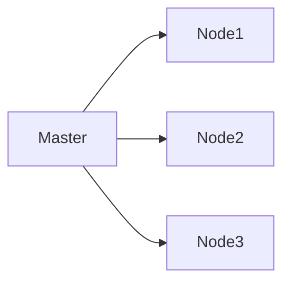
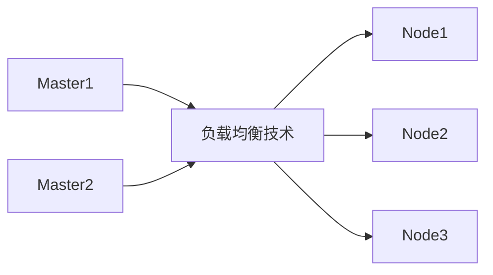

[TOC]
# 基本概念

**Kubernetes 容器集群管理系统**（常简称为K8s）是一个开源的容器编排平台，最初由 Google 开发，现已成为 Cloud Native Computing Foundation（CNCF）的一部分。Kubernetes旨在简化容器化应用程序的部署、扩展和管理，提供了丰富的功能和工具来帮助用户构建可靠、高效的容器化环境。

以下是Kubernetes的一些关键特点和核心概念：

1. **容器编排**：Kubernetes提供了强大的容器编排功能，可以自动化地部署、扩展和管理容器化应用程序。用户可以定义应用程序的期望状态，Kubernetes会根据这些定义自动调整系统状态以保持一致。
2. **集群管理**：Kubernetes支持多个节点的集群管理，用户可以轻松地在不同的物理机或虚拟机上部署容器，并统一管理这些容器。Kubernetes提供了节点管理、负载均衡、存储管理等功能，帮助用户构建高可用、高性能的集群环境。
3. **自动化扩展**：Kubernetes可以根据应用程序的负载情况自动扩展或缩减容器实例数量，以确保系统资源的最优利用和应用程序的高可用性。
4. **服务发现和负载均衡**：Kubernetes提供了内置的服务发现和负载均衡功能，可以帮助应用程序实现动态服务发现和负载均衡，确保应用程序的稳定性和可靠性。
5. **存储管理**：Kubernetes支持多种存储类型，包括持久卷（Persistent Volumes）和持久卷声明（Persistent Volume Claims），可以帮助用户管理应用程序的持久化存储需求。
6. **安全性**：Kubernetes提供了丰富的安全功能，包括身份认证、访问控制、网络策略等，可以帮助用户保护容器化应用程序的安全性。

kubernetes，简称K8s，是用8 代替8 个字符“ubernete”而成的缩写。是一个开源的，用于管理云平台中多个主机上的容器化的应用，Kubernetes 的目标是让部署容器化的应用简单并且高效（powerful）,Kubernetes 提供了应用部署，规划，更新，维护的一种机制。

传统的应用部署方式是通过插件或脚本来安装应用。这样做的缺点是应用的运行、配置、管理、所有生存周期将与当前操作系统绑定，这样做并不利于应用的升级更新/回滚等操作，当然也可以通过创建虚拟机的方式来实现某些功能，但是虚拟机非常重，并不利于可移植性。

新的方式是**通过部署容器方式**实现，每个容器之间互相隔离，每个容器有自己的文件系统，容器之间进程不会相互影响，能区分计算资源。相对于虚拟机，容器能快速部署，由于容器与底层设施、机器文件系统解耦的，所以它能在不同云、不同版本操作系统间进行迁移。

容器占用资源少、部署快，每个应用可以被打包成一个容器镜像，每个应用与容器间成一对一关系也使容器有更大优势，使用容器可以在build 或release 的阶段，为应用创建容器镜像，因为每个应用不需要与其余的应用堆栈组合，也不依赖于生产环境基础结构，这使得从研发到测试、生产能提供一致环境。类似地，容器比虚拟机轻量、更“透明”，这更便于监控和管理。

在Kubernetes 中，我们可以创建多个容器，每个容器里面运行一个应用实例，然后通过内置的负载均衡策略，实现对这一组应用实例的管理、发现、访问，而这些细节都不需要运维人员去进行复杂的手工配置和处理。

1. **自动装箱：**基于容器对应用运行环境的资源配置要求**自动部署应用容器**
2. **自我修复：**当容器失败时，会对容器进行重启。当所部署的 Node 节点有问题时，会对容器进行重新部署和重新调度。当容器未通过监控检查时，会关闭此容器**直到容器正常运行时**，才会对外提供服务。
3. **水平扩展：**通过简单的命令、用户 UI 界面或基于 CPU 等资源使用情况，对应用容器进行规模扩大或规模剪裁
4. **服务发现：**用户不需使用额外的服务发现机制，就能够基于 Kubernetes 自身能力实现服务发现和负载均衡
5. **滚动更新：**可以根据应用的变化，对应用容器运行的应用，进行一次性或批量式更新
6. **版本回退：**可以根据应用部署情况，对应用容器运行的应用，进行历史版本即时回退
7. **密钥和配置管理：**在不需要重新构建镜像的情况下，可以部署和更新密钥和应用配置，类似热部署。
8. **存储编排：**自动实现存储系统挂载及应用，特别对有状态应用实现数据持久化非常重要，存储系统可以来自于本地目录、网络存储(NFS、Gluster、Ceph 等)、公共云存储服务
9. **批处理：**提供一次性任务，定时任务；满足批量数据处理和分析的场景

## 集群架构


在 Kubernetes 中，节点（Node）是集群中的工作节点，用于运行应用程序的容器。每个节点都有自己的资源（如CPU、内存、存储）和网络，负责接收和执行由控制平面（Control Plane）下发的任务。以下是 Kubernetes 中常见的节点类型及其作用：

1. **主节点（Master Node）**：
   - 主节点是 Kubernetes 集群的控制平面，负责管理集群的状态、调度应用程序、监控集群健康状态等任务。
   - 主节点通常包含以下组件：
     - **kube-apiserver**：提供 Kubernetes API 服务，接收和处理用户请求。
     - **kube-controller-manager**：运行控制器，负责集群中的各种控制逻辑，如副本控制器、节点控制器等。
     - **kube-scheduler**：负责调度应用程序到适合的节点上运行。
     - **etcd**：分布式键值存储，用于保存集群的状态信息。
  
2. **工作节点（Worker Node）**：
   - 工作节点是运行容器化应用程序的节点，负责执行实际的工作负载。
   - 工作节点通常包含以下组件：
     - **kubelet**：负责与主节点通信，接收并执行由主节点下发的任务。
     - **kube-proxy**：负责维护节点上的网络规则，实现服务发现和负载均衡。
     - **Container Runtime**：负责运行容器的软件，如 Docker、containerd 等。
  
3. **辅助节点（Supplementary Node）**：
   - 辅助节点是一种特殊类型的节点，用于扩展集群的功能，而不承担运行工作负载的任务。
   - 辅助节点通常包含一些附加的组件或服务，如日志收集器、监控代理、存储插件等。

4. **自注册节点（Self-Registering Node）**：
   - 自注册节点是一种自动加入集群的节点类型，无需手动配置或管理。
   - Kubernetes 支持自动发现和注册新的工作节点，使得集群的扩展和缩减更加灵活和自动化。

### Master Node

#### kube-apiserver

kube-apiserver 是 Kubernetes 集群中的一个核心组件，可理解为集群的统一入口，它提供了 Kubernetes API 的服务端实现，负责处理来自用户、其他组件和外部系统的请求。**kube-apiserver 支持 RESTful 风格的请求方式，用户可以通过发送 HTTP 请求来与 Kubernetes 集群进行交互。**

通过 RESTful API，用户可以执行各种操作，如创建、删除、更新资源对象（如 Pod、Service、Deployment 等）、查询集群状态、查看日志、扩展集群功能等。RESTful API 的设计使得 Kubernetes 的管理操作变得简单、统一且易于扩展。

一般来说，用户可以使用工具如 kubectl（Kubernetes 命令行工具）或客户端库来发送 RESTful 请求到 kube-apiserver，以执行各种管理操作。例如，通过发送 GET 请求可以获取集群中的资源对象信息，通过发送 POST 请求可以创建新的资源对象，通过发送 DELETE 请求可以删除资源对象，以此类推。

#### kube-controller-manager

kube-controller-manager 是 Kubernetes 集群中的一个核心组件，它是运行在主节点（Master Node）上的控制器管理器，负责运行一系列控制器（controllers）来监控集群状态并确保集群中的各种资源处于期望的状态。kube-controller-manager 包含了多个控制器，每个控制器负责不同的功能，如副本控制器、节点控制器、服务控制器等。

以下是 kube-controller-manager 中一些常见的控制器及其作用：

1. **副本控制器（Replication Controller）**：
   - 负责确保应用程序的副本数量符合用户定义的期望状态。如果有副本数量不足或过多，副本控制器会自动调整副本数量，保持应用程序的稳定性和可用性。
2. **节点控制器（Node Controller）**：
   - 负责监控集群中节点的状态，如节点的健康状态、连接状态等。节点控制器会处理节点的故障、离线等情况，确保集群中的节点状态正确。
3. **服务控制器（Service Controller）**：
   - 负责监控和管理 Kubernetes 中的服务对象。服务控制器会根据服务定义自动创建、更新、删除对应的负载均衡规则，确保服务的可用性和负载均衡。
4. **端点控制器（Endpoints Controller）**：
   - 负责将服务与后端 Pod 的 IP 地址关联起来，确保服务能够正确路由流量到对应的后端 Pod。

除了上述控制器之外，kube-controller-manager 还包含其他一些控制器，如命名空间控制器、资源配额控制器等，每个控制器都扮演着关键的角色，确保集群中的各种资源对象处于正确的状态，保证集群的稳定性和可靠性。

#### kube-scheduler

kube-scheduler 是 Kubernetes 集群中的一个核心组件，它是运行在主节点（Master Node）上的调度器，**负责根据预定义的调度策略（Scheduling Policies）将新创建的 Pod 分配到合适的工作节点（Worker Node）上运行**。kube-scheduler 在创建新的 Pod 时，会考虑诸多因素，如资源需求、硬件约束、亲和性和反亲和性规则等，以确保最佳地利用集群资源并提高整体性能。
以下是 kube-scheduler 的主要功能和工作原理：
1. **调度算法**：
   - kube-scheduler 使用一种称为调度算法（Scheduling Algorithm）的机制来选择最适合的工作节点来运行新的 Pod。调度算法会考虑多种因素，如节点资源利用率、Pod 的资源需求、节点亲和性和反亲和性规则等，以决定最佳的节点分配方案。
2. **调度策略**：
   - kube-scheduler 支持用户定义和配置调度策略，以满足不同场景下的需求。用户可以通过标签选择器（Label Selectors）、亲和性规则（Affinity Rules）、污点（Taints）等方式来定义 Pod 的调度约束和偏好。
3. **调度过程**：
   - 当用户创建一个新的 Pod 时，kube-scheduler 会监听到这个事件，并根据 Pod 的调度需求和集群状态来进行调度决策。它会评估每个工作节点的可用资源、负载情况等信息，选择最适合的节点来运行该 Pod。
4. **调度事件**：
   - kube-scheduler 会生成调度事件（Scheduling Events），记录每个 Pod 的调度过程和结果。这些事件可以帮助用户了解调度决策的原因，排查调度问题和优化调度性能。

### Worker Node

#### kubelet

kubelet 是 Kubernetes 集群中的一个核心组件，它是运行在每个工作节点（Worker Node）上的代理，负责管理节点上的容器和 Pod，与 Kubernetes Master 节点上的 API Server 交互，确保节点上的容器按照用户定义的期望状态运行。kubelet 负责监控节点上的资源使用情况、接收来自控制平面的指令、拉取容器镜像、启动、停止和管理容器等。
以下是 kubelet 的一些主要功能和工作原理：
1. **Pod 生命周期管理**：
   - kubelet 负责管理节点上的 Pod 的生命周期，包括创建、启动、停止、重启和销毁 Pod。它会定期检查 API Server 中的 Pod 配置信息，根据配置信息来维护节点上的 Pod 状态。
2. **容器运行时管理**：
   - kubelet 通过容器运行时接口（如 Docker、containerd、CRI-O 等）来管理节点上的容器。它会与容器运行时进行交互，拉取容器镜像、启动容器、监控容器状态等。
3. **资源管理**：
   - kubelet 负责监控节点上的资源使用情况，包括 CPU、内存、磁盘等资源的利用率。它会根据 Pod 的资源请求和节点的实际资源情况来调度和管理容器，确保节点资源的合理分配。
4. **健康检查**：
   - kubelet 定期对节点上的容器和 Pod 进行健康检查，确保它们处于正常运行状态。如果发现容器或 Pod 出现问题，kubelet 会尝试重启容器或上报问题给控制平面。
5. **日志和指标收集**：
   - kubelet 负责收集节点上容器的日志和指标信息，并将这些信息发送到集中的日志和监控系统中，帮助管理员监控和诊断容器的运行状态。

#### kube-proxy

kube-proxy 是 Kubernetes 集群中的一个核心组件，**它负责实现 Kubernetes 集群内部的服务发现和负载均衡功能。**kube-proxy 在每个工作节点（Worker Node）上运行，通过维护节点上的网络规则来实现服务代理和负载均衡，确保集群内部的服务能够被正确路由和访问。

以下是 kube-proxy 的一些主要功能和工作原理：

1. **服务代理**：
   - kube-proxy 负责为 Kubernetes 集群中的 Service 对象创建代理规则，将 Service 的虚拟 IP（Cluster IP）映射到后端 Pod 的实际 IP 地址和端口。这样，通过访问 Service 的虚拟 IP，请求会被 kube-proxy 路由到对应的后端 Pod 上。
2. **负载均衡**：
   - kube-proxy 支持多种负载均衡模式，包括轮询（Round Robin）、IP 负载均衡（IPVS）等。它会根据 Service 的负载均衡策略和后端 Pod 的健康状态来动态调整流量的分发，确保请求能够均匀分配到各个后端 Pod 上。
3. **网络规则管理**：
   - kube-proxy 维护节点上的网络规则，包括 iptables 规则、IPVS 规则等，用于实现服务代理和负载均衡功能。它会监听 Kubernetes API Server 中 Service 和 Endpoint 的变化，动态更新网络规则以反映最新的服务配置。
4. **节点间通信**：
   - kube-proxy 还负责处理节点间的通信流量，确保集群内部的 Pod 和 Service 能够互相访问。它会为集群内部的通信流量创建路由规则，实现节点间的网络通信。
5. **高可用性**：
   - kube-proxy 支持多个 kube-proxy 实例之间的负载均衡和故障转移，确保即使某个 kube-proxy 实例发生故障，服务发现和负载均衡功能仍然能够正常运行。

## 核心概念

### pod

在 Kubernetes（k8s）中，Pod 是**最小的部署单元**，它是 Kubernetes 集群中可以被调度和管理的基本单位。Pod 可以包含一个或多个紧密相关的容器，这些容器共享相同的网络命名空间、存储卷和其他资源，并在同一个节点上运行。

以下是关于 Kubernetes 中的 Pod 的一些详细介绍：

1. **容器组合**：
   - Pod **可以包含一个或多个容器**，这些容器共享同一个网络命名空间和存储卷。这意味着它们可以方便地共享数据和通信，实现紧密耦合的服务组合。
2. **共享资源**：
   - **Pod 中的容器共享一些资源，如 IP 地址、端口空间和存储卷。**这使得它们可以方便地相互通信和共享数据，而无需额外的配置。
3. **生命周期管理**：
   - Pod 是一个可以创建、启动、停止和销毁的单元。Kubernetes 控制器可以管理 Pod 的生命周期，确保 Pod 按照用户的期望状态运行。
4. **调度和部署**：
   - Kubernetes Scheduler 负责将 Pod 调度到集群中的节点上，根据节点的资源情况和 Pod 的调度要求来选择合适的节点。Pod 可以根据用户定义的调度策略来实现灵活的部署。
5. **网络和存储**：
   - Pod 中的容器共享同一个网络命名空间，它们可以通过 localhost 进行通信。此外，Pod 可以挂载共享的存储卷，用于数据的持久化和共享。
6. **健康检查**：
   - Kubernetes 可以对 Pod 中的容器进行健康检查，确保容器处于正常运行状态。如果容器出现问题，Kubernetes 可以根据健康检查结果自动重启容器。
7. **扩展性**：
   - Pod 是 Kubernetes 中的扩展性单元，用户可以根据需要创建多个 Pod 实例，实现水平扩展和负载均衡。

### service

在 Kubernetes（k8s）中，Service 是一种抽象的概念，**用于定义一组 Pod 的访问方式和网络策略**。Service 提供了一种稳定的网络终结点，允许客户端通过 Service 访问一组具有相同标签的 Pod，而无需关心 Pod 的具体 IP 地址和端口信息。下面是关于 Kubernetes 中 Service 的详细介绍：
1. **负载均衡**：
   - Service 可以为一组具有相同标签的 Pod 提供负载均衡的访问方式。当客户端通过 Service 访问这组 Pod 时，Service 会自动将请求分发到不同的 Pod 实例，实现负载均衡。
2. **稳定的网络终结点**：
   - Service 提供了一个稳定的网络终结点，客户端可以通过 Service 的 Cluster IP 或者 Service Name 来访问后端 Pod，而不需要知道具体的 Pod IP 地址和端口信息。
3. **服务发现**：
   - Service 提供了一种服务发现机制，允许客户端动态地发现和访问运行中的服务。当 Pod 动态创建或销毁时，Service 会自动更新后端 Pod 的列表，确保客户端能够访问到最新的 Pod。
4. **多种类型**：
   - Kubernetes 中有多种类型的 Service，如 ClusterIP、NodePort、LoadBalancer、ExternalName 等，每种类型的 Service 提供不同的访问方式和网络策略，满足不同场景下的需求。
5. **端口转发**：
   - Service 可以通过端口转发将外部流量转发到后端 Pod，实现外部客户端与后端服务的通信。例如，NodePort Service 可以将外部流量转发到集群节点上指定的端口，然后再转发到后端 Pod。
6. **健康检查**：
   - Service 可以配置健康检查，定期检测后端 Pod 的健康状态。如果某个 Pod 不健康，Service 将不再将流量转发给该 Pod，确保服务的稳定性。
7. **内部通信**：
   - Service 不仅可以用于外部客户端访问，还可以用于内部服务之间的通信。通过 Service，不同的服务可以通过 Service Name 来相互访问，实现服务之间的解耦。

### controller

参考 kube-controller-manager

# Kubernetes 集群搭建

单 Master 集群结构



风险 Master 节点唯一，Master 节点宕机导致集群不可用

多 Master 集群结构




## 硬件要求

**操作系统**

CentOS7.x-86_x64

集群中所有机器之间网络互通

可以访问外网，需要拉取镜像

禁止 swap 分区

**测试环境**

Master 节点 ： CPU 2 核+ 内存 20GB+
Node 节点 ： CPU 4 核+ 内存 40GB+

**生产环境**

Master 节点 ： CPU 8 核+ 内存 100GB+
Node 节点 ： CPU 16 核+ 内存 500GB+

## 搭建方式

目前生产部署 Kubernetes 集群主要有两种方式：

1. kubeadm 

Kubeadm 是一个K8s 部署工具，提供kubeadm init 和kubeadm join，用于快速部署Kubernetes 集群。
官方地址：https://kubernetes.io/docs/reference/setup-tools/kubeadm/kubeadm/

2. 二进制包

从 github 下载发行版的二进制包，手动部署每个组件，组成 Kubernetes 集群。

Kubeadm 降低部署门槛，但屏蔽了很多细节，遇到问题很难排查。如果想更容易可控，推荐使用二进制包部署Kubernetes 集群，虽然手动部署麻烦点，期间可以学习很多工作原理，也利于后期维护。

## 单 Master 集群搭建

### kubeadm 方式

kubeadm是官方社区推出的一个用于快速部署 kubernetes 集群的工具。

这个工具能通过两条指令完成一个 kubernetes 集群的部署：

```
#### 创建一个 Master 节点
$ kubeadm init

#### 将一个 Node 节点加入到当前集群中
$ kubeadm join <Master节点的IP和端口 >
```

#### 1. 安装要求

在开始之前，部署Kubernetes集群机器需要满足以下几个条件：

- 一台或多台机器，操作系统 CentOS7.x-86_x64
- 硬件配置：2GB或更多RAM，2个CPU或更多CPU，硬盘30GB或更多
- 可以访问外网，需要拉取镜像，如果服务器不能上网，需要提前下载镜像并导入节点
- 禁止swap分区

#### 2. 准备环境

| 角色   | IP           |
| ------ | ------------ |
| master | 192.168.1.11 |
| node1  | 192.168.1.12 |
| node2  | 192.168.1.13 |

```shell
#### 安装 wget
sudo yum install wget

#### 关闭防火墙
systemctl stop firewalld
systemctl disable firewalld

#### 关闭selinux
sed -i 's/enforcing/disabled/' /etc/selinux/config  # 永久
setenforce 0  # 临时

#### 关闭swap
swapoff -a  # 临时
sed -ri 's/.*swap.*/#&/' /etc/fstab    # 永久

#### 根据规划设置主机名
hostnamectl set-hostname <hostname> # k8smaster / k8snode1 / k8snode2

#### 在master添加hosts
cat >> /etc/hosts << EOF
192.168.136.139 master
192.168.136.140 node1
192.168.136.141 node2
EOF

#### 将桥接的IPv4流量传递到iptables的链
cat > /etc/sysctl.d/k8s.conf << EOF
net.bridge.bridge-nf-call-ip6tables = 1
net.bridge.bridge-nf-call-iptables = 1
EOF
sysctl --system  # 生效

#### 时间同步
yum install ntpdate -y
ntpdate time.windows.com
```

#### 3. 所有节点安装Docker/kubeadm/kubelet

Kubernetes 默认 CRI（容器运行时）为 Docker，因此先安装 Docker。

##### 3.1 安装Docker

```shell
$ wget https://mirrors.aliyun.com/docker-ce/linux/centos/docker-ce.repo -O /etc/yum.repos.d/docker-ce.repo
$ yum -y install docker-ce-18.06.1.ce-3.el7
$ systemctl enable docker && systemctl start docker
$ docker --version
Docker version 18.06.1-ce, build e68fc7a
```

```shell
$ cat > /etc/docker/daemon.json << EOF
{
  "registry-mirrors": ["https://b9pmyelo.mirror.aliyuncs.com"]
}
EOF
```

```shell
#### 重启 docker
systemctl restart docker
```

##### 3.2 添加阿里云YUM软件源

```shell
$ cat > /etc/yum.repos.d/kubernetes.repo << EOF
[kubernetes]
name=Kubernetes
baseurl=https://mirrors.aliyun.com/kubernetes/yum/repos/kubernetes-el7-x86_64
enabled=1
gpgcheck=0
repo_gpgcheck=0
gpgkey=https://mirrors.aliyun.com/kubernetes/yum/doc/yum-key.gpg https://mirrors.aliyun.com/kubernetes/yum/doc/rpm-package-key.gpg
EOF
```

##### 3.3 安装kubeadm，kubelet和kubectl

由于版本更新频繁，这里指定版本号部署：

```shell
$ yum install -y kubelet-1.18.0 kubeadm-1.18.0 kubectl-1.18.0
$ systemctl enable kubelet # 开机启动
```

#### 4. 部署Kubernetes Master

在192.168.31.61（Master）执行。

```shell
$ kubeadm init \
  --apiserver-advertise-address=192.168.44.146 \ # 本机 IP
  --image-repository registry.aliyuncs.com/google_containers \ # 指定阿里云镜像仓库地址
  --kubernetes-version v1.18.0 \
  --service-cidr=10.96.0.0/12 \
  --pod-network-cidr=10.244.0.0/16
```

由于默认拉取镜像地址k8s.gcr.io国内无法访问，这里指定阿里云镜像仓库地址。

下面两步按照提示操作

**提示一：**使用kubectl工具：

```bash
mkdir -p $HOME/.kube
sudo cp -i /etc/kubernetes/admin.conf $HOME/.kube/config
sudo chown $(id -u):$(id -g) $HOME/.kube/config
$ kubectl get nodes
```

#### 5. 加入Kubernetes Node

在192.168.1.12/13（Node）执行。

**提示二：**向集群添加新节点，执行在kubeadm init输出的kubeadm join命令：

```bash
$ kubeadm join 192.168.1.11:6443 --token esce21.q6hetwm8si29qxwn \
    --discovery-token-ca-cert-hash sha256:00603a05805807501d7181c3d60b478788408cfe6cedefedb1f97569708be9c5
```

默认token有效期为24小时，当过期之后，该token就不可用了。这时就需要重新创建token，操作如下：

```
kubeadm token create --print-join-command
```

此时集群状态

```
NAME     STATUS     ROLES    AGE     VERSION
master   NotReady   master   4m31s   v1.18.0
node1    NotReady   <none>   112s    v1.18.0
node2    NotReady   <none>   29s     v1.18.0
```

#### 6. 部署CNI网络插件

下载至本地插件（忽略该步骤）

```
wget https://raw.githubusercontent.com/coreos/flannel/master/Documentation/kube-flannel.yml
```

master 执行 

默认镜像地址无法访问，sed命令修改为docker hub镜像仓库。

```bash
## 部署插件 中间可能由于网络原因失败，多试几次，若无法访问，可下载到本地 kubectl apply -f 本地路径安装
kubectl apply -f https://raw.githubusercontent.com/coreos/flannel/master/Documentation/kube-flannel.yml
## 查看集群状态，启动很慢多等一会
kubectl get pods -n kube-system

NAME                          READY   STATUS    RESTARTS   AGE
kube-flannel-ds-amd64-2pc95   1/1     Running   0          72s
```

```
[root@master ~]# kubectl get pods -n kube-system
NAME                             READY   STATUS    RESTARTS   AGE
coredns-7ff77c879f-bqhf8         1/1     Running   0          34m
coredns-7ff77c879f-nl64l         1/1     Running   0          34m
etcd-master                      1/1     Running   0          35m
kube-apiserver-master            1/1     Running   0          35m
kube-controller-manager-master   1/1     Running   3          35m
kube-proxy-jg76l                 1/1     Running   0          34m
kube-proxy-wkhcf                 1/1     Running   0          32m
kube-proxy-x98w6                 1/1     Running   0          31m
kube-scheduler-master            1/1     Running   2          35m

[root@master ~]# kubectl get nodes
NAME     STATUS   ROLES    AGE   VERSION
master   Ready    master   35m   v1.18.0
node1    Ready    <none>   32m   v1.18.0
node2    Ready    <none>   31m   v1.18.0
```

#### 7. 测试kubernetes集群

在Kubernetes集群中创建一个pod，验证是否正常运行：

```
$ kubectl create deployment nginx --image=nginx
$ kubectl expose deployment nginx --port=80 --type=NodePort
$ kubectl get pod,svc
```

访问地址：http://NodeIP:Port  

集群完成

# kubectl

kubectl 是 Kubernetes 的命令行工具，用于与运行中的 Kubernetes 集群进行交互。通过 kubectl，用户可以执行各种操作，如创建、管理、监视和调试 Kubernetes 资源。

kubectl 的基本语法如下：

```bash
kubectl [command] [TYPE] [NAME] [flags]
```

- `command`：表示要执行的操作命令，例如 apply、get、describe、delete 等。
- `TYPE`：表示 Kubernetes 资源的类型，如 Pod、Service、Deployment、ConfigMap 等。
- `NAME`：表示资源的名称，用于指定具体的资源对象。
- `flags`：表示命令的选项和参数，用于控制命令的行为。

一些常用的 kubectl 命令包括：
- `kubectl get`：用于获取资源的信息。
- `kubectl describe`：用于显示资源的详细信息。
- `kubectl apply`：用于应用配置文件。
- `kubectl create`：用于创建资源。
- `kubectl delete`：用于删除资源。
- `kubectl exec`：用于在容器内执行命令。
- `kubectl logs`：用于查看 Pod 的日志。
- `kubectl port-forward`：用于端口转发。

除了以上列出的命令，kubectl 还有许多其他功能和子命令，可以通过 `kubectl --help` 查看完整的命令列表和帮助信息。

示例：

1. **获取资源列表**：
```bash
kubectl get pods
kubectl get services
kubectl get deployments
```

2. **查看资源详细信息**：
```bash
kubectl describe pod <pod-name>
kubectl describe service <service-name>
kubectl describe deployment <deployment-name>
```

3. **应用配置文件**：
```bash
kubectl apply -f pod.yaml
kubectl apply -f deployment.yaml
kubectl apply -f service.yaml
```

4. **删除资源**：
```bash
kubectl delete pod <pod-name>
kubectl delete service <service-name>
kubectl delete deployment <deployment-name>
```

5. **在 Pod 内执行命令**：
```bash
kubectl exec -it <pod-name> -- /bin/bash
kubectl exec -it <pod-name> -- ls
```

6. **查看 Pod 日志**：
```bash
kubectl logs <pod-name>
```

7. **端口转发**：
```bash
kubectl port-forward <pod-name> 8080:80
```

# kubernetes 集群 YAML 文件

K8s 集群中对资源管理和资源对象编排部署都可以通过声明样式（YAML）文件来解决，也就是可以把需要对资源对象操作编辑到 YAML 格式文件中，我们把这种文件叫做**资源清单文件**，通过 kubectl 命令直接使用资源清单文件就可以实现对大量的资源对象进行编排部署了。

## YAML 文件格式

1. **基本规则**：
   - YAML 使用缩进来表示数据之间的层级关系，一般使用空格来缩进，不同层级之间的缩进量必须一致。
   - 注释以 `#` 开头，直到行末的内容为注释，注释会被忽略。
   - 大小写敏感。
2. **数据结构**：
   - **键值对**：使用冒号 `:` 将键和值分隔，如 `key: value`。
   - **列表**：使用 `-` 加空格表示列表项，如 `- item1`。
   - **嵌套结构**：可以嵌套字典和列表，通过缩进来表示层级关系。
3. **字符串**：
   - **普通字符串**：不需要引号，如 `key: value`。
   - **单引号字符串**：使用单引号 `'` 包裹，如 `key: 'value'`。
   - **双引号字符串**：使用双引号 `"` 包裹，支持转义字符，如 `key: "value"`。
4. **字典**：
   - 使用键值对的形式表示，如：
     ```yaml
     key1: value1
     key2: value2
     ```
5. **列表**：
   - 使用 `-` 加空格表示列表项，如：
     ```yaml
     - item1
     - item2
     ```
6. **多行字符串**：
   - 使用 `|` 符号表示保留换行符，如：
     ```yaml
     key: |
       This is a
       multiline
       string
     ```
7. **引用**：
   - 可以使用 `&` 定义锚点（Anchor）和 `*` 引用锚点，实现数据的引用和重用。
8. **特殊值**：
   - **布尔值**：`true` 和 `false`。
   - **空值**：`null` 或 `~`。

## YAML 文件的组成部分

Kubernetes 集群中的 YAML 文件通常包含以下几个重要的组成部分：

1. **API 版本（apiVersion）**：指定 YAML 文件中所定义资源对象的 API 版本。不同类型的资源对象可能有不同的 API 版本，如 `v1`, `apps/v1`, `extensions/v1beta1` 等。
2. **资源类型（kind）**：定义了该 YAML 文件中所描述的资源对象的类型，如 Pod、Service、Deployment 等。
3. **元数据（metadata）**：包含了资源对象的元数据信息，如名称（name）、命名空间（namespace）、标签（labels）等。
4. **规格（spec）**：规定了资源对象的规格和配置信息，包括容器镜像、端口、挂载卷等具体的配置。
5. **状态（status）**：状态部分通常由 Kubernetes 自动填充，用于描述资源对象的当前状态信息。
一个典型的 Kubernetes YAML 文件示例如下：
```yaml
apiVersion: v1
kind: Pod
metadata:
  name: my-pod
  labels:
    app: my-app
spec:
  containers:
  - name: my-container
    image: nginx:latest
    ports:
    - containerPort: 80
```
在这个示例中：
1. **apiVersion**：
   - 描述了使用的 Kubernetes API 的版本。在这个例子中，使用的是 v1 版本的 API。

2. **kind**：
   - 指定了要创建的 Kubernetes 资源的类型。在这个例子中，kind 是 Pod，表示要创建一个 Pod 对象。

3. **metadata**：
   - 包含了关于资源的元数据，如名称、标签等。

   - **name**：指定了这个 Pod 的名称，这里是 "my-pod"。
   
   - **labels**：为 Pod 添加了标签，用于标识和选择 Pod。

4. **spec**：
   - 描述了 Pod 中容器的规格（specification）。

   - **containers**：这是一个包含容器配置的列表。

     - **name**：容器的名称，这里是 "my-container"。
     
     - **image**：要使用的容器镜像，这里是 "nginx:latest"，表示使用最新版本的 Nginx 镜像。

     - **ports**：描述容器需要暴露的端口。

       - **containerPort**：容器内部应用程序监听的端口号，这里是 80。

这个 YAML 文件定义了一个简单的 Pod，其中运行一个名为 "my-container" 的容器，使用 Nginx 最新版本镜像，容器内部监听端口 80。

示例：

以下是一个示例的完整的 Kubernetes 集群中的 YAML 文件，包含了 Deployment、Service 和 ConfigMap 的配置，并说明了每个配置项的作用：

```yaml
# Deployment 配置
apiVersion: apps/v1
kind: Deployment
metadata:
  name: my-deployment
spec:
  replicas: 3
  selector:
    matchLabels:
      app: my-app
  template:
    metadata:
      labels:
        app: my-app
    spec:
      containers:
      - name: my-container
        image: nginx:latest
        ports:
        - containerPort: 80
--- # --- 代表一个新的 ymal 文件的开始
# Service 配置
apiVersion: v1
kind: Service
metadata:
  name: my-service
spec:
  selector:
    app: my-app
  ports:
    - protocol: TCP
      port: 80
      targetPort: 80
  type: ClusterIP
---
# ConfigMap 配置
apiVersion: v1
kind: ConfigMap
metadata:
  name: my-configmap
data:
  config: |
    key1: value1
    key2: value2
```
每个配置项的作用说明如下：
1. **Deployment 配置**：
   - `apiVersion`: 指定资源对象的 API 版本。
   - `kind`: 指定资源对象的类型为 Deployment。
   - `metadata`: 定义资源对象的元数据，包括名称等。
   - `spec.replicas`: 指定需要创建的 Pod 实例数量。
   - `spec.selector`: 定义用于标识 Pod 的标签选择器。
   - `spec.template`: 定义创建 Pod 的模板，包括容器等。
2. **Service 配置**：
   - `apiVersion`: 指定资源对象的 API 版本。
   - `kind`: 指定资源对象的类型为 Service。
   - `metadata`: 定义资源对象的元数据，包括名称等。
   - `spec.selector`: 指定 Service 所关联的 Pod 的标签选择器。
   - `spec.ports`: 定义 Service 的端口映射。
   - `spec.type`: 指定 Service 的类型，如 ClusterIP、NodePort 等。
3. **ConfigMap 配置**：
   - `apiVersion`: 指定资源对象的 API 版本。
   - `kind`: 指定资源对象的类型为 ConfigMap。
   - `metadata`: 定义资源对象的元数据，包括名称等。
   - `data`: 定义 ConfigMap 的数据内容，可以存储配置信息等。
   以上示例展示了一个完整的 Kubernetes 集群中的 YAML 文件，包含了 Deployment、Service 和 ConfigMap 的配置，并说明了每个配置项的作用。这些配置项共同构成了一个完整的应用部署和服务配置的描述。

## 快速编写 ymal 文件

在实际操作中，纯手写 ymal 文件配置难度较大，一般可以通过其他方式生成 ymal 文件

### kubectl create

`kubectl create` 是 Kubernetes 中一个用于创建资源对象的命令行工具。通过 `kubectl create` 命令，可以在 Kubernetes 集群中创建各种类型的资源对象，如 Pod、Deployment、Service、ConfigMap 等。

**用法**：

```bash
kubectl create -f FILENAME
kubectl create TYPE NAME [flags]
kubectl create clusterrolebinding NAME --clusterrole=cluster-admin --user=USER_ACCOUNT
```

**参数说明**：
- `-f FILENAME`：从指定的 YAML 文件中创建资源对象。
- `TYPE`：要创建的资源对象的类型，如 Pod、Deployment、Service 等。
- `NAME`：要创建的资源对象的名称。
- `--clusterrole=cluster-admin`：指定集群角色绑定的角色。
- `--user=USER_ACCOUNT`：指定集群角色绑定的用户账号。

**示例**：
1. 从 YAML 文件中创建资源对象：
   ```
   kubectl create -f deployment.yaml
   ```
2. 创建一个 Pod：
   ```
   kubectl create pod mypod --image=nginx
   ```
3. 创建一个 Deployment：
   ```
   kubectl create deployment mydeployment --image=nginx
   ```
4. 创建一个 Service：
   ```
   kubectl create service clusterip myservice --tcp=80:80
   ```
5. 创建一个 ConfigMap：
   ```
   kubectl create configmap myconfigmap --from-literal=key1=value1 --from-literal=key2=value2
   ```
6. 创建一个 ClusterRoleBinding：
   ```
   kubectl create clusterrolebinding myclusterrolebinding --clusterrole=cluster-admin --user=myuser
   ```

**使用 kubectl create 生成 ymal 适用于创建资源时使用**

一般来说 kubectl create 命令可以用于创建资源时使用，例如创建一个 nginx 

```bash
kubectl create deployment nginx --image=nginx
```

但也可以指定其不是创建，而是将创建资源的 ymal 文件输出

```bash
kubectl create deployment nginx --image=nginx --dry-run=client -o yaml
```

这个命令的含义是使用 kubectl 创建一个名为 nginx 的 Deployment，使用 nginx 镜像，但是不会真正在集群中创建该 Deployment。参数 --dry-run=client 表示只会在客户端执行预演，并不会实际创建资源对象，而 -o yaml 表示以 YAML 格式输出资源对象的配置内容。

```yml
apiVersion: apps/v1
kind: Deployment
metadata:
  creationTimestamp: null
  labels:
    app: nginx
  name: nginx
spec:
  replicas: 1
  selector:
    matchLabels:
      app: nginx
  strategy: {}
  template:
    metadata:
      creationTimestamp: null
      labels:
        app: nginx
    spec:
      containers:
      - image: nginx
        name: nginx
        resources: {}
status: {}
```

后续即可根据生成的文件进行修改

### kubectl get

`kubectl get` 是 Kubernetes 中一个用于获取资源对象信息的命令行工具。通过 `kubectl get` 命令，可以查看当前 Kubernetes 集群中各种类型的资源对象的信息，如 Pods、Nodes、Services、Deployments 等。下面详细解释 `kubectl get` 命令的用法和参数：

**用法**：
```
kubectl get [resource_type] [resource_name] [flags]
```

**参数说明**：
- `resource_type`：要获取的资源对象的类型，如 Pods、Nodes、Services、Deployments 等。
- `resource_name`：要获取的资源对象的名称，可选参数，如果不指定则会列出该类型的所有资源对象。
- `[flags]`：可选的标志参数，用于控制输出的格式和内容。

**常用示例**：
1. 获取所有 Pods：
   ```
   kubectl get pods
   ```
2. 获取特定 Namespace 中的 Pods：
   ```
   kubectl get pods -n <namespace>
   ```
3. 获取所有 Nodes：
   ```
   kubectl get nodes
   ```
4. 获取 Services：
   ```
   kubectl get services
   ```
5. 获取 Deployments：
   ```
   kubectl get deployments
   ```
6. 获取特定资源对象的详细信息：
   ```
   kubectl get pod <pod_name> -o yaml
   ```

**输出格式控制**：

- `-o wide`：以更宽的格式显示资源对象信息。
- `-o yaml`：以 YAML 格式显示资源对象信息。
- `-o json`：以 JSON 格式显示资源对象信息。

通过 `kubectl get` 命令，可以方便地查看 Kubernetes 集群中各种资源对象的状态、名称、标签等信息，帮助管理员和开发人员了解集群的当前状态，进行故障排查、监控和管理。

使用 kubectl get 生成 ymal 适用于导出已有资源的 ymal 文件

```bash
kubectl get deploy nginx -o yaml
```

# pod

在 Kubernetes 中，**Pod 是最小的部署单元**，用于运行容器化应用程序。

1. **Pod 的定义**：
- Pod 是 Kubernetes 中可以创建和管理的**最小资源对象模型**。
- **一个 Pod 可以包含一个或多个紧密相关的容器**，**它们共享网络和存储空间**，运行在同一个节点上。
- Pod 中的容器共享同一个网络命名空间和 IP 地址，**可以通过 localhost 互相通信**。

2. **Pod 的特点**：
- **最小调度单元**：Kubernetes 将 Pod 视为最小的调度单元，决定 Pod 在哪个节点上运行。
- **生命周期**：**Pod 是短暂的**，可以被创建、删除、重启或者替换。
- **独立性**：Pod 中的容器共享相同的资源，但是它们是独立运行的，可以有不同的生命周期。
- **共享存储和网络**：Pod 中的容器共享存储卷和网络命名空间，方便容器之间的通信和数据共享。

3. **Pod 的组成**：
- **容器**：Pod 中可以包含一个或多个容器，这些容器共享网络和存储。
- **存储卷**：Pod 可以包含存储卷，用于持久化数据或者共享数据。
- **元数据**：Pod 包含一些元数据，如名称、命名空间、标签等，用于管理和识别 Pod。

4. **Pod 的生命周期**：
- **创建**：通过 Deployment、ReplicaSet 或者直接创建 Pod 来创建 Pod 对象。
- **运行**：Pod 中的容器开始运行，并执行其定义的任务。
- **重启**：Pod 可以手动或者由控制器触发重启。
- **删除**：Pod 可以手动删除或者由控制器管理的删除。

5. **Pod 的用途**：
- 运行单个容器应用程序。
- 运行多个紧密相关的容器，共享资源。
- 提供一个抽象层，使得应用程序可以独立于底层基础设施运行。


## 为什么要引入 pod

为什么要引入pod的概念，而不是直接使用容器（docker）作为最小单元

### pod 是多进程设计，docker 是单进程设计

#### 单进程设计

单进程设计是指在一个系统或应用程序中，每个实例只运行一个主要的进程。这个主要的进程通常是应用程序的核心，负责执行应用程序的主要功能。单进程设计通常用于简化系统结构、提高系统的稳定性和可维护性。

在单进程设计中，整个应用程序的逻辑被组织在一个进程中，其他辅助功能可能通过线程、子进程或外部服务来实现。这种设计方式可以使得应用程序结构清晰简单，易于理解和维护。同时，单进程设计也有助于隔离不同功能模块，避免不同功能之间的相互干扰。

单进程设计通常适用于一些简单的应用程序或服务，特别是那些不需要同时处理大量并发请求或复杂计算的场景。在这种情况下，单个进程能够满足应用程序的需求，并且可以更容易地监控和管理整个应用程序的运行状态。

然而，在某些复杂的应用程序或服务中，可能需要使用多进程或多线程来处理并发请求、提高性能或实现更复杂的功能。在这种情况下，单进程设计可能不够灵活或高效，需要根据具体需求选择合适的设计方式。

对于 Docker 鼓励将每个容器设计为只运行一个主进程的理念，通常指的是在一个容器中只运行一个主要的应用程序进程。这并不意味着一个 Docker 容器只能运行一个镜像，**而是强调在一个容器中应该只有一个主要的进程在运行**，负责应用程序的核心功能。

举例来说，如果你使用 MySQL 数据库作为一个应用程序的后端数据库服务，你可以将 MySQL 数据库作为一个独立的 Docker 镜像运行在一个独立的容器中。这个容器中只运行 MySQL 数据库的主进程，负责数据库服务的运行。这样做符合 Docker 的设计理念，即一个容器只运行一个主要的进程，以保持容器的简洁性和隔离性。

另外，如果你的应用程序需要多个服务组件，例如前端 Web 服务、后端应用程序服务、数据库服务等，你可以将每个服务组件作为一个独立的 Docker 容器运行。每个容器内只运行一个主要的进程，分别负责不同服务的运行。这样可以更好地实现服务之间的隔离、管理和部署。

因此，一个 Docker 容器可以运行一个或多个镜像，但是在一个容器中通常建议只运行一个主要的进程，以符合 Docker 鼓励的容器设计原则。这样可以更好地利用 Docker 的轻量级、隔离性和易管理性，提高应用程序的部署效率和运行稳定性。

#### 多进程设计

- Pod 是 Kubernetes 中最小的部署单元，可以包含一个或多个容器。**Pod 中的容器共享网络命名空间和存储卷**，它们可以在同一个 Pod 中共同协作、相互通信。
- Pod 中的多个容器可以被看作是多个进程的集合，这些进程可以共享同一个网络环境和文件系统，它们可以相互协作、共享资源。这种设计可以更好地支持复杂应用组件之间的交互和协同工作。
- Pod 中的容器可以共享同一个网络命名空间和存储卷，它们可以通过 localhost 相互通信，共享数据。这种设计可以简化容器之间的通信和数据共享。

### 亲密性应用

Pod 的存在为了支持部署亲密性应用，即那些需要在同一主机上共享资源、网络和存储的应用程序。这种部署方式可以使相关的应用程序能够更紧密地协作、通信和共享资源，提高应用程序之间的亲密性和协同工作效率。

举例来说明，假设有一个 Web 应用程序，它由一个前端容器和一个后端容器组成，前端容器负责处理用户请求和展示界面，后端容器负责处理业务逻辑和数据存储。这两个容器之间需要频繁通信和共享数据，为了实现它们之间的亲密性，可以将它们打包在同一个 Pod 中。

在这个示例中，将前端容器和后端容器放在同一个 Pod 中，它们可以共享同一个网络命名空间、存储卷和其他资源。这样可以使得前端容器能够直接通过 localhost 访问后端容器，减少网络延迟和通信开销。同时，它们可以共享同一个生命周期，当 Pod 被调度到同一节点上时，它们会一起启动、停止和重启。

另一个例子是一个日志收集器应用程序，它包含一个日志收集器容器和一个存储容器，用于存储收集到的日志数据。这两个容器之间需要实时传输大量数据，并且需要共享存储资源。将它们放在同一个 Pod 中可以提高数据传输效率，减少网络传输成本，并且确保它们之间的数据一致性。

总的来说，Pod 的存在为了支持亲密性应用，使得相关的容器能够更紧密地协作、通信和共享资源。通过将需要紧密协作的容器放在同一个 Pod 中，可以提高应用程序之间的亲密性和协同工作效率，从而更好地支持复杂应用程序的部署和管理。

## 共享网络


## 共享存储


## Pause 容器

Pod 是 Kubernetes 中非常重要的概念，它为容器化应用程序的部署和管理提供了灵活性和便利性，同时也为容器之间的**通信和数据共享**提供了便利。

每一个 Pod 在 Kubernetes 中都有一个特殊的被称为“根容器”的 Pause 容器。这个 Pause 容器在 Pod 中起着重要的作用，它的存在是为了协调和管理 Pod 中的其他容器。

具体来说，Pause 容器是一个非常轻量级的容器，通常使用专门的镜像，比如 `k8s.gcr.io/pause`。它的主要作用包括：

1. **共享网络**：Pause 容器负责创建 Pod 的网络命名空间，并管理 Pod 内容器之间的网络通信。其他容器在创建时会加入这个网络命名空间，从而实现容器之间的网络隔离和通信。
2. **IP 地址共享**：Pause 容器会被分配一个 IP 地址，其他容器会共享这个 IP 地址。这样，即使其他容器被替换或重启，它们仍然可以通过共享的 IP 地址与其他容器通信。
3. **生命周期管理**：Pause 容器的生命周期与 Pod 的生命周期紧密相关。当 Pod 被调度到节点上时，Pause 容器会首先启动，然后其他容器会依次加入到这个共享的网络命名空间中。

因此，Pause 容器可以看作是 Pod 中的“中介者”，负责协调和管理 Pod 中的其他容器，确保它们能够顺利地进行网络通信和协同工作。

