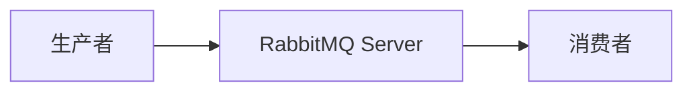
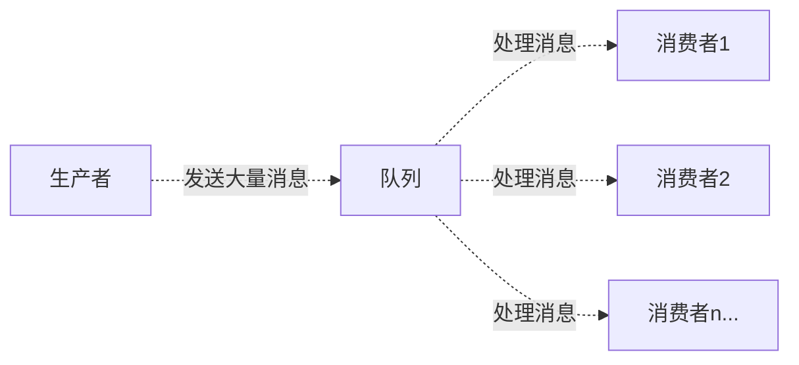
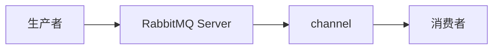
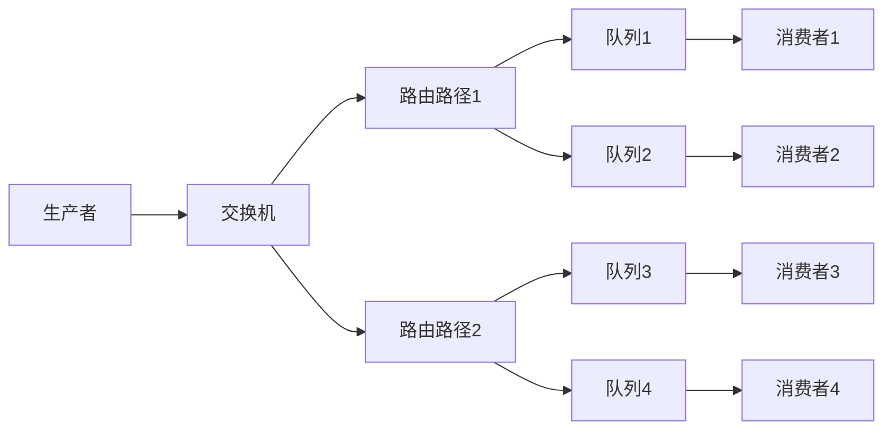
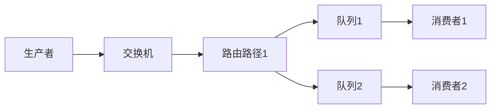

[TOC]

# MQ(message queue)

MQ(message queue), 从字面意思上看, 本质是个队列, FIFO先入先出, 只不过队列中存放的内容是message而已, 还是一种跨进程的通信机制, 用于上下游传递消息。在互联网架构中, MQ是一种非常常见的上下游“逻辑解耦+物理解耦”的消息通信服务。使用了MQ之后, 消息发送上游只需要依赖MQ, 不用依赖其他服务。

# 使用场景

## 流量消峰

举个例子, 如果订单系统最多能处理一万次订单, 这个处理能力应付正常时段的下单时绰绰有余, 正常时段我们下单一秒后就能返回结果。但是在高峰期, 如果有两万次下单操作系统是处理不了的, 只能限制订单超过一万后不允许用户下单。使用消息队列做缓冲, 我们可以取消这个限制, 把一秒内下的订单分散成一段时间来处理, 这时有些用户可能在下单十几秒后才能收到下单成功的操作, 但是比不能下单的体验要好。

## 应用解耦

以电商应用为例, 应用中有订单系统、库存系统、物流系统、支付系统。用户创建订单后, 如果耦合调用库存系统、物流系统、支付系统, 任何一个子系统出了故障, 都会造成下单操作异常。当转变成基于消息队列的方式后, 系统间调用的问题会减少很多, 比如物流系统因为发生故障, 需要几分钟来修复。在这几分钟的时间里, 物流系统要处理的内存被缓存在消息队列中, 用户的下单操作可以正常完成。当物流系统恢复后, 继续处理订单信息即可, 中单用户感受不到物流系统的故障, 提升系统的可用性。

## 异步处理

有些服务间调用是异步的, 例如A调用B, B需要花费很长时间执行, 但是A需要知道B什么时候可以执行完, 以前一般有两种方式, A过一段时间去调用B的查询api查询。或者A提供一个callback api, B执行完之后调用api通知A服务。这两种方式都不是很优雅, 使用消息总线, 可以很方便解决这个问题, A调用B服务后, 只需要监听B处理完成的消息, 当B处理完成后, 会发送一条消息给MQ, MQ会将此消息转发给A服务。这样A服务既不用循环调用B的查询api, 也不用提供callback api。同样B服务也不用做这些操作。A服务还能及时的得到异步处理成功的消息。

# MQ 的分类

## ActiveMQ

优点：单机吞吐量万级, 时效性ms级, 可用性高, 基于主从架构实现高可用性, 消息可靠性较低的概率丢失数据

缺点：官方社区现在对 ActiveMQ 5.x 维护越来越少, 高吞吐量场景较少使用。

## Kafka

Kafka主要特点是基于Pull的模式来处理消息消费, 追求高吞吐量, 一开始的目的就是用于日志收集和传输, 适合产生大量数据的互联网服务的数据收集业务。大型公司建议可以选用, 如果有日志采集功能, 肯定是首选kafka了。

大数据的杀手锏, 谈到大数据领域内的消息传输, 则绕不开Kafka, 这款为大数据而生的消息中间件, 以其百万级TPS的吞吐量名声大噪, 迅速成为大数据领域的宠儿, 在数据采集、传输、存储的过程中发挥着举足轻重的作用。目前已经被 LinkedIn, Uber,  Twitter,  Netflix 等大公司所采纳。

优点: 性能卓越, 单机写入TPS约在百万条/秒, 最大的优点, 就是吞吐量高。时效性ms级可用性非常高, kafka是分布式的, 一个数据多个副本, 少数机器宕机, 不会丢失数据, 不会导致不可用, 消费者采用Pull方式获取消息,  消息有序,  通过控制能够保证所有消息被消费且仅被消费一次;有优秀的第三方Kafka Web管理界面Kafka-Manager；在日志领域比较成熟, 被多家公司和多个开源项目使用；功能支持：功能较为简单, 主要支持简单的MQ功能, 在大数据领域的实时计算以及日志采集被大规模使用

缺点：Kafka单机超过64个队列/分区, Load会发生明显的CPU飙高现象, 队列越多, load越高, 发送消息响应时间变长, 使用短轮询方式, 实时性取决于轮询间隔时间, **消费失败不支持重试；支持消息顺序, 但是一台代理宕机后, 就会产生消息乱序**, 社区更新较慢；

## RocketMQ

天生为金融互联网领域而生, 对于可靠性要求很高的场景, 尤其是电商里面的订单扣款, 以及业务削峰, 在大量交易涌入时, 后端可能无法及时处理的情况。RoketMQ在稳定性上可能更值得信赖, 这些业务场景在阿里双11已经经历了多次考验, 如果你的业务有上述并发场景, 建议可以选择RocketMQ。

RocketMQ 出自阿里巴巴的开源产品, 用 Java 语言实现, 在设计时参考了 Kafka, 并做出了自己的一些改进。被阿里巴巴广泛应用在订单, 交易, 充值, 流计算, 消息推送, 日志流式处理, binglog 分发等场景。

优点：单机吞吐量十万级, 可用性非常高, 分布式架构, 消息可以做到0丢失, MQ功能较为完善, 还是分布式的, 扩展性好, 支持10亿级别的消息堆积, 不会因为堆积导致性能下降, 源码是java我们可以自己阅读源码, 定制自己公司的MQ

缺点：支持的客户端语言不多, 目前是java及c++, 其中 c++ 不成熟；社区活跃度一般, 没有在MQ核心中去实现JMS等接口, 有些系统要迁移需要修改大量代码

## RabbitMQ

结合erlang语言本身的并发优势, 性能好时效性微秒级, 社区活跃度也比较高, 管理界面用起来十分方便, 如果你的数据量没有那么大, 中小型公司优先选择功能比较完备的RabbitMQ。

2007年发布, 是一个在AMQP(高级消息队列协议)基础上完成的, 可复用的企业消息系统, 是当前最主流的消息中间件之一。

优点:由于erlang语言的高并发特性, 性能较好；吞吐量到万级, MQ功能比较完备, 健壮、稳定、易用、跨平台、支持多种语言 如：Python、Ruby、.NET、Java、JMS、C、PHP、ActionScript、XMPP、STOMP等, 支持AJAX文档齐全；开源提供的管理界面非常棒, 用起来很好用, 社区活跃度高；更新频率相当高

缺点：商业版需要收费, 学习成本较高

# RabbitMQ

RabbitMQ是一个消息中间件：它接受并转发消息。你可以把它当做一个快递站点, 当你要发送一个包裹时, 你把你的包裹放到快递站, 快递员最终会把你的快递送到收件人那里, 按照这种逻辑RabbitMQ是一个快递站, 一个快递员帮你传递快件。RabbitMQ与快递站的主要区别在于, 它不处理快件而是接收, 存储和转发消息数据。

[Java 客户端 API 指南](https://www.rabbitmq.com/api-guide.html)

## 四大核心概念

### 生产者

产生数据发送消息的程序是生产者

### 交换机

交换机是RabbitMQ非常重要的一个部件, 一方面它接收来自生产者的消息, 另一方面它将消息推送到队列中。交换机必须确切知道如何处理它接收到的消息, 是将这些消息推送到特定队列还是推送到多个队列, 亦或者是把消息丢弃, 这个得有交换机类型决定

### 队列

队列是RabbitMQ内部使用的一种数据结构, 尽管消息流经RabbitMQ和应用程序, 但它们只能存储在队列中。队列仅受主机的内存和磁盘限制的约束, 本质上是一个大的消息缓冲区。许多生产者可以将消息发送到一个队列, 许多消费者可以尝试从一个队列接收数据。这就是我们使用队列的方式

### 消费者

消费与接收具有相似的含义。消费者大多时候是一个等待接收消息的程序。请注意生产者, 消费者和消息中间件很多时候并不在同一机器上。同一个应用程序既可以是生产者又是可以是消费者。


- Broker：接收和分发消息的应用, RabbitMQ Server 就是 Message Broker
- Virtual host：出于多租户和安全因素设计的, 把 AMQP 的基本组件划分到一个虚拟的分组中, 类似于网络中的namespace概念。当多个不同的用户使用同一个RabbitMQ server提供的服务时, 可以划分出多个vhost, 每个用户在自己的 vhost 创建 exchange／queue 等
- Connection(链接)：publisher／consumer 和 broker 之间的 TCP 连接
- Channel(信道)：如果每一次访问 RabbitMQ 都建立一个Connection, 在消息量大的时候建立 TCP Connection的开销将是巨大的, 效率也较低。Channel是在connection内部建立的逻辑连接, 如果应用程序支持多线程, 通常每个thread创建单独的channel进行通讯, AMQP method包含了channel id 帮助客户端和message broker 识别 channel, 所以channel之间是完全隔离的。Channel作为轻量级的Connection极大减少了操作系统建立TCP connection的开销
- Exchange(交换机)：message 到达 broker 的第一站, 根据分发规则, 匹配查询表中的 routing key, 分发消息到queue 中去。常用的类型有：direct (point-to-point),  topic (publish-subscribe) and fanout (multicast)
- Queue(队列)：消息最终被送到这里等待consumer取走
- Binding(绑定)：exchange和queue之间的虚拟连接, binding中可以包含routing key, Binding信息被保存到exchange中的查询表中, 用于message的分发依据


## hello world (简单模式)

一个简单的使用 java 作为客户端的测试程序



pom

```xml
<dependencies>
    <dependency>
        <groupId>com.rabbitmq</groupId>
        <artifactId>amqp-client</artifactId>
        <version>5.8.0</version>
    </dependency>
    <dependency>
        <groupId>commons-io</groupId>
        <artifactId>commons-io</artifactId>
        <version>2.6</version>
    </dependency>
</dependencies>
```

生产者

```java
import com.rabbitmq.client.Channel;
import com.rabbitmq.client.Connection;
import com.rabbitmq.client.ConnectionFactory;

public class Producer {
    private final static String QUEUE_NAME = "hello";

    public static void main(String[] args) throws Exception {
        //创建一个连接工厂
        ConnectionFactory factory = new ConnectionFactory();
        factory.setHost("192.168.1.10");
        factory.setUsername("admin");
        factory.setPassword("admin");
        //channel实现了自动close接口 自动关闭 不需要显示关闭
        try (Connection connection = factory.newConnection();
             Channel channel = connection.createChannel()) {
            /* 生成一个队列
              1.队列名称
              2.队列里面的消息是否持久化 默认消息存储在内存中
              3.该队列是否只供一个消费者进行消费 是否进行共享 true可以多个消费者消费
              4.是否自动删除 最后一个消费者端开连接以后 该队列是否自动删除 true 自动删除
              5.其他参数
             */
            channel.queueDeclare(QUEUE_NAME, false, false, false, null);
            String message = "hello world2";
            /*  发送一个消息
                1.发送到那个交换机
                2.路由的key是哪个
                3.其他的参数信息
                4.发送消息的消息体
            */
            channel.basicPublish("", QUEUE_NAME, null, message.getBytes());
            System.out.println("消息发送完毕");
        }
    }
}
```

消费者

```java
import com.rabbitmq.client.*;

public class Consumer {
    private final static String QUEUE_NAME = "hello";

    public static void main(String[] args) throws Exception {
        ConnectionFactory factory = new ConnectionFactory();
        factory.setHost("192.168.1.10");
        factory.setUsername("admin");
        factory.setPassword("admin");
        Connection connection = factory.newConnection();
        Channel channel = connection.createChannel();
        System.out.println("等待接收消息...."); //推送的消息如何进行消费的接口回调
		// DeliverCallback是一个回调函数, 用于在消息传递过程中进行消息传递的确认和处理。当一个消息被成功传递到目标位置时, 会触发DeliverCallback函数来进行相应的处理。这个函数通常用于确保消息的可靠传递和处理, 以及执行相关的业务逻辑。通过使用DeliverCallback, 我们可以在消息传递过程中实现更加可靠和灵活的处理机制。
        DeliverCallback deliverCallback = (consumerTag, delivery) -> {
            String message = new String(delivery.getBody());
            System.out.println(message);
        };
        //取消消费的一个回调接口 如在消费的时候队列被删除掉了
        CancelCallback cancelCallback = (consumerTag) -> {
            System.out.println("消息消费被中断");
        };
        /*  消费者消费消息
             1.消费哪个队列
             2.消费成功之后是否要自动应答 true代表自动应答 false手动应答
             3.消费者未成功消费的回调
			 basicConsume 是一个用于消息队列的方法或函数, 它用于消费（接收和处理）消息。当使用消息队列时, 消息生产者将消息发送到队列中, 然后消费者使用 basicConsume 方法从队列中接收这些消息。
			 
			 通过调用 basicConsume 方法, 消费者可以订阅一个队列, 并指定一个回调函数来处理接收到的消息。每当有新的消息到达队列时, 消费者的回调函数将被调用, 以便进行处理。
			 
			 使用 basicConsume 方法, 消费者可以按照自己的需求从队列中获取消息, 例如按顺序获取、按优先级获取或者按照其他规则获取。这个方法通常具有一些参数, 用于指定队列的名称、回调函数、消息确认方式等。
         */
        channel.basicConsume(QUEUE_NAME, true, deliverCallback, cancelCallback);
    }
}
```

## work queues (工作队列模式)

工作队列(又称任务队列)的主要思想是避免立即执行资源密集型任务, 而不得不等待它完成。相反我们安排任务在之后执行。我们把任务封装为消息并将其发送到队列。在后台运行的工作进程将弹出任务并最终执行作业。当有**多个工作线程**时, 这些工作线程将一起处理这些任务。



### 轮询分发

**一个消息只能被消费一次**

抽取一个工具类

```java
import com.rabbitmq.client.*;

public class RabbitMqUtils {
    public static Channel getChannel() throws Exception {
        ConnectionFactory factory = new ConnectionFactory();
        factory.setHost("192.168.1.10");
        factory.setUsername("admin");
        factory.setPassword("admin");
        Connection connection = factory.newConnection();
        return connection.createChannel();
    }
}
```

生产者

```java
import com.rabbitmq.client.*;
import org.example.util.RabbitMqUtils;

import java.util.Scanner;

public class Task01 {
    private static final String QUEUE_NAME = "hello";

    public static void main(String[] args) throws Exception {
        try (Channel channel = RabbitMqUtils.getChannel();) {
            channel.queueDeclare(QUEUE_NAME, false, false, false, null);
            //从控制台当中接受信息
            Scanner scanner = new Scanner(System.in);
            while (scanner.hasNext()) {
                String message = scanner.next();
                channel.basicPublish("", QUEUE_NAME, null, message.getBytes());
                System.out.println("发送消息完成:" + message);
            }
        }
    }
}
```

消费者

```java
import com.rabbitmq.client.*;
import org.example.util.RabbitMqUtils;

public class Worker01 {

    private static final String QUEUE_NAME = "hello";

    public static void main(String[] args) throws Exception {
        Channel channel = RabbitMqUtils.getChannel();
        DeliverCallback deliverCallback = (consumerTag, delivery) -> {
            String receivedMessage = new String(delivery.getBody());
            System.out.println("接收到消息:" + receivedMessage);
        };
        CancelCallback cancelCallback = (consumerTag) -> {
            System.out.println(consumerTag + "消费者取消消费接口回调逻辑");
        };
        System.out.println("C2消费者启动等待消费......");
        channel.basicConsume(QUEUE_NAME, true, deliverCallback, cancelCallback);
    }
}
```

```java
import com.rabbitmq.client.*;
import org.example.util.RabbitMqUtils;

public class Worker02 {

    private static final String QUEUE_NAME = "hello";

    public static void main(String[] args) throws Exception {
        Channel channel = RabbitMqUtils.getChannel();
        DeliverCallback deliverCallback = (consumerTag, delivery) -> {
            String receivedMessage = new String(delivery.getBody());
            System.out.println("接收到消息:" + receivedMessage);
        };
        CancelCallback cancelCallback = (consumerTag) -> {
            System.out.println(consumerTag + "消费者取消消费接口回调逻辑");
        };
        System.out.println("C2消费者启动等待消费......");
        channel.basicConsume(QUEUE_NAME, true, deliverCallback, cancelCallback);
    }
}
```

```java
import com.rabbitmq.client.*;
import org.example.util.RabbitMqUtils;

public class Worker03 {

    private static final String QUEUE_NAME = "hello";

    public static void main(String[] args) throws Exception {
        Channel channel = RabbitMqUtils.getChannel();
        DeliverCallback deliverCallback = (consumerTag, delivery) -> {
            String receivedMessage = new String(delivery.getBody());
            System.out.println("接收到消息:" + receivedMessage);
        };
        CancelCallback cancelCallback = (consumerTag) -> {
            System.out.println(consumerTag + "消费者取消消费接口回调逻辑");
        };
        System.out.println("C2消费者启动等待消费......");
        channel.basicConsume(QUEUE_NAME, true, deliverCallback, cancelCallback);
    }
}
```

启动程序, 发送消息观察消费者, 发现默认**轮询**处理消息, 且消息只会被消费一次

### 不公平分发

上述分发消息采用的轮训分发，但是在某种场景下这种策略并不是很好，比方说有两个消费者在处理任务，其中有个消费者1处理任务的速度非常快，而另外一个消费者2处理速度却很慢，这个时候我们还是采用轮训分发的化就会到这处理速度快的这个消费者很大一部分时间处于空闲状态，而处理慢的那个消费者一直在干活，这种分配方式在这种情况下其实就不太好，但是 RabbitMQ 并不知道这种情况它依然很公平的进行分发。

为了避免这种情况，我们可以设置参数channel.basicQos(1);

`com.rabbitmq.client.Channel#basicQos(int)` 是 RabbitMQ Java 客户端库中的一个方法。它用于设置消费者从消息队列中获取消息的方式。

这个方法的参数是一个整数，表示消费者一次性从消息队列中获取的消息数量。通过调用这个方法，可以限制消费者一次性获取的消息数量，以控制消费者的负载和系统资源的使用。

简而言之，`basicQos` 方法用于设置消费者从消息队列中获取消息的速率。

意思就是如果这个任务我还没有处理完或者我还没有应答你，你先别分配给我，我目前只能处理一个任务，然后rabbitmq就会把该任务分配给没有那么忙的那个空闲消费者，当然如果所有的消费者都没有完成手上任务，队列还在不停的添加新任务，队列有可能就会遇到队列被撑满的情况，这个时候就只能添加新的worker或者改变其他存储任务的策略。

### 预取值

RabbitMQ的预取值（Prefetch）是指在消费者从消息队列中获取消息时，**一次性获取的消息数量**。它可以控制消费者一次性处理的消息数量，以避免消费者负载过重或者**消息堆积过多**的情况。

预取值的设置可以通过以下两种方式之一来实现：

1. Basic.Qos方法：消费者可以使用Basic.Qos方法来设置预取值。通过指定参数`prefetch_count`，可以告诉RabbitMQ每次发送给消费者的消息数量。例如，设置`prefetch_count`为10，表示每次发送给消费者10条消息。
2. Channel.BasicQos事件：消费者也可以通过订阅Channel.BasicQos事件来设置预取值。当消费者订阅了该事件后，可以在事件处理程序中设置预取值。

预取值的设置可以根据实际需求进行调整。较大的预取值可以提高消费者的处理速度，但可能会导致消息堆积过多；较小的预取值可以减少消费者的负载，但可能会影响处理速度。因此，合理设置预取值是根据具体场景和需求来决定的。

本身消息的发送就是异步发送的，所以在任何时候，channel 上肯定不止只有一个消息,另外来自消费者的手动确认本质上也是异步的。因此这里就存在一个未确认的消息的缓冲区，因此希望开发人员能限制此缓冲区的大小，以避免缓冲区里面无限制的未确认消息问题。这个时候就可以通过使用basic.qos方法设置“预取计数”值来完成的。该值定义通道上允许的未确认消息的最大数量。一旦数量达到配置的数量，RabbitMQ将停止在通道上传递更多消息，除非至少有一个未处理的消息被确认，例如，假设在通道上有未确认的消息5、6、7，8，并且通道的预取计数设置为4，此时RabbitMQ将不会在该通道上再传递任何消息，除非至少有一个未应答的消息被ack。比方说tag=6这个消息刚刚被确认ACK，RabbitMQ将会感知这个情况到并再发送一条消息。消息应答和QoS预取值对用户吞吐量有重大影响。通常，增加预取将提高向消费者传递消息的速度。虽然自动应答传输消息速率是最佳的，但是，在这种情况下已传递但尚未处理的消息的数量也会增加，从而增加了消费者的RAM消耗(随机存取存储器)应该小心使用具有无限预处理的自动确认模式或手动确认模式，消费者消费了大量的消息如果没有确认的话，会导致消费者连接节点的内存消耗变大，所以找到合适的预取值是一个反复试验的过程，不同的负载该值取值也不同100到300范围内的值通常可提供最佳的吞吐量，并且不会给消费者带来太大的风险。预取值为1是最保守的。当然这将使吞吐量变得很低，特别是消费者连接延迟很严重的情况下，特别是在消费者连接等待时间较长的环境中。对于大多数应用来说，稍微高一点的值将是最佳的。


## 消息应答

消费者完成一个任务可能需要一段时间, 如果其中一个消费者处理一个长的任务并仅只完成了部分突然它挂掉了, 会发生什么情况。**RabbitMQ 一旦向消费者传递了一条消息, 便立即将该消息标记为删除**。在这种情况下, 突然有个消费者挂掉了, 我们将**丢失**正在处理的消息。以及后续发送给该消费者的消息, 因为它无法接收到。

为了保证消息在发送过程中不丢失, rabbitmq 引入消息应答机制, 消息应答就是:消费者在接收到消息**并且处理该消息之后**, 告诉rabbitmq它已经处理了, rabbitmq可以把该消息删除了。

RabbitMQ消息应答是一种机制, 用于确保消息在被消费者处理后被正确确认。当消费者接收到消息并成功处理后, 它会发送一个应答给RabbitMQ服务器, 告知消息已经被处理完成。这样, RabbitMQ就知道消息已经成功被消费者接收并处理了。如果消费者在处理消息时发生了错误, 它可以选择不发送应答, 这样RabbitMQ就会将消息重新发送给其他消费者, 确保消息不会丢失。通过消息应答机制, RabbitMQ可以保证消息的可靠性和可持久性。

### 自动应答

**消息发送后立即被认为已经传送成功**, 即不会保证消息是否会被正确消费, **故不推荐使用**， 这种模式需要在高吞吐量和数据传输安全性方面做权衡,因为这种模式如果消息在接收到之前, 消费者那边出现连接或者channel关闭, 那么消息就丢失了,当然另一方面这种模式消费者那边可以传递过载的消息, 没有对传递的消息数量进行限制, 当然这样有可能使得消费者这边由于接收太多还来不及处理的消息, 导致这些消息的积压, 最终使得内存耗尽, 最终这些消费者线程被操作系统杀死, 所以这种模式仅适用在消费者可以高效并以某种速率能够处理这些消息的情况下使用。

### 手动应答

```
Channel.basicAck(long deliveryTag 唯一的标签, boolean multiple 是否批量应答) RabbitMQ 已知道该消息并且成功的处理消息，可以将其丢弃了
```


```
Channel.basicNack(long deliveryTag, boolean multiple, boolean requeue 表示是否将消息重新放回队列中 ) throws IOException 用于否定确认
```


```
Channel.basicReject(long deliveryTag, boolean requeue 表示是否将消息重新放回队列中 ) throws IOException 用于否定确认与 Channel.basicNack 相比少一个参数,批量处理参数 不处理该消息了直接拒绝，可以将其丢弃了
```

#### 批量手动应答

手动应答的好处是可以批量应答并且减少网络拥堵，当 RabbitMQ Server 向消费者发送消息时，它会先将消息发送到一个叫做 channel 的中间媒介。这个 channel 可以看作是消息在 RabbitMQ Server 中的一个通道，它负责将消息从生产者传递给消费者。通过使用 channel，RabbitMQ 实现了消息的可靠传输和有序处理。同时，channel 还可以提供流量控制和消息确认等功能，确保消息能够被正确地处理和传递。



当 channel 中存在多个未处理消息时，例如 5,6,7,8 四条，当前正在处理 8 号消息，当启用了批量应答，则 5,6,7,8 四条消息都会被应答，反之则仅应答 8 号消息。


#### 消息自动重新入队

如果消费者由于某些原因失去连接(其通道已关闭，连接已关闭或TCP连接丢失)，导致消息未发送ACK确认，RabbitMQ将了解到消息未完全处理，并将对其重新排队。如果此时其他消费者可以处理，它将很快将其重新分发给另一个消费者。这样，即使某个消费者偶尔死亡，也可以确保不会丢失任何消息。


测试

```java
import com.rabbitmq.client.*;
import org.example.util.RabbitMqUtils;

import java.util.Scanner;

public class Task01 {
    private static final String QUEUE_NAME = "hello";

    public static void main(String[] args) throws Exception {
        try (Channel channel = RabbitMqUtils.getChannel();) {
            channel.queueDeclare(QUEUE_NAME, false, false, false, null);
            //从控制台当中接受信息
            Scanner scanner = new Scanner(System.in);
            while (scanner.hasNext()) {
                String message = scanner.next();
                channel.basicPublish("", QUEUE_NAME, null, message.getBytes());
                System.out.println("发送消息完成:" + message);
            }
        }
    }
}
```


```java
import com.rabbitmq.client.*;
import org.example.util.RabbitMqUtils;

public class Worker01 {

    private static final String QUEUE_NAME = "hello";

    public static void main(String[] args) throws Exception {
        Channel channel = RabbitMqUtils.getChannel();
        DeliverCallback deliverCallback = (consumerTag, delivery) -> {
            String receivedMessage = new String(delivery.getBody());
            System.out.println("接收到消息:" + receivedMessage);
            System.out.println("处理完成:" + receivedMessage);
            channel.basicAck(delivery.getEnvelope().getDeliveryTag(),false);
        };
        CancelCallback cancelCallback = (consumerTag) -> {
            System.out.println(consumerTag + "消费者取消消费接口回调逻辑");
        };
        System.out.println("C2消费者启动等待消费......");
        channel.basicConsume(QUEUE_NAME, false, deliverCallback, cancelCallback);
    }
}
```

```java
import com.rabbitmq.client.*;
import org.example.util.RabbitMqUtils;

public class Worker02 {

    private static final String QUEUE_NAME = "hello";

    public static void main(String[] args) throws Exception {
        Channel channel = RabbitMqUtils.getChannel();
        DeliverCallback deliverCallback = (consumerTag, delivery) -> {
            String receivedMessage = new String(delivery.getBody());
            System.out.println("接收到消息:" + receivedMessage);
            try {
                Thread.sleep(5000);
            } catch (InterruptedException e) {
                e.printStackTrace();
            }
            System.out.println("处理完成:" + receivedMessage);
            channel.basicAck(delivery.getEnvelope().getDeliveryTag(),false);
        };
        CancelCallback cancelCallback = (consumerTag) -> {
            System.out.println(consumerTag + "消费者取消消费接口回调逻辑");
        };
        System.out.println("C2消费者启动等待消费......");
        channel.basicConsume(QUEUE_NAME, false, deliverCallback, cancelCallback);
    }
}
```

正常情况下消息发送方发送两个消息Worker01和Worker02分别接收到消息并进行处理,在发送者发送消息02，发出消息之后的把Worker02消费者停掉，按理说该Worker02来处理该消息，但是由于它处理时间较长，在还未处理完，也就是说Worker02还没有执行ack代码的时候，Worker02被停掉了，此时会看到消息被Worker01接收到了，说明消息02被重新入队，然后分配给能处理消息的Worker01处理了


#### 会有重复消费风险

## 持久化

刚刚我们已经看到了如何处理任务不丢失的情况，但是如何保障当RabbitMQ服务停掉以后消息生产者发送过来的消息不丢失。默认情况下RabbitMQ退出或由于某种原因崩溃时，它忽视队列和消息，除非告知它不要这样做。确保消息不会丢失需要做两件事：我们需要将队列和消息都标记为持久化。

### 队列持久化

之前我们创建的队列都是非持久化的，rabbitmq如果重启的化，该队列就会被删除掉，如果要队列实现持久化需要在声明队列的时候把durable参数设置为持久化

通过调用这个方法，可以在 RabbitMQ 中声明一个队列，并设置相关的属性。

```java
com.rabbitmq.client.Channel#queueDeclare(String queue, boolean durable, boolean exclusive, boolean autoDelete, Map<String, Object> arguments) throws IOException;
```

- `queue` 是方法的第一个参数，表示队列的名称。
- `durable` 是方法的第二个参数，表示是否持久化队列。如果设置为 `true`，则在服务器重启后，队列仍然存在。如果设置为 `false`，则在服务器重启后，队列将被删除。
- `exclusive` 是方法的第三个参数，表示是否排他队列。如果设置为 `true`，则只有声明该队列的连接可以使用该队列。如果设置为 `false`，则任何连接都可以使用该队列。
- `autoDelete` 是方法的第四个参数，表示是否自动删除队列。如果设置为 `true`，则当最后一个消费者断开连接后，队列将被自动删除。
- `arguments` 是方法的第五个参数，表示队列的其他属性。这是一个键值对的映射，用于设置队列的更多属性，如消息过期时间、最大长度等。

但是需要注意的就是如果之前声明的队列不是持久化的，需要把原先队列先删除，或者重新创建一个持久化的队列，不然就会出现错误


以下为控制台中持久化与非持久化队列的UI显示区


这个时候即使重启rabbitmq队列也依然存在

### 消息持久化

要想让消息实现持久化需要在消息生产者修改代码，MessageProperties.PERSISTENT_TEXT_PLAIN 添加这个属性。

```java
channel.basicPublish("", QUEUE_NAME, MessageProperties.PERSISTENT_TEXT_PLAIN, message.getBytes());
```

```java
com.rabbitmq.client.Channel#basicPublish(String exchange, String routingKey, BasicProperties props, byte[] body) throws IOException;
```

- `String exchange` 表示消息要发送到的交换机（Exchange）的名称。
- `String routingKey` 表示消息的路由键（Routing Key），用于将消息路由到指定的队列。
- `BasicProperties props` 表示消息的基本属性，例如消息的持久性、优先级等 `com.rabbitmq.client.MessageProperties#PERSISTENT_TEXT_PLAIN` 是一个常量，用于指定消息的属性。它表示消息是持久化的纯文本消息。。
- `byte[] body` 表示消息的主体内容，以字节数组的形式传递。

持久化意味着当消息发送到消息队列（如RabbitMQ）时，即使在服务器重启或断电的情况下，消息也会被保存下来，以确保不会丢失。

纯文本消息表示消息的内容是以纯文本的形式进行传输和存储的，而不是二进制数据或其他格式的数据。

使用这个常量可以确保消息的持久化和以纯文本的形式进行传输，以满足特定的业务需求。

**将消息标记为持久化并不能完全保证不会丢失消息**。尽管它告诉RabbitMQ将消息保存到磁盘，但是这里依然存在当消息刚准备存储在磁盘的时候 但是还没有存储完，消息还在缓存的一个间隔点。此时并没有真正写入磁盘。持久性保证并不强，但是对于我们的简单任务队列而言，这已经绰绰有余了。如果需要更强有力的持久化策略，参考发布确认章节。

## 发布确认

RabbitMQ 发布确认是一种机制，用于确保消息在发送到消息队列后被**成功接收或落盘成功**。通过使用发布确认，生产者可以知道消息已经安全地传递给了RabbitMQ，并且可以继续发送下一个消息。这有助于提高消息传递的可靠性和稳定性。

要保证消息不丢失必须满足下面三个条件：

1. 队列持久化
2. 消息持久化
3. 发布确认

生产者将信道设置成 confirm 模式，一旦信道进入 confirm 模式，所有在该信道上面发布的消息都将会被指派一个唯一的ID(从1开始)，一旦消息被投递到所有匹配的队列之后，broker就会发送一个确认给生产者(包含消息的唯一ID)，这就使得生产者知道消息已经正确到达目的队列了，如果消息和队列是可持久化的，那么确认消息会在将消息写入磁盘之后发出，broker回传给生产者的确认消息中delivery-tag域包含了确认消息的序列号，此外broker也可以设置basic.ack的multiple域，表示到这个序列号之前的所有消息都已经得到了处理。

confirm模式最大的好处在于他是**异步**的，一旦发布一条消息，生产者应用程序就可以在等信道返回确认的同时继续发送下一条消息，当消息最终得到确认之后，生产者应用便可以通过回调方法来处理该确认消息，如果RabbitMQ因为自身内部错误导致消息丢失，就会发送一条nack消息，生产者应用程序同样可以在回调方法中处理该nack消息。

发布确认默认是没有开启的，如果要开启需要调用方法confirmSelect，每当你要想使用发布确认，都需要在channel上调用该方法

```java
channel.confirmSelect();
```

`com.rabbitmq.client.Channel#confirmSelect` 是 RabbitMQ Java 客户端库中的一个方法。它的作用是将信道（channel）设置为确认模式（confirm mode）。

在 RabbitMQ 中，确认模式用于确保消息在发布后是否成功到达消息代理（broker）。当信道设置为确认模式后，当消息成功到达消息代理时，消息代理会发送一个确认回执给发布者，表示消息已经安全地存储在消息代理中。如果消息在发送过程中发生错误，消息代理不会发送确认回执，此时发布者可以根据需要进行重试或其他处理。

消息发送方示例

```java
 public static void main(String[] args) throws Exception {
    try (Channel channel = RabbitMqUtils.getChannel()) {
        channel.queueDeclare(QUEUE_NAME, true, false, false, null);
        channel.confirmSelect(); //设置为确认模式
        //从控制台当中接受信息
        Scanner scanner = new Scanner(System.in);
        while (scanner.hasNext()) {
            String message = scanner.next();
            channel.basicPublish("", QUEUE_NAME, MessageProperties.PERSISTENT_TEXT_PLAIN, message.getBytes());
            System.out.println("发送消息完成:" + message);
        }
    }
}
```

### 同步确认发布

`com.rabbitmq.client.Channel#waitForConfirms(long)` 是 RabbitMQ 客户端库中的一个方法。该方法是用于等待消息确认的。在使用 RabbitMQ 进行消息传递时，消息的可靠性是非常重要的。当消息发送到 RabbitMQ 服务器后，我们可以选择等待服务器确认消息是否已经成功接收和处理。

该方法的参数是一个超时时间（以毫秒为单位），它表示在等待确认时最长等待的时间。如果在指定的时间内没有收到确认消息，该方法将返回一个布尔值，表示消息是否被确认。

也就是发布一个消息之后只有它被确认发布，后续的消息才能继续发布,waitForConfirmsOrDie(long)这个方法只有在消息被确认的时候才返回，如果在指定时间范围内这个消息没有被确认那么它将抛出异常。

这种确认方式有一个最大的缺点就是:发布速度特别的慢，因为如果没有确认发布的消息就会**阻塞所有后续消息的发布**，这种方式最多提供每秒不超过数百条发布消息的吞吐量。当然对于某些应用程序来说这可能已经足够了。

消息发送方示例

```java
public static void main(String[] args) throws Exception {
    try (Channel channel = RabbitMqUtils.getChannel()) {
        channel.queueDeclare(QUEUE_NAME, true, false, false, null);
        channel.confirmSelect(); // 设置为确认模式
        // 从控制台当中接受信息
        Scanner scanner = new Scanner(System.in);
        while (scanner.hasNext()) {
            String message = scanner.next();
            channel.basicPublish("", QUEUE_NAME, MessageProperties.PERSISTENT_TEXT_PLAIN, message.getBytes());
            // 服务端返回false或超时时间内未返回，生产者可以消息重发
            boolean wait = channel.waitForConfirms(1000);
            if (wait) {
                System.out.println("消息发送成功");
            }else {
                // 消息重发操作
            }
            System.out.println("发送消息完成:" + message);
        }
    }
}
```

批量同步确认

`com.rabbitmq.client.Channel#waitForConfirms(long)` 方法会等待自上次调用**以来发布的所有消息**被代理服务器确认（ack）或未确认（nack）。也就是说，当你多次调用 `waitForConfirms(long)` 方法时，**它会等待自上次调用以来发布的所有消息被确认或未确认**。例如，假设你在代码中多次调用了 `waitForConfirms(long)` 方法，每次调用之间都有消息被发布。在这种情况下，每次调用 `waitForConfirms(long)` 方法时，它会等待自上次调用以来发布的所有新消息被确认或未确认。

与单个等待确认消息相比，先发布一批消息然后一起确认可以极大地提高吞吐量，当然这种方式的缺点就是:当发生故障导致发布出现问题时，不知道是哪个消息出现问题了，我们必须将整个批处理保存在内存中，以记录重要的信息而后重新发布消息。当然这种方案仍然是同步的，也一样阻塞消息的发布。

```java
public static void publishMessageBatch() throws Exception {
    try (Channel channel = RabbitMqUtils.getChannel()) {
        channel.queueDeclare(QUEUE_NAME, false, false, false, null);
        //开启发布确认
        channel.confirmSelect();
        //批量确认消息大小
        int batchSize = 10;
        //未确认消息个数
        int outstandingMessageCount = 0;
        long begin = System.currentTimeMillis();
        for (int i = 1; i <= 10; i++) {
            String message = i + "";
            channel.basicPublish("", QUEUE_NAME, null, message.getBytes());
            outstandingMessageCount++;
            if (outstandingMessageCount == batchSize) {
                channel.waitForConfirms();
                outstandingMessageCount = 0;
            }
        }
        long end = System.currentTimeMillis();
        System.out.println("发布" + 10 + "个批量确认消息,耗时" + (end - begin) + "ms");
    }
}
```

### RabbitMQ 异步确认发布

异步确认发布的优点是可以提高系统的吞吐量和响应速度。发送者可以在消息发送后立即进行其他操作，而不需要等待确认信号的返回。这样可以减少发送者的等待时间，提高系统的并发处理能力。这个中间件是通过函数回调来保证是否投递成功的。

`com.rabbitmq.client.Channel#addConfirmListener(com.rabbitmq.client.ConfirmCallback, com.rabbitmq.client.ConfirmCallback)` 是一个方法，用于在 RabbitMQ 客户端的通道上添加确认监听器。

该方法有两个参数，都是 `ConfirmCallback` 类型的回调函数。第一个参数是用于处理成功确认的回调函数，第二个参数是用于处理失败确认的回调函数。

当消息被 RabbitMQ 成功确认时，将会调用第一个回调函数。而当消息未能成功确认时，将会调用第二个回调函数。

```java
public static void publishMessageAsync() throws Exception {
    try (Channel channel = RabbitMqUtils.getChannel()) {
        channel.queueDeclare(QUEUE_NAME, true, false, false, null);
        channel.confirmSelect(); // 设置为确认模式
        // 从控制台当中接受信息
        Scanner scanner = new Scanner(System.in);
        ConcurrentSkipListMap<Long,Object> listMap = new ConcurrentSkipListMap<>();
        // 添加异步确认监听器
        channel.addConfirmListener((deliveryTag, multiple) -> {
            // 成功确认回调
            System.out.println(deliveryTag + "号消息确认收到");
        }, (deliveryTag, multiple) -> {
            // 失败回调
            String message = listMap.get(deliveryTag).toString();
            System.out.println(deliveryTag + "号消息失败，消息内容" + message);
        });
        while (scanner.hasNext()) {
            String message = scanner.next();
            // 记录已发送消息
            listMap.put(channel.getNextPublishSeqNo(),message);
            channel.basicPublish("", QUEUE_NAME, MessageProperties.PERSISTENT_TEXT_PLAIN, message.getBytes());
            // 服务端返回false或超时时间内未返回，生产者可以消息重发
            System.out.println("发送消息完成:" + message);
        }
    }
}
```

### 发布确认高级


## 交换机

RabbitMQ 交换机是一个消息路由器，用于在消息生产者和消费者之间进行消息传递。它接收来自生产者的消息，并将其路由到一个或多个与之绑定的消息队列。交换机根据消息的路由规则将消息发送到相应的队列。这样，消费者可以从队列中接收消息并进行处理。通过使用交换机，消息的发送和接收可以更加灵活和可靠。

RabbitMQ 消息传递模型的核心思想是: 生产者生产的消息从不会直接发送到队列。实际上，通常生产者甚至都不知道这些消息传递传递到了哪些队列中。

相反，生产者只能将消息发送到交换机(exchange)，交换机工作的内容非常简单，一方面它接收来自生产者的消息，另一方面将它们推入队列。交换机必须确切知道如何处理收到的消息。是应该把这些消息放到特定队列，还是说把他们推到许多队列中，还是说应该丢弃它们。这就的由交换机的类型来决定。


### RabbitMQ Exchange 类型

Exchange类型定义了消息在被发送到Exchange时的路由行为。RabbitMQ提供了四种常见的Exchange类型：

1. Direct Exchange（直连型）：消息被发送到与消息的 Routing Key 完全匹配的队列。这种类型适合于一对一的消息传递。

2. Fanout Exchange（扇形型）：消息被发送到所有绑定到该Exchange的队列。这种类型适合于一对多的消息广播。

3. Topic Exchange（主题型）：消息被发送到与消息的Routing Key模式匹配的队列。这种类型适合于根据不同的主题进行消息过滤和路由。

4. Headers Exchange（头型）：消息被发送到与消息的Headers匹配的队列。这种类型适合于根据消息的Headers属性进行消息过滤和路由。

通过选择合适的Exchange类型，可以根据具体的业务需求来定义消息的路由规则，实现灵活高效的消息传递机制。

前面部分我们对exchange一无所知，但仍然能够将消息发送到队列。之前能实现的原因是因为我们使用的是默认交换机，我们通过空字符串("")进行标识。

```
channel.basicPublish("", QUEUE_NAME, MessageProperties.PERSISTENT_TEXT_PLAIN, message.getBytes());
```

第一个参数是交换机的名称。空字符串表示默认或无名称交换机：消息能路由发送到队列中其实是由routingKey(bindingkey)绑定key指定的，如果它存在的话。

### 临时队列

之前我们使用的是具有特定名称的队列(还记得hello和ack_queue吗？)。队列的名称我们来说至关重要-我们需要指定我们的消费者去消费哪个队列的消息。

每当我们连接到Rabbit时，我们都需要一个全新的空队列，为此我们可以创建一个具有随机名称的队列，或者能让服务器为我们选择一个随机队列名称那就更好了。其次一旦我们断开了消费者的连接，**队列将被自动删除**。

创建临时队列的方式如下

```
String queueName = channel.queueDeclare().getQueue();
```

创建出来之后长成这样


### 绑定(bindings)

什么是bingding呢，binding其实是exchange和queue之间的桥梁，它告诉我们exchange和那个队列进行了绑定关系。比如说下面这张图告诉我们的就是X与Q1和Q2进行了绑定


一个交换机可以绑定多个路由路径，一个路由路径可以对应多个队列即



这样既可灵活实现对不同队列的不同处理方式

### publish/subscribe (发布/订阅模式)



Fanout这种类型非常简单。正如从名称中猜到的那样，它是将接收到的所有消息广播到它知道的所有队列中。系统中默认有些exchange类型


Logs和临时队列的绑定关系如下图


注意：这里的路由路径不是没有，而是空字符串

ReceiveLogs01将接收到的消息打印在控制台

```java
import com.rabbitmq.client.Channel;
import com.rabbitmq.client.DeliverCallback;
import org.example.util.RabbitMqUtils;

public class ReceiveLogs01 {
    private static final String EXCHANGE_NAME = "logs";

    public static void main(String[] argv) throws Exception {
        Channel channel = RabbitMqUtils.getChannel();
        channel.exchangeDeclare(EXCHANGE_NAME, "fanout");
        /** * 生成一个临时的队列 队列的名称是随机的 * 当消费者断开和该队列的连接时 队列自动删除 */
        String queueName = channel.queueDeclare().getQueue();
        //把该临时队列绑定我们的exchange 其中routingkey(也称之为binding key)为空字符串
        channel.queueBind(queueName, EXCHANGE_NAME, "");
        System.out.println("等待接收消息,把接收到的消息打印在屏幕.....");
        DeliverCallback deliverCallback = (consumerTag, delivery) -> {
            String message = new String(delivery.getBody(), "UTF-8");
            System.out.println("控制台打印接收到的消息" + message);
        };
        channel.basicConsume(queueName, true, deliverCallback, consumerTag -> {
        });
    }
}
```

ReceiveLogs02将接收到的消息存储在磁盘

```java
import com.rabbitmq.client.Channel;
import com.rabbitmq.client.DeliverCallback;
import org.apache.commons.io.FileUtils;
import org.example.util.RabbitMqUtils;

import java.io.File;
import java.nio.charset.StandardCharsets;

public class ReceiveLogs02 {
    private static final String EXCHANGE_NAME = "logs";

    public static void main(String[] argv) throws Exception {
        Channel channel = RabbitMqUtils.getChannel();
        channel.exchangeDeclare(EXCHANGE_NAME, "fanout");
        /** * 生成一个临时的队列 队列的名称是随机的 * 当消费者断开和该队列的连接时 队列自动删除 */
        String queueName = channel.queueDeclare().getQueue();
        //把该临时队列绑定我们的exchange 其中routingkey(也称之为binding key)为空字符串
        channel.queueBind(queueName, EXCHANGE_NAME, "");
        System.out.println("等待接收消息,把接收到的消息写到文件.....");
        DeliverCallback deliverCallback = (consumerTag, delivery) -> {
            String message = new String(delivery.getBody(), StandardCharsets.UTF_8);
            File file = new File("C:\\Users\\18758\\Desktop\\rabbitmq_info.txt");
            FileUtils.writeStringToFile(file, message, "UTF-8");
            System.out.println("数据写入文件成功");
        };
        channel.basicConsume(queueName, true, deliverCallback, consumerTag -> {
        });
    }
}
```

EmitLog发送消息给两个消费者接收

```java
public class EmitLog {
    private static final String EXCHANGE_NAME = "logs";

    public static void main(String[] argv) throws Exception {
        try (Channel channel = RabbitMqUtils.getChannel()) {
            /** * 声明一个exchange * 1.exchange的名称 * 2.exchange的类型 */
            channel.exchangeDeclare(EXCHANGE_NAME, "fanout");
            Scanner sc = new Scanner(System.in);
            System.out.println("请输入信息");
            while (sc.hasNext()) {
                String message = sc.nextLine();
                channel.basicPublish(EXCHANGE_NAME, "", null, message.getBytes("UTF-8"));
                System.out.println("生产者发出消息" + message);
            }
        }
    }
}
```

### Direct exchange(路由模式)

在上一节中，我们构建了一个简单的日志记录系统。我们能够向许多接收者广播日志消息。在本节我们将向其中添加一些特别的功能-比方说我们只让某个消费者订阅发布的部分消息。例如我们只把严重错误消息定向存储到日志文件(以节省磁盘空间)，同时仍然能够在控制台上打印所有日志消息。

我们再次来回顾一下什么是bindings，绑定是交换机和队列之间的桥梁关系。也可以这么理解：队列只对它绑定的交换机的消息感兴趣。绑定用参数：routingKey来表示也可称该参数为binding key，创建绑定我们用代码:`channel.queueBind(queueName, EXCHANGE_NAME, "routingKey")`;绑定之后的意义由其交换类型决定。

Fanout这种交换类型并不能给我们带来很大的灵活性-它只能进行无意识的广播，在这里我们将使用direct这种类型来进行替换，这种类型的工作方式是，消息只去到它绑定的routingKey队列中去。


在上面这张图中，我们可以看到X绑定了两个队列，绑定类型是direct。队列Q1绑定键为orange，队列Q2绑定键有两个:一个绑定键为black，另一个绑定键为green

在这种绑定情况下，生产者发布消息到exchange上，绑定键为orange的消息会被发布到队列Q1。绑定键为blackgreen和的消息会被发布到队列Q2，其他消息类型的消息将被丢弃


当然如果exchange的绑定类型是direct，但是它绑定的多个队列的key如果都相同，在这种情况下虽然绑定类型是direct但是它表现的就和fanout有点类似了，就跟广播差不多，如上图所示。

示例


```java
import com.rabbitmq.client.BuiltinExchangeType;
import com.rabbitmq.client.Channel;
import com.rabbitmq.client.DeliverCallback;
import org.apache.commons.io.FileUtils;
import org.example.util.RabbitMqUtils;

import java.io.File;

public class ReceiveLogsDirect01 {
    private static final String EXCHANGE_NAME = "direct_logs";

    public static void main(String[] argv) throws Exception {
        Channel channel = RabbitMqUtils.getChannel();
        channel.exchangeDeclare(EXCHANGE_NAME, BuiltinExchangeType.DIRECT);
        String queueName = "disk";
        channel.queueDeclare(queueName, false, false, false, null);
        channel.queueBind(queueName, EXCHANGE_NAME, "error");
        System.out.println("等待接收消息.....");
        DeliverCallback deliverCallback = (consumerTag, delivery) -> {
            String message = new String(delivery.getBody(), "UTF-8");
            message = "接收绑定键:" + delivery.getEnvelope().getRoutingKey() + ",消息:" + message;
            File file = new File("C:\\Users\\18758\\Desktop\\rabbitmq_info.txt");
            FileUtils.writeStringToFile(file, message, "UTF-8");
            System.out.println("错误日志已经接收");
        };
        channel.basicConsume(queueName, true, deliverCallback, consumerTag -> {
        });
    }
}
```

```java
import com.rabbitmq.client.BuiltinExchangeType;
import com.rabbitmq.client.Channel;
import com.rabbitmq.client.DeliverCallback;
import org.example.util.RabbitMqUtils;

public class ReceiveLogsDirect02 {
    private static final String EXCHANGE_NAME = "direct_logs";

    public static void main(String[] argv) throws Exception {
        Channel channel = RabbitMqUtils.getChannel();
        channel.exchangeDeclare(EXCHANGE_NAME, BuiltinExchangeType.DIRECT);
        String queueName = "console";
        channel.queueDeclare(queueName, false, false, false, null);
        channel.queueBind(queueName, EXCHANGE_NAME, "info");
        channel.queueBind(queueName, EXCHANGE_NAME, "warning");
        System.out.println("等待接收消息.....");
        DeliverCallback deliverCallback = (consumerTag, delivery) -> {
            String message = new String(delivery.getBody(), "UTF-8");
            System.out.println("接收绑定键:" + delivery.getEnvelope().getRoutingKey() + ",消息:" + message);
        };
        channel.basicConsume(queueName, true, deliverCallback, consumerTag -> {
        });
    }
}
```

```java
import com.rabbitmq.client.BuiltinExchangeType;
import com.rabbitmq.client.Channel;
import org.example.util.RabbitMqUtils;

import java.util.HashMap;
import java.util.Map;

public class EmitLogDirect {
    private static final String EXCHANGE_NAME = "direct_logs";

    public static void main(String[] argv) throws Exception {
        try (Channel channel = RabbitMqUtils.getChannel()) {
            channel.exchangeDeclare(EXCHANGE_NAME, BuiltinExchangeType.DIRECT);
            //创建多个bindingKey
            Map<String, String> bindingKeyMap = new HashMap<>();
            bindingKeyMap.put("info", "普通info信息");
            bindingKeyMap.put("warning", "警告warning信息");
            bindingKeyMap.put("error", "错误error信息");
            //debug没有消费这接收这个消息 所有就丢失了
            bindingKeyMap.put("debug", "调试debug信息");
            for (Map.Entry<String, String> bindingKeyEntry : bindingKeyMap.entrySet()) {
                String bindingKey = bindingKeyEntry.getKey();
                String message = bindingKeyEntry.getValue();
                channel.basicPublish(EXCHANGE_NAME, bindingKey, null, message.getBytes("UTF-8"));
                System.out.println("生产者发出消息:" + message);
            }
        }
    }
}
```

### Topics(主题模式)

在上一个小节中，我们改进了日志记录系统。我们没有使用只能进行随意广播的fanout交换机，而是使用了direct交换机，从而有能实现有选择性地接收日志。

尽管使用direct交换机改进了我们的系统，但是它仍然存在局限性-比方说我们想接收的日志类型有info.base和info.advantage，某个队列只想info.base的消息，那这个时候direct就办不到了。这个时候就只能使用topic类型

**发送到类型是topic交换机的消息的routing_key不能随意写**，必须满足一定的要求，它必须是一个单词列表，以点号分隔开。这些单词可以是任意单词，比如说："stock.usd.nyse", "nyse.vmw", "quick.orange.rabbit".这种类型的。当然这个单词列表最多不能超过255个字节。

在这个规则列表中，其中有两个替换符是大家需要注意的

- *(星号)可以匹配一个单词
- #(井号)可以匹配零个或多个单词

示例

1. 匹配中间带orange的，带3个单词的字符串(`*.orange.*`) 
2. 匹配最后一个单词是rabbit的3个单词(`*.*.rabbit`)
3. 第一个单词是lazy的多个单词(`lazy.#`)


上图是一个队列绑定关系图，我们来看看他们之间数据接收情况是怎么样的

- quick.orange.rabbit 被队列Q1Q2接收到
- lazy.orange.elephant 被队列Q1Q2接收到
- quick.orange.fox 被队列Q1接收到
- lazy.brown.fox 被队列Q2接收到
- lazy.pink.rabbit 虽然满足两个绑定但只被队列Q2接收一次
- quick.brown.fox 不匹配任何绑定不会被任何队列接收到会被丢弃
- quick.orange.male.rabbit 是四个单词不匹配任何绑定会被丢弃
- lazy.orange.male.rabbit 是四个单词但匹配Q2

当队列绑定关系是下列这种情况时需要引起注意

- 当一个队列绑定键是#,那么这个队列将接收所有数据，就有点像fanout了
- 如果队列绑定键当中没有#和*出现，那么该队列绑定类型就是direct了

示例

```java
import com.rabbitmq.client.BuiltinExchangeType;
import com.rabbitmq.client.Channel;
import org.example.util.RabbitMqUtils;

import java.util.HashMap;
import java.util.Map;

public class EmitLogTopic {
    private static final String EXCHANGE_NAME = "topic_logs";

    public static void main(String[] args) throws Throwable {
        Channel channel = RabbitMqUtils.getChannel();
        channel.exchangeDeclare(EXCHANGE_NAME, BuiltinExchangeType.TOPIC);
        /**
         *  Q1-->绑定的是
         *  中间带orange带3个单词的字符串(*.orange.*)
         *  Q2-->绑定的是
         *  最后一个单词是rabbit的3个单词(*.*.rabbit)
         *  第一个单词是lazy的多个单词(lazy.#) *
         */
        Map<String, String> bindingKeyMap = new HashMap<>();
        bindingKeyMap.put("quick.orange.rabbit", "被队列Q1Q2接收到");
        bindingKeyMap.put("lazy.orange.elephant", "被队列Q1Q2接收到");
        bindingKeyMap.put("quick.orange.fox", "被队列Q1接收到");
        bindingKeyMap.put("lazy.brown.fox", "被队列Q2接收到");
        bindingKeyMap.put("lazy.pink.rabbit", "虽然满足两个绑定但只被队列Q2接收一次");
        bindingKeyMap.put("quick.brown.fox", "不匹配任何绑定不会被任何队列接收到会被丢弃");
        bindingKeyMap.put("quick.orange.male.rabbit", "是四个单词不匹配任何绑定会被丢弃");
        bindingKeyMap.put("lazy.orange.male.rabbit", "是四个单词但匹配Q2");
        for (Map.Entry<String, String> bindingKeyEntry : bindingKeyMap.entrySet()) {
            String bindingKey = bindingKeyEntry.getKey();
            String message = bindingKeyEntry.getValue();
            channel.basicPublish(EXCHANGE_NAME, bindingKey, null, message.getBytes("UTF-8"));
            System.out.println("生产者发出消息" + message);
        }
    }
}
```

```java
import com.rabbitmq.client.BuiltinExchangeType;
import com.rabbitmq.client.Channel;
import org.example.util.RabbitMqUtils;

import java.nio.charset.StandardCharsets;

public class ReceiveLogsTopic01 {
    private static final String EXCHANGE_NAME = "topic_logs";

    public static void main(String[] args) throws Throwable {
        Channel channel = RabbitMqUtils.getChannel();
        channel.exchangeDeclare(EXCHANGE_NAME, BuiltinExchangeType.TOPIC);
        channel.queueDeclare("Q1", false, false, false, null);
        channel.queueBind("Q1", EXCHANGE_NAME, "*.orange.*");
        System.out.println("等待接收消息.....");
        channel.basicConsume("Q1", true, (consumerTag, message) -> {
            System.out.println("Q1绑定键:" + message.getEnvelope().getRoutingKey() + ",消息:"
                    + new String(message.getBody(), StandardCharsets.UTF_8));
        }, (consumerTag, message) -> {
        });
    }
}
```

```java
import com.rabbitmq.client.BuiltinExchangeType;
import com.rabbitmq.client.Channel;
import org.example.util.RabbitMqUtils;

import java.nio.charset.StandardCharsets;

public class ReceiveLogsTopic02 {
    private static final String EXCHANGE_NAME = "topic_logs";

    public static void main(String[] args) throws Throwable {
        Channel channel = RabbitMqUtils.getChannel();
        channel.exchangeDeclare(EXCHANGE_NAME, BuiltinExchangeType.TOPIC);
        channel.queueDeclare("Q2", false, false, false, null);
        channel.queueBind("Q2", EXCHANGE_NAME, "*.*.rabbit");
        channel.queueBind("Q2", EXCHANGE_NAME, "lazy.#");
        System.out.println("等待接收消息.....");
        channel.basicConsume("Q2", true, (consumerTag, message) -> {
            System.out.println("Q2绑定键:" + message.getEnvelope().getRoutingKey() + ",消息:"
                    + new String(message.getBody(), StandardCharsets.UTF_8));
        }, (consumerTag, message) -> {
        });
    }
}
```

## 死信队列

死信，顾名思义就是无法被消费的消息，字面意思可以这样理解，一般来说，producer将消息投递到broker或者直接到queue里了，consumer从queue取出消息进行消费，但某些时候由于特定的原因导致queue中的某些消息无法被消费，这样的消息如果没有后续的处理，就变成了死信。

死信队列是一种用于处理消息的特殊队列。当消息在正常队列中无法被消费者成功处理时，这些消息会被发送到死信队列中。通常情况下，无法处理的消息可能是由于消费者无法处理该消息的内容或者处理过程中出现了错误。死信队列提供了一种机制，使得这些无法处理的消息可以被后续进行处理或者分析，以便进一步解决问题。通过使用死信队列，我们可以更好地管理和处理无法被正常消费的消息，提高系统的可靠性和稳定性。

应用场景:为了保证订单业务的消息数据不丢失，需要使用到RabbitMQ的死信队列机制，当消息消费发生异常时，将消息投入死信队列中.还有比如说: 用户在商城下单成功并点击去支付后在指定时间未支付时自动失效

死信的来源

消息TTL过期
队列达到最大长度(队列满了，无法再添加数据到mq中)
消息被拒绝(basic.reject或basic.nack)并且requeue=false.


### 消息TTL过期

示例

生产者

```java
import com.rabbitmq.client.AMQP;
import com.rabbitmq.client.BuiltinExchangeType;
import com.rabbitmq.client.Channel;
import org.example.util.RabbitMqUtils;

public class Producer {
    private static final String NORMAL_EXCHANGE = "normal_exchange";

    public static void main(String[] argv) throws Exception {
        try (Channel channel = RabbitMqUtils.getChannel()) {
            channel.exchangeDeclare(NORMAL_EXCHANGE, BuiltinExchangeType.DIRECT); //设置消息的TTL时间
            AMQP.BasicProperties properties = new AMQP.BasicProperties().builder().expiration("10000").build();
            //该信息是用作演示队列个数限制
            for (int i = 1; i < 11; i++) {
                String message = "info" + i;
                channel.basicPublish(NORMAL_EXCHANGE, "zhangsan", properties, message.getBytes());
                System.out.println("生产者发送消息:" + message);
            }
        }
    }
}
```

消费者C1代码(启动之后关闭该消费者 模拟其接收不到消息)

```java
import com.rabbitmq.client.BuiltinExchangeType;
import com.rabbitmq.client.Channel;
import com.rabbitmq.client.DeliverCallback;
import org.example.util.RabbitMqUtils;

import java.util.HashMap;
import java.util.Map;

public class Consumer01 {
    //普通交换机名称
    private static final String NORMAL_EXCHANGE = "normal_exchange";
    //死信交换机名称
    private static final String DEAD_EXCHANGE = "dead_exchange";

    public static void main(String[] argv) throws Exception {
        Channel channel = RabbitMqUtils.getChannel();
        //声明死信和普通交换机 类型为direct
        channel.exchangeDeclare(NORMAL_EXCHANGE, BuiltinExchangeType.DIRECT);
        channel.exchangeDeclare(DEAD_EXCHANGE, BuiltinExchangeType.DIRECT);
        //声明死信队列
        String deadQueue = "dead-queue";
        channel.queueDeclare(deadQueue, false, false, false, null);
        //死信队列绑定死信交换机与routingkey
        channel.queueBind(deadQueue, DEAD_EXCHANGE, "lisi");
        //正常队列绑定死信队列信息
        Map<String, Object> params = new HashMap<>();
        //正常队列设置死信交换机 参数key是固定值
        params.put("x-dead-letter-exchange", DEAD_EXCHANGE);
        //正常队列设置死信routing-key 参数key是固定值
        params.put("x-dead-letter-routing-key", "lisi");
        String normalQueue = "normal-queue";
        channel.queueDeclare(normalQueue, false, false, false, params);
        channel.queueBind(normalQueue, NORMAL_EXCHANGE, "zhangsan");
        System.out.println("等待接收消息.....");
        DeliverCallback deliverCallback = (consumerTag, delivery) -> {
            String message = new String(delivery.getBody(), "UTF-8");
            System.out.println("Consumer01接收到消息" + message);
        };
        channel.basicConsume(normalQueue, true, deliverCallback, consumerTag -> {
        });
    }
}
```


消费者C2代码(以上步骤完成后 启动C2消费者 它消费死信队列里面的消息)

```java
import com.rabbitmq.client.BuiltinExchangeType;
import com.rabbitmq.client.Channel;
import com.rabbitmq.client.DeliverCallback;
import org.example.util.RabbitMqUtils;

public class Consumer02 {
    private static final String DEAD_EXCHANGE = "dead_exchange";

    public static void main(String[] argv) throws Exception {
        Channel channel = RabbitMqUtils.getChannel();
        channel.exchangeDeclare(DEAD_EXCHANGE, BuiltinExchangeType.DIRECT);
        String deadQueue = "dead-queue";
        channel.queueDeclare(deadQueue, false, false, false, null);
        channel.queueBind(deadQueue, DEAD_EXCHANGE, "lisi");
        System.out.println("等待接收死信队列消息.....");
        DeliverCallback deliverCallback = (consumerTag, delivery) -> {
            String message = new String(delivery.getBody(), "UTF-8");
            System.out.println("Consumer02接收死信队列的消息" + message);
        };
        channel.basicConsume(deadQueue, true, deliverCallback, consumerTag -> {
        });
    }
}
```


### 队列达到最大长度

消息生产者代码去掉TTL属性

```java
import com.rabbitmq.client.BuiltinExchangeType;
import com.rabbitmq.client.Channel;
import org.example.util.RabbitMqUtils;

public class Producer {
    private static final String NORMAL_EXCHANGE = "normal_exchange";

    public static void main(String[] argv) throws Exception {
        try (Channel channel = RabbitMqUtils.getChannel()) {
            channel.exchangeDeclare(NORMAL_EXCHANGE, BuiltinExchangeType.DIRECT); //设置消息的TTL时间
            //该信息是用作演示队列个数限制
            for (int i = 1; i < 11; i++) {
                String message = "info" + i;
                channel.basicPublish(NORMAL_EXCHANGE, "zhangsan", null, message.getBytes());
                System.out.println("生产者发送消息:" + message);
            }
        }
    }
}
```

C1消费者修改以下代码(启动之后关闭该消费者 模拟其接收不到消息)

```java
import com.rabbitmq.client.BuiltinExchangeType;
import com.rabbitmq.client.Channel;
import com.rabbitmq.client.DeliverCallback;
import org.example.util.RabbitMqUtils;

import java.util.HashMap;
import java.util.Map;

public class Consumer01 {
    //普通交换机名称
    private static final String NORMAL_EXCHANGE = "normal_exchange";
    //死信交换机名称
    private static final String DEAD_EXCHANGE = "dead_exchange";

    public static void main(String[] argv) throws Exception {
        Channel channel = RabbitMqUtils.getChannel();
        //声明死信和普通交换机 类型为direct
        channel.exchangeDeclare(NORMAL_EXCHANGE, BuiltinExchangeType.DIRECT);
        channel.exchangeDeclare(DEAD_EXCHANGE, BuiltinExchangeType.DIRECT);
        //声明死信队列
        String deadQueue = "dead-queue";
        channel.queueDeclare(deadQueue, false, false, false, null);
        //死信队列绑定死信交换机与routingkey
        channel.queueBind(deadQueue, DEAD_EXCHANGE, "lisi");
        //正常队列绑定死信队列信息
        Map<String, Object> params = new HashMap<>();
        //正常队列设置死信交换机 参数key是固定值
        params.put("x-dead-letter-exchange", DEAD_EXCHANGE);
        //正常队列设置死信routing-key 参数key是固定值
        params.put("x-dead-letter-routing-key", "lisi");
        // 队列最长6
        params.put("x-max-length", 6);
        String normalQueue = "normal-queue";
        channel.queueDeclare(normalQueue, false, false, false, params);
        channel.queueBind(normalQueue, NORMAL_EXCHANGE, "zhangsan");
        System.out.println("等待接收消息.....");
        DeliverCallback deliverCallback = (consumerTag, delivery) -> {
            String message = new String(delivery.getBody(), "UTF-8");
            System.out.println("Consumer01接收到消息" + message);
        };
        channel.basicConsume(normalQueue, true, deliverCallback, consumerTag -> {
        });
    }
}
```

注意此时需要把原先队列删除 因为参数改变了

C2消费者代码不变(启动C2消费者)

```java
import com.rabbitmq.client.BuiltinExchangeType;
import com.rabbitmq.client.Channel;
import com.rabbitmq.client.DeliverCallback;
import org.example.util.RabbitMqUtils;

public class Consumer02 {
    private static final String DEAD_EXCHANGE = "dead_exchange";

    public static void main(String[] argv) throws Exception {
        Channel channel = RabbitMqUtils.getChannel();
        channel.exchangeDeclare(DEAD_EXCHANGE, BuiltinExchangeType.DIRECT);
        String deadQueue = "dead-queue";
        channel.queueDeclare(deadQueue, false, false, false, null);
        channel.queueBind(deadQueue, DEAD_EXCHANGE, "lisi");
        System.out.println("等待接收死信队列消息.....");
        DeliverCallback deliverCallback = (consumerTag, delivery) -> {
            String message = new String(delivery.getBody(), "UTF-8");
            System.out.println("Consumer02接收死信队列的消息" + message);
        };
        channel.basicConsume(deadQueue, true, deliverCallback, consumerTag -> {
        });
    }
}
```


### 消息被拒

消息生产者代码同上生产者一致

```java
import com.rabbitmq.client.BuiltinExchangeType;
import com.rabbitmq.client.Channel;
import org.example.util.RabbitMqUtils;

public class Producer {
    private static final String NORMAL_EXCHANGE = "normal_exchange";

    public static void main(String[] argv) throws Exception {
        try (Channel channel = RabbitMqUtils.getChannel()) {
            channel.exchangeDeclare(NORMAL_EXCHANGE, BuiltinExchangeType.DIRECT); //设置消息的TTL时间
            //该信息是用作演示队列个数限制
            for (int i = 1; i < 11; i++) {
                String message = "info" + i;
                channel.basicPublish(NORMAL_EXCHANGE, "zhangsan", null, message.getBytes());
                System.out.println("生产者发送消息:" + message);
            }
        }
    }
}
```

C1消费者代码(启动之后关闭该消费者 模拟其接收不到消息)

```java
import com.rabbitmq.client.BuiltinExchangeType;
import com.rabbitmq.client.Channel;
import com.rabbitmq.client.DeliverCallback;
import org.example.util.RabbitMqUtils;

import java.util.HashMap;
import java.util.Map;

public class Consumer01 { //普通交换机名称
    private static final String NORMAL_EXCHANGE = "normal_exchange"; //死信交换机名称
    private static final String DEAD_EXCHANGE = "dead_exchange";

    public static void main(String[] argv) throws Exception {
        Channel channel = RabbitMqUtils.getChannel(); //声明死信和普通交换机 类型为direct
        channel.exchangeDeclare(NORMAL_EXCHANGE, BuiltinExchangeType.DIRECT);
        channel.exchangeDeclare(DEAD_EXCHANGE, BuiltinExchangeType.DIRECT); //声明死信队列
        String deadQueue = "dead-queue";
        channel.queueDeclare(deadQueue, false, false, false, null); //死信队列绑定死信交换机与routingkey
        channel.queueBind(deadQueue, DEAD_EXCHANGE, "lisi");
        //正常队列绑定死信队列信息
        Map<String, Object> params = new HashMap<>();
        //正常队列设置死信交换机 参数key是固定值
        params.put("x-dead-letter-exchange", DEAD_EXCHANGE);
        //正常队列设置死信routing-key 参数key是固定值
        params.put("x-dead-letter-routing-key", "lisi");
        String normalQueue = "normal-queue";
        channel.queueDeclare(normalQueue, false, false, false, params);
        channel.queueBind(normalQueue, NORMAL_EXCHANGE, "zhangsan");
        System.out.println("等待接收消息.....");
        DeliverCallback deliverCallback = (consumerTag, delivery) -> {
            String message = new String(delivery.getBody(), "UTF-8");
            if (message.equals("info5")) {
                System.out.println("Consumer01接收到消息" + message + "并拒绝签收该消息"); //requeue设置为false 代表拒绝重新入队 该队列如果配置了死信交换机将发送到死信队列中
                channel.basicReject(delivery.getEnvelope().getDeliveryTag(), false);
            } else {
                System.out.println("Consumer01接收到消息" + message);
                channel.basicAck(delivery.getEnvelope().getDeliveryTag(), false);
            }
        };
        boolean autoAck = false;
        channel.basicConsume(normalQueue, autoAck, deliverCallback, consumerTag -> {
        });
    }
}
```


C2消费者代码不变

```java
import com.rabbitmq.client.BuiltinExchangeType;
import com.rabbitmq.client.Channel;
import com.rabbitmq.client.DeliverCallback;
import org.example.util.RabbitMqUtils;

public class Consumer02 {
    private static final String DEAD_EXCHANGE = "dead_exchange";

    public static void main(String[] argv) throws Exception {
        Channel channel = RabbitMqUtils.getChannel();
        channel.exchangeDeclare(DEAD_EXCHANGE, BuiltinExchangeType.DIRECT);
        String deadQueue = "dead-queue";
        channel.queueDeclare(deadQueue, false, false, false, null);
        channel.queueBind(deadQueue, DEAD_EXCHANGE, "lisi");
        System.out.println("等待接收死信队列消息.....");
        DeliverCallback deliverCallback = (consumerTag, delivery) -> {
            String message = new String(delivery.getBody(), "UTF-8");
            System.out.println("Consumer02接收死信队列的消息" + message);
        };
        channel.basicConsume(deadQueue, true, deliverCallback, consumerTag -> {
        });
    }
}
```

启动消费者1然后再启动消费者2


## RabbitMQ 延迟队列

延时队列,队列内部是有序的，最重要的特性就体现在它的延时属性上，延时队列中的元素是希望在指定时间到了以后或之前取出和处理，简单来说，延时队列就是用来存放需要在指定时间被处理的元素的队列。当我们需要在一段时间后才将消息发送到消费者时，可以使用延迟队列。延迟队列通过在消息发送时设置一个延迟时间来实现。当消息进入延迟队列后，它将在指定的延迟时间后才会被投递给消费者。这种机制对于一些需要延迟处理的业务场景非常有用，比如定时任务、消息重试等。通过使用RabbitMQ延迟队列，我们可以更好地控制消息的投递时间，提高系统的灵活性和可靠性。

### 使用场景

1. 订单在十分钟之内未支付则自动取消
2. 新创建的店铺，如果在十天内都没有上传过商品，则自动发送消息提醒。
3. 用户注册成功后，如果三天内没有登陆则进行短信提醒。
4. 用户发起退款，如果三天内没有得到处理则通知相关运营人员。
5. 预定会议后，需要在预定的时间点前十分钟通知各个与会人员参加会议

这些场景都有一个特点，需要在某个事件发生之后或者之前的指定时间点完成某一项任务，如：发生订单生成事件，在十分钟之后检查该订单支付状态，然后将未支付的订单进行关闭；看起来似乎使用定时任务，一直轮询数据，每秒查一次，取出需要被处理的数据，然后处理不就完事了吗？如果数据量比较少，确实可以这样做，比如：对于“如果账单一周内未支付则进行自动结算”这样的需求，如果对于时间不是严格限制，而是宽松意义上的一周，那么每天晚上跑个定时任务检查一下所有未支付的账单，确实也是一个可行的方案。但对于数据量比较大，并且时效性较强的场景，如：“订单十分钟内未支付则关闭“，短期内未支付的订单数据可能会有很多，活动期间甚至会达到百万甚至千万级别，对这么庞大的数据量仍旧使用轮询的方式显然是不可取的，很可能在一秒内无法完成所有订单的检查，同时会给数据库带来很大压力，无法满足业务要求而且性能低下。


### RabbitMQ 中的 TTL

RabbitMQ中的TTL代表 "Time To Live"，即生存时间。它是用来控制消息在队列中存活的时间的机制。当一个消息被发送到队列中时，可以为该消息设置一个TTL值。如果消息在指定的时间内没有被消费者消费，那么该消息将会被自动删除。

TTL可以应用于两个级别：队列级别和消息级别。在队列级别，可以设置整个队列的TTL，这意味着队列中的所有消息都将遵循相同的TTL规则。在消息级别，可以为每条消息单独设置TTL，这样每条消息可以有不同的存活时间。

使用TTL机制可以帮助控制消息在队列中的存活时间，避免过期消息的堆积。例如，如果某些消息有时效性要求，可以设置它们的TTL为一定的时间，超过这个时间后，这些消息将被自动删除，从而避免消费者处理过期的消息。

单位是毫秒。换句话说，如果一条消息设置了TTL属性或者进入了设置TTL属性的队列，那么这条消息如果在TTL设置的时间内没有被消费，则会成为"死信"。如果同时配置了队列的TTL和消息的TTL，那么较小的那个值将会被使用，有两种方式设置TTL。

### 消息设置TTL

`com.rabbitmq.client.AMQP.BasicProperties.Builder#expiration` 是一个方法或属性，它属于 RabbitMQ 客户端库中的 `AMQP.BasicProperties.Builder` 类。这个方法或属性用于设置消息的过期时间。

过期时间是指消息在被发送到消息队列后，如果在一定时间内没有被消费者消费，就会被自动删除。通过设置过期时间，可以控制消息在队列中的存活时间，避免消息长时间滞留。

使用 `AMQP.BasicProperties.Builder#expiration` 方法或属性，可以将过期时间以毫秒为单位设置给消息。当消息在队列中存活的时间达到过期时间时，消息将被队列自动删除。

示例

```java
import com.rabbitmq.client.AMQP;
import com.rabbitmq.client.BuiltinExchangeType;
import com.rabbitmq.client.Channel;
import org.example.util.RabbitMqUtils;

public class Producer {
    private static final String NORMAL_EXCHANGE = "normal_exchange";

    public static void main(String[] argv) throws Exception {
        try (Channel channel = RabbitMqUtils.getChannel()) {
            channel.exchangeDeclare(NORMAL_EXCHANGE, BuiltinExchangeType.DIRECT); 
            //设置消息的TTL时间
            AMQP.BasicProperties properties = new AMQP.BasicProperties().builder().expiration("10000").build();
            //该信息是用作演示队列个数限制
            for (int i = 1; i < 11; i++) {
                String message = "info" + i;
                channel.basicPublish(NORMAL_EXCHANGE, "zhangsan", properties, message.getBytes());
                System.out.println("生产者发送消息:" + message);
            }
        }
    }
}
```

### 队列设置TTL

```java
Map<String, Object> params = new HashMap<>();
params.put("x-message-ttl", 5000);
String normalQueue = "normal-queue";
channel.queueDeclare(normalQueue, false, false, false, params);
```

### 两者的区别

如果设置了队列的TTL属性，那么一旦消息过期，就会被队列丢弃(如果配置了死信队列被丢到死信队列中)，而第二种方式，消息即使过期，也不一定会被马上丢弃，因为消息是否过期是在即将投递到消费者之前判定的，如果当前队列有严重的消息积压情况，则已过期的消息也许还能存活较长时间；另外，还需要注意的一点是，如果不设置TTL，表示消息永远不会过期，如果将TTL设置为0，则表示除非此时可以直接投递该消息到消费者，否则该消息将会被丢弃。

前一小节我们介绍了死信队列，刚刚又介绍了TTL，至此利用RabbitMQ实现延时队列的两大要素已经集齐，接下来只需要将它们进行融合，再加入一点点调味料，延时队列就可以新鲜出炉了。想想看，延时队列，不就是想要消息延迟多久被处理吗，TTL则刚好能让消息在延迟多久之后成为死信，另一方面，成为死信的消息都会被投递到死信队列里，这样只需要消费者一直消费死信队列里的消息就完事了，因为里面的消息都是希望被立即处理的消息。

### 延迟队列示例

创建两个队列QA和QB，两者队列TTL分别设置为10S和40S，然后在创建一个交换机X和死信交换机Y，它们的类型都是direct，创建一个死信队列QD，它们的绑定关系如下：


队列配置

```java
import org.springframework.amqp.core.*;
import org.springframework.amqp.rabbit.annotation.EnableRabbit;
import org.springframework.beans.factory.annotation.Qualifier;
import org.springframework.context.annotation.Bean;
import org.springframework.context.annotation.Configuration;

@Configuration
@EnableRabbit
public class MyRabbitMQCong {


    /**
     * 声明直连交换机 xExchange
     */
    @Bean("xExchange")
    public DirectExchange xExchange() {
        return new DirectExchange("X");
    }

    /**
     * 声明死信直连交换机 yExchange
     */
    @Bean("yExchange")
    public DirectExchange yExchange() {
        return new DirectExchange("Y");
    }


    /**
     * 创建一个持久化队列 QA 绑定 死信交换机 Y TTL 设置为 10S
     */
    @Bean("queueA")
    public Queue queueA() {
        return QueueBuilder.durable("QA").deadLetterExchange("Y").deadLetterRoutingKey("YD").ttl(10000).build();
    }

    /**
     * 创建一个持久化队列 QB 绑定 死信交换机 Y TTL 设置为 40S
     */
    @Bean("queueB")
    public Queue queueB() {
        return QueueBuilder.durable("QB").deadLetterExchange("Y").deadLetterRoutingKey("YD").ttl(40000).build();
    }


    /**
     * 创建一个持久化队列 QD 存放死信
     */
    @Bean("queueD")
    public Queue queueD() {
        return QueueBuilder.durable("QD").build();
    }

    /**
     * 声明队列A绑定X交换机
     */
    @Bean
    public Binding queueaBindingX(@Qualifier("queueA") Queue queueA, @Qualifier("xExchange") DirectExchange xExchange) {
        return BindingBuilder.bind(queueA).to(xExchange).with("XA");
    }

    /**
     * 声明队列B绑定X交换机
     */
    @Bean
    public Binding queuebBindingX(@Qualifier("queueB") Queue queueB, @Qualifier("xExchange") DirectExchange xExchange) {
        return BindingBuilder.bind(queueB).to(xExchange).with("XB");
    }

    /**
     * 声明死信队列 QD 绑定关系
     */
    @Bean
    public Binding queueDBindingD(@Qualifier("queueD") Queue queueD, @Qualifier("yExchange") DirectExchange yExchange) {
        return BindingBuilder.bind(queueD).to(yExchange).with("YD");
    }


}
```

发送消息

```java
import org.springframework.amqp.rabbit.core.RabbitTemplate;
import org.springframework.beans.factory.annotation.Autowired;
import org.springframework.web.bind.annotation.GetMapping;
import org.springframework.web.bind.annotation.PathVariable;
import org.springframework.web.bind.annotation.RestController;

@RestController
public class SendMsgController {

    @Autowired
    private RabbitTemplate rabbitTemplate;

    @GetMapping("sendMsg/{message}")
    public String t1(@PathVariable String message) {
        rabbitTemplate.convertAndSend("X", "XA", "10s " + message);
        rabbitTemplate.convertAndSend("X", "XB", "40s " + message);
        return "ok";
    }
}
```

监听消息

```java
import com.rabbitmq.client.Channel;
import org.springframework.amqp.core.Message;
import org.springframework.amqp.rabbit.annotation.RabbitListener;
import org.springframework.stereotype.Component;

import java.io.IOException;
import java.util.Date;

@Component
public class DeadLetterQueueConsumer {
    @RabbitListener(queues = "QD")
    public void receiveD(Message message, Channel channel) throws IOException {
        String msg = new String(message.getBody());
        System.out.println("当前时间：" + new Date().toLocaleString() + ",收到死信队列信息" + msg);
    }
}
```

发送请求

`GET http://localhost:8080/sendMsg/test`

第一条消息在10S后变成了死信消息，然后被消费者消费掉，第二条消息在40S之后变成了死信消息，然后被消费掉，这样一个延时队列就打造完成了。

不过，如果这样使用的话，岂不是每增加一个新的时间需求，就要新增一个队列，这里只有10S和40S两个时间选项，如果需要一个小时后处理，那么就需要增加TTL为一个小时的队列，如果是预定会议室然后提前通知这样的场景，岂不是要增加无数个队列才能满足需求？

新增一个队列QC,绑定关系如下,该队列不设置TTL时间


```java
/**
 * 创建一个持久化队列 QC 绑定 死信交换机 Y 不设置 TTL
 */
@Bean("queueC")
public Queue queueC() {
    return QueueBuilder.durable("QC").deadLetterExchange("Y").deadLetterRoutingKey("YD").build();
}
/**
 * 声明死信队列 QD 绑定关系
 */
@Bean
public Binding queueCBindingX(@Qualifier("queueC") Queue queueC, @Qualifier("xExchange") DirectExchange xExchange) {
    return BindingBuilder.bind(queueC).to(xExchange).with("XC");
}
```

发送消息时指定过期时间

```java
import org.springframework.amqp.rabbit.core.RabbitTemplate;
import org.springframework.beans.factory.annotation.Autowired;
import org.springframework.web.bind.annotation.GetMapping;
import org.springframework.web.bind.annotation.PathVariable;
import org.springframework.web.bind.annotation.RestController;

@RestController
public class SendMsgController {

    @Autowired
    private RabbitTemplate rabbitTemplate;

    @GetMapping("sendMsg/{message}")
    public String t1(@PathVariable String message) {
        rabbitTemplate.convertAndSend("X", "XA", "10s " + message);
        rabbitTemplate.convertAndSend("X", "XB", "40s " + message);
        // 发送消息时指定过期时间
        rabbitTemplate.convertAndSend("X", "XC", "2s " + message, correlationData -> {
            // 指定过期时间为 2s
            correlationData.getMessageProperties().setExpiration("2000");
            return correlationData;
        });
        return "ok";
    }
}
```

```
当前时间：2024-1-26 15:36:09,收到死信队列信息2s test
当前时间：2024-1-26 15:36:17,收到死信队列信息10s test
当前时间：2024-1-26 15:36:47,收到死信队列信息40s test
```

### 延时队列延时失效问题

看起来似乎没什么问题，但是在最开始的时候，就介绍过如果使用在消息属性上设置TTL的方式，消息可能并不会按时“死亡“，因为RabbitMQ只会检查第一个消息是否过期，如果过期则丢到死信队列，如果第一个消息的延时时长很长，而第二个消息的延时时长很短，第二个消息并不会优先得到执行。

```java
import org.springframework.amqp.rabbit.core.RabbitTemplate;
import org.springframework.beans.factory.annotation.Autowired;
import org.springframework.web.bind.annotation.GetMapping;
import org.springframework.web.bind.annotation.PathVariable;
import org.springframework.web.bind.annotation.RestController;

import java.util.Date;

@RestController
public class SendMsgController {

    @Autowired
    private RabbitTemplate rabbitTemplate;

    @GetMapping("sendMsg/{message}/{ttlTime}")
    public String t1(@PathVariable String message, @PathVariable String ttlTime) {
        // rabbitTemplate.convertAndSend("X", "XA", "10s " + message);
        // rabbitTemplate.convertAndSend("X", "XB", "40s " + message);
        // 发送消息时指定过期时间
        System.out.println("当前时间：" + new Date().toLocaleString() + ",发送消息" + message + ",过期时间" + ttlTime);
        rabbitTemplate.convertAndSend("X", "XC", "ttlTime " + ttlTime + " : " + message, correlationData -> {
            // 指定过期时间为 ttlTime
            correlationData.getMessageProperties().setExpiration(ttlTime);
            return correlationData;
        });
        return "ok";
    }
}
```

结果

```
当前时间：2024-1-26 15:43:41,发送消息test,过期时间20000
当前时间：2024-1-26 15:43:45,发送消息test,过期时间2000
当前时间：2024-1-26 15:44:01,收到死信队列信息ttlTime 20000 : test
当前时间：2024-1-26 15:44:01,收到死信队列信息ttlTime 2000 : test
```

上文中提到的问题，确实是一个问题，如果不能实现在消息粒度上的TTL，并使其在设置的TTL时间及时死亡，就无法设计成一个通用的延时队列。那如何解决呢，接下来我们就去解决该问题。

### 安装延时队列插件

[下载地址](https://www.rabbitmq.com/community-plugins.html)

[github](https://github.com/rabbitmq/rabbitmq-delayed-message-exchange)

[v3.12.0](https://github.com/rabbitmq/rabbitmq-delayed-message-exchange/releases)

将下载的 rabbitmq_delayed_message_exchange-3.12.0.ez 放在 plugins 目录

启用插件

```bat
rabbitmq-plugins.bat enable rabbitmq_delayed_message_exchange
```

```
Enabling plugins on node rabbit@DESKTOP-8N02R1N:
rabbitmq_delayed_message_exchange
The following plugins have been configured:
  rabbitmq_delayed_message_exchange
  rabbitmq_management
  rabbitmq_management_agent
  rabbitmq_web_dispatch
Applying plugin configuration to rabbit@DESKTOP-8N02R1N...
The following plugins have been enabled:
  rabbitmq_delayed_message_exchange

set 4 plugins.
Offline change; changes will take effect at broker restart.
```

重启应用


### 问题解决

新增一个队列delayed.queue,一个自定义交换机delayed.exchange，绑定关系如下:


在我们自定义的交换机中，这是一种新的交换类型，该类型消息支持延迟投递机制 消息传递后并不会立即投递到目标队列中，而是存储在mnesia(一个分布式数据系统)表中，当达到投递时间时，才投递到目标队列中。

配置文件

```java
/**
 * 新增一个 自定义交换机 我们在这里定义的是一个延迟交换机
 */
@Bean("delayedExchange")
public CustomExchange delayedExchange() {
    Map<String, Object> args = new HashMap<>();
    args.put("x-delayed-type", "direct");
    return new CustomExchange("delayedExchange",
            "x-delayed-message",
            true,
            false,
            args);
}

/**
 * 创建一个用于延迟交换机的队列
 */
@Bean("delayedQueue")
public Queue delayedQueue() {
    return QueueBuilder.durable("delayedQueue")
            .build();
}

/**
 * 建立绑定关系
 */
@Bean
public Binding bindingDelayedQueue(@Qualifier("delayedQueue") Queue queue,
                                   @Qualifier("delayedExchange") CustomExchange delayedExchange) {
    return BindingBuilder.bind(queue).to(delayedExchange).with("delayedRouting").noargs();
}
```

发送消息

```java
@GetMapping("sendMsg2/{message}/{ttlTime}")
public String t2(@PathVariable String message, @PathVariable Integer ttlTime) {
    // 发送消息时指定过期时间
    System.out.println("当前时间：" + new Date().toLocaleString() + ",发送消息" + message + ",过期时间" + ttlTime);
    rabbitTemplate.convertAndSend("delayedExchange",
            "delayedRouting",
            "ttlTime " + ttlTime + " : " + message,
            correlationData -> {
                // 指定过期时间为 ttlTime
                correlationData.getMessageProperties().setDelay(ttlTime);
                return correlationData;
            });
    return "ok";
}
```

接收消息

```java
@RabbitListener(queues = "delayedQueue")
public void receiveDelayedQueue(Message message, Channel channel) throws IOException {
    String msg = new String(message.getBody());
    System.out.println("当前时间：" + new Date().toLocaleString() + ",收到延迟队列信息" + msg);
}
```

结果

```
当前时间：2024-1-26 17:15:15,发送消息test,过期时间20000
当前时间：2024-1-26 17:15:18,发送消息test,过期时间2000
当前时间：2024-1-26 17:15:20,收到延迟队列信息ttlTime 2000 : test
当前时间：2024-1-26 17:15:35,收到延迟队列信息ttlTime 20000 : test
```

第二个消息被先消费掉了，符合预期

延时队列在需要延时处理的场景下非常有用，使用RabbitMQ来实现延时队列可以很好的利用RabbitMQ的特性，如：消息可靠发送、消息可靠投递、死信队列来保障消息至少被消费一次以及未被正确处理的消息不会被丢弃。另外，通过RabbitMQ集群的特性，可以很好的解决单点故障问题，不会因为单个节点挂掉导致延时队列不可用或者消息丢失。

当然，延时队列还有很多其它选择，比如利用Java的DelayQueue，利用Redis的zset，利用Quartz或者利用kafka的时间轮，这些方式各有特点,看需要适用的场景


## 幂等性
## 优先级队列
## 惰性队列


# 整合 spring

依赖pom

```xml
<dependencies>
    <dependency>
        <groupId>org.springframework</groupId>
        <artifactId>spring-context</artifactId>
        <version>5.2.3.RELEASE</version>
    </dependency>
    <dependency>
        <groupId>org.springframework</groupId>
        <artifactId>spring-beans</artifactId>
        <version>5.2.3.RELEASE</version>
    </dependency>
    <dependency>
        <groupId>org.springframework.amqp</groupId>
        <artifactId>spring-rabbit</artifactId>
        <version>2.1.8.RELEASE</version>
    </dependency>
    <dependency>
        <groupId>junit</groupId>
        <artifactId>junit</artifactId>
        <version>4.12</version>
    </dependency>
    <dependency>
        <groupId>org.springframework</groupId>
        <artifactId>spring-test</artifactId>
        <version>5.1.7.RELEASE</version>
    </dependency>
</dependencies>
```

rabbitmq.properties

```properties
#IP
rabbitmq.host=127.0.0.1
#端口
rabbitmq.port=5672
#用户名
rabbitmq.username=guest
#密码
rabbitmq.password=guest
#虚拟机名称
rabbitmq.virtual-host= /
```

下面分别以生产者和消费者演示

## 简单模式

生产者 Producer

producer.xml

```xml
<?xml version="1.0" encoding="UTF-8"?>
<beans xmlns="http://www.springframework.org/schema/beans"
       xmlns:xsi="http://www.w3.org/2001/XMLSchema-instance"
       xmlns:context="http://www.springframework.org/schema/context"
       xmlns:rabbit="http://www.springframework.org/schema/rabbit"
       xsi:schemaLocation="http://www.springframework.org/schema/beans
       http://www.springframework.org/schema/beans/spring-beans.xsd
       http://www.springframework.org/schema/context
       https://www.springframework.org/schema/context/spring-context.xsd
       http://www.springframework.org/schema/rabbit
       http://www.springframework.org/schema/rabbit/spring-rabbit.xsd">
    <!--设置读取连接RabbitMQ服务器的配置信息-->
    <context:property-placeholder location="classpath:rabbitmq.properties"/>

    <!-- 创建rabbitmq connectionFactory -->
    <rabbit:connection-factory id="connectionFactory" host="${rabbitmq.host}"
                               port="${rabbitmq.port}"
                               username="${rabbitmq.username}"
                               password="${rabbitmq.password}"
                               virtual-host="${rabbitmq.virtual-host}"/>
    <rabbit:admin connection-factory="connectionFactory"/>


    <!--注入rabbitTemplate后续获取该对象发送消息-->
    <rabbit:template id="rabbitTemplate" connection-factory="connectionFactory"/>

    <!--创建队列-->
    <rabbit:queue id="springQueue1" name="springQueue1" auto-declare="true" auto-delete="false" durable="true"></rabbit:queue>

</beans>
```

```
<rabbit:queue id="" name="" auto-declare="true" auto-delete="false" durable="true"></rabbit:queue>
id                      表示bean的名称
name                表示队列的名称
auto-declare     表示如果当服务器没有该队列时是否创建
durable             表示是否持久化到内存
```

ProducerMain

```java
import org.springframework.amqp.rabbit.core.RabbitTemplate;
import org.springframework.context.support.ClassPathXmlApplicationContext;

public class ProducerMain {
    public static void main(String[] args) {
        ClassPathXmlApplicationContext context = new ClassPathXmlApplicationContext("producer.xml");
        RabbitTemplate rabbitTemplate = context.getBean("rabbitTemplate", RabbitTemplate.class);
        // 发送消息 通过convertAndSend方法发送消息，由于我们使用的是简单模式，所以此处路由为队列名
        rabbitTemplate.convertAndSend("springQueue1","测试消息");
    }
}
```

消费者 Consumer

首先我们需要创建一个类实现MessageListener接口实现onMessage方法

```java
import org.springframework.amqp.core.Message;
import org.springframework.amqp.core.MessageListener;


public class SpringQueue1Listener implements MessageListener {
    @Override
    public void onMessage(Message message) {
        System.out.println(new String(message.getBody()));
    }
}
```

然后创建的xml文件里我们创建队列监听器容器来将不同队列的消息映射到不同的类

consumer.xml

```xml
<?xml version="1.0" encoding="UTF-8"?>
<beans xmlns="http://www.springframework.org/schema/beans"
       xmlns:xsi="http://www.w3.org/2001/XMLSchema-instance"
       xmlns:context="http://www.springframework.org/schema/context"
       xmlns:rabbit="http://www.springframework.org/schema/rabbit"
       xsi:schemaLocation="http://www.springframework.org/schema/beans
       http://www.springframework.org/schema/beans/spring-beans.xsd
       http://www.springframework.org/schema/context
       https://www.springframework.org/schema/context/spring-context.xsd
       http://www.springframework.org/schema/rabbit
       http://www.springframework.org/schema/rabbit/spring-rabbit.xsd">
    <!--加载配置文件-->
    <context:property-placeholder location="classpath:rabbitmq.properties"/>

    <!-- 定义rabbitmq connectionFactory -->
    <rabbit:connection-factory id="connectionFactory" host="${rabbitmq.host}"
                               port="${rabbitmq.port}"
                               username="${rabbitmq.username}"
                               password="${rabbitmq.password}"
                               virtual-host="${rabbitmq.virtual-host}"/>

    <bean class="org.example.SpringQueue1Listener" id="queue1Listener" />
    <rabbit:listener-container connection-factory="connectionFactory" auto-declare="true">
        <rabbit:listener ref="queue1Listener" queue-names="springQueue1"  ></rabbit:listener>
    </rabbit:listener-container>

</beans>
```

在xml里此时我们可以通过标签创建监听器

```
<rabbit:listener-container connection-factory="connectionFactory" auto-declare="true">
    <rabbit:listener ref="testQueueListener" queue-names="test"></rabbit:listener>
    <rabbit:listener ref="" queue-names=""></rabbit:listener>
    ………………
</rabbit:listener-container>
ref                     表示之前我们定义实现了MessageListener接口的监听类在spring容器里的id

queues-names  表示该类要监听的队列
```

后续需要再进行添加，在该标签下可继续进行添加 

在之前创建的类重写的方法里参数message.getBody()即可获得队列里消息

ConsumerMain

```java
import org.springframework.context.support.ClassPathXmlApplicationContext;

public class ConsumerMain {
    public static void main(String[] args) {
        ClassPathXmlApplicationContext context = new ClassPathXmlApplicationContext("consumer.xml");
        System.out.println(context.getBean("queue1Listener"));
    }
}
```

## pub/sub订阅模式

订阅模式需要使用到fanout类型的交换机，并且将队列与之绑定，他的生产者在xml文件里需要去创建两个队列与fanout类型的交换机并绑定，在发送消息时指定交换机名称即可，而消费者则与前者相同，只是需要修改指定监听的队列名

生产者 Producer

producer.xml

```xml
<?xml version="1.0" encoding="UTF-8"?>
<beans xmlns="http://www.springframework.org/schema/beans"
       xmlns:xsi="http://www.w3.org/2001/XMLSchema-instance"
       xmlns:context="http://www.springframework.org/schema/context"
       xmlns:rabbit="http://www.springframework.org/schema/rabbit"
       xsi:schemaLocation="http://www.springframework.org/schema/beans
       http://www.springframework.org/schema/beans/spring-beans.xsd
       http://www.springframework.org/schema/context
       https://www.springframework.org/schema/context/spring-context.xsd
       http://www.springframework.org/schema/rabbit
       http://www.springframework.org/schema/rabbit/spring-rabbit.xsd">
    <!--设置读取连接RabbitMQ服务器的配置信息-->
    <context:property-placeholder location="classpath:rabbitmq.properties"/>

    <!-- 创建rabbitmq connectionFactory -->
    <rabbit:connection-factory id="connectionFactory" host="${rabbitmq.host}"
                               port="${rabbitmq.port}"
                               username="${rabbitmq.username}"
                               password="${rabbitmq.password}"
                               virtual-host="${rabbitmq.virtual-host}"/>
    <rabbit:admin connection-factory="connectionFactory"/>


    <!--注入rabbitTemplate后续获取该对象发送消息-->
    <rabbit:template id="rabbitTemplate" connection-factory="connectionFactory"/>

    <!--创建 fanout 类型交换机-->
    <rabbit:fanout-exchange id="springFanoutExchange" name="springFanoutExchange" auto-declare="true" auto-delete="false" durable="true">
        <!--绑定队列-->
        <rabbit:bindings>
            <rabbit:binding queue="springQueue1"></rabbit:binding>
            <rabbit:binding queue="springQueue2"></rabbit:binding>
        </rabbit:bindings>
    </rabbit:fanout-exchange>

    <!--创建队列-->
    <rabbit:queue id="springQueue1" name="springQueue1" auto-declare="true" auto-delete="false" durable="true"></rabbit:queue>
    <rabbit:queue id="springQueue2" name="springQueue2" auto-declare="true" auto-delete="false" durable="true"></rabbit:queue>

    <!--
    此处由于创建的交换机类型是fanout广播类型不需要去配置路由，
    如果创建的direct交换机不止需要配置队列名属性，
    还需要配置路由属性，如果是topic交换机则需要配置通配符
    广播类型
    <rabbit:fanout-exchange id="" name="" auto-declare="true" auto-delete="false" durable="true">
        <rabbit:bindings>
            <rabbit:binding queue="test"></rabbit:binding>
        </rabbit:bindings>
    </rabbit:fanout-exchange>

    直连类型
    <rabbit:direct-exchange id="" name="" durable="true" auto-delete="false" auto-declare="true">
        <rabbit:bindings>
            <rabbit:binding queue="test" key="路由"></rabbit:binding>
        </rabbit:bindings>
    </rabbit:direct-exchange>

    主题类型
    <rabbit:topic-exchange id="" name="" auto-declare="true" auto-delete="false" durable="true">
        <rabbit:bindings>
            <rabbit:binding queue="test" pattern="*.error"></rabbit:binding>
        </rabbit:bindings>
    </rabbit:topic-exchange>
    -->

</beans>
```

```
<rabbit:fanout-exchange id="" name="" auto-declare="true" auto-delete="false" durable="true">
    <rabbit:bindings>
        <rabbit:binding queue="test"></rabbit:binding>
    </rabbit:bindings>
</rabbit:fanout-exchange>
queue    表示绑定的队列名成
```

ProducerMain

```java
import org.springframework.amqp.rabbit.core.RabbitTemplate;
import org.springframework.context.support.ClassPathXmlApplicationContext;

public class ProducerMain {
    public static void main(String[] args) {
        ClassPathXmlApplicationContext context = new ClassPathXmlApplicationContext("producer.xml");
        RabbitTemplate rabbitTemplate = context.getBean("rabbitTemplate", RabbitTemplate.class);
        // 发送消息 此时我们只需要在发送消息时指定交换机即可
        rabbitTemplate.convertAndSend("springFanoutExchange","","测试消息");
    }
}
```

消费者 Consumer

```java
import org.springframework.amqp.core.Message;
import org.springframework.amqp.core.MessageListener;


public class SpringQueue1Listener implements MessageListener {
    @Override
    public void onMessage(Message message) {
        System.out.println("SpringQueue1Listener : " + new String(message.getBody()));
    }
}
```

```java
import org.springframework.amqp.core.Message;
import org.springframework.amqp.core.MessageListener;


public class SpringQueue2Listener implements MessageListener {
    @Override
    public void onMessage(Message message) {
        System.out.println("SpringQueue2Listener : " + new String(message.getBody()));
    }
}
```

然后创建的xml文件里我们创建队列监听器容器来将不同队列的消息映射到不同的类

consumer.xml

```xml
<?xml version="1.0" encoding="UTF-8"?>
<beans xmlns="http://www.springframework.org/schema/beans"
       xmlns:xsi="http://www.w3.org/2001/XMLSchema-instance"
       xmlns:context="http://www.springframework.org/schema/context"
       xmlns:rabbit="http://www.springframework.org/schema/rabbit"
       xsi:schemaLocation="http://www.springframework.org/schema/beans
       http://www.springframework.org/schema/beans/spring-beans.xsd
       http://www.springframework.org/schema/context
       https://www.springframework.org/schema/context/spring-context.xsd
       http://www.springframework.org/schema/rabbit
       http://www.springframework.org/schema/rabbit/spring-rabbit.xsd">
    <!--加载配置文件-->
    <context:property-placeholder location="classpath:rabbitmq.properties"/>

    <!-- 定义rabbitmq connectionFactory -->
    <rabbit:connection-factory id="connectionFactory" host="${rabbitmq.host}"
                               port="${rabbitmq.port}"
                               username="${rabbitmq.username}"
                               password="${rabbitmq.password}"
                               virtual-host="${rabbitmq.virtual-host}"/>

    <bean class="org.example.SpringQueue1Listener" id="queue1Listener" />
    <bean class="org.example.SpringQueue2Listener" id="queue2Listener" />
    <rabbit:listener-container connection-factory="connectionFactory" auto-declare="true">
        <rabbit:listener ref="queue1Listener" queue-names="springQueue1"  ></rabbit:listener>
        <rabbit:listener ref="queue2Listener" queue-names="springQueue2"  ></rabbit:listener>
    </rabbit:listener-container>

</beans>
```

消费者与前面消费者创建相同，只需修改对应的监听队列名即可

ConsumerMain

```java
import org.springframework.context.support.ClassPathXmlApplicationContext;

import java.util.Objects;

public class ConsumerMain {
    public static void main(String[] args) {
        ClassPathXmlApplicationContext context = new ClassPathXmlApplicationContext("consumer.xml");
        Objects.requireNonNull(context.getBean("queue1Listener"));
        Objects.requireNonNull(context.getBean("queue2Listener"));
    }
}
```

## routing 路由模式

路由模式与订阅模式相同都需要创建交换机，路由模式需要创建direct类型交换机，且在绑定队列时需要指定该队列的路由key

生产者 Producer

producer.xml

```xml
<?xml version="1.0" encoding="UTF-8"?>
<beans xmlns="http://www.springframework.org/schema/beans"
       xmlns:xsi="http://www.w3.org/2001/XMLSchema-instance"
       xmlns:context="http://www.springframework.org/schema/context"
       xmlns:rabbit="http://www.springframework.org/schema/rabbit"
       xsi:schemaLocation="http://www.springframework.org/schema/beans
       http://www.springframework.org/schema/beans/spring-beans.xsd
       http://www.springframework.org/schema/context
       https://www.springframework.org/schema/context/spring-context.xsd
       http://www.springframework.org/schema/rabbit
       http://www.springframework.org/schema/rabbit/spring-rabbit.xsd">
    <!--设置读取连接RabbitMQ服务器的配置信息-->
    <context:property-placeholder location="classpath:rabbitmq.properties"/>

    <!-- 创建rabbitmq connectionFactory -->
    <rabbit:connection-factory id="connectionFactory" host="${rabbitmq.host}"
                               port="${rabbitmq.port}"
                               username="${rabbitmq.username}"
                               password="${rabbitmq.password}"
                               virtual-host="${rabbitmq.virtual-host}"/>
    <rabbit:admin connection-factory="connectionFactory"/>


    <!--注入rabbitTemplate后续获取该对象发送消息-->
    <rabbit:template id="rabbitTemplate" connection-factory="connectionFactory"/>

    <!--创建 direct 类型交换机-->
    <rabbit:direct-exchange id="springDirectExchange" name="springDirectExchange" auto-declare="true" auto-delete="false" durable="true">
        <!--绑定队列-->
        <rabbit:bindings>
            <rabbit:binding queue="springQueue1" key="springQueue1"></rabbit:binding>
            <rabbit:binding queue="springQueue2" key="springQueue2"></rabbit:binding>
        </rabbit:bindings>
    </rabbit:direct-exchange>

    <!--创建队列-->
    <rabbit:queue id="springQueue1" name="springQueue1" auto-declare="true" auto-delete="false" durable="true"></rabbit:queue>
    <rabbit:queue id="springQueue2" name="springQueue2" auto-declare="true" auto-delete="false" durable="true"></rabbit:queue>

    <!--
    此处由于创建的交换机类型是fanout广播类型不需要去配置路由，
    如果创建的direct交换机不止需要配置队列名属性，
    还需要配置路由属性，如果是topic交换机则需要配置通配符
    广播类型
    <rabbit:fanout-exchange id="" name="" auto-declare="true" auto-delete="false" durable="true">
        <rabbit:bindings>
            <rabbit:binding queue="test"></rabbit:binding>
        </rabbit:bindings>
    </rabbit:fanout-exchange>

    直连类型
    <rabbit:direct-exchange id="" name="" durable="true" auto-delete="false" auto-declare="true">
        <rabbit:bindings>
            <rabbit:binding queue="test" key="路由"></rabbit:binding>
        </rabbit:bindings>
    </rabbit:direct-exchange>

    主题类型
    <rabbit:topic-exchange id="" name="" auto-declare="true" auto-delete="false" durable="true">
        <rabbit:bindings>
            <rabbit:binding queue="test" pattern="*.error"></rabbit:binding>
        </rabbit:bindings>
    </rabbit:topic-exchange>
    -->

</beans>
```

ProducerMain

```java
import org.springframework.amqp.rabbit.core.RabbitTemplate;
import org.springframework.context.support.ClassPathXmlApplicationContext;

public class ProducerMain {
    public static void main(String[] args) {
        ClassPathXmlApplicationContext context = new ClassPathXmlApplicationContext("producer.xml");
        RabbitTemplate rabbitTemplate = context.getBean("rabbitTemplate", RabbitTemplate.class);
        // 发送消息 发送消息时需要指定交换机以及路由
        rabbitTemplate.convertAndSend("springDirectExchange","springQueue1","测试消息");
    }
}
```

消费者 Consumer

```java
import org.springframework.amqp.core.Message;
import org.springframework.amqp.core.MessageListener;


public class SpringQueue1Listener implements MessageListener {
    @Override
    public void onMessage(Message message) {
        System.out.println("SpringQueue1Listener : " + new String(message.getBody()));
    }
}
```

```java
import org.springframework.amqp.core.Message;
import org.springframework.amqp.core.MessageListener;


public class SpringQueue2Listener implements MessageListener {
    @Override
    public void onMessage(Message message) {
        System.out.println("SpringQueue2Listener : " + new String(message.getBody()));
    }
}
```

然后创建的xml文件里我们创建队列监听器容器来将不同队列的消息映射到不同的类

consumer.xml

```xml
<?xml version="1.0" encoding="UTF-8"?>
<beans xmlns="http://www.springframework.org/schema/beans"
       xmlns:xsi="http://www.w3.org/2001/XMLSchema-instance"
       xmlns:context="http://www.springframework.org/schema/context"
       xmlns:rabbit="http://www.springframework.org/schema/rabbit"
       xsi:schemaLocation="http://www.springframework.org/schema/beans
       http://www.springframework.org/schema/beans/spring-beans.xsd
       http://www.springframework.org/schema/context
       https://www.springframework.org/schema/context/spring-context.xsd
       http://www.springframework.org/schema/rabbit
       http://www.springframework.org/schema/rabbit/spring-rabbit.xsd">
    <!--加载配置文件-->
    <context:property-placeholder location="classpath:rabbitmq.properties"/>

    <!-- 定义rabbitmq connectionFactory -->
    <rabbit:connection-factory id="connectionFactory" host="${rabbitmq.host}"
                               port="${rabbitmq.port}"
                               username="${rabbitmq.username}"
                               password="${rabbitmq.password}"
                               virtual-host="${rabbitmq.virtual-host}"/>

    <bean class="org.example.SpringQueue1Listener" id="queue1Listener" />
    <bean class="org.example.SpringQueue2Listener" id="queue2Listener" />
    <rabbit:listener-container connection-factory="connectionFactory" auto-declare="true">
        <rabbit:listener ref="queue1Listener" queue-names="springQueue1"  ></rabbit:listener>
        <rabbit:listener ref="queue2Listener" queue-names="springQueue2"  ></rabbit:listener>
    </rabbit:listener-container>

</beans>
```

消费者与前面消费者创建相同，只需修改对应的监听队列名即可

ConsumerMain

```java
import org.springframework.context.support.ClassPathXmlApplicationContext;

import java.util.Objects;

public class ConsumerMain {
    public static void main(String[] args) {
        ClassPathXmlApplicationContext context = new ClassPathXmlApplicationContext("consumer.xml");
        Objects.requireNonNull(context.getBean("queue1Listener"));
        Objects.requireNonNull(context.getBean("queue2Listener"));
    }
}
```

## topics通配符模式

整体代码与路由模式类似，他需要创建topic类型交换机且配置通配符规则

生产者 Producer

producer.xml

```xml
<?xml version="1.0" encoding="UTF-8"?>
<beans xmlns="http://www.springframework.org/schema/beans"
       xmlns:xsi="http://www.w3.org/2001/XMLSchema-instance"
       xmlns:context="http://www.springframework.org/schema/context"
       xmlns:rabbit="http://www.springframework.org/schema/rabbit"
       xsi:schemaLocation="http://www.springframework.org/schema/beans
       http://www.springframework.org/schema/beans/spring-beans.xsd
       http://www.springframework.org/schema/context
       https://www.springframework.org/schema/context/spring-context.xsd
       http://www.springframework.org/schema/rabbit
       http://www.springframework.org/schema/rabbit/spring-rabbit.xsd">
    <!--设置读取连接RabbitMQ服务器的配置信息-->
    <context:property-placeholder location="classpath:rabbitmq.properties"/>

    <!-- 创建rabbitmq connectionFactory -->
    <rabbit:connection-factory id="connectionFactory" host="${rabbitmq.host}"
                               port="${rabbitmq.port}"
                               username="${rabbitmq.username}"
                               password="${rabbitmq.password}"
                               virtual-host="${rabbitmq.virtual-host}"/>
    <rabbit:admin connection-factory="connectionFactory"/>


    <!--注入rabbitTemplate后续获取该对象发送消息-->
    <rabbit:template id="rabbitTemplate" connection-factory="connectionFactory"/>

    <!--创建 topic 类型交换机-->
    <rabbit:topic-exchange id="springTopicExchange" name="springTopicExchange" auto-declare="true" auto-delete="false" durable="true">
        <!--绑定队列-->
        <rabbit:bindings>
            <rabbit:binding queue="springQueue1" pattern="*.orange.*"></rabbit:binding>
            <rabbit:binding queue="springQueue2" pattern="lazy.#"></rabbit:binding>
        </rabbit:bindings>
    </rabbit:topic-exchange>

    <!--创建队列-->
    <rabbit:queue id="springQueue1" name="springQueue1" auto-declare="true" auto-delete="false" durable="true"></rabbit:queue>
    <rabbit:queue id="springQueue2" name="springQueue2" auto-declare="true" auto-delete="false" durable="true"></rabbit:queue>

    <!--
    此处由于创建的交换机类型是fanout广播类型不需要去配置路由，
    如果创建的direct交换机不止需要配置队列名属性，
    还需要配置路由属性，如果是topic交换机则需要配置通配符
    广播类型
    <rabbit:fanout-exchange id="" name="" auto-declare="true" auto-delete="false" durable="true">
        <rabbit:bindings>
            <rabbit:binding queue="test"></rabbit:binding>
        </rabbit:bindings>
    </rabbit:fanout-exchange>

    直连类型
    <rabbit:direct-exchange id="" name="" durable="true" auto-delete="false" auto-declare="true">
        <rabbit:bindings>
            <rabbit:binding queue="test" key="路由"></rabbit:binding>
        </rabbit:bindings>
    </rabbit:direct-exchange>

    主题类型
    <rabbit:topic-exchange id="" name="" auto-declare="true" auto-delete="false" durable="true">
        <rabbit:bindings>
            <rabbit:binding queue="test" pattern="*.error"></rabbit:binding>
        </rabbit:bindings>
    </rabbit:topic-exchange>
    -->

</beans>
```

ProducerMain

```java
import org.springframework.amqp.rabbit.core.RabbitTemplate;
import org.springframework.context.support.ClassPathXmlApplicationContext;

public class ProducerMain {
    public static void main(String[] args) {
        ClassPathXmlApplicationContext context = new ClassPathXmlApplicationContext("producer.xml");
        RabbitTemplate rabbitTemplate = context.getBean("rabbitTemplate", RabbitTemplate.class);
        // 发送消息 发送消息时需要填写匹配路由
        rabbitTemplate.convertAndSend("springTopicExchange","quick.orange.fox","测试消息quick.orange.fox");
        rabbitTemplate.convertAndSend("springTopicExchange","lazy.brown.fox","测试消息lazy.brown.fox");
    }
}
```

消费者 Consumer

```java
import org.springframework.amqp.core.Message;
import org.springframework.amqp.core.MessageListener;


public class SpringQueue1Listener implements MessageListener {
    @Override
    public void onMessage(Message message) {
        System.out.println("SpringQueue1Listener : " + new String(message.getBody()));
    }
}
```

```java
import org.springframework.amqp.core.Message;
import org.springframework.amqp.core.MessageListener;


public class SpringQueue2Listener implements MessageListener {
    @Override
    public void onMessage(Message message) {
        System.out.println("SpringQueue2Listener : " + new String(message.getBody()));
    }
}
```

然后创建的xml文件里我们创建队列监听器容器来将不同队列的消息映射到不同的类

consumer.xml

```xml
<?xml version="1.0" encoding="UTF-8"?>
<beans xmlns="http://www.springframework.org/schema/beans"
       xmlns:xsi="http://www.w3.org/2001/XMLSchema-instance"
       xmlns:context="http://www.springframework.org/schema/context"
       xmlns:rabbit="http://www.springframework.org/schema/rabbit"
       xsi:schemaLocation="http://www.springframework.org/schema/beans
       http://www.springframework.org/schema/beans/spring-beans.xsd
       http://www.springframework.org/schema/context
       https://www.springframework.org/schema/context/spring-context.xsd
       http://www.springframework.org/schema/rabbit
       http://www.springframework.org/schema/rabbit/spring-rabbit.xsd">
    <!--加载配置文件-->
    <context:property-placeholder location="classpath:rabbitmq.properties"/>

    <!-- 定义rabbitmq connectionFactory -->
    <rabbit:connection-factory id="connectionFactory" host="${rabbitmq.host}"
                               port="${rabbitmq.port}"
                               username="${rabbitmq.username}"
                               password="${rabbitmq.password}"
                               virtual-host="${rabbitmq.virtual-host}"/>

    <bean class="org.example.SpringQueue1Listener" id="queue1Listener" />
    <bean class="org.example.SpringQueue2Listener" id="queue2Listener" />
    <rabbit:listener-container connection-factory="connectionFactory" auto-declare="true">
        <rabbit:listener ref="queue1Listener" queue-names="springQueue1"  ></rabbit:listener>
        <rabbit:listener ref="queue2Listener" queue-names="springQueue2"  ></rabbit:listener>
    </rabbit:listener-container>

</beans>
```

消费者与前面消费者创建相同，只需修改对应的监听队列名即可

ConsumerMain

```java
import org.springframework.context.support.ClassPathXmlApplicationContext;

import java.util.Objects;

public class ConsumerMain {
    public static void main(String[] args) {
        ClassPathXmlApplicationContext context = new ClassPathXmlApplicationContext("consumer.xml");
        Objects.requireNonNull(context.getBean("queue1Listener"));
        Objects.requireNonNull(context.getBean("queue2Listener"));
    }
}
```

# 整合 springboot

[文档](https://docs.spring.io/spring-boot/docs/current/reference/html/messaging.html#messaging.amqp)

## 创建交换机配置

```java
import org.springframework.amqp.core.DirectExchange;
import org.springframework.amqp.core.FanoutExchange;
import org.springframework.amqp.core.TopicExchange;
import org.springframework.context.annotation.Bean;
import org.springframework.context.annotation.Configuration;

import java.util.HashMap;

@Configuration
public class MyRabbitMQCong {

    /**
     * 直连交换机
     */
    @Bean("directExchange")
    public DirectExchange directExchange() {
        /*
         - `java.lang.String` 类型的参数，表示交换机的名称。
         - `boolean` 类型的参数，表示是否持久化该交换机。如果设置为 `true`，则该交换机在服务器重启后仍然存在；如果设置为 `false`，则该交换机在服务器重启后会被删除。
         - `boolean` 类型的参数，表示是否自动删除该交换机。如果设置为 `true`，则当没有任何队列与该交换机绑定时，该交换机会被自动删除；如果设置为 `false`，则即使没有队列与该交换机绑定，该交换机也不会被删除。
         - `java.util.Map<java.lang.String,java.lang.Object>` 类型的参数，表示其他可选参数的键值对。这些参数可以用于配置交换机的属性，如设置交换机的参数、声明交换机的参数等。
         */
        return new DirectExchange("directExchange", false, true, new HashMap<>());
    }

    /**
     * 主题交换机
     */
    @Bean("topicExchange")
    public TopicExchange topicExchange() {
        /*
            1. `java.lang.String` 类型的参数，表示主题交换机的名称。
            2. `boolean` 类型的参数，表示是否持久化主题交换机。如果设置为`true`，则主题交换机将在服务器重启后继续存在；如果设置为`false`，则主题交换机将在服务器重启后被删除。
            3. `boolean` 类型的参数，表示是否自动删除主题交换机。如果设置为`true`，则主题交换机在没有任何绑定的情况下将自动删除；如果设置为`false`，则主题交换机将不会自动删除。
            4. `java.util.Map<java.lang.String,java.lang.Object>` 类型的参数，表示其他配置选项的键值对。可以根据需要设置不同的配置选项。
         */
        return new TopicExchange("topicExchange", false, true, new HashMap<>());
    }

    /**
     * 广播交换机
     */
    @Bean("fanoutExchange")
    public FanoutExchange fanoutExchange() {
        /*
            1. `java.lang.String`类型的参数，表示交换机的名称。
            2. `boolean`类型的参数，表示是否持久化该交换机。如果设置为`true`，则交换机在服务器重启后仍然存在；如果设置为`false`，则交换机在服务器重启后会被删除。
            3. `boolean`类型的参数，表示是否自动删除该交换机。如果设置为`true`，则当没有与该交换机绑定的队列时，交换机会被自动删除；如果设置为`false`，则交换机不会自动删除。
            4. `java.util.Map<java.lang.String,java.lang.Object>`类型的参数，表示交换机的其他属性。这些属性以键值对的形式传递，用于设置交换机的一些额外配置。
         */
        return new FanoutExchange("fanoutExchange", false, true, new HashMap<>());
    }

}
```

## 定义队列

```java
import org.springframework.amqp.core.Queue;
import org.springframework.amqp.core.QueueBuilder;
import org.springframework.context.annotation.Configuration;

import java.util.HashMap;
import java.util.Map;

@Configuration
public class MyRabbitMQCong {

    /**
     * 声明队列
     */
    public Queue queue1() {
        /*
            - `java.lang.String`：队列的名称。
            - `boolean`：指定队列是否持久化。如果设置为`true`，则队列将在服务器重启后保留下来。
            - `boolean`：指定队列是否排他。如果设置为`true`，则只有创建该队列的连接可以使用它。如果指定队列是排他的，那么同一时间只能有一个消费者可以订阅该队列，其他消费者将无法接收到队列中的消息。相反，如果指定队列不是排他的，那么多个消费者可以同时订阅该队列，每个消费者都可以接收到队列中的消息。
            - `boolean`：指定队列是否自动删除。如果设置为`true`，则当没有任何消费者连接到该队列时，队列将自动被删除。
            - `java.util.Map<java.lang.String,java.lang.Object>`：其他可选参数的映射。可以使用这些参数来设置队列的属性。
         */
        return new Queue("queue1", false, true, true, new HashMap<>());
    }

    /**
     * 声明队列
     */
    public Queue queue2() {
        /*
            `org.springframework.amqp.core.QueueBuilder` 是 Spring AMQP 框架中的一个类。它是用于构建 AMQP（高级消息队列协议）队列的构建器。
            `QueueBuilder` 提供了一种方便的方式来创建和配置 AMQP 队列。它可以设置队列的名称、持久性、自动删除、是否独占、是否只能被单个消费者订阅等属性。
         */
        Map<String, Object> args = new HashMap<>();
        args.put("x-dead-letter-exchange","Y_DEAD_LETTER_EXCHANGE");
        return QueueBuilder.
                /*
                    durable(java.lang.String)`是Spring AMQP框架中的一个方法。它用于创建一个持久化的消息队列。
                    持久化意味着即使在系统重启后，消息队列也会被保留下来，以确保消息的可靠性和持久性。
                    该方法需要一个字符串参数，用于指定消息队列的名称。
                    通过调用`durable()`方法，可以创建一个持久化的消息队列，以便在系统重启后仍然存在。这是为了确保消息的可靠传递，即使在系统故障或维护期间。
                 */
                durable()
                /*
                    设置属性的第一种方式
                    `org.springframework.amqp.core.QueueBuilder#deadLetterExchange` 是 Spring AMQP 框架中的一个类和方法。
                    它用于构建一个队列，并指定该队列的死信交换机。
                 */
                .deadLetterExchange("Y_DEAD_LETTER_EXCHANGE")
                /*
                    设置属性的第二种方式
                    `org.springframework.amqp.core.QueueBuilder#withArguments` 是 Spring AMQP 框架中的一个方法。
                    它用于构建 AMQP（高级消息队列协议）队列对象，并设置队列的参数。
                    通过调用 `withArguments` 方法，我们可以传递一个 `Map<String, Object>` 对象，其中包含了要设置的参数和对应的值。
                    这些参数可以是 AMQP 协议定义的标准参数，也可以是特定消息中间件（如 RabbitMQ）定义的扩展参数。
                    使用 `withArguments` 方法，我们可以根据具体需求设置队列的各种参数，例如设置队列的持久化、优先级、最大长度等。
                    这样可以根据业务需求进行灵活的配置，以满足消息处理的要求。
                 */
                .withArguments(args).build();
    }

}
```

## 定义绑定关系

```java
import org.mapstruct.Qualifier;
import org.springframework.amqp.core.*;
import org.springframework.context.annotation.Bean;
import org.springframework.context.annotation.Configuration;

import java.util.HashMap;
import java.util.Map;

@Configuration
public class MyRabbitMQCong {


    /**
     * 绑定交换机和队列
     */
    @Bean
    public Binding bindings(@Qualifier("queueD") Queue queueD, @Qualifier("yExchange") DirectExchange yExchange) {
        /*
            `org.springframework.amqp.core.Binding`是Spring AMQP中的一个类，用于定义消息队列和交换机之间的绑定关系。
            在消息队列中，消息的发送者将消息发送到交换机，交换机根据一定的规则将消息路由到绑定的消息队列中。`Binding`类就是用来描述这种绑定关系的。
            绑定关系由以下几个要素组成：
            `org.springframework.amqp.core.Binding` 是 Spring AMQP 框架中用于创建绑定（Binding）的类。`Binding` 类的构造函数如下：
            ```java
            public Binding(String destination, Binding.DestinationType destinationType, String exchange, String routingKey, @Nullable Map<String, Object> arguments)
```
            1. `destination`：目标（Destination）的名称，可以是队列（Queue）或交换机（Exchange）的名称。它表示要将绑定应用于的目标实体。
            2. `destinationType`：目标（Destination）的类型，是一个枚举值 `Binding.DestinationType`。它指定了目标实体的类型，可以是 `QUEUE`（队列）或 `EXCHANGE`（交换机）。
            3. `exchange`：绑定的交换机（Exchange）的名称。它表示要将绑定应用于的交换机。
            4. `routingKey`：路由键（Routing Key），用于将消息从交换机路由到队列。它是一个字符串，用于匹配交换机和队列之间的消息路由规则。
            5. `arguments`：可选的附加参数，是一个键值对的 Map。它可以包含一些额外的配置参数，用于在绑定过程中进行更精细的控制，例如设置 TTL、死信交换机等。
            通过使用 `Binding` 对象，你可以将交换机和队列进行绑定，从而实现消息的路由和传递。绑定定义了交换机和队列之间的关系，使得消息能够根据路由键被正确地发送到目标队列。
            请注意，以上解释是基于 Spring AMQP 框架的 `Binding` 类的构造函数参数的一般理解，具体的使用方式和含义可能会根据你的应用场景和配置而有所不同。建议查阅 Spring AMQP 的官方文档以获取更详细的信息和示例。
         */
        return new Binding("QueueName",Binding.DestinationType.QUEUE,"exchangeName","",new HashMap<>());
    }
    
    /**
     * 绑定交换机和队列
     */
    @Bean
    public Binding bindings(@Qualifier("queueD") Queue queueD, @Qualifier("yExchange") DirectExchange yExchange) {
        // 创建一个队列和交换机的绑定，并设置附加参数
        String queueName = "myQueue";
        String exchangeName = "myExchange";
        String routingKey = "myRoutingKey";
    
        Map<String, Object> arguments = new HashMap<>();
        arguments.put("x-message-ttl", 60000);
        return BindingBuilder.bind(new Queue(queueName))
                .to(new TopicExchange(exchangeName))
                .with(routingKey)
                .and(arguments);
        
        // 创建一个队列和交换机的绑定
        String queueName = "myQueue";
        String exchangeName = "myExchange";
        String routingKey = "myRoutingKey";
    
        Binding binding = BindingBuilder.bind(new Queue(queueName))
                .to(new TopicExchange(exchangeName))
                .with(routingKey)
                .noargs();
    
        // 创建一个交换机和交换机的绑定
        String sourceExchangeName = "sourceExchange";
        String destinationExchangeName = "destinationExchange";
        String bindingKey = "myBindingKey";
    
        Binding binding = BindingBuilder.bind(new FanoutExchange(destinationExchangeName))
                .to(new FanoutExchange(sourceExchangeName))
                .with(bindingKey)
                .noargs();
    }
}
```

## 消息生产者

与 Spring 一致

```java
RabbitTemplate rabbitTemplate = context.getBean("rabbitTemplate", RabbitTemplate.class);
        // 发送消息 此时我们只需要在发送消息时指定交换机即可
        rabbitTemplate.convertAndSend("springFanoutExchange","","测试消息");
```

## 消息消费者

```java
@Component
public class DeadLetterQueueConsumer {
    @RabbitListener(queues = "QD")
    public void receiveD(Message message, Channel channel) throws IOException {
        String msg = new String(message.getBody());
        log.info("当前时间：{},收到死信队列信息{}", new Date().toString(), msg);
    }
}
```

# 安装

首先, 由于 RabbitMQ 由 erlang 语言开发, 所以, 要安装 RabbitMQ 需要先安装 erlang 语言环境

## 官网地址

https://www.rabbitmq.com/download.html

## CentOS

下载安装文件

https://d3fo0g5hm7lbuv.cloudfront.net/828/1033/el/7/package_files/2082190.rpm?Expires=1704787698&Signature=lBNb4mPSYJj3t1zSzqWus~ZIzH2EJ7qFjdlPPClkpgz1AnEI54YtRz8janyN9JBhwzxnLnkhoigHf82q99ZZHnIeJnCJf5p~lSNPIDeeVQVdxP1G8UXz7uZy2UP~F-SmLxdfR9fCff7xqlBfxoqnNw1Yvr~ZNNKcWAUkyzDFWyDsVdrCCXGD6pTVrTwlQatiz-AJfy6WVaaGBVT-SrYe-qvTgXl~Nj2lC7c7slS50d-iptZlJdzP-XSUj3~GOsSIOBtC8C-RlY1BzY2mYnC4MDGa1fwMn6s5Lwd1TMRaUKQYhnM8qj7I3zOMhADsJgPAv0ZXy9u2YKL4wxJwoK7H9w__&Key-Pair-Id=K1ZMSF1EKC3AZL

https://d3fo0g5hm7lbuv.cloudfront.net/828/1039/el/7/package_files/1917402.rpm?Expires=1704787674&Signature=ucSY3Ke~RJKXoTjRC6hzHY4iHnsHRyj~UWAiDnrRzP1H6JBCpCxgkP3XNWsFGw4qa9aLS0N6zjLd2UulcNq~c0VhPWboi2X7-aAbMSqXA2ThHZ0H0h6Kn5-uu8FCF~jqSTJq12I76aDGb3rNLxYSJRVOlZ4BZrf~okLykfm-P6DNvhWKLbDZdjYAAMlToqj8TF2Y7H2nyonjj2fxKjlcwhhsnG9JujTEXfI~2FxreETiOkd3olSFCoOYDgVkexTLU2gODLrN6AFsZXrwX82B3~ncvtiZyNeV0aNkVzxNeEJ6NTd58V7qo11NBNGWF4UZ2W3kY4InHiRvQeKOx-k3NQ__&Key-Pair-Id=K1ZMSF1EKC3AZL

```
erlang-23.3.4.11-1.el7.x86_64.rpm  
rabbitmq-server-3.10.0-1.el7.noarch.rpm
```

分别按照以下顺序安装

```
rpm -ivh erlang-23.3.4.11-1.el7.x86_64.rpm  
```

需要联网安装依赖

```
yum install socat -y
```

```
rpm -ivh rabbitmq-server-3.10.0-1.el7.noarch.rpm
```

添加开机启动 RabbitMQ 服务

```
chkconfig rabbitmq-server on
```

启动服务

```
/sbin/service rabbitmq-server start
```

查看服务状态

```
/sbin/service rabbitmq-server status
```

停止服务

```
/sbin/service rabbitmq-server stop
```

开启 web 管理插件

```
rabbitmq-plugins enable rabbitmq_management
```

默认账号密码: guest:guest
访问地址 ： http://192.168.1.10:15672/

登录显示没有权限

### 创建用户

```
语法 rabbitmqctl add_user <username> <password>

rabbitmqctl add_user admin admin
```

设置用户角色

```
rabbitmqctl set_user_tags admin administrator
```

设置用户权限

语法

```
set_permissions [-p <vhostpath>] <user> <conf> <write> <read>

rabbitmqctl set_permissions -p "/" admin ".*" ".*" ".*"

用户 user_admin 具有 "/" 这个 virtual host 中所有资源的配置、写、读权限
```

查看用户和角色

```
rabbitmqctl list_users
```


# 集群
## clustering
## 镜像队列
## haproxy+keepalive高可用负载均衡
## federation exchange
## federation queue
## shovel