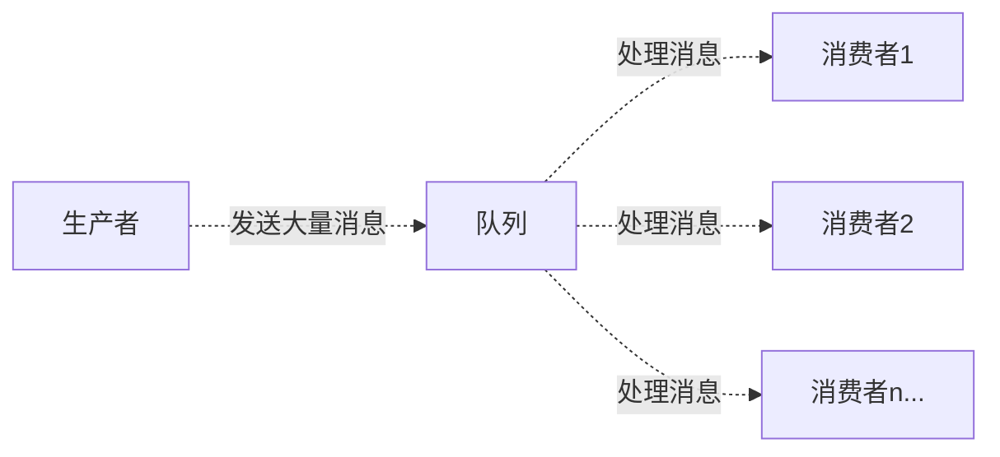

[TOC]

# MQ(message queue)

MQ(message queue), 从字面意思上看, 本质是个队列, FIFO先入先出, 只不过队列中存放的内容是message而已, 还是一种跨进程的通信机制, 用于上下游传递消息。在互联网架构中, MQ是一种非常常见的上下游“逻辑解耦+物理解耦”的消息通信服务。使用了MQ之后, 消息发送上游只需要依赖MQ, 不用依赖其他服务。

# 使用场景

## 流量消峰

举个例子, 如果订单系统最多能处理一万次订单, 这个处理能力应付正常时段的下单时绰绰有余, 正常时段我们下单一秒后就能返回结果。但是在高峰期, 如果有两万次下单操作系统是处理不了的, 只能限制订单超过一万后不允许用户下单。使用消息队列做缓冲, 我们可以取消这个限制, 把一秒内下的订单分散成一段时间来处理, 这时有些用户可能在下单十几秒后才能收到下单成功的操作, 但是比不能下单的体验要好。

## 应用解耦

以电商应用为例, 应用中有订单系统、库存系统、物流系统、支付系统。用户创建订单后, 如果耦合调用库存系统、物流系统、支付系统, 任何一个子系统出了故障, 都会造成下单操作异常。当转变成基于消息队列的方式后, 系统间调用的问题会减少很多, 比如物流系统因为发生故障, 需要几分钟来修复。在这几分钟的时间里, 物流系统要处理的内存被缓存在消息队列中, 用户的下单操作可以正常完成。当物流系统恢复后, 继续处理订单信息即可, 中单用户感受不到物流系统的故障, 提升系统的可用性。

## 异步处理

有些服务间调用是异步的, 例如A调用B, B需要花费很长时间执行, 但是A需要知道B什么时候可以执行完, 以前一般有两种方式, A过一段时间去调用B的查询api查询。或者A提供一个callback api, B执行完之后调用api通知A服务。这两种方式都不是很优雅, 使用消息总线, 可以很方便解决这个问题, A调用B服务后, 只需要监听B处理完成的消息, 当B处理完成后, 会发送一条消息给MQ, MQ会将此消息转发给A服务。这样A服务既不用循环调用B的查询api, 也不用提供callback api。同样B服务也不用做这些操作。A服务还能及时的得到异步处理成功的消息。

# MQ 的分类

## ActiveMQ

优点：单机吞吐量万级, 时效性ms级, 可用性高, 基于主从架构实现高可用性, 消息可靠性较低的概率丢失数据

缺点：官方社区现在对 ActiveMQ 5.x 维护越来越少, 高吞吐量场景较少使用。

## Kafka

Kafka主要特点是基于Pull的模式来处理消息消费, 追求高吞吐量, 一开始的目的就是用于日志收集和传输, 适合产生大量数据的互联网服务的数据收集业务。大型公司建议可以选用, 如果有日志采集功能, 肯定是首选kafka了。

大数据的杀手锏, 谈到大数据领域内的消息传输, 则绕不开Kafka, 这款为大数据而生的消息中间件, 以其百万级TPS的吞吐量名声大噪, 迅速成为大数据领域的宠儿, 在数据采集、传输、存储的过程中发挥着举足轻重的作用。目前已经被 LinkedIn, Uber,  Twitter,  Netflix 等大公司所采纳。

优点: 性能卓越, 单机写入TPS约在百万条/秒, 最大的优点, 就是吞吐量高。时效性ms级可用性非常高, kafka是分布式的, 一个数据多个副本, 少数机器宕机, 不会丢失数据, 不会导致不可用, 消费者采用Pull方式获取消息,  消息有序,  通过控制能够保证所有消息被消费且仅被消费一次;有优秀的第三方Kafka Web管理界面Kafka-Manager；在日志领域比较成熟, 被多家公司和多个开源项目使用；功能支持：功能较为简单, 主要支持简单的MQ功能, 在大数据领域的实时计算以及日志采集被大规模使用

缺点：Kafka单机超过64个队列/分区, Load会发生明显的CPU飙高现象, 队列越多, load越高, 发送消息响应时间变长, 使用短轮询方式, 实时性取决于轮询间隔时间, **消费失败不支持重试；支持消息顺序, 但是一台代理宕机后, 就会产生消息乱序**, 社区更新较慢；

## RocketMQ

天生为金融互联网领域而生, 对于可靠性要求很高的场景, 尤其是电商里面的订单扣款, 以及业务削峰, 在大量交易涌入时, 后端可能无法及时处理的情况。RoketMQ在稳定性上可能更值得信赖, 这些业务场景在阿里双11已经经历了多次考验, 如果你的业务有上述并发场景, 建议可以选择RocketMQ。

RocketMQ 出自阿里巴巴的开源产品, 用 Java 语言实现, 在设计时参考了 Kafka, 并做出了自己的一些改进。被阿里巴巴广泛应用在订单, 交易, 充值, 流计算, 消息推送, 日志流式处理, binglog 分发等场景。

优点：单机吞吐量十万级, 可用性非常高, 分布式架构, 消息可以做到0丢失, MQ功能较为完善, 还是分布式的, 扩展性好, 支持10亿级别的消息堆积, 不会因为堆积导致性能下降, 源码是java我们可以自己阅读源码, 定制自己公司的MQ

缺点：支持的客户端语言不多, 目前是java及c++, 其中 c++ 不成熟；社区活跃度一般, 没有在MQ核心中去实现JMS等接口, 有些系统要迁移需要修改大量代码

## RabbitMQ

结合erlang语言本身的并发优势, 性能好时效性微秒级, 社区活跃度也比较高, 管理界面用起来十分方便, 如果你的数据量没有那么大, 中小型公司优先选择功能比较完备的RabbitMQ。

2007年发布, 是一个在AMQP(高级消息队列协议)基础上完成的, 可复用的企业消息系统, 是当前最主流的消息中间件之一。

优点:由于erlang语言的高并发特性, 性能较好；吞吐量到万级, MQ功能比较完备, 健壮、稳定、易用、跨平台、支持多种语言 如：Python、Ruby、.NET、Java、JMS、C、PHP、ActionScript、XMPP、STOMP等, 支持AJAX文档齐全；开源提供的管理界面非常棒, 用起来很好用, 社区活跃度高；更新频率相当高

缺点：商业版需要收费, 学习成本较高

# RabbitMQ

RabbitMQ是一个消息中间件：它接受并转发消息。你可以把它当做一个快递站点, 当你要发送一个包裹时, 你把你的包裹放到快递站, 快递员最终会把你的快递送到收件人那里, 按照这种逻辑RabbitMQ是一个快递站, 一个快递员帮你传递快件。RabbitMQ与快递站的主要区别在于, 它不处理快件而是接收, 存储和转发消息数据。

[Java 客户端 API 指南](https://www.rabbitmq.com/api-guide.html)

## 四大核心概念

### 生产者

产生数据发送消息的程序是生产者

### 交换机

交换机是RabbitMQ非常重要的一个部件, 一方面它接收来自生产者的消息, 另一方面它将消息推送到队列中。交换机必须确切知道如何处理它接收到的消息, 是将这些消息推送到特定队列还是推送到多个队列, 亦或者是把消息丢弃, 这个得有交换机类型决定

### 队列

队列是RabbitMQ内部使用的一种数据结构, 尽管消息流经RabbitMQ和应用程序, 但它们只能存储在队列中。队列仅受主机的内存和磁盘限制的约束, 本质上是一个大的消息缓冲区。许多生产者可以将消息发送到一个队列, 许多消费者可以尝试从一个队列接收数据。这就是我们使用队列的方式

### 消费者

消费与接收具有相似的含义。消费者大多时候是一个等待接收消息的程序。请注意生产者, 消费者和消息中间件很多时候并不在同一机器上。同一个应用程序既可以是生产者又是可以是消费者。


## 消息应答

消费者完成一个任务可能需要一段时间, 如果其中一个消费者处理一个长的任务并仅只完成了部分突然它挂掉了, 会发生什么情况。**RabbitMQ 一旦向消费者传递了一条消息, 便立即将该消息标记为删除**。在这种情况下, 突然有个消费者挂掉了, 我们将**丢失**正在处理的消息。以及后续发送给该消费者的消息, 因为它无法接收到。

为了保证消息在发送过程中不丢失, rabbitmq 引入消息应答机制, 消息应答就是:消费者在接收到消息**并且处理该消息之后**, 告诉rabbitmq它已经处理了, rabbitmq可以把该消息删除了。

RabbitMQ消息应答是一种机制, 用于确保消息在被消费者处理后被正确确认。当消费者接收到消息并成功处理后, 它会发送一个应答给RabbitMQ服务器, 告知消息已经被处理完成。这样, RabbitMQ就知道消息已经成功被消费者接收并处理了。如果消费者在处理消息时发生了错误, 它可以选择不发送应答, 这样RabbitMQ就会将消息重新发送给其他消费者, 确保消息不会丢失。通过消息应答机制, RabbitMQ可以保证消息的可靠性和可持久性。

### 自动应答

**消息发送后立即被认为已经传送成功**, 即不会保证消息是否会被正确消费, **故不推荐使用**， 这种模式需要在高吞吐量和数据传输安全性方面做权衡,因为这种模式如果消息在接收到之前, 消费者那边出现连接或者channel关闭, 那么消息就丢失了,当然另一方面这种模式消费者那边可以传递过载的消息, 没有对传递的消息数量进行限制, 当然这样有可能使得消费者这边由于接收太多还来不及处理的消息, 导致这些消息的积压, 最终使得内存耗尽, 最终这些消费者线程被操作系统杀死, 所以这种模式仅适用在消费者可以高效并以某种速率能够处理这些消息的情况下使用。

### 手动应答

```
Channel.basicAck(long deliveryTag 唯一的标签, boolean multiple 是否批量应答) RabbitMQ 已知道该消息并且成功的处理消息，可以将其丢弃了
```


```
Channel.basicNack(long deliveryTag, boolean multiple, boolean requeue 表示是否将消息重新放回队列中 ) throws IOException 用于否定确认
```


```
Channel.basicReject(long deliveryTag, boolean requeue 表示是否将消息重新放回队列中 ) throws IOException 用于否定确认与 Channel.basicNack 相比少一个参数,批量处理参数 不处理该消息了直接拒绝，可以将其丢弃了
```

#### 批量手动应答

手动应答的好处是可以批量应答并且减少网络拥堵，当 RabbitMQ Server 向消费者发送消息时，它会先将消息发送到一个叫做 channel 的中间媒介。这个 channel 可以看作是消息在 RabbitMQ Server 中的一个通道，它负责将消息从生产者传递给消费者。通过使用 channel，RabbitMQ 实现了消息的可靠传输和有序处理。同时，channel 还可以提供流量控制和消息确认等功能，确保消息能够被正确地处理和传递。


当 channel 中存在多个未处理消息时，例如 5,6,7,8 四条，当前正在处理 8 号消息，当启用了批量应答，则 5,6,7,8 四条消息都会被应答，反之则仅应答 8 号消息。


#### 消息自动重新入队

如果消费者由于某些原因失去连接(其通道已关闭，连接已关闭或TCP连接丢失)，导致消息未发送ACK确认，RabbitMQ将了解到消息未完全处理，并将对其重新排队。如果此时其他消费者可以处理，它将很快将其重新分发给另一个消费者。这样，即使某个消费者偶尔死亡，也可以确保不会丢失任何消息。


测试

```java
import com.rabbitmq.client.*;
import org.example.util.RabbitMqUtils;

import java.util.Scanner;

public class Task01 {
    private static final String QUEUE_NAME = "hello";

    public static void main(String[] args) throws Exception {
        try (Channel channel = RabbitMqUtils.getChannel();) {
            channel.queueDeclare(QUEUE_NAME, false, false, false, null);
            //从控制台当中接受信息
            Scanner scanner = new Scanner(System.in);
            while (scanner.hasNext()) {
                String message = scanner.next();
                channel.basicPublish("", QUEUE_NAME, null, message.getBytes());
                System.out.println("发送消息完成:" + message);
            }
        }
    }
}
```


```java
import com.rabbitmq.client.*;
import org.example.util.RabbitMqUtils;

public class Worker01 {

    private static final String QUEUE_NAME = "hello";

    public static void main(String[] args) throws Exception {
        Channel channel = RabbitMqUtils.getChannel();
        DeliverCallback deliverCallback = (consumerTag, delivery) -> {
            String receivedMessage = new String(delivery.getBody());
            System.out.println("接收到消息:" + receivedMessage);
            System.out.println("处理完成:" + receivedMessage);
            channel.basicAck(delivery.getEnvelope().getDeliveryTag(),false);
        };
        CancelCallback cancelCallback = (consumerTag) -> {
            System.out.println(consumerTag + "消费者取消消费接口回调逻辑");
        };
        System.out.println("C2消费者启动等待消费......");
        channel.basicConsume(QUEUE_NAME, false, deliverCallback, cancelCallback);
    }
}
```

```java
import com.rabbitmq.client.*;
import org.example.util.RabbitMqUtils;

public class Worker02 {

    private static final String QUEUE_NAME = "hello";

    public static void main(String[] args) throws Exception {
        Channel channel = RabbitMqUtils.getChannel();
        DeliverCallback deliverCallback = (consumerTag, delivery) -> {
            String receivedMessage = new String(delivery.getBody());
            System.out.println("接收到消息:" + receivedMessage);
            try {
                Thread.sleep(5000);
            } catch (InterruptedException e) {
                e.printStackTrace();
            }
            System.out.println("处理完成:" + receivedMessage);
            channel.basicAck(delivery.getEnvelope().getDeliveryTag(),false);
        };
        CancelCallback cancelCallback = (consumerTag) -> {
            System.out.println(consumerTag + "消费者取消消费接口回调逻辑");
        };
        System.out.println("C2消费者启动等待消费......");
        channel.basicConsume(QUEUE_NAME, false, deliverCallback, cancelCallback);
    }
}
```

正常情况下消息发送方发送两个消息Worker01和Worker02分别接收到消息并进行处理,在发送者发送消息02，发出消息之后的把Worker02消费者停掉，按理说该Worker02来处理该消息，但是由于它处理时间较长，在还未处理完，也就是说Worker02还没有执行ack代码的时候，Worker02被停掉了，此时会看到消息被Worker01接收到了，说明消息02被重新入队，然后分配给能处理消息的Worker01处理了


#### 会有重复消费风险

## 持久化

刚刚我们已经看到了如何处理任务不丢失的情况，但是如何保障当RabbitMQ服务停掉以后消息生产者发送过来的消息不丢失。默认情况下RabbitMQ退出或由于某种原因崩溃时，它忽视队列和消息，除非告知它不要这样做。确保消息不会丢失需要做两件事：我们需要将队列和消息都标记为持久化。

### 队列持久化

之前我们创建的队列都是非持久化的，rabbitmq如果重启的化，该队列就会被删除掉，如果要队列实现持久化需要在声明队列的时候把durable参数设置为持久化

通过调用这个方法，可以在 RabbitMQ 中声明一个队列，并设置相关的属性。

```java
com.rabbitmq.client.Channel#queueDeclare(String queue, boolean durable, boolean exclusive, boolean autoDelete, Map<String, Object> arguments) throws IOException;
```

- `queue` 是方法的第一个参数，表示队列的名称。
- `durable` 是方法的第二个参数，表示是否持久化队列。如果设置为 `true`，则在服务器重启后，队列仍然存在。如果设置为 `false`，则在服务器重启后，队列将被删除。
- `exclusive` 是方法的第三个参数，表示是否排他队列。如果设置为 `true`，则只有声明该队列的连接可以使用该队列。如果设置为 `false`，则任何连接都可以使用该队列。
- `autoDelete` 是方法的第四个参数，表示是否自动删除队列。如果设置为 `true`，则当最后一个消费者断开连接后，队列将被自动删除。
- `arguments` 是方法的第五个参数，表示队列的其他属性。这是一个键值对的映射，用于设置队列的更多属性，如消息过期时间、最大长度等。

但是需要注意的就是如果之前声明的队列不是持久化的，需要把原先队列先删除，或者重新创建一个持久化的队列，不然就会出现错误


以下为控制台中持久化与非持久化队列的UI显示区


这个时候即使重启rabbitmq队列也依然存在

### 消息持久化

要想让消息实现持久化需要在消息生产者修改代码，MessageProperties.PERSISTENT_TEXT_PLAIN 添加这个属性。

```java
channel.basicPublish("", QUEUE_NAME, MessageProperties.PERSISTENT_TEXT_PLAIN, message.getBytes());
```

```java
com.rabbitmq.client.Channel#basicPublish(String exchange, String routingKey, BasicProperties props, byte[] body) throws IOException;
```

- `String exchange` 表示消息要发送到的交换机（Exchange）的名称。
- `String routingKey` 表示消息的路由键（Routing Key），用于将消息路由到指定的队列。
- `BasicProperties props` 表示消息的基本属性，例如消息的持久性、优先级等 `com.rabbitmq.client.MessageProperties#PERSISTENT_TEXT_PLAIN` 是一个常量，用于指定消息的属性。它表示消息是持久化的纯文本消息。。
- `byte[] body` 表示消息的主体内容，以字节数组的形式传递。

持久化意味着当消息发送到消息队列（如RabbitMQ）时，即使在服务器重启或断电的情况下，消息也会被保存下来，以确保不会丢失。

纯文本消息表示消息的内容是以纯文本的形式进行传输和存储的，而不是二进制数据或其他格式的数据。

使用这个常量可以确保消息的持久化和以纯文本的形式进行传输，以满足特定的业务需求。

**将消息标记为持久化并不能完全保证不会丢失消息**。尽管它告诉RabbitMQ将消息保存到磁盘，但是这里依然存在当消息刚准备存储在磁盘的时候 但是还没有存储完，消息还在缓存的一个间隔点。此时并没有真正写入磁盘。持久性保证并不强，但是对于我们的简单任务队列而言，这已经绰绰有余了。如果需要更强有力的持久化策略，参考发布确认章节。


# 核心(六大模式)


- Broker：接收和分发消息的应用, RabbitMQ Server 就是 Message Broker
- Virtual host：出于多租户和安全因素设计的, 把 AMQP 的基本组件划分到一个虚拟的分组中, 类似于网络中的namespace概念。当多个不同的用户使用同一个RabbitMQ server提供的服务时, 可以划分出多个vhost, 每个用户在自己的 vhost 创建 exchange／queue 等
- Connection(链接)：publisher／consumer 和 broker 之间的 TCP 连接
- Channel(信道)：如果每一次访问 RabbitMQ 都建立一个Connection, 在消息量大的时候建立 TCP Connection的开销将是巨大的, 效率也较低。Channel是在connection内部建立的逻辑连接, 如果应用程序支持多线程, 通常每个thread创建单独的channel进行通讯, AMQP method包含了channel id 帮助客户端和message broker 识别 channel, 所以channel之间是完全隔离的。Channel作为轻量级的Connection极大减少了操作系统建立TCP connection的开销
- Exchange(交换机)：message 到达 broker 的第一站, 根据分发规则, 匹配查询表中的 routing key, 分发消息到queue 中去。常用的类型有：direct (point-to-point),  topic (publish-subscribe) and fanout (multicast)
- Queue(队列)：消息最终被送到这里等待consumer取走
- Binding(绑定)：exchange和queue之间的虚拟连接, binding中可以包含routing key, Binding信息被保存到exchange中的查询表中, 用于message的分发依据


## hello world (简单模式)

一个简单的使用 java 作为客户端的测试程序


pom

```xml
<dependencies>
    <dependency>
        <groupId>com.rabbitmq</groupId>
        <artifactId>amqp-client</artifactId>
        <version>5.8.0</version>
    </dependency>
    <dependency>
        <groupId>commons-io</groupId>
        <artifactId>commons-io</artifactId>
        <version>2.6</version>
    </dependency>
</dependencies>
```

生产者

```java
import com.rabbitmq.client.Channel;
import com.rabbitmq.client.Connection;
import com.rabbitmq.client.ConnectionFactory;

public class Producer {
    private final static String QUEUE_NAME = "hello";

    public static void main(String[] args) throws Exception {
        //创建一个连接工厂
        ConnectionFactory factory = new ConnectionFactory();
        factory.setHost("192.168.1.10");
        factory.setUsername("admin");
        factory.setPassword("admin");
        //channel实现了自动close接口 自动关闭 不需要显示关闭
        try (Connection connection = factory.newConnection();
             Channel channel = connection.createChannel()) {
            /* 生成一个队列
              1.队列名称
              2.队列里面的消息是否持久化 默认消息存储在内存中
              3.该队列是否只供一个消费者进行消费 是否进行共享 true可以多个消费者消费
              4.是否自动删除 最后一个消费者端开连接以后 该队列是否自动删除 true 自动删除
              5.其他参数
             */
            channel.queueDeclare(QUEUE_NAME, false, false, false, null);
            String message = "hello world2";
            /*  发送一个消息
                1.发送到那个交换机
                2.路由的key是哪个
                3.其他的参数信息
                4.发送消息的消息体
            */
            channel.basicPublish("", QUEUE_NAME, null, message.getBytes());
            System.out.println("消息发送完毕");
        }
    }
}
```

消费者

```java
import com.rabbitmq.client.*;

public class Consumer {
    private final static String QUEUE_NAME = "hello";

    public static void main(String[] args) throws Exception {
        ConnectionFactory factory = new ConnectionFactory();
        factory.setHost("192.168.1.10");
        factory.setUsername("admin");
        factory.setPassword("admin");
        Connection connection = factory.newConnection();
        Channel channel = connection.createChannel();
        System.out.println("等待接收消息...."); //推送的消息如何进行消费的接口回调
		// DeliverCallback是一个回调函数, 用于在消息传递过程中进行消息传递的确认和处理。当一个消息被成功传递到目标位置时, 会触发DeliverCallback函数来进行相应的处理。这个函数通常用于确保消息的可靠传递和处理, 以及执行相关的业务逻辑。通过使用DeliverCallback, 我们可以在消息传递过程中实现更加可靠和灵活的处理机制。
        DeliverCallback deliverCallback = (consumerTag, delivery) -> {
            String message = new String(delivery.getBody());
            System.out.println(message);
        };
        //取消消费的一个回调接口 如在消费的时候队列被删除掉了
        CancelCallback cancelCallback = (consumerTag) -> {
            System.out.println("消息消费被中断");
        };
        /*  消费者消费消息
             1.消费哪个队列
             2.消费成功之后是否要自动应答 true代表自动应答 false手动应答
             3.消费者未成功消费的回调
			 basicConsume 是一个用于消息队列的方法或函数, 它用于消费（接收和处理）消息。当使用消息队列时, 消息生产者将消息发送到队列中, 然后消费者使用 basicConsume 方法从队列中接收这些消息。
			 
			 通过调用 basicConsume 方法, 消费者可以订阅一个队列, 并指定一个回调函数来处理接收到的消息。每当有新的消息到达队列时, 消费者的回调函数将被调用, 以便进行处理。
			 
			 使用 basicConsume 方法, 消费者可以按照自己的需求从队列中获取消息, 例如按顺序获取、按优先级获取或者按照其他规则获取。这个方法通常具有一些参数, 用于指定队列的名称、回调函数、消息确认方式等。
         */
        channel.basicConsume(QUEUE_NAME, true, deliverCallback, cancelCallback);
    }
}
```

## work queues (工作队列模式)

工作队列(又称任务队列)的主要思想是避免立即执行资源密集型任务, 而不得不等待它完成。相反我们安排任务在之后执行。我们把任务封装为消息并将其发送到队列。在后台运行的工作进程将弹出任务并最终执行作业。当有**多个工作线程**时, 这些工作线程将一起处理这些任务。



### 轮询分发

**一个消息只能被消费一次**

抽取一个工具类

```java
import com.rabbitmq.client.*;

public class RabbitMqUtils {
    public static Channel getChannel() throws Exception {
        ConnectionFactory factory = new ConnectionFactory();
        factory.setHost("192.168.1.10");
        factory.setUsername("admin");
        factory.setPassword("admin");
        Connection connection = factory.newConnection();
        return connection.createChannel();
    }
}
```

生产者

```java
import com.rabbitmq.client.*;
import org.example.util.RabbitMqUtils;

import java.util.Scanner;

public class Task01 {
    private static final String QUEUE_NAME = "hello";

    public static void main(String[] args) throws Exception {
        try (Channel channel = RabbitMqUtils.getChannel();) {
            channel.queueDeclare(QUEUE_NAME, false, false, false, null);
            //从控制台当中接受信息
            Scanner scanner = new Scanner(System.in);
            while (scanner.hasNext()) {
                String message = scanner.next();
                channel.basicPublish("", QUEUE_NAME, null, message.getBytes());
                System.out.println("发送消息完成:" + message);
            }
        }
    }
}
```

消费者

```java
import com.rabbitmq.client.*;
import org.example.util.RabbitMqUtils;

public class Worker01 {

    private static final String QUEUE_NAME = "hello";

    public static void main(String[] args) throws Exception {
        Channel channel = RabbitMqUtils.getChannel();
        DeliverCallback deliverCallback = (consumerTag, delivery) -> {
            String receivedMessage = new String(delivery.getBody());
            System.out.println("接收到消息:" + receivedMessage);
        };
        CancelCallback cancelCallback = (consumerTag) -> {
            System.out.println(consumerTag + "消费者取消消费接口回调逻辑");
        };
        System.out.println("C2消费者启动等待消费......");
        channel.basicConsume(QUEUE_NAME, true, deliverCallback, cancelCallback);
    }
}
```

```java
import com.rabbitmq.client.*;
import org.example.util.RabbitMqUtils;

public class Worker02 {

    private static final String QUEUE_NAME = "hello";

    public static void main(String[] args) throws Exception {
        Channel channel = RabbitMqUtils.getChannel();
        DeliverCallback deliverCallback = (consumerTag, delivery) -> {
            String receivedMessage = new String(delivery.getBody());
            System.out.println("接收到消息:" + receivedMessage);
        };
        CancelCallback cancelCallback = (consumerTag) -> {
            System.out.println(consumerTag + "消费者取消消费接口回调逻辑");
        };
        System.out.println("C2消费者启动等待消费......");
        channel.basicConsume(QUEUE_NAME, true, deliverCallback, cancelCallback);
    }
}
```

```java
import com.rabbitmq.client.*;
import org.example.util.RabbitMqUtils;

public class Worker03 {

    private static final String QUEUE_NAME = "hello";

    public static void main(String[] args) throws Exception {
        Channel channel = RabbitMqUtils.getChannel();
        DeliverCallback deliverCallback = (consumerTag, delivery) -> {
            String receivedMessage = new String(delivery.getBody());
            System.out.println("接收到消息:" + receivedMessage);
        };
        CancelCallback cancelCallback = (consumerTag) -> {
            System.out.println(consumerTag + "消费者取消消费接口回调逻辑");
        };
        System.out.println("C2消费者启动等待消费......");
        channel.basicConsume(QUEUE_NAME, true, deliverCallback, cancelCallback);
    }
}
```

启动程序, 发送消息观察消费者, 发现默认**轮询**处理消息, 且消息只会被消费一次

### 不公平分发

上述分发消息采用的轮训分发，但是在某种场景下这种策略并不是很好，比方说有两个消费者在处理任务，其中有个消费者1处理任务的速度非常快，而另外一个消费者2处理速度却很慢，这个时候我们还是采用轮训分发的化就会到这处理速度快的这个消费者很大一部分时间处于空闲状态，而处理慢的那个消费者一直在干活，这种分配方式在这种情况下其实就不太好，但是 RabbitMQ 并不知道这种情况它依然很公平的进行分发。

为了避免这种情况，我们可以设置参数channel.basicQos(1);

`com.rabbitmq.client.Channel#basicQos(int)` 是 RabbitMQ Java 客户端库中的一个方法。它用于设置消费者从消息队列中获取消息的方式。

这个方法的参数是一个整数，表示消费者一次性从消息队列中获取的消息数量。通过调用这个方法，可以限制消费者一次性获取的消息数量，以控制消费者的负载和系统资源的使用。

简而言之，`basicQos` 方法用于设置消费者从消息队列中获取消息的速率。

意思就是如果这个任务我还没有处理完或者我还没有应答你，你先别分配给我，我目前只能处理一个任务，然后rabbitmq就会把该任务分配给没有那么忙的那个空闲消费者，当然如果所有的消费者都没有完成手上任务，队列还在不停的添加新任务，队列有可能就会遇到队列被撑满的情况，这个时候就只能添加新的worker或者改变其他存储任务的策略。

### 预取值

本身消息的发送就是异步发送的，所以在任何时候，channel 上肯定不止只有一个消息,另外来自消费者的手动确认本质上也是异步的。因此这里就存在一个未确认的消息的缓冲区，因此希望开发人员能限制此缓冲区的大小，以避免缓冲区里面无限制的未确认消息问题。这个时候就可以通过使用basic.qos方法设置“预取计数”值来完成的。该值定义通道上允许的未确认消息的最大数量。一旦数量达到配置的数量，RabbitMQ将停止在通道上传递更多消息，除非至少有一个未处理的消息被确认，例如，假设在通道上有未确认的消息5、6、7，8，并且通道的预取计数设置为4，此时RabbitMQ将不会在该通道上再传递任何消息，除非至少有一个未应答的消息被ack。比方说tag=6这个消息刚刚被确认ACK，RabbitMQ将会感知这个情况到并再发送一条消息。消息应答和QoS预取值对用户吞吐量有重大影响。通常，增加预取将提高向消费者传递消息的速度。虽然自动应答传输消息速率是最佳的，但是，在这种情况下已传递但尚未处理的消息的数量也会增加，从而增加了消费者的RAM消耗(随机存取存储器)应该小心使用具有无限预处理的自动确认模式或手动确认模式，消费者消费了大量的消息如果没有确认的话，会导致消费者连接节点的内存消耗变大，所以找到合适的预取值是一个反复试验的过程，不同的负载该值取值也不同100到300范围内的值通常可提供最佳的吞吐量，并且不会给消费者带来太大的风险。预取值为1是最保守的。当然这将使吞吐量变得很低，特别是消费者连接延迟很严重的情况下，特别是在消费者连接等待时间较长的环境中。对于大多数应用来说，稍微高一点的值将是最佳的。


RabbitMQ的预取值（Prefetch）是指在消费者从消息队列中获取消息时，一次性获取的消息数量。它可以控制消费者一次性处理的消息数量，以避免消费者负载过重或者消息堆积过多的情况。
预取值的设置可以通过以下两种方式之一来实现：

1. Basic.Qos方法：消费者可以使用Basic.Qos方法来设置预取值。通过指定参数prefetch_count，可以告诉RabbitMQ每次发送给消费者的消息数量。例如，设置prefetch_count为10，表示每次发送给消费者10条消息。
2. Channel.BasicQos事件：消费者也可以通过订阅Channel.BasicQos事件来设置预取值。当消费者订阅了该事件后，可以在事件处理程序中设置预取值。

预取值的设置可以根据实际需求进行调整。较大的预取值可以提高消费者的处理速度，但可能会导致消息堆积过多；较小的预取值可以减少消费者的负载，但可能会影响处理速度。因此，合理设置预取值是根据具体场景和需求来决定的。

## publish/subscribe (发布/订阅模式)
## routing (路由模式)
## topics (主题模式)
## publisher confirms (发布确认模式)


# 高级
## 死信队列
## 延迟队列
## 发布确认
## 幂等性
## 优先级队列
## 惰性队列

# 集群
## clustering
## 镜像队列
## haproxy+keepalive高可用负载均衡
## federation exchange
## federation queue
## shovel

# 安装

首先, 由于 RabbitMQ 由 erlang 语言开发, 所以, 要安装 RabbitMQ 需要先安装 erlang 语言环境

## 官网地址

https://www.rabbitmq.com/download.html

## CentOS

下载安装文件

https://d3fo0g5hm7lbuv.cloudfront.net/828/1033/el/7/package_files/2082190.rpm?Expires=1704787698&Signature=lBNb4mPSYJj3t1zSzqWus~ZIzH2EJ7qFjdlPPClkpgz1AnEI54YtRz8janyN9JBhwzxnLnkhoigHf82q99ZZHnIeJnCJf5p~lSNPIDeeVQVdxP1G8UXz7uZy2UP~F-SmLxdfR9fCff7xqlBfxoqnNw1Yvr~ZNNKcWAUkyzDFWyDsVdrCCXGD6pTVrTwlQatiz-AJfy6WVaaGBVT-SrYe-qvTgXl~Nj2lC7c7slS50d-iptZlJdzP-XSUj3~GOsSIOBtC8C-RlY1BzY2mYnC4MDGa1fwMn6s5Lwd1TMRaUKQYhnM8qj7I3zOMhADsJgPAv0ZXy9u2YKL4wxJwoK7H9w__&Key-Pair-Id=K1ZMSF1EKC3AZL

https://d3fo0g5hm7lbuv.cloudfront.net/828/1039/el/7/package_files/1917402.rpm?Expires=1704787674&Signature=ucSY3Ke~RJKXoTjRC6hzHY4iHnsHRyj~UWAiDnrRzP1H6JBCpCxgkP3XNWsFGw4qa9aLS0N6zjLd2UulcNq~c0VhPWboi2X7-aAbMSqXA2ThHZ0H0h6Kn5-uu8FCF~jqSTJq12I76aDGb3rNLxYSJRVOlZ4BZrf~okLykfm-P6DNvhWKLbDZdjYAAMlToqj8TF2Y7H2nyonjj2fxKjlcwhhsnG9JujTEXfI~2FxreETiOkd3olSFCoOYDgVkexTLU2gODLrN6AFsZXrwX82B3~ncvtiZyNeV0aNkVzxNeEJ6NTd58V7qo11NBNGWF4UZ2W3kY4InHiRvQeKOx-k3NQ__&Key-Pair-Id=K1ZMSF1EKC3AZL

```
erlang-23.3.4.11-1.el7.x86_64.rpm  
rabbitmq-server-3.10.0-1.el7.noarch.rpm
```

分别按照以下顺序安装

```
rpm -ivh erlang-23.3.4.11-1.el7.x86_64.rpm  
```

需要联网安装依赖

```
yum install socat -y
```

```
rpm -ivh rabbitmq-server-3.10.0-1.el7.noarch.rpm
```

添加开机启动 RabbitMQ 服务

```
chkconfig rabbitmq-server on
```

启动服务

```
/sbin/service rabbitmq-server start
```

查看服务状态

```
/sbin/service rabbitmq-server status
```

停止服务

```
/sbin/service rabbitmq-server stop
```

开启 web 管理插件

```
rabbitmq-plugins enable rabbitmq_management
```

默认账号密码: guest:guest
访问地址 ： http://192.168.1.10:15672/

登录显示没有权限

### 创建用户

```
语法 rabbitmqctl add_user <username> <password>

rabbitmqctl add_user admin admin
```

设置用户角色

```
rabbitmqctl set_user_tags admin administrator
```

设置用户权限

语法

```
set_permissions [-p <vhostpath>] <user> <conf> <write> <read>

rabbitmqctl set_permissions -p "/" admin ".*" ".*" ".*"

用户 user_admin 具有 "/" 这个 virtual host 中所有资源的配置、写、读权限
```

查看用户和角色

```
rabbitmqctl list_users
```
