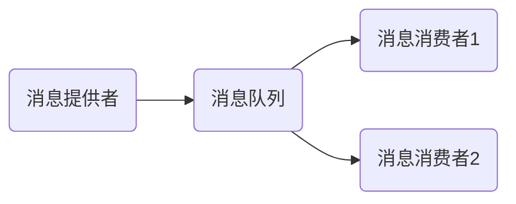
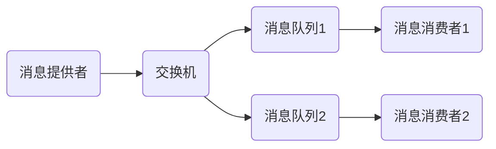

[TOC]

# 数据库

## sql 的执行顺序

form、where、group by…… having、聚合函数、select、order by

## oracle 中的表分区方式

范围分区、Hash分区、List分区、时间分区

## 一级索引和二级索引

一级索引：索引与索引的数据存储在一起，都存储在同一个 B+tree 中的叶子节点，通过定位索引就直接可以查找到数据，一般主键索引都是一级索引

二级索引：二级索引的叶子节点存储的是**主键**而不是数据。也就是说，在找到索引后，需要得到对应的主键，再回到一级索引中找主键对应的数据记录。

一级索引可以单独存在，二级索引不能单独存在，必须依附于一级索引，这叫做“回表”。

二级索引存储主键值而不是存储数据，当数据需要更新的时候，二级索引不需要修改，只需要修改一级索引，一个表只能有一个一级索引，其他的都是二级索引，这样只需要修改一级索引就可以了，不需要重新构建二级索引

[(37条消息) MySQL的一级索引和二级索引介绍_无趣的人民艺术家的博客-CSDN博客_一级索引和二级索引](https://blog.csdn.net/weixin_43606861/article/details/116202806)

## 索引的最左匹配原则

在MySQL中，索引是以 B+Tree 的形式存在的，它是 B_Tree 的变体，其定义基本与 B_Tree 相同，下图就是B+Tree的数据结构，图中非叶子节点，蓝色部分代表索引，黄色部分代表指向下一个节点的指针，叶子节点则代表实际保存的数据。


B+树与B树主要存在以下区别

- 非叶子节点的子树指针与关键字个数相同

- 非叶子节点的子树指针P[i]，指向关键字值[K[i], K[i+1]）的子树
- **非叶子节点仅用来索引，数据都保存在叶子节点中**。
- **所有叶子节点具有一个链表指针指向下一个叶子节点，形成一个链表结构**
- 所有的中间节点元素都同时存在于子节点，在子节点元素中是**最大**（或**最小**）元素，上图就是在子节点元素中最小，这个与我们具体定义的规则有关。

如果是联合索引，当建立联合索引时，联合索引当然还是一颗B+树，比如建立一个联合索引(a, b),那么它的索引结构应该是这样的。


a索引：1，1，2，2，3，3

b索引：1，2，1，4，1，2

通过观察可以发现，在联合索引中，对于a索引来说，索引是有序排列的，对于b索引是无序排列的。**同时还可以发现对于a值相等的情况下，b值也是有序的。**

这种有序是相对的，a>1 and b=4 遇到这种范围查询，就不会再去走索引，这种情况下a值可以走索引，而b值在这个范围内是无序的，所以最终也不会走索引。

那么就基本可以得出最左匹配原则的定义：最左优先，以最左边的为起点任何连续的索引都能匹配上。同时遇到范围查询(>、<、between、like) 就会停止匹配

例如建立一个索引

```sql
INDEX score_age_index (`score`, `age`)
```

**对于全值匹配来说**

```sql
select name from tb_student where age=20 and score=90;
```

查询会走索引，虽然定义索引的顺序是(score, age)，mysql 可以进行优化，自动帮我们改变顺序。

**对于单值来说**

```sql
select name from tb_student where score=90;
```

也是会走索引的，但是下面

```sql
select name from tb_student where age=19;
```

是不会走索引的，因为它并没有从最左连续匹配

**对于字符串类型来说**

它的比较规则是先比较字符串的第一个字符，第一个字符小的哪个字符串就比较小，如果两个字符串第一个字符相同，那就再比较第二个字符，第二个字符比较小的那个字符串就比较小，依次类推，比较字符串。

```sql
select * from tb_student  where a like 'As%'; //前缀都是排好序的，走索引查询
select * from tb_student  where  a like '%As'//全表查询
select * from tb_student  where  a like '%As%'//全表查询
```

**对于范围值来说**

可以对左边的列进行范围查询，结果是一定会走索引的。

```sql
select name from tb_student where score > 60 and score < 90;
```

多个列同时进行范围查找时，只有对索引左边的那个列进行范围查找才用到B+树索引，也就是只有score用到了索引，在90>score>60的情况下，age是无序的，不能用索引，找到90>score>60的记录后，只能根据条件 age>20 继续逐条过滤.

**对于精确匹配某一列并范围匹配另一列**

如果左边的列是精确查找的，右边的列可以进行范围查找，因为如果score=90，age是有序的

**排序**

```sql
select name from tb_student order by score,age;
```

因为b+树索引本身就是按照上述规则排序的，order by的子句后面的顺序也必须按照索引列的顺序给出，就会走索引。如果数据库中的数据量过小的时候，mysql数据库会自动为我们做优化，它会认为全表扫描要比索引更快，所以就采用全表扫描方式。

```sql
explain select name from tb_student order by age,score;
```

列的顺序反过来就不会走索引

如果最左边列的值是定值，则对其他列顺序排序是可以用到索引的。

## mysql 的可重复读是如何实现的

InnoDB 里面每个事务都有一个唯一的事务 ID，叫作 transaction id。它在事务开始的时候向 InnoDB 的事务系统申请的，是按申请顺序严格递增的。而表中的每行数据也都是有多个版本的。每次事务更新数据的时候，都会生成一个新的数据版本，并且把 transaction id 赋值给这个数据版本的事务 ID，记为 row trx_id。同时，旧的数据版本要保留，并且在新的数据版本中，能够有信息可以直接拿到它。也就是说，数据表中的一行记录，其实可能有多个版本 (row)，每个版本有自己的 row trx_id。

表中的每行记录在更新的时候都会同时记录一条 undo log，这条 log 就会记录上当前事务的 transaction id，记为 row trx_id。记录上的最新值，通过回滚操作，都可以得到前一个状态的值。

在可重复读隔离级别下，一个事务在启动时，InnoDB 会为事务构造一个数组，用来保存这个事务启动瞬间，当前**正在”活跃“的所有事务ID**。”活跃“指的是，启动了但还没提交的事务。

这个数组里面事务 ID 为最小值记为低水位，**当前系统里面已经创建过的事务 ID 的最大值**加 1 记为高水位。

这个视图数组把所有的 row trx_id 分成了几种不同的情况。

- 如果当前读到的这行数据的 trx_id 小于低水位，表示这个版本的数据在当前事务启动前已经提交，是安全的，可见
- 如果当前读到的这行数据的 trx_id 大于高水位，表示这个版本的数据是在当前事务启动后生成的，不可见
- 如果当前读到的这行数据的 trx_id 大于低水位，小于高水位，分为两种情况
  - 如果当前读到的这行数据的 trx_id 在数组中，表示这个版本在当前事务启动时还未提交，不可见
  - 如果当前读到的这行数据的 trx_id 不在数组中，表示这个版本在当前事务启动时已经提交，可见

假设事务A, B, C 的 trx_id 分别为 100, 101, 102。事务 A 开始前活跃的事务 ID 只有 99，并且 id=1 这一行数据的 trx_id=90，数据 K = 1。假设 A,B,C 按顺序启动，得出事务启动瞬间的视图数组：事务A：[99, 100]，事务B：[99, 100, 101]，事务C：[99, 100, 101, 102]。此时进行如下操作：

1. 事务C通过更新语句，把 k 更新为 2，此时trx_id=102；
2. 事务B通过更新语句，把 k 更新为 3，此时trx_id=101；
3. 事务B通过查询语句，查询到最新一条记录为3，trx_id=101，满足隔离条件，返回 k=3；
4. 事务A通过查询语句：
   1. 查询到最新一条记录为3，trx_id=101，比高水位大，不可见；
   2. 通过 undo log，找到上一个历史版本，trx_id=102，比高水位大，还是不可见；
   3. 继续找上一个历史版本，trx_id=90，比低水位小，可见。

也就是说**事务B更新的时候是能看到事务C的修改的**

如果事务B在更新的看不到事务C的修改就会出问题：

1. 事务B查询到最新一条记录为2，trx_id=102，比高水位大，不可见；
2. 通过 undo log，找到上一个版本，trx_id=90，比低水位小，可见；
3. 返回记录 k=1，执行 k=k+1，把 k 更新为2，此时 trx_id=101。

此时事务B覆盖了事务C的更新，所以，InnoDB在更新时运用一条规则：**更新数据都是先读后写的，而这个读，只能读当前最新的值，称为“当前读“ （current read）**，因此，事务B在更新时要拿到最新的数据，在此基础上做更新。紧接着，事务B在读取的时候，查询到最新的记录为3， trx_id=101 为当前事务ID，可见

再假设另一种情况：

事务B在更新之后，事务C紧接着更新，事务B回滚了，事务C成功提交

如果按照当前读的定义，会发生以下事故，假设当前 K=1：

1. 事务B把 k 更新为 2；
2. 事务C读取到当前最新值，k=2，更新为3；
3. 事务B回滚；
4. 事务C提交。

这时候，事务C发现自己想要执行的是 +1 操作，结果变成了 ”+2“ 操作。

InnoDB 肯定不允许这种情况的发生，因此事务B在执行更新语句时，会给该行加上行锁，直到事务B结束，才会释放这个锁。

小结

1. InnoDB 的行数据有多个版本，每个版本都有 row trx_id。
2. 事务根据 undo log 和 trx_id 构建出满足当前隔离级别的一致性视图。
3. 可重复读的核心是一致性读，而事务更新数据的时候，只能使用当前读，如果当前记录的行锁被其他事务占用，就需要进入锁等待。

## 怎样避免数据库死锁


1，尽量不要在一个事务中实现过于复杂的查询或更新操作。原因很简单，越是复杂的数据库操作，占用数据库资源的时间越长，引发死锁的可能性越大。

2，尽量不要在数据库事务中要求用户响应。原因同1，这也会导致事务长时间无法结束，浪费数据库资料。

3，死锁是由于并发访问数据库资源造成的，减少死锁就应该限制应用系统的并发访问量。我们应该合理设置后台服务的线程数，将大量数据的操作分解，分步骤，分阶段的执行。也应该避免在用户量大的时候大规模的进行后台数据库操作，应该将大规模的数据库操作放在用户量最少的时候进行。

4，尽可能以分区表或分区视图的方式拆分包含大量数据的表，将它们保存在不同的物量磁盘和文件组中。在访问数据时，可以分散访问保存在不同分区的数据，从而减少因为在大型表中放置锁而造成其它事务长时间等待的概率。

5，尽量避免使用占用很长的复杂查询,在条件允许的情况下应该尽量使用分页查询或缩小结果集的方式。因为复杂查询会长时间占用数据库资源，增加发生死锁的概率。

6，尽可能使用较低的隔离级别，如READ UNCOMMITTED，因为隔离级别低时，事务之间相互等待的情况会减少，这样每个事务都会尽可能快地完成数据库操作，然后释放其拥有的锁资源，这样就会降低出现锁等待或死锁的概率。当然，用户在设计数据库应用程序时，需要考虑如何解决事务中数据不一致的情况。

7，应该注意统一访问表的顺序，尽量避免有的事务先查询表A然后更新表B，而有的事务先查询表B再更新表A的情况。

8，如果一个事务中只进行读取数据的操作，则可以在该事务中使用快照(SNAPSHOT)隔离级别。因为在快照隔离级别中，数据库引擎不会阻塞其他事务对当前事务所占用资源的修改操作，当前事务会认为它所拥有的资源没有被修改过（实际上它所拥有的资源是一个快照）。这样就可以减少因为等待资源而产生死锁的情况。

[(37条消息) 数据库常见死锁原因及处理_zxcodestudy的博客-CSDN博客_数据库的死锁](https://blog.csdn.net/qq_16681169/article/details/74784193?spm=1001.2101.3001.6661.1&utm_medium=distribute.pc_relevant_t0.none-task-blog-2~default~BlogCommendFromBaidu~default-1-74784193-blog-105745720.pc_relevant_without_ctrlist_v4&depth_1-utm_source=distribute.pc_relevant_t0.none-task-blog-2~default~BlogCommendFromBaidu~default-1-74784193-blog-105745720.pc_relevant_without_ctrlist_v4&utm_relevant_index=1)

# JVM

## G1垃圾回收器原理

从JDK9开始，G1作为服务端模式下的默认垃圾收集器，G1 也遵循分代收集理论，但其堆内存布局不再坚持固定大小以及固定数量的分代区域划分，而是把内存空间划分为多个独立的区域，每个区域都可以根据需要扮演新生代、survivor区或是老年代，收集器可以根据扮演的不同角色采取不同的收集方式，分区中海油一种特殊的Humongous区域专门存储大对象，G1认为只要对象大于一个分区的容量的一半就可判定为大对象，每个分区的大小可以通过虚拟机参数自定义设置，对于那种超过了一个分区大小的对象来说，将会被存放在N个连续的Humongous分区中，G1的大多数行为都把Humongous分区作为老年区的一部分来看待。G1将每个分区看做是最小的收集单元，每次收集到的内存空间都是基础分区的整数倍，G1会跟踪每个分区里面垃圾的回收价值，然后在后台维护一个优先级列表，每次根据允许的停顿时间优先处理收益最大的回收空间

## 双亲委派模式被破坏的情况下加载到重复的类如何处理

- 比较两个类是否相等，只有这两个类是由同一个类加载器加载的前提下才有意义，否则必定不相等

  所以在双亲委派模式被破坏的情况下加载到重复的类，两个类会同时存在，并相互隔离，但不相等

## 锁的膨胀

轻量级锁和偏向锁都是为了解决无竞争情况下的优化问题

当轻量级锁出现两个线程以上争用一个锁的时候会膨胀为重量级锁，后面等待的线程也就必须进入阻塞状态

偏向锁一旦出现另外的线程去尝试获取这个锁的情况，会立即结束偏向模式，并根据锁对象目前是否处于被锁定的状态决定是否撤销偏向，撤销后恢复至未锁定或轻量级锁定状态，后续就会按照轻量级锁一样执行。

在java中一旦某个对象计算过哈希码，就应该一直保持不变(不强制)，否则很多依赖哈希码的java aip都可能存在出错风险，而作为大多数对象哈希码来源的 Object::hashCode() 方法，返回的是对象的一致性哈希码，这个值是存储在对象头中的，用来保证它的不变性，所以当一个对象已经经过一致性哈希码的计算后，就再也无法进入偏向状态了，而当一个偏向状态的对象在接收到计算一致性哈希码的请求后，它的偏向状态会立即取消，并膨胀为重量级锁。

这里的计算一致性哈希码的请求指的是 Object::hashCode() 和 System::identityHashCode(Object) 方法的调用，如果重写了对象的 hashCode 方法，则并不会产生此请求。

# 集合框架

## hashCode是什么

它将**任意**长度的二进制值串通过计算映射到一个**固定**长度的二进制值串，这个映射规则就是哈希算法，而通过原始数据映射后得到的二进制值串就是哈希码

哈希算法可以用于在一些容器中存放和查找数据使用，hashCode 理论上一定会有重复的情况，类比抽屉原理，一个比方说有10个苹果，现在只有9个抽屉，那么一定会存在冲突的情况。

一个好的哈希算法一定会是

- 不同的对象计算出的哈希码不同，哪怕原始数据只修改了一个 bit 最后得到的哈希吗也不相同
- 不能使用哈希吗逆推出原对象
- 计算出的哈希码尽可能的分散，冲突几率要非常小
- 效率要好，长文本也能计算的很快

## 哈希算法的应用

**安全加密**：例如 MD5（消息摘要算法） 加密和 SHA (安全散列算法) ，对于 MD5 来说，希望通过穷举法来破解耗费的时间应该是个天文数字，但网络上也有针对 MD5 出现的彩虹表，最常见的解决思路就是在密码后面添加一组无规则后缀，这样密码后缀也可以起到一定的保护和安全作用。

**唯一标识**：可以给每个图片取一个唯一标识，或者说摘要信息，比如可以从图片的二进制码串取开头 100 字节，从中间取 100 字节，从最后再取 100 字节，然后将这 300 字节放到一起，通过哈希算法（比如MD5）,得到一个哈希字符串，用它来作为图片的唯一标识，通过这个唯一标识来判定图片是否在图库中，这样就可以减少很多工作量。

如果还想继续提高效率，可以把每个图片的唯一标识，和相应的图片文件在图库中的路径信息，都存储在散列表中，当要查看某个图片是不是在图库中的时候，可以先通过哈希算法对这个图片取唯一标识，然后在散列表中查找是否存在这个唯一标识，如果存在再通过散列表中存储的文件路径获取到这个已经存在的图片，和现在要插入的图片做全量对比，看是否完全一样。如果不一样，说明两个图片尽管唯一标识相同，但并不是相同的图片。

**数据校验**：比如BT下载，BT下载是基于P2P协议的，当我们从多个机器上并行下载一个2GB的电影，这个电影可能被分为很多块，比如分为100块，每块大约20MB，等所有文件块都下载完成后，再组装成一个完整的电影文件，Nginx 上的分片技术，大概就是这个意思。

通过哈希算法，对100个文件块分别取哈希值，并保存在种子文件中，当文件下载完成后，可以通过相同的哈希算法，对下好的文件逐一验证。

**散列函数**：散列函数是一个散列表的关键，它直接决定了散列冲突的概率和散列表的性能，不过相对哈希算法的其他应用，散列函数对于散列冲突的要求低很多，即便是出现个别的冲突，只要不是过于严重，都可以通过开放寻址法或者链表法解决

**负载均衡**：负载均衡算法有很多，比如轮询、随机、加权轮询等，如果要实现在一次会话中所有的请求都路由到同一台服务器上，最直接的方法就是维护一张映射关系表，表中存放客户端IP或者session id与服务器编号的映射关系，客户端每次发出的请求都要先在映射表中查找应该路由到的服务器编号，这种方式简单直接，但如果客户端很多，那么会导致映射表很大，浪费内存空间，且客户端上下线，服务器扩缩容，都会导致映射失效。

可采用哈希算法，对客户端IP或session id计算哈希值，然后将取得的哈希值对服务器数量进行取余，得到服务器编号，这样就也可以实现，而且更好

**数据分片**：

统计搜索关键字出现次数，如果现在有1TB的日志文件，里面记录了用户搜索的关键字，需要快速统计出每个关键字出现的次数，可以先对数据进行分片，采用多台机器处理的方法，来提高处理速度，具体思路为：使用n台机器并行处理，从日志文件中依次读出每个关键字，并通过哈希函数计算哈希值，再与n取余，最终得到应该被分配到的机器编号，这样，哈希值相同的关键字就被分配到了同一台机器上，每台机器分别计算关键字出现的次数，最后合并起来就是最终结果。

同样的计算图片是否在图库中，也可以使用这种方法，假设有一亿张图片，在单台服务器上构建散列表肯定是行不通的，也可以采用上述方法，将图片的哈希码对服务器取余，让每台服务器只维护一部分图片的散列表，散列表中存储哈希值和图片的路径，假设通过MD5来计算哈希值，那长度就是128bit，也就是16字节，文件路径长度上限是256字节，假设文件理解平均长度为128字节，如果用散列表来解决冲突还需要存储指针，指针占用8字节，所以散列表中每个数据单元估算占用152字节，假设一台机器的内存大小为2GB，负载因子为0.75，那一台机器大约可以存储1000万张图片的散列表，如果要对1亿张图片构建索引，大约需要十几台机器，工作中，这种估算是很重要的

## HashMap 

### HashMap 中数据的存储结构

JDK1.7前 : 数组+链表

JDK1.8+ : 数组+链表+红黑树

每个哈希桶位中可以存在多个node节点，其中node节点为key+value+hashCode+next 组成，其中k,v存储了存放的数据信息，next存储当哈希冲突时指向下个node的信息。


### HashMap 中链表转为红黑树的条件

**链表长度大于8且数组长度大于等于64(不满足则会发生扩容代替升级)，当删除小于6时重新变为链表**，根据**泊松分布**，在负载因子默认为0.75的时候，单个hash槽内元素个数为8的概率小于百万分之一，所以将7作为一个分水岭，等于7的时候不转换，大于等于8的时候才进行转换，**小于等于6的时候就转化回链表结构**。

### HashMap 扰动算法计算 hashCode

HashMap 中每个 node 节点中存储的 hashCode 并不是直接调用 Object::hashCode() 方法得出的哈希值，而是经过一种叫做扰动算法处理过的哈希值，具体的处理逻辑是使用 key 的 hash 值经过无符号右移 16 位，再与 key 原来的 hash 值进行进行与异或运算（如果a、b两个值不相同，则异或结果为1。如果a、b两个值相同，异或结果为0），在源码中的体现如下：

```java
static final int hash(Object key) {
   int h;
   return (key == null) ? 0 : (h = key.hashCode()) ^ (h >>> 16);
}
```

采用这种算法其实是对虚拟机哈希算法的补充，目的是使散列更加均匀。因为 table 当前的长度是不固定的，在进行存放和寻址时肯定要尽可能多的让表的长度和 key 的 hash 值产生联系，最简单的联系就是使用 key 的 hash 值对表的长度取余。

当表的长度为 2 的 n 次幂时，`hashCode % table.length = hashCode & (table.length-1)` ，由于 table.length 为 2 的次方数，转换为 2 进制是：1 0000（16） 这种形式，也就是高位为 1 ，其余全部为 0，其进行减一操作后变为 1111（15）也就是高位为 0 ，其余全部为 1，且 java 中 hashCode 为 32 位，此时如果仅仅使用 `hashCode & (table.length-1)` 操作，则算出来的值只保留了 hash 值低四位的特征，前面还有28位的特征全部丢失了：

假设 key 调用 hashCode() 方法后的值不做右移 16 和按位异或运算，直接和 (n-1) 做与运算

```
1111 1111 1111 1111 1111 0000 1100 0001
0000 0000 0000 0000 0000 0000 0000 1111 ----> n-1
0000 0000 0000 0000 0000 0000 0000 0001 ----> 结果是1
```

结果是1

假设这时再来一个key2值，它调用hashCode()方法后的值为:

```
1100 1001 1101 1101 0011 0000 1100 0001
0000 0000 0000 0000 0000 0000 0000 1111 ---->n-1
0000 0000 0000 0000 0000 0000 0000 0001 ----> 结果是1
```

结果仍然是1

再把上面的key2值的hash值做右移16和按位异或运算，再和(n-1)做与运算

```
1100 1001 1101 1101 0011 0000 1100 0001
0000 0000 0000 0000 1100 1001 1101 0011 ----> 右移16位后的值（h >>> 16）
1100 1001 1101 1101 1111 1001 0001 0010 ----> 异或运算
0000 0000 0000 0000 0000 0000 0000 1111 ----> n-1
0000 0000 0000 0000 0000 0000 0000 0010 ----> 结果是2
```

结果是2

key的hash值经过无符号右移16位，再与key原来的hash值进行 ^ 运算，就能很好的保留hash值的所有特征，这种离散效果才是我们最想要的


### HashMap 寻址算法

由于散列表的长度是2的次方数，比如16,32,64等，寻址算法为 哈希码按位与散列表的长度减一 ：hashCode&(table.length-1) ，其实就等于取余 hashCode%table.length，**注意：只有散列表的长度是2的次方数时两个才相等**

总结：哈希码的高16位与低16位进行异或扰动，然后对链表长度取余计算出地址。

### HashMap 中的散列表是什么时候创建的

HashMap 中的散列表使用懒加载的方式创建，**在第一次 put 数据的时候创建**，默认初始化容量为16，如果传入17则会寻找2的倍数最小值，应该找到的是32

```java
static final int tableSizeFor(int cap) {
    int n = cap - 1;
    n |= n >>> 1;
    n |= n >>> 2;
    n |= n >>> 4;
    n |= n >>> 8;
    n |= n >>> 16;
    return (n < 0) ? 1 : (n >= MAXIMUM_CAPACITY) ? MAXIMUM_CAPACITY : n + 1;
}
```

向右移位1、2、4、8、16，这主要是为了把二进制的各个位置都填上1，当二进制的各个位置都是1以后，就是一个标准的2的倍数减1了，最后把结果加1再返回即可。


### HashMap put 的流程

1. 通过扰动算法计算 key 的哈希码
2. 判断当前散列表是否为空，是空则创建散列表，默认长度为 16
3. 计算需要插入到桶数组的位置下标，这里会有四种情况
    1. 如果下标位置没有元素，直接新建节点插入
    2. 如果下标位置不为空，且此位置还没有形成链表，则判断当前节点与目标节点的key是否相同，相同则用新value替换旧value，否则新建节点插入1.7为头插法，1.8为尾插法
    3. 此位置已经形成链表，迭代查找node，是否有重复的，与5相同，插入后检查是否需要树化，判断链表长度是否大于8，且桶数组长度大于64，满足条件则转换为红黑树存储，否则进行扩容处理
    4. 如果已经树化，则新建节点插入树中
4. 判断元素个数是否到达扩容临界点（数组容量*负载因子），到达则扩容

### HashMap get的流程

1. 通过扰动算法计算 key 的哈希码
2. 计算需要插入到桶数组的位置下标，这里也会有四种情况
    1. 如果下标位置为空，则返回空，说明没有查找到
	2. 如果下标位置不为空，且此位置还没有形成链表，则判断当前节点与目标节点的key是否相同，相同则返回value
    3. 如果已经树化，则从树中查找
    4. 如果已经形成链表，则遍历链表查找元素

### HashMap 的负载因子为什么是 0.75

负载因子是和扩容机制有关的，如果当前容器的容量，达到了我们设定的最大值，就要开始执行扩容操作。举个例子：

比如说当前的容器容量是16，负载因子是0.75,16*0.75=12，也就是说，**默认情况下当容量达到了12的时候就会进行扩容操作。**

当负载因子是1.0的时候，也就意味着，只有当数组的8个值（这个图表示了8个）全部填充了，才会发生扩容。这就带来了很大的问题，因为Hash冲突时避免不了的。当负载因子是1.0的时候，意味着会出现大量的Hash的冲突，底层的红黑树变得异常复杂。对于查询效率极其不利。这种情况就是牺牲了时间来保证空间的利用率。

负载因子过大，虽然空间利用率上去了，但是时间效率降低了

负载因子是0.5的时候，这也就意味着，当数组中的元素达到了一半就开始扩容，既然填充的元素少了，Hash冲突也会减少，那么底层的链表长度或者是红黑树的高度就会降低。查询效率就会增加。

**负载因子0.75**

这是时间和空间的权衡，大致意思就是说负载因子是0.75的时候，空间利用率比较高，而且避免了相当多的Hash冲突，使得底层的链表或者是红黑树的高度比较低，提升了空间效率。

### HashMap 扩容过程

1. **判断旧的表是已经否达到了最大扩容容量**，也就是 1<<30 ，（由于 java 中 int 类型最大为 32 位，而最高位为符号位，所以 hashMap 数组的最大值等于 int 的最大值，为 2 的 31 次幂减一），达到最大扩容容量后将临界值变为 `Integer.MAX_VALUE` 并返回旧表。
2. 否则进行扩容，扩容将旧表容量和扩容临界值都左移一位，即乘以 2
2. 遍历旧表的每个桶位，分为以下情况：
    1. 如果当前位置没有链化，则直接使用 node 中存储的 hash 值与**新表长度 -1 ** `(e.hash & (newCap - 1))` 进行与运算得到新表中的位置
	2. 如果已经链化，则遍历链中的每个元素，根据 node 中存储的 hash 值与**旧表长度**进行与运算是否为 0  `((e.hash & oldCap) == 0)` 来分为两种情况，为 0 则说明该元素到新表中位置相同，否则使用该元素在旧表的位置加上旧表的长度作为新表中的位置，原因是新表的长度是旧表长度左移一位得到的，所以只需要关注最高位是否变化就可以知道新表的位置


### ArrayList、Hashtable、HashMap初始化大小

- ArrayList初始化n=10个空间扩容(n3)/2 + 1,如果不够设置传入的值

- HashMap初始化n=16空间扩容2n,在并发环境下，1.7 可能会形成环状链表（扩容时可能造成）

- Hashtable初始化n=11空间扩容2n+1

- jdk1.6ConcurrentHashMap初始化segments=16个空间每个segments是初始化一个HashEntry 扩容segments=n2

- jdk1.7ConcurrentHashMap初始化segments=16个空间每个segments是初始化两个HashEntry 扩容segments=n*2


### 红黑树

[(37条消息) HashMap之扩容原理_Mr_yeml的博客-CSDN博客_hashmap扩容方法详解](https://blog.csdn.net/Mr_yeml/article/details/124040275)


# java io

## java 中 io 底层的执行流程

[深入理解javaio读写原理及底层流程 - 知乎 (zhihu.com)](https://zhuanlan.zhihu.com/p/442239987)

# java 反射

## java 使用反射创建对象有几种方式

1. 使用反射的Class类的newInstance()方法：
2. 使用反射的Constructor类的newInstance()方法

## 获取Class类的四种方式

1. 调用运行时类的属性 Object.class
2. 通过运行时类的对象 调用 obj.getClass()
3. 调用Class的静态方法 Class.forName(String path)
4. 使用类的加载器 ClassLoader

## java 反射中 class.forName 与 classLoader 加载类的区别

Class.forName 会执行加载类中的静态代码块，并初始化类，classLoader 不会。加载顺序为父类的静态代码块先执行，子类的静态代码块后执行，new 的时候执行构造方法。

# mybatis

## mybatis和ibatis的区别


[(37条消息) mybatis和ibatis的区别_独享壹个世界666的博客-CSDN博客_mybatis和ibatis的区别](https://blog.csdn.net/weixin_56070336/article/details/119322303)

# Spring MVC

## Spring MVC 中获取参数的注解

# Spring

## Spring中默认的事物传播机制

[(37条消息) spring事务传播机制_钧令的博客-CSDN博客_spring事务的传播机制](https://blog.csdn.net/qq_44956318/article/details/119110150)

## spring 中事务失效场景

1. 使用注解时 spring 默认只会回滚非检查异常和 error 异常，不会回滚受检查异常，例如 FileNotFindException
2. 

# rabbitMQ

## rabbitMQ 的消息模型

点对点模型：一个生产者对应一个消费者，中间有**一个消息队列**


任务模型：一个生产者对应一个或一个以上消费者，中间有**一个消息队列**，消费者消费同一个队列，假设有两个消费者，则A收到1,3,5,7...消息，B收到2,4,6,8....消息，每个消费者收到的消息是不同的，可以平均分配也可以不平均分配，比如B服务器更好，则可以让B消费更多的消息。



广播模型，每个消费者消费自己的队列，每个消费者收到的消息都是一致的




# redis

## redis 缓存击穿处理方案

分布式锁，保证一次只能有一个请求访问数据库，并更新缓存，其他请求只能等待该请求完成响应后，直接访问缓存数据。

[(37条消息) redis缓存数据更新问题 - CSDN](https://www.csdn.net/tags/Mtzakg5sMDAzNjgtYmxvZwO0O0OO0O0O.html)

[(37条消息) REDIS缓存穿透，缓存击穿，缓存雪崩原因+解决方案_有啥不一样的博客-CSDN博客_redis缓存击穿怎么解决](https://blog.csdn.net/soulweee/article/details/119179214)

## 高并发 redis 和数据库双写情况下，如何保证数据的一致性

通过MQ消息队列，更新数据库后使用消息队列更新缓存

## 如何解决由于redis主从节点不同步导致的分布式锁失效问题

使用 zookeeper ，红锁会引入更多得不偿失的问题，比如多次io操作，加锁失败处理，加锁过程中节点的原子性等

# Zookeeper

## 关于Zookeeper来实现分布式锁的几个问题

[(37条消息) 关于Zookeeper来实现分布式锁的几个问题_wh柒八九的博客-CSDN博客_zookeeper 分布式锁的问题](https://blog.csdn.net/qq_31960623/article/details/119057082?utm_term=zookeeper做分布式锁问题&utm_medium=distribute.pc_aggpage_search_result.none-task-blog-2~all~sobaiduweb~default-0-119057082-null-null&spm=3001.4430)
